# 安全边界控制

<cite>
**本文引用的文件**   
- [shell_safety.py](file://opc/layer2_organization/shell_safety.py)
- [permissions.py](file://opc/layer3_agent/runtime_v2/permissions.py)
- [runtime.py](file://opc/layer3_agent/runtime_v2/runtime.py)
- [streaming_tool_executor.py](file://opc/layer3_agent/runtime_v2/streaming_tool_executor.py)
- [tool_hooks.py](file://opc/layer3_agent/runtime_v2/tool_hooks.py)
- [worktree.py](file://opc/layer3_agent/runtime_v2/worktree.py)
- [python_exec.py](file://opc/layer4_tools/python_exec.py)
- [shell.py](file://opc/layer4_tools/shell.py)
- [file_ops.py](file://opc/layer4_tools/file_ops.py)
- [execution_context.py](file://opc/layer4_tools/execution_context.py)
- [approval_allowlist.py](file://opc/layer5_memory/approval_allowlist.py)
- [capability_manager.py](file://opc/layer5_memory/capability_manager.py)
- [secretary_policy.py](file://opc/layer5_memory/secretary_policy.py)
- [message_bus.py](file://opc/layer1_interaction/message_bus.py)
- [session_scoping.py](file://opc/layer2_organization/session_scoping.py)
- [gate_harness.py](file://opc/layer2_organization/gate_harness.py)
- [org_engine.py](file://opc/layer2_organization/org_engine.py)
- [company_runtime.py](file://opc/layer2_organization/company_runtime.py)
- [server.py](file://opc/plugins/office_ui/server.py)
- [ws_handler.py](file://opc/plugins/office_ui/ws_handler.py)
- [config.py](file://opc/core/config.py)
- [agent_config.yaml](file://config/agent_config.yaml)
- [system_config.yaml](file://config/system_config.yaml)
- [sandbox_checker.py](file://opc/market/sandbox_checker.py)
</cite>

## 目录
1. [引言](#引言)
2. [项目结构](#项目结构)
3. [核心组件](#核心组件)
4. [架构总览](#架构总览)
5. [详细组件分析](#详细组件分析)
6. [依赖分析](#依赖分析)
7. [性能考虑](#性能考虑)
8. [故障排查指南](#故障排查指南)
9. [结论](#结论)
10. [附录](#附录)

## 引言
本文件面向OpenOPC的安全边界控制，系统性定义系统安全边界、访问控制策略与权限管理机制。重点覆盖沙箱执行环境、命令白名单、文件访问控制、认证授权流程、会话管理与令牌机制，并提供安全配置指南（防火墙规则、网络隔离、审计日志）、威胁防护策略、漏洞扫描与安全评估方法，以及合规性要求与数据保护措施。文档以代码级实现为依据，结合可视化图示帮助读者快速理解并落地实施。

## 项目结构
OpenOPC采用分层架构：交互层、感知层、组织层、代理运行时层、工具层、记忆层、可观测性层等。安全相关能力分布于多个层级：
- 组织层：会话范围、沙箱策略、审批与门禁、公司模式运行上下文
- 代理运行时层：权限模型、工具钩子、工作树隔离、流式工具执行器
- 工具层：Python执行、Shell执行、文件操作、执行上下文
- 记忆层：审批白名单、能力管理、秘书策略
- 插件UI层：服务端与WebSocket处理入口
- 市场层：沙箱检查器
- 核心配置：全局配置加载

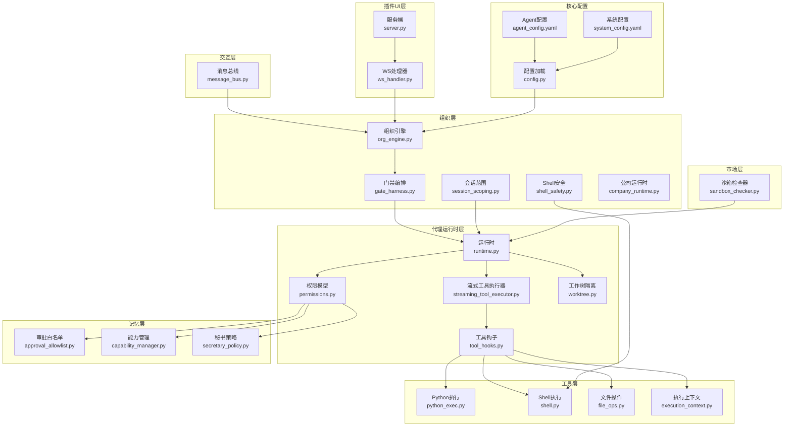

**图表来源**
- [message_bus.py](file://opc/layer1_interaction/message_bus.py)
- [session_scoping.py](file://opc/layer2_organization/session_scoping.py)
- [shell_safety.py](file://opc/layer2_organization/shell_safety.py)
- [gate_harness.py](file://opc/layer2_organization/gate_harness.py)
- [org_engine.py](file://opc/layer2_organization/org_engine.py)
- [company_runtime.py](file://opc/layer2_organization/company_runtime.py)
- [permissions.py](file://opc/layer3_agent/runtime_v2/permissions.py)
- [runtime.py](file://opc/layer3_agent/runtime_v2/runtime.py)
- [streaming_tool_executor.py](file://opc/layer3_agent/runtime_v2/streaming_tool_executor.py)
- [tool_hooks.py](file://opc/layer3_agent/runtime_v2/tool_hooks.py)
- [worktree.py](file://opc/layer3_agent/runtime_v2/worktree.py)
- [python_exec.py](file://opc/layer4_tools/python_exec.py)
- [shell.py](file://opc/layer4_tools/shell.py)
- [file_ops.py](file://opc/layer4_tools/file_ops.py)
- [execution_context.py](file://opc/layer4_tools/execution_context.py)
- [approval_allowlist.py](file://opc/layer5_memory/approval_allowlist.py)
- [capability_manager.py](file://opc/layer5_memory/capability_manager.py)
- [secretary_policy.py](file://opc/layer5_memory/secretary_policy.py)
- [server.py](file://opc/plugins/office_ui/server.py)
- [ws_handler.py](file://opc/plugins/office_ui/ws_handler.py)
- [config.py](file://opc/core/config.py)
- [agent_config.yaml](file://config/agent_config.yaml)
- [system_config.yaml](file://config/system_config.yaml)
- [sandbox_checker.py](file://opc/market/sandbox_checker.py)

**章节来源**
- [message_bus.py](file://opc/layer1_interaction/message_bus.py)
- [session_scoping.py](file://opc/layer2_organization/session_scoping.py)
- [shell_safety.py](file://opc/layer2_organization/shell_safety.py)
- [gate_harness.py](file://opc/layer2_organization/gate_harness.py)
- [org_engine.py](file://opc/layer2_organization/org_engine.py)
- [company_runtime.py](file://opc/layer2_organization/company_runtime.py)
- [permissions.py](file://opc/layer3_agent/runtime_v2/permissions.py)
- [runtime.py](file://opc/layer3_agent/runtime_v2/runtime.py)
- [streaming_tool_executor.py](file://opc/layer3_agent/runtime_v2/streaming_tool_executor.py)
- [tool_hooks.py](file://opc/layer3_agent/runtime_v2/tool_hooks.py)
- [worktree.py](file://opc/layer3_agent/runtime_v2/worktree.py)
- [python_exec.py](file://opc/layer4_tools/python_exec.py)
- [shell.py](file://opc/layer4_tools/shell.py)
- [file_ops.py](file://opc/layer4_tools/file_ops.py)
- [execution_context.py](file://opc/layer4_tools/execution_context.py)
- [approval_allowlist.py](file://opc/layer5_memory/approval_allowlist.py)
- [capability_manager.py](file://opc/layer5_memory/capability_manager.py)
- [secretary_policy.py](file://opc/layer5_memory/secretary_policy.py)
- [server.py](file://opc/plugins/office_ui/server.py)
- [ws_handler.py](file://opc/plugins/office_ui/ws_handler.py)
- [config.py](file://opc/core/config.py)
- [agent_config.yaml](file://config/agent_config.yaml)
- [system_config.yaml](file://config/system_config.yaml)
- [sandbox_checker.py](file://opc/market/sandbox_checker.py)

## 核心组件
本节聚焦安全边界的关键组件及其职责：
- 权限模型与能力管理：集中定义主体、客体、动作与策略，支撑最小权限原则与动态授权
- 工具钩子与执行器：在调用外部能力前进行策略校验、参数清洗、资源限制与审计
- Shell与Python执行器：提供受限执行环境，包含命令白名单、超时、内存/CPU限制、输出过滤
- 文件操作与工作树隔离：基于工作树路径约束与读写白名单，防止越权访问
- 会话范围与公司模式：限定会话可见性与跨会话共享边界，确保上下文隔离
- 审批白名单与秘书策略：对高风险操作引入审批流与默认拒绝策略
- 网关编排与公司运行时：串联各安全门控点，统一编排策略执行顺序
- 沙箱检查器：在包/技能安装或更新时进行静态安全检查
- 配置加载：从YAML与核心配置中读取安全策略参数

**章节来源**
- [permissions.py](file://opc/layer3_agent/runtime_v2/permissions.py)
- [capability_manager.py](file://opc/layer5_memory/capability_manager.py)
- [tool_hooks.py](file://opc/layer3_agent/runtime_v2/tool_hooks.py)
- [streaming_tool_executor.py](file://opc/layer3_agent/runtime_v2/streaming_tool_executor.py)
- [python_exec.py](file://opc/layer4_tools/python_exec.py)
- [shell.py](file://opc/layer4_tools/shell.py)
- [file_ops.py](file://opc/layer4_tools/file_ops.py)
- [worktree.py](file://opc/layer3_agent/runtime_v2/worktree.py)
- [session_scoping.py](file://opc/layer2_organization/session_scoping.py)
- [approval_allowlist.py](file://opc/layer5_memory/approval_allowlist.py)
- [secretary_policy.py](file://opc/layer5_memory/secretary_policy.py)
- [gate_harness.py](file://opc/layer2_organization/gate_harness.py)
- [company_runtime.py](file://opc/layer2_organization/company_runtime.py)
- [sandbox_checker.py](file://opc/market/sandbox_checker.py)
- [config.py](file://opc/core/config.py)
- [agent_config.yaml](file://config/agent_config.yaml)
- [system_config.yaml](file://config/system_config.yaml)

## 架构总览
下图展示一次受控工具调用的端到端流程，涵盖认证、授权、沙箱执行与审计：

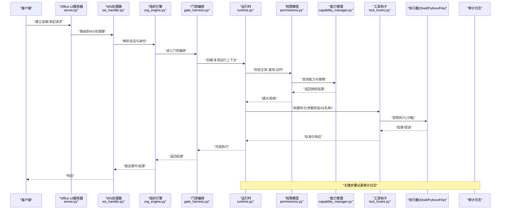

**图表来源**
- [server.py](file://opc/plugins/office_ui/server.py)
- [ws_handler.py](file://opc/plugins/office_ui/ws_handler.py)
- [org_engine.py](file://opc/layer2_organization/org_engine.py)
- [gate_harness.py](file://opc/layer2_organization/gate_harness.py)
- [runtime.py](file://opc/layer3_agent/runtime_v2/runtime.py)
- [permissions.py](file://opc/layer3_agent/runtime_v2/permissions.py)
- [capability_manager.py](file://opc/layer5_memory/capability_manager.py)
- [tool_hooks.py](file://opc/layer3_agent/runtime_v2/tool_hooks.py)
- [shell.py](file://opc/layer4_tools/shell.py)
- [python_exec.py](file://opc/layer4_tools/python_exec.py)
- [file_ops.py](file://opc/layer4_tools/file_ops.py)

## 详细组件分析

### 权限模型与能力管理
- 设计要点
  - 将“主体-客体-动作”抽象为统一的权限决策单元，支持细粒度策略
  - 能力管理器维护可用能力清单、版本与依赖，作为授权依据
  - 默认拒绝策略，显式允许才放行；支持按会话、角色、组织域进行策略裁剪
- 复杂度与扩展性
  - 策略匹配可采用缓存与索引优化，避免每次全量匹配
  - 支持策略热更新与灰度发布，降低变更风险
- 错误处理
  - 未命中策略或能力缺失时返回明确拒绝码，便于审计与告警

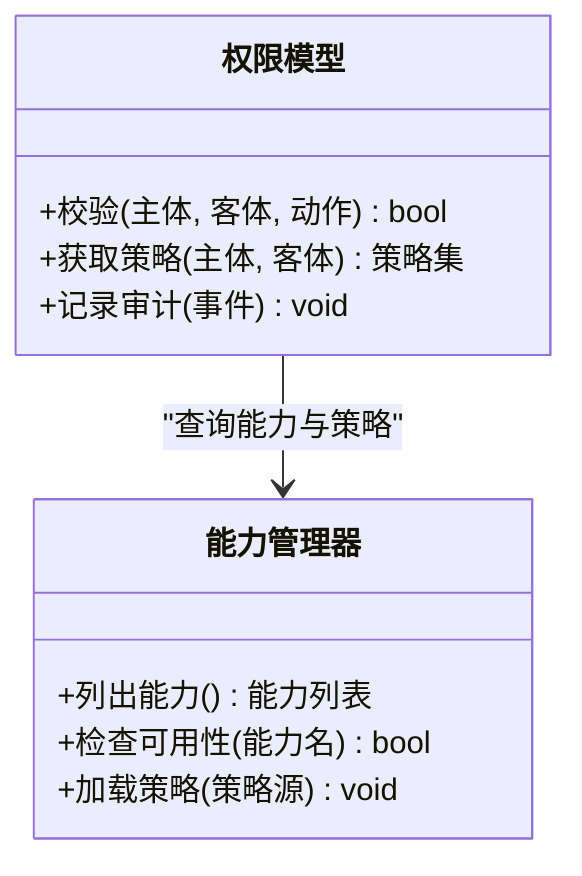

**图表来源**
- [permissions.py](file://opc/layer3_agent/runtime_v2/permissions.py)
- [capability_manager.py](file://opc/layer5_memory/capability_manager.py)

**章节来源**
- [permissions.py](file://opc/layer3_agent/runtime_v2/permissions.py)
- [capability_manager.py](file://opc/layer5_memory/capability_manager.py)

### 工具钩子与流式执行器
- 设计要点
  - 工具钩子在调用前后注入策略校验、参数清洗、资源限制与审计埋点
  - 流式执行器支持长任务进度上报与中断，提升用户体验与可控性
- 安全控制点
  - 参数白名单与类型校验，防止注入攻击
  - 执行超时、内存/CPU配额、输出大小限制
  - 敏感信息脱敏与日志采样

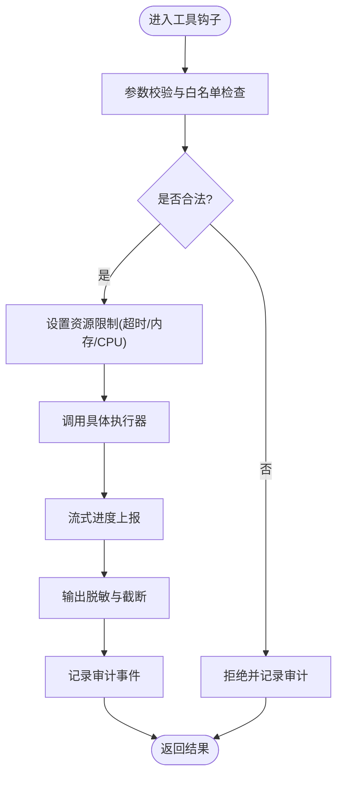

**图表来源**
- [tool_hooks.py](file://opc/layer3_agent/runtime_v2/tool_hooks.py)
- [streaming_tool_executor.py](file://opc/layer3_agent/runtime_v2/streaming_tool_executor.py)

**章节来源**
- [tool_hooks.py](file://opc/layer3_agent/runtime_v2/tool_hooks.py)
- [streaming_tool_executor.py](file://opc/layer3_agent/runtime_v2/streaming_tool_executor.py)

### Shell与Python执行器（沙箱）
- 设计要点
  - 命令白名单：仅允许预定义安全命令集合，其余一律拒绝
  - 执行环境隔离：独立进程、受限环境变量、只读文件系统映射
  - 资源限制：CPU/内存上限、最大输出长度、执行超时
  - 输入输出过滤：禁止回显敏感信息，过滤危险字符
- 典型流程

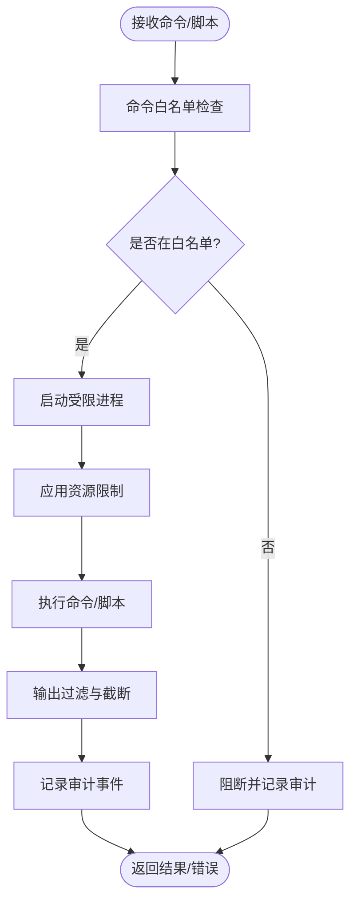

**图表来源**
- [shell.py](file://opc/layer4_tools/shell.py)
- [python_exec.py](file://opc/layer4_tools/python_exec.py)
- [shell_safety.py](file://opc/layer2_organization/shell_safety.py)

**章节来源**
- [shell.py](file://opc/layer4_tools/shell.py)
- [python_exec.py](file://opc/layer4_tools/python_exec.py)
- [shell_safety.py](file://opc/layer2_organization/shell_safety.py)

### 文件操作与工作树隔离
- 设计要点
  - 工作树隔离：每个会话/任务拥有独立根目录，禁止越界访问
  - 路径规范化与白名单：仅允许在指定目录下进行读写
  - 元数据保护：隐藏或只读系统文件、配置文件
- 流程图

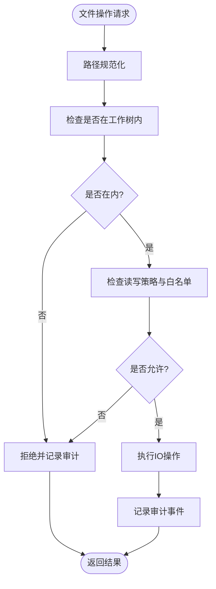

**图表来源**
- [file_ops.py](file://opc/layer4_tools/file_ops.py)
- [worktree.py](file://opc/layer3_agent/runtime_v2/worktree.py)

**章节来源**
- [file_ops.py](file://opc/layer4_tools/file_ops.py)
- [worktree.py](file://opc/layer3_agent/runtime_v2/worktree.py)

### 会话范围与公司模式
- 设计要点
  - 会话范围：限定会话可见的数据与工具，避免跨会话泄露
  - 公司模式：在组织上下文中执行，遵循组织级策略与所有权规则
- 关系图

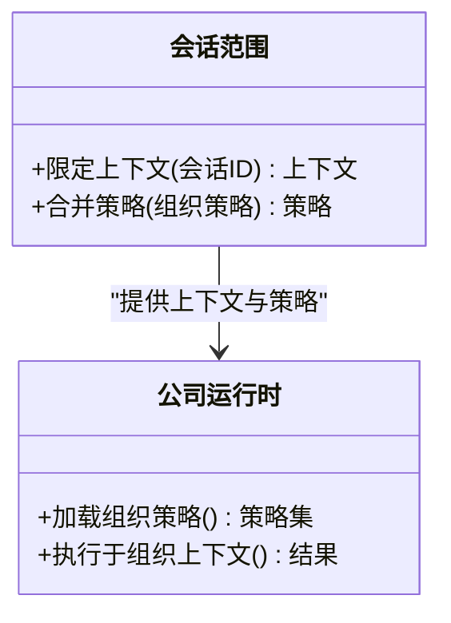

**图表来源**
- [session_scoping.py](file://opc/layer2_organization/session_scoping.py)
- [company_runtime.py](file://opc/layer2_organization/company_runtime.py)

**章节来源**
- [session_scoping.py](file://opc/layer2_organization/session_scoping.py)
- [company_runtime.py](file://opc/layer2_organization/company_runtime.py)

### 审批白名单与秘书策略
- 设计要点
  - 审批白名单：对高风险操作（如写系统目录、外发数据）强制审批
  - 秘书策略：默认拒绝、最小暴露面、渐进式授权
- 流程图

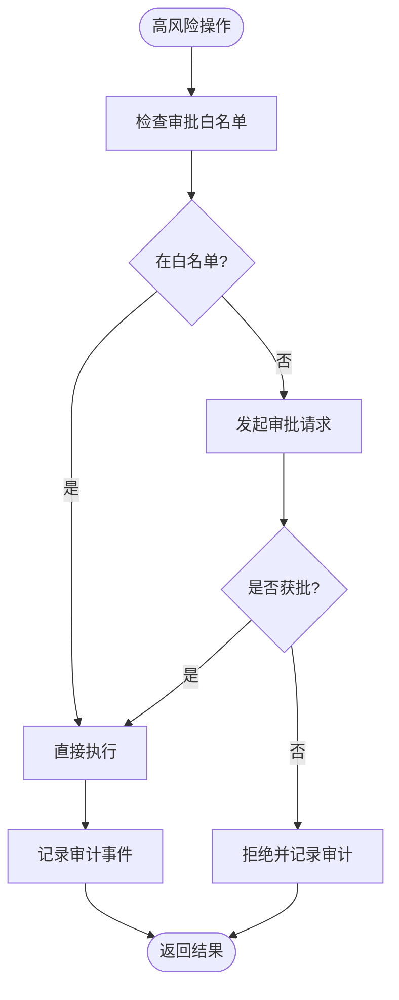

**图表来源**
- [approval_allowlist.py](file://opc/layer5_memory/approval_allowlist.py)
- [secretary_policy.py](file://opc/layer5_memory/secretary_policy.py)

**章节来源**
- [approval_allowlist.py](file://opc/layer5_memory/approval_allowlist.py)
- [secretary_policy.py](file://opc/layer5_memory/secretary_policy.py)

### 网关编排与公司运行时
- 设计要点
  - 门禁编排：串联身份验证、策略校验、资源限制、审计等门控点
  - 公司运行时：在组织策略下协调各组件，保证一致性与可追溯性
- 序列图

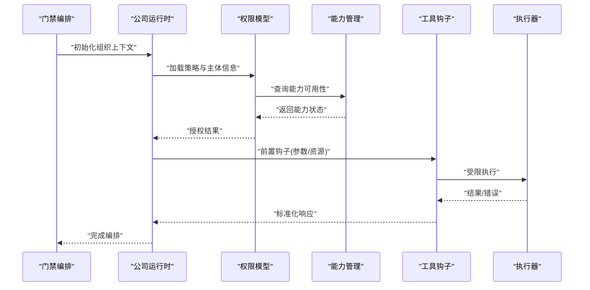

**图表来源**
- [gate_harness.py](file://opc/layer2_organization/gate_harness.py)
- [company_runtime.py](file://opc/layer2_organization/company_runtime.py)
- [permissions.py](file://opc/layer3_agent/runtime_v2/permissions.py)
- [capability_manager.py](file://opc/layer5_memory/capability_manager.py)
- [tool_hooks.py](file://opc/layer3_agent/runtime_v2/tool_hooks.py)

**章节来源**
- [gate_harness.py](file://opc/layer2_organization/gate_harness.py)
- [company_runtime.py](file://opc/layer2_organization/company_runtime.py)
- [permissions.py](file://opc/layer3_agent/runtime_v2/permissions.py)
- [capability_manager.py](file://opc/layer5_memory/capability_manager.py)
- [tool_hooks.py](file://opc/layer3_agent/runtime_v2/tool_hooks.py)

### 沙箱检查器（包/技能安全）
- 设计要点
  - 静态检查：导入依赖、危险API调用、网络访问、文件写入等
  - 风险评分与拦截：超过阈值则拒绝安装或要求人工审核
- 流程图

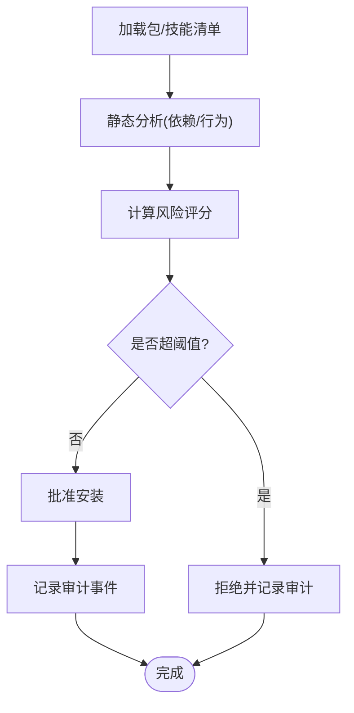

**图表来源**
- [sandbox_checker.py](file://opc/market/sandbox_checker.py)

**章节来源**
- [sandbox_checker.py](file://opc/market/sandbox_checker.py)

### 认证授权流程、会话管理与令牌机制
- 认证
  - 通过UI服务与WS处理器建立可信通道，建议启用TLS与双向认证
  - 用户/主体身份在进入组织引擎前完成校验
- 授权
  - 权限模型与能力管理共同决定主体对客体的访问权限
  - 默认拒绝，显式允许；支持按会话、角色、组织域裁剪
- 会话与令牌
  - 会话范围限定上下文可见性，避免跨会话泄露
  - 令牌用于短期访问凭证，具备过期时间与最小权限绑定
- 序列图

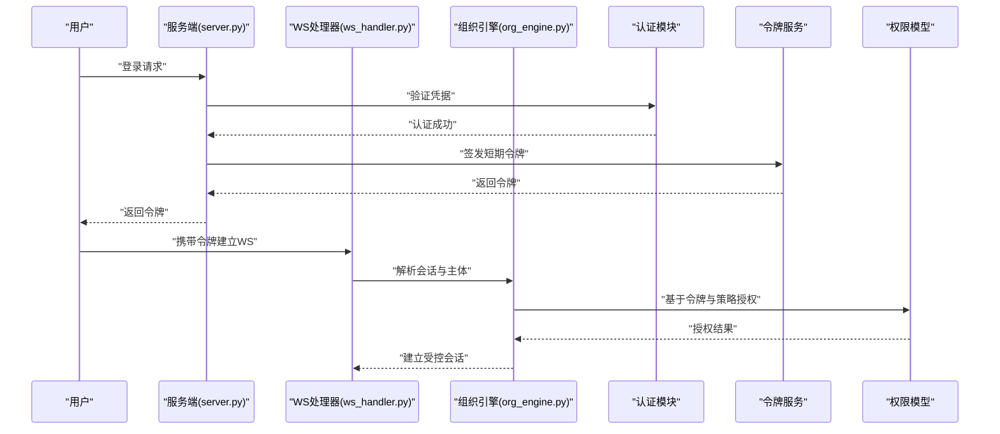

**图表来源**
- [server.py](file://opc/plugins/office_ui/server.py)
- [ws_handler.py](file://opc/plugins/office_ui/ws_handler.py)
- [org_engine.py](file://opc/layer2_organization/org_engine.py)
- [permissions.py](file://opc/layer3_agent/runtime_v2/permissions.py)

**章节来源**
- [server.py](file://opc/plugins/office_ui/server.py)
- [ws_handler.py](file://opc/plugins/office_ui/ws_handler.py)
- [org_engine.py](file://opc/layer2_organization/org_engine.py)
- [permissions.py](file://opc/layer3_agent/runtime_v2/permissions.py)

## 依赖分析
安全相关组件的耦合与协作如下：

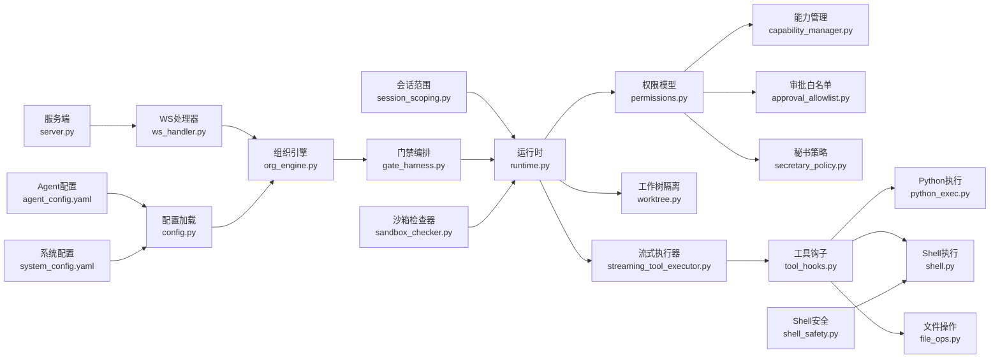

**图表来源**
- [permissions.py](file://opc/layer3_agent/runtime_v2/permissions.py)
- [capability_manager.py](file://opc/layer5_memory/capability_manager.py)
- [approval_allowlist.py](file://opc/layer5_memory/approval_allowlist.py)
- [secretary_policy.py](file://opc/layer5_memory/secretary_policy.py)
- [runtime.py](file://opc/layer3_agent/runtime_v2/runtime.py)
- [worktree.py](file://opc/layer3_agent/runtime_v2/worktree.py)
- [streaming_tool_executor.py](file://opc/layer3_agent/runtime_v2/streaming_tool_executor.py)
- [tool_hooks.py](file://opc/layer3_agent/runtime_v2/tool_hooks.py)
- [python_exec.py](file://opc/layer4_tools/python_exec.py)
- [shell.py](file://opc/layer4_tools/shell.py)
- [file_ops.py](file://opc/layer4_tools/file_ops.py)
- [shell_safety.py](file://opc/layer2_organization/shell_safety.py)
- [session_scoping.py](file://opc/layer2_organization/session_scoping.py)
- [gate_harness.py](file://opc/layer2_organization/gate_harness.py)
- [org_engine.py](file://opc/layer2_organization/org_engine.py)
- [server.py](file://opc/plugins/office_ui/server.py)
- [ws_handler.py](file://opc/plugins/office_ui/ws_handler.py)
- [config.py](file://opc/core/config.py)
- [agent_config.yaml](file://config/agent_config.yaml)
- [system_config.yaml](file://config/system_config.yaml)
- [sandbox_checker.py](file://opc/market/sandbox_checker.py)

**章节来源**
- [permissions.py](file://opc/layer3_agent/runtime_v2/permissions.py)
- [capability_manager.py](file://opc/layer5_memory/capability_manager.py)
- [approval_allowlist.py](file://opc/layer5_memory/approval_allowlist.py)
- [secretary_policy.py](file://opc/layer5_memory/secretary_policy.py)
- [runtime.py](file://opc/layer3_agent/runtime_v2/runtime.py)
- [worktree.py](file://opc/layer3_agent/runtime_v2/worktree.py)
- [streaming_tool_executor.py](file://opc/layer3_agent/runtime_v2/streaming_tool_executor.py)
- [tool_hooks.py](file://opc/layer3_agent/runtime_v2/tool_hooks.py)
- [python_exec.py](file://opc/layer4_tools/python_exec.py)
- [shell.py](file://opc/layer4_tools/shell.py)
- [file_ops.py](file://opc/layer4_tools/file_ops.py)
- [shell_safety.py](file://opc/layer2_organization/shell_safety.py)
- [session_scoping.py](file://opc/layer2_organization/session_scoping.py)
- [gate_harness.py](file://opc/layer2_organization/gate_harness.py)
- [org_engine.py](file://opc/layer2_organization/org_engine.py)
- [server.py](file://opc/plugins/office_ui/server.py)
- [ws_handler.py](file://opc/plugins/office_ui/ws_handler.py)
- [config.py](file://opc/core/config.py)
- [agent_config.yaml](file://config/agent_config.yaml)
- [system_config.yaml](file://config/system_config.yaml)
- [sandbox_checker.py](file://opc/market/sandbox_checker.py)

## 性能考虑
- 策略缓存：对高频策略匹配结果进行缓存，减少重复计算
- 异步与流式：长任务使用流式执行器，降低阻塞与内存峰值
- 资源限制：合理设置CPU/内存/超时阈值，避免资源耗尽
- 日志采样：对高吞吐场景采用采样与聚合，降低I/O压力
- 批处理：批量文件操作合并，减少系统调用次数

[本节为通用指导，不直接分析具体文件]

## 故障排查指南
- 常见问题定位
  - 权限拒绝：检查权限模型与能力管理策略是否覆盖目标操作
  - 命令被拒：确认命令是否在Shell白名单中，检查shell_safety策略
  - 文件越界：检查工作树隔离与路径规范化逻辑
  - 执行超时/内存不足：调整资源限制与执行器参数
  - 审批卡住：检查审批白名单与秘书策略配置
- 调试建议
  - 开启详细审计日志，关注关键决策点
  - 复现最小用例，逐步关闭策略以定位冲突
  - 使用沙箱检查器对新增包/技能进行预检

**章节来源**
- [shell_safety.py](file://opc/layer2_organization/shell_safety.py)
- [permissions.py](file://opc/layer3_agent/runtime_v2/permissions.py)
- [capability_manager.py](file://opc/layer5_memory/capability_manager.py)
- [file_ops.py](file://opc/layer4_tools/file_ops.py)
- [worktree.py](file://opc/layer3_agent/runtime_v2/worktree.py)
- [approval_allowlist.py](file://opc/layer5_memory/approval_allowlist.py)
- [secretary_policy.py](file://opc/layer5_memory/secretary_policy.py)
- [sandbox_checker.py](file://opc/market/sandbox_checker.py)

## 结论
OpenOPC通过分层设计与多门控点协同，构建了较为完善的安全边界体系。权限模型与能力管理提供细粒度授权基础，工具钩子与执行器保障受限执行，文件与工作树隔离防止越权访问，会话范围与公司模式确保上下文隔离，审批与秘书策略强化风险控制，沙箱检查器提升供应链安全。配合合理的配置与审计，可满足企业级安全与合规需求。

[本节为总结性内容，不直接分析具体文件]

## 附录

### 安全配置指南
- 防火墙规则
  - 仅开放必要端口（如HTTPS/WS），限制来源IP段
  - 内部服务间通信使用mTLS与网络分段
- 网络隔离
  - 将执行沙箱置于独立网段，限制出站访问
  - 数据库与存储仅允许内部访问
- 审计日志
  - 记录认证、授权、执行、文件访问、审批事件
  - 集中收集与长期留存，支持检索与告警
- 密钥与证书管理
  - 使用密钥管理服务，定期轮换
  - 最小化证书分发范围

[本节为通用指导，不直接分析具体文件]

### 威胁防护策略、漏洞扫描与安全评估
- 威胁建模：识别资产、攻击面与潜在威胁，制定缓解措施
- 漏洞扫描：对依赖库、容器镜像、代码进行定期扫描
- 安全评估：渗透测试、红蓝对抗、第三方审计
- 持续改进：将发现纳入策略与配置基线，闭环整改

[本节为通用指导，不直接分析具体文件]

### 合规性要求与数据保护措施
- 合规框架：参考ISO27001、NIST CSF、GDPR等
- 数据保护：加密传输与存储、最小化采集、数据脱敏
- 访问控制：基于角色的访问控制(RBAC)与属性访问控制(ABAC)结合
- 审计与问责：完整审计链，支持溯源与追责

[本节为通用指导，不直接分析具体文件]