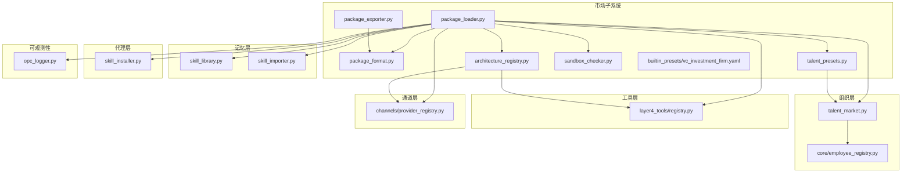
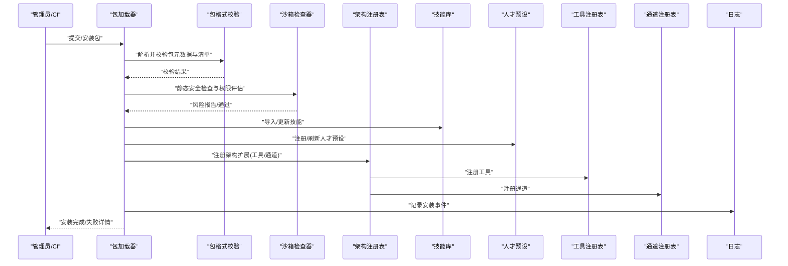
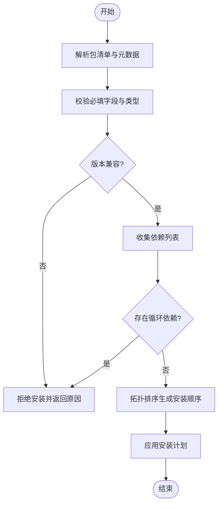
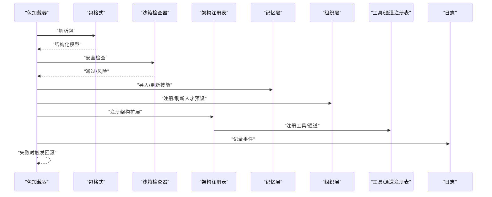
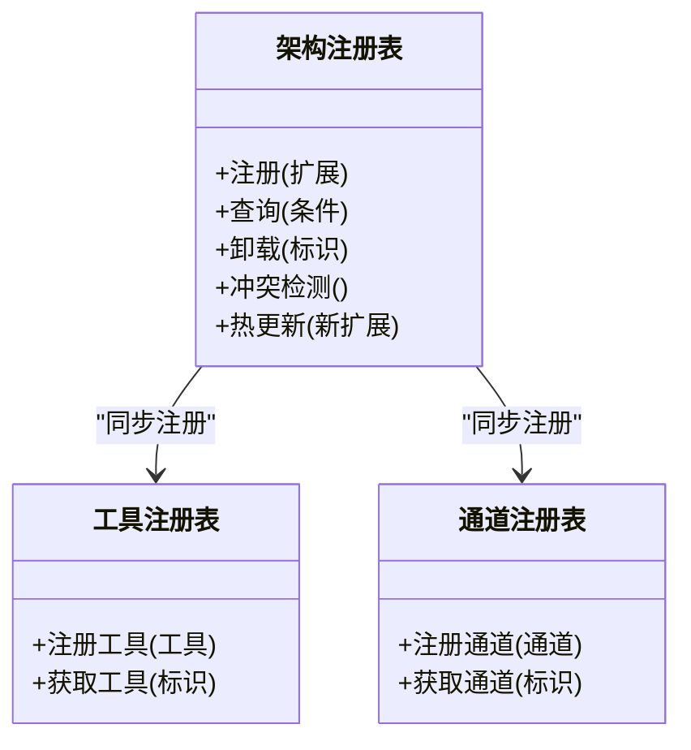
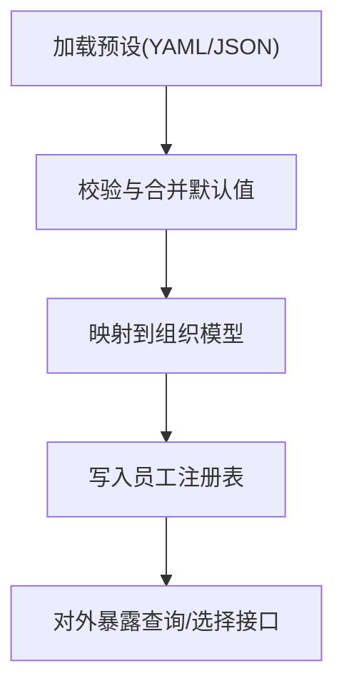
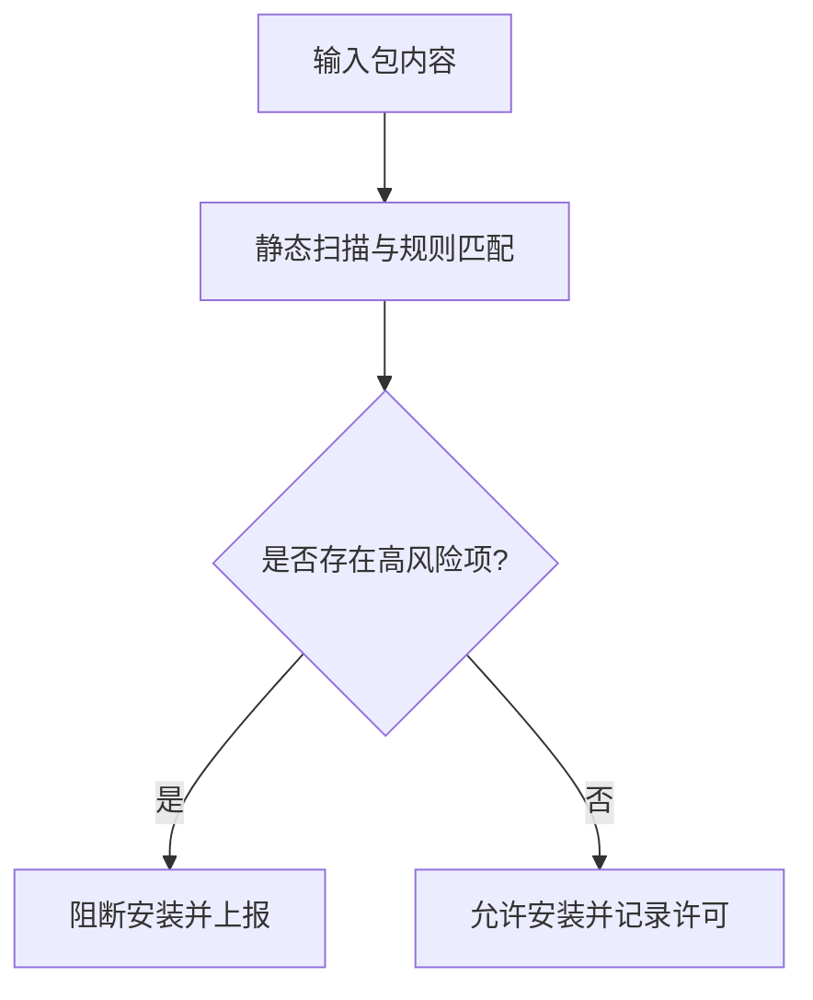
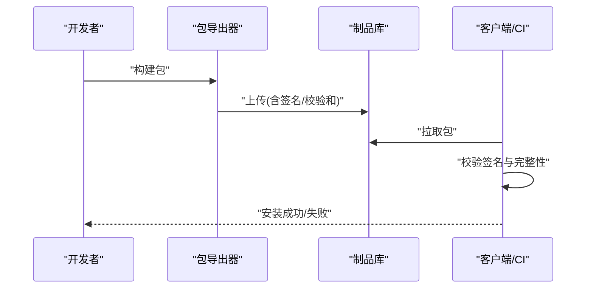
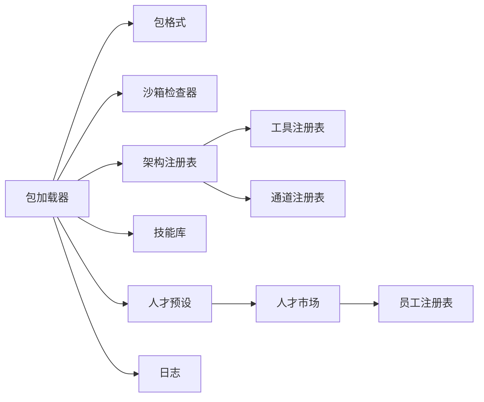

# 市场系统集成

<cite>
**本文引用的文件**   
- [opc/market/__init__.py](file://opc/market/__init__.py)
- [opc/market/package_loader.py](file://opc/market/package_loader.py)
- [opc/market/package_format.py](file://opc/market/package_format.py)
- [opc/market/architecture_registry.py](file://opc/market/architecture_registry.py)
- [opc/market/talent_presets.py](file://opc/market/talent_presets.py)
- [opc/market/sandbox_checker.py](file://opc/market/sandbox_checker.py)
- [opc/market/package_exporter.py](file://opc/market/package_exporter.py)
- [opc/market/builtin_presets/vc_investment_firm.yaml](file://opc/market/builtin_presets/vc_investment_firm.yaml)
- [opc/layer5_memory/skill_library.py](file://opc/layer5_memory/skill_library.py)
- [opc/layer5_memory/skill_importer.py](file://opc/layer5_memory/skill_importer.py)
- [opc/layer3_agent/skill_installer.py](file://opc/layer3_agent/skill_installer.py)
- [opc/core/employee_registry.py](file://opc/core/employee_registry.py)
- [opc/layer2_organization/talent_market.py](file://opc/layer2_organization/talent_market.py)
- [opc/layer4_tools/registry.py](file://opc/layer4_tools/registry.py)
- [opc/channels/provider_registry.py](file://opc/channels/provider_registry.py)
- [opc/layer3_agent/adapters/registry.py](file://opc/layer3_agent/adapters/registry.py)
- [opc/layer6_observability/opc_logger.py](file://opc/layer6_observability/opc_logger.py)
</cite>

## 目录
1. [简介](#简介)
2. [项目结构](#项目结构)
3. [核心组件](#核心组件)
4. [架构总览](#架构总览)
5. [详细组件分析](#详细组件分析)
6. [依赖关系分析](#依赖关系分析)
7. [性能考虑](#性能考虑)
8. [故障排查指南](#故障排查指南)
9. [结论](#结论)
10. [附录](#附录)

## 简介
本技术文档围绕 OpenOPC 的“市场系统”进行系统化说明，重点覆盖以下能力：
- 技能包加载机制与生命周期管理
- 架构注册表管理与扩展点
- 人才预设系统与组织角色编排
- 包格式规范、版本兼容性检查与依赖解析算法
- 第三方扩展开发指南（包结构模板、元数据定义、发布流程）
- 包验证机制、安全沙箱执行与权限控制策略
- 缓存机制、更新策略与回滚方案

目标读者包括平台集成工程师、第三方扩展开发者以及企业运维人员。

## 项目结构
市场系统位于 opc/market 目录，并与记忆层、组织层、工具层、通道层等模块协作，形成“发现—校验—安装—注册—运行—可观测”的闭环。

图表来源
- [opc/market/package_loader.py](file://opc/market/package_loader.py)
- [opc/market/package_format.py](file://opc/market/package_format.py)
- [opc/market/architecture_registry.py](file://opc/market/architecture_registry.py)
- [opc/market/talent_presets.py](file://opc/market/talent_presets.py)
- [opc/market/sandbox_checker.py](file://opc/market/sandbox_checker.py)
- [opc/market/package_exporter.py](file://opc/market/package_exporter.py)
- [opc/market/builtin_presets/vc_investment_firm.yaml](file://opc/market/builtin_presets/vc_investment_firm.yaml)
- [opc/layer5_memory/skill_library.py](file://opc/layer5_memory/skill_library.py)
- [opc/layer5_memory/skill_importer.py](file://opc/layer5_memory/skill_importer.py)
- [opc/layer3_agent/skill_installer.py](file://opc/layer3_agent/skill_installer.py)
- [opc/core/employee_registry.py](file://opc/core/employee_registry.py)
- [opc/layer2_organization/talent_market.py](file://opc/layer2_organization/talent_market.py)
- [opc/layer4_tools/registry.py](file://opc/layer4_tools/registry.py)
- [opc/channels/provider_registry.py](file://opc/channels/provider_registry.py)
- [opc/layer6_observability/opc_logger.py](file://opc/layer6_observability/opc_logger.py)

章节来源
- [opc/market/__init__.py](file://opc/market/__init__.py)

## 核心组件
- 包加载器：负责包的发现、读取、校验、依赖解析、版本兼容检查、沙箱扫描、安装与注册。
- 包格式：定义包的元数据、清单、资源结构与约束。
- 架构注册表：集中管理已安装的架构扩展（如工具、通道、适配器），提供查询与冲突检测。
- 人才预设：将“人才画像/角色配置”映射到运行时组织与岗位，支持内置与外部预设。
- 沙箱检查器：对包内脚本与资源进行静态安全检查与权限评估。
- 包导出器：用于打包、签名与分发。

章节来源
- [opc/market/package_loader.py](file://opc/market/package_loader.py)
- [opc/market/package_format.py](file://opc/market/package_format.py)
- [opc/market/architecture_registry.py](file://opc/market/architecture_registry.py)
- [opc/market/talent_presets.py](file://opc/market/talent_presets.py)
- [opc/market/sandbox_checker.py](file://opc/market/sandbox_checker.py)
- [opc/market/package_exporter.py](file://opc/market/package_exporter.py)

## 架构总览
市场子系统通过“包”作为最小交付单元，向上暴露统一接口，向下对接记忆库、组织引擎、工具与通道注册中心，并通过日志系统进行可观测性记录。

图表来源
- [opc/market/package_loader.py](file://opc/market/package_loader.py)
- [opc/market/package_format.py](file://opc/market/package_format.py)
- [opc/market/sandbox_checker.py](file://opc/market/sandbox_checker.py)
- [opc/market/architecture_registry.py](file://opc/market/architecture_registry.py)
- [opc/layer5_memory/skill_library.py](file://opc/layer5_memory/skill_library.py)
- [opc/market/talent_presets.py](file://opc/market/talent_presets.py)
- [opc/layer4_tools/registry.py](file://opc/layer4_tools/registry.py)
- [opc/channels/provider_registry.py](file://opc/channels/provider_registry.py)
- [opc/layer6_observability/opc_logger.py](file://opc/layer6_observability/opc_logger.py)

## 详细组件分析

### 包格式规范与版本兼容性
- 包结构：包含元数据、清单、资源与可选的可执行内容；清单描述依赖、入口、权限与版本信息。
- 元数据字段：标识符、名称、版本、作者、许可证、描述、图标、入口点、依赖声明、权限要求、兼容性矩阵等。
- 版本语义：采用语义化版本，主版本不兼容变更，次版本向后兼容新增功能，修订版本仅修复问题。
- 兼容性检查：比较当前运行环境与包声明的最小/最大兼容范围，拒绝不满足条件的包。
- 依赖解析：基于声明式依赖图，进行拓扑排序与循环依赖检测，支持条件依赖与可选依赖。

图表来源
- [opc/market/package_format.py](file://opc/market/package_format.py)
- [opc/market/package_loader.py](file://opc/market/package_loader.py)

章节来源
- [opc/market/package_format.py](file://opc/market/package_format.py)
- [opc/market/package_loader.py](file://opc/market/package_loader.py)

### 包加载机制与安装流程
- 发现与读取：从本地或远程源定位包，按格式解析为内部模型。
- 校验与安全：调用包格式校验与沙箱检查器，输出风险项与建议。
- 依赖与安装：根据依赖图顺序安装技能、注册架构扩展、写入内存与持久化。
- 回滚策略：若安装中途失败，按逆序撤销已变更项，确保一致性。
- 可观测性：关键步骤记录审计日志，便于追踪与排障。

图表来源
- [opc/market/package_loader.py](file://opc/market/package_loader.py)
- [opc/market/package_format.py](file://opc/market/package_format.py)
- [opc/market/sandbox_checker.py](file://opc/market/sandbox_checker.py)
- [opc/market/architecture_registry.py](file://opc/market/architecture_registry.py)
- [opc/layer5_memory/skill_library.py](file://opc/layer5_memory/skill_library.py)
- [opc/market/talent_presets.py](file://opc/market/talent_presets.py)
- [opc/layer4_tools/registry.py](file://opc/layer4_tools/registry.py)
- [opc/channels/provider_registry.py](file://opc/channels/provider_registry.py)
- [opc/layer6_observability/opc_logger.py](file://opc/layer6_observability/opc_logger.py)

章节来源
- [opc/market/package_loader.py](file://opc/market/package_loader.py)
- [opc/layer5_memory/skill_library.py](file://opc/layer5_memory/skill_library.py)
- [opc/layer5_memory/skill_importer.py](file://opc/layer5_memory/skill_importer.py)
- [opc/layer3_agent/skill_installer.py](file://opc/layer3_agent/skill_installer.py)

### 架构注册表管理
- 职责：维护已注册的架构扩展（工具、通道、适配器），提供查询、去重、冲突检测与热更新。
- 注册契约：每个扩展需实现标准接口，声明能力标签、版本、权限与依赖。
- 冲突处理：同名扩展的版本优先级策略与降级路径。
- 与工具/通道注册表联动：在注册完成后同步到具体子注册表。

图表来源
- [opc/market/architecture_registry.py](file://opc/market/architecture_registry.py)
- [opc/layer4_tools/registry.py](file://opc/layer4_tools/registry.py)
- [opc/channels/provider_registry.py](file://opc/channels/provider_registry.py)

章节来源
- [opc/market/architecture_registry.py](file://opc/market/architecture_registry.py)
- [opc/layer4_tools/registry.py](file://opc/layer4_tools/registry.py)
- [opc/channels/provider_registry.py](file://opc/channels/provider_registry.py)

### 人才预设系统
- 作用：将“人才画像/角色配置”映射到运行时组织与岗位，驱动招聘、编排与任务分配。
- 数据来源：内置预设与外部包提供的 YAML/JSON 配置。
- 运行时集成：与员工注册表协同，提供按需创建、替换与回收能力。
- 示例：内置 VC 投资公司预设，展示典型岗位与协作策略。

图表来源
- [opc/market/talent_presets.py](file://opc/market/talent_presets.py)
- [opc/market/builtin_presets/vc_investment_firm.yaml](file://opc/market/builtin_presets/vc_investment_firm.yaml)
- [opc/core/employee_registry.py](file://opc/core/employee_registry.py)
- [opc/layer2_organization/talent_market.py](file://opc/layer2_organization/talent_market.py)

章节来源
- [opc/market/talent_presets.py](file://opc/market/talent_presets.py)
- [opc/market/builtin_presets/vc_investment_firm.yaml](file://opc/market/builtin_presets/vc_investment_firm.yaml)
- [opc/core/employee_registry.py](file://opc/core/employee_registry.py)
- [opc/layer2_organization/talent_market.py](file://opc/layer2_organization/talent_market.py)

### 安全沙箱执行与权限控制
- 静态检查：对包内脚本、资源进行白名单/黑名单规则匹配，识别高风险 API 与行为。
- 权限模型：声明式权限（文件系统、网络、进程、环境变量等），在安装前进行风险评估。
- 执行隔离：建议以受限环境运行第三方代码，限制系统调用与外部访问。
- 审计与告警：记录风险项与处置建议，支持阻断高危操作。

图表来源
- [opc/market/sandbox_checker.py](file://opc/market/sandbox_checker.py)
- [opc/layer6_observability/opc_logger.py](file://opc/layer6_observability/opc_logger.py)

章节来源
- [opc/market/sandbox_checker.py](file://opc/market/sandbox_checker.py)
- [opc/layer6_observability/opc_logger.py](file://opc/layer6_observability/opc_logger.py)

### 包导出与发布流程
- 导出：将技能、预设、清单与资源打包为标准化产物，附带签名与校验和。
- 发布：上传至仓库或制品库，供其他节点拉取与安装。
- 校验：安装端再次校验签名与完整性，防止篡改。

图表来源
- [opc/market/package_exporter.py](file://opc/market/package_exporter.py)
- [opc/market/package_format.py](file://opc/market/package_format.py)

章节来源
- [opc/market/package_exporter.py](file://opc/market/package_exporter.py)
- [opc/market/package_format.py](file://opc/market/package_format.py)

### 第三方扩展开发指南
- 包结构模板
  - 根目录：清单与元数据文件
  - 资源目录：脚本、配置文件、静态资源
  - 入口点：声明工具/通道/适配器的注册函数
  - 预设目录：YAML/JSON 人才预设
- 元数据定义
  - 必填：标识符、名称、版本、入口点、依赖、权限
  - 可选：作者、许可证、描述、图标、兼容性矩阵
- 发布流程
  - 本地构建与自检
  - 签名与校验和生成
  - 上传至制品库
  - 在 CI 中自动化测试与回归
- 最佳实践
  - 遵循最小权限原则
  - 明确声明依赖与版本范围
  - 提供回滚与降级策略
  - 完善日志与错误码

章节来源
- [opc/market/package_format.py](file://opc/market/package_format.py)
- [opc/market/package_exporter.py](file://opc/market/package_exporter.py)
- [opc/market/sandbox_checker.py](file://opc/market/sandbox_checker.py)

## 依赖关系分析
- 组件耦合
  - 包加载器强依赖包格式与沙箱检查器，弱依赖注册表与记忆层。
  - 架构注册表与工具/通道注册表解耦，通过统一接口同步。
  - 人才预设与组织层通过员工注册表交互。
- 外部依赖
  - 制品库/仓库用于包的存储与分发。
  - 日志系统用于审计与可观测性。
- 潜在环依赖
  - 依赖解析阶段进行循环检测，避免运行时环引用。

图表来源
- [opc/market/package_loader.py](file://opc/market/package_loader.py)
- [opc/market/package_format.py](file://opc/market/package_format.py)
- [opc/market/sandbox_checker.py](file://opc/market/sandbox_checker.py)
- [opc/market/architecture_registry.py](file://opc/market/architecture_registry.py)
- [opc/layer5_memory/skill_library.py](file://opc/layer5_memory/skill_library.py)
- [opc/market/talent_presets.py](file://opc/market/talent_presets.py)
- [opc/layer4_tools/registry.py](file://opc/layer4_tools/registry.py)
- [opc/channels/provider_registry.py](file://opc/channels/provider_registry.py)
- [opc/core/employee_registry.py](file://opc/core/employee_registry.py)
- [opc/layer2_organization/talent_market.py](file://opc/layer2_organization/talent_market.py)
- [opc/layer6_observability/opc_logger.py](file://opc/layer6_observability/opc_logger.py)

章节来源
- [opc/market/package_loader.py](file://opc/market/package_loader.py)
- [opc/market/architecture_registry.py](file://opc/market/architecture_registry.py)
- [opc/layer4_tools/registry.py](file://opc/layer4_tools/registry.py)
- [opc/channels/provider_registry.py](file://opc/channels/provider_registry.py)
- [opc/core/employee_registry.py](file://opc/core/employee_registry.py)
- [opc/layer2_organization/talent_market.py](file://opc/layer2_organization/talent_market.py)
- [opc/layer6_observability/opc_logger.py](file://opc/layer6_observability/opc_logger.py)

## 性能考虑
- 包解析与校验：对大清单与多依赖场景，建议增量解析与并行校验。
- 注册表查询：使用索引与缓存减少重复计算。
- 沙箱扫描：规则集分层与短路策略，降低扫描开销。
- 安装过程：批量写入与事务化更新，减少 I/O 抖动。
- 日志采样：在高吞吐场景下启用采样与异步落盘。

[本节为通用指导，无需源码引用]

## 故障排查指南
- 常见问题
  - 版本不兼容：检查包的兼容性矩阵与运行环境版本。
  - 依赖缺失或冲突：查看依赖解析日志与冲突检测结果。
  - 安全风险阻断：依据沙箱检查报告调整权限或替换高风险模块。
  - 注册失败：核对扩展接口实现与命名空间冲突。
- 诊断步骤
  - 查看安装事件与错误码
  - 复现最小包用例
  - 逐步禁用依赖定位问题
  - 启用更详细的日志级别
- 回滚与恢复
  - 使用安装快照与逆序撤销
  - 保留上一稳定版本以便快速回退

章节来源
- [opc/market/package_loader.py](file://opc/market/package_loader.py)
- [opc/market/sandbox_checker.py](file://opc/market/sandbox_checker.py)
- [opc/layer6_observability/opc_logger.py](file://opc/layer6_observability/opc_logger.py)

## 结论
OpenOPC 的市场系统以“包”为核心载体，结合严格的格式校验、沙箱安全与统一的注册表管理，实现了可扩展、可观测且可控的生态体系。通过完善的依赖解析、版本兼容与回滚策略，平台能够在保证稳定性的同时持续引入创新能力。第三方开发者应遵循最小权限与清晰依赖声明的最佳实践，以确保生态健康与长期演进。

[本节为总结性内容，无需源码引用]

## 附录
- 术语
  - 包：包含元数据、清单、资源与可选可执行内容的标准化交付单元。
  - 架构扩展：工具、通道、适配器等可被注册表管理的扩展点。
  - 人才预设：描述角色、能力与协作策略的配置集合。
- 参考
  - 内置预设示例：vc_investment_firm.yaml

章节来源
- [opc/market/builtin_presets/vc_investment_firm.yaml](file://opc/market/builtin_presets/vc_investment_firm.yaml)