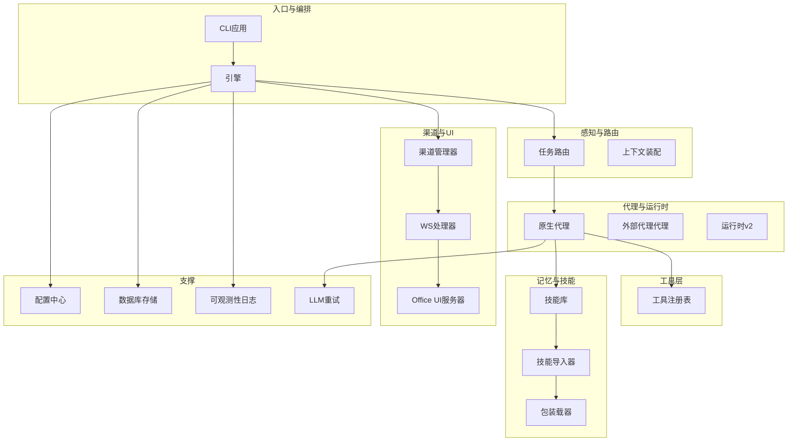
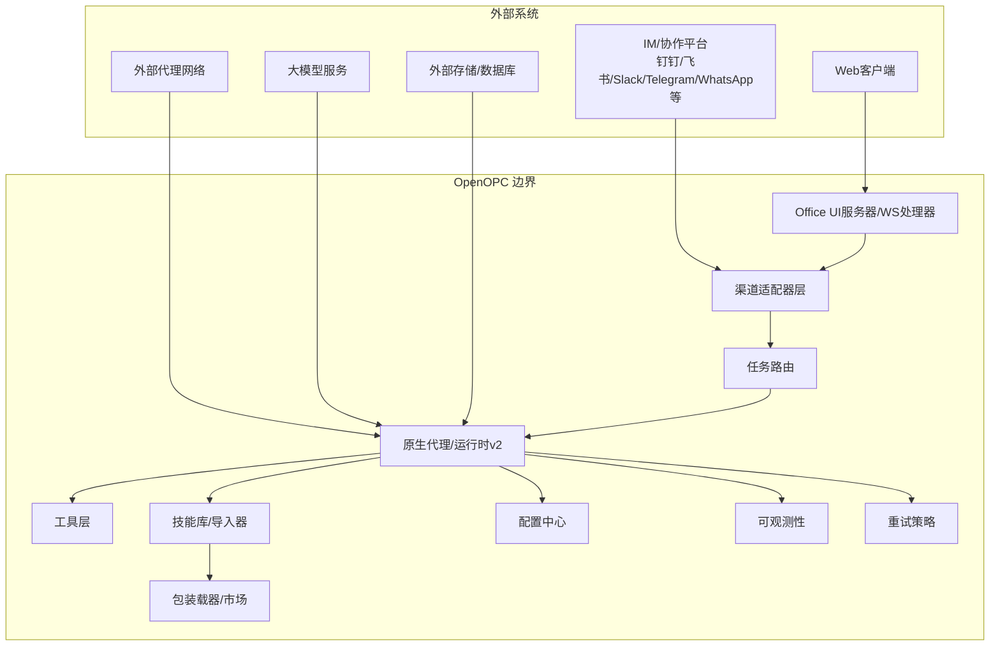
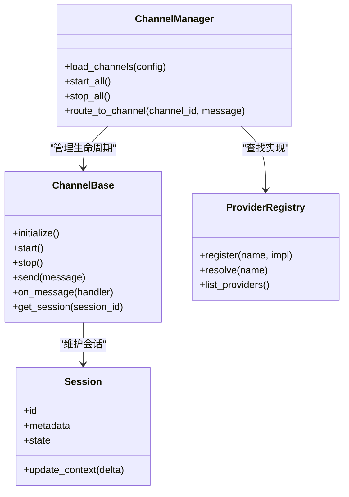
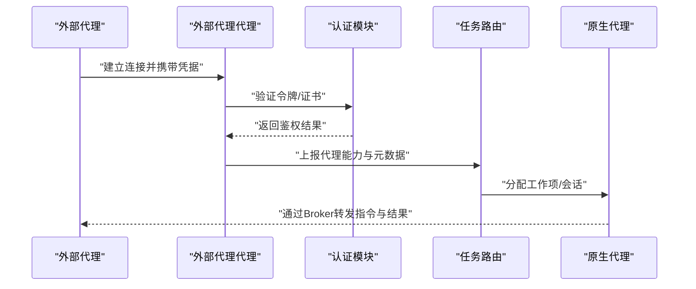
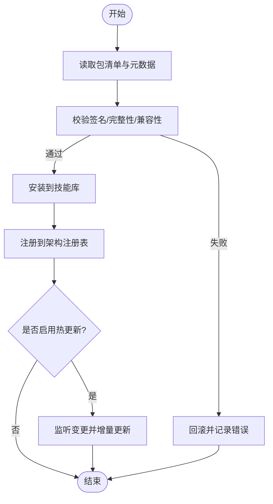
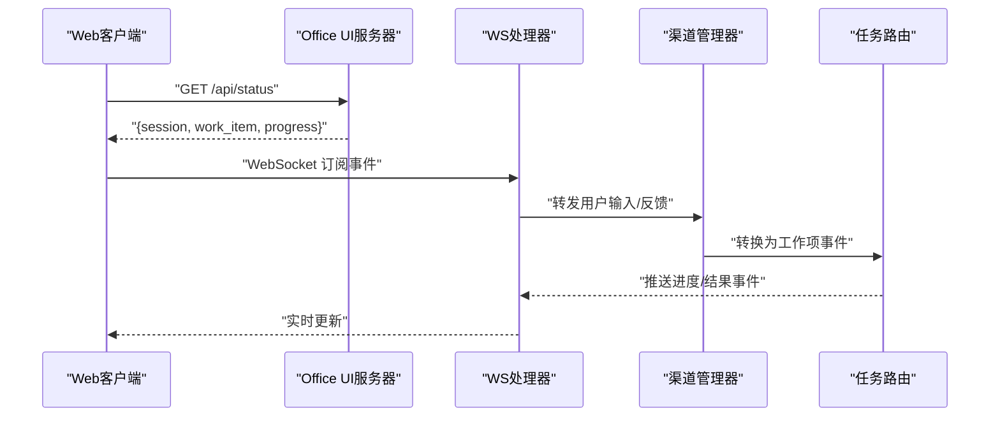
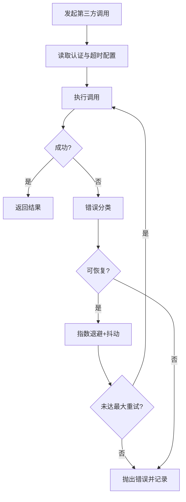
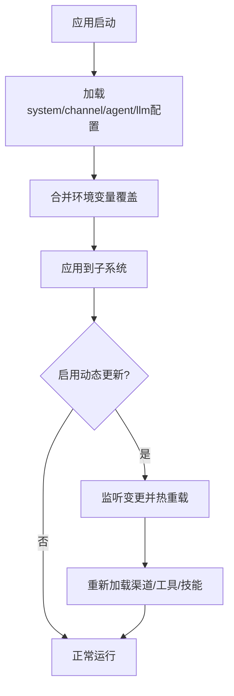
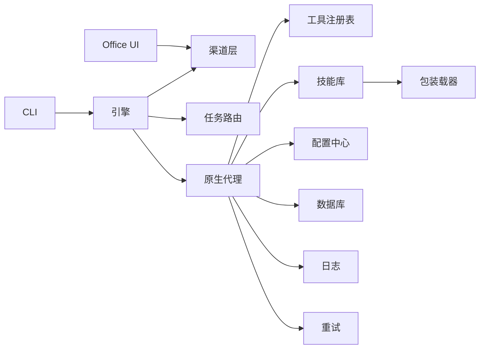

# 系统边界与集成

<cite>
**本文引用的文件**   
- [opc/engine.py](file://opc/engine.py)
- [opc/channels/manager.py](file://opc/channels/manager.py)
- [opc/channels/base.py](file://opc/channels/base.py)
- [opc/channels/provider_registry.py](file://opc/channels/provider_registry.py)
- [opc/channels/session.py](file://opc/channels/session.py)
- [opc/core/config.py](file://opc/core/config.py)
- [config/system_config.yaml](file://config/system_config.yaml)
- [config/channel_config.yaml](file://config/channel_config.yaml)
- [config/agent_config.yaml](file://config/agent_config.yaml)
- [config/llm_config.yaml](file://config/llm_config.yaml)
- [opc/layer1_perception/task_router.py](file://opc/layer1_perception/task_router.py)
- [opc/layer3_agent/native_agent.py](file://opc/layer3_agent/native_agent.py)
- [opc/layer3_agent/external_broker.py](file://opc/layer3_agent/external_broker.py)
- [opc/layer3_agent/skill_installer.py](file://opc/layer3_agent/skill_installer.py)
- [opc/market/package_loader.py](file://opc/market/package_loader.py)
- [opc/market/package_format.py](file://opc/market/package_format.py)
- [opc/market/architecture_registry.py](file://opc/market/architecture_registry.py)
- [opc/layer5_memory/skill_library.py](file://opc/layer5_memory/skill_library.py)
- [opc/layer5_memory/skill_importer.py](file://opc/layer5_memory/skill_importer.py)
- [opc/layer4_tools/registry.py](file://opc/layer4_tools/registry.py)
- [opc/layer6_observability/opc_logger.py](file://opc/layer6_observability/opc_logger.py)
- [opc/llm/retry.py](file://opc/llm/retry.py)
- [opc/plugins/office_ui/server.py](file://opc/plugins/office_ui/server.py)
- [opc/plugins/office_ui/ws_handler.py](file://opc/plugins/office_ui/ws_handler.py)
- [opc/cli/app.py](file://opc/cli/app.py)
- [opc/database/store.py](file://opc/database/store.py)
- [opc/layer0_interaction/message_bus.py](file://opc/layer0_interaction/message_bus.py)
</cite>

## 目录
1. [简介](#简介)
2. [项目结构](#项目结构)
3. [核心组件](#核心组件)
4. [架构总览](#架构总览)
5. [详细组件分析](#详细组件分析)
6. [依赖分析](#依赖分析)
7. [性能考虑](#性能考虑)
8. [故障排查指南](#故障排查指南)
9. [结论](#结论)
10. [附录](#附录)

## 简介
本文件聚焦OpenOPC的系统边界与集成，明确内部边界与外部接口，覆盖通信渠道集成、外部代理接入、技能包加载等扩展点；定义API契约、协议适配器与安全边界控制；说明第三方服务集成的认证机制、错误处理与重试策略；并提供系统上下文图与集成架构图，展示与外部系统的交互边界。同时阐述配置管理策略、环境变量注入与动态配置更新机制。

## 项目结构
OpenOPC采用分层与插件化组织：
- 入口与编排：引擎与CLI
- 感知与路由：任务路由、上下文装配
- 组织与执行：公司模式、工作项生命周期、阶段钩子
- 代理与运行时：原生代理、外部代理、运行时v2
- 工具层：可注册工具集合（文件系统、Git、Shell、协作等）
- 记忆与技能：持久化、技能库与导入器
- 可观测性：日志与成本追踪
- LLM适配：提供者抽象与重试
- 市场与包：技能/架构包的装载与校验
- 渠道与UI：多通道消息桥接与Web UI
- 配置与数据库：集中配置与持久化存储

图表来源
- [opc/engine.py:1-200](file://opc/engine.py#L1-L200)
- [opc/channels/manager.py:1-200](file://opc/channels/manager.py#L1-L200)
- [opc/layer1_perception/task_router.py:1-200](file://opc/layer1_perception/task_router.py#L1-L200)
- [opc/layer3_agent/native_agent.py:1-200](file://opc/layer3_agent/native_agent.py#L1-L200)
- [opc/layer5_memory/skill_library.py:1-200](file://opc/layer5_memory/skill_library.py#L1-L200)
- [opc/layer5_memory/skill_importer.py:1-200](file://opc/layer5_memory/skill_importer.py#L1-L200)
- [opc/market/package_loader.py:1-200](file://opc/market/package_loader.py#L1-L200)
- [opc/plugins/office_ui/server.py:1-200](file://opc/plugins/office_ui/server.py#L1-L200)
- [opc/plugins/office_ui/ws_handler.py:1-200](file://opc/plugins/office_ui/ws_handler.py#L1-L200)
- [opc/core/config.py:1-200](file://opc/core/config.py#L1-L200)
- [opc/database/store.py:1-200](file://opc/database/store.py#L1-L200)
- [opc/layer6_observability/opc_logger.py:1-200](file://opc/layer6_observability/opc_logger.py#L1-L200)
- [opc/llm/retry.py:1-200](file://opc/llm/retry.py#L1-L200)

章节来源
- [opc/engine.py:1-200](file://opc/engine.py#L1-L200)
- [opc/channels/manager.py:1-200](file://opc/channels/manager.py#L1-L200)
- [opc/layer1_perception/task_router.py:1-200](file://opc/layer1_perception/task_router.py#L1-L200)
- [opc/layer3_agent/native_agent.py:1-200](file://opc/layer3_agent/native_agent.py#L1-L200)
- [opc/layer5_memory/skill_library.py:1-200](file://opc/layer5_memory/skill_library.py#L1-L200)
- [opc/layer5_memory/skill_importer.py:1-200](file://opc/layer5_memory/skill_importer.py#L1-L200)
- [opc/market/package_loader.py:1-200](file://opc/market/package_loader.py#L1-L200)
- [opc/plugins/office_ui/server.py:1-200](file://opc/plugins/office_ui/server.py#L1-L200)
- [opc/plugins/office_ui/ws_handler.py:1-200](file://opc/plugins/office_ui/ws_handler.py#L1-L200)
- [opc/core/config.py:1-200](file://opc/core/config.py#L1-L200)
- [opc/database/store.py:1-200](file://opc/database/store.py#L1-L200)
- [opc/layer6_observability/opc_logger.py:1-200](file://opc/layer6_observability/opc_logger.py#L1-L200)
- [opc/llm/retry.py:1-200](file://opc/llm/retry.py#L1-L200)

## 核心组件
- 引擎与CLI：负责进程启动、生命周期管理、子系统初始化与退出清理。
- 渠道管理器：统一接入多种IM/协作平台，提供会话与消息路由。
- 任务路由：将外部消息解析为内部工作项或对话轮次。
- 原生代理与外部代理：前者驱动本地运行时代码执行，后者对接外部代理网络。
- 工具注册表：集中注册与发现可执行工具。
- 技能库与导入器：加载、缓存与热更新技能包。
- 包装载器与市场：校验与装载技能/架构包。
- Office UI服务器与WS处理器：提供Web界面与实时事件推送。
- 配置中心：集中读取YAML与环境变量，支持动态刷新。
- 数据库存储：持久化会话、状态与快照。
- 可观测性与重试：结构化日志与幂等重试。

章节来源
- [opc/engine.py:1-200](file://opc/engine.py#L1-L200)
- [opc/channels/manager.py:1-200](file://opc/channels/manager.py#L1-L200)
- [opc/layer1_perception/task_router.py:1-200](file://opc/layer1_perception/task_router.py#L1-L200)
- [opc/layer3_agent/native_agent.py:1-200](file://opc/layer3_agent/native_agent.py#L1-L200)
- [opc/layer3_agent/external_broker.py:1-200](file://opc/layer3_agent/external_broker.py#L1-L200)
- [opc/layer4_tools/registry.py:1-200](file://opc/layer4_tools/registry.py#L1-L200)
- [opc/layer5_memory/skill_library.py:1-200](file://opc/layer5_memory/skill_library.py#L1-L200)
- [opc/layer5_memory/skill_importer.py:1-200](file://opc/layer5_memory/skill_importer.py#L1-L200)
- [opc/market/package_loader.py:1-200](file://opc/market/package_loader.py#L1-L200)
- [opc/plugins/office_ui/server.py:1-200](file://opc/plugins/office_ui/server.py#L1-L200)
- [opc/plugins/office_ui/ws_handler.py:1-200](file://opc/plugins/office_ui/ws_handler.py#L1-L200)
- [opc/core/config.py:1-200](file://opc/core/config.py#L1-L200)
- [opc/database/store.py:1-200](file://opc/database/store.py#L1-L200)
- [opc/layer6_observability/opc_logger.py:1-200](file://opc/layer6_observability/opc_logger.py#L1-L200)
- [opc/llm/retry.py:1-200](file://opc/llm/retry.py#L1-L200)

## 架构总览
下图展示OpenOPC与外部系统的交互边界：多渠道消息源、外部代理网络、第三方LLM与服务、Web客户端与持久化存储。

图表来源
- [opc/channels/manager.py:1-200](file://opc/channels/manager.py#L1-L200)
- [opc/layer1_perception/task_router.py:1-200](file://opc/layer1_perception/task_router.py#L1-L200)
- [opc/layer3_agent/native_agent.py:1-200](file://opc/layer3_agent/native_agent.py#L1-L200)
- [opc/layer3_agent/external_broker.py:1-200](file://opc/layer3_agent/external_broker.py#L1-L200)
- [opc/layer4_tools/registry.py:1-200](file://opc/layer4_tools/registry.py#L1-L200)
- [opc/layer5_memory/skill_library.py:1-200](file://opc/layer5_memory/skill_library.py#L1-L200)
- [opc/layer5_memory/skill_importer.py:1-200](file://opc/layer5_memory/skill_importer.py#L1-L200)
- [opc/market/package_loader.py:1-200](file://opc/market/package_loader.py#L1-L200)
- [opc/plugins/office_ui/server.py:1-200](file://opc/plugins/office_ui/server.py#L1-L200)
- [opc/plugins/office_ui/ws_handler.py:1-200](file://opc/plugins/office_ui/ws_handler.py#L1-L200)
- [opc/core/config.py:1-200](file://opc/core/config.py#L1-L200)
- [opc/layer6_observability/opc_logger.py:1-200](file://opc/layer6_observability/opc_logger.py#L1-L200)
- [opc/llm/retry.py:1-200](file://opc/llm/retry.py#L1-L200)

## 详细组件分析

### 通信渠道集成与协议适配器
- 渠道基类与注册表：定义统一的接收/发送/会话生命周期接口，并通过注册表动态发现与实例化具体渠道实现。
- 渠道管理器：负责渠道的启动、停止、会话绑定与消息分发。
- 会话抽象：跨渠道的会话标识、上下文与状态隔离。

图表来源
- [opc/channels/base.py:1-200](file://opc/channels/base.py#L1-L200)
- [opc/channels/provider_registry.py:1-200](file://opc/channels/provider_registry.py#L1-L200)
- [opc/channels/manager.py:1-200](file://opc/channels/manager.py#L1-L200)
- [opc/channels/session.py:1-200](file://opc/channels/session.py#L1-L200)

章节来源
- [opc/channels/base.py:1-200](file://opc/channels/base.py#L1-L200)
- [opc/channels/provider_registry.py:1-200](file://opc/channels/provider_registry.py#L1-L200)
- [opc/channels/manager.py:1-200](file://opc/channels/manager.py#L1-L200)
- [opc/channels/session.py:1-200](file://opc/channels/session.py#L1-L200)

### 外部代理接入与认证
- 外部代理代理：负责与外部代理网络的连接、心跳、鉴权与会话延续。
- 预检流程：在接入前进行能力探测、版本兼容性与安全策略检查。
- 身份映射：将外部代理身份映射到内部角色与工作项上下文。

图表来源
- [opc/layer3_agent/external_broker.py:1-200](file://opc/layer3_agent/external_broker.py#L1-L200)
- [opc/layer1_perception/task_router.py:1-200](file://opc/layer1_perception/task_router.py#L1-L200)
- [opc/layer3_agent/native_agent.py:1-200](file://opc/layer3_agent/native_agent.py#L1-L200)

章节来源
- [opc/layer3_agent/external_broker.py:1-200](file://opc/layer3_agent/external_broker.py#L1-L200)
- [opc/layer1_perception/task_router.py:1-200](file://opc/layer1_perception/task_router.py#L1-L200)
- [opc/layer3_agent/native_agent.py:1-200](file://opc/layer3_agent/native_agent.py#L1-L200)

### 技能包加载与扩展点
- 包格式与装载：定义技能/架构包的清单、校验与装载流程。
- 技能库与导入器：提供安装、升级、回滚与热更新能力。
- 架构注册表：记录可用架构与约束，供运行时选择。

图表来源
- [opc/market/package_format.py:1-200](file://opc/market/package_format.py#L1-L200)
- [opc/market/package_loader.py:1-200](file://opc/market/package_loader.py#L1-L200)
- [opc/layer5_memory/skill_library.py:1-200](file://opc/layer5_memory/skill_library.py#L1-L200)
- [opc/layer5_memory/skill_importer.py:1-200](file://opc/layer5_memory/skill_importer.py#L1-L200)
- [opc/market/architecture_registry.py:1-200](file://opc/market/architecture_registry.py#L1-L200)

章节来源
- [opc/market/package_format.py:1-200](file://opc/market/package_format.py#L1-L200)
- [opc/market/package_loader.py:1-200](file://opc/market/package_loader.py#L1-L200)
- [opc/layer5_memory/skill_library.py:1-200](file://opc/layer5_memory/skill_library.py#L1-L200)
- [opc/layer5_memory/skill_importer.py:1-200](file://opc/layer5_memory/skill_importer.py#L1-L200)
- [opc/market/architecture_registry.py:1-200](file://opc/market/architecture_registry.py#L1-L200)

### API契约定义（渠道与UI）
- 渠道消息契约：统一的消息结构、附件类型、会话标识与可见性标记。
- Office UI API：REST/WebSocket端点用于获取状态、提交反馈、触发操作与订阅进度。
- 错误与状态码：标准化错误对象与可恢复状态提示。

图表来源
- [opc/plugins/office_ui/server.py:1-200](file://opc/plugins/office_ui/server.py#L1-L200)
- [opc/plugins/office_ui/ws_handler.py:1-200](file://opc/plugins/office_ui/ws_handler.py#L1-L200)
- [opc/channels/manager.py:1-200](file://opc/channels/manager.py#L1-L200)
- [opc/layer1_perception/task_router.py:1-200](file://opc/layer1_perception/task_router.py#L1-L200)

章节来源
- [opc/plugins/office_ui/server.py:1-200](file://opc/plugins/office_ui/server.py#L1-L200)
- [opc/plugins/office_ui/ws_handler.py:1-200](file://opc/plugins/office_ui/ws_handler.py#L1-L200)
- [opc/channels/manager.py:1-200](file://opc/channels/manager.py#L1-L200)
- [opc/layer1_perception/task_router.py:1-200](file://opc/layer1_perception/task_router.py#L1-L200)

### 安全边界控制
- 渠道侧鉴权：对每个渠道的凭据与权限进行校验，限制可访问资源范围。
- 工具白名单：仅允许注册表中声明的工具被调用，防止任意命令执行。
- 沙箱与最小权限：按工作项粒度隔离执行环境，限制文件系统与网络访问。
- 审计与追踪：所有关键操作写入结构化日志，便于溯源与合规。

章节来源
- [opc/layer4_tools/registry.py:1-200](file://opc/layer4_tools/registry.py#L1-L200)
- [opc/layer6_observability/opc_logger.py:1-200](file://opc/layer6_observability/opc_logger.py#L1-L200)
- [opc/channels/base.py:1-200](file://opc/channels/base.py#L1-L200)

### 第三方服务集成（LLM与外部API）
- 重试策略：指数退避、抖动与最大重试次数，区分可恢复与不可恢复错误。
- 超时与熔断：请求级超时与全局熔断，避免雪崩。
- 认证注入：从配置中心读取密钥与令牌，注入到HTTP/SDK调用中。
- 错误分类：网络错误、限流、业务错误分别处理与告警。

图表来源
- [opc/llm/retry.py:1-200](file://opc/llm/retry.py#L1-L200)
- [opc/core/config.py:1-200](file://opc/core/config.py#L1-L200)

章节来源
- [opc/llm/retry.py:1-200](file://opc/llm/retry.py#L1-L200)
- [opc/core/config.py:1-200](file://opc/core/config.py#L1-L200)

### 配置管理策略、环境变量注入与动态更新
- 配置来源优先级：默认值 < YAML配置文件 < 环境变量 < 运行时注入。
- 集中读取：配置中心聚合各YAML文件并按键空间合并。
- 动态更新：监听配置变更事件，热重载渠道、工具与技能相关设置。
- 安全敏感项：密钥与令牌优先使用环境变量或受控配置源，避免硬编码。

图表来源
- [opc/core/config.py:1-200](file://opc/core/config.py#L1-L200)
- [config/system_config.yaml:1-200](file://config/system_config.yaml#L1-L200)
- [config/channel_config.yaml:1-200](file://config/channel_config.yaml#L1-L200)
- [config/agent_config.yaml:1-200](file://config/agent_config.yaml#L1-L200)
- [config/llm_config.yaml:1-200](file://config/llm_config.yaml#L1-L200)

章节来源
- [opc/core/config.py:1-200](file://opc/core/config.py#L1-L200)
- [config/system_config.yaml:1-200](file://config/system_config.yaml#L1-L200)
- [config/channel_config.yaml:1-200](file://config/channel_config.yaml#L1-L200)
- [config/agent_config.yaml:1-200](file://config/agent_config.yaml#L1-L200)
- [config/llm_config.yaml:1-200](file://config/llm_config.yaml#L1-L200)

## 依赖分析
- 入口依赖：CLI与引擎初始化各子系统，形成松耦合的依赖关系。
- 渠道与UI：通过WS与REST解耦前端与后端，降低耦合度。
- 代理与工具：通过注册表与契约减少直接依赖，提升可扩展性。
- 配置与存储：作为横切关注点被广泛引用，需保证一致性与可用性。

图表来源
- [opc/cli/app.py:1-200](file://opc/cli/app.py#L1-L200)
- [opc/engine.py:1-200](file://opc/engine.py#L1-L200)
- [opc/channels/manager.py:1-200](file://opc/channels/manager.py#L1-L200)
- [opc/layer1_perception/task_router.py:1-200](file://opc/layer1_perception/task_router.py#L1-L200)
- [opc/layer3_agent/native_agent.py:1-200](file://opc/layer3_agent/native_agent.py#L1-L200)
- [opc/layer4_tools/registry.py:1-200](file://opc/layer4_tools/registry.py#L1-L200)
- [opc/layer5_memory/skill_library.py:1-200](file://opc/layer5_memory/skill_library.py#L1-L200)
- [opc/market/package_loader.py:1-200](file://opc/market/package_loader.py#L1-L200)
- [opc/plugins/office_ui/server.py:1-200](file://opc/plugins/office_ui/server.py#L1-L200)
- [opc/core/config.py:1-200](file://opc/core/config.py#L1-L200)
- [opc/database/store.py:1-200](file://opc/database/store.py#L1-L200)
- [opc/layer6_observability/opc_logger.py:1-200](file://opc/layer6_observability/opc_logger.py#L1-L200)
- [opc/llm/retry.py:1-200](file://opc/llm/retry.py#L1-L200)

章节来源
- [opc/cli/app.py:1-200](file://opc/cli/app.py#L1-L200)
- [opc/engine.py:1-200](file://opc/engine.py#L1-L200)
- [opc/channels/manager.py:1-200](file://opc/channels/manager.py#L1-L200)
- [opc/layer1_perception/task_router.py:1-200](file://opc/layer1_perception/task_router.py#L1-L200)
- [opc/layer3_agent/native_agent.py:1-200](file://opc/layer3_agent/native_agent.py#L1-L200)
- [opc/layer4_tools/registry.py:1-200](file://opc/layer4_tools/registry.py#L1-L200)
- [opc/layer5_memory/skill_library.py:1-200](file://opc/layer5_memory/skill_library.py#L1-L200)
- [opc/market/package_loader.py:1-200](file://opc/market/package_loader.py#L1-L200)
- [opc/plugins/office_ui/server.py:1-200](file://opc/plugins/office_ui/server.py#L1-L200)
- [opc/core/config.py:1-200](file://opc/core/config.py#L1-L200)
- [opc/database/store.py:1-200](file://opc/database/store.py#L1-L200)
- [opc/layer6_observability/opc_logger.py:1-200](file://opc/layer6_observability/opc_logger.py#L1-L200)
- [opc/llm/retry.py:1-200](file://opc/llm/retry.py#L1-L200)

## 性能考虑
- 异步与并发：渠道与UI采用异步I/O，避免阻塞主循环。
- 批处理与压缩：批量发送消息与压缩上下文，降低带宽与内存占用。
- 缓存与去重：对技能与工具元数据进行缓存，减少重复装载。
- 背压与限流：在高负载时对上游渠道与下游服务实施限流与背压。
- 可观测性：通过指标与采样日志定位瓶颈。

[本节为通用指导，不直接分析具体文件]

## 故障排查指南
- 渠道连接问题：检查渠道配置、凭据与网络连通性，查看渠道日志与错误码。
- 外部代理握手失败：确认预检流程、版本兼容性与鉴权令牌有效性。
- 技能包加载异常：校验包清单与签名，查看导入器日志与回滚记录。
- LLM调用失败：根据重试策略判断是否为瞬时错误，检查配额与限流。
- 配置不一致：对比YAML与环境变量，确认动态更新是否生效。

章节来源
- [opc/channels/manager.py:1-200](file://opc/channels/manager.py#L1-L200)
- [opc/layer3_agent/external_broker.py:1-200](file://opc/layer3_agent/external_broker.py#L1-L200)
- [opc/layer5_memory/skill_importer.py:1-200](file://opc/layer5_memory/skill_importer.py#L1-L200)
- [opc/llm/retry.py:1-200](file://opc/llm/retry.py#L1-L200)
- [opc/core/config.py:1-200](file://opc/core/config.py#L1-L200)
- [opc/layer6_observability/opc_logger.py:1-200](file://opc/layer6_observability/opc_logger.py#L1-L200)

## 结论
OpenOPC通过清晰的边界划分与松耦合设计，实现了多渠道接入、外部代理协同、技能与架构包扩展、以及稳定的第三方服务集成。配合配置中心与可观测性体系，系统在安全性、可靠性与可运维性方面具备良好基础。建议在生产环境中强化安全策略、完善监控告警与容量规划，以进一步提升整体稳定性与扩展能力。

[本节为总结性内容，不直接分析具体文件]

## 附录
- 术语
  - 渠道：对外部IM/协作平台的协议适配层。
  - 外部代理：由OpenOPC调度的远程智能体或自动化节点。
  - 技能包：封装工具、提示词与配置的打包单元。
  - 架构：描述组织结构与角色职责的配置集合。
- 参考路径
  - 渠道契约与实现：参见渠道基类与注册表文件。
  - 外部代理接入：参见外部代理代理与预检流程。
  - 技能与包：参见包格式、装载器与导入器。
  - 配置与动态更新：参见配置中心与各YAML文件。
  - 可观测性与重试：参见日志与重试策略文件。

[本节为补充信息，不直接分析具体文件]