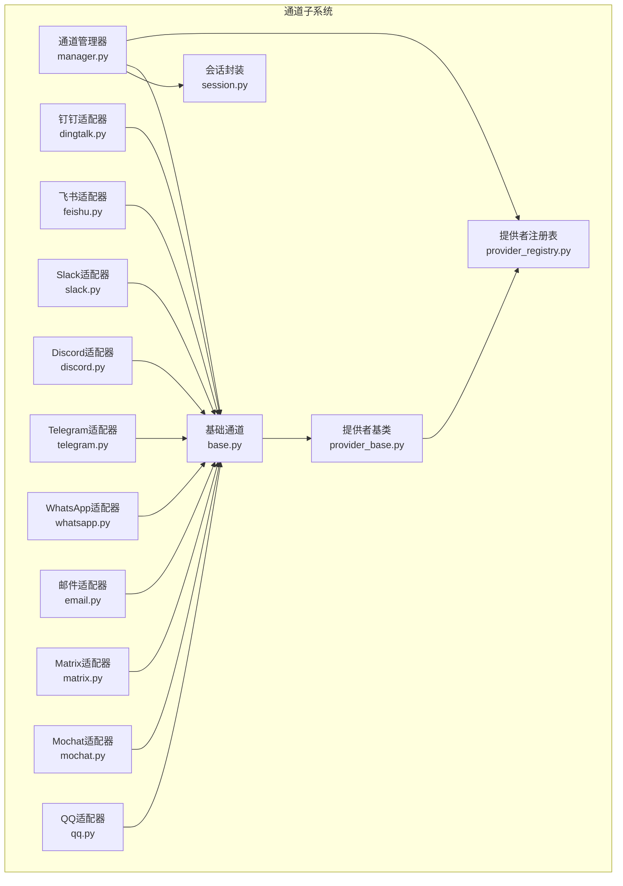
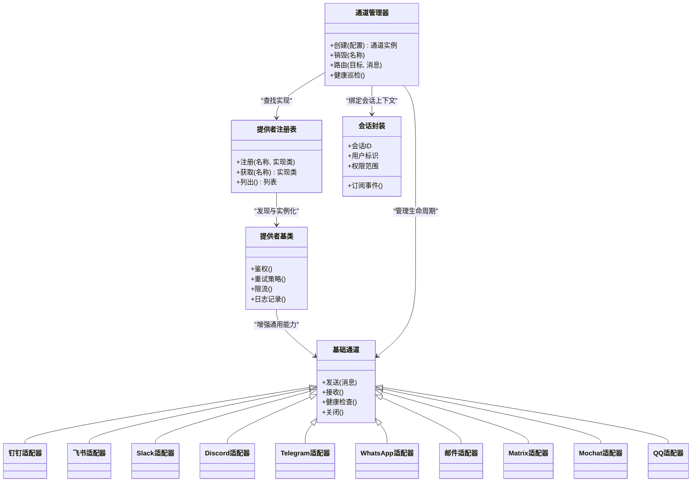
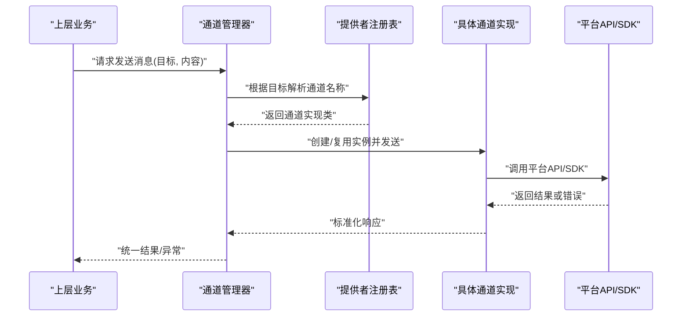
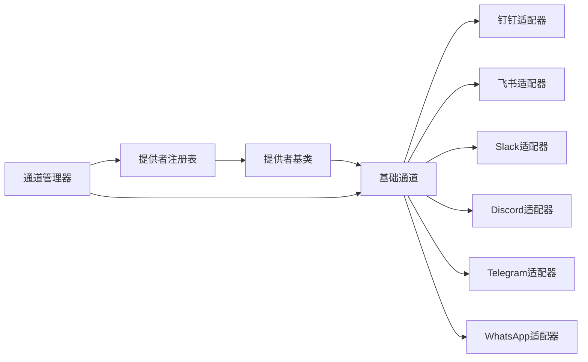

# 通信渠道集成

<cite>
**本文引用的文件**   
- [opc/channels/base.py](file://opc/channels/base.py)
- [opc/channels/manager.py](file://opc/channels/manager.py)
- [opc/channels/provider_base.py](file://opc/channels/provider_base.py)
- [opc/channels/provider_registry.py](file://opc/channels/provider_registry.py)
- [opc/channels/dingtalk.py](file://opc/channels/dingtalk.py)
- [opc/channels/feishu.py](file://opc/channels/feishu.py)
- [opc/channels/slack.py](file://opc/channels/slack.py)
- [opc/channels/discord.py](file://opc/channels/discord.py)
- [opc/channels/telegram.py](file://opc/channels/telegram.py)
- [opc/channels/whatsapp.py](file://opc/channels/whatsapp.py)
- [opc/channels/email.py](file://opc/channels/email.py)
- [opc/channels/matrix.py](file://opc/channels/matrix.py)
- [opc/channels/mochat.py](file://opc/channels/mochat.py)
- [opc/channels/qq.py](file://opc/channels/qq.py)
- [opc/channels/session.py](file://opc/channels/session.py)
- [config/channel_config.yaml](file://config/channel_config.yaml)
- [docs/channels.md](file://docs/channels.md)
- [tests/test_channel_contracts.py](file://tests/test_channel_contracts.py)
- [tests/test_channels.py](file://tests/test_channels.py)
</cite>

## 目录
1. [简介](#简介)
2. [项目结构](#项目结构)
3. [核心组件](#核心组件)
4. [架构总览](#架构总览)
5. [详细组件分析](#详细组件分析)
6. [依赖关系分析](#依赖关系分析)
7. [性能考虑](#性能考虑)
8. [故障排查指南](#故障排查指南)
9. [结论](#结论)
10. [附录](#附录)

## 简介
本文件面向OpenOPC的“通信渠道集成”子系统，系统性阐述通道架构设计、内置平台适配实现与扩展机制。内容覆盖：
- 基础通道类与通道管理器职责边界
- 适配器模式在多渠道接入中的统一抽象
- 各内置通道（钉钉、飞书、Slack、Discord、Telegram、WhatsApp等）的API适配要点、消息格式转换、认证机制与错误处理策略
- 自定义通道开发指南与最佳实践
- 通道配置管理、连接池管理与故障转移策略建议

## 项目结构
通道子系统位于 opc/channels 目录，采用“基础抽象 + 具体实现 + 注册与管理”的分层组织方式：
- 基础抽象层：定义统一的通道接口、会话模型与提供者基类
- 适配器实现层：针对各IM平台的HTTP/WebSocket/SDK适配
- 注册与管理层：提供通道发现、实例化、生命周期与路由能力
- 配置与文档：集中式通道配置与使用文档
- 测试：契约与集成测试保障行为一致性

图表来源
- [opc/channels/base.py](file://opc/channels/base.py)
- [opc/channels/provider_base.py](file://opc/channels/provider_base.py)
- [opc/channels/provider_registry.py](file://opc/channels/provider_registry.py)
- [opc/channels/manager.py](file://opc/channels/manager.py)
- [opc/channels/session.py](file://opc/channels/session.py)
- [opc/channels/dingtalk.py](file://opc/channels/dingtalk.py)
- [opc/channels/feishu.py](file://opc/channels/feishu.py)
- [opc/channels/slack.py](file://opc/channels/slack.py)
- [opc/channels/discord.py](file://opc/channels/discord.py)
- [opc/channels/telegram.py](file://opc/channels/telegram.py)
- [opc/channels/whatsapp.py](file://opc/channels/whatsapp.py)
- [opc/channels/email.py](file://opc/channels/email.py)
- [opc/channels/matrix.py](file://opc/channels/matrix.py)
- [opc/channels/mochat.py](file://opc/channels/mochat.py)
- [opc/channels/qq.py](file://opc/channels/qq.py)

章节来源
- [docs/channels.md](file://docs/channels.md)

## 核心组件
本节聚焦通道子系统的核心抽象与管理机制，说明统一接口、适配器模式与运行时管理。

- 基础通道抽象
  - 定义统一的发送、接收、状态查询、健康检查等接口
  - 规范消息模型与会话上下文，屏蔽底层平台差异
  - 约定错误码与异常类型，便于上层统一处理

- 提供者基类与注册表
  - 提供者基类封装通用能力（如鉴权、重试、限流、日志）
  - 注册表负责按名称发现并实例化具体通道实现
  - 支持动态加载与热插拔，避免硬编码耦合

- 通道管理器
  - 负责通道的创建、初始化、销毁与生命周期管理
  - 维护多通道实例映射与路由表
  - 提供连接池、并发控制与故障转移的统一入口

- 会话封装
  - 将平台会话ID、用户标识、权限范围等元数据标准化
  - 为上层业务提供一致的会话读写与事件订阅接口

图表来源
- [opc/channels/base.py](file://opc/channels/base.py)
- [opc/channels/provider_base.py](file://opc/channels/provider_base.py)
- [opc/channels/provider_registry.py](file://opc/channels/provider_registry.py)
- [opc/channels/manager.py](file://opc/channels/manager.py)
- [opc/channels/session.py](file://opc/channels/session.py)

章节来源
- [opc/channels/base.py](file://opc/channels/base.py)
- [opc/channels/provider_base.py](file://opc/channels/provider_base.py)
- [opc/channels/provider_registry.py](file://opc/channels/provider_registry.py)
- [opc/channels/manager.py](file://opc/channels/manager.py)
- [opc/channels/session.py](file://opc/channels/session.py)

## 架构总览
下图展示从上层调用到具体平台适配器的端到端流程，包括配置加载、通道选择、消息转换与结果回传。

图表来源
- [opc/channels/manager.py](file://opc/channels/manager.py)
- [opc/channels/provider_registry.py](file://opc/channels/provider_registry.py)
- [opc/channels/base.py](file://opc/channels/base.py)

## 详细组件分析

### 基础通道与提供者基类
- 基础通道
  - 统一接口：发送、接收、健康检查、关闭
  - 消息模型：文本、富文本、附件、多媒体等
  - 错误模型：平台无关的错误码与可恢复性标记
- 提供者基类
  - 鉴权：Token刷新、签名计算、证书校验
  - 重试与退避：指数退避、抖动、熔断
  - 限流：令牌桶/漏桶策略
  - 日志与追踪：结构化日志、链路ID

章节来源
- [opc/channels/base.py](file://opc/channels/base.py)
- [opc/channels/provider_base.py](file://opc/channels/provider_base.py)

### 通道管理器与注册表
- 注册表
  - 命名空间：按平台名或业务别名注册
  - 工厂方法：按需构造实例，注入配置与依赖
  - 版本兼容：向后兼容旧名称映射
- 管理器
  - 生命周期：启动预热、运行期监控、优雅关闭
  - 路由：基于目标地址、群组ID、用户ID选择通道
  - 健康巡检：周期性探测、自动切换备用通道

章节来源
- [opc/channels/provider_registry.py](file://opc/channels/provider_registry.py)
- [opc/channels/manager.py](file://opc/channels/manager.py)

### 会话封装
- 会话上下文：会话ID、用户标识、权限范围、可见性策略
- 事件订阅：消息到达、状态变更、错误上报
- 持久化：会话快照、断线重连后恢复

章节来源
- [opc/channels/session.py](file://opc/channels/session.py)

### 内置通道实现要点

#### 钉钉（DingTalk）
- API适配：REST与Webhook
- 消息格式：卡片消息、Markdown、富文本
- 认证机制：AppKey/AppSecret、临时Token
- 错误处理：速率限制、签名失败、群聊权限
- 典型流程：获取Token -> 构建消息体 -> 调用发送接口 -> 解析回执

章节来源
- [opc/channels/dingtalk.py](file://opc/channels/dingtalk.py)

#### 飞书（Feishu/Lark）
- API适配：开放平台API、机器人回调
- 消息格式：富文本、交互式卡片
- 认证机制：App ID/App Secret、事件订阅凭证
- 错误处理：权限不足、消息体校验失败、频率限制
- 典型流程：事件回调 -> 验证签名 -> 解析消息 -> 回复

章节来源
- [opc/channels/feishu.py](file://opc/channels/feishu.py)

#### Slack
- API适配：Bolt SDK或原生API
- 消息格式：Blocks、Markdown、附件
- 认证机制：Bot Token、OAuth Scope
- 错误处理：Scope缺失、频道权限、速率限制
- 典型流程：事件监听 -> 解析事件 -> 调用chat.postMessage

章节来源
- [opc/channels/slack.py](file://opc/channels/slack.py)

#### Discord
- API适配：REST与WebSocket
- 消息格式：Embed、富文本、附件
- 认证机制：Bot Token、Gateway Intents
- 错误处理：权限不足、网关断开、速率限制
- 典型流程：连接网关 -> 监听事件 -> 调用REST发送

章节来源
- [opc/channels/discord.py](file://opc/channels/discord.py)

#### Telegram
- API适配：Bot API
- 消息格式：MarkdownV2、HTML、媒体
- 认证机制：Bot Token
- 错误处理：网络超时、非法聊天ID、速率限制
- 典型流程：轮询或长连接 -> 解析更新 -> 调用sendMessage

章节来源
- [opc/channels/telegram.py](file://opc/channels/telegram.py)

#### WhatsApp
- API适配：Cloud API或第三方网关
- 消息格式：模板消息、文本、媒体
- 认证机制：Access Token、Business Account
- 错误处理：模板未审批、配额耗尽、账号封禁
- 典型流程：构建模板/消息 -> 调用发送 -> 处理回执

章节来源
- [opc/channels/whatsapp.py](file://opc/channels/whatsapp.py)

#### 其他通道（Email、Matrix、Mochat、QQ）
- Email：SMTP/IMAP、附件、HTML正文
- Matrix：Matrix Client Server API、房间与会话
- Mochat：企业微信/自建网关适配
- QQ：开放平台API、群机器人

章节来源
- [opc/channels/email.py](file://opc/channels/email.py)
- [opc/channels/matrix.py](file://opc/channels/matrix.py)
- [opc/channels/mochat.py](file://opc/channels/mochat.py)
- [opc/channels/qq.py](file://opc/channels/qq.py)

### 自定义通道开发指南
- 步骤概览
  - 继承基础通道，实现统一接口
  - 在提供者基类中复用鉴权、重试、限流等通用逻辑
  - 通过注册表注册新通道名称与实现类
  - 编写单元测试与契约测试，确保与基础接口一致
- 关键注意事项
  - 错误码映射：将平台错误转换为内部标准错误
  - 幂等性：对重复消息进行去重或幂等处理
  - 资源清理：连接池、线程、文件句柄的释放
  - 可观测性：指标、日志、追踪埋点
- 示例路径参考
  - 参考现有通道实现的结构与命名约定
  - 参考测试用例中的契约断言与模拟策略

章节来源
- [opc/channels/base.py](file://opc/channels/base.py)
- [opc/channels/provider_base.py](file://opc/channels/provider_base.py)
- [opc/channels/provider_registry.py](file://opc/channels/provider_registry.py)
- [tests/test_channel_contracts.py](file://tests/test_channel_contracts.py)

### 配置管理、连接池与故障转移
- 配置管理
  - 集中式配置文件：通道开关、凭据、超时、重试策略
  - 环境变量注入：敏感信息外置
  - 配置校验：必填字段、格式校验、默认值
- 连接池管理
  - HTTP客户端连接复用、WebSocket长连接池
  - 最大连接数、空闲回收、背压控制
- 故障转移策略
  - 健康检查：心跳、可用性探测
  - 降级与切换：主备通道、就近路由
  - 熔断与隔离：快速失败、舱壁隔离

章节来源
- [config/channel_config.yaml](file://config/channel_config.yaml)
- [opc/channels/manager.py](file://opc/channels/manager.py)

## 依赖关系分析
通道子系统内部依赖清晰，遵循低耦合高内聚原则：
- 基础抽象与具体实现解耦
- 管理器与注册表协作完成实例化与路由
- 各通道实现仅依赖基础抽象与提供者基类

图表来源
- [opc/channels/base.py](file://opc/channels/base.py)
- [opc/channels/provider_base.py](file://opc/channels/provider_base.py)
- [opc/channels/provider_registry.py](file://opc/channels/provider_registry.py)
- [opc/channels/manager.py](file://opc/channels/manager.py)

章节来源
- [tests/test_channels.py](file://tests/test_channels.py)

## 性能考虑
- 批量发送：合并消息、减少网络往返
- 异步IO：非阻塞I/O提升吞吐
- 缓存：热点配置、Token缓存、消息模板缓存
- 压缩与分片：大附件分片上传、响应压缩
- 监控：延迟、成功率、错误率、队列长度

[本节为通用指导，不直接分析具体文件]

## 故障排查指南
- 常见问题定位
  - 认证失败：检查凭据、签名算法、时间同步
  - 权限不足：确认Scope、频道/群组权限
  - 速率限制：调整重试间隔、启用排队
  - 连接中断：检测网络、启用重连与熔断
- 诊断手段
  - 开启调试日志与链路追踪
  - 使用契约测试复现问题
  - 健康检查与告警联动
- 参考测试
  - 契约测试覆盖接口一致性
  - 集成测试覆盖端到端流程

章节来源
- [tests/test_channel_contracts.py](file://tests/test_channel_contracts.py)
- [tests/test_channels.py](file://tests/test_channels.py)

## 结论
OpenOPC的通信渠道集成通过统一抽象、适配器模式与注册管理机制，实现了多渠道接入的标准化与可扩展性。内置通道覆盖了主流IM平台，提供了完善的认证、错误处理与可观测性能力。结合配置管理、连接池与故障转移策略，系统具备高可用与高性能特性。开发者可依据本文档快速扩展新的通道实现，并确保与既有生态无缝集成。

## 附录
- 术语
  - 通道：对外暴露的统一消息收发接口
  - 提供者：通道实现的工厂与增强器
  - 会话：一次对话的上下文与状态
- 参考文档
  - 通道使用说明与最佳实践

章节来源
- [docs/channels.md](file://docs/channels.md)