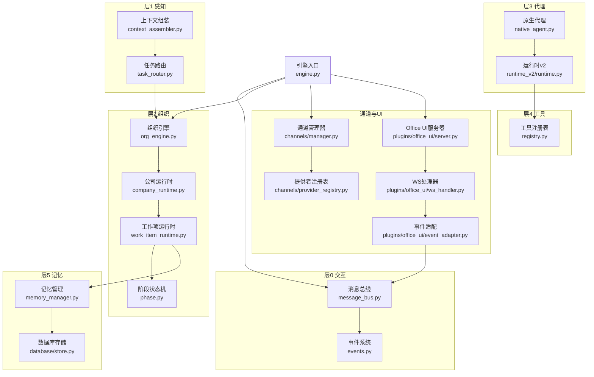
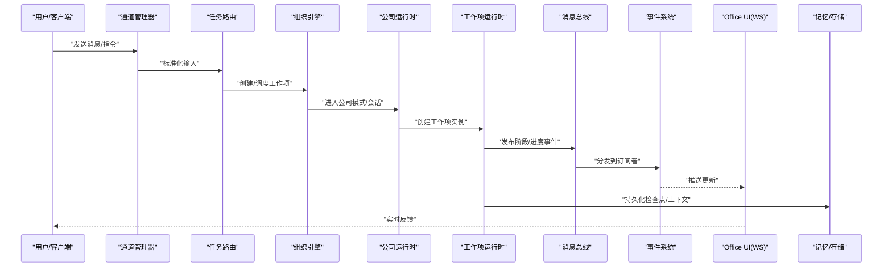
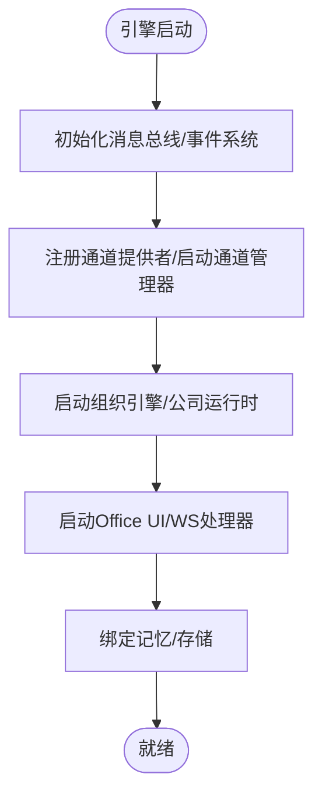
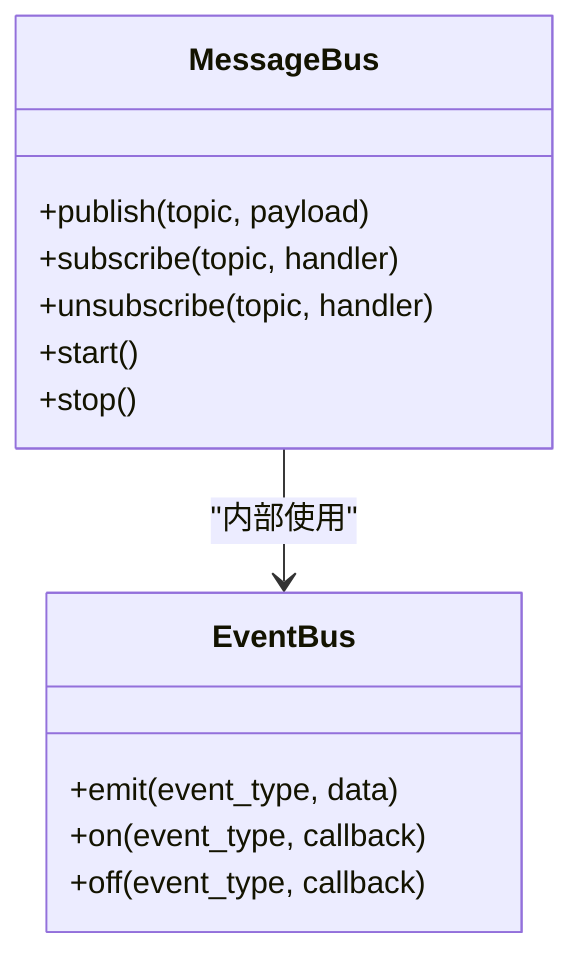
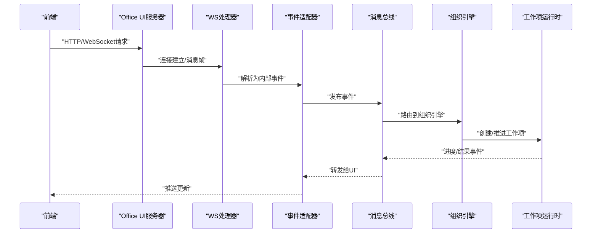
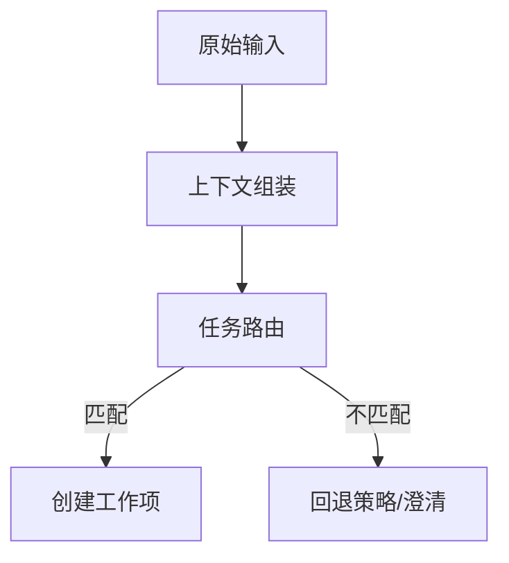
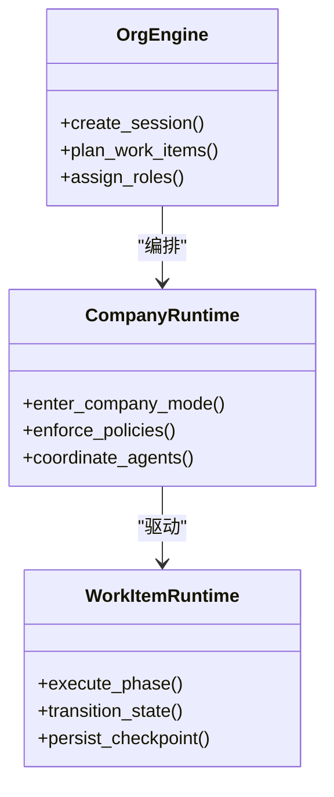
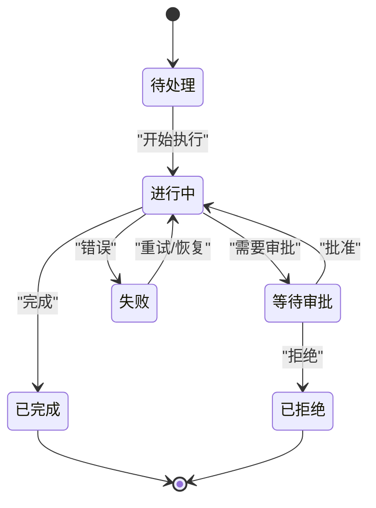
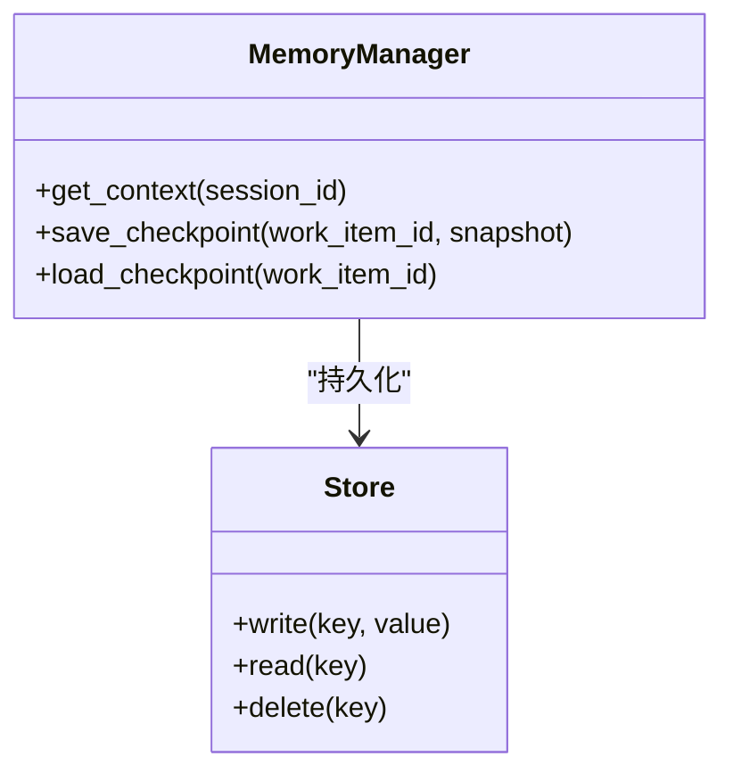
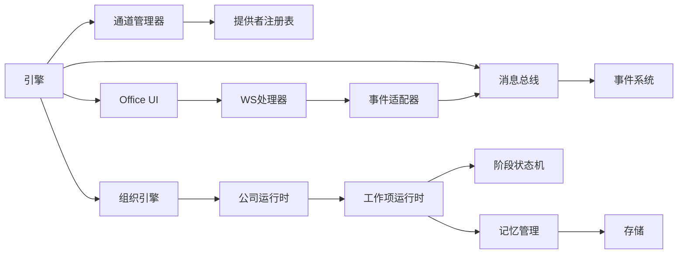

# 组件交互关系

<cite>
**本文引用的文件**   
- [engine.py](file://opc/engine.py)
- [message_bus.py](file://opc/layer0_interaction/message_bus.py)
- [events.py](file://opc/core/events.py)
- [org_engine.py](file://opc/layer2_organization/org_engine.py)
- [company_runtime.py](file://opc/layer2_organization/company_runtime.py)
- [task_router.py](file://opc/layer1_perception/task_router.py)
- [context_assembler.py](file://opc/layer1_perception/context_assembler.py)
- [channel_manager.py](file://opc/channels/manager.py)
- [provider_registry.py](file://opc/channels/provider_registry.py)
- [base_channel.py](file://opc/channels/base.py)
- [office_ui_server.py](file://opc/plugins/office_ui/server.py)
- [ws_handler.py](file://opc/plugins/office_ui/ws_handler.py)
- [event_adapter.py](file://opc/plugins/office_ui/event_adapter.py)
- [agent_store.py](file://opc/plugins/office_ui/agent_store.py)
- [chat_store.py](file://opc/plugins/office_ui/chat_store.py)
- [work_item_runtime.py](file://opc/layer2_organization/work_item_runtime.py)
- [phase.py](file://opc/layer2_organization/phase.py)
- [memory_manager.py](file://opc/layer5_memory/memory_manager.py)
- [store.py](file://opc/database/store.py)
</cite>

## 目录
1. [简介](#简介)
2. [项目结构](#项目结构)
3. [核心组件](#核心组件)
4. [架构总览](#架构总览)
5. [详细组件分析](#详细组件分析)
6. [依赖分析](#依赖分析)
7. [性能考虑](#性能考虑)
8. [故障排查指南](#故障排查指南)
9. [结论](#结论)
10. [附录](#附录)

## 简介
本文件聚焦于OpenOPC的组件交互关系，围绕以下目标展开：
- 描述核心组件间的依赖关系、通信协议与数据流向
- 说明引擎初始化流程、组件生命周期管理与启动顺序
- 解释消息总线的工作原理、事件发布订阅机制与异步处理模型
- 通过组件依赖图与交互时序图展示关键业务流程中的协作过程
- 阐述组件解耦策略、容错处理与故障恢复机制

## 项目结构
OpenOPC采用分层与插件化组织方式：
- 层0（交互）：消息总线与事件系统，提供进程内异步通信基础
- 层1（感知）：上下文组装与任务路由，负责将外部输入转化为可执行的工作项
- 层2（组织）：公司运行时、工作项运行时、阶段状态机等，编排业务流
- 层3（代理）：原生代理与适配器、工具规划器与运行时
- 层4（工具）：文件系统、Git、浏览器、Python执行等能力
- 层5（记忆）：持久化记忆、技能库、偏好与历史压缩
- 层6（可观测性）：日志与成本追踪
- 通道与UI：多渠道接入与Office UI插件（含WebSocket服务）

图表来源
- [engine.py](file://opc/engine.py)
- [message_bus.py](file://opc/layer0_interaction/message_bus.py)
- [events.py](file://opc/core/events.py)
- [org_engine.py](file://opc/layer2_organization/org_engine.py)
- [company_runtime.py](file://opc/layer2_organization/company_runtime.py)
- [task_router.py](file://opc/layer1_perception/task_router.py)
- [context_assembler.py](file://opc/layer1_perception/context_assembler.py)
- [channel_manager.py](file://opc/channels/manager.py)
- [provider_registry.py](file://opc/channels/provider_registry.py)
- [office_ui_server.py](file://opc/plugins/office_ui/server.py)
- [ws_handler.py](file://opc/plugins/office_ui/ws_handler.py)
- [event_adapter.py](file://opc/plugins/office_ui/event_adapter.py)
- [work_item_runtime.py](file://opc/layer2_organization/work_item_runtime.py)
- [phase.py](file://opc/layer2_organization/phase.py)
- [memory_manager.py](file://opc/layer5_memory/memory_manager.py)
- [store.py](file://opc/database/store.py)

章节来源
- [engine.py](file://opc/engine.py)
- [message_bus.py](file://opc/layer0_interaction/message_bus.py)
- [events.py](file://opc/core/events.py)
- [org_engine.py](file://opc/layer2_organization/org_engine.py)
- [company_runtime.py](file://opc/layer2_organization/company_runtime.py)
- [task_router.py](file://opc/layer1_perception/task_router.py)
- [context_assembler.py](file://opc/layer1_perception/context_assembler.py)
- [channel_manager.py](file://opc/channels/manager.py)
- [provider_registry.py](file://opc/channels/provider_registry.py)
- [office_ui_server.py](file://opc/plugins/office_ui/server.py)
- [ws_handler.py](file://opc/plugins/office_ui/ws_handler.py)
- [event_adapter.py](file://opc/plugins/office_ui/event_adapter.py)
- [work_item_runtime.py](file://opc/layer2_organization/work_item_runtime.py)
- [phase.py](file://opc/layer2_organization/phase.py)
- [memory_manager.py](file://opc/layer5_memory/memory_manager.py)
- [store.py](file://opc/database/store.py)

## 核心组件
- 引擎入口：负责整体装配、生命周期管理与启动顺序协调
- 消息总线：进程内异步消息分发，承载事件与命令
- 事件系统：基于主题的事件发布/订阅，支持过滤与优先级
- 组织引擎与公司运行时：编排会话、角色与工作项的生命周期
- 工作项运行时与阶段状态机：驱动任务推进、钩子与转换
- 通道与UI：多渠道接入与Web界面，通过WebSocket与后端同步
- 记忆与存储：统一记忆接口与持久化实现

章节来源
- [engine.py](file://opc/engine.py)
- [message_bus.py](file://opc/layer0_interaction/message_bus.py)
- [events.py](file://opc/core/events.py)
- [org_engine.py](file://opc/layer2_organization/org_engine.py)
- [company_runtime.py](file://opc/layer2_organization/company_runtime.py)
- [work_item_runtime.py](file://opc/layer2_organization/work_item_runtime.py)
- [phase.py](file://opc/layer2_organization/phase.py)
- [channel_manager.py](file://opc/channels/manager.py)
- [office_ui_server.py](file://opc/plugins/office_ui/server.py)
- [memory_manager.py](file://opc/layer5_memory/memory_manager.py)
- [store.py](file://opc/database/store.py)

## 架构总览
OpenOPC以“事件驱动+消息总线”为核心，结合“分层职责+插件扩展”的组织方式。引擎在启动时完成各层组件的装配与注册，随后由通道或UI触发工作项创建与流转，期间通过消息总线进行跨层通信，记忆与存储提供持久化支撑，可观测性贯穿全链路。

图表来源
- [channel_manager.py](file://opc/channels/manager.py)
- [task_router.py](file://opc/layer1_perception/task_router.py)
- [org_engine.py](file://opc/layer2_organization/org_engine.py)
- [company_runtime.py](file://opc/layer2_organization/company_runtime.py)
- [work_item_runtime.py](file://opc/layer2_organization/work_item_runtime.py)
- [message_bus.py](file://opc/layer0_interaction/message_bus.py)
- [events.py](file://opc/core/events.py)
- [office_ui_server.py](file://opc/plugins/office_ui/server.py)
- [memory_manager.py](file://opc/layer5_memory/memory_manager.py)
- [store.py](file://opc/database/store.py)

## 详细组件分析

### 引擎初始化与启动顺序
- 引擎入口负责：
  - 加载配置与环境准备
  - 初始化消息总线与事件系统
  - 注册通道提供者并启动通道管理器
  - 启动组织引擎与公司运行时
  - 启动Office UI服务与WebSocket处理器
  - 建立记忆与存储绑定
- 启动顺序遵循“基础设施→编排层→接入层→UI层”的依赖关系，确保下游组件可用后再暴露对外接口。

图表来源
- [engine.py](file://opc/engine.py)
- [message_bus.py](file://opc/layer0_interaction/message_bus.py)
- [events.py](file://opc/core/events.py)
- [channel_manager.py](file://opc/channels/manager.py)
- [provider_registry.py](file://opc/channels/provider_registry.py)
- [org_engine.py](file://opc/layer2_organization/org_engine.py)
- [company_runtime.py](file://opc/layer2_organization/company_runtime.py)
- [office_ui_server.py](file://opc/plugins/office_ui/server.py)
- [memory_manager.py](file://opc/layer5_memory/memory_manager.py)
- [store.py](file://opc/database/store.py)

章节来源
- [engine.py](file://opc/engine.py)
- [message_bus.py](file://opc/layer0_interaction/message_bus.py)
- [events.py](file://opc/core/events.py)
- [channel_manager.py](file://opc/channels/manager.py)
- [provider_registry.py](file://opc/channels/provider_registry.py)
- [org_engine.py](file://opc/layer2_organization/org_engine.py)
- [company_runtime.py](file://opc/layer2_organization/company_runtime.py)
- [office_ui_server.py](file://opc/plugins/office_ui/server.py)
- [memory_manager.py](file://opc/layer5_memory/memory_manager.py)
- [store.py](file://opc/database/store.py)

### 消息总线与事件系统
- 消息总线提供：
  - 进程内异步消息投递
  - 按主题/类型路由
  - 背压与重试策略（可选）
- 事件系统提供：
  - 发布/订阅语义
  - 事件过滤器与优先级
  - 与UI、监控、审计等横切关注点解耦

图表来源
- [message_bus.py](file://opc/layer0_interaction/message_bus.py)
- [events.py](file://opc/core/events.py)

章节来源
- [message_bus.py](file://opc/layer0_interaction/message_bus.py)
- [events.py](file://opc/core/events.py)

### 通道与UI集成
- 通道管理器负责：
  - 多通道提供者注册与发现
  - 消息标准化与入站路由
- Office UI通过WebSocket与后端交互：
  - WS处理器接收前端事件
  - 事件适配器转换为内部事件
  - 通过消息总线分发至组织引擎与工作项运行时

图表来源
- [channel_manager.py](file://opc/channels/manager.py)
- [office_ui_server.py](file://opc/plugins/office_ui/server.py)
- [ws_handler.py](file://opc/plugins/office_ui/ws_handler.py)
- [event_adapter.py](file://opc/plugins/office_ui/event_adapter.py)
- [message_bus.py](file://opc/layer0_interaction/message_bus.py)
- [org_engine.py](file://opc/layer2_organization/org_engine.py)
- [work_item_runtime.py](file://opc/layer2_organization/work_item_runtime.py)

章节来源
- [channel_manager.py](file://opc/channels/manager.py)
- [office_ui_server.py](file://opc/plugins/office_ui/server.py)
- [ws_handler.py](file://opc/plugins/office_ui/ws_handler.py)
- [event_adapter.py](file://opc/plugins/office_ui/event_adapter.py)
- [message_bus.py](file://opc/layer0_interaction/message_bus.py)
- [org_engine.py](file://opc/layer2_organization/org_engine.py)
- [work_item_runtime.py](file://opc/layer2_organization/work_item_runtime.py)

### 任务路由与上下文组装
- 上下文组装器负责：
  - 聚合会话、角色、权限、工具清单等上下文
  - 生成结构化输入供路由决策
- 任务路由器负责：
  - 根据意图/规则选择目标工作项类型
  - 调用组织引擎创建工作项

图表来源
- [context_assembler.py](file://opc/layer1_perception/context_assembler.py)
- [task_router.py](file://opc/layer1_perception/task_router.py)
- [org_engine.py](file://opc/layer2_organization/org_engine.py)

章节来源
- [context_assembler.py](file://opc/layer1_perception/context_assembler.py)
- [task_router.py](file://opc/layer1_perception/task_router.py)
- [org_engine.py](file://opc/layer2_organization/org_engine.py)

### 组织引擎与公司运行时
- 组织引擎负责：
  - 会话/团队/角色的生命周期管理
  - 工作项计划与分配
- 公司运行时负责：
  - 公司模式下的全局约束与策略
  - 与记忆、工具、外部代理的协同

图表来源
- [org_engine.py](file://opc/layer2_organization/org_engine.py)
- [company_runtime.py](file://opc/layer2_organization/company_runtime.py)
- [work_item_runtime.py](file://opc/layer2_organization/work_item_runtime.py)

章节来源
- [org_engine.py](file://opc/layer2_organization/org_engine.py)
- [company_runtime.py](file://opc/layer2_organization/company_runtime.py)
- [work_item_runtime.py](file://opc/layer2_organization/work_item_runtime.py)

### 工作项运行时与阶段状态机
- 工作项运行时维护：
  - 当前阶段、上下文快照、工具调用结果
  - 与记忆/存储的读写
- 阶段状态机定义：
  - 合法状态与转换条件
  - 钩子函数用于前后置逻辑

图表来源
- [work_item_runtime.py](file://opc/layer2_organization/work_item_runtime.py)
- [phase.py](file://opc/layer2_organization/phase.py)

章节来源
- [work_item_runtime.py](file://opc/layer2_organization/work_item_runtime.py)
- [phase.py](file://opc/layer2_organization/phase.py)

### 记忆与存储
- 记忆管理提供统一接口：
  - 会话记忆、偏好、技能库、历史压缩
- 存储层对接数据库：
  - 检查点、工作项状态、上下文快照

图表来源
- [memory_manager.py](file://opc/layer5_memory/memory_manager.py)
- [store.py](file://opc/database/store.py)

章节来源
- [memory_manager.py](file://opc/layer5_memory/memory_manager.py)
- [store.py](file://opc/database/store.py)

## 依赖分析
- 低耦合设计：
  - 层间通过消息总线与事件系统解耦
  - 通道与UI通过适配器与注册表扩展
- 直接依赖：
  - 引擎→消息总线/事件系统/组织引擎/通道管理器/UI服务
  - 工作项运行时→阶段状态机/记忆/存储
- 潜在循环依赖规避：
  - 通过事件与回调避免双向调用
  - 使用注册表延迟绑定具体实现

图表来源
- [engine.py](file://opc/engine.py)
- [message_bus.py](file://opc/layer0_interaction/message_bus.py)
- [events.py](file://opc/core/events.py)
- [org_engine.py](file://opc/layer2_organization/org_engine.py)
- [company_runtime.py](file://opc/layer2_organization/company_runtime.py)
- [work_item_runtime.py](file://opc/layer2_organization/work_item_runtime.py)
- [phase.py](file://opc/layer2_organization/phase.py)
- [channel_manager.py](file://opc/channels/manager.py)
- [provider_registry.py](file://opc/channels/provider_registry.py)
- [office_ui_server.py](file://opc/plugins/office_ui/server.py)
- [ws_handler.py](file://opc/plugins/office_ui/ws_handler.py)
- [event_adapter.py](file://opc/plugins/office_ui/event_adapter.py)
- [memory_manager.py](file://opc/layer5_memory/memory_manager.py)
- [store.py](file://opc/database/store.py)

章节来源
- [engine.py](file://opc/engine.py)
- [message_bus.py](file://opc/layer0_interaction/message_bus.py)
- [events.py](file://opc/core/events.py)
- [org_engine.py](file://opc/layer2_organization/org_engine.py)
- [company_runtime.py](file://opc/layer2_organization/company_runtime.py)
- [work_item_runtime.py](file://opc/layer2_organization/work_item_runtime.py)
- [phase.py](file://opc/layer2_organization/phase.py)
- [channel_manager.py](file://opc/channels/manager.py)
- [provider_registry.py](file://opc/channels/provider_registry.py)
- [office_ui_server.py](file://opc/plugins/office_ui/server.py)
- [ws_handler.py](file://opc/plugins/office_ui/ws_handler.py)
- [event_adapter.py](file://opc/plugins/office_ui/event_adapter.py)
- [memory_manager.py](file://opc/layer5_memory/memory_manager.py)
- [store.py](file://opc/database/store.py)

## 性能考虑
- 异步优先：消息总线与事件系统减少阻塞路径
- 批处理与合并：UI推送与记忆写入建议批量操作
- 背压与限流：在高并发场景下对热点主题进行限速
- 缓存与去重：上下文与检查结果缓存，避免重复计算
- 持久化优化：检查点增量保存与压缩历史

[本节为通用指导，无需特定文件引用]

## 故障排查指南
- 常见问题定位：
  - 事件未到达：检查消息总线订阅与主题匹配
  - UI不同步：确认WS连接与事件适配器映射
  - 工作项卡住：查看阶段状态与检查点是否一致
  - 存储异常：验证存储层读写与迁移状态
- 恢复策略：
  - 从最近检查点恢复工作项
  - 重试失败阶段，带指数退避
  - 降级到最小可用功能集

章节来源
- [message_bus.py](file://opc/layer0_interaction/message_bus.py)
- [events.py](file://opc/core/events.py)
- [ws_handler.py](file://opc/plugins/office_ui/ws_handler.py)
- [event_adapter.py](file://opc/plugins/office_ui/event_adapter.py)
- [work_item_runtime.py](file://opc/layer2_organization/work_item_runtime.py)
- [phase.py](file://opc/layer2_organization/phase.py)
- [memory_manager.py](file://opc/layer5_memory/memory_manager.py)
- [store.py](file://opc/database/store.py)

## 结论
OpenOPC通过消息总线与事件系统实现松耦合的组件交互，配合分层职责与插件化扩展，形成高内聚、低耦合的系统架构。引擎初始化遵循严格的依赖顺序，保障各层稳定启动；工作项运行时与阶段状态机驱动业务流程，记忆与存储提供可靠的数据基座；通道与UI通过适配器与注册表实现灵活接入。整体设计具备良好的可扩展性与可观测性，适合复杂企业级场景。

[本节为总结性内容，无需特定文件引用]

## 附录
- 术语
  - 工作项：一次可执行的单元任务，包含上下文、阶段与状态
  - 阶段：工作项生命周期中的一个步骤，具备前置/后置钩子
  - 检查点：工作项运行状态的持久化快照
- 参考路径
  - 引擎入口：[engine.py](file://opc/engine.py)
  - 消息总线：[message_bus.py](file://opc/layer0_interaction/message_bus.py)
  - 事件系统：[events.py](file://opc/core/events.py)
  - 组织引擎：[org_engine.py](file://opc/layer2_organization/org_engine.py)
  - 公司运行时：[company_runtime.py](file://opc/layer2_organization/company_runtime.py)
  - 工作项运行时：[work_item_runtime.py](file://opc/layer2_organization/work_item_runtime.py)
  - 阶段状态机：[phase.py](file://opc/layer2_organization/phase.py)
  - 通道管理器：[channel_manager.py](file://opc/channels/manager.py)
  - 提供者注册表：[provider_registry.py](file://opc/channels/provider_registry.py)
  - Office UI服务器：[office_ui_server.py](file://opc/plugins/office_ui/server.py)
  - WS处理器：[ws_handler.py](file://opc/plugins/office_ui/ws_handler.py)
  - 事件适配器：[event_adapter.py](file://opc/plugins/office_ui/event_adapter.py)
  - 记忆管理：[memory_manager.py](file://opc/layer5_memory/memory_manager.py)
  - 存储实现：[store.py](file://opc/database/store.py)