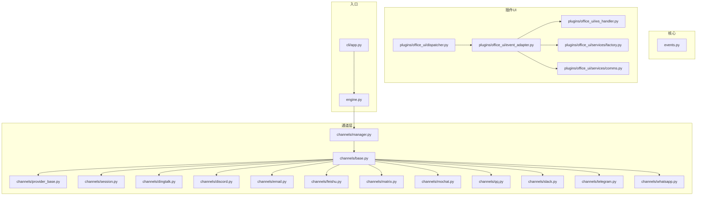
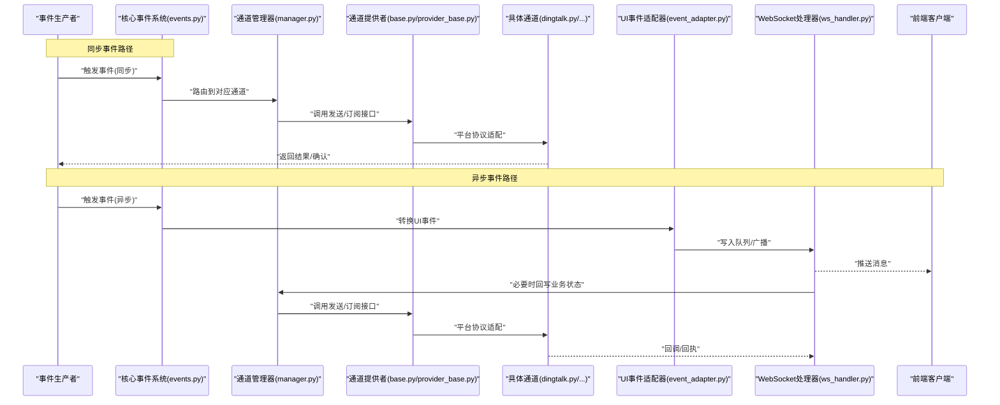
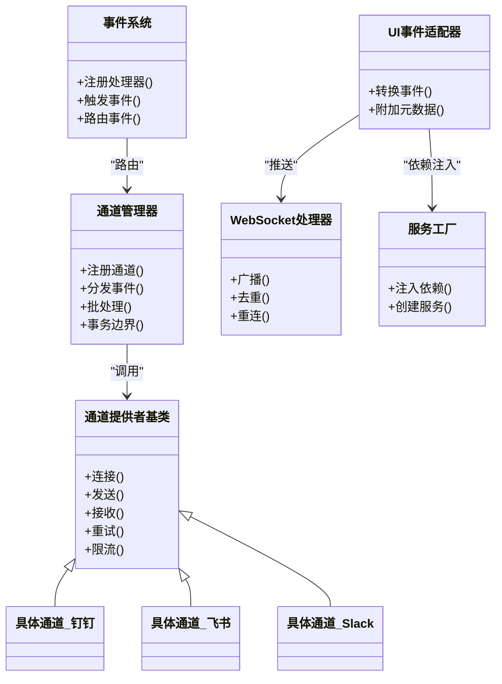

# 事件处理器

<cite>
**本文引用的文件**   
- [opc/core/events.py](file://opc/core/events.py)
- [opc/channels/base.py](file://opc/channels/base.py)
- [opc/channels/manager.py](file://opc/channels/manager.py)
- [opc/channels/provider_base.py](file://opc/channels/provider_base.py)
- [opc/channels/session.py](file://opc/channels/session.py)
- [opc/channels/dingtalk.py](file://opc/channels/dingtalk.py)
- [opc/channels/discord.py](file://opc/channels/discord.py)
- [opc/channels/email.py](file://opc/channels/email.py)
- [opc/channels/feishu.py](file://opc/channels/feishu.py)
- [opc/channels/matrix.py](file://opc/channels/matrix.py)
- [opc/channels/mochat.py](file://opc/channels/mochat.py)
- [opc/channels/qq.py](file://opc/channels/qq.py)
- [opc/channels/slack.py](file://opc/channels/slack.py)
- [opc/channels/telegram.py](file://opc/channels/telegram.py)
- [opc/channels/whatsapp.py](file://opc/channels/whatsapp.py)
- [opc/plugins/office_ui/event_adapter.py](file://opc/plugins/office_ui/event_adapter.py)
- [opc/plugins/office_ui/ws_handler.py](file://opc/plugins/office_ui/ws_handler.py)
- [opc/plugins/office_ui/services/factory.py](file://opc/plugins/office_ui/services/factory.py)
- [opc/plugins/office_ui/services/comms.py](file://opc/plugins/office_ui/services/comms.py)
- [opc/plugins/office_ui/dispatcher.py](file://opc/plugins/office_ui/dispatcher.py)
- [opc/cli/app.py](file://opc/cli/app.py)
- [opc/engine.py](file://opc/engine.py)
</cite>

## 目录
1. [简介](#简介)
2. [项目结构](#项目结构)
3. [核心组件](#核心组件)
4. [架构总览](#架构总览)
5. [详细组件分析](#详细组件分析)
6. [依赖关系分析](#依赖关系分析)
7. [性能考量](#性能考量)
8. [故障排查指南](#故障排查指南)
9. [结论](#结论)
10. [附录](#附录)

## 简介
本文件围绕 OpenOPC 的事件处理子系统，系统化阐述事件处理器的设计模式、生命周期管理、同步与异步实现差异、错误处理与重试机制、依赖注入与上下文传递、批量事件与事务化语义、自定义事件处理器的开发指南（含测试方法）、性能监控与资源管理策略，以及调试技巧与常见问题解决方案。文档以代码级事实为依据，辅以可视化图示，帮助读者从高层到细节全面掌握事件处理器的设计与使用。

## 项目结构
OpenOPC 的事件相关能力主要分布在以下位置：
- 核心事件模型与基础设施：opc/core/events.py
- 通道层事件抽象与具体通道实现：opc/channels/*
- 插件侧 UI 事件适配与 WebSocket 分发：opc/plugins/office_ui/event_adapter.py、ws_handler.py
- 服务工厂与通信桥接：opc/plugins/office_ui/services/factory.py、services/comms.py
- CLI 与引擎入口对事件的集成：opc/cli/app.py、opc/engine.py

图表来源
- [opc/core/events.py](file://opc/core/events.py)
- [opc/channels/base.py](file://opc/channels/base.py)
- [opc/channels/manager.py](file://opc/channels/manager.py)
- [opc/channels/provider_base.py](file://opc/channels/provider_base.py)
- [opc/channels/session.py](file://opc/channels/session.py)
- [opc/channels/dingtalk.py](file://opc/channels/dingtalk.py)
- [opc/channels/discord.py](file://opc/channels/discord.py)
- [opc/channels/email.py](file://opc/channels/email.py)
- [opc/channels/feishu.py](file://opc/channels/feishu.py)
- [opc/channels/matrix.py](file://opc/channels/matrix.py)
- [opc/channels/mochat.py](file://opc/channels/mochat.py)
- [opc/channels/qq.py](file://opc/channels/qq.py)
- [opc/channels/slack.py](file://opc/channels/slack.py)
- [opc/channels/telegram.py](file://opc/channels/telegram.py)
- [opc/channels/whatsapp.py](file://opc/channels/whatsapp.py)
- [opc/plugins/office_ui/event_adapter.py](file://opc/plugins/office_ui/event_adapter.py)
- [opc/plugins/office_ui/ws_handler.py](file://opc/plugins/office_ui/ws_handler.py)
- [opc/plugins/office_ui/services/factory.py](file://opc/plugins/office_ui/services/factory.py)
- [opc/plugins/office_ui/services/comms.py](file://opc/plugins/office_ui/services/comms.py)
- [opc/plugins/office_ui/dispatcher.py](file://opc/plugins/office_ui/dispatcher.py)
- [opc/cli/app.py](file://opc/cli/app.py)
- [opc/engine.py](file://opc/engine.py)

章节来源
- [opc/core/events.py](file://opc/core/events.py)
- [opc/channels/base.py](file://opc/channels/base.py)
- [opc/channels/manager.py](file://opc/channels/manager.py)
- [opc/plugins/office_ui/event_adapter.py](file://opc/plugins/office_ui/event_adapter.py)
- [opc/plugins/office_ui/ws_handler.py](file://opc/plugins/office_ui/ws_handler.py)
- [opc/plugins/office_ui/services/factory.py](file://opc/plugins/office_ui/services/factory.py)
- [opc/plugins/office_ui/services/comms.py](file://opc/plugins/office_ui/services/comms.py)
- [opc/plugins/office_ui/dispatcher.py](file://opc/plugins/office_ui/dispatcher.py)
- [opc/cli/app.py](file://opc/cli/app.py)
- [opc/engine.py](file://opc/engine.py)

## 核心组件
- 事件模型与基础设施（opc/core/events.py）
  - 定义统一的事件类型、事件载荷结构与基础事件处理器接口，提供事件注册、路由与调度能力。
  - 支持同步与异步两种处理器签名，便于在不同执行上下文中复用同一事件模型。
- 通道抽象与提供者基类（opc/channels/base.py、provider_base.py）
  - 抽象出“通道”概念，将不同消息平台（钉钉、飞书、Slack 等）统一为一致的事件源与目标。
  - 提供连接生命周期、会话管理与消息编解码的通用能力。
- 通道管理器（opc/channels/manager.py）
  - 负责通道的发现、注册、生命周期编排与事件分发。
  - 维护通道实例池与并发控制，屏蔽底层差异。
- 会话封装（opc/channels/session.py）
  - 封装一次交互的上下文，包括身份、权限、追踪ID、超时与重试策略等。
- 具体通道实现（各 channels/*.py）
  - 针对特定平台的协议适配、鉴权、重连与限流策略。
- UI 事件适配与分发（event_adapter.py、ws_handler.py、dispatcher.py、factory.py、comms.py）
  - 将内部事件转换为 UI 可消费的消息格式，并通过 WebSocket 推送给前端。
  - 通过工厂与服务桥接，完成依赖注入与跨模块通信。

章节来源
- [opc/core/events.py](file://opc/core/events.py)
- [opc/channels/base.py](file://opc/channels/base.py)
- [opc/channels/provider_base.py](file://opc/channels/provider_base.py)
- [opc/channels/manager.py](file://opc/channels/manager.py)
- [opc/channels/session.py](file://opc/channels/session.py)
- [opc/plugins/office_ui/event_adapter.py](file://opc/plugins/office_ui/event_adapter.py)
- [opc/plugins/office_ui/ws_handler.py](file://opc/plugins/office_ui/ws_handler.py)
- [opc/plugins/office_ui/dispatcher.py](file://opc/plugins/office_ui/dispatcher.py)
- [opc/plugins/office_ui/services/factory.py](file://opc/plugins/office_ui/services/factory.py)
- [opc/plugins/office_ui/services/comms.py](file://opc/plugins/office_ui/services/comms.py)

## 架构总览
下图展示了事件从产生到被处理的端到端路径，涵盖同步与异步两条主线，并体现依赖注入与上下文传递。

图表来源
- [opc/core/events.py](file://opc/core/events.py)
- [opc/channels/manager.py](file://opc/channels/manager.py)
- [opc/channels/base.py](file://opc/channels/base.py)
- [opc/channels/provider_base.py](file://opc/channels/provider_base.py)
- [opc/channels/dingtalk.py](file://opc/channels/dingtalk.py)
- [opc/channels/discord.py](file://opc/channels/discord.py)
- [opc/channels/email.py](file://opc/channels/email.py)
- [opc/channels/feishu.py](file://opc/channels/feishu.py)
- [opc/channels/matrix.py](file://opc/channels/matrix.py)
- [opc/channels/mochat.py](file://opc/channels/mochat.py)
- [opc/channels/qq.py](file://opc/channels/qq.py)
- [opc/channels/slack.py](file://opc/channels/slack.py)
- [opc/channels/telegram.py](file://opc/channels/telegram.py)
- [opc/channels/whatsapp.py](file://opc/channels/whatsapp.py)
- [opc/plugins/office_ui/event_adapter.py](file://opc/plugins/office_ui/event_adapter.py)
- [opc/plugins/office_ui/ws_handler.py](file://opc/plugins/office_ui/ws_handler.py)

## 详细组件分析

### 事件模型与处理器接口（核心）
- 设计要点
  - 统一事件类型与载荷：所有事件均继承自基础事件类型，携带标准化字段（如事件ID、时间戳、来源、目标、优先级、幂等键等）。
  - 处理器契约：定义同步与异步两种处理器签名，确保在阻塞与非阻塞场景下均可复用。
  - 注册与路由：基于事件类型或标签进行处理器注册，运行时按策略选择最佳处理器。
- 关键流程
  - 事件创建 -> 校验与增强（填充上下文）-> 路由 -> 执行处理器 -> 记录结果/异常 -> 可选持久化或通知。
- 复杂度与扩展性
  - 路由通常为 O(n) 匹配（n 为处理器数量），可通过索引优化；处理器间解耦，新增处理器无需修改既有逻辑。

章节来源
- [opc/core/events.py](file://opc/core/events.py)

### 通道抽象与提供者基类
- 设计要点
  - 通道抽象：定义统一的连接、发送、接收、订阅、心跳、重连等接口。
  - 提供者基类：封装通用逻辑（鉴权、重试、限流、序列化、错误归一化），子类仅需实现平台差异。
- 生命周期
  - 初始化 -> 建立连接 -> 启动订阅/监听 -> 运行中心跳与保活 -> 优雅关闭与资源释放。
- 会话与上下文
  - 会话对象贯穿一次交互，包含用户标识、租户信息、追踪ID、超时与重试策略等。

章节来源
- [opc/channels/base.py](file://opc/channels/base.py)
- [opc/channels/provider_base.py](file://opc/channels/provider_base.py)
- [opc/channels/session.py](file://opc/channels/session.py)

### 通道管理器（事件分发中枢）
- 职责
  - 通道注册与发现、实例池管理、并发控制、事件路由与批处理。
- 关键特性
  - 多通道并行：根据事件目标选择合适通道实例。
  - 背压与限流：防止下游过载。
  - 事务边界：在需要时保证一组操作的原子性与一致性。
- 与核心事件系统的协作
  - 接收来自核心事件系统的路由请求，委派至具体通道提供者。

章节来源
- [opc/channels/manager.py](file://opc/channels/manager.py)

### UI 事件适配与 WebSocket 分发
- 事件适配器
  - 将内部事件转换为 UI 友好的消息结构，附加元数据（如进度、状态码、来源通道）。
- WebSocket 处理器
  - 维护连接与会话映射，负责消息广播、去重、顺序保证与断线重连。
- 服务工厂与通信桥
  - 通过工厂完成依赖注入（如日志、存储、配置），通过通信桥在模块间传递事件与状态。

章节来源
- [opc/plugins/office_ui/event_adapter.py](file://opc/plugins/office_ui/event_adapter.py)
- [opc/plugins/office_ui/ws_handler.py](file://opc/plugins/office_ui/ws_handler.py)
- [opc/plugins/office_ui/services/factory.py](file://opc/plugins/office_ui/services/factory.py)
- [opc/plugins/office_ui/services/comms.py](file://opc/plugins/office_ui/services/comms.py)
- [opc/plugins/office_ui/dispatcher.py](file://opc/plugins/office_ui/dispatcher.py)

### 同步与异步事件处理器的实现差异
- 同步处理器
  - 适用场景：短耗时、强一致、需立即返回结果的场景。
  - 特点：调用方阻塞等待；适合简单命令式操作。
- 异步处理器
  - 适用场景：长耗时、高吞吐、需非阻塞响应的场景。
  - 特点：通过任务队列或协程执行；结合事件总线进行后续回调或状态更新。
- 选择建议
  - 优先异步以提升吞吐；对需要强一致性的关键路径采用同步或补偿事务。

章节来源
- [opc/core/events.py](file://opc/core/events.py)
- [opc/channels/manager.py](file://opc/channels/manager.py)

### 错误处理、异常捕获与重试机制
- 错误分类
  - 可恢复错误（网络抖动、临时限流）：触发指数退避重试。
  - 不可恢复错误（参数非法、权限不足）：快速失败并记录告警。
- 重试策略
  - 最大重试次数、退避算法、重试窗口、幂等键保障。
- 异常捕获
  - 在通道提供者层统一捕获并归一化为标准异常，避免泄漏底层细节。
- 降级与熔断
  - 当错误率超过阈值时，启用降级策略（如缓存旧值、拒绝新请求）。

章节来源
- [opc/channels/provider_base.py](file://opc/channels/provider_base.py)
- [opc/channels/manager.py](file://opc/channels/manager.py)

### 依赖注入与上下文传递
- 依赖注入
  - 通过工厂在服务初始化阶段注入日志、存储、配置、加密器等依赖，降低耦合度。
- 上下文传递
  - 使用会话对象承载请求级上下文（用户、租户、追踪ID、超时、重试策略），在事件链路中透传。
- 隔离性
  - 每个通道实例拥有独立上下文，避免跨请求污染。

章节来源
- [opc/plugins/office_ui/services/factory.py](file://opc/plugins/office_ui/services/factory.py)
- [opc/channels/session.py](file://opc/channels/session.py)

### 批量事件处理与事务管理机制
- 批量处理
  - 将多个事件聚合后一次性提交，减少往返开销；注意批次大小与内存占用平衡。
- 事务语义
  - 在需要时引入本地事务或两阶段提交，保证事件落库与外部调用的原子性。
- 幂等与去重
  - 基于事件ID或业务键进行去重，避免重复处理导致的状态不一致。

章节来源
- [opc/channels/manager.py](file://opc/channels/manager.py)
- [opc/core/events.py](file://opc/core/events.py)

### 自定义事件处理器开发指南
- 步骤概览
  - 定义事件类型与载荷（若需要）。
  - 实现处理器（同步或异步），遵循统一接口。
  - 注册处理器到事件系统。
  - 编写单元测试与集成测试，覆盖正常路径与异常路径。
- 测试方法
  - 单元测试：模拟事件输入，验证处理器输出与副作用。
  - 集成测试：使用真实或模拟通道，验证端到端行为。
  - 压力测试：评估吞吐与延迟，验证重试与熔断策略。
- 示例参考路径
  - 参考现有通道实现的结构与风格，保持命名与约定一致。

章节来源
- [opc/core/events.py](file://opc/core/events.py)
- [opc/channels/base.py](file://opc/channels/base.py)
- [opc/channels/provider_base.py](file://opc/channels/provider_base.py)

### 性能监控与资源管理策略
- 指标采集
  - 事件吞吐、延迟分布、错误率、重试次数、队列长度、连接数。
- 资源管理
  - 连接池复用、goroutine/协程上限、内存水位监控、优雅关闭。
- 观测性
  - 结构化日志、分布式追踪、告警规则与仪表盘。

章节来源
- [opc/channels/manager.py](file://opc/channels/manager.py)
- [opc/plugins/office_ui/ws_handler.py](file://opc/plugins/office_ui/ws_handler.py)

### 调试技巧与常见问题
- 调试技巧
  - 开启详细日志与追踪ID；使用回放工具重现问题；对关键路径增加断点与快照。
- 常见问题
  - 事件丢失：检查去重与持久化；确认消费者是否成功ACK。
  - 重复处理：确认幂等键是否正确生成与校验。
  - 性能瓶颈：定位热点通道与慢查询；调整批次大小与并发度。
  - 连接不稳定：检查认证与证书；优化重连与退避策略。

章节来源
- [opc/channels/provider_base.py](file://opc/channels/provider_base.py)
- [opc/channels/manager.py](file://opc/channels/manager.py)

## 依赖关系分析
事件处理子系统的关键依赖如下：
- 核心事件系统依赖通道管理器进行路由。
- 通道管理器依赖通道提供者基类与各具体通道实现。
- UI 事件适配器依赖 WebSocket 处理器与服务工厂，完成依赖注入与消息分发。
- CLI 与引擎入口负责启动与协调上述组件。

图表来源
- [opc/core/events.py](file://opc/core/events.py)
- [opc/channels/manager.py](file://opc/channels/manager.py)
- [opc/channels/provider_base.py](file://opc/channels/provider_base.py)
- [opc/channels/dingtalk.py](file://opc/channels/dingtalk.py)
- [opc/channels/feishu.py](file://opc/channels/feishu.py)
- [opc/channels/slack.py](file://opc/channels/slack.py)
- [opc/plugins/office_ui/event_adapter.py](file://opc/plugins/office_ui/event_adapter.py)
- [opc/plugins/office_ui/ws_handler.py](file://opc/plugins/office_ui/ws_handler.py)
- [opc/plugins/office_ui/services/factory.py](file://opc/plugins/office_ui/services/factory.py)

章节来源
- [opc/core/events.py](file://opc/core/events.py)
- [opc/channels/manager.py](file://opc/channels/manager.py)
- [opc/channels/provider_base.py](file://opc/channels/provider_base.py)
- [opc/plugins/office_ui/event_adapter.py](file://opc/plugins/office_ui/event_adapter.py)
- [opc/plugins/office_ui/ws_handler.py](file://opc/plugins/office_ui/ws_handler.py)
- [opc/plugins/office_ui/services/factory.py](file://opc/plugins/office_ui/services/factory.py)

## 性能考量
- 事件路由优化：为高频事件类型建立索引，减少匹配开销。
- 批处理与合并：合理设置批次大小，平衡延迟与吞吐。
- 连接复用与池化：减少握手与鉴权成本。
- 背压与限流：保护下游服务，避免雪崩。
- 异步优先：在高并发场景下优先使用异步处理器。
- 监控与告警：建立关键指标看板，及时发现问题。

[本节为通用指导，不直接分析具体文件]

## 故障排查指南
- 日志与追踪
  - 确保每条事件携带唯一追踪ID，并在关键路径打印结构化日志。
- 常见错误定位
  - 网络错误：检查证书、代理与防火墙策略。
  - 权限错误：核对令牌与角色配置。
  - 限流错误：调整速率限制与重试退避。
- 复现与回归
  - 使用回放工具与最小化用例复现问题，添加回归测试。

章节来源
- [opc/channels/provider_base.py](file://opc/channels/provider_base.py)
- [opc/channels/manager.py](file://opc/channels/manager.py)

## 结论
OpenOPC 的事件处理器体系以统一的事件模型为核心，通过通道抽象与提供者基类屏蔽平台差异，借助通道管理器实现高效路由与批处理，并在 UI 层通过事件适配器与 WebSocket 处理器完成实时推送。同步与异步处理器并存，满足不同场景需求；完善的错误处理、重试与熔断机制保障了稳定性；依赖注入与上下文传递提升了可测试性与可维护性。通过合理的性能监控与资源管理策略，系统可在高负载下保持稳定与高效。

[本节为总结性内容，不直接分析具体文件]

## 附录
- 入口与集成
  - CLI 应用与引擎入口负责启动事件系统与通道管理器，完成全局配置与生命周期管理。

章节来源
- [opc/cli/app.py](file://opc/cli/app.py)
- [opc/engine.py](file://opc/engine.py)