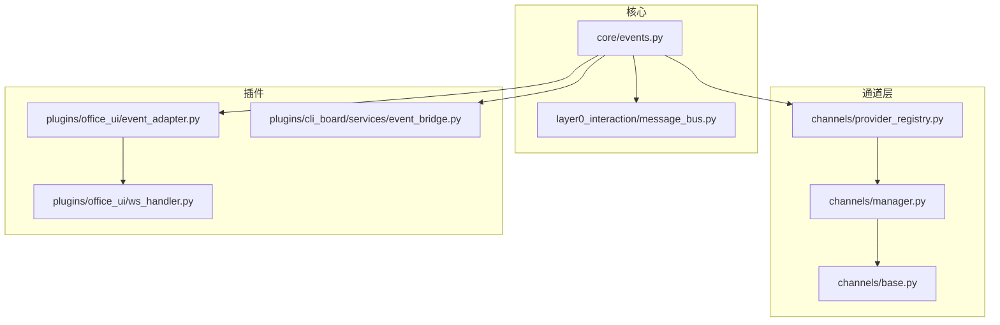
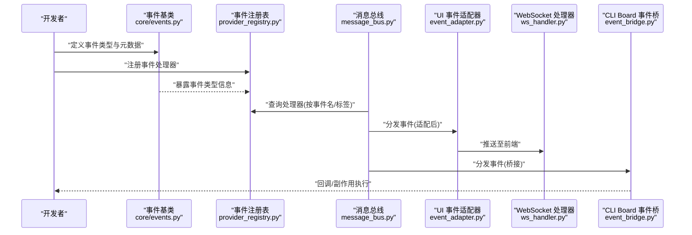
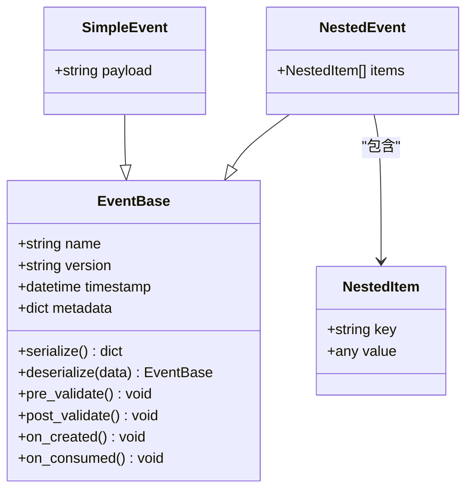
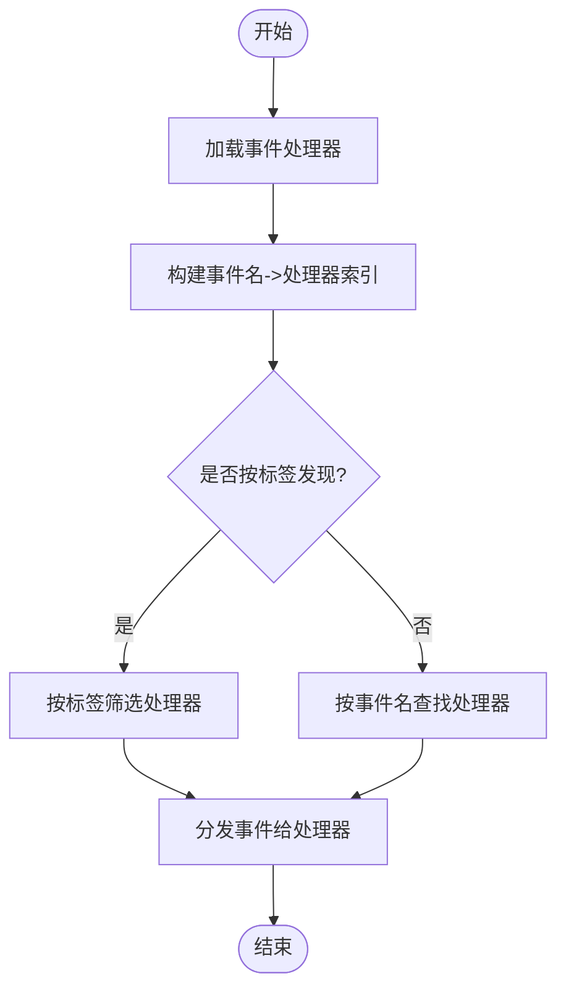
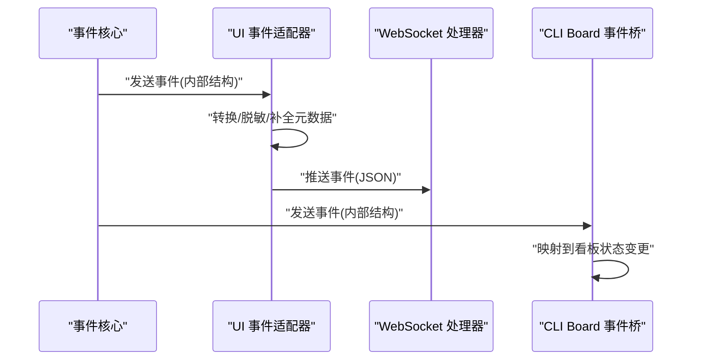
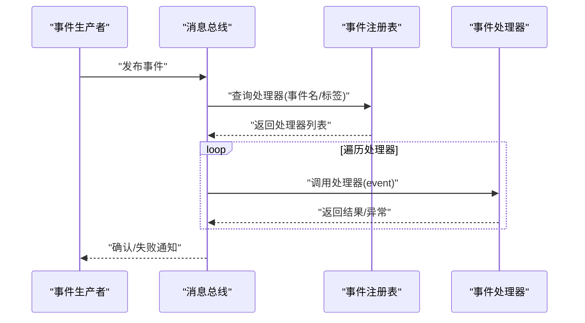
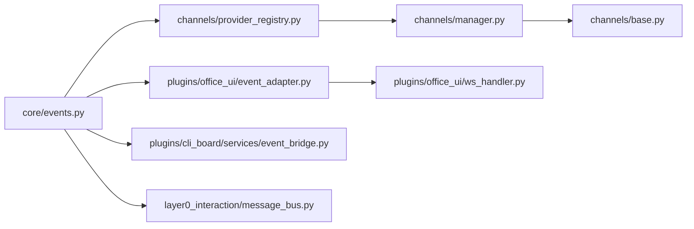

# 事件定义与注册

<cite>
**本文引用的文件**   
- [opc/core/events.py](file://opc/core/events.py)
- [opc/channels/provider_registry.py](file://opc/channels/provider_registry.py)
- [opc/channels/manager.py](file://opc/channels/manager.py)
- [opc/channels/base.py](file://opc/channels/base.py)
- [opc/plugins/office_ui/event_adapter.py](file://opc/plugins/office_ui/event_adapter.py)
- [opc/plugins/office_ui/ws_handler.py](file://opc/plugins/office_ui/ws_handler.py)
- [opc/plugins/cli_board/services/event_bridge.py](file://opc/plugins/cli_board/services/event_bridge.py)
- [opc/layer0_interaction/message_bus.py](file://opc/layer0_interaction/message_bus.py)
</cite>

## 目录
1. [简介](#简介)
2. [项目结构](#项目结构)
3. [核心组件](#核心组件)
4. [架构总览](#架构总览)
5. [详细组件分析](#详细组件分析)
6. [依赖关系分析](#依赖关系分析)
7. [性能考虑](#性能考虑)
8. [故障排查指南](#故障排查指南)
9. [结论](#结论)
10. [附录](#附录)

## 简介
本文件聚焦于 OpenOPC 的事件定义与注册机制，围绕以下目标展开：
- 事件的类型系统与事件基类设计
- 事件元数据管理与版本控制策略
- 新事件类型的定义方法（属性、验证规则、生命周期钩子）
- 事件注册机制与事件发现模式
- 事件序列化与反序列化的实现细节
- 自定义事件创建的完整示例（简单事件与复杂嵌套事件）
- 事件定义的命名规范与最佳实践

## 项目结构
OpenOPC 将“事件”抽象为可描述、可注册、可分发、可适配的领域对象。核心位于 core.events，并在 UI 插件与 CLI Board 插件中提供桥接与适配能力；通道层通过提供者注册表进行扩展。

图表来源
- [opc/core/events.py](file://opc/core/events.py)
- [opc/layer0_interaction/message_bus.py](file://opc/layer0_interaction/message_bus.py)
- [opc/channels/provider_registry.py](file://opc/channels/provider_registry.py)
- [opc/channels/manager.py](file://opc/channels/manager.py)
- [opc/channels/base.py](file://opc/channels/base.py)
- [opc/plugins/office_ui/event_adapter.py](file://opc/plugins/office_ui/event_adapter.py)
- [opc/plugins/office_ui/ws_handler.py](file://opc/plugins/office_ui/ws_handler.py)
- [opc/plugins/cli_board/services/event_bridge.py](file://opc/plugins/cli_board/services/event_bridge.py)

章节来源
- [opc/core/events.py](file://opc/core/events.py)
- [opc/channels/provider_registry.py](file://opc/channels/provider_registry.py)
- [opc/channels/manager.py](file://opc/channels/manager.py)
- [opc/channels/base.py](file://opc/channels/base.py)
- [opc/plugins/office_ui/event_adapter.py](file://opc/plugins/office_ui/event_adapter.py)
- [opc/plugins/office_ui/ws_handler.py](file://opc/plugins/office_ui/ws_handler.py)
- [opc/plugins/cli_board/services/event_bridge.py](file://opc/plugins/cli_board/services/event_bridge.py)
- [opc/layer0_interaction/message_bus.py](file://opc/layer0_interaction/message_bus.py)

## 核心组件
- 事件基类与类型系统：定义事件的基础形态、元数据字段、校验与序列化契约，以及可选的生命周期钩子。
- 事件注册表与发现：集中管理事件类型到处理器的映射，支持按名称或标签发现处理器。
- 适配器与桥接：在 UI 与 CLI Board 之间对事件进行适配与转发，屏蔽底层差异。
- 消息总线：作为事件分发的中间件，解耦生产者与消费者。

章节来源
- [opc/core/events.py](file://opc/core/events.py)
- [opc/channels/provider_registry.py](file://opc/channels/provider_registry.py)
- [opc/plugins/office_ui/event_adapter.py](file://opc/plugins/office_ui/event_adapter.py)
- [opc/plugins/cli_board/services/event_bridge.py](file://opc/plugins/cli_board/services/event_bridge.py)
- [opc/layer0_interaction/message_bus.py](file://opc/layer0_interaction/message_bus.py)

## 架构总览
下图展示了从事件定义到注册、发现、适配与分发的整体流程。

图表来源
- [opc/core/events.py](file://opc/core/events.py)
- [opc/channels/provider_registry.py](file://opc/channels/provider_registry.py)
- [opc/layer0_interaction/message_bus.py](file://opc/layer0_interaction/message_bus.py)
- [opc/plugins/office_ui/event_adapter.py](file://opc/plugins/office_ui/event_adapter.py)
- [opc/plugins/office_ui/ws_handler.py](file://opc/plugins/office_ui/ws_handler.py)
- [opc/plugins/cli_board/services/event_bridge.py](file://opc/plugins/cli_board/services/event_bridge.py)

## 详细组件分析

### 事件基类与类型系统
- 事件基类职责
  - 统一事件的结构与元数据（如事件名、版本、时间戳、来源等）。
  - 提供序列化/反序列化接口，确保跨进程/跨模块传输一致性。
  - 暴露可选的生命周期钩子（如创建前、校验、持久化前后、消费后），供框架或业务扩展点使用。
- 类型系统
  - 基于事件名与版本号的组合标识事件类型，避免强耦合。
  - 支持向后兼容的版本策略：新版本可添加可选字段，旧版本忽略未知字段。
- 验证规则
  - 在构造时进行必填字段校验、格式校验与业务约束校验。
  - 提供可扩展的校验器集合，便于新增字段时加入相应规则。

图表来源
- [opc/core/events.py](file://opc/core/events.py)

章节来源
- [opc/core/events.py](file://opc/core/events.py)

### 事件注册机制与发现模式
- 注册表
  - 维护事件名到处理器函数的映射，支持按事件名精确匹配与按标签模糊匹配。
  - 提供去重与覆盖策略，保证同一事件名仅有一个主处理器。
- 发现模式
  - 启动阶段扫描已注册的处理器并建立索引。
  - 运行时根据事件元数据动态选择处理器，支持多订阅者广播。

图表来源
- [opc/channels/provider_registry.py](file://opc/channels/provider_registry.py)

章节来源
- [opc/channels/provider_registry.py](file://opc/channels/provider_registry.py)

### 事件适配器与桥接
- UI 事件适配器
  - 将内部事件转换为前端可消费的 JSON 结构，过滤敏感字段，补充展示所需元数据。
  - 通过 WebSocket 处理器推送至浏览器端。
- CLI Board 事件桥
  - 将事件桥接到 CLI Board 的状态机或服务层，驱动看板更新与任务流转。

图表来源
- [opc/plugins/office_ui/event_adapter.py](file://opc/plugins/office_ui/event_adapter.py)
- [opc/plugins/office_ui/ws_handler.py](file://opc/plugins/office_ui/ws_handler.py)
- [opc/plugins/cli_board/services/event_bridge.py](file://opc/plugins/cli_board/services/event_bridge.py)

章节来源
- [opc/plugins/office_ui/event_adapter.py](file://opc/plugins/office_ui/event_adapter.py)
- [opc/plugins/office_ui/ws_handler.py](file://opc/plugins/office_ui/ws_handler.py)
- [opc/plugins/cli_board/services/event_bridge.py](file://opc/plugins/cli_board/services/event_bridge.py)

### 消息总线与事件分发
- 角色
  - 作为事件的生产者与消费者的中介，解耦业务逻辑与事件传播。
  - 支持同步/异步分发、重试与错误隔离。
- 与注册表的协作
  - 根据事件名或标签查询处理器列表，依次调用或并发调用。

图表来源
- [opc/layer0_interaction/message_bus.py](file://opc/layer0_interaction/message_bus.py)
- [opc/channels/provider_registry.py](file://opc/channels/provider_registry.py)

章节来源
- [opc/layer0_interaction/message_bus.py](file://opc/layer0_interaction/message_bus.py)
- [opc/channels/provider_registry.py](file://opc/channels/provider_registry.py)

### 事件版本控制与向后兼容性策略
- 版本号语义
  - 采用主版本/次版本/修订号三元组，主版本变更表示破坏性更新。
- 兼容策略
  - 新增可选字段：旧版本忽略未知字段，新版本读取默认值。
  - 移除字段：在新版本中保留占位字段并标记废弃，逐步迁移。
  - 校验规则演进：在 post_validate 钩子中引入渐进式校验，允许过渡期兼容。
- 迁移建议
  - 在 on_created 钩子中进行数据补齐与格式标准化。
  - 在 on_consumed 钩子中记录兼容日志，便于审计与回滚。

章节来源
- [opc/core/events.py](file://opc/core/events.py)

### 自定义事件创建示例

#### 简单事件
- 步骤
  - 继承事件基类，声明必要字段与元数据。
  - 在 pre_validate/post_validate 中实现字段校验。
  - 在 on_created/on_consumed 中实现生命周期钩子（如打点、审计）。
  - 通过注册表注册处理器，或在消息总线中直接发布。
- 参考路径
  - 事件基类与生命周期钩子：[opc/core/events.py](file://opc/core/events.py)
  - 注册与发现：[opc/channels/provider_registry.py](file://opc/channels/provider_registry.py)
  - 分发入口：[opc/layer0_interaction/message_bus.py](file://opc/layer0_interaction/message_bus.py)

章节来源
- [opc/core/events.py](file://opc/core/events.py)
- [opc/channels/provider_registry.py](file://opc/channels/provider_registry.py)
- [opc/layer0_interaction/message_bus.py](file://opc/layer0_interaction/message_bus.py)

#### 复杂嵌套事件
- 步骤
  - 定义嵌套子事件模型，明确键值结构与数据类型。
  - 在父事件中聚合子事件列表，并在校验阶段递归校验。
  - 在序列化时扁平化或分层输出，确保前端/下游可读。
  - 在适配器中按需裁剪大对象，避免网络负载过高。
- 参考路径
  - 嵌套模型与校验：[opc/core/events.py](file://opc/core/events.py)
  - UI 适配与裁剪：[opc/plugins/office_ui/event_adapter.py](file://opc/plugins/office_ui/event_adapter.py)
  - WebSocket 推送：[opc/plugins/office_ui/ws_handler.py](file://opc/plugins/office_ui/ws_handler.py)

章节来源
- [opc/core/events.py](file://opc/core/events.py)
- [opc/plugins/office_ui/event_adapter.py](file://opc/plugins/office_ui/event_adapter.py)
- [opc/plugins/office_ui/ws_handler.py](file://opc/plugins/office_ui/ws_handler.py)

### 事件序列化与反序列化
- 序列化
  - 将事件对象转换为字典或 JSON，包含基础元数据与载荷。
  - 对敏感字段进行脱敏或剔除。
- 反序列化
  - 从外部输入恢复事件对象，执行预校验与默认值填充。
  - 对未知字段采取宽容策略，提升兼容性。
- 参考路径
  - 序列化/反序列化接口：[opc/core/events.py](file://opc/core/events.py)
  - UI 侧转换与脱敏：[opc/plugins/office_ui/event_adapter.py](file://opc/plugins/office_ui/event_adapter.py)

章节来源
- [opc/core/events.py](file://opc/core/events.py)
- [opc/plugins/office_ui/event_adapter.py](file://opc/plugins/office_ui/event_adapter.py)

### 事件定义的命名规范与最佳实践
- 命名规范
  - 使用小写英文单词与下划线分隔，体现领域与动作，例如 user_login_success。
  - 事件名不包含版本信息，版本号独立管理。
  - 避免使用通用词根，尽量具备唯一性与可读性。
- 最佳实践
  - 保持事件不可变，修改应产生新事件而非原地变更。
  - 载荷最小化，只携带必要信息；大对象通过引用或异步拉取。
  - 校验前置，尽早失败；错误信息结构化，便于定位。
  - 生命周期钩子轻量，避免阻塞主流程；耗时操作异步化。
  - 版本演进遵循向后兼容原则，废弃字段需标注并给出迁移指引。

章节来源
- [opc/core/events.py](file://opc/core/events.py)

## 依赖关系分析
- 组件耦合
  - 事件核心与注册表松耦合，通过事件名/标签进行匹配。
  - 适配器与处理器通过标准事件结构交互，屏蔽平台差异。
- 外部依赖
  - WebSocket 用于实时推送，消息总线用于解耦分发。
- 潜在循环依赖
  - 应避免在事件处理器中反向依赖事件定义模块，必要时通过接口或配置注入。

图表来源
- [opc/core/events.py](file://opc/core/events.py)
- [opc/channels/provider_registry.py](file://opc/channels/provider_registry.py)
- [opc/channels/manager.py](file://opc/channels/manager.py)
- [opc/channels/base.py](file://opc/channels/base.py)
- [opc/plugins/office_ui/event_adapter.py](file://opc/plugins/office_ui/event_adapter.py)
- [opc/plugins/office_ui/ws_handler.py](file://opc/plugins/office_ui/ws_handler.py)
- [opc/plugins/cli_board/services/event_bridge.py](file://opc/plugins/cli_board/services/event_bridge.py)
- [opc/layer0_interaction/message_bus.py](file://opc/layer0_interaction/message_bus.py)

章节来源
- [opc/core/events.py](file://opc/core/events.py)
- [opc/channels/provider_registry.py](file://opc/channels/provider_registry.py)
- [opc/channels/manager.py](file://opc/channels/manager.py)
- [opc/channels/base.py](file://opc/channels/base.py)
- [opc/plugins/office_ui/event_adapter.py](file://opc/plugins/office_ui/event_adapter.py)
- [opc/plugins/office_ui/ws_handler.py](file://opc/plugins/office_ui/ws_handler.py)
- [opc/plugins/cli_board/services/event_bridge.py](file://opc/plugins/cli_board/services/event_bridge.py)
- [opc/layer0_interaction/message_bus.py](file://opc/layer0_interaction/message_bus.py)

## 性能考虑
- 事件载荷大小控制：避免在大事件中传输冗余数据，优先传递标识符与摘要。
- 处理器并发度：在高吞吐场景下，合理设置消息总线的并发度与队列长度。
- 适配器裁剪：在 UI 适配器中对大对象进行分页或懒加载，减少网络开销。
- 校验成本：将昂贵校验延迟到必要路径，或使用增量校验。

## 故障排查指南
- 常见问题
  - 事件未触发：检查注册表是否正确注册处理器，事件名是否一致。
  - 前端无更新：确认 UI 适配器是否成功转换与推送，WebSocket 连接是否正常。
  - 版本不兼容：查看事件版本字段与校验钩子日志，确认是否存在破坏性变更。
- 定位手段
  - 启用事件分发日志，记录事件名、版本、处理器数量与耗时。
  - 在 on_created/on_consumed 钩子中输出结构化审计信息。
  - 使用消息总线提供的重试与失败回调，捕获异常堆栈。

章节来源
- [opc/channels/provider_registry.py](file://opc/channels/provider_registry.py)
- [opc/plugins/office_ui/event_adapter.py](file://opc/plugins/office_ui/event_adapter.py)
- [opc/plugins/office_ui/ws_handler.py](file://opc/plugins/office_ui/ws_handler.py)
- [opc/layer0_interaction/message_bus.py](file://opc/layer0_interaction/message_bus.py)

## 结论
OpenOPC 的事件体系以清晰的基类设计与灵活的注册发现机制为核心，结合适配器与消息总线，实现了跨模块、跨平台的稳定事件分发。通过严格的版本控制与兼容性策略，系统在演进过程中保持了良好的向后兼容性与可维护性。遵循命名规范与最佳实践，可进一步提升系统的可读性与可靠性。

## 附录
- 快速上手清单
  - 定义事件：继承基类，声明字段与元数据。
  - 实现校验：在预/后校验钩子中加入规则。
  - 注册处理器：在注册表中登记事件名与处理器函数。
  - 发布事件：通过消息总线或直接调用适配器。
  - 观察效果：在 UI 或 CLI Board 中确认事件生效。