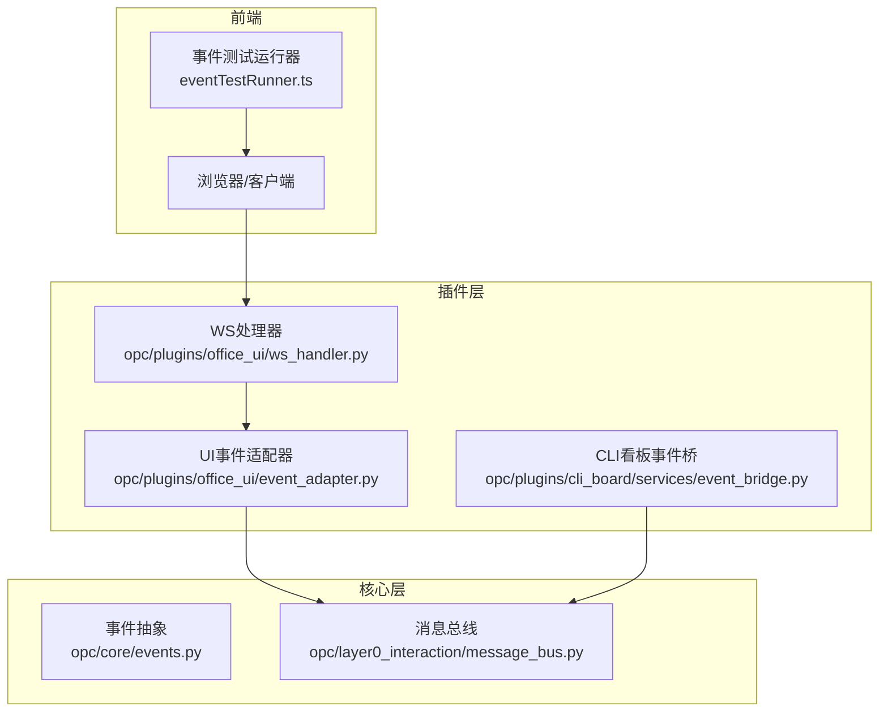
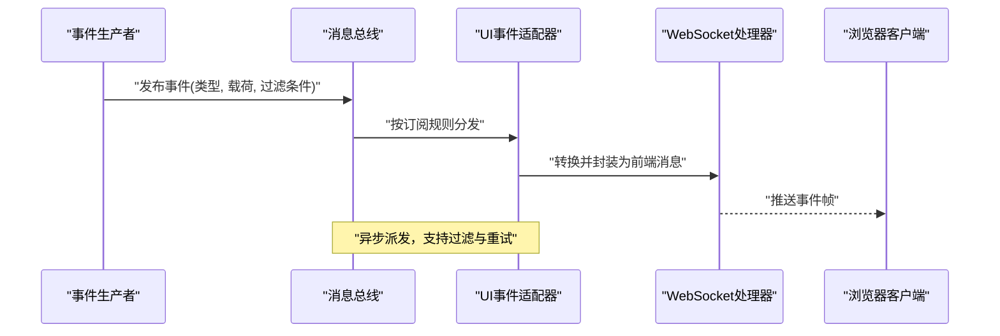
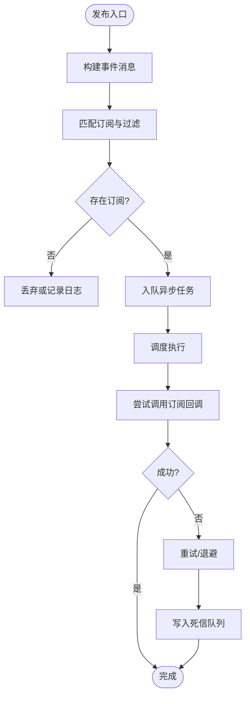
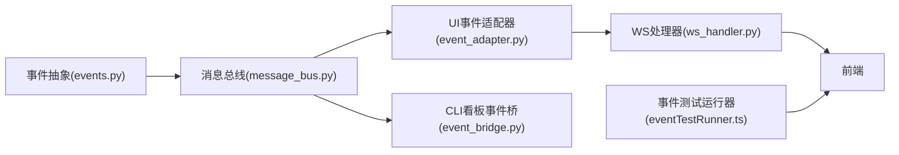

# 事件系统

<cite>
**本文引用的文件**   
- [opc/core/events.py](file://opc/core/events.py)
- [opc/layer0_interaction/message_bus.py](file://opc/layer0_interaction/message_bus.py)
- [opc/plugins/office_ui/event_adapter.py](file://opc/plugins/office_ui/event_adapter.py)
- [opc/plugins/office_ui/ws_handler.py](file://opc/plugins/office_ui/ws_handler.py)
- [opc/plugins/cli_board/services/event_bridge.py](file://opc/plugins/cli_board/services/event_bridge.py)
- [opc/plugins/office_ui/game/test/eventTestRunner.ts](file://opc/plugins/office_ui/game/test/eventTestRunner.ts)
</cite>

## 目录
1. [简介](#简介)
2. [项目结构](#项目结构)
3. [核心组件](#核心组件)
4. [架构总览](#架构总览)
5. [详细组件分析](#详细组件分析)
6. [依赖关系分析](#依赖关系分析)
7. [性能考虑](#性能考虑)
8. [故障排查指南](#故障排查指南)
9. [结论](#结论)
10. [附录](#附录)

## 简介
本文件面向OpenOPC的事件系统，聚焦于事件发布订阅模式的实现原理与架构设计。文档将解释事件的定义、注册、发布与订阅机制，描述异步事件处理模型与消息传递路径，说明事件过滤、路由与错误处理策略，并提供事件驱动编程的最佳实践与性能优化建议。同时给出如何创建自定义事件和处理复杂事件流的示例指引，并阐述事件系统与消息总线的集成关系，以及事件调试与监控的工具与方法。

## 项目结构
OpenOPC的事件相关能力主要分布在以下模块：
- 核心事件抽象与基础能力：位于 core/events.py
- 进程内消息总线（事件通道）：位于 layer0_interaction/message_bus.py
- 前端UI事件适配与WebSocket桥接：位于 plugins/office_ui/event_adapter.py 与 ws_handler.py
- CLI看板服务侧事件桥接：位于 plugins/cli_board/services/event_bridge.py
- 前端测试工具对事件流验证：位于 plugins/office_ui/game/test/eventTestRunner.ts

图表来源
- [opc/core/events.py](file://opc/core/events.py)
- [opc/layer0_interaction/message_bus.py](file://opc/layer0_interaction/message_bus.py)
- [opc/plugins/office_ui/event_adapter.py](file://opc/plugins/office_ui/event_adapter.py)
- [opc/plugins/office_ui/ws_handler.py](file://opc/plugins/office_ui/ws_handler.py)
- [opc/plugins/cli_board/services/event_bridge.py](file://opc/plugins/cli_board/services/event_bridge.py)
- [opc/plugins/office_ui/game/test/eventTestRunner.ts](file://opc/plugins/office_ui/game/test/eventTestRunner.ts)

章节来源
- [opc/core/events.py](file://opc/core/events.py)
- [opc/layer0_interaction/message_bus.py](file://opc/layer0_interaction/message_bus.py)
- [opc/plugins/office_ui/event_adapter.py](file://opc/plugins/office_ui/event_adapter.py)
- [opc/plugins/office_ui/ws_handler.py](file://opc/plugins/office_ui/ws_handler.py)
- [opc/plugins/cli_board/services/event_bridge.py](file://opc/plugins/cli_board/services/event_bridge.py)
- [opc/plugins/office_ui/game/test/eventTestRunner.ts](file://opc/plugins/office_ui/game/test/eventTestRunner.ts)

## 核心组件
- 事件抽象与类型：提供事件基类、事件元数据、事件生命周期钩子等，用于统一事件契约与扩展点。
- 消息总线：作为进程内事件通道，负责事件分发、订阅管理、过滤与路由，支持异步派发与背压控制。
- UI事件适配器：将后端事件转换为前端可消费的消息格式，并通过WebSocket推送至浏览器端。
- WebSocket处理器：维护连接、鉴权与会话上下文，转发事件到适配器或直接路由到业务处理器。
- CLI看板事件桥：在CLI看板服务中桥接内部事件与外部展示层，保证状态一致性与实时性。
- 前端事件测试运行器：用于端到端验证事件链路是否正确、时序是否稳定。

章节来源
- [opc/core/events.py](file://opc/core/events.py)
- [opc/layer0_interaction/message_bus.py](file://opc/layer0_interaction/message_bus.py)
- [opc/plugins/office_ui/event_adapter.py](file://opc/plugins/office_ui/event_adapter.py)
- [opc/plugins/office_ui/ws_handler.py](file://opc/plugins/office_ui/ws_handler.py)
- [opc/plugins/cli_board/services/event_bridge.py](file://opc/plugins/cli_board/services/event_bridge.py)
- [opc/plugins/office_ui/game/test/eventTestRunner.ts](file://opc/plugins/office_ui/game/test/eventTestRunner.ts)

## 架构总览
事件系统采用“生产者—总线—消费者”的解耦模式。生产者在任意位置发布事件，总线根据订阅规则进行过滤与路由，最终由订阅者异步消费。UI通过WebSocket接收事件，CLI看板通过事件桥接入同一总线，形成多端一致的实时视图。

图表来源
- [opc/layer0_interaction/message_bus.py](file://opc/layer0_interaction/message_bus.py)
- [opc/plugins/office_ui/event_adapter.py](file://opc/plugins/office_ui/event_adapter.py)
- [opc/plugins/office_ui/ws_handler.py](file://opc/plugins/office_ui/ws_handler.py)

## 详细组件分析

### 事件抽象与类型（opc/core/events.py）
- 职责
  - 定义事件基类与通用字段（如事件ID、时间戳、来源、版本等）。
  - 提供事件生命周期钩子（如创建、序列化、反序列化、校验、清理）。
  - 约定事件命名空间与分类，便于过滤与路由。
- 关键设计
  - 强类型约束：通过类型提示与校验确保事件载荷一致性。
  - 可扩展性：子类可通过重写钩子定制行为。
  - 兼容性：版本号与迁移钩子保障向后兼容。
- 复杂度与性能
  - 事件对象构造与序列化通常为O(n)，n为载荷大小；避免在高频路径中进行深拷贝或重型计算。
- 错误处理
  - 在序列化/反序列化阶段捕获异常并记录诊断信息，必要时降级为最小可用载荷。

章节来源
- [opc/core/events.py](file://opc/core/events.py)

### 消息总线（opc/layer0_interaction/message_bus.py）
- 职责
  - 维护订阅表与路由表，支持按事件类型、标签、来源等多维过滤。
  - 提供发布接口，支持同步/异步派发与批量发布。
  - 实现重试、退避与死信队列，保障可靠性。
- 关键流程
  - 订阅：注册回调函数与过滤谓词，返回订阅句柄以便取消。
  - 发布：查找匹配订阅，构建投递任务，入队异步执行。
  - 路由：基于事件元数据进行优先级与目标选择。
- 并发与背压
  - 使用线程池或协程池执行订阅回调，限制并发度防止雪崩。
  - 当消费者慢时，通过队列容量上限与丢弃策略保护总线。
- 错误处理
  - 单个订阅失败不影响其他订阅；失败事件进入重试队列或死信队列，供后续审计与重放。

图表来源
- [opc/layer0_interaction/message_bus.py](file://opc/layer0_interaction/message_bus.py)

章节来源
- [opc/layer0_interaction/message_bus.py](file://opc/layer0_interaction/message_bus.py)

### UI事件适配器（opc/plugins/office_ui/event_adapter.py）
- 职责
  - 将后端事件转换为前端消息格式（如JSON），附加会话、用户、权限等上下文。
  - 对敏感字段进行脱敏与裁剪，减少传输体积。
  - 聚合与折叠相似事件，降低前端渲染压力。
- 与WebSocket集成
  - 将事件推送到ws_handler，由其负责连接管理与帧发送。
- 性能优化
  - 批量合并、去抖与节流策略，避免频繁小消息风暴。
  - 按需订阅，仅转发当前会话可见的事件。

章节来源
- [opc/plugins/office_ui/event_adapter.py](file://opc/plugins/office_ui/event_adapter.py)

### WebSocket处理器（opc/plugins/office_ui/ws_handler.py）
- 职责
  - 管理WebSocket连接生命周期，处理握手、心跳、断线重连。
  - 鉴权与会话绑定，确保事件只推送给授权客户端。
  - 将适配器输出的消息序列化为帧并发送。
- 错误处理
  - 连接异常自动重连；发送失败时回退为本地缓存或延迟重试。
- 安全
  - 输入校验、速率限制与黑名单机制，防止滥用。

章节来源
- [opc/plugins/office_ui/ws_handler.py](file://opc/plugins/office_ui/ws_handler.py)

### CLI看板事件桥（opc/plugins/cli_board/services/event_bridge.py）
- 职责
  - 在CLI看板服务中订阅总线事件，更新看板状态与活动流。
  - 将内部领域事件映射为看板动作，保持界面与业务状态一致。
- 容错
  - 本地快照与增量同步，网络或服务中断时可恢复。
- 性能
  - 批处理与差异更新，减少UI刷新开销。

章节来源
- [opc/plugins/cli_board/services/event_bridge.py](file://opc/plugins/cli_board/services/event_bridge.py)

### 前端事件测试运行器（opc/plugins/office_ui/game/test/eventTestRunner.ts）
- 职责
  - 模拟事件源与订阅者，验证端到端事件链路。
  - 检查事件顺序、去重、过滤与错误恢复。
- 使用方式
  - 在测试环境中启动事件源，注入断言器，收集并校验事件轨迹。

章节来源
- [opc/plugins/office_ui/game/test/eventTestRunner.ts](file://opc/plugins/office_ui/game/test/eventTestRunner.ts)

## 依赖关系分析
- 耦合与内聚
  - 事件抽象与总线低耦合，通过类型与协议交互；UI适配与WS处理器高内聚，专注前端交付。
- 直接依赖
  - 适配器依赖总线与WS处理器；WS处理器依赖适配器输出；CLI看板事件桥依赖总线。
- 间接依赖
  - 前端通过WS间接依赖总线；测试运行器依赖前端与事件源。
- 潜在循环
  - 通过明确分层与单向依赖避免循环；若出现，应引入接口隔离或事件中介。

图表来源
- [opc/core/events.py](file://opc/core/events.py)
- [opc/layer0_interaction/message_bus.py](file://opc/layer0_interaction/message_bus.py)
- [opc/plugins/office_ui/event_adapter.py](file://opc/plugins/office_ui/event_adapter.py)
- [opc/plugins/office_ui/ws_handler.py](file://opc/plugins/office_ui/ws_handler.py)
- [opc/plugins/cli_board/services/event_bridge.py](file://opc/plugins/cli_board/services/event_bridge.py)
- [opc/plugins/office_ui/game/test/eventTestRunner.ts](file://opc/plugins/office_ui/game/test/eventTestRunner.ts)

章节来源
- [opc/core/events.py](file://opc/core/events.py)
- [opc/layer0_interaction/message_bus.py](file://opc/layer0_interaction/message_bus.py)
- [opc/plugins/office_ui/event_adapter.py](file://opc/plugins/office_ui/event_adapter.py)
- [opc/plugins/office_ui/ws_handler.py](file://opc/plugins/office_ui/ws_handler.py)
- [opc/plugins/cli_board/services/event_bridge.py](file://opc/plugins/cli_board/services/event_bridge.py)
- [opc/plugins/office_ui/game/test/eventTestRunner.ts](file://opc/plugins/office_ui/game/test/eventTestRunner.ts)

## 性能考虑
- 事件粒度与批处理
  - 合并相近事件，减少消息数量；对高频事件启用去抖与节流。
- 异步与并发
  - 使用协程或线程池执行订阅回调，限制最大并发度，避免阻塞总线。
- 过滤与路由
  - 在总线层尽早过滤，缩小投递范围；利用索引与分片提升匹配效率。
- 背压与限流
  - 设置队列容量上限与丢弃策略；对慢消费者实施背压与降级。
- 序列化与传输
  - 精简载荷、压缩可选字段；对大对象采用引用与懒加载。
- 观测与度量
  - 统计发布/订阅延迟、吞吐、失败率与死信量，指导调优。

[本节为通用性能建议，不直接分析具体文件]

## 故障排查指南
- 常见问题
  - 事件未到达：检查订阅是否注册、过滤条件是否过严、路由键是否正确。
  - 重复事件：确认去重策略与幂等处理是否生效。
  - 延迟过高：查看队列长度、消费者耗时、GC与锁竞争。
  - 丢失事件：检查死信队列与持久化开关，确认重试与补偿逻辑。
- 定位方法
  - 启用事件追踪ID，贯穿发布、路由、消费全链路。
  - 采集指标：发布速率、订阅数、平均延迟、P99延迟、错误码分布。
  - 回放与复现：从死信队列或持久化日志回放事件，定位边界条件。
- 修复建议
  - 增加超时与熔断；对关键路径添加重试与补偿；完善告警阈值。

章节来源
- [opc/layer0_interaction/message_bus.py](file://opc/layer0_interaction/message_bus.py)
- [opc/plugins/office_ui/event_adapter.py](file://opc/plugins/office_ui/event_adapter.py)
- [opc/plugins/office_ui/ws_handler.py](file://opc/plugins/office_ui/ws_handler.py)
- [opc/plugins/cli_board/services/event_bridge.py](file://opc/plugins/cli_board/services/event_bridge.py)

## 结论
OpenOPC事件系统以清晰的分层与明确的契约实现了高内聚、低耦合的发布订阅模型。通过消息总线进行过滤与路由，结合UI适配与WebSocket推送，以及CLI看板事件桥的多端一致性，形成了可靠且可扩展的事件驱动架构。配合完善的错误处理、性能优化与观测手段，可在复杂业务场景中稳定支撑实时交互与状态同步。

[本节为总结性内容，不直接分析具体文件]

## 附录

### 最佳实践
- 事件设计
  - 使用稳定的事件命名空间与版本策略；载荷尽量不可变。
  - 明确事件语义与副作用，避免隐式状态变更。
- 订阅者开发
  - 幂等处理与去重；快速返回，长任务异步化。
  - 合理设置超时与重试策略，避免级联失败。
- 路由与过滤
  - 在总线层做粗粒度过滤，在订阅者做细粒度校验。
  - 使用标签与来源区分不同域的事件。
- 可观测性
  - 全链路追踪、结构化日志与指标上报；建立告警与自愈流程。

[本节为通用指导，不直接分析具体文件]

### 自定义事件与复杂事件流示例指引
- 创建自定义事件
  - 参考事件抽象定义新事件类型，补充必要字段与校验逻辑。
  - 在事件钩子中实现序列化/反序列化与兼容性处理。
- 注册与发布
  - 在初始化阶段注册订阅者，指定过滤条件与回调。
  - 在业务流程中发布事件，携带最小必要载荷。
- 复杂事件流
  - 组合多个简单事件，使用窗口与聚合算子生成复合事件。
  - 对乱序与迟到事件进行处理，保证最终一致性。
- 参考路径
  - 事件抽象与类型：[opc/core/events.py](file://opc/core/events.py)
  - 总线订阅与发布：[opc/layer0_interaction/message_bus.py](file://opc/layer0_interaction/message_bus.py)
  - UI适配与推送：[opc/plugins/office_ui/event_adapter.py](file://opc/plugins/office_ui/event_adapter.py)、[opc/plugins/office_ui/ws_handler.py](file://opc/plugins/office_ui/ws_handler.py)
  - CLI看板桥接：[opc/plugins/cli_board/services/event_bridge.py](file://opc/plugins/cli_board/services/event_bridge.py)
  - 前端测试验证：[opc/plugins/office_ui/game/test/eventTestRunner.ts](file://opc/plugins/office_ui/game/test/eventTestRunner.ts)

章节来源
- [opc/core/events.py](file://opc/core/events.py)
- [opc/layer0_interaction/message_bus.py](file://opc/layer0_interaction/message_bus.py)
- [opc/plugins/office_ui/event_adapter.py](file://opc/plugins/office_ui/event_adapter.py)
- [opc/plugins/office_ui/ws_handler.py](file://opc/plugins/office_ui/ws_handler.py)
- [opc/plugins/cli_board/services/event_bridge.py](file://opc/plugins/cli_board/services/event_bridge.py)
- [opc/plugins/office_ui/game/test/eventTestRunner.ts](file://opc/plugins/office_ui/game/test/eventTestRunner.ts)