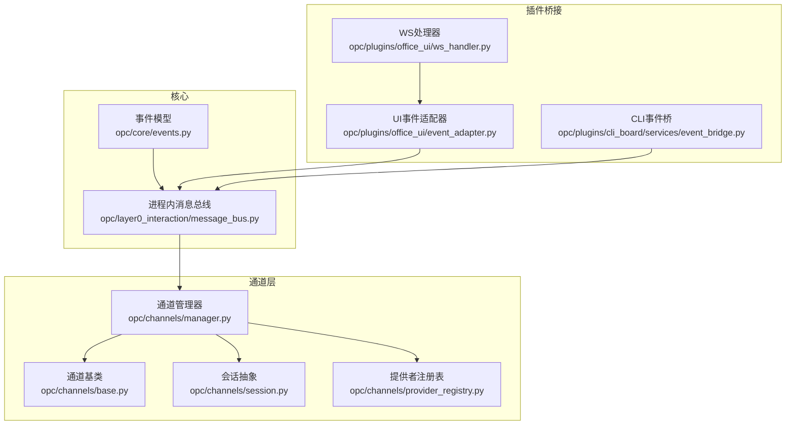
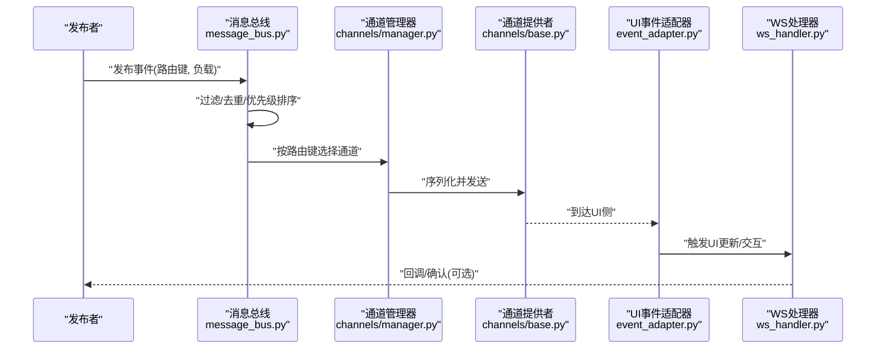
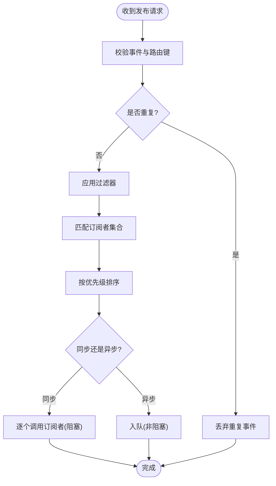
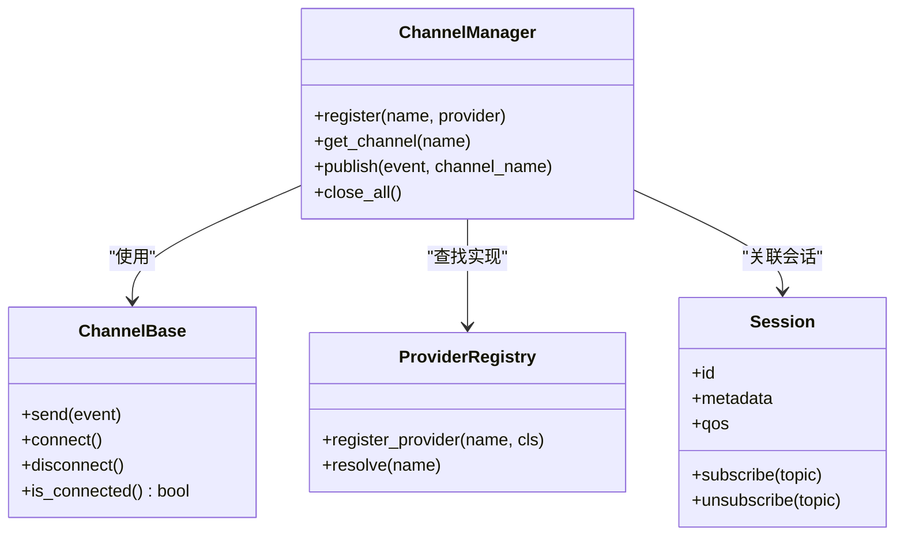
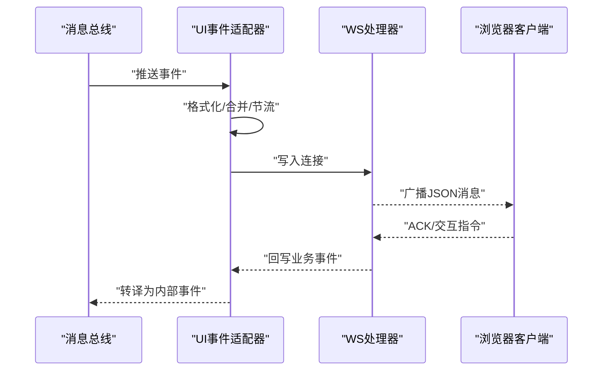
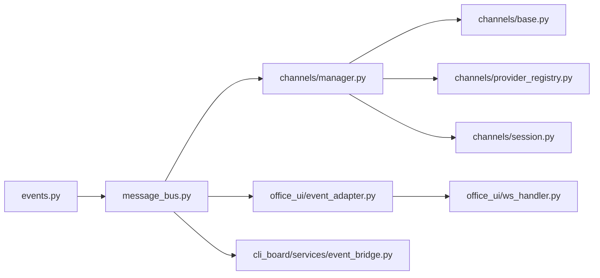

# 发布订阅机制

<cite>
**本文引用的文件**   
- [opc/core/events.py](file://opc/core/events.py)
- [opc/layer0_interaction/message_bus.py](file://opc/layer0_interaction/message_bus.py)
- [opc/channels/manager.py](file://opc/channels/manager.py)
- [opc/channels/base.py](file://opc/channels/base.py)
- [opc/channels/provider_registry.py](file://opc/channels/provider_registry.py)
- [opc/channels/session.py](file://opc/channels/session.py)
- [opc/plugins/office_ui/event_adapter.py](file://opc/plugins/office_ui/event_adapter.py)
- [opc/plugins/office_ui/ws_handler.py](file://opc/plugins/office_ui/ws_handler.py)
- [opc/plugins/cli_board/services/event_bridge.py](file://opc/plugins/cli_board/services/event_bridge.py)
</cite>

## 目录
1. [简介](#简介)
2. [项目结构](#项目结构)
3. [核心组件](#核心组件)
4. [架构总览](#架构总览)
5. [详细组件分析](#详细组件分析)
6. [依赖关系分析](#依赖关系分析)
7. [性能与内存管理](#性能与内存管理)
8. [故障排查指南](#故障排查指南)
9. [结论](#结论)
10. [附录：示例与最佳实践](#附录示例与最佳实践)

## 简介
本文件面向OpenOPC的“发布-订阅”事件机制，系统性阐述其实现原理、核心组件、事件发布流程（同步/异步）、订阅注册与匹配分发、事件过滤器、优先级与并发控制策略、去重与重复消息处理、以及性能调优与内存管理最佳实践。文档同时提供从代码到架构的多层次图示，帮助读者快速理解并正确使用该机制。

## 项目结构
OpenOPC的事件系统围绕以下关键模块组织：
- 核心事件总线与事件模型：位于 core/events.py
- 进程内消息总线：位于 layer0_interaction/message_bus.py
- 通道管理与会话：位于 channels/manager.py、channels/base.py、channels/session.py
- 外部UI与CLI插件桥接：位于 plugins/office_ui/event_adapter.py、plugins/office_ui/ws_handler.py、plugins/cli_board/services/event_bridge.py

图表来源
- [opc/core/events.py](file://opc/core/events.py)
- [opc/layer0_interaction/message_bus.py](file://opc/layer0_interaction/message_bus.py)
- [opc/channels/manager.py](file://opc/channels/manager.py)
- [opc/channels/base.py](file://opc/channels/base.py)
- [opc/channels/session.py](file://opc/channels/session.py)
- [opc/channels/provider_registry.py](file://opc/channels/provider_registry.py)
- [opc/plugins/office_ui/event_adapter.py](file://opc/plugins/office_ui/event_adapter.py)
- [opc/plugins/office_ui/ws_handler.py](file://opc/plugins/office_ui/ws_handler.py)
- [opc/plugins/cli_board/services/event_bridge.py](file://opc/plugins/cli_board/services/event_bridge.py)

章节来源
- [opc/core/events.py](file://opc/core/events.py)
- [opc/layer0_interaction/message_bus.py](file://opc/layer0_interaction/message_bus.py)
- [opc/channels/manager.py](file://opc/channels/manager.py)
- [opc/channels/base.py](file://opc/channels/base.py)
- [opc/channels/session.py](file://opc/channels/session.py)
- [opc/channels/provider_registry.py](file://opc/channels/provider_registry.py)
- [opc/plugins/office_ui/event_adapter.py](file://opc/plugins/office_ui/event_adapter.py)
- [opc/plugins/office_ui/ws_handler.py](file://opc/plugins/office_ui/ws_handler.py)
- [opc/plugins/cli_board/services/event_bridge.py](file://opc/plugins/cli_board/services/event_bridge.py)

## 核心组件
- 事件模型与类型定义：统一事件结构、元数据、路由键与可选负载，为发布-订阅提供稳定契约。
- 进程内消息总线：维护主题/路由键到订阅者的映射，支持同步与异步投递，内置去重与过滤能力。
- 通道管理器与提供者：将事件投递到具体通道（如WebSocket、CLI等），负责序列化、传输与重试。
- UI/CLI桥接器：将内部事件适配为前端或CLI可消费的消息格式，并在反向路径上把用户操作转换为内部事件。

章节来源
- [opc/core/events.py](file://opc/core/events.py)
- [opc/layer0_interaction/message_bus.py](file://opc/layer0_interaction/message_bus.py)
- [opc/channels/manager.py](file://opc/channels/manager.py)
- [opc/channels/base.py](file://opc/channels/base.py)
- [opc/channels/session.py](file://opc/channels/session.py)
- [opc/channels/provider_registry.py](file://opc/channels/provider_registry.py)
- [opc/plugins/office_ui/event_adapter.py](file://opc/plugins/office_ui/event_adapter.py)
- [opc/plugins/office_ui/ws_handler.py](file://opc/plugins/office_ui/ws_handler.py)
- [opc/plugins/cli_board/services/event_bridge.py](file://opc/plugins/cli_board/services/event_bridge.py)

## 架构总览
下图展示一次典型事件的端到端流转：发布者通过消息总线发布事件，总线根据路由键匹配订阅者，必要时经通道管理器转发至具体通道（如WebSocket），最终由UI或CLI侧接收并渲染。

图表来源
- [opc/layer0_interaction/message_bus.py](file://opc/layer0_interaction/message_bus.py)
- [opc/channels/manager.py](file://opc/channels/manager.py)
- [opc/channels/base.py](file://opc/channels/base.py)
- [opc/plugins/office_ui/event_adapter.py](file://opc/plugins/office_ui/event_adapter.py)
- [opc/plugins/office_ui/ws_handler.py](file://opc/plugins/office_ui/ws_handler.py)

## 详细组件分析

### 事件模型与类型（core/events.py）
- 职责：定义事件的结构、元数据、路由键约定、负载字段及扩展点。
- 关键点：
  - 路由键用于主题化订阅与精确匹配。
  - 元数据包含时间戳、来源、版本等，便于追踪与兼容演进。
  - 负载采用可扩展结构，避免强耦合。
- 复杂度：事件构造与校验通常为O(1)，路由键解析为O(k)（k为键段数）。

章节来源
- [opc/core/events.py](file://opc/core/events.py)

### 进程内消息总线（layer0_interaction/message_bus.py）
- 职责：维护订阅索引、执行过滤与去重、调度同步/异步投递、保证顺序与背压。
- 关键能力：
  - 订阅注册：基于路由键/通配符建立索引。
  - 匹配分发：按路由键查找候选订阅者集合。
  - 过滤：在投递前对事件进行谓词过滤。
  - 去重：基于事件ID或内容指纹消除重复。
  - 优先级：对高优先级事件优先投递。
  - 同步/异步：支持阻塞式与队列式两种投递模式。
- 并发控制：使用线程安全容器与锁保护索引；异步投递通过任务队列解耦生产者与消费者。
- 错误处理：单个订阅者失败不影响其他订阅者；记录异常并继续投递。

图表来源
- [opc/layer0_interaction/message_bus.py](file://opc/layer0_interaction/message_bus.py)

章节来源
- [opc/layer0_interaction/message_bus.py](file://opc/layer0_interaction/message_bus.py)

### 通道管理与提供者（channels/manager.py、base.py、provider_registry.py、session.py）
- 通道管理器：
  - 负责选择与创建通道实例，维护通道生命周期。
  - 将事件序列化为通道协议，并处理连接状态与重试。
- 通道提供者（基类）：
  - 定义统一的发送接口、连接/断开语义、错误码与重试策略。
- 提供者注册表：
  - 集中注册不同通道实现（如WebSocket、CLI等），支持动态发现与配置加载。
- 会话抽象：
  - 封装与特定客户端的连接上下文，包括身份、权限、订阅列表与QoS参数。

图表来源
- [opc/channels/manager.py](file://opc/channels/manager.py)
- [opc/channels/base.py](file://opc/channels/base.py)
- [opc/channels/provider_registry.py](file://opc/channels/provider_registry.py)
- [opc/channels/session.py](file://opc/channels/session.py)

章节来源
- [opc/channels/manager.py](file://opc/channels/manager.py)
- [opc/channels/base.py](file://opc/channels/base.py)
- [opc/channels/provider_registry.py](file://opc/channels/provider_registry.py)
- [opc/channels/session.py](file://opc/channels/session.py)

### UI与CLI桥接（event_adapter.py、ws_handler.py、event_bridge.py）
- UI事件适配器：
  - 将内部事件转换为前端消息格式，附加UI所需字段（如显示标题、图标、折叠规则）。
  - 支持批量合并与节流，降低UI抖动。
- WebSocket处理器：
  - 维护长连接与会话，负责鉴权、订阅广播与心跳保活。
- CLI事件桥：
  - 将事件输出到命令行界面，支持分页、颜色与交互式提示。

图表来源
- [opc/plugins/office_ui/event_adapter.py](file://opc/plugins/office_ui/event_adapter.py)
- [opc/plugins/office_ui/ws_handler.py](file://opc/plugins/office_ui/ws_handler.py)
- [opc/plugins/cli_board/services/event_bridge.py](file://opc/plugins/cli_board/services/event_bridge.py)

章节来源
- [opc/plugins/office_ui/event_adapter.py](file://opc/plugins/office_ui/event_adapter.py)
- [opc/plugins/office_ui/ws_handler.py](file://opc/plugins/office_ui/ws_handler.py)
- [opc/plugins/cli_board/services/event_bridge.py](file://opc/plugins/cli_board/services/event_bridge.py)

## 依赖关系分析
- 松耦合：事件模型与总线解耦于具体通道实现，新增通道只需注册提供者。
- 内聚性：通道管理器聚合了通道生命周期与路由逻辑，减少跨层调用复杂度。
- 潜在循环：确保事件模型不反向依赖通道实现；UI/CLI仅消费事件，不直接修改总线状态。

图表来源
- [opc/core/events.py](file://opc/core/events.py)
- [opc/layer0_interaction/message_bus.py](file://opc/layer0_interaction/message_bus.py)
- [opc/channels/manager.py](file://opc/channels/manager.py)
- [opc/channels/base.py](file://opc/channels/base.py)
- [opc/channels/provider_registry.py](file://opc/channels/provider_registry.py)
- [opc/channels/session.py](file://opc/channels/session.py)
- [opc/plugins/office_ui/event_adapter.py](file://opc/plugins/office_ui/event_adapter.py)
- [opc/plugins/office_ui/ws_handler.py](file://opc/plugins/office_ui/ws_handler.py)
- [opc/plugins/cli_board/services/event_bridge.py](file://opc/plugins/cli_board/services/event_bridge.py)

章节来源
- [opc/core/events.py](file://opc/core/events.py)
- [opc/layer0_interaction/message_bus.py](file://opc/layer0_interaction/message_bus.py)
- [opc/channels/manager.py](file://opc/channels/manager.py)
- [opc/channels/base.py](file://opc/channels/base.py)
- [opc/channels/provider_registry.py](file://opc/channels/provider_registry.py)
- [opc/channels/session.py](file://opc/channels/session.py)
- [opc/plugins/office_ui/event_adapter.py](file://opc/plugins/office_ui/event_adapter.py)
- [opc/plugins/office_ui/ws_handler.py](file://opc/plugins/office_ui/ws_handler.py)
- [opc/plugins/cli_board/services/event_bridge.py](file://opc/plugins/cli_board/services/event_bridge.py)

## 性能与内存管理
- 发布路径优化
  - 使用无锁或细粒度锁的索引结构，降低订阅注册/匹配的开销。
  - 对高频事件启用去重与合并，减少下游压力。
  - 异步投递配合有界队列，防止内存膨胀。
- 订阅端治理
  - 限制每个会话的最大订阅数量与速率上限。
  - 对慢消费者实施背压与超时，避免拖垮总线。
- 序列化与传输
  - 在通道层采用轻量级编码；大负载分片或流式传输。
  - 连接池与复用，减少握手成本。
- 监控与可观测性
  - 统计发布/投递延迟、丢包率、重复率与队列深度。
  - 暴露指标以便自动扩缩容与告警。

[本节为通用指导，无需源码引用]

## 故障排查指南
- 常见问题定位
  - 事件未到达：检查路由键匹配、过滤器条件、通道连通性与认证。
  - 重复消息：确认去重键唯一性与时序窗口设置。
  - 订阅风暴：评估订阅粒度，合并相似主题，增加节流。
  - 内存泄漏：检查未释放的订阅句柄与长连接。
- 诊断手段
  - 开启调试日志，记录事件ID、路由键、匹配结果与投递耗时。
  - 使用快照工具导出当前订阅索引与队列状态。
  - 回放历史事件以复现问题。

章节来源
- [opc/layer0_interaction/message_bus.py](file://opc/layer0_interaction/message_bus.py)
- [opc/channels/manager.py](file://opc/channels/manager.py)
- [opc/plugins/office_ui/ws_handler.py](file://opc/plugins/office_ui/ws_handler.py)

## 结论
OpenOPC的发布-订阅机制以稳定的事件模型为核心，通过消息总线实现高效的路由、过滤与去重，并以通道抽象屏蔽底层传输差异。结合UI/CLI桥接器，系统实现了跨进程、跨界面的事件驱动架构。在生产环境中，建议关注去重、节流、背压与可观测性，以获得稳定且高性能的事件处理能力。

[本节为总结，无需源码引用]

## 附录：示例与最佳实践

### 基本用法
- 发布事件
  - 构造事件对象，设置路由键与负载，调用消息总线的发布接口。
  - 同步发布适用于需要立即确认的场景；异步发布适合高吞吐场景。
- 订阅事件
  - 注册订阅者函数或类方法，指定路由键或通配符。
  - 为敏感通道设置鉴权与限流策略。

章节来源
- [opc/core/events.py](file://opc/core/events.py)
- [opc/layer0_interaction/message_bus.py](file://opc/layer0_interaction/message_bus.py)

### 高级配置
- 事件过滤器
  - 基于事件元数据或负载字段编写谓词，减少无关事件传播。
- 优先级与顺序
  - 为关键事件设置更高优先级，确保及时交付。
  - 对有序性要求高的主题，使用单消费者串行处理。
- 去重与重复处理
  - 为事件生成全局唯一ID；在总线层基于ID去重。
  - 对幂等消费者，允许重复投递但需保证结果一致。

章节来源
- [opc/layer0_interaction/message_bus.py](file://opc/layer0_interaction/message_bus.py)

### 通道与桥接
- 注册新通道
  - 实现通道提供者接口，注册到提供者注册表，并通过管理器使用。
- UI/CLI集成
  - 使用事件适配器转换消息格式；在WS处理器中维护会话与订阅。
  - CLI桥接器用于本地调试与运维。

章节来源
- [opc/channels/manager.py](file://opc/channels/manager.py)
- [opc/channels/base.py](file://opc/channels/base.py)
- [opc/channels/provider_registry.py](file://opc/channels/provider_registry.py)
- [opc/plugins/office_ui/event_adapter.py](file://opc/plugins/office_ui/event_adapter.py)
- [opc/plugins/office_ui/ws_handler.py](file://opc/plugins/office_ui/ws_handler.py)
- [opc/plugins/cli_board/services/event_bridge.py](file://opc/plugins/cli_board/services/event_bridge.py)