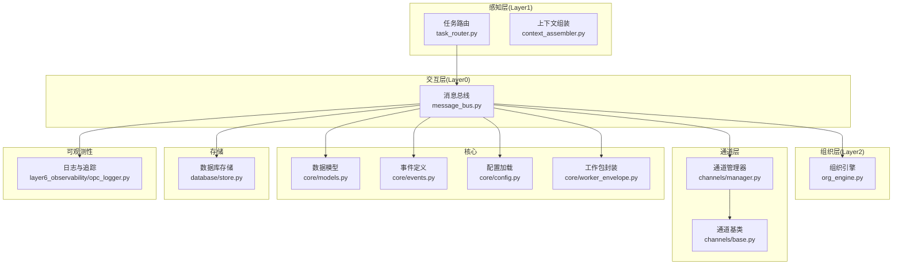
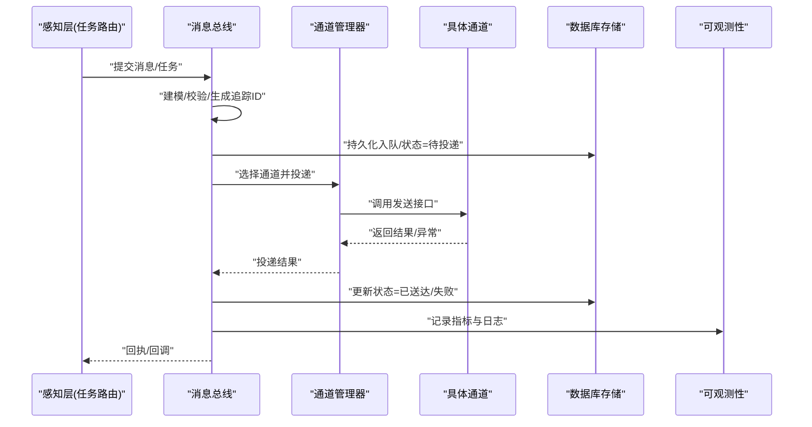
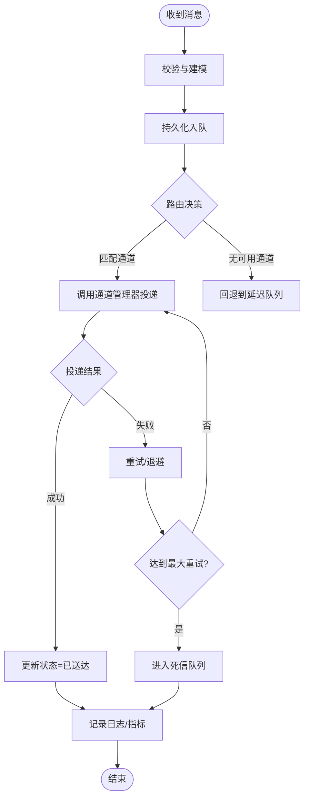
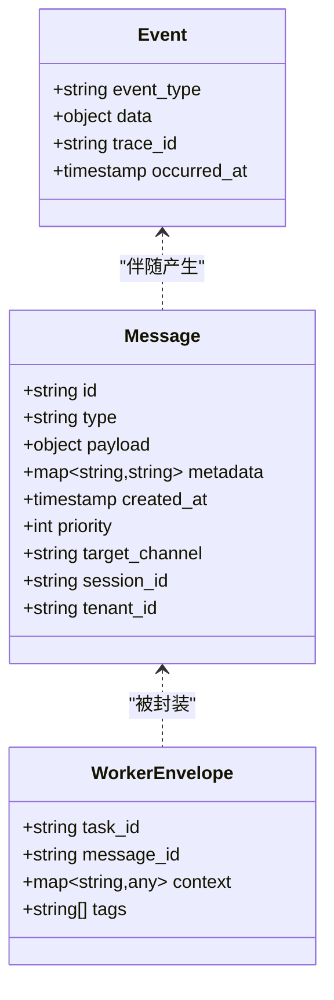
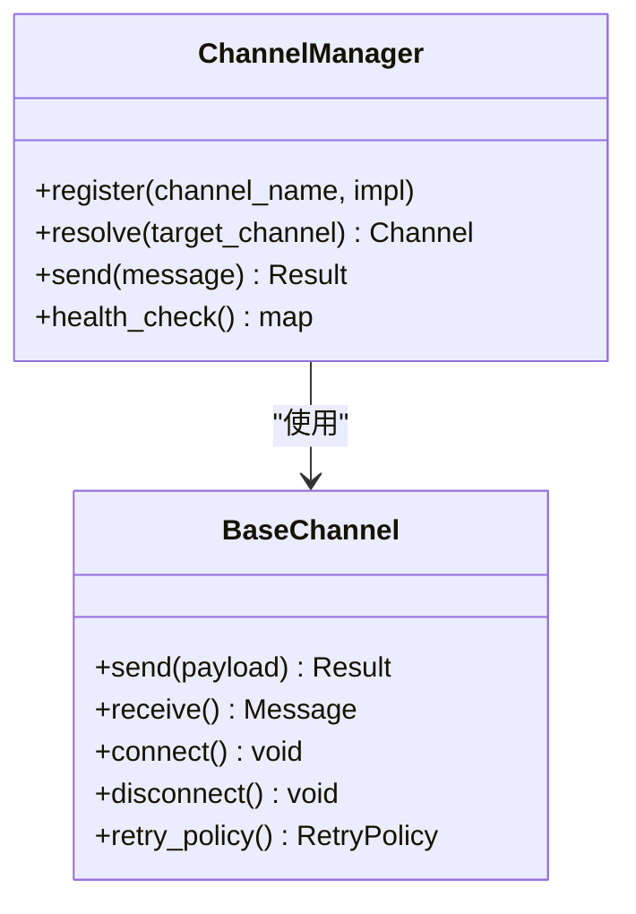
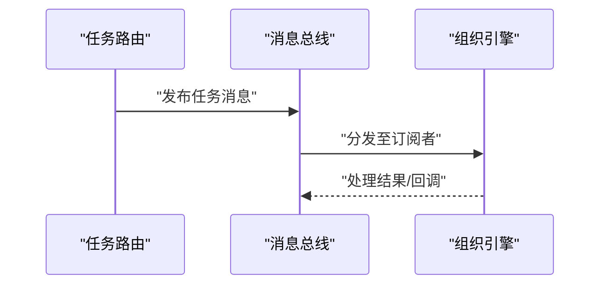
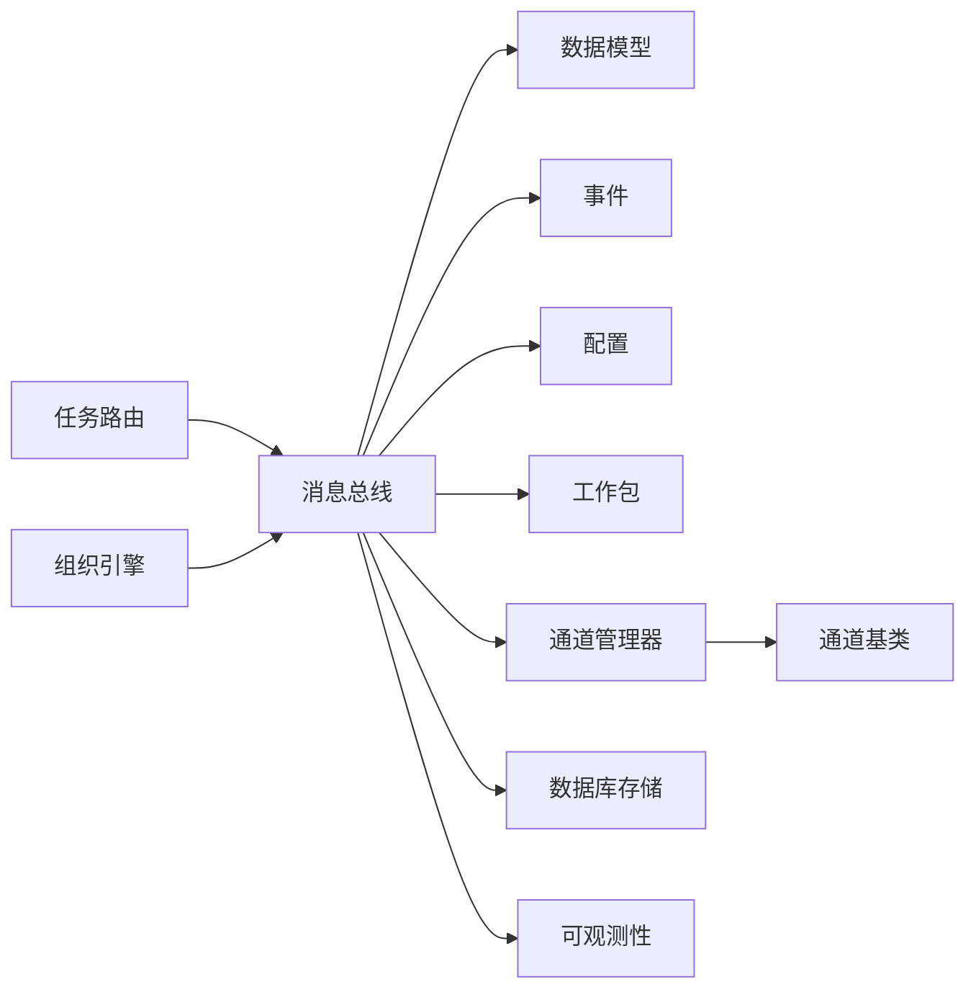

# 消息总线

<cite>
**本文引用的文件**   
- [layer0_interaction/message_bus.py](file://opc/layer0_interaction/message_bus.py)
- [core/models.py](file://opc/core/models.py)
- [core/events.py](file://opc/core/events.py)
- [core/config.py](file://opc/core/config.py)
- [core/worker_envelope.py](file://opc/core/worker_envelope.py)
- [database/store.py](file://opc/database/store.py)
- [channels/manager.py](file://opc/channels/manager.py)
- [channels/base.py](file://opc/channels/base.py)
- [layer1_perception/task_router.py](file://opc/layer1_perception/task_router.py)
- [layer2_organization/org_engine.py](file://opc/layer2_organization/org_engine.py)
- [layer4_tools/collaboration_dispatch.py](file://opc/layer4_tools/collaboration_dispatch.py)
- [layer6_observability/opc_logger.py](file://opc/layer6_observability/opc_logger.py)
- [cli/app.py](file://opc/cli/app.py)
</cite>

## 目录
1. [简介](#简介)
2. [项目结构](#项目结构)
3. [核心组件](#核心组件)
4. [架构总览](#架构总览)
5. [详细组件分析](#详细组件分析)
6. [依赖关系分析](#依赖关系分析)
7. [性能考量](#性能考量)
8. [故障排查指南](#故障排查指南)
9. [结论](#结论)
10. [附录](#附录)

## 简介
本文件为 OpenOPC 的“消息总线”提供系统化文档，聚焦其在分层架构中的职责、消息路由与通道管理、消息格式与传输协议、持久化与重试恢复、队列实现与优化策略、配置与使用示例、监控调试追踪工具，以及扩展点与自定义路由规则的实现指南。目标是帮助读者快速理解并高效使用消息总线，同时为二次开发提供清晰路径。

## 项目结构
OpenOPC 采用分层架构，消息总线位于交互层（Layer0），向上承接感知层（Layer1）的任务路由与上下文组装，向下对接通道管理层（Channels）与组织运行期（Layer2）。数据模型与事件定义集中在 core 模块，数据库存储由 database 模块提供，可观测性通过 layer6 日志体系贯穿全链路。

图表来源
- [layer0_interaction/message_bus.py](file://opc/layer0_interaction/message_bus.py)
- [layer1_perception/task_router.py](file://opc/layer1_perception/task_router.py)
- [layer2_organization/org_engine.py](file://opc/layer2_organization/org_engine.py)
- [channels/manager.py](file://opc/channels/manager.py)
- [channels/base.py](file://opc/channels/base.py)
- [core/models.py](file://opc/core/models.py)
- [core/events.py](file://opc/core/events.py)
- [core/config.py](file://opc/core/config.py)
- [core/worker_envelope.py](file://opc/core/worker_envelope.py)
- [database/store.py](file://opc/database/store.py)
- [layer6_observability/opc_logger.py](file://opc/layer6_observability/opc_logger.py)

章节来源
- [layer0_interaction/message_bus.py](file://opc/layer0_interaction/message_bus.py)
- [layer1_perception/task_router.py](file://opc/layer1_perception/task_router.py)
- [layer2_organization/org_engine.py](file://opc/layer2_organization/org_engine.py)
- [channels/manager.py](file://opc/channels/manager.py)
- [channels/base.py](file://opc/channels/base.py)
- [core/models.py](file://opc/core/models.py)
- [core/events.py](file://opc/core/events.py)
- [core/config.py](file://opc/core/config.py)
- [core/worker_envelope.py](file://opc/core/worker_envelope.py)
- [database/store.py](file://opc/database/store.py)
- [layer6_observability/opc_logger.py](file://opc/layer6_observability/opc_logger.py)

## 核心组件
- 消息总线：负责消息生命周期管理（创建、序列化、路由、投递、确认、重试、失败处理）、与通道和存储的协调、以及与上层感知层的接口。
- 数据模型与事件：统一的消息体结构与事件类型定义，确保跨层一致性与可扩展性。
- 通道管理与通道基类：抽象不同外部平台（如 IM、邮件等）的接入细节，提供统一的发送/接收能力。
- 配置系统：集中管理消息总线行为参数（如并发度、超时、重试策略、持久化开关等）。
- 工作包封装：将业务任务包装为标准化的工作单元，便于调度与追踪。
- 数据库存储：提供消息落盘、状态更新、断点续传与审计日志。
- 可观测性：结构化日志、指标与追踪 ID 注入，支持问题定位与性能分析。

章节来源
- [layer0_interaction/message_bus.py](file://opc/layer0_interaction/message_bus.py)
- [core/models.py](file://opc/core/models.py)
- [core/events.py](file://opc/core/events.py)
- [core/config.py](file://opc/core/config.py)
- [core/worker_envelope.py](file://opc/core/worker_envelope.py)
- [database/store.py](file://opc/database/store.py)
- [layer6_observability/opc_logger.py](file://opc/layer6_observability/opc_logger.py)

## 架构总览
消息总线在分层架构中扮演“中枢神经”的角色：
- 输入侧：从感知层接收任务或用户消息，进行标准化建模与校验。
- 路由侧：根据目标通道、优先级、租户/会话上下文选择投递策略。
- 投递侧：通过通道管理器调用具体通道实现，完成对外部系统的发送。
- 持久化侧：对关键消息与状态变更进行落盘，保障可靠性与可恢复性。
- 可观测性侧：记录端到端追踪信息，支撑监控与排障。

图表来源
- [layer0_interaction/message_bus.py](file://opc/layer0_interaction/message_bus.py)
- [layer1_perception/task_router.py](file://opc/layer1_perception/task_router.py)
- [channels/manager.py](file://opc/channels/manager.py)
- [channels/base.py](file://opc/channels/base.py)
- [database/store.py](file://opc/database/store.py)
- [layer6_observability/opc_logger.py](file://opc/layer6_observability/opc_logger.py)

## 详细组件分析

### 消息总线（Layer0）
- 职责
  - 消息生命周期：创建、序列化、路由、投递、确认、重试、失败处理。
  - 与通道管理器协作，按策略选择目标通道。
  - 与数据库存储协作，保证消息持久化与状态一致性。
  - 向可观测性子系统写入结构化日志与追踪信息。
- 关键流程
  - 入队：接收上游消息，生成唯一标识，持久化后进入待投递状态。
  - 路由：基于目标通道、优先级、上下文（租户/会话/工作项）选择投递策略。
  - 投递：调用通道管理器执行发送；捕获异常并触发重试或降级。
  - 确认：成功则更新状态为已送达；失败则进入重试队列或死信队列。
  - 回溯：支持按追踪 ID 查询消息轨迹与中间状态。
- 错误处理
  - 网络/通道异常：指数退避重试，超过阈值转入死信。
  - 序列化/反序列化异常：丢弃不可恢复消息并告警。
  - 幂等控制：基于消息 ID 去重，避免重复投递造成副作用。

图表来源
- [layer0_interaction/message_bus.py](file://opc/layer0_interaction/message_bus.py)
- [database/store.py](file://opc/database/store.py)
- [channels/manager.py](file://opc/channels/manager.py)
- [layer6_observability/opc_logger.py](file://opc/layer6_observability/opc_logger.py)

章节来源
- [layer0_interaction/message_bus.py](file://opc/layer0_interaction/message_bus.py)
- [database/store.py](file://opc/database/store.py)
- [channels/manager.py](file://opc/channels/manager.py)
- [layer6_observability/opc_logger.py](file://opc/layer6_observability/opc_logger.py)

### 数据模型与事件（Core）
- 数据模型
  - 消息体：包含消息类型、内容、元数据（追踪ID、时间戳、优先级、目标通道、会话/租户标识等）。
  - 工作包：封装任务执行所需上下文与参数，供后续阶段消费。
- 事件定义
  - 标准事件类型：用于跨层通信与状态同步（如消息入队、投递开始、投递完成、失败、重试等）。
  - 事件载荷：遵循统一 schema，便于解析与扩展。

图表来源
- [core/models.py](file://opc/core/models.py)
- [core/worker_envelope.py](file://opc/core/worker_envelope.py)
- [core/events.py](file://opc/core/events.py)

章节来源
- [core/models.py](file://opc/core/models.py)
- [core/worker_envelope.py](file://opc/core/worker_envelope.py)
- [core/events.py](file://opc/core/events.py)

### 通道管理与通道基类（Channels）
- 通道管理器
  - 注册与发现：维护通道实现注册表，支持动态加载。
  - 选择策略：按目标通道名、负载特征、健康状态选择最佳通道实例。
  - 限流与熔断：对下游通道进行速率限制与熔断保护。
- 通道基类
  - 统一接口：定义发送、接收、连接管理等抽象方法。
  - 通用能力：重试、超时、鉴权、编解码、错误映射。

图表来源
- [channels/manager.py](file://opc/channels/manager.py)
- [channels/base.py](file://opc/channels/base.py)

章节来源
- [channels/manager.py](file://opc/channels/manager.py)
- [channels/base.py](file://opc/channels/base.py)

### 配置系统（Core Config）
- 配置项范围
  - 路由策略：默认通道、按租户/会话路由规则、优先级权重。
  - 重试与退避：最大重试次数、初始退避间隔、退避倍数、抖动。
  - 持久化：是否开启、批大小、刷盘策略。
  - 并发与吞吐：消费者线程数、队列容量上限、背压阈值。
  - 可观测性：日志级别、采样率、追踪传播。
- 加载与生效
  - 启动时加载配置文件，运行时支持热更新（若实现）。
  - 参数校验与默认值兜底，防止非法配置导致崩溃。

章节来源
- [core/config.py](file://opc/core/config.py)

### 任务路由与组织引擎（Layer1/Layer2）
- 任务路由
  - 将感知层产生的任务转换为标准消息，附加上下文与路由标签。
  - 与消息总线协作，决定投递目标与优先级。
- 组织引擎
  - 作为消息的消费者之一，订阅特定事件或消息类型，驱动业务流程。
  - 与消息总线配合，实现工作项生命周期管理与状态同步。

图表来源
- [layer1_perception/task_router.py](file://opc/layer1_perception/task_router.py)
- [layer2_organization/org_engine.py](file://opc/layer2_organization/org_engine.py)
- [layer0_interaction/message_bus.py](file://opc/layer0_interaction/message_bus.py)

章节来源
- [layer1_perception/task_router.py](file://opc/layer1_perception/task_router.py)
- [layer2_organization/org_engine.py](file://opc/layer2_organization/org_engine.py)
- [layer0_interaction/message_bus.py](file://opc/layer0_interaction/message_bus.py)

### 协作分发（Layer4 Tools）
- 协作分发器
  - 面向多参与者场景，将消息广播或定向分发给相关角色/会话。
  - 与消息总线集成，复用其路由、持久化与可观测性能力。

章节来源
- [layer4_tools/collaboration_dispatch.py](file://opc/layer4_tools/collaboration_dispatch.py)

### CLI 入口（CLI App）
- 命令行工具
  - 提供消息发送、查询、重试、查看轨迹等运维能力。
  - 与消息总线及数据库交互，辅助日常调试与演练。

章节来源
- [cli/app.py](file://opc/cli/app.py)

## 依赖关系分析
- 内部依赖
  - 消息总线依赖数据模型、事件、配置与工作包封装。
  - 通道管理器依赖通道基类与各具体通道实现。
  - 任务路由与组织引擎通过消息总线进行解耦通信。
- 外部依赖
  - 数据库存储：用于持久化消息与状态。
  - 可观测性：结构化日志与追踪。
- 潜在耦合点
  - 消息模型变更需保持向后兼容。
  - 通道接口变更需通过适配器或版本协商机制降低影响面。

图表来源
- [layer0_interaction/message_bus.py](file://opc/layer0_interaction/message_bus.py)
- [core/models.py](file://opc/core/models.py)
- [core/events.py](file://opc/core/events.py)
- [core/config.py](file://opc/core/config.py)
- [core/worker_envelope.py](file://opc/core/worker_envelope.py)
- [channels/manager.py](file://opc/channels/manager.py)
- [channels/base.py](file://opc/channels/base.py)
- [database/store.py](file://opc/database/store.py)
- [layer6_observability/opc_logger.py](file://opc/layer6_observability/opc_logger.py)
- [layer1_perception/task_router.py](file://opc/layer1_perception/task_router.py)
- [layer2_organization/org_engine.py](file://opc/layer2_organization/org_engine.py)

章节来源
- [layer0_interaction/message_bus.py](file://opc/layer0_interaction/message_bus.py)
- [core/models.py](file://opc/core/models.py)
- [core/events.py](file://opc/core/events.py)
- [core/config.py](file://opc/core/config.py)
- [core/worker_envelope.py](file://opc/core/worker_envelope.py)
- [channels/manager.py](file://opc/channels/manager.py)
- [channels/base.py](file://opc/channels/base.py)
- [database/store.py](file://opc/database/store.py)
- [layer6_observability/opc_logger.py](file://opc/layer6_observability/opc_logger.py)
- [layer1_perception/task_router.py](file://opc/layer1_perception/task_router.py)
- [layer2_organization/org_engine.py](file://opc/layer2_organization/org_engine.py)

## 性能考量
- 队列与并发
  - 合理设置消费者线程数与队列容量，避免内存膨胀与背压。
  - 批量持久化与异步刷盘提升吞吐。
- 路由与选择
  - 缓存通道健康状态与权重，减少路由计算开销。
  - 按租户/会话局部性路由，降低跨节点通信成本。
- 重试与退避
  - 指数退避加抖动，避免雪崩效应。
  - 区分瞬时错误与永久错误，减少无效重试。
- 序列化与编解码
  - 使用轻量级序列化格式，减少 CPU 与带宽占用。
- 可观测性采样
  - 在高吞吐场景下启用采样，平衡观测成本与覆盖度。

[本节为通用指导，不直接分析具体文件]

## 故障排查指南
- 常见问题
  - 消息堆积：检查消费者线程数、通道健康状态与重试策略。
  - 投递失败：查看通道返回码与错误映射，确认鉴权与网络连通性。
  - 重复投递：核对幂等键与去重逻辑，确保上游不会重复发送。
  - 死信增多：分析失败原因，必要时人工介入清理或补偿。
- 定位手段
  - 通过追踪 ID 查询消息轨迹与中间状态。
  - 使用 CLI 工具进行消息查询、重试与回放。
  - 结合日志与指标定位瓶颈与异常。

章节来源
- [layer0_interaction/message_bus.py](file://opc/layer0_interaction/message_bus.py)
- [cli/app.py](file://opc/cli/app.py)
- [layer6_observability/opc_logger.py](file://opc/layer6_observability/opc_logger.py)

## 结论
消息总线在 OpenOPC 的分层架构中承担关键的中枢职责，通过标准化的消息模型、可靠的路由与通道管理、完善的持久化与重试机制，以及全面的可观测性，保障了系统的高可用与可扩展性。建议在生产环境中结合业务特性调优并发与重试策略，完善监控与告警，持续优化性能与稳定性。

[本节为总结，不直接分析具体文件]

## 附录

### 消息格式规范与数据传输协议
- 消息体字段
  - 必需字段：消息 ID、类型、内容、元数据、时间戳、优先级、目标通道、会话/租户标识。
  - 可选字段：关联消息 ID、重试计数、过期时间、标签集合。
- 事件载荷
  - 事件类型与数据载荷遵循统一 schema，便于解析与扩展。
- 传输协议
  - 内部：进程内对象传递或序列化后入队。
  - 外部：通过通道抽象适配各平台协议（如 HTTP、WebSocket、IM SDK 等）。

章节来源
- [core/models.py](file://opc/core/models.py)
- [core/events.py](file://opc/core/events.py)
- [channels/base.py](file://opc/channels/base.py)

### 持久化、重试与故障恢复
- 持久化
  - 入队即落盘，状态机包括：待投递、投递中、已送达、失败、重试、死信。
  - 支持批量写入与事务边界，保证一致性。
- 重试
  - 指数退避与抖动，最大重试次数可配置。
  - 区分错误类型，避免对永久错误进行无限重试。
- 恢复
  - 重启后扫描未确认消息，自动恢复投递。
  - 死信队列支持人工干预与补偿。

章节来源
- [layer0_interaction/message_bus.py](file://opc/layer0_interaction/message_bus.py)
- [database/store.py](file://opc/database/store.py)

### 队列实现与优化策略
- 队列模型
  - 内存队列+持久化后备，兼顾低延迟与高可靠。
  - 分区与分片：按租户/会话划分，提升并行度与隔离性。
- 优化策略
  - 预取与批处理：提高吞吐，注意内存占用。
  - 背压与限流：防止下游过载。
  - 压缩与编码：降低 I/O 成本。

章节来源
- [layer0_interaction/message_bus.py](file://opc/layer0_interaction/message_bus.py)
- [database/store.py](file://opc/database/store.py)

### 配置与使用示例
- 基础配置
  - 指定默认通道、重试策略、持久化开关、并发度与队列容量。
- 使用示例
  - 发送消息：构造消息体，指定目标通道与优先级，调用消息总线发送。
  - 订阅消息：注册处理器，监听特定事件或消息类型。
  - 重试与查询：通过 CLI 或 API 进行重试与轨迹查询。
- 最佳实践
  - 幂等设计：为每条消息分配稳定 ID，并在下游实现幂等处理。
  - 上下文透传：携带租户/会话/工作项标识，便于路由与审计。
  - 分级路由：按重要性设置优先级，保障关键消息优先投递。

章节来源
- [core/config.py](file://opc/core/config.py)
- [cli/app.py](file://opc/cli/app.py)
- [layer0_interaction/message_bus.py](file://opc/layer0_interaction/message_bus.py)

### 监控、调试与追踪
- 监控指标
  - 入队/出队速率、投递成功率、平均延迟、重试次数、死信数量。
- 调试工具
  - CLI 命令：发送、查询、重试、回放。
  - 日志与追踪：以追踪 ID 串联全流程，便于定位问题。
- 告警策略
  - 堆积阈值、失败率突增、通道不可用等告警规则。

章节来源
- [layer6_observability/opc_logger.py](file://opc/layer6_observability/opc_logger.py)
- [cli/app.py](file://opc/cli/app.py)
- [layer0_interaction/message_bus.py](file://opc/layer0_interaction/message_bus.py)

### 扩展点与自定义路由规则
- 扩展点
  - 新增通道：实现通道基类接口，注册到通道管理器。
  - 自定义路由：基于租户/会话/标签等维度实现路由策略。
  - 事件钩子：在消息生命周期关键节点插入自定义逻辑。
- 实现指南
  - 遵循统一数据模型与事件 schema，确保兼容性。
  - 在路由策略中加入健康检查与权重评估。
  - 为新扩展编写单元测试与集成测试，验证正确性与性能。

章节来源
- [channels/base.py](file://opc/channels/base.py)
- [channels/manager.py](file://opc/channels/manager.py)
- [core/models.py](file://opc/core/models.py)
- [core/events.py](file://opc/core/events.py)
- [layer0_interaction/message_bus.py](file://opc/layer0_interaction/message_bus.py)