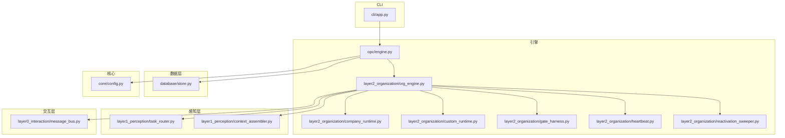
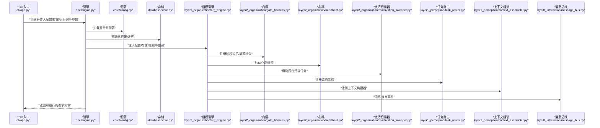
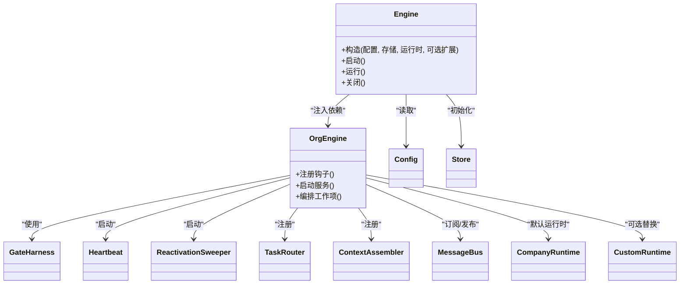
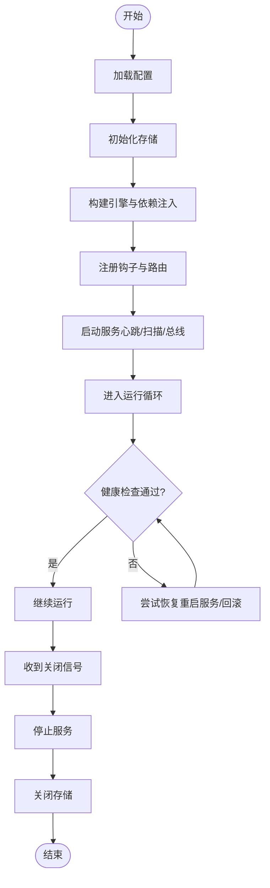

# 引擎初始化

<cite>
**本文引用的文件**   
- [engine.py](file://opc/engine.py)
- [org_engine.py](file://opc/layer2_organization/org_engine.py)
- [config.py](file://opc/core/config.py)
- [company_runtime.py](file://opc/layer2_organization/company_runtime.py)
- [custom_runtime.py](file://opc/layer2_organization/custom_runtime.py)
- [gate_harness.py](file://opc/layer2_organization/gate_harness.py)
- [heartbeat.py](file://opc/layer2_organization/heartbeat.py)
- [reactivation_sweeper.py](file://opc/layer2_organization/reactivation_sweeper.py)
- [task_router.py](file://opc/layer1_perception/task_router.py)
- [context_assembler.py](file://opc/layer1_perception/context_assembler.py)
- [message_bus.py](file://opc/layer0_interaction/message_bus.py)
- [store.py](file://opc/database/store.py)
- [app.py](file://opc/cli/app.py)
</cite>

## 目录
1. [简介](#简介)
2. [项目结构](#项目结构)
3. [核心组件](#核心组件)
4. [架构总览](#架构总览)
5. [详细组件分析](#详细组件分析)
6. [依赖分析](#依赖分析)
7. [性能考虑](#性能考虑)
8. [故障排查指南](#故障排查指南)
9. [结论](#结论)
10. [附录](#附录)

## 简介
本文件聚焦于 OpenOPC 引擎的初始化流程，围绕 Engine 类的构造参数、初始化顺序与依赖注入机制展开，系统阐述从配置加载、组件注册到服务启动的完整生命周期。文档同时覆盖运行期管理（启动、运行、关闭、异常恢复）、扩展点与自定义初始化逻辑的实现方式，并提供常见初始化问题的诊断与解决方案，帮助读者从基础使用逐步深入到高级定制。

## 项目结构
OpenOPC 采用分层与模块化组织：
- 交互层（layer0）：消息总线与外部交互
- 感知层（layer1）：上下文组装与任务路由
- 组织层（layer2）：公司运行时、编排引擎、心跳与激活扫描等
- 数据库层（database）：持久化存储
- CLI 入口（cli）：命令行应用与启动脚本
- 核心（core）：配置、模型、事件等基础设施

图表来源
- [engine.py](file://opc/engine.py)
- [org_engine.py](file://opc/layer2_organization/org_engine.py)
- [config.py](file://opc/core/config.py)
- [company_runtime.py](file://opc/layer2_organization/company_runtime.py)
- [custom_runtime.py](file://opc/layer2_organization/custom_runtime.py)
- [gate_harness.py](file://opc/layer2_organization/gate_harness.py)
- [heartbeat.py](file://opc/layer2_organization/heartbeat.py)
- [reactivation_sweeper.py](file://opc/layer2_organization/reactivation_sweeper.py)
- [task_router.py](file://opc/layer1_perception/task_router.py)
- [context_assembler.py](file://opc/layer1_perception/context_assembler.py)
- [message_bus.py](file://opc/layer0_interaction/message_bus.py)
- [store.py](file://opc/database/store.py)
- [app.py](file://opc/cli/app.py)

章节来源
- [engine.py](file://opc/engine.py)
- [org_engine.py](file://opc/layer2_organization/org_engine.py)
- [config.py](file://opc/core/config.py)
- [store.py](file://opc/database/store.py)
- [app.py](file://opc/cli/app.py)

## 核心组件
- 引擎（Engine）：负责整体初始化、依赖装配、生命周期管理与对外暴露的运行接口。
- 组织引擎（OrgEngine）：承载公司模式下的运行时编排、阶段控制与工作项流转。
- 公司运行时（CompanyRuntime）：提供公司级能力（角色、会话、协作等）。
- 自定义运行时（CustomRuntime）：允许用户替换或扩展默认运行时行为。
- 门控（GateHarness）：在关键阶段前后执行钩子与检查。
- 心跳（Heartbeat）：健康检查与保活。
- 激活扫描器（ReactivationSweeper）：后台任务唤醒与恢复。
- 任务路由（TaskRouter）与上下文组装（ContextAssembler）：感知层核心。
- 消息总线（MessageBus）：跨模块事件与命令通道。
- 配置（Config）：集中式配置加载与校验。
- 存储（Store）：持久化访问抽象。

章节来源
- [engine.py](file://opc/engine.py)
- [org_engine.py](file://opc/layer2_organization/org_engine.py)
- [company_runtime.py](file://opc/layer2_organization/company_runtime.py)
- [custom_runtime.py](file://opc/layer2_organization/custom_runtime.py)
- [gate_harness.py](file://opc/layer2_organization/gate_harness.py)
- [heartbeat.py](file://opc/layer2_organization/heartbeat.py)
- [reactivation_sweeper.py](file://opc/layer2_organization/reactivation_sweeper.py)
- [task_router.py](file://opc/layer1_perception/task_router.py)
- [context_assembler.py](file://opc/layer1_perception/context_assembler.py)
- [message_bus.py](file://opc/layer0_interaction/message_bus.py)
- [config.py](file://opc/core/config.py)
- [store.py](file://opc/database/store.py)

## 架构总览
下图展示了引擎初始化与启动的关键阶段及组件交互。

图表来源
- [app.py](file://opc/cli/app.py)
- [engine.py](file://opc/engine.py)
- [config.py](file://opc/core/config.py)
- [store.py](file://opc/database/store.py)
- [org_engine.py](file://opc/layer2_organization/org_engine.py)
- [gate_harness.py](file://opc/layer2_organization/gate_harness.py)
- [heartbeat.py](file://opc/layer2_organization/heartbeat.py)
- [reactivation_sweeper.py](file://opc/layer2_organization/reactivation_sweeper.py)
- [task_router.py](file://opc/layer1_perception/task_router.py)
- [context_assembler.py](file://opc/layer1_perception/context_assembler.py)
- [message_bus.py](file://opc/layer0_interaction/message_bus.py)

## 详细组件分析

### Engine 类：构造参数、初始化顺序与依赖注入
- 构造参数要点
  - 配置对象：用于加载环境、功能开关、LLM/渠道/存储等设置
  - 存储实例：数据库/文件系统/缓存等后端
  - 运行时实现：默认公司运行时或自定义运行时
  - 可选扩展：消息总线、事件处理器、日志/观测配置
- 初始化顺序（概念性步骤）
  1) 解析与合并配置（优先级：默认 < 配置文件 < 环境变量 < 运行时参数）
  2) 初始化存储（连接池、迁移、索引）
  3) 构建消息总线与事件管道
  4) 注入依赖至组织引擎与子系统
  5) 注册阶段钩子、路由策略、上下文构建器
  6) 启动守护服务（心跳、激活扫描、后台任务）
  7) 完成启动并暴露运行接口
- 依赖注入机制
  - 通过构造函数显式注入核心依赖（配置、存储、总线）
  - 组织引擎内部按职责拆分，按需获取组件（如路由、上下文、门控）
  - 支持以工厂/注册表形式扩展组件（例如自定义运行时、工具集、渠道）

章节来源
- [engine.py](file://opc/engine.py)
- [config.py](file://opc/core/config.py)
- [store.py](file://opc/database/store.py)
- [message_bus.py](file://opc/layer0_interaction/message_bus.py)
- [org_engine.py](file://opc/layer2_organization/org_engine.py)

### 组织引擎（OrgEngine）：编排与阶段控制
- 职责
  - 维护工作项状态机与阶段转换
  - 协调公司运行时、门控、心跳、激活扫描器等
  - 提供任务路由与上下文组装的接入点
- 关键流程
  - 启动时注册阶段钩子与安全检查
  - 启动心跳与后台扫描，确保系统活跃与任务恢复
  - 将感知层（路由、上下文）与交互层（消息总线）接入编排流

章节来源
- [org_engine.py](file://opc/layer2_organization/org_engine.py)
- [gate_harness.py](file://opc/layer2_organization/gate_harness.py)
- [heartbeat.py](file://opc/layer2_organization/heartbeat.py)
- [reactivation_sweeper.py](file://opc/layer2_organization/reactivation_sweeper.py)
- [task_router.py](file://opc/layer1_perception/task_router.py)
- [context_assembler.py](file://opc/layer1_perception/context_assembler.py)

### 公司运行时（CompanyRuntime）与自定义运行时（CustomRuntime）
- CompanyRuntime
  - 提供公司模式下的角色、会话、协作、权限等能力
  - 作为默认运行时被组织引擎使用
- CustomRuntime
  - 允许替换默认运行时，实现领域特定的编排策略
  - 需遵循运行时契约（方法签名、事件、状态一致性）

章节来源
- [company_runtime.py](file://opc/layer2_organization/company_runtime.py)
- [custom_runtime.py](file://opc/layer2_organization/custom_runtime.py)
- [org_engine.py](file://opc/layer2_organization/org_engine.py)

### 门控（GateHarness）：阶段钩子与安全校验
- 作用
  - 在关键阶段前后执行钩子（如进入/离开阶段、提交前检查）
  - 统一安全策略与合规校验
- 扩展点
  - 注册自定义门控规则
  - 组合多个门控形成链式校验

章节来源
- [gate_harness.py](file://opc/layer2_organization/gate_harness.py)
- [org_engine.py](file://opc/layer2_organization/org_engine.py)

### 心跳（Heartbeat）与激活扫描器（ReactivationSweeper）
- 心跳
  - 周期性上报健康状态，便于外部监控与自愈
- 激活扫描器
  - 定期扫描待恢复/挂起的工作项，触发重入与续跑
  - 与存储层配合，保证幂等与一致性

章节来源
- [heartbeat.py](file://opc/layer2_organization/heartbeat.py)
- [reactivation_sweeper.py](file://opc/layer2_organization/reactivation_sweeper.py)

### 感知层：任务路由（TaskRouter）与上下文组装（ContextAssembler）
- 任务路由
  - 根据输入特征选择处理策略与目标组件
- 上下文组装
  - 聚合多源信息（历史、配置、外部数据）为模型可用上下文

章节来源
- [task_router.py](file://opc/layer1_perception/task_router.py)
- [context_assembler.py](file://opc/layer1_perception/context_assembler.py)

### 交互层：消息总线（MessageBus）
- 职责
  - 提供进程内事件/命令分发
  - 解耦子系统间的直接依赖
- 扩展点
  - 注册事件处理器
  - 桥接外部消息系统（可选）

章节来源
- [message_bus.py](file://opc/layer0_interaction/message_bus.py)

### CLI 入口（App）：启动与生命周期
- 职责
  - 解析命令行参数
  - 构建配置与存储
  - 实例化引擎并进入运行循环
  - 优雅关闭与资源释放

章节来源
- [app.py](file://opc/cli/app.py)
- [engine.py](file://opc/engine.py)

## 依赖分析
- 耦合关系
  - Engine 对 Config、Store、OrgEngine 强依赖
  - OrgEngine 对 Gate、Heartbeat、ReactivationSweeper、TaskRouter、ContextAssembler、MessageBus 组合依赖
  - CompanyRuntime/CustomRuntime 通过运行时契约被 OrgEngine 调用
- 可能的循环依赖
  - 建议通过事件总线或回调避免直接双向引用
- 外部依赖
  - 存储后端（数据库/文件系统）
  - LLM/渠道提供者（由配置驱动）

图表来源
- [engine.py](file://opc/engine.py)
- [org_engine.py](file://opc/layer2_organization/org_engine.py)
- [company_runtime.py](file://opc/layer2_organization/company_runtime.py)
- [custom_runtime.py](file://opc/layer2_organization/custom_runtime.py)
- [gate_harness.py](file://opc/layer2_organization/gate_harness.py)
- [heartbeat.py](file://opc/layer2_organization/heartbeat.py)
- [reactivation_sweeper.py](file://opc/layer2_organization/reactivation_sweeper.py)
- [task_router.py](file://opc/layer1_perception/task_router.py)
- [context_assembler.py](file://opc/layer1_perception/context_assembler.py)
- [message_bus.py](file://opc/layer0_interaction/message_bus.py)
- [config.py](file://opc/core/config.py)
- [store.py](file://opc/database/store.py)

章节来源
- [engine.py](file://opc/engine.py)
- [org_engine.py](file://opc/layer2_organization/org_engine.py)

## 性能考虑
- 配置加载
  - 合并层级较多时注意缓存热点配置，避免重复 IO
- 存储初始化
  - 连接池大小、超时与重试策略需结合负载调优
- 后台任务
  - 心跳与激活扫描频率应平衡实时性与开销
- 事件总线
  - 高吞吐场景下建议使用异步队列与批处理
- 上下文组装
  - 大上下文需考虑压缩与选择性加载

[本节为通用指导，不直接分析具体文件]

## 故障排查指南
- 配置相关
  - 现象：启动时报配置缺失或类型错误
  - 排查：确认配置文件路径、环境变量覆盖、默认值是否生效
  - 参考：配置加载与合并逻辑
- 存储相关
  - 现象：连接失败、迁移失败、锁冲突
  - 排查：检查连接串、权限、并发写入、事务隔离级别
  - 参考：存储初始化与迁移
- 运行时相关
  - 现象：工作项卡住、未恢复
  - 排查：查看心跳是否正常、激活扫描器是否运行、阶段钩子是否抛出异常
  - 参考：心跳与激活扫描器
- 事件相关
  - 现象：消息丢失、处理器未触发
  - 排查：确认订阅/发布是否正确、处理器是否注册、错误是否吞掉
  - 参考：消息总线
- 自定义运行时
  - 现象：替换后行为异常
  - 排查：核对运行时契约、阶段转换合法性、事件一致性
  - 参考：公司运行时与自定义运行时

章节来源
- [config.py](file://opc/core/config.py)
- [store.py](file://opc/database/store.py)
- [heartbeat.py](file://opc/layer2_organization/heartbeat.py)
- [reactivation_sweeper.py](file://opc/layer2_organization/reactivation_sweeper.py)
- [message_bus.py](file://opc/layer0_interaction/message_bus.py)
- [company_runtime.py](file://opc/layer2_organization/company_runtime.py)
- [custom_runtime.py](file://opc/layer2_organization/custom_runtime.py)

## 结论
OpenOPC 引擎通过清晰的构造参数与依赖注入，实现了配置加载、组件注册与服务启动的有序流程。组织引擎作为编排中枢，协调门控、心跳、激活扫描、路由与上下文等子系统，形成可扩展、可观测、可恢复的运行体系。借助公司运行时与自定义运行时，用户可在不侵入核心逻辑的前提下进行深度定制。

[本节为总结性内容，不直接分析具体文件]

## 附录

### 正确实例化与配置引擎的步骤（示例路径）
- 准备配置与存储
  - 参考：[config.py](file://opc/core/config.py)、[store.py](file://opc/database/store.py)
- 构建引擎实例
  - 参考：[engine.py](file://opc/engine.py)
- 启动与运行
  - 参考：[app.py](file://opc/cli/app.py)、[engine.py](file://opc/engine.py)
- 关闭与资源释放
  - 参考：[engine.py](file://opc/engine.py)

### 扩展点与自定义初始化逻辑
- 自定义运行时
  - 参考：[custom_runtime.py](file://opc/layer2_organization/custom_runtime.py)
- 阶段钩子与门控
  - 参考：[gate_harness.py](file://opc/layer2_organization/gate_harness.py)
- 任务路由与上下文构建
  - 参考：[task_router.py](file://opc/layer1_perception/task_router.py)、[context_assembler.py](file://opc/layer1_perception/context_assembler.py)
- 事件处理器
  - 参考：[message_bus.py](file://opc/layer0_interaction/message_bus.py)

### 生命周期流程图（启动、运行、关闭、异常恢复）

[本图为概念性流程，不直接映射具体源码文件]