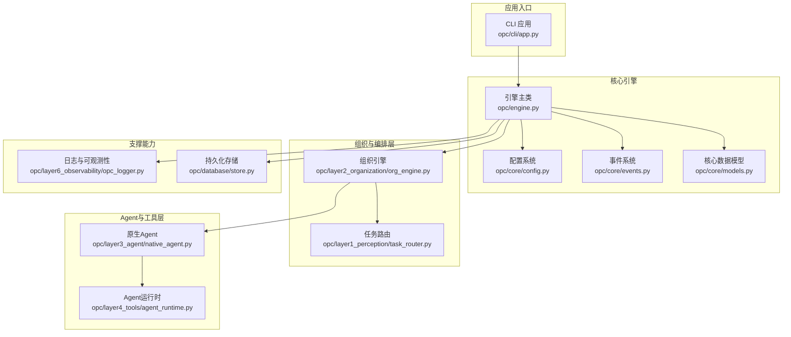
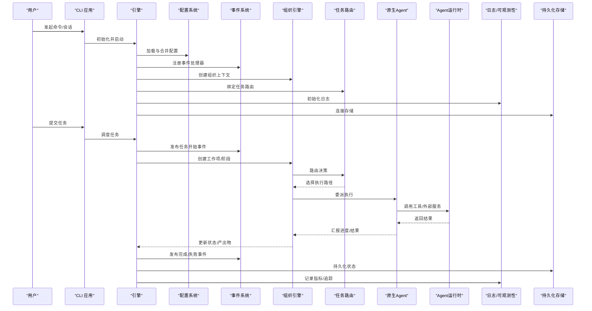
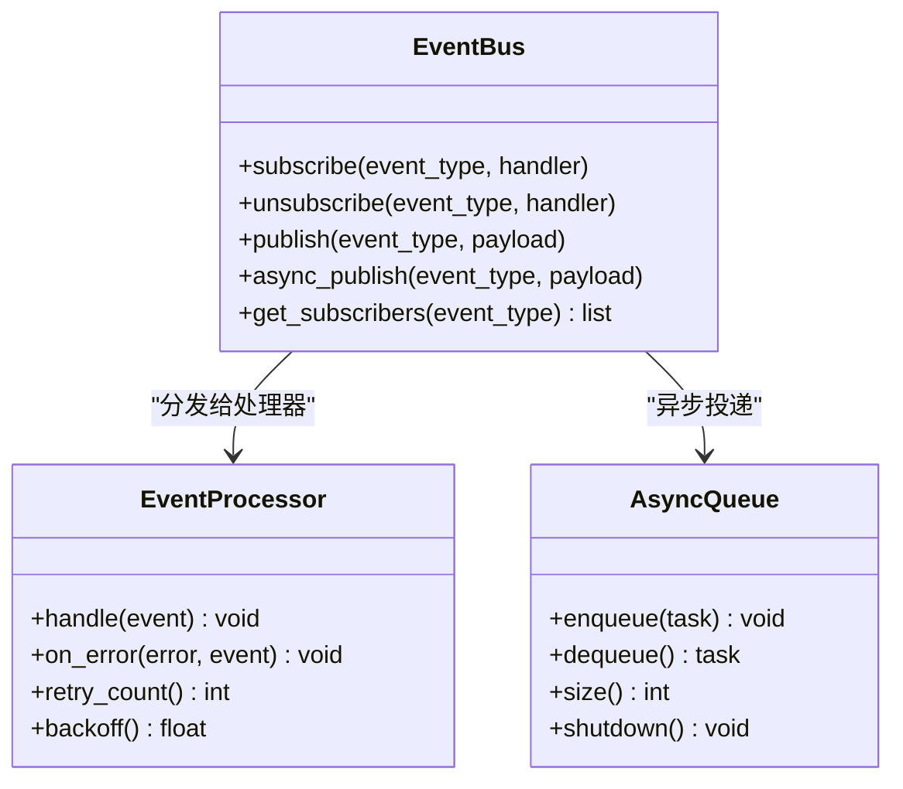
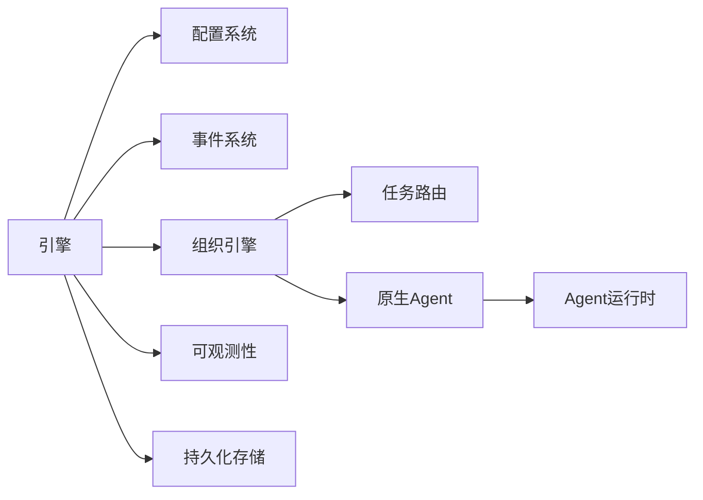

# 核心引擎

<cite>
**本文引用的文件**   
- [engine.py](file://opc/engine.py)
- [core/config.py](file://opc/core/config.py)
- [core/events.py](file://opc/core/events.py)
- [core/models.py](file://opc/core/models.py)
- [layer2_organization/org_engine.py](file://opc/layer2_organization/org_engine.py)
- [layer1_perception/task_router.py](file://opc/layer1_perception/task_router.py)
- [layer3_agent/native_agent.py](file://opc/layer3_agent/native_agent.py)
- [layer4_tools/agent_runtime.py](file://opc/layer4_tools/agent_runtime.py)
- [layer6_observability/opc_logger.py](file://opc/layer6_observability/opc_logger.py)
- [cli/app.py](file://opc/cli/app.py)
- [database/store.py](file://opc/database/store.py)
</cite>

## 目录
1. [简介](#简介)
2. [项目结构](#项目结构)
3. [核心组件](#核心组件)
4. [架构总览](#架构总览)
5. [详细组件分析](#详细组件分析)
6. [依赖关系分析](#依赖关系分析)
7. [性能考虑](#性能考虑)
8. [故障排除指南](#故障排除指南)
9. [结论](#结论)
10. [附录](#附录)

## 简介
本文件面向OpenOPC“核心引擎”的文档，聚焦以下目标：
- 引擎初始化流程、生命周期管理与配置系统
- 事件系统的发布订阅机制、异步处理与错误策略
- 核心数据模型的定义与使用方式
- 与其他组件的集成点与扩展机制
- 正确使用引擎API的实践示例（以路径引用代替代码片段）
- 配置选项的含义与影响范围
- 性能优化建议与故障排除指导

本说明兼顾初学者友好与高级用户的技术深度。

## 项目结构
OpenOPC采用分层与模块化组织，核心引擎位于顶层入口与核心模块中，并通过层间协作完成任务编排、工具执行、可观测性与持久化等能力。

图表来源
- [engine.py](file://opc/engine.py)
- [core/config.py](file://opc/core/config.py)
- [core/events.py](file://opc/core/events.py)
- [core/models.py](file://opc/core/models.py)
- [org_engine.py](file://opc/layer2_organization/org_engine.py)
- [task_router.py](file://opc/layer1_perception/task_router.py)
- [native_agent.py](file://opc/layer3_agent/native_agent.py)
- [agent_runtime.py](file://opc/layer4_tools/agent_runtime.py)
- [opc_logger.py](file://opc/layer6_observability/opc_logger.py)
- [store.py](file://opc/database/store.py)

章节来源
- [engine.py](file://opc/engine.py)
- [app.py](file://opc/cli/app.py)

## 核心组件
本节概述核心组件的职责与交互要点，后续章节将深入展开。

- 引擎主类：负责启动、装配、协调各子系统，管理生命周期与上下文。
- 配置系统：加载、校验、合并配置，提供全局访问接口。
- 事件系统：实现发布/订阅、异步分发、错误隔离与重试策略。
- 数据模型：定义领域对象、状态机与约束，贯穿全链路。
- 组织引擎：编排工作项、阶段转换、角色与权限。
- 任务路由：感知输入、解析意图、选择执行路径。
- Agent与工具：封装外部能力与工具调用，提供统一执行环境。
- 可观测性与持久化：日志、指标、快照与状态恢复。

章节来源
- [engine.py](file://opc/engine.py)
- [config.py](file://opc/core/config.py)
- [events.py](file://opc/core/events.py)
- [models.py](file://opc/core/models.py)
- [org_engine.py](file://opc/layer2_organization/org_engine.py)
- [task_router.py](file://opc/layer1_perception/task_router.py)
- [native_agent.py](file://opc/layer3_agent/native_agent.py)
- [agent_runtime.py](file://opc/layer4_tools/agent_runtime.py)
- [opc_logger.py](file://opc/layer6_observability/opc_logger.py)
- [store.py](file://opc/database/store.py)

## 架构总览
下图展示从CLI到引擎、再到组织编排、Agent与工具的端到端调用链路与关键数据流。

图表来源
- [app.py](file://opc/cli/app.py)
- [engine.py](file://opc/engine.py)
- [config.py](file://opc/core/config.py)
- [events.py](file://opc/core/events.py)
- [org_engine.py](file://opc/layer2_organization/org_engine.py)
- [task_router.py](file://opc/layer1_perception/task_router.py)
- [native_agent.py](file://opc/layer3_agent/native_agent.py)
- [agent_runtime.py](file://opc/layer4_tools/agent_runtime.py)
- [opc_logger.py](file://opc/layer6_observability/opc_logger.py)
- [store.py](file://opc/database/store.py)

## 详细组件分析

### 引擎主类与生命周期
- 职责
  - 启动时装配配置、事件总线、组织引擎、任务路由、Agent与工具、日志与存储。
  - 维护运行期上下文（会话、工作项、权限、资源句柄）。
  - 提供对外API用于创建会话、提交任务、查询状态、优雅关闭。
- 生命周期阶段
  - 初始化：加载配置、建立连接、注册事件处理器、预热缓存。
  - 运行：接收请求、派发任务、监控进度、处理异常。
  - 关闭：停止监听、保存状态、释放资源、上报指标。
- 关键设计点
  - 单例或工厂模式管理实例，避免重复启动。
  - 通过事件驱动解耦子系统，便于扩展与测试。
  - 对长耗时操作采用异步队列与背压控制。

章节来源
- [engine.py](file://opc/engine.py)

### 配置系统
- 职责
  - 读取多源配置（默认、环境变量、配置文件），进行类型校验与合并。
  - 暴露只读配置视图，支持热重载（可选）。
- 关键特性
  - 命名空间与层级结构，避免键冲突。
  - 敏感信息加密或脱敏输出。
  - 配置变更触发相关子系统重连或重建。
- 典型配置项类别
  - 通用：日志级别、并发度、超时、重试次数。
  - 存储：连接串、池大小、迁移开关。
  - 事件：队列容量、消费者数量、死信策略。
  - Agent：最大并行、工具白名单、沙箱限制。

章节来源
- [config.py](file://opc/core/config.py)

### 事件系统（发布/订阅、异步与错误策略）
- 职责
  - 提供主题式事件通道，支持同步与异步分发。
  - 保证事件幂等、顺序性（按主题/分区）、去重与回放（可选）。
- 关键机制
  - 订阅者注册：按事件类型或通配符匹配。
  - 异步处理：基于线程/协程池，支持限流与退避。
  - 错误隔离：单个处理器异常不影响其他订阅者。
  - 重试与死信：指数退避、最大重试、失败归档。
- 常用事件
  - 任务生命周期：创建、开始、推进、完成、失败。
  - 组织事件：阶段切换、角色任命、审批结果。
  - 工具调用：开始、成功、失败、超时。
  - 系统事件：健康检查、配置变更、节点加入/离开。

图表来源
- [events.py](file://opc/core/events.py)

章节来源
- [events.py](file://opc/core/events.py)

### 核心数据模型
- 职责
  - 定义领域实体、枚举、值对象与不变量。
  - 提供序列化/反序列化、校验与比较方法。
- 常见模型
  - 会话与会话上下文：标识、元数据、权限、可见性。
  - 工作项：标题、描述、阶段、依赖、产物、审计日志。
  - 阶段与状态机：合法转移、钩子函数、回滚策略。
  - 工具调用契约：参数签名、返回值、错误码、超时。
- 使用方式
  - 在事件载荷、API请求/响应、持久化结构中复用。
  - 通过工厂或构建器生成复杂对象，确保一致性。

章节来源
- [models.py](file://opc/core/models.py)

### 组织引擎与工作项编排
- 职责
  - 管理工作项生命周期、阶段转换、角色分配与协作策略。
  - 与任务路由协作，决定由哪个Agent或工具执行。
- 关键流程
  - 创建：根据输入生成工作项与初始阶段。
  - 规划：分解子任务、确定依赖与并行度。
  - 执行：委派给Agent/工具，收集进度与产物。
  - 收尾：合并结果、清理临时资源、归档审计。
- 扩展点
  - 自定义阶段与转移规则。
  - 插件化审批与合规检查。
  - 可插拔的协作策略与通知渠道。

章节来源
- [org_engine.py](file://opc/layer2_organization/org_engine.py)

### 任务路由与感知
- 职责
  - 解析输入意图、提取上下文、选择执行路径。
  - 与组织引擎对接，生成合适的工作项。
- 关键逻辑
  - 规则匹配：关键词、正则、语义分类。
  - 优先级与配额：防止热点过载。
  - 降级策略：当路由不可用时回退到默认路径。

章节来源
- [task_router.py](file://opc/layer1_perception/task_router.py)

### Agent与工具运行时
- 职责
  - 封装原生Agent与工具调用，提供统一的执行接口。
  - 管理工具权限、沙箱、资源隔离与结果聚合。
- 关键特性
  - 流式输出与增量进度上报。
  - 工具级重试与熔断。
  - 可观测性埋点与采样。

章节来源
- [native_agent.py](file://opc/layer3_agent/native_agent.py)
- [agent_runtime.py](file://opc/layer4_tools/agent_runtime.py)

### 可观测性与持久化
- 可观测性
  - 结构化日志、指标采集、分布式追踪。
  - 告警阈值与仪表盘集成。
- 持久化
  - 状态快照、审计日志、产物存储。
  - 迁移与版本兼容、备份与恢复。

章节来源
- [opc_logger.py](file://opc/layer6_observability/opc_logger.py)
- [store.py](file://opc/database/store.py)

## 依赖关系分析
- 耦合与内聚
  - 引擎作为装配中心，低内聚地组合子系统；子系统之间通过事件与接口通信，降低直接依赖。
- 外部依赖
  - 配置系统可能依赖文件系统与环境变量。
  - 存储层依赖数据库或对象存储。
  - 日志与指标依赖第三方库或平台。
- 循环依赖规避
  - 通过抽象接口与事件总线解耦，避免A直接依赖B同时B依赖A。

图表来源
- [engine.py](file://opc/engine.py)
- [config.py](file://opc/core/config.py)
- [events.py](file://opc/core/events.py)
- [org_engine.py](file://opc/layer2_organization/org_engine.py)
- [task_router.py](file://opc/layer1_perception/task_router.py)
- [native_agent.py](file://opc/layer3_agent/native_agent.py)
- [agent_runtime.py](file://opc/layer4_tools/agent_runtime.py)
- [opc_logger.py](file://opc/layer6_observability/opc_logger.py)
- [store.py](file://opc/database/store.py)

章节来源
- [engine.py](file://opc/engine.py)

## 性能考虑
- 并发与背压
  - 合理设置事件消费者与工具调用并发度，避免资源争用。
  - 对高吞吐场景启用批处理与批量写入。
- 内存与GC
  - 大对象及时释放，避免持有长生命周期引用。
  - 使用流式处理减少峰值内存占用。
- I/O与网络
  - 连接池与超时控制，避免雪崩。
  - 重试退避与熔断，保护下游服务。
- 可观测性开销
  - 采样与分级日志，避免过度打点。
  - 指标聚合与降采样。

[本节为通用指导，不直接分析具体文件]

## 故障排除指南
- 常见问题定位
  - 启动失败：检查配置项是否缺失或类型错误；查看日志中的初始化阶段报错。
  - 事件丢失或重复：确认订阅者是否正确注册；检查事件ID去重与幂等处理。
  - 任务卡住：检查工作项阶段是否处于死锁；查看路由与Agent健康状态。
  - 工具调用失败：检查权限、沙箱限制与超时；查看重试与熔断日志。
- 诊断手段
  - 开启调试日志与详细追踪。
  - 导出事件流水与状态快照。
  - 使用健康检查接口验证子系统可用性。
- 恢复策略
  - 重启受影响的子系统，必要时回滚到最近稳定快照。
  - 清理死信队列并重放失败事件。

章节来源
- [opc_logger.py](file://opc/layer6_observability/opc_logger.py)
- [store.py](file://opc/database/store.py)

## 结论
OpenOPC核心引擎通过清晰的装配与事件驱动架构，实现了高内聚、低耦合的可扩展系统。配置系统、事件总线、数据模型与组织编排共同构成了稳定的基础能力。遵循本文的性能与排障建议，可在生产环境中获得更高的可靠性与可观测性。

[本节为总结性内容，不直接分析具体文件]

## 附录

### 引擎API使用示例（路径引用）
- 初始化与启动
  - 参考：[engine.py](file://opc/engine.py)
- 创建会话与提交任务
  - 参考：[engine.py](file://opc/engine.py)
- 订阅事件与异步处理
  - 参考：[events.py](file://opc/core/events.py)
- 配置加载与热重载
  - 参考：[config.py](file://opc/core/config.py)
- 工作项创建与阶段流转
  - 参考：[org_engine.py](file://opc/layer2_organization/org_engine.py)
- 任务路由与意图解析
  - 参考：[task_router.py](file://opc/layer1_perception/task_router.py)
- Agent工具调用与流式输出
  - 参考：[native_agent.py](file://opc/layer3_agent/native_agent.py)、[agent_runtime.py](file://opc/layer4_tools/agent_runtime.py)
- 日志与指标采集
  - 参考：[opc_logger.py](file://opc/layer6_observability/opc_logger.py)
- 状态持久化与恢复
  - 参考：[store.py](file://opc/database/store.py)

### 配置选项含义与影响范围（概览）
- 通用配置
  - 日志级别：影响输出详细程度与性能。
  - 并发度：影响事件处理与工具调用的吞吐。
  - 超时与重试：影响稳定性与用户体验。
- 存储配置
  - 连接参数：影响可用性与延迟。
  - 池大小：影响并发与资源占用。
- 事件配置
  - 队列容量：影响背压与丢包风险。
  - 消费者数量：影响并行处理能力。
- Agent与工具
  - 最大并行：影响CPU与I/O压力。
  - 白名单与沙箱：影响安全与兼容性。

[本节为概念性说明，不直接分析具体文件]