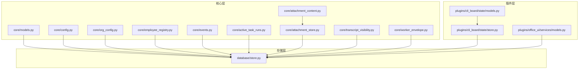
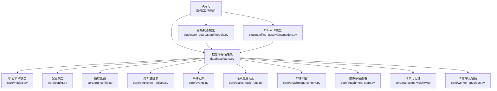
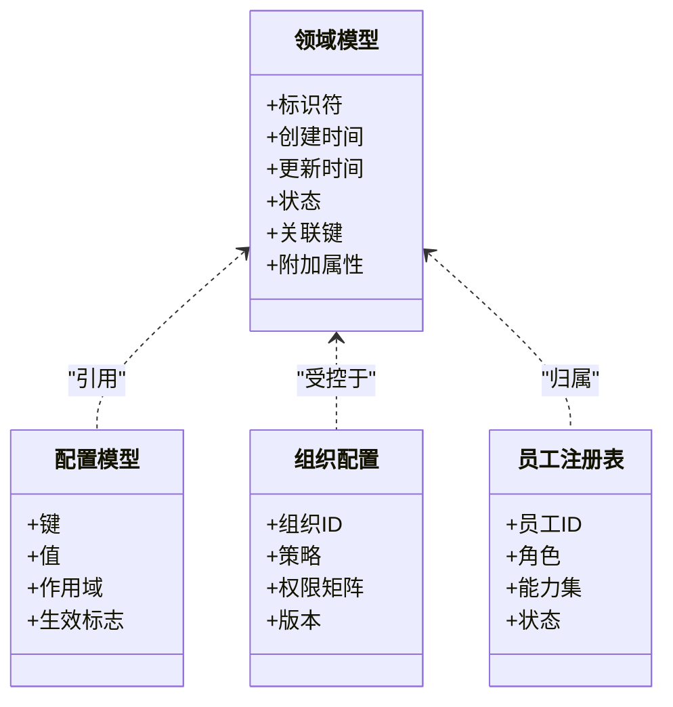
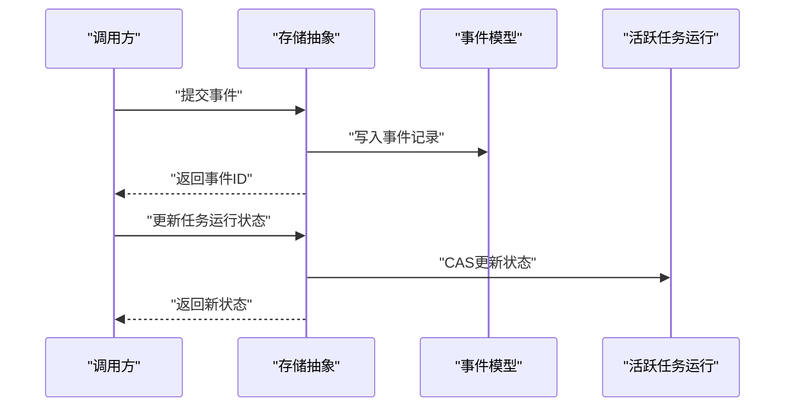
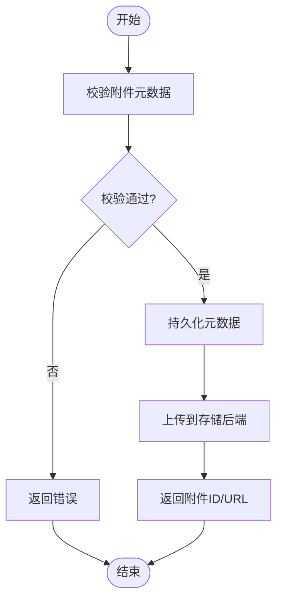
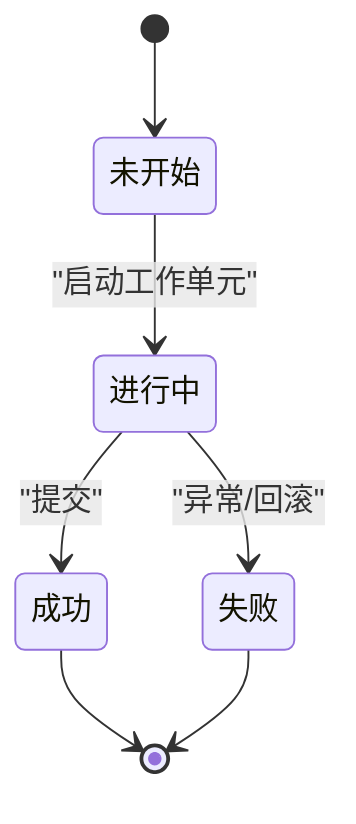
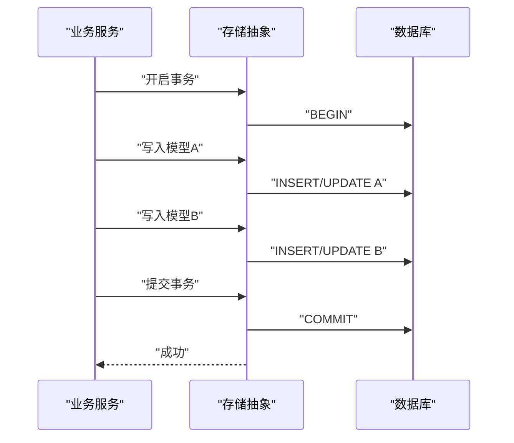
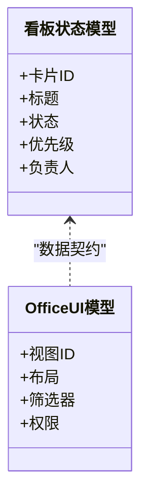
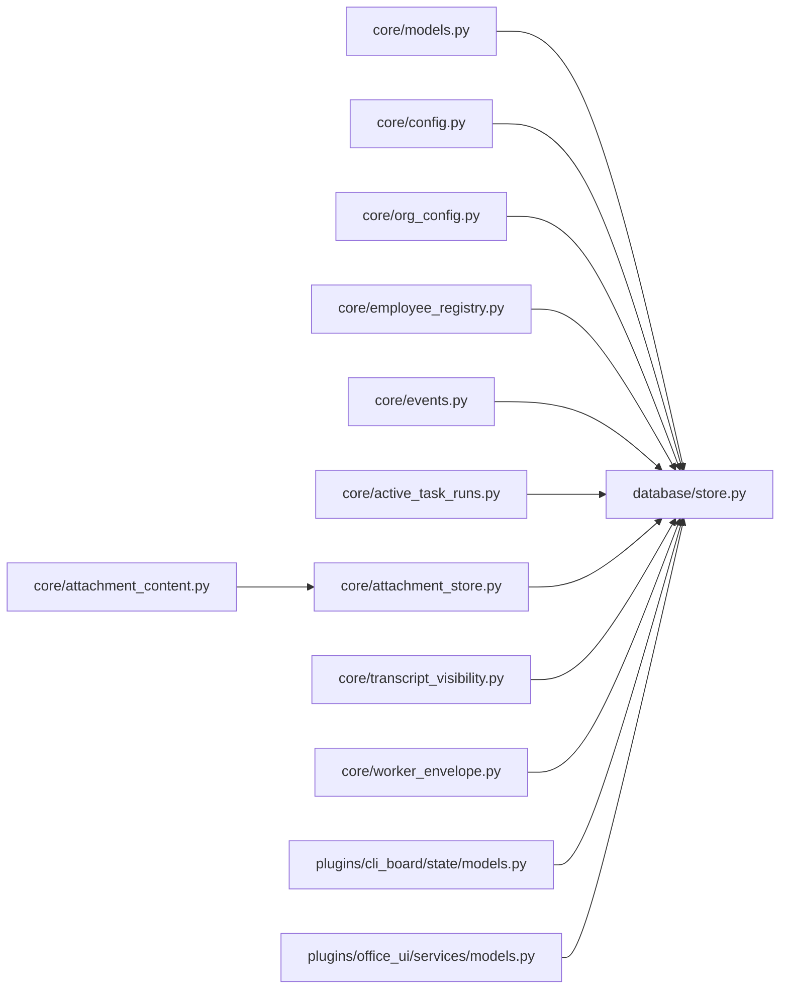

# 核心数据模型

<cite>
**本文引用的文件**   
- [opc/core/models.py](file://opc/core/models.py)
- [opc/database/store.py](file://opc/database/store.py)
- [opc/core/attachment_content.py](file://opc/core/attachment_content.py)
- [opc/core/attachment_store.py](file://opc/core/attachment_store.py)
- [opc/core/active_task_runs.py](file://opc/core/active_task_runs.py)
- [opc/core/events.py](file://opc/core/events.py)
- [opc/core/config.py](file://opc/core/config.py)
- [opc/core/org_config.py](file://opc/core/org_config.py)
- [opc/core/employee_registry.py](file://opc/core/employee_registry.py)
- [opc/core/transcript_visibility.py](file://opc/core/transcript_visibility.py)
- [opc/core/worker_envelope.py](file://opc/core/worker_envelope.py)
- [opc/plugins/cli_board/state/models.py](file://opc/plugins/cli_board/state/models.py)
- [opc/plugins/cli_board/state/store.py](file://opc/plugins/cli_board/state/store.py)
- [opc/plugins/office_ui/services/models.py](file://opc/plugins/office_ui/services/models.py)
</cite>

## 目录
1. [简介](#简介)
2. [项目结构](#项目结构)
3. [核心组件](#核心组件)
4. [架构总览](#架构总览)
5. [详细组件分析](#详细组件分析)
6. [依赖关系分析](#依赖关系分析)
7. [性能考量](#性能考量)
8. [故障排查指南](#故障排查指南)
9. [结论](#结论)
10. [附录](#附录)

## 简介
本文件面向OpenOPC的核心数据模型，聚焦于持久化与运行时状态的数据实体、字段含义、约束条件、版本迁移策略、数据访问模式与ORM使用最佳实践、验证规则与业务约束、CRUD示例、持久化机制与存储策略、完整性保证与并发控制设计。文档力求在技术深度与可读性之间取得平衡，帮助读者快速理解并正确使用这些模型。

## 项目结构
OpenOPC采用分层与模块化组织方式，核心数据模型主要分布在以下位置：
- 核心领域模型与配置：opc/core/*
- 数据库存储抽象与实现：opc/database/*
- 插件层（CLI看板、Office UI）中的局部状态模型：opc/plugins/*

图表来源
- [opc/core/models.py](file://opc/core/models.py)
- [opc/database/store.py](file://opc/database/store.py)
- [opc/core/config.py](file://opc/core/config.py)
- [opc/core/org_config.py](file://opc/core/org_config.py)
- [opc/core/employee_registry.py](file://opc/core/employee_registry.py)
- [opc/core/events.py](file://opc/core/events.py)
- [opc/core/active_task_runs.py](file://opc/core/active_task_runs.py)
- [opc/core/attachment_content.py](file://opc/core/attachment_content.py)
- [opc/core/attachment_store.py](file://opc/core/attachment_store.py)
- [opc/core/transcript_visibility.py](file://opc/core/transcript_visibility.py)
- [opc/core/worker_envelope.py](file://opc/core/worker_envelope.py)
- [opc/plugins/cli_board/state/models.py](file://opc/plugins/cli_board/state/models.py)
- [opc/plugins/cli_board/state/store.py](file://opc/plugins/cli_board/state/store.py)
- [opc/plugins/office_ui/services/models.py](file://opc/plugins/office_ui/services/models.py)

章节来源
- [opc/core/models.py](file://opc/core/models.py)
- [opc/database/store.py](file://opc/database/store.py)

## 核心组件
本节概述核心数据实体的职责边界与相互关系，为后续深入分析提供框架。

- 领域模型（models.py）：定义系统内关键实体的数据结构与基本约束，作为跨模块共享的“单一事实源”。
- 配置与组织模型（config.py、org_config.py、employee_registry.py）：描述运行期配置、组织架构与员工注册信息，通常具备强校验与默认值。
- 事件与活动记录（events.py、active_task_runs.py）：用于记录系统事件与活跃任务运行上下文，支持审计与恢复。
- 附件内容与管理（attachment_content.py、attachment_store.py）：封装附件元数据与存储策略，解耦内容与载体。
- 可见性与工作单元（transcript_visibility.py、worker_envelope.py）：控制会话转录可见范围与工作单元包装，保障安全与一致性。
- 存储抽象（store.py）：提供统一的数据库访问接口，屏蔽底层差异，承载事务、迁移与并发控制。
- 插件模型（cli_board/state/models.py、office_ui/services/models.py）：面向特定UI或工具的轻量模型，服务于展示与交互。

章节来源
- [opc/core/models.py](file://opc/core/models.py)
- [opc/core/config.py](file://opc/core/config.py)
- [opc/core/org_config.py](file://opc/core/org_config.py)
- [opc/core/employee_registry.py](file://opc/core/employee_registry.py)
- [opc/core/events.py](file://opc/core/events.py)
- [opc/core/active_task_runs.py](file://opc/core/active_task_runs.py)
- [opc/core/attachment_content.py](file://opc/core/attachment_content.py)
- [opc/core/attachment_store.py](file://opc/core/attachment_store.py)
- [opc/core/transcript_visibility.py](file://opc/core/transcript_visibility.py)
- [opc/core/worker_envelope.py](file://opc/core/worker_envelope.py)
- [opc/plugins/cli_board/state/models.py](file://opc/plugins/cli_board/state/models.py)
- [opc/plugins/office_ui/services/models.py](file://opc/plugins/office_ui/services/models.py)

## 架构总览
下图展示了核心数据模型与存储层的整体交互关系，包括配置加载、组织与员工管理、事件与任务运行、附件存取以及插件模型的读写路径。

图表来源
- [opc/database/store.py](file://opc/database/store.py)
- [opc/core/models.py](file://opc/core/models.py)
- [opc/core/config.py](file://opc/core/config.py)
- [opc/core/org_config.py](file://opc/core/org_config.py)
- [opc/core/employee_registry.py](file://opc/core/employee_registry.py)
- [opc/core/events.py](file://opc/core/events.py)
- [opc/core/active_task_runs.py](file://opc/core/active_task_runs.py)
- [opc/core/attachment_content.py](file://opc/core/attachment_content.py)
- [opc/core/attachment_store.py](file://opc/core/attachment_store.py)
- [opc/core/transcript_visibility.py](file://opc/core/transcript_visibility.py)
- [opc/core/worker_envelope.py](file://opc/core/worker_envelope.py)
- [opc/plugins/cli_board/state/models.py](file://opc/plugins/cli_board/state/models.py)
- [opc/plugins/office_ui/services/models.py](file://opc/plugins/office_ui/services/models.py)

## 详细组件分析

### 领域模型（core/models.py）
- 角色与职责：集中定义核心实体（如工作项、会话、阶段等）的数据结构与基础约束，供上层逻辑与存储层共同遵循。
- 字段与约束：包含标识符、时间戳、状态枚举、关联键等；通过类型提示与可选默认值表达必填/选填语义。
- 关系与依赖：与其他模型通过外键或引用键建立一对多、多对一等关系；避免循环导入，必要时使用延迟解析。
- 扩展点：预留扩展字段或版本标记，便于向后兼容与增量演进。

图表来源
- [opc/core/models.py](file://opc/core/models.py)
- [opc/core/config.py](file://opc/core/config.py)
- [opc/core/org_config.py](file://opc/core/org_config.py)
- [opc/core/employee_registry.py](file://opc/core/employee_registry.py)

章节来源
- [opc/core/models.py](file://opc/core/models.py)
- [opc/core/config.py](file://opc/core/config.py)
- [opc/core/org_config.py](file://opc/core/org_config.py)
- [opc/core/employee_registry.py](file://opc/core/employee_registry.py)

### 事件与活跃任务（core/events.py、core/active_task_runs.py）
- 事件模型：记录不可变的事件快照，包含事件类型、载荷、时间戳与来源，用于审计与回放。
- 活跃任务运行：维护当前执行的任务上下文，包括任务ID、阶段、进度、错误信息与重试计数。
- 一致性：事件追加为幂等操作；任务运行状态变更需配合事务与锁，防止竞态。

图表来源
- [opc/core/events.py](file://opc/core/events.py)
- [opc/core/active_task_runs.py](file://opc/core/active_task_runs.py)
- [opc/database/store.py](file://opc/database/store.py)

章节来源
- [opc/core/events.py](file://opc/core/events.py)
- [opc/core/active_task_runs.py](file://opc/core/active_task_runs.py)

### 附件内容与管理（core/attachment_content.py、core/attachment_store.py）
- 附件内容：描述附件的元数据（名称、类型、大小、哈希、URL/路径），确保可追溯与去重。
- 附件存储：抽象不同后端（本地、对象存储），提供上传、下载、删除与校验接口。
- 安全性：强制内容校验（MIME、大小限制）、访问控制与防注入。

图表来源
- [opc/core/attachment_content.py](file://opc/core/attachment_content.py)
- [opc/core/attachment_store.py](file://opc/core/attachment_store.py)

章节来源
- [opc/core/attachment_content.py](file://opc/core/attachment_content.py)
- [opc/core/attachment_store.py](file://opc/core/attachment_store.py)

### 可见性与工作单元（core/transcript_visibility.py、core/worker_envelope.py）
- 转录可见性：定义会话转录数据的可见范围与过滤规则，支持按组织、成员、任务维度隔离。
- 工作单元包装：将一组操作封装为原子单元，提供事务边界、回滚与补偿钩子。

图表来源
- [opc/core/transcript_visibility.py](file://opc/core/transcript_visibility.py)
- [opc/core/worker_envelope.py](file://opc/core/worker_envelope.py)

章节来源
- [opc/core/transcript_visibility.py](file://opc/core/transcript_visibility.py)
- [opc/core/worker_envelope.py](file://opc/core/worker_envelope.py)

### 存储抽象（database/store.py）
- 统一接口：提供增删改查、事务、分页、排序、过滤等通用方法。
- 迁移管理：内置版本检测与迁移脚本执行，确保Schema演进有序。
- 并发控制：基于乐观锁（版本号）或悲观锁（行级锁）保障一致性。
- 错误处理：标准化异常类型与消息，便于上层捕获与重试。

图表来源
- [opc/database/store.py](file://opc/database/store.py)

章节来源
- [opc/database/store.py](file://opc/database/store.py)

### 插件模型（cli_board/state/models.py、office_ui/services/models.py）
- CLI看板状态模型：面向看板视图的轻量实体，如任务卡片、列、泳道等，强调展示与交互效率。
- Office UI模型：面向Web界面的数据契约，与服务端模型保持映射一致，减少前后端不一致风险。

图表来源
- [opc/plugins/cli_board/state/models.py](file://opc/plugins/cli_board/state/models.py)
- [opc/plugins/office_ui/services/models.py](file://opc/plugins/office_ui/services/models.py)

章节来源
- [opc/plugins/cli_board/state/models.py](file://opc/plugins/cli_board/state/models.py)
- [opc/plugins/office_ui/services/models.py](file://opc/plugins/office_ui/services/models.py)

## 依赖关系分析
- 低耦合高内聚：核心模型仅依赖必要的基础库与类型提示，避免引入重型框架。
- 单向依赖：存储层依赖模型定义，模型不反向依赖存储实现，利于替换与测试。
- 插件隔离：插件模型与核心模型通过明确接口映射，降低耦合度。

图表来源
- [opc/core/models.py](file://opc/core/models.py)
- [opc/database/store.py](file://opc/database/store.py)
- [opc/core/config.py](file://opc/core/config.py)
- [opc/core/org_config.py](file://opc/core/org_config.py)
- [opc/core/employee_registry.py](file://opc/core/employee_registry.py)
- [opc/core/events.py](file://opc/core/events.py)
- [opc/core/active_task_runs.py](file://opc/core/active_task_runs.py)
- [opc/core/attachment_content.py](file://opc/core/attachment_content.py)
- [opc/core/attachment_store.py](file://opc/core/attachment_store.py)
- [opc/core/transcript_visibility.py](file://opc/core/transcript_visibility.py)
- [opc/core/worker_envelope.py](file://opc/core/worker_envelope.py)
- [opc/plugins/cli_board/state/models.py](file://opc/plugins/cli_board/state/models.py)
- [opc/plugins/office_ui/services/models.py](file://opc/plugins/office_ui/services/models.py)

章节来源
- [opc/core/models.py](file://opc/core/models.py)
- [opc/database/store.py](file://opc/database/store.py)

## 性能考量
- 索引与查询优化：为高频查询字段建立索引（如状态、时间戳、关联键），避免全表扫描。
- 分页与投影：大列表查询使用分页与字段投影，减少网络与内存开销。
- 批量操作：合并多次写入为批量事务，降低IO次数。
- 缓存策略：对只读配置与字典数据进行缓存，设置合理失效策略。
- 连接池：复用数据库连接，避免频繁握手。

[本节为通用指导，无需具体文件来源]

## 故障排查指南
- 常见错误类型：
  - 校验失败：字段缺失、类型不符、约束冲突。
  - 并发冲突：乐观锁版本号不一致导致更新失败。
  - 存储异常：连接超时、磁盘空间不足、权限拒绝。
- 定位步骤：
  - 检查日志中的异常堆栈与请求上下文。
  - 确认输入参数是否符合模型约束。
  - 查看事务边界与锁竞争情况。
- 修复建议：
  - 增加重试与退避策略。
  - 完善前置校验与默认值。
  - 调整索引与查询计划。

章节来源
- [opc/database/store.py](file://opc/database/store.py)

## 结论
OpenOPC的核心数据模型以清晰的分层与明确的职责边界为基础，结合统一的存储抽象与严格的约束校验，提供了稳定、可扩展且易于维护的数据基础设施。通过合理的版本迁移、并发控制与性能优化策略，系统能够在复杂业务场景下保持一致性与高性能。

[本节为总结，无需具体文件来源]

## 附录

### 数据模型版本管理与迁移策略
- 版本标记：每个模型或Schema附带版本号，迁移脚本按序执行。
- 向前兼容：新增字段默认允许为空并提供默认值，避免破坏旧客户端。
- 回滚方案：迁移脚本应支持逆向操作，确保升级失败时可回滚。
- 灰度发布：分批次应用迁移，监控指标与错误率。

章节来源
- [opc/database/store.py](file://opc/database/store.py)

### 数据访问模式与ORM使用最佳实践
- 使用存储抽象而非直接SQL，提升可移植性与可测试性。
- 在事务中组合多个写操作，保证原子性。
- 使用分页与投影减少负载。
- 对只读数据启用缓存与懒加载。
- 严格区分读写模型与命令模型，避免污染。

章节来源
- [opc/database/store.py](file://opc/database/store.py)

### 数据验证规则与业务逻辑约束
- 必填字段与类型校验：在模型层进行强校验，尽早失败。
- 业务约束：状态机转换合法、权限矩阵校验、资源配额限制。
- 外部依赖校验：附件类型与大小、URL合法性、签名有效性。

章节来源
- [opc/core/models.py](file://opc/core/models.py)
- [opc/core/attachment_content.py](file://opc/core/attachment_content.py)

### CRUD操作示例（代码片段路径）
- 创建实体：参考存储抽象的创建方法与模型构造路径。
- 读取实体：参考查询接口与过滤条件构建。
- 更新实体：参考事务与乐观锁更新流程。
- 删除实体：参考软删除与级联清理策略。

章节来源
- [opc/database/store.py](file://opc/database/store.py)
- [opc/core/models.py](file://opc/core/models.py)

### 数据持久化机制与存储策略
- 统一存储抽象屏蔽底层差异，支持多种后端。
- 附件内容分离存储，元数据与二进制解耦。
- 事件追加为主，支持回放与审计。

章节来源
- [opc/database/store.py](file://opc/database/store.py)
- [opc/core/attachment_content.py](file://opc/core/attachment_content.py)
- [opc/core/attachment_store.py](file://opc/core/attachment_store.py)

### 数据完整性与并发访问控制
- 完整性：外键约束、唯一性约束、检查约束。
- 并发：乐观锁版本号、行级锁、事务隔离级别选择。
- 幂等：事件写入幂等、任务状态更新幂等。

章节来源
- [opc/database/store.py](file://opc/database/store.py)
- [opc/core/events.py](file://opc/core/events.py)
- [opc/core/active_task_runs.py](file://opc/core/active_task_runs.py)