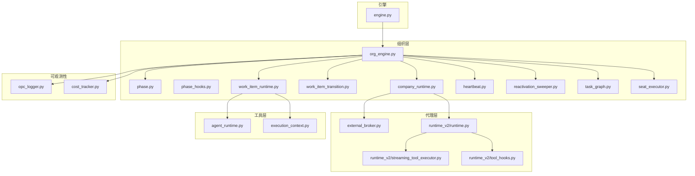
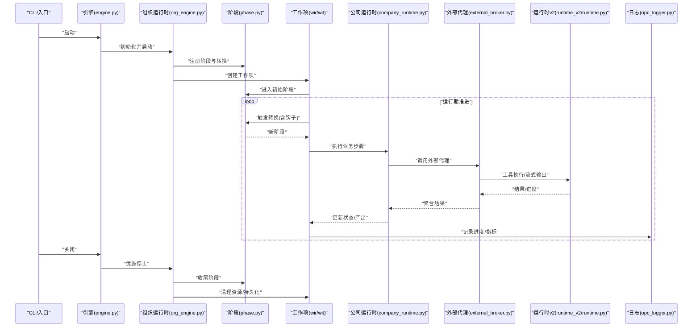
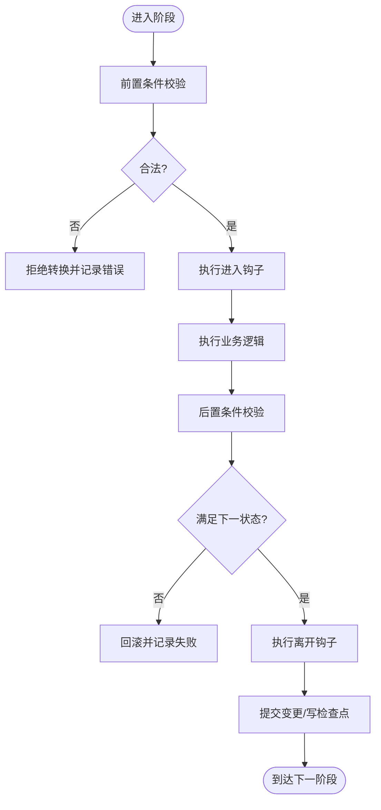
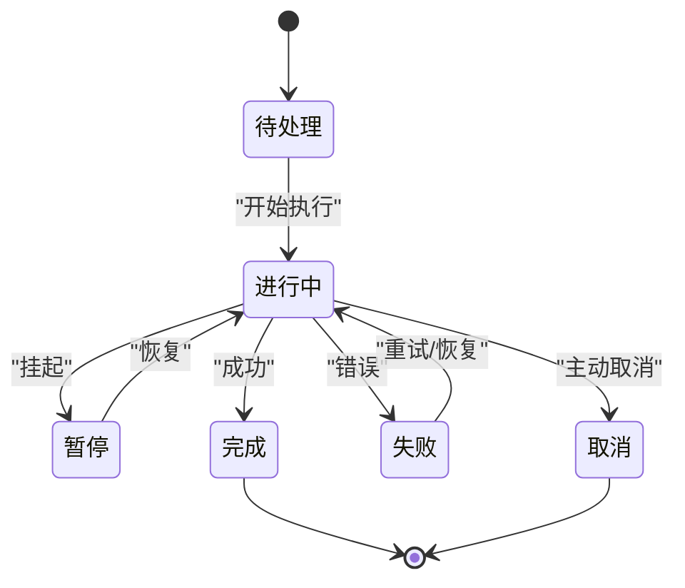
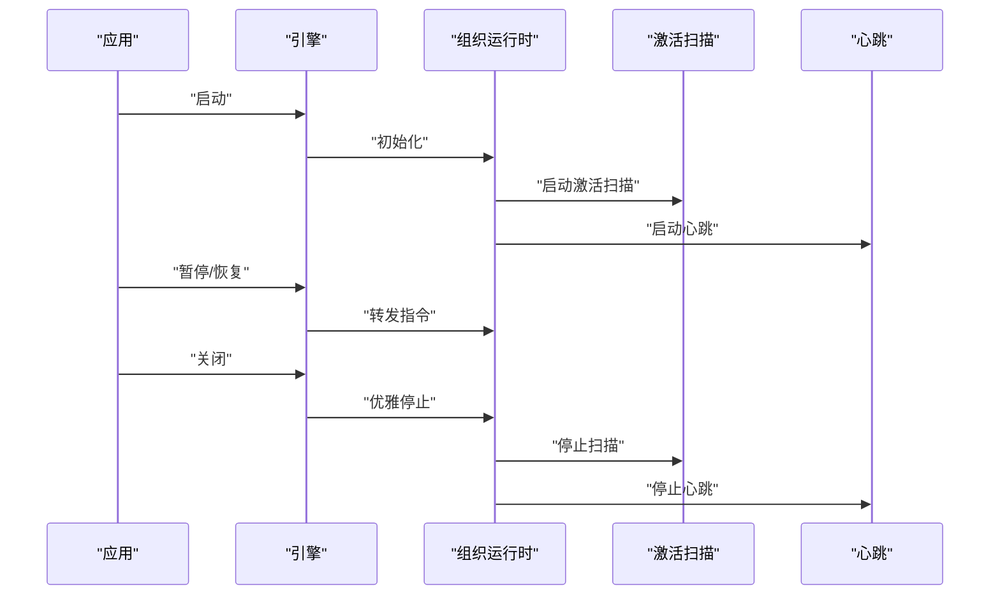
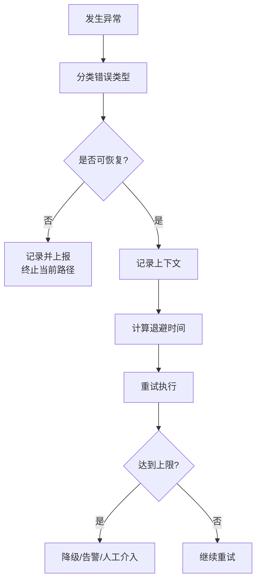
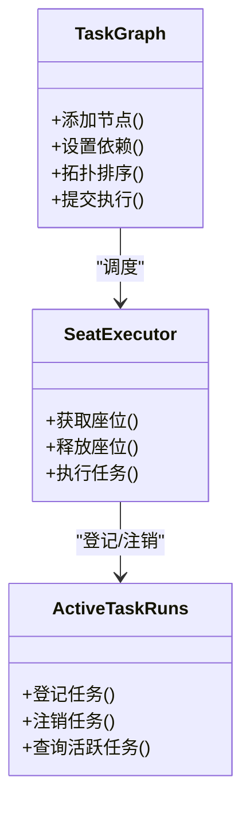
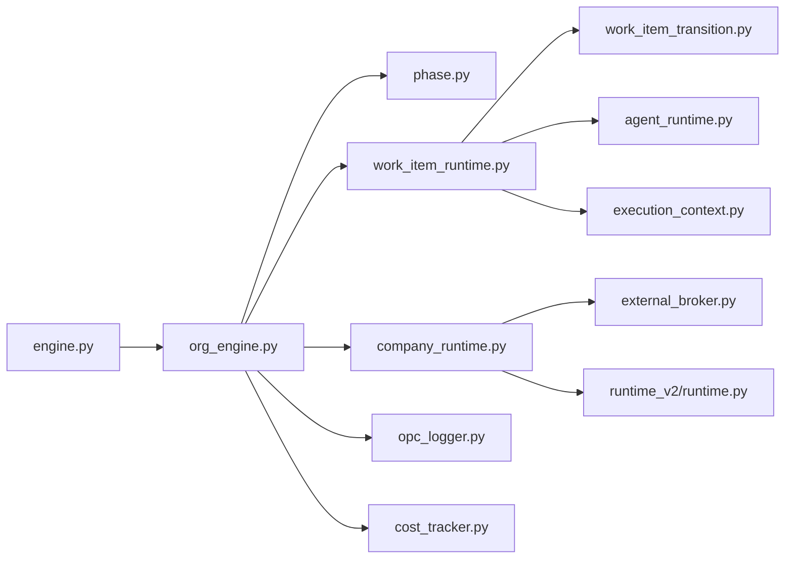

# 生命周期管理

<cite>
**本文引用的文件**   
- [engine.py](file://opc/engine.py)
- [org_engine.py](file://opc/layer2_organization/org_engine.py)
- [phase.py](file://opc/layer2_organization/phase.py)
- [phase_hooks.py](file://opc/layer2_organization/phase_hooks.py)
- [work_item_runtime.py](file://opc/layer2_organization/work_item_runtime.py)
- [work_item_transition.py](file://opc/layer2_organization/work_item_transition.py)
- [company_runtime.py](file://opc/layer2_organization/company_runtime.py)
- [reactivation_sweeper.py](file://opc/layer2_organization/reactivation_sweeper.py)
- [heartbeat.py](file://opc/layer2_organization/heartbeat.py)
- [task_graph.py](file://opc/layer2_organization/task_graph.py)
- [seat_executor.py](file://opc/layer2_organization/seat_executor.py)
- [active_task_runs.py](file://opc/core/active_task_runs.py)
- [memory_manager.py](file://opc/layer5_memory/memory_manager.py)
- [history_compactor.py](file://opc/layer5_memory/history_compactor.py)
- [approval.py](file://opc/layer2_organization/approval.py)
- [collaboration_service.py](file://opc/layer2_organization/collaboration_service.py)
- [external_broker.py](file://opc/layer3_agent/external_broker.py)
- [runtime.py](file://opc/layer3_agent/runtime_v2/runtime.py)
- [streaming_tool_executor.py](file://opc/layer3_agent/runtime_v2/streaming_tool_executor.py)
- [tool_hooks.py](file://opc/layer3_agent/runtime_v2/tool_hooks.py)
- [agent_runtime.py](file://opc/layer4_tools/agent_runtime.py)
- [execution_context.py](file://opc/layer4_tools/execution_context.py)
- [opc_logger.py](file://opc/layer6_observability/opc_logger.py)
- [cost_tracker.py](file://opc/layer6_observability/cost_tracker.py)
- [test_phase_state_machine_invariants.py](file://tests/test_phase_state_machine_invariants.py)
- [test_phase_transition_hooks.py](file://tests/test_phase_transition_hooks.py)
- [test_company_runtime_suspend_resume.py](file://tests/test_company_runtime_suspend_resume.py)
- [test_engine_runtime_recovery.py](file://tests/test_engine_runtime_recovery.py)
- [test_parallel_runtime_isolation.py](file://tests/test_parallel_runtime_isolation.py)
- [test_org_concurrency.py](file://tests/test_org_concurrency.py)
- [test_office_shutdown_lifecycle.py](file://tests/test_office_shutdown_lifecycle.py)
</cite>

## 目录
1. [简介](#简介)
2. [项目结构](#项目结构)
3. [核心组件](#核心组件)
4. [架构总览](#架构总览)
5. [详细组件分析](#详细组件分析)
6. [依赖关系分析](#依赖关系分析)
7. [性能考量](#性能考量)
8. [故障排查指南](#故障排查指南)
9. [结论](#结论)
10. [附录](#附录)

## 简介
本文件面向OpenOPC“生命周期管理系统”，聚焦引擎与组织运行时在启动、运行、暂停、恢复与关闭等关键阶段的完整生命周期。文档覆盖：
- 状态机与转换规则（阶段与工作项）
- 资源管理与清理策略
- 异常处理与故障恢复
- 自定义生命周期钩子实现方法
- 并行执行与任务调度策略
- 内存管理与垃圾回收优化
- 监控与调试工具
- 稳定性与可靠性保障

## 项目结构
OpenOPC采用分层架构，生命周期相关能力主要分布在以下模块：
- 引擎入口与编排：engine.py
- 组织运行时与阶段状态机：layer2_organization/*
- 工作项运行时与转换：work_item_runtime.py, work_item_transition.py
- 外部代理与运行时v2：layer3_agent/*
- 工具与执行上下文：layer4_tools/*
- 可观测性：layer6_observability/*
- 测试用例：tests/*

图表来源
- [engine.py](file://opc/engine.py)
- [org_engine.py](file://opc/layer2_organization/org_engine.py)
- [phase.py](file://opc/layer2_organization/phase.py)
- [work_item_runtime.py](file://opc/layer2_organization/work_item_runtime.py)
- [work_item_transition.py](file://opc/layer2_organization/work_item_transition.py)
- [company_runtime.py](file://opc/layer2_organization/company_runtime.py)
- [heartbeat.py](file://opc/layer2_organization/heartbeat.py)
- [reactivation_sweeper.py](file://opc/layer2_organization/reactivation_sweeper.py)
- [task_graph.py](file://opc/layer2_organization/task_graph.py)
- [seat_executor.py](file://opc/layer2_organization/seat_executor.py)
- [external_broker.py](file://opc/layer3_agent/external_broker.py)
- [runtime.py](file://opc/layer3_agent/runtime_v2/runtime.py)
- [streaming_tool_executor.py](file://opc/layer3_agent/runtime_v2/streaming_tool_executor.py)
- [tool_hooks.py](file://opc/layer3_agent/runtime_v2/tool_hooks.py)
- [agent_runtime.py](file://opc/layer4_tools/agent_runtime.py)
- [execution_context.py](file://opc/layer4_tools/execution_context.py)
- [opc_logger.py](file://opc/layer6_observability/opc_logger.py)
- [cost_tracker.py](file://opc/layer6_observability/cost_tracker.py)

章节来源
- [engine.py](file://opc/engine.py)
- [org_engine.py](file://opc/layer2_organization/org_engine.py)
- [phase.py](file://opc/layer2_organization/phase.py)
- [work_item_runtime.py](file://opc/layer2_organization/work_item_runtime.py)
- [work_item_transition.py](file://opc/layer2_organization/work_item_transition.py)
- [company_runtime.py](file://opc/layer2_organization/company_runtime.py)
- [heartbeat.py](file://opc/layer2_organization/heartbeat.py)
- [reactivation_sweeper.py](file://opc/layer2_organization/reactivation_sweeper.py)
- [task_graph.py](file://opc/layer2_organization/task_graph.py)
- [seat_executor.py](file://opc/layer2_organization/seat_executor.py)
- [external_broker.py](file://opc/layer3_agent/external_broker.py)
- [runtime.py](file://opc/layer3_agent/runtime_v2/runtime.py)
- [streaming_tool_executor.py](file://opc/layer3_agent/runtime_v2/streaming_tool_executor.py)
- [tool_hooks.py](file://opc/layer3_agent/runtime_v2/tool_hooks.py)
- [agent_runtime.py](file://opc/layer4_tools/agent_runtime.py)
- [execution_context.py](file://opc/layer4_tools/execution_context.py)
- [opc_logger.py](file://opc/layer6_observability/opc_logger.py)
- [cost_tracker.py](file://opc/layer6_observability/cost_tracker.py)

## 核心组件
- 引擎与组织运行时
  - 负责进程级启动、初始化、事件循环、优雅关闭与恢复。
  - 协调阶段状态机、工作项生命周期、心跳与激活扫描。
- 阶段状态机与工作项运行时
  - 定义阶段枚举、转换规则、前置/后置钩子。
  - 维护工作项的创建、推进、挂起、恢复与完成。
- 公司运行时与外部代理
  - 封装对外部代理会话、工具执行、流式输出的控制。
- 任务图与座位执行器
  - 提供任务拓扑、并发度控制、资源隔离与调度。
- 可观测性与成本追踪
  - 统一日志、指标与成本统计，支撑监控与排障。

章节来源
- [engine.py](file://opc/engine.py)
- [org_engine.py](file://opc/layer2_organization/org_engine.py)
- [phase.py](file://opc/layer2_organization/phase.py)
- [work_item_runtime.py](file://opc/layer2_organization/work_item_runtime.py)
- [work_item_transition.py](file://opc/layer2_organization/work_item_transition.py)
- [company_runtime.py](file://opc/layer2_organization/company_runtime.py)
- [task_graph.py](file://opc/layer2_organization/task_graph.py)
- [seat_executor.py](file://opc/layer2_organization/seat_executor.py)
- [opc_logger.py](file://opc/layer6_observability/opc_logger.py)
- [cost_tracker.py](file://opc/layer6_observability/cost_tracker.py)

## 架构总览
下图展示从引擎到组织运行时、阶段与工作项、外部代理与工具执行的端到端调用链，以及心跳与激活扫描的辅助流程。

图表来源
- [engine.py](file://opc/engine.py)
- [org_engine.py](file://opc/layer2_organization/org_engine.py)
- [phase.py](file://opc/layer2_organization/phase.py)
- [work_item_runtime.py](file://opc/layer2_organization/work_item_runtime.py)
- [work_item_transition.py](file://opc/layer2_organization/work_item_transition.py)
- [company_runtime.py](file://opc/layer2_organization/company_runtime.py)
- [external_broker.py](file://opc/layer3_agent/external_broker.py)
- [runtime.py](file://opc/layer3_agent/runtime_v2/runtime.py)
- [opc_logger.py](file://opc/layer6_observability/opc_logger.py)

## 详细组件分析

### 阶段状态机与转换规则
- 阶段定义与约束
  - 阶段包含状态集合、允许的前置条件、转换目标与副作用。
  - 通过转换表或规则函数校验合法性，避免非法跳转。
- 转换钩子
  - 支持在进入/离开阶段前后执行钩子，用于资源准备、检查点写入、审计日志等。
- 不变式与验证
  - 测试覆盖阶段状态机不变式，确保转换一致性。

图表来源
- [phase.py](file://opc/layer2_organization/phase.py)
- [phase_hooks.py](file://opc/layer2_organization/phase_hooks.py)
- [test_phase_state_machine_invariants.py](file://tests/test_phase_state_machine_invariants.py)
- [test_phase_transition_hooks.py](file://tests/test_phase_transition_hooks.py)

章节来源
- [phase.py](file://opc/layer2_organization/phase.py)
- [phase_hooks.py](file://opc/layer2_organization/phase_hooks.py)
- [test_phase_state_machine_invariants.py](file://tests/test_phase_state_machine_invariants.py)
- [test_phase_transition_hooks.py](file://tests/test_phase_transition_hooks.py)

### 工作项生命周期与转换
- 生命周期阶段
  - 典型包括：待处理、进行中、暂停、恢复、完成、失败、取消。
- 转换机制
  - 由工作项运行时驱动，结合阶段状态机进行推进。
  - 支持原子切换与幂等重试，保证中断后可恢复。
- 资源绑定与释放
  - 每个工作项持有独立上下文与资源句柄，退出时统一释放。

图表来源
- [work_item_runtime.py](file://opc/layer2_organization/work_item_runtime.py)
- [work_item_transition.py](file://opc/layer2_organization/work_item_transition.py)

章节来源
- [work_item_runtime.py](file://opc/layer2_organization/work_item_runtime.py)
- [work_item_transition.py](file://opc/layer2_organization/work_item_transition.py)

### 启动、运行、暂停、恢复与关闭流程
- 启动
  - 引擎加载配置、初始化组织运行时、注册阶段与工作项、启动心跳与激活扫描。
- 运行
  - 工作项按阶段推进，外部代理与工具执行产生进度与产出。
- 暂停/恢复
  - 支持对运行中的工作项或公司运行时进行暂停与恢复，保持状态一致。
- 关闭
  - 优雅停止：停止接收新任务、等待活跃任务完成、持久化检查点、释放资源。

图表来源
- [engine.py](file://opc/engine.py)
- [org_engine.py](file://opc/layer2_organization/org_engine.py)
- [reactivation_sweeper.py](file://opc/layer2_organization/reactivation_sweeper.py)
- [heartbeat.py](file://opc/layer2_organization/heartbeat.py)
- [test_company_runtime_suspend_resume.py](file://tests/test_company_runtime_suspend_resume.py)

章节来源
- [engine.py](file://opc/engine.py)
- [org_engine.py](file://opc/layer2_organization/org_engine.py)
- [reactivation_sweeper.py](file://opc/layer2_organization/reactivation_sweeper.py)
- [heartbeat.py](file://opc/layer2_organization/heartbeat.py)
- [test_company_runtime_suspend_resume.py](file://tests/test_company_runtime_suspend_resume.py)

### 资源管理与清理策略
- 资源分配
  - 工作项级别上下文隔离，工具执行环境按需创建。
- 清理时机
  - 阶段退出、工作项结束、公司运行时关闭时触发清理。
- 持久化与检查点
  - 关键状态落盘，支持重启后恢复。

章节来源
- [work_item_runtime.py](file://opc/layer2_organization/work_item_runtime.py)
- [work_item_transition.py](file://opc/layer2_organization/work_item_transition.py)
- [company_runtime.py](file://opc/layer2_organization/company_runtime.py)
- [test_office_shutdown_lifecycle.py](file://tests/test_office_shutdown_lifecycle.py)

### 异常处理与故障恢复
- 异常捕获与分类
  - 区分可恢复与不可恢复错误，记录上下文与堆栈。
- 重试与退避
  - 对临时性错误实施指数退避与最大重试次数限制。
- 自愈与恢复
  - 基于检查点的自动恢复；长时间无心跳的任务被标记并尝试修复。

图表来源
- [org_engine.py](file://opc/layer2_organization/org_engine.py)
- [work_item_runtime.py](file://opc/layer2_organization/work_item_runtime.py)
- [test_engine_runtime_recovery.py](file://tests/test_engine_runtime_recovery.py)

章节来源
- [org_engine.py](file://opc/layer2_organization/org_engine.py)
- [work_item_runtime.py](file://opc/layer2_organization/work_item_runtime.py)
- [test_engine_runtime_recovery.py](file://tests/test_engine_runtime_recovery.py)

### 自定义生命周期钩子的实现方法
- 钩子类型
  - 阶段进入/离开钩子、工作项生命周期钩子、工具执行前后钩子。
- 注册方式
  - 通过配置或插件机制注册钩子函数，框架在相应时机回调。
- 注意事项
  - 钩子需幂等、短耗时、可失败重试；避免阻塞主流程。

章节来源
- [phase_hooks.py](file://opc/layer2_organization/phase_hooks.py)
- [tool_hooks.py](file://opc/layer3_agent/runtime_v2/tool_hooks.py)
- [test_phase_transition_hooks.py](file://tests/test_phase_transition_hooks.py)

### 并行执行与任务调度
- 任务图
  - 以有向无环图表达任务依赖，支持拓扑排序与并行度控制。
- 座位执行器
  - 为每个工作项分配“座位”（执行槽），实现资源隔离与并发上限。
- 并发隔离
  - 测试覆盖并行运行时隔离，确保状态不互相污染。

图表来源
- [task_graph.py](file://opc/layer2_organization/task_graph.py)
- [seat_executor.py](file://opc/layer2_organization/seat_executor.py)
- [active_task_runs.py](file://opc/core/active_task_runs.py)
- [test_parallel_runtime_isolation.py](file://tests/test_parallel_runtime_isolation.py)
- [test_org_concurrency.py](file://tests/test_org_concurrency.py)

章节来源
- [task_graph.py](file://opc/layer2_organization/task_graph.py)
- [seat_executor.py](file://opc/layer2_organization/seat_executor.py)
- [active_task_runs.py](file://opc/core/active_task_runs.py)
- [test_parallel_runtime_isolation.py](file://tests/test_parallel_runtime_isolation.py)
- [test_org_concurrency.py](file://tests/test_org_concurrency.py)

### 内存管理与垃圾回收优化
- 历史压缩
  - 定期压缩长对话历史，降低上下文窗口占用。
- 内存管理器
  - 统一管理缓存、会话与中间态数据，提供淘汰与回收策略。
- 建议
  - 合理设置压缩阈值与回收周期；避免大对象长期驻留。

章节来源
- [history_compactor.py](file://opc/layer5_memory/history_compactor.py)
- [memory_manager.py](file://opc/layer5_memory/memory_manager.py)

### 监控与调试
- 日志与指标
  - 统一日志接口，记录关键生命周期事件与错误。
- 成本追踪
  - 跟踪工具调用与外部代理使用的成本，便于容量规划。
- 调试建议
  - 开启详细日志级别；关注心跳与激活扫描日志；使用测试用例复现问题。

章节来源
- [opc_logger.py](file://opc/layer6_observability/opc_logger.py)
- [cost_tracker.py](file://opc/layer6_observability/cost_tracker.py)

## 依赖关系分析
- 低耦合高内聚
  - 阶段与工作项解耦，通过钩子扩展行为。
  - 公司运行时屏蔽外部代理细节，向上提供稳定接口。
- 潜在环路
  - 通过单向依赖与事件总线避免循环引用。
- 外部依赖
  - 外部代理与运行时v2作为扩展点，可通过适配器替换。

图表来源
- [engine.py](file://opc/engine.py)
- [org_engine.py](file://opc/layer2_organization/org_engine.py)
- [phase.py](file://opc/layer2_organization/phase.py)
- [work_item_runtime.py](file://opc/layer2_organization/work_item_runtime.py)
- [work_item_transition.py](file://opc/layer2_organization/work_item_transition.py)
- [company_runtime.py](file://opc/layer2_organization/company_runtime.py)
- [external_broker.py](file://opc/layer3_agent/external_broker.py)
- [runtime.py](file://opc/layer3_agent/runtime_v2/runtime.py)
- [agent_runtime.py](file://opc/layer4_tools/agent_runtime.py)
- [execution_context.py](file://opc/layer4_tools/execution_context.py)
- [opc_logger.py](file://opc/layer6_observability/opc_logger.py)
- [cost_tracker.py](file://opc/layer6_observability/cost_tracker.py)

章节来源
- [engine.py](file://opc/engine.py)
- [org_engine.py](file://opc/layer2_organization/org_engine.py)
- [phase.py](file://opc/layer2_organization/phase.py)
- [work_item_runtime.py](file://opc/layer2_organization/work_item_runtime.py)
- [work_item_transition.py](file://opc/layer2_organization/work_item_transition.py)
- [company_runtime.py](file://opc/layer2_organization/company_runtime.py)
- [external_broker.py](file://opc/layer3_agent/external_broker.py)
- [runtime.py](file://opc/layer3_agent/runtime_v2/runtime.py)
- [agent_runtime.py](file://opc/layer4_tools/agent_runtime.py)
- [execution_context.py](file://opc/layer4_tools/execution_context.py)
- [opc_logger.py](file://opc/layer6_observability/opc_logger.py)
- [cost_tracker.py](file://opc/layer6_observability/cost_tracker.py)

## 性能考量
- 并发度调优
  - 根据CPU与I/O特性调整座位数与任务并行度。
- 批处理与合并
  - 将小任务合并以减少调度开销。
- 检查点粒度
  - 平衡持久化频率与性能，避免频繁IO。
- 历史压缩
  - 动态调整压缩阈值，减少上下文大小。

## 故障排查指南
- 常见问题
  - 任务卡死：检查心跳与激活扫描日志，确认是否存在长时间无进展的工作项。
  - 状态不一致：核对阶段转换钩子与检查点写入顺序。
  - 资源泄漏：关注工作项退出时的清理钩子是否执行。
- 定位手段
  - 启用详细日志；导出成本与指标；使用测试用例模拟场景。
- 恢复策略
  - 基于检查点恢复；必要时重置工作项至上一安全阶段。

章节来源
- [heartbeat.py](file://opc/layer2_organization/heartbeat.py)
- [reactivation_sweeper.py](file://opc/layer2_organization/reactivation_sweeper.py)
- [phase_hooks.py](file://opc/layer2_organization/phase_hooks.py)
- [work_item_runtime.py](file://opc/layer2_organization/work_item_runtime.py)
- [test_engine_runtime_recovery.py](file://tests/test_engine_runtime_recovery.py)

## 结论
OpenOPC的生命周期管理以阶段状态机与工作项运行为核心，配合心跳、激活扫描、任务图与座位执行器，实现了稳健的启动、运行、暂停、恢复与关闭流程。通过钩子机制、异常重试与检查点恢复，系统在复杂场景下具备良好弹性。结合内存压缩、并发控制与可观测性工具，可在生产环境中获得高可用与高性能表现。

## 附录
- 术语
  - 阶段：业务执行的最小可控单元，具有明确的状态与转换规则。
  - 工作项：承载一次具体任务的运行时实体，贯穿其全生命周期。
  - 座位：执行槽位，用于隔离并发任务与资源。
- 参考测试
  - 阶段状态机不变式、转换钩子、公司运行时暂停/恢复、引擎恢复、并行隔离与并发、关闭生命周期等。

章节来源
- [test_phase_state_machine_invariants.py](file://tests/test_phase_state_machine_invariants.py)
- [test_phase_transition_hooks.py](file://tests/test_phase_transition_hooks.py)
- [test_company_runtime_suspend_resume.py](file://tests/test_company_runtime_suspend_resume.py)
- [test_engine_runtime_recovery.py](file://tests/test_engine_runtime_recovery.py)
- [test_parallel_runtime_isolation.py](file://tests/test_parallel_runtime_isolation.py)
- [test_org_concurrency.py](file://tests/test_org_concurrency.py)
- [test_office_shutdown_lifecycle.py](file://tests/test_office_shutdown_lifecycle.py)