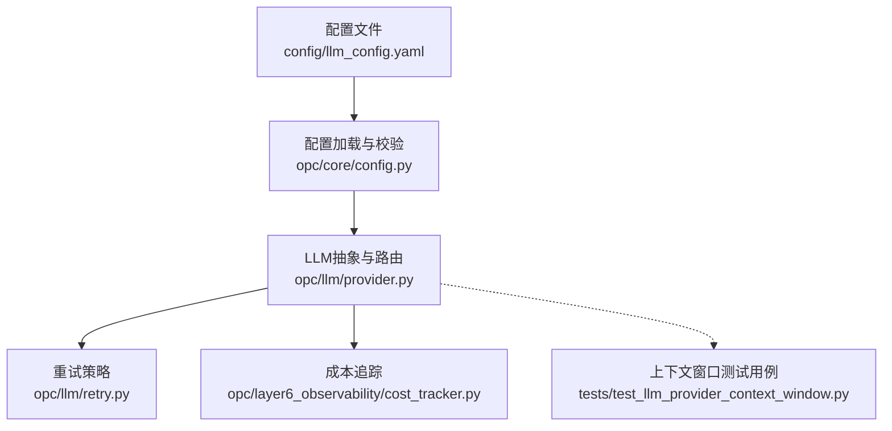
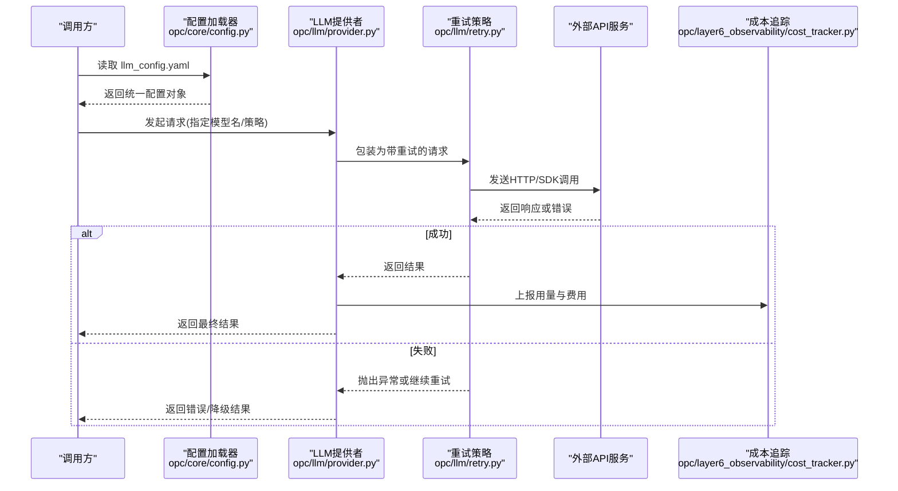
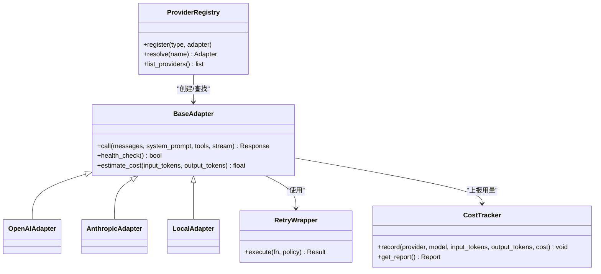
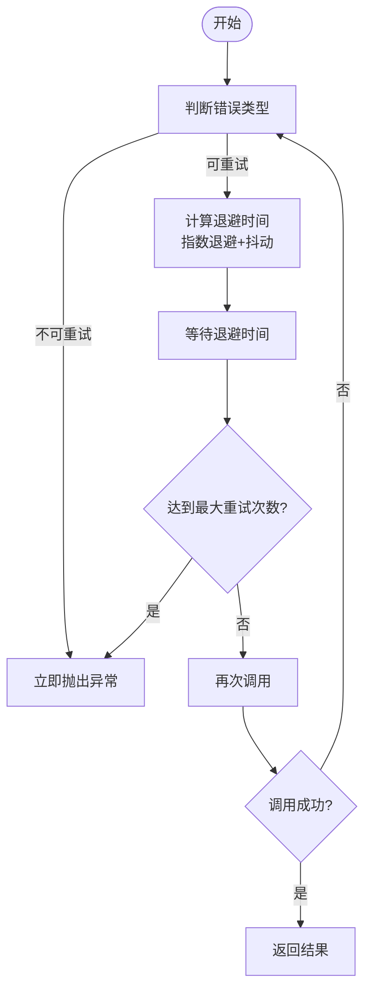
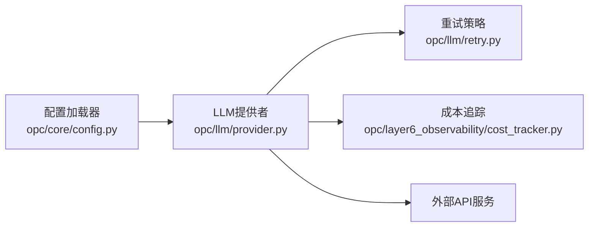

# LLM模型配置

<cite>
**本文引用的文件**   
- [config/llm_config.yaml](file://config/llm_config.yaml)
- [opc/llm/provider.py](file://opc/llm/provider.py)
- [opc/llm/retry.py](file://opc/llm/retry.py)
- [opc/core/config.py](file://opc/core/config.py)
- [opc/layer6_observability/cost_tracker.py](file://opc/layer6_observability/cost_tracker.py)
- [tests/test_llm_provider_context_window.py](file://tests/test_llm_provider_context_window.py)
</cite>

## 目录
1. [简介](#简介)
2. [项目结构](#项目结构)
3. [核心组件](#核心组件)
4. [架构总览](#架构总览)
5. [详细组件分析](#详细组件分析)
6. [依赖关系分析](#依赖关系分析)
7. [性能与成本调优](#性能与成本调优)
8. [故障排查指南](#故障排查指南)
9. [结论](#结论)
10. [附录](#附录)

## 简介
本文件面向OpenOPC的LLM模型配置，聚焦于配置文件 llm_config.yaml 的格式与语义、多提供商接入（如OpenAI、Claude、本地模型等）、连接参数与认证方式、模型选择策略、负载均衡与故障转移、重试与限流、成本控制、扩展新提供商的方法，以及连接测试与调试工具的使用。文档旨在帮助使用者快速完成正确、稳定且可观测的多模型接入与运维。

## 项目结构
与LLM配置相关的代码与配置主要分布在以下位置：
- 配置入口：config/llm_config.yaml
- 运行时加载与校验：opc/core/config.py
- LLM抽象与提供商实现：opc/llm/provider.py
- 重试机制：opc/llm/retry.py
- 成本追踪：opc/layer6_observability/cost_tracker.py
- 上下文窗口相关测试：tests/test_llm_provider_context_window.py

图示来源
- [config/llm_config.yaml](file://config/llm_config.yaml)
- [opc/core/config.py](file://opc/core/config.py)
- [opc/llm/provider.py](file://opc/llm/provider.py)
- [opc/llm/retry.py](file://opc/llm/retry.py)
- [opc/layer6_observability/cost_tracker.py](file://opc/layer6_observability/cost_tracker.py)
- [tests/test_llm_provider_context_window.py](file://tests/test_llm_provider_context_window.py)

章节来源
- [config/llm_config.yaml](file://config/llm_config.yaml)
- [opc/core/config.py](file://opc/core/config.py)
- [opc/llm/provider.py](file://opc/llm/provider.py)
- [opc/llm/retry.py](file://opc/llm/retry.py)
- [opc/layer6_observability/cost_tracker.py](file://opc/layer6_observability/cost_tracker.py)
- [tests/test_llm_provider_context_window.py](file://tests/test_llm_provider_context_window.py)

## 核心组件
- 配置加载器：负责读取并解析 llm_config.yaml，提供统一的配置对象给上层使用。
- LLM提供者抽象：定义统一的调用接口，屏蔽不同提供商差异，支持按名称或策略选择具体模型。
- 重试模块：封装指数退避、抖动、最大重试次数等通用重试策略。
- 成本追踪：记录每次请求的输入/输出token数与费用估算，便于审计与预算控制。
- 上下文窗口管理：在提示组装阶段确保不超过目标模型的上下文限制。

章节来源
- [opc/core/config.py](file://opc/core/config.py)
- [opc/llm/provider.py](file://opc/llm/provider.py)
- [opc/llm/retry.py](file://opc/llm/retry.py)
- [opc/layer6_observability/cost_tracker.py](file://opc/layer6_observability/cost_tracker.py)
- [tests/test_llm_provider_context_window.py](file://tests/test_llm_provider_context_window.py)

## 架构总览
下图展示了从配置到实际调用的关键路径，包括提供商选择、重试与成本统计。

图示来源
- [config/llm_config.yaml](file://config/llm_config.yaml)
- [opc/core/config.py](file://opc/core/config.py)
- [opc/llm/provider.py](file://opc/llm/provider.py)
- [opc/llm/retry.py](file://opc/llm/retry.py)
- [opc/layer6_observability/cost_tracker.py](file://opc/layer6_observability/cost_tracker.py)

## 详细组件分析

### 配置格式与字段说明（llm_config.yaml）
- 全局设置
  - 默认提供商与默认模型：用于未显式指定时的回退。
  - 全局重试与超时：为所有提供商提供默认值，可在提供商级别覆盖。
  - 全局限流与并发：控制并发度与令牌桶速率。
  - 成本与日志：是否开启成本追踪、采样率、敏感信息脱敏开关。
- 提供商列表
  - 每个提供商包含：
    - 标识与类型：如 openai、anthropic、openai_compatible、local 等。
    - 连接参数：base_url、timeout、max_retries、rate_limit、concurrency。
    - 认证信息：api_key、organization_id、project_id、自定义头信息等。
    - 模型映射：provider_model_alias -> 实际模型名。
    - 可选能力：streaming、function_call、vision、audio 等特性开关。
- 模型选择与路由
  - 按名称精确匹配：直接定位到某提供商下的具体模型。
  - 按策略选择：如“质量优先”、“成本优先”、“延迟优先”，结合权重与阈值进行动态选择。
  - 负载均衡：同提供商内多模型或多端点的轮询/加权分配。
  - 故障转移：当主模型不可用时自动切换到备用模型或提供商。

章节来源
- [config/llm_config.yaml](file://config/llm_config.yaml)
- [opc/core/config.py](file://opc/core/config.py)

### LLM提供者抽象与路由（opc/llm/provider.py）
- 统一接口
  - 标准化调用签名：接收消息、系统提示、工具定义、流式标志等。
  - 标准化返回：结构化响应体，包含内容、工具调用、用量统计与元数据。
- 提供商注册与发现
  - 通过配置中的类型字段动态实例化对应提供商适配器。
  - 支持热更新：在不重启进程的情况下重新加载配置。
- 模型选择与负载均衡
  - 基于配置的优先级与权重计算候选集。
  - 健康检查与熔断：对频繁失败的模型降低权重或暂时剔除。
- 上下文窗口管理
  - 根据目标模型的最大上下文长度裁剪历史与附件，避免越界。
  - 与提示组装层协作，保证最终请求大小满足约束。

图示来源
- [opc/llm/provider.py](file://opc/llm/provider.py)
- [opc/llm/retry.py](file://opc/llm/retry.py)
- [opc/layer6_observability/cost_tracker.py](file://opc/layer6_observability/cost_tracker.py)

章节来源
- [opc/llm/provider.py](file://opc/llm/provider.py)
- [tests/test_llm_provider_context_window.py](file://tests/test_llm_provider_context_window.py)

### 重试与容错（opc/llm/retry.py）
- 策略要素
  - 最大重试次数、初始退避时间、最大退避时间、退避系数、抖动因子。
  - 可重试错误分类：网络错误、超时、限流、服务端错误等。
- 行为特征
  - 指数退避+随机抖动，避免雪崩。
  - 针对限流错误采用更保守的重试间隔。
  - 支持取消与超时中断，防止长时间阻塞。

图示来源
- [opc/llm/retry.py](file://opc/llm/retry.py)

章节来源
- [opc/llm/retry.py](file://opc/llm/retry.py)

### 成本追踪与预算控制（opc/layer6_observability/cost_tracker.py）
- 采集指标
  - 提供商、模型、输入/输出token数、耗时、费用估算。
- 聚合与导出
  - 按日/周/月维度汇总，支持导出报表。
  - 与告警系统集成，超预算时触发通知。
- 配置项
  - 是否启用、采样率、单位价格表、币种与汇率。

章节来源
- [opc/layer6_observability/cost_tracker.py](file://opc/layer6_observability/cost_tracker.py)

### 上下文窗口与提示压缩（tests/test_llm_provider_context_window.py）
- 目标
  - 确保最终请求不超出目标模型上下文窗口。
- 方法
  - 在提示组装阶段预估token数，必要时截断历史或摘要。
  - 对不同提供商的上下文窗口差异进行适配。

章节来源
- [tests/test_llm_provider_context_window.py](file://tests/test_llm_provider_context_window.py)

## 依赖关系分析
- 配置驱动：所有行为由 llm_config.yaml 驱动，运行时通过配置加载器注入。
- 低耦合：提供商适配器通过统一接口解耦，新增提供商无需改动调用方。
- 横切关注点：重试、限流、成本追踪以中间件形式嵌入调用链路。

图示来源
- [opc/core/config.py](file://opc/core/config.py)
- [opc/llm/provider.py](file://opc/llm/provider.py)
- [opc/llm/retry.py](file://opc/llm/retry.py)
- [opc/layer6_observability/cost_tracker.py](file://opc/layer6_observability/cost_tracker.py)

章节来源
- [opc/core/config.py](file://opc/core/config.py)
- [opc/llm/provider.py](file://opc/llm/provider.py)
- [opc/llm/retry.py](file://opc/llm/retry.py)
- [opc/layer6_observability/cost_tracker.py](file://opc/layer6_observability/cost_tracker.py)

## 性能与成本调优
- 并发与限流
  - 合理设置并发度与令牌桶速率，避免触发提供商限流。
  - 针对不同提供商分别配置，避免相互影响。
- 重试与超时
  - 将最大重试次数与退避上限控制在业务容忍范围内。
  - 区分可重试与不可重试错误，减少无效重试。
- 模型选择策略
  - 质量优先：选择高质量但可能较慢的模型；成本优先：选择低成本模型；延迟优先：选择低延迟模型。
  - 结合权重与阈值，动态切换以降低整体成本或提升稳定性。
- 上下文窗口优化
  - 使用摘要、去重、选择性保留关键片段，减少token消耗。
- 成本监控
  - 开启成本追踪，设定预算阈值与告警，定期复盘用量。

[本节为通用指导，不涉及具体文件分析]

## 故障排查指南
- 连接问题
  - 检查 base_url、代理、证书与防火墙规则。
  - 验证 api_key 权限与配额，确认组织/项目ID是否正确。
- 鉴权失败
  - 核对密钥有效期、作用域与IP白名单。
  - 查看提供商控制台是否有访问拒绝记录。
- 限流与超时
  - 调整 rate_limit 与 max_retries，观察重试日志。
  - 增加超时时间或拆分大请求。
- 上下文溢出
  - 缩短历史或启用提示压缩，参考上下文窗口测试用例的行为。
- 成本异常
  - 检查 cost_tracker 的单价表与汇率配置，确认是否误用高成本模型。

章节来源
- [config/llm_config.yaml](file://config/llm_config.yaml)
- [opc/llm/retry.py](file://opc/llm/retry.py)
- [opc/layer6_observability/cost_tracker.py](file://opc/layer6_observability/cost_tracker.py)
- [tests/test_llm_provider_context_window.py](file://tests/test_llm_provider_context_window.py)

## 结论
通过统一的配置驱动与抽象化的提供商接口，OpenOPC实现了灵活、可扩展的LLM接入能力。借助重试、限流、成本追踪与上下文窗口管理，系统能够在多提供商环境下保持高可用与可控成本。建议在生产环境开启全量观测与告警，持续优化模型选择策略与资源使用效率。

[本节为总结性内容，不涉及具体文件分析]

## 附录

### 添加新的模型提供商支持
- 步骤概览
  - 在 provider.py 中新增适配器类，实现统一接口。
  - 在配置加载器中注册新类型，使其可从 llm_config.yaml 中识别。
  - 补充重试与成本追踪的适配逻辑。
  - 编写最小可用测试，覆盖连接、鉴权与基本调用。
- 注意事项
  - 遵循统一错误码与异常体系。
  - 明确支持的模型与能力（流式、函数调用、视觉等）。
  - 提供清晰的配置示例与文档注释。

章节来源
- [opc/llm/provider.py](file://opc/llm/provider.py)
- [opc/core/config.py](file://opc/core/config.py)

### 连接测试与调试工具
- 连通性测试
  - 使用最小请求验证 base_url、鉴权与网络可达性。
- 鉴权诊断
  - 打印必要的非敏感元数据（如提供商、模型、版本），避免泄露密钥。
- 重试与限流观察
  - 开启详细日志，观察重试次数、退避时间与限流事件。
- 成本与上下文
  - 检查 cost_tracker 的输出与上下文窗口裁剪效果。

章节来源
- [opc/llm/retry.py](file://opc/llm/retry.py)
- [opc/layer6_observability/cost_tracker.py](file://opc/layer6_observability/cost_tracker.py)
- [tests/test_llm_provider_context_window.py](file://tests/test_llm_provider_context_window.py)