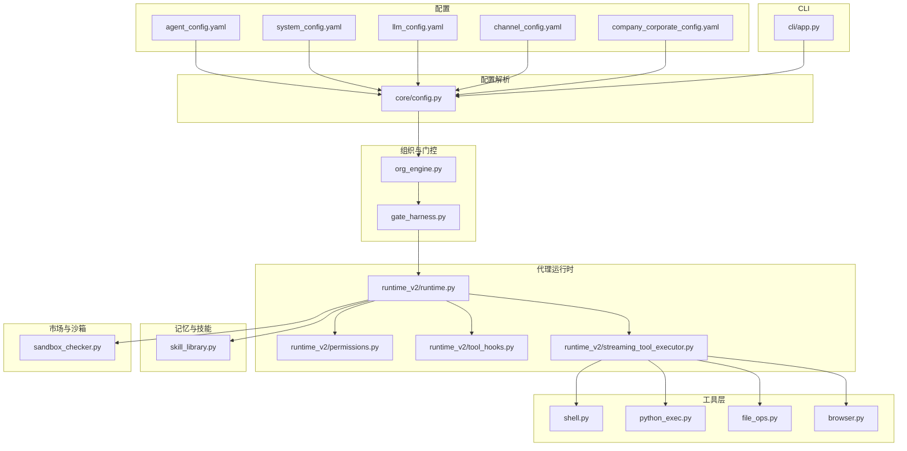
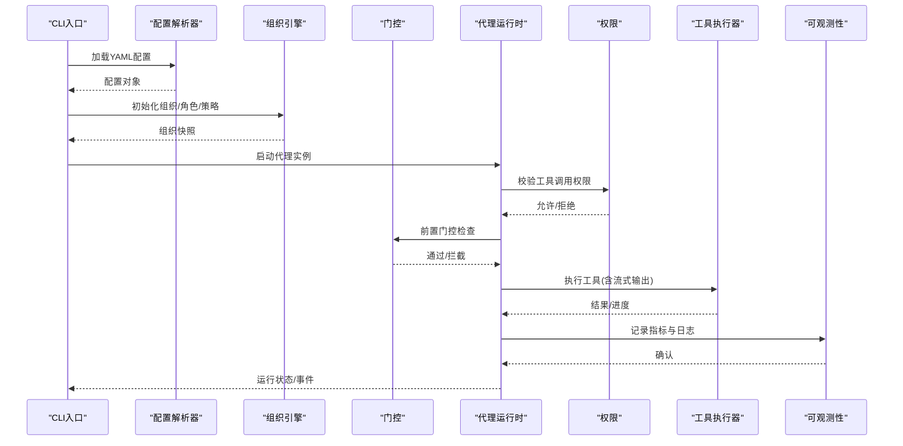
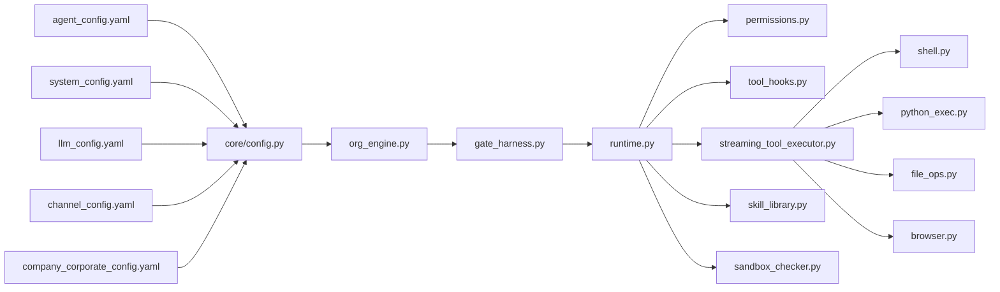

# 代理配置

<cite>
**本文引用的文件**   
- [agent_config.yaml](file://config/agent_config.yaml)
- [system_config.yaml](file://config/system_config.yaml)
- [llm_config.yaml](file://config/llm_config.yaml)
- [channel_config.yaml](file://config/channel_config.yaml)
- [company_corporate_config.yaml](file://config/company_corporate_config.yaml)
- [core/config.py](file://opc/core/config.py)
- [layer2_organization/org_engine.py](file://opc/layer2_organization/org_engine.py)
- [layer2_organization/gate_harness.py](file://opc/layer2_organization/gate_harness.py)
- [layer3_agent/runtime_v2/runtime.py](file://opc/layer3_agent/runtime_v2/runtime.py)
- [layer3_agent/runtime_v2/permissions.py](file://opc/layer3_agent/runtime_v2/permissions.py)
- [layer3_agent/runtime_v2/tool_hooks.py](file://opc/layer3_agent/runtime_v2/tool_hooks.py)
- [layer3_agent/runtime_v2/streaming_tool_executor.py](file://opc/layer3_agent/runtime_v2/streaming_tool_executor.py)
- [layer4_tools/shell.py](file://opc/layer4_tools/shell.py)
- [layer4_tools/python_exec.py](file://opc/layer4_tools/python_exec.py)
- [layer4_tools/file_ops.py](file://opc/layer4_tools/file_ops.py)
- [layer4_tools/browser.py](file://opc/layer4_tools/browser.py)
- [layer5_memory/skill_library.py](file://opc/layer5_memory/skill_library.py)
- [market/sandbox_checker.py](file://opc/market/sandbox_checker.py)
- [layer6_observability/opc_logger.py](file://opc/layer6_observability/opc_logger.py)
- [cli/app.py](file://opc/cli/app.py)
</cite>

## 目录
1. [简介](#简介)
2. [项目结构](#项目结构)
3. [核心组件](#核心组件)
4. [架构总览](#架构总览)
5. [详细组件分析](#详细组件分析)
6. [依赖关系分析](#依赖关系分析)
7. [性能考虑](#性能考虑)
8. [故障排查指南](#故障排查指南)
9. [结论](#结论)
10. [附录](#附录)

## 简介
本文件面向OpenOPC的“代理（Agent）”配置，围绕配置文件 agent_config.yaml 展开，系统说明代理行为、角色与权限、工具访问限制、启动参数、资源限制、生命周期管理、安全策略与沙箱、执行环境、动态加载与热更新、版本管理、以及验证与调试方法。文档同时给出不同角色的配置模板与使用场景示例，帮助读者快速搭建符合业务需求的代理实例。

## 项目结构
OpenOPC采用分层架构：配置层、组织编排层、代理运行时层、工具层、记忆与技能层、可观测性层等。与代理配置直接相关的核心路径包括：
- 配置目录 config/：集中存放各类YAML配置，其中 agent_config.yaml 为代理主配置
- 配置解析 opc/core/config.py：负责读取并校验配置
- 组织与门控 layer2_organization/*：负责角色定义、权限控制、工作项流转与门控策略
- 代理运行时 layer3_agent/runtime_v2/*：负责代理生命周期、工具执行、流式输出、子代理与权限检查
- 工具层 layer4_tools/*：提供Shell、Python执行、文件操作、浏览器等能力，受权限与安全策略约束
- 记忆与技能层 layer5_memory/*：技能库导入与版本管理
- 市场与沙箱 market/*：包加载、沙箱检查
- CLI入口 opc/cli/app.py：命令行启动与参数注入

图表来源
- [agent_config.yaml](file://config/agent_config.yaml)
- [system_config.yaml](file://config/system_config.yaml)
- [llm_config.yaml](file://config/llm_config.yaml)
- [channel_config.yaml](file://config/channel_config.yaml)
- [company_corporate_config.yaml](file://config/company_corporate_config.yaml)
- [core/config.py](file://opc/core/config.py)
- [org_engine.py](file://opc/layer2_organization/org_engine.py)
- [gate_harness.py](file://opc/layer2_organization/gate_harness.py)
- [runtime.py](file://opc/layer3_agent/runtime_v2/runtime.py)
- [permissions.py](file://opc/layer3_agent/runtime_v2/permissions.py)
- [tool_hooks.py](file://opc/layer3_agent/runtime_v2/tool_hooks.py)
- [streaming_tool_executor.py](file://opc/layer3_agent/runtime_v2/streaming_tool_executor.py)
- [shell.py](file://opc/layer4_tools/shell.py)
- [python_exec.py](file://opc/layer4_tools/python_exec.py)
- [file_ops.py](file://opc/layer4_tools/file_ops.py)
- [browser.py](file://opc/layer4_tools/browser.py)
- [skill_library.py](file://opc/layer5_memory/skill_library.py)
- [sandbox_checker.py](file://opc/market/sandbox_checker.py)
- [app.py](file://opc/cli/app.py)

章节来源
- [core/config.py](file://opc/core/config.py)
- [org_engine.py](file://opc/layer2_organization/org_engine.py)
- [gate_harness.py](file://opc/layer2_organization/gate_harness.py)
- [runtime.py](file://opc/layer3_agent/runtime_v2/runtime.py)
- [permissions.py](file://opc/layer3_agent/runtime_v2/permissions.py)
- [tool_hooks.py](file://opc/layer3_agent/runtime_v2/tool_hooks.py)
- [streaming_tool_executor.py](file://opc/layer3_agent/runtime_v2/streaming_tool_executor.py)
- [shell.py](file://opc/layer4_tools/shell.py)
- [python_exec.py](file://opc/layer4_tools/python_exec.py)
- [file_ops.py](file://opc/layer4_tools/file_ops.py)
- [browser.py](file://opc/layer4_tools/browser.py)
- [skill_library.py](file://opc/layer5_memory/skill_library.py)
- [sandbox_checker.py](file://opc/market/sandbox_checker.py)
- [app.py](file://opc/cli/app.py)

## 核心组件
本节聚焦与代理配置强相关的核心模块及其职责：
- 配置解析器 core/config.py：统一加载YAML配置，合并默认值，进行基础校验，暴露给上层模块
- 组织引擎 org_engine.py：基于配置构建组织架构、角色、会话与工作项策略
- 门控 gate_harness.py：在关键动作前后施加策略检查（如审批、预算、可见性）
- 代理运行时 runtime.py：管理代理生命周期、上下文装配、任务调度、与工具执行器的交互
- 权限 permissions.py：依据角色与策略决定工具调用是否允许
- 工具钩子 tool_hooks.py：在执行前后注入审计、限流、日志等横切逻辑
- 流式工具执行 streaming_tool_executor.py：支持长时任务的增量输出与中断
- 工具实现 shell.py、python_exec.py、file_ops.py、browser.py：具体能力实现，受权限与安全策略约束
- 技能库 skill_library.py：技能的导入、版本管理与热更新
- 沙箱检查 sandbox_checker.py：对第三方包或外部能力的风险检测
- CLI入口 app.py：命令行参数注入到配置与运行时

章节来源
- [core/config.py](file://opc/core/config.py)
- [org_engine.py](file://opc/layer2_organization/org_engine.py)
- [gate_harness.py](file://opc/layer2_organization/gate_harness.py)
- [runtime.py](file://opc/layer3_agent/runtime_v2/runtime.py)
- [permissions.py](file://opc/layer3_agent/runtime_v2/permissions.py)
- [tool_hooks.py](file://opc/layer3_agent/runtime_v2/tool_hooks.py)
- [streaming_tool_executor.py](file://opc/layer3_agent/runtime_v2/streaming_tool_executor.py)
- [shell.py](file://opc/layer4_tools/shell.py)
- [python_exec.py](file://opc/layer4_tools/python_exec.py)
- [file_ops.py](file://opc/layer4_tools/file_ops.py)
- [browser.py](file://opc/layer4_tools/browser.py)
- [skill_library.py](file://opc/layer5_memory/skill_library.py)
- [sandbox_checker.py](file://opc/market/sandbox_checker.py)
- [app.py](file://opc/cli/app.py)

## 架构总览
下图展示了从配置到运行时执行的端到端流程：CLI读取配置，组织引擎根据配置构建角色与策略，门控在关键节点进行检查，代理运行时协调工具执行，并通过权限与钩子保障安全与可观测性。

图表来源
- [app.py](file://opc/cli/app.py)
- [core/config.py](file://opc/core/config.py)
- [org_engine.py](file://opc/layer2_organization/org_engine.py)
- [gate_harness.py](file://opc/layer2_organization/gate_harness.py)
- [runtime.py](file://opc/layer3_agent/runtime_v2/runtime.py)
- [permissions.py](file://opc/layer3_agent/runtime_v2/permissions.py)
- [streaming_tool_executor.py](file://opc/layer3_agent/runtime_v2/streaming_tool_executor.py)
- [opc_logger.py](file://opc/layer6_observability/opc_logger.py)

## 详细组件分析

### 代理主配置 agent_config.yaml
- 作用：定义单个代理实例的行为、角色、工具集、资源限制、安全策略、执行环境与生命周期参数
- 典型字段类别（以实际文件为准）：
  - 代理标识与会话：名称、ID、会话隔离策略、持久化开关
  - 角色与权限：角色映射、默认权限、工具白名单/黑名单、跨域访问策略
  - 工具与执行：启用/禁用工具、超时、重试、并发度、流式输出开关
  - 资源限制：CPU/内存上限、磁盘配额、网络出口限制
  - 安全与沙箱：沙箱模式、环境变量隔离、命令白名单、文件系统挂载点
  - 生命周期：启动钩子、优雅关闭、健康检查、自动重启策略
  - 可观测性：日志级别、采样率、上报目标
- 建议：将通用部分抽取为模板，按角色与环境复用；敏感信息通过环境变量注入

章节来源
- [agent_config.yaml](file://config/agent_config.yaml)

### 系统配置 system_config.yaml
- 作用：全局系统级设置，影响所有代理实例，如默认沙箱策略、默认日志策略、全局网络策略、存储后端等
- 与代理配置的关系：当代理未显式覆盖时，继承系统默认值

章节来源
- [system_config.yaml](file://config/system_config.yaml)

### LLM配置 llm_config.yaml
- 作用：模型提供商、密钥、上下文窗口、重试与退避策略、成本上限等
- 与代理的关系：代理在生成计划、总结、提示组装时使用LLM能力

章节来源
- [llm_config.yaml](file://config/llm_config.yaml)

### 渠道配置 channel_config.yaml
- 作用：消息通道（如IM、邮件、Webhook）接入参数、鉴权、速率限制
- 与代理的关系：代理通过渠道接收指令与推送结果

章节来源
- [channel_config.yaml](file://config/channel_config.yaml)

### 公司/企业配置 company_corporate_config.yaml
- 作用：企业级策略，如合规要求、数据驻留、审批流、协作策略
- 与代理的关系：影响组织引擎与门控策略的决策

章节来源
- [company_corporate_config.yaml](file://config/company_corporate_config.yaml)

### 配置解析与校验 core/config.py
- 功能：读取多份YAML，合并默认值，进行类型与范围校验，暴露配置对象
- 关键点：
  - 优先级：CLI > 环境变量 > 代理配置 > 系统配置 > 内置默认
  - 校验失败时的错误信息与修复建议
  - 敏感字段的脱敏处理

章节来源
- [core/config.py](file://opc/core/config.py)

### 组织与角色 org_engine.py
- 功能：根据配置构建组织树、角色定义、岗位与职责、工作项模板
- 与代理配置的关系：
  - 角色决定工具集与权限边界
  - 工作项模板驱动代理的任务规划与阶段转换

章节来源
- [org_engine.py](file://opc/layer2_organization/org_engine.py)

### 门控策略 gate_harness.py
- 功能：在关键动作前后执行策略检查（如预算、审批、可见性、合规）
- 与代理配置的关系：
  - 由配置驱动的规则集
  - 可插拔的策略处理器

章节来源
- [gate_harness.py](file://opc/layer2_organization/gate_harness.py)

### 代理运行时 runtime.py
- 功能：代理生命周期管理、上下文装配、任务调度、与工具执行器协作
- 关键点：
  - 启动参数注入（来自CLI与配置）
  - 健康检查与优雅关闭
  - 子代理创建与隔离

章节来源
- [runtime.py](file://opc/layer3_agent/runtime_v2/runtime.py)

### 权限控制 permissions.py
- 功能：基于角色与策略的工具调用许可判定
- 关键点：
  - 工具白名单/黑名单
  - 条件授权（如时间、上下文、审批状态）
  - 审计记录

章节来源
- [permissions.py](file://opc/layer3_agent/runtime_v2/permissions.py)

### 工具钩子 tool_hooks.py
- 功能：在执行前后注入横切逻辑（限流、熔断、审计、指标采集）
- 关键点：
  - 钩子注册与顺序
  - 异常传播与恢复策略

章节来源
- [tool_hooks.py](file://opc/layer3_agent/runtime_v2/tool_hooks.py)

### 流式工具执行 streaming_tool_executor.py
- 功能：支持长时任务的增量输出、中断与恢复
- 关键点：
  - 背压与缓冲控制
  - 断线重连与状态同步

章节来源
- [streaming_tool_executor.py](file://opc/layer3_agent/runtime_v2/streaming_tool_executor.py)

### 工具实现与限制
- Shell shell.py：命令执行、命令白名单、工作目录限制、超时
- Python执行 python_exec.py：受限解释器、导入白名单、内存/CPU限制
- 文件操作 file_ops.py：只读/读写挂载点、路径白名单、大小限制
- 浏览器 browser.py：无头模式、网络出站限制、截图与下载策略

章节来源
- [shell.py](file://opc/layer4_tools/shell.py)
- [python_exec.py](file://opc/layer4_tools/python_exec.py)
- [file_ops.py](file://opc/layer4_tools/file_ops.py)
- [browser.py](file://opc/layer4_tools/browser.py)

### 技能库与热更新 skill_library.py
- 功能：技能包的导入、版本管理、热更新与回滚
- 关键点：
  - 版本锁定与一致性检查
  - 热更新的安全扫描与灰度发布

章节来源
- [skill_library.py](file://opc/layer5_memory/skill_library.py)

### 沙箱检查 sandbox_checker.py
- 功能：对第三方包或外部能力进行风险检测（危险API、网络访问、系统调用）
- 关键点：
  - 风险评分与阈值
  - 阻断与告警策略

章节来源
- [sandbox_checker.py](file://opc/market/sandbox_checker.py)

### CLI启动与参数 app.py
- 功能：命令行参数解析、配置注入、进程守护与健康检查
- 关键点：
  - 启动参数覆盖配置
  - 优雅退出信号处理

章节来源
- [app.py](file://opc/cli/app.py)

## 依赖关系分析
下图展示配置到运行时各组件的依赖关系，突出代理配置如何影响权限、工具与沙箱策略。

图表来源
- [agent_config.yaml](file://config/agent_config.yaml)
- [system_config.yaml](file://config/system_config.yaml)
- [llm_config.yaml](file://config/llm_config.yaml)
- [channel_config.yaml](file://config/channel_config.yaml)
- [company_corporate_config.yaml](file://config/company_corporate_config.yaml)
- [core/config.py](file://opc/core/config.py)
- [org_engine.py](file://opc/layer2_organization/org_engine.py)
- [gate_harness.py](file://opc/layer2_organization/gate_harness.py)
- [runtime.py](file://opc/layer3_agent/runtime_v2/runtime.py)
- [permissions.py](file://opc/layer3_agent/runtime_v2/permissions.py)
- [tool_hooks.py](file://opc/layer3_agent/runtime_v2/tool_hooks.py)
- [streaming_tool_executor.py](file://opc/layer3_agent/runtime_v2/streaming_tool_executor.py)
- [shell.py](file://opc/layer4_tools/shell.py)
- [python_exec.py](file://opc/layer4_tools/python_exec.py)
- [file_ops.py](file://opc/layer4_tools/file_ops.py)
- [browser.py](file://opc/layer4_tools/browser.py)
- [skill_library.py](file://opc/layer5_memory/skill_library.py)
- [sandbox_checker.py](file://opc/market/sandbox_checker.py)

章节来源
- [core/config.py](file://opc/core/config.py)
- [org_engine.py](file://opc/layer2_organization/org_engine.py)
- [gate_harness.py](file://opc/layer2_organization/gate_harness.py)
- [runtime.py](file://opc/layer3_agent/runtime_v2/runtime.py)
- [permissions.py](file://opc/layer3_agent/runtime_v2/permissions.py)
- [tool_hooks.py](file://opc/layer3_agent/runtime_v2/tool_hooks.py)
- [streaming_tool_executor.py](file://opc/layer3_agent/runtime_v2/streaming_tool_executor.py)
- [shell.py](file://opc/layer4_tools/shell.py)
- [python_exec.py](file://opc/layer4_tools/python_exec.py)
- [file_ops.py](file://opc/layer4_tools/file_ops.py)
- [browser.py](file://opc/layer4_tools/browser.py)
- [skill_library.py](file://opc/layer5_memory/skill_library.py)
- [sandbox_checker.py](file://opc/market/sandbox_checker.py)

## 性能考虑
- 并发与队列：合理设置工具并发度与队列长度，避免资源争用
- 流式输出：对长时任务启用流式执行，降低内存峰值
- 缓存与压缩：对上下文与历史进行压缩，减少LLM调用成本
- 限流与熔断：在工具钩子中实施速率限制与熔断，保护下游服务
- 资源隔离：为高负载代理分配独立容器或命名空间，避免相互干扰

[本节为通用指导，不直接分析具体文件]

## 故障排查指南
- 配置校验失败：查看配置解析器的错误信息，定位缺失或非法字段
- 权限拒绝：检查角色与工具白名单，确认权限策略与门控规则
- 工具执行异常：查看工具钩子的审计日志与指标，定位超时、限流或熔断触发原因
- 沙箱阻断：检查沙箱检查报告，调整风险阈值或白名单
- 热更新问题：核对技能版本一致性与回滚策略，确保灰度发布成功
- 日志与指标：通过可观测性模块导出日志与指标，结合链路追踪定位瓶颈

章节来源
- [core/config.py](file://opc/core/config.py)
- [permissions.py](file://opc/layer3_agent/runtime_v2/permissions.py)
- [tool_hooks.py](file://opc/layer3_agent/runtime_v2/tool_hooks.py)
- [sandbox_checker.py](file://opc/market/sandbox_checker.py)
- [skill_library.py](file://opc/layer5_memory/skill_library.py)
- [opc_logger.py](file://opc/layer6_observability/opc_logger.py)

## 结论
通过统一的配置体系与分层架构，OpenOPC实现了灵活可控的代理行为。借助角色与权限、门控策略、工具钩子与沙箱检查，可在保证安全的前提下最大化代理能力。配合技能库的热更新与版本管理，可实现持续演进与稳定交付。

[本节为总结性内容，不直接分析具体文件]

## 附录

### 不同角色代理的配置模板与使用场景
- 研发助手角色
  - 适用场景：代码生成、单元测试、本地调试
  - 关键配置要点：启用Python执行与文件操作，限制网络出站，开启流式输出
- 运维巡检角色
  - 适用场景：日志收集、指标抓取、告警处理
  - 关键配置要点：启用Shell命令白名单，限制写操作，严格沙箱策略
- 数据分析角色
  - 适用场景：数据清洗、报表生成、可视化
  - 关键配置要点：启用文件读写至指定挂载点，限制外部包导入，启用成本上限
- 客服应答角色
  - 适用场景：多渠道消息处理、知识库检索、工单创建
  - 关键配置要点：启用渠道接入，限制工具集，强化审批门控

[本节为概念性模板说明，不直接分析具体文件]

### 代理启动参数与生命周期管理
- 启动参数
  - 配置覆盖：通过CLI参数覆盖YAML中的对应字段
  - 环境变量：注入敏感信息与运行时开关
- 生命周期
  - 启动：加载配置、初始化组织、准备工具与沙箱
  - 运行：健康检查、心跳上报、任务调度
  - 关闭：优雅退出、资源清理、状态持久化

章节来源
- [app.py](file://opc/cli/app.py)
- [runtime.py](file://opc/layer3_agent/runtime_v2/runtime.py)

### 安全策略与执行环境
- 沙箱模式：隔离文件系统、网络、系统调用
- 环境变量隔离：防止越权访问宿主环境
- 命令与导入白名单：最小权限原则
- 审计与合规：全量记录关键操作，满足审计需求

章节来源
- [sandbox_checker.py](file://opc/market/sandbox_checker.py)
- [shell.py](file://opc/layer4_tools/shell.py)
- [python_exec.py](file://opc/layer4_tools/python_exec.py)
- [file_ops.py](file://opc/layer4_tools/file_ops.py)
- [browser.py](file://opc/layer4_tools/browser.py)

### 动态加载、热更新与版本管理
- 动态加载：按需加载技能与工具，减少冷启动开销
- 热更新：在不中断运行的情况下替换技能包，支持灰度与回滚
- 版本管理：锁定版本、一致性校验、冲突解决

章节来源
- [skill_library.py](file://opc/layer5_memory/skill_library.py)

### 配置验证与调试方法
- 配置验证：使用配置解析器进行语法与语义校验，输出修复建议
- 调试模式：提高日志级别，启用详细审计与指标
- 模拟与回放：对工具调用进行录制与回放，便于复现问题

章节来源
- [core/config.py](file://opc/core/config.py)
- [opc_logger.py](file://opc/layer6_observability/opc_logger.py)