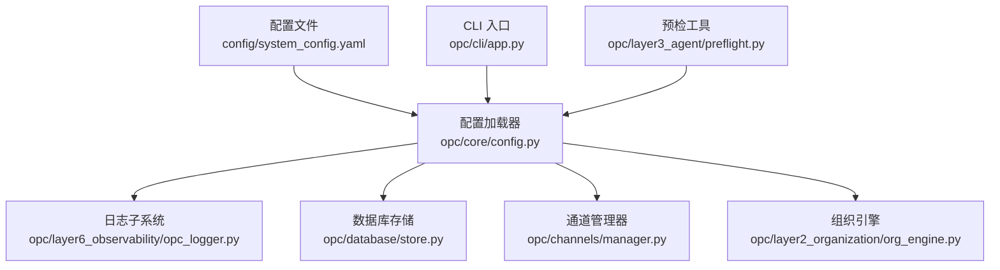
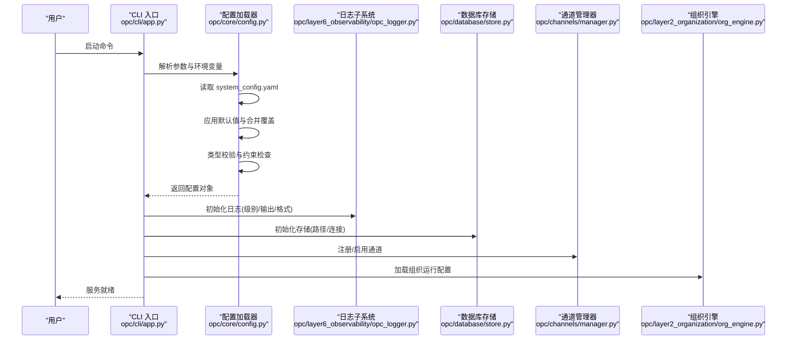
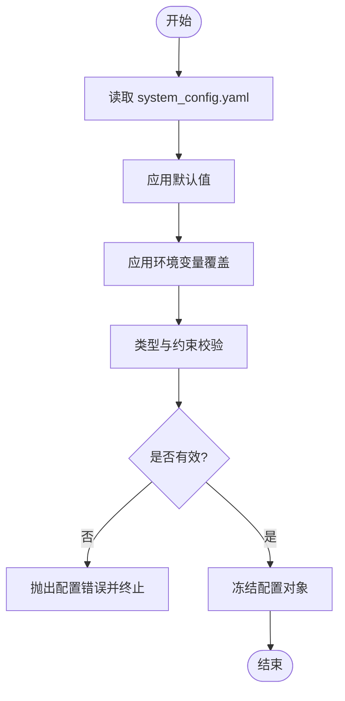
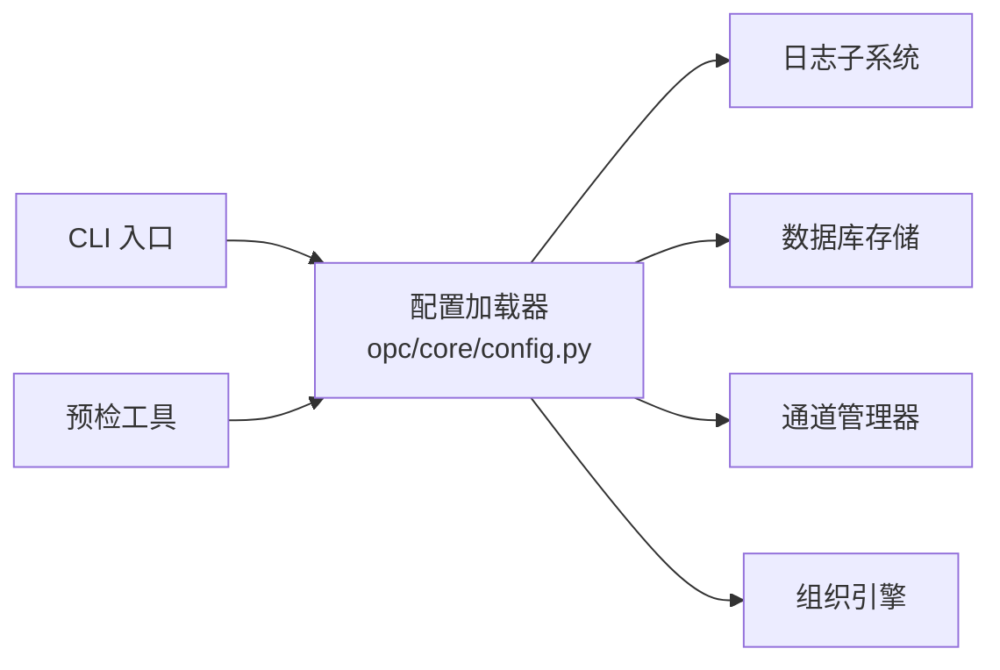

# 系统配置

<cite>
**本文引用的文件**
- [config/system_config.yaml](file://config/system_config.yaml)
- [opc/core/config.py](file://opc/core/config.py)
- [opc/cli/app.py](file://opc/cli/app.py)
- [opc/layer6_observability/opc_logger.py](file://opc/layer6_observability/opc_logger.py)
- [opc/database/store.py](file://opc/database/store.py)
- [opc/channels/manager.py](file://opc/channels/manager.py)
- [opc/layer2_organization/org_engine.py](file://opc/layer2_organization/org_engine.py)
- [opc/layer3_agent/preflight.py](file://opc/layer3_agent/preflight.py)
</cite>

## 目录
1. [简介](#简介)
2. [项目结构](#项目结构)
3. [核心组件](#核心组件)
4. [架构总览](#架构总览)
5. [详细组件分析](#详细组件分析)
6. [依赖关系分析](#依赖关系分析)
7. [性能考虑](#性能考虑)
8. [故障排除指南](#故障排除指南)
9. [结论](#结论)
10. [附录](#附录)

## 简介
本文件为 OpenOPC 的系统级配置提供权威说明，聚焦于 system_config.yaml 的配置项、层次结构与继承机制、环境变量覆盖规则、验证与错误处理策略，以及不同部署环境的最佳实践与模板。文档同时给出关键流程的可视化图示，帮助读者快速理解配置在系统中的加载、合并与生效路径。

## 项目结构
OpenOPC 将系统级配置集中在 config/system_config.yaml，并在运行时由核心配置模块统一加载、校验与注入到各子系统（日志、数据库、通道、组织引擎等）。CLI 入口负责解析命令行参数与环境变量，驱动配置加载流程。

图表来源
- [config/system_config.yaml](file://config/system_config.yaml)
- [opc/core/config.py](file://opc/core/config.py)
- [opc/layer6_observability/opc_logger.py](file://opc/layer6_observability/opc_logger.py)
- [opc/database/store.py](file://opc/database/store.py)
- [opc/channels/manager.py](file://opc/channels/manager.py)
- [opc/layer2_organization/org_engine.py](file://opc/layer2_organization/org_engine.py)
- [opc/cli/app.py](file://opc/cli/app.py)
- [opc/layer3_agent/preflight.py](file://opc/layer3_agent/preflight.py)

章节来源
- [config/system_config.yaml](file://config/system_config.yaml)
- [opc/core/config.py](file://opc/core/config.py)
- [opc/cli/app.py](file://opc/cli/app.py)

## 核心组件
- 配置加载与合并：由核心配置模块负责读取 YAML、应用默认值、合并环境变量覆盖、执行类型校验与约束检查，并输出不可变配置对象供其他模块使用。
- 日志子系统：根据系统配置中的日志级别、输出目标与格式进行初始化。
- 数据库存储：依据配置中的路径或连接信息初始化持久化存储。
- 通道管理器：按配置启用/禁用通道并提供统一的接入点。
- 组织引擎：读取运行模式、会话策略等组织相关配置。
- CLI 入口：解析 --config、--env-file 等参数，支持通过环境变量覆盖配置项。
- 预检工具：启动前对关键配置进行一致性检查与提示。

章节来源
- [opc/core/config.py](file://opc/core/config.py)
- [opc/layer6_observability/opc_logger.py](file://opc/layer6_observability/opc_logger.py)
- [opc/database/store.py](file://opc/database/store.py)
- [opc/channels/manager.py](file://opc/channels/manager.py)
- [opc/layer2_organization/org_engine.py](file://opc/layer2_organization/org_engine.py)
- [opc/cli/app.py](file://opc/cli/app.py)
- [opc/layer3_agent/preflight.py](file://opc/layer3_agent/preflight.py)

## 架构总览
下图展示了从配置加载到子系统使用的端到端流程，包括环境变量覆盖与校验阶段。

图表来源
- [opc/cli/app.py](file://opc/cli/app.py)
- [opc/core/config.py](file://opc/core/config.py)
- [opc/layer6_observability/opc_logger.py](file://opc/layer6_observability/opc_logger.py)
- [opc/database/store.py](file://opc/database/store.py)
- [opc/channels/manager.py](file://opc/channels/manager.py)
- [opc/layer2_organization/org_engine.py](file://opc/layer2_organization/org_engine.py)

## 详细组件分析

### 配置加载与合并流程
- 读取顺序：YAML 基础配置 → 默认值填充 → 环境变量覆盖 → 最终合并结果。
- 覆盖优先级：显式 CLI 参数 > 环境变量 > YAML 顶层键 > 模块内默认值。
- 类型与约束：所有字段均进行类型转换与范围校验；缺失必填项或非法值会抛出明确错误。
- 不可变性：合并后的配置以只读形式暴露，避免运行时被意外修改。

图表来源
- [opc/core/config.py](file://opc/core/config.py)

章节来源
- [opc/core/config.py](file://opc/core/config.py)

### 日志子系统配置
- 关键项：日志级别、输出目标（控制台/文件）、格式化模板、轮转策略等。
- 行为：在系统启动早期初始化，确保后续所有模块均可用结构化日志。
- 建议：生产环境使用较高日志级别并开启文件输出；调试时提高级别并启用彩色输出。

章节来源
- [opc/layer6_observability/opc_logger.py](file://opc/layer6_observability/opc_logger.py)

### 数据库存储配置
- 关键项：存储路径或连接字符串、迁移开关、索引策略等。
- 行为：在配置加载后按需初始化，保证数据目录存在且权限正确。
- 建议：容器化部署时将数据目录挂载到持久卷；定期备份。

章节来源
- [opc/database/store.py](file://opc/database/store.py)

### 通道管理器配置
- 关键项：通道启用开关、认证凭据、重试与超时、限流策略等。
- 行为：按配置动态注册通道实现，提供统一的消息收发接口。
- 建议：多通道场景下合理设置并发与队列大小，避免背压。

章节来源
- [opc/channels/manager.py](file://opc/channels/manager.py)

### 组织引擎配置
- 关键项：运行模式、会话策略、任务编排参数、可见性控制等。
- 行为：在组织生命周期中读取并应用，影响工作项流转与协作策略。
- 建议：灰度发布时逐步切换运行模式，观察指标后再全量。

章节来源
- [opc/layer2_organization/org_engine.py](file://opc/layer2_organization/org_engine.py)

### CLI 入口与环境变量覆盖
- 关键项：--config、--env-file、--log-level、--port 等参数。
- 行为：优先解析 CLI 参数，再加载环境变量覆盖，最后合并 YAML。
- 建议：在 CI/CD 中使用环境变量注入敏感信息，避免写入仓库。

章节来源
- [opc/cli/app.py](file://opc/cli/app.py)

### 预检工具
- 作用：启动前对关键配置进行一致性检查（如端口占用、路径可写、凭据完整性）。
- 行为：发现问题时给出修复建议并中止启动，降低线上风险。

章节来源
- [opc/layer3_agent/preflight.py](file://opc/layer3_agent/preflight.py)

## 依赖关系分析
- 耦合关系：配置加载器为核心枢纽，下游模块仅依赖其提供的只读配置对象，降低耦合度。
- 外部依赖：文件系统（YAML/日志/数据库）、网络（通道）、进程间通信（CLI/预检）。
- 循环依赖：通过分层与接口隔离避免循环引用。

图表来源
- [opc/core/config.py](file://opc/core/config.py)
- [opc/cli/app.py](file://opc/cli/app.py)
- [opc/layer3_agent/preflight.py](file://opc/layer3_agent/preflight.py)
- [opc/layer6_observability/opc_logger.py](file://opc/layer6_observability/opc_logger.py)
- [opc/database/store.py](file://opc/database/store.py)
- [opc/channels/manager.py](file://opc/channels/manager.py)
- [opc/layer2_organization/org_engine.py](file://opc/layer2_organization/org_engine.py)

章节来源
- [opc/core/config.py](file://opc/core/config.py)
- [opc/cli/app.py](file://opc/cli/app.py)
- [opc/layer3_agent/preflight.py](file://opc/layer3_agent/preflight.py)

## 性能考虑
- 配置加载开销：YAML 解析与合并应在启动阶段完成，避免热路径重复计算。
- 日志 I/O：生产环境建议异步落盘与批量写入，减少阻塞。
- 数据库访问：合理设置连接池大小与超时，避免资源耗尽。
- 通道并发：根据后端能力调整并发与队列长度，防止过载。

[本节为通用指导，不直接分析具体文件]

## 故障排除指南
- 常见错误
  - 配置缺失必填项：检查 YAML 与对应环境变量是否完整。
  - 类型不匹配：确认环境变量值的类型与配置定义一致。
  - 路径不可写：确保日志与数据库目录存在且具备写入权限。
  - 端口冲突：更换端口或释放占用进程。
- 定位方法
  - 提升日志级别至 DEBUG，查看配置加载与合并过程。
  - 使用预检工具输出诊断信息，快速定位问题根因。
- 恢复步骤
  - 回滚到上一版本配置快照。
  - 逐项启用环境变量覆盖，缩小变更范围。
  - 重启服务并观察指标与日志。

章节来源
- [opc/layer6_observability/opc_logger.py](file://opc/layer6_observability/opc_logger.py)
- [opc/layer3_agent/preflight.py](file://opc/layer3_agent/preflight.py)

## 结论
OpenOPC 的系统配置以 system_config.yaml 为中心，结合环境变量覆盖与严格校验，形成稳定可靠的配置体系。通过分层加载、只读暴露与预检机制，系统在易用性与安全性之间取得平衡。建议在不同环境中采用最小化差异的配置策略，并通过自动化测试保障配置变更质量。

[本节为总结性内容，不直接分析具体文件]

## 附录

### 配置项参考（system_config.yaml）
以下为常用系统级配置项的说明、默认值与数据类型。请根据实际部署环境进行调整。

- 系统标识
  - 名称：系统名称
    - 含义：用于标识实例的唯一名称
    - 默认值：未设置时使用主机名
    - 数据类型：字符串
  - 名称：环境
    - 含义：运行环境（开发/测试/生产）
    - 默认值：development
    - 数据类型：枚举（development, staging, production）

- 日志
  - 名称：日志级别
    - 含义：全局日志级别
    - 默认值：INFO
    - 数据类型：枚举（DEBUG, INFO, WARNING, ERROR, CRITICAL）
  - 名称：输出目标
    - 含义：日志输出位置（控制台/文件/两者）
    - 默认值：console
    - 数据类型：数组（console, file）
  - 名称：日志路径
    - 含义：当输出目标包含文件时的日志目录
    - 默认值：./logs
    - 数据类型：字符串（绝对或相对路径）
  - 名称：日志格式
    - 含义：日志行格式模板
    - 默认值：标准格式
    - 数据类型：字符串

- 网络与服务
  - 名称：监听端口
    - 含义：HTTP/WS 服务监听端口
    - 默认值：8080
    - 数据类型：整数（1-65535）
  - 名称：绑定地址
    - 含义：服务绑定的 IP 地址
    - 默认值：0.0.0.0
    - 数据类型：字符串（IPv4/IPv6）
  - 名称：最大请求体大小
    - 含义：限制上传文件大小
    - 默认值：10MB
    - 数据类型：人类可读大小（KB/MB/GB）

- 数据库与存储
  - 名称：存储路径
    - 含义：本地数据存储目录
    - 默认值：./data
    - 数据类型：字符串（绝对或相对路径）
  - 名称：迁移开关
    - 含义：启动时自动执行数据迁移
    - 默认值：true
    - 数据类型：布尔
  - 名称：连接池大小
    - 含义：数据库连接池上限
    - 默认值：10
    - 数据类型：整数（>=1）

- 通道与集成
  - 名称：通道启用列表
    - 含义：启用的通道名称集合
    - 默认值：空（需显式启用）
    - 数据类型：数组（字符串）
  - 名称：通道凭据
    - 含义：各通道的认证信息映射
    - 默认值：空
    - 数据类型：对象（键=通道名，值=凭据对象）
  - 名称：重试次数
    - 含义：通道调用失败重试次数
    - 默认值：3
    - 数据类型：整数（>=0）
  - 名称：超时秒数
    - 含义：通道调用超时时间
    - 默认值：30
    - 数据类型：整数（>0）

- 组织与运行
  - 名称：运行模式
    - 含义：组织运行模式（单会话/多会话/公司模式）
    - 默认值：single_session
    - 数据类型：枚举
  - 名称：会话策略
    - 含义：会话创建与回收策略
    - 默认值：默认策略
    - 数据类型：对象
  - 名称：可见性控制
    - 含义：消息与工作项可见性规则
    - 默认值：默认规则
    - 数据类型：对象

- 安全与密钥
  - 名称：密钥来源
    - 含义：密钥获取方式（环境变量/文件/密钥管理服务）
    - 默认值：environment
    - 数据类型：枚举
  - 名称：密钥路径
    - 含义：当密钥来源为文件时的路径
    - 默认值：./secrets
    - 数据类型：字符串

- 扩展与插件
  - 名称：插件目录
    - 含义：自定义插件扫描目录
    - 默认值：./plugins
    - 数据类型：字符串
  - 名称：插件白名单
    - 含义：允许加载的插件名称列表
    - 默认值：空（允许全部）
    - 数据类型：数组（字符串）

章节来源
- [config/system_config.yaml](file://config/system_config.yaml)

### 环境变量覆盖规则
- 命名约定：使用大写下划线分隔的全局键名，例如 LOG_LEVEL、PORT、DATABASE_PATH。
- 覆盖层级：环境变量覆盖 YAML 同级键；嵌套键可通过点号或双下划线表示（取决于加载器实现）。
- 类型转换：环境变量值会被转换为配置定义的类型；若转换失败则报错。
- 敏感信息：建议使用环境变量注入 API Key、Token 等敏感配置，避免写入仓库。

章节来源
- [opc/core/config.py](file://opc/core/config.py)
- [opc/cli/app.py](file://opc/cli/app.py)

### 不同环境的配置示例与最佳实践
- 开发环境
  - 日志级别：DEBUG
  - 输出目标：console
  - 存储路径：./data-dev
  - 端口：8080
  - 通道：仅启用本地模拟通道
  - 建议：关闭迁移锁，启用热重载
- 测试环境
  - 日志级别：INFO
  - 输出目标：console,file
  - 存储路径：/tmp/opc-test
  - 端口：随机分配
  - 通道：启用沙箱通道
  - 建议：每次测试清理数据目录
- 生产环境
  - 日志级别：WARNING
  - 输出目标：file
  - 存储路径：/var/lib/opc/data
  - 端口：8443（HTTPS）
  - 通道：仅启用生产通道
  - 建议：启用健康检查与告警，定期备份数据

[本节为概念性示例，不直接分析具体文件]

### 配置验证规则与错误处理
- 必填项检查：缺失必填项时立即报错并中止启动。
- 类型校验：非预期类型将被拒绝，并返回期望类型提示。
- 范围校验：数值型字段需在合法范围内，否则报错。
- 依赖校验：某些配置项之间存在依赖关系（如启用某通道需提供凭据），不满足时给出修复建议。
- 错误输出：错误信息包含字段路径、期望类型与修复建议，便于快速定位。

章节来源
- [opc/core/config.py](file://opc/core/config.py)
- [opc/layer3_agent/preflight.py](file://opc/layer3_agent/preflight.py)

### 常见配置场景模板
- 单机开发
  - 要点：简化配置，启用本地通道，使用内存或轻量存储
- 微服务集成
  - 要点：集中配置管理，使用密钥管理服务，开启健康检查
- 高可用集群
  - 要点：外部数据库与消息总线，滚动更新，配置中心同步

[本节为概念性模板，不直接分析具体文件]