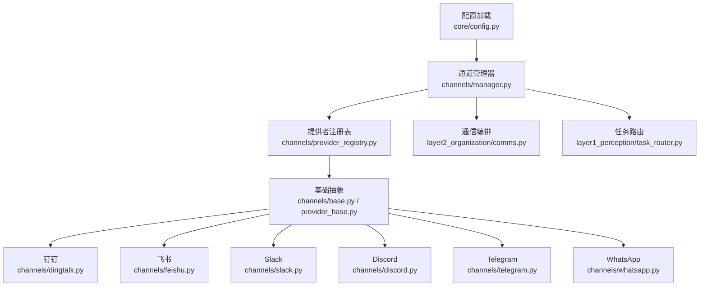
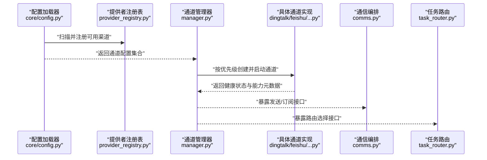
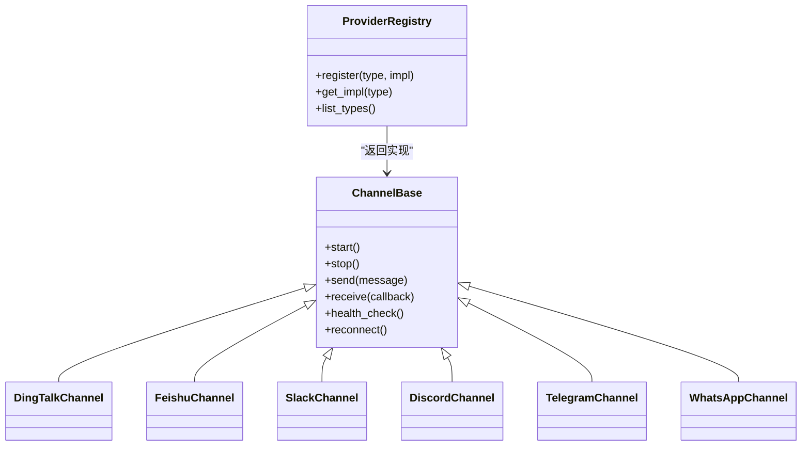
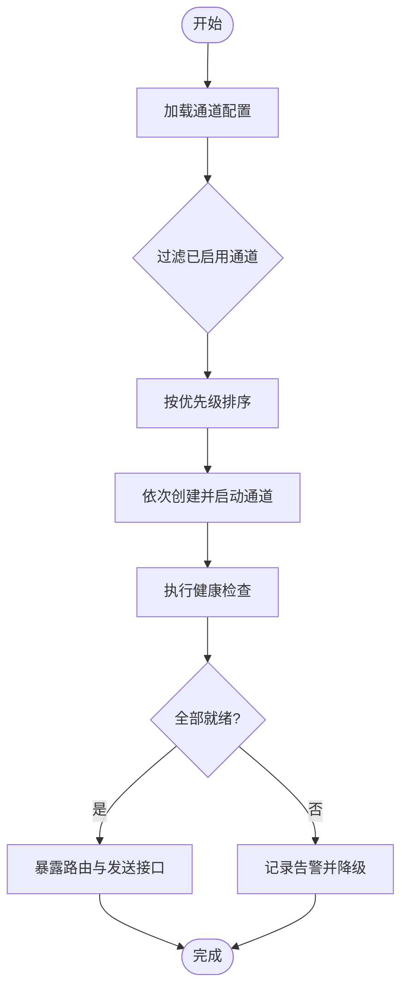
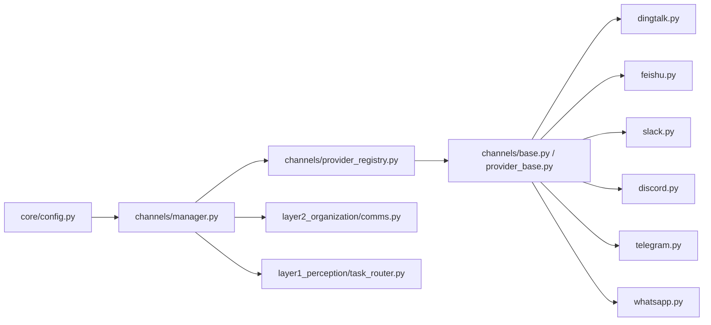

# 通道配置

<cite>
**本文引用的文件**   
- [channel_config.yaml](file://config/channel_config.yaml)
- [channels/__init__.py](file://opc/channels/__init__.py)
- [channels/base.py](file://opc/channels/base.py)
- [channels/manager.py](file://opc/channels/manager.py)
- [channels/provider_base.py](file://opc/channels/provider_base.py)
- [channels/provider_registry.py](file://opc/channels/provider_registry.py)
- [channels/dingtalk.py](file://opc/channels/dingtalk.py)
- [channels/feishu.py](file://opc/channels/feishu.py)
- [channels/slack.py](file://opc/channels/slack.py)
- [channels/discord.py](file://opc/channels/discord.py)
- [channels/telegram.py](file://opc/channels/telegram.py)
- [channels/whatsapp.py](file://opc/channels/whatsapp.py)
- [core/config.py](file://opc/core/config.py)
- [layer1_perception/task_router.py](file://opc/layer1_perception/task_router.py)
- [layer2_organization/comms.py](file://opc/layer2_organization/comms.py)
- [layer2_organization/communication.py](file://opc/layer2_organization/communication.py)
- [tests/test_channels.py](file://tests/test_channels.py)
- [tests/test_channel_runtime_integration.py](file://tests/test_channel_runtime_integration.py)
</cite>

## 目录
1. [简介](#简介)
2. [项目结构](#项目结构)
3. [核心组件](#核心组件)
4. [架构总览](#架构总览)
5. [详细组件分析](#详细组件分析)
6. [依赖关系分析](#依赖关系分析)
7. [性能与可靠性](#性能与可靠性)
8. [故障诊断指南](#故障诊断指南)
9. [结论](#结论)
10. [附录：渠道参数参考](#附录渠道参数参考)

## 简介
本文件面向OpenOPC的“通道（Channel）”子系统，聚焦于通过配置文件 channel_config.yaml 对多种通信渠道进行统一编排。文档将说明：
- 各渠道的配置格式、认证与连接参数
- 通道的启用/禁用机制与优先级策略
- 多渠道同时使用时的路由规则
- 健康检查、重连与错误处理配置
- 如何扩展自定义渠道
- 测试与排障方法

## 项目结构
通道子系统位于 opc/channels 目录，采用“提供者注册 + 管理器调度”的分层设计：
- 基础抽象与生命周期管理：base.py、provider_base.py
- 渠道注册表与运行时管理器：provider_registry.py、manager.py
- 具体渠道实现：dingtalk.py、feishu.py、slack.py、discord.py、telegram.py、whatsapp.py 等
- 配置加载与校验：core/config.py
- 上层集成：comms.py、communication.py、task_router.py
- 配置样例：config/channel_config.yaml
- 测试用例：tests/test_channels.py、tests/test_channel_runtime_integration.py

图表来源
- [core/config.py](file://opc/core/config.py)
- [channels/manager.py](file://opc/channels/manager.py)
- [channels/provider_registry.py](file://opc/channels/provider_registry.py)
- [channels/base.py](file://opc/channels/base.py)
- [channels/provider_base.py](file://opc/channels/provider_base.py)
- [channels/dingtalk.py](file://opc/channels/dingtalk.py)
- [channels/feishu.py](file://opc/channels/feishu.py)
- [channels/slack.py](file://opc/channels/slack.py)
- [channels/discord.py](file://opc/channels/discord.py)
- [channels/telegram.py](file://opc/channels/telegram.py)
- [channels/whatsapp.py](file://opc/channels/whatsapp.py)
- [layer2_organization/comms.py](file://opc/layer2_organization/comms.py)
- [layer1_perception/task_router.py](file://opc/layer1_perception/task_router.py)

章节来源
- [channel_config.yaml](file://config/channel_config.yaml)
- [channels/__init__.py](file://opc/channels/__init__.py)
- [core/config.py](file://opc/core/config.py)

## 核心组件
- 通道抽象与生命周期
  - 提供统一的启动、停止、发送消息、接收事件、健康检查、重连等接口契约。
  - 负责连接建立、心跳保活、断线恢复、错误上报等通用逻辑。
- 提供者注册表
  - 维护已实现的渠道类型到具体实现的映射，支持动态发现与按需实例化。
- 通道管理器
  - 读取并解析 channel_config.yaml，按优先级和启用状态初始化各通道，提供路由与分发能力。
- 配置加载器
  - 负责从 YAML 中加载通道配置，合并默认值，校验必填字段，暴露给管理器使用。

章节来源
- [channels/base.py](file://opc/channels/base.py)
- [channels/provider_base.py](file://opc/channels/provider_base.py)
- [channels/provider_registry.py](file://opc/channels/provider_registry.py)
- [channels/manager.py](file://opc/channels/manager.py)
- [core/config.py](file://opc/core/config.py)

## 架构总览
下图展示了从配置到运行时的关键路径：配置加载 → 通道注册 → 管理器初始化 → 上层编排与路由。

图表来源
- [core/config.py](file://opc/core/config.py)
- [channels/provider_registry.py](file://opc/channels/provider_registry.py)
- [channels/manager.py](file://opc/channels/manager.py)
- [layer2_organization/comms.py](file://opc/layer2_organization/comms.py)
- [layer1_perception/task_router.py](file://opc/layer1_perception/task_router.py)

## 详细组件分析

### 配置模型与加载流程
- 入口文件
  - 配置样例：config/channel_config.yaml
  - 加载与校验：core/config.py
- 典型配置项（概念性说明）
  - 全局开关与默认策略：是否启用通道组、默认重试次数、超时时间、日志级别等
  - 通道列表：每个通道包含 id、type、enabled、priority、credentials、connect、healthcheck、retry 等
  - 路由规则：基于目标平台、群组/频道、用户角色或标签进行分流
- 加载顺序与覆盖
  - 先加载默认配置，再合并 channel_config.yaml；若存在多份配置，按优先级合并
  - 未显式声明的字段使用默认值；缺失必填字段将导致启动失败

章节来源
- [channel_config.yaml](file://config/channel_config.yaml)
- [core/config.py](file://opc/core/config.py)

### 通道抽象与提供者注册
- 抽象基类职责
  - 定义 start/stop/send/receive/health_check/reconnect 等标准接口
  - 封装通用错误处理、指标上报、上下文注入
- 提供者注册表
  - 以 type 为键注册具体实现，避免硬编码分支
  - 支持热插拔：新增渠道只需在注册表中登记即可被管理器发现

图表来源
- [channels/base.py](file://opc/channels/base.py)
- [channels/provider_registry.py](file://opc/channels/provider_registry.py)
- [channels/dingtalk.py](file://opc/channels/dingtalk.py)
- [channels/feishu.py](file://opc/channels/feishu.py)
- [channels/slack.py](file://opc/channels/slack.py)
- [channels/discord.py](file://opc/channels/discord.py)
- [channels/telegram.py](file://opc/channels/telegram.py)
- [channels/whatsapp.py](file://opc/channels/whatsapp.py)

章节来源
- [channels/base.py](file://opc/channels/base.py)
- [channels/provider_base.py](file://opc/channels/provider_base.py)
- [channels/provider_registry.py](file://opc/channels/provider_registry.py)

### 通道管理器与路由
- 初始化流程
  - 读取配置 → 过滤 enabled=false 的通道 → 按 priority 排序 → 逐个创建并启动
- 路由策略
  - 根据目标平台、会话标识、群组/频道、用户角色等维度选择通道
  - 支持主备通道与回退策略
- 编排集成
  - 向 comms.py 暴露统一发送接口
  - 向 task_router.py 暴露路由决策接口

图表来源
- [channels/manager.py](file://opc/channels/manager.py)
- [layer2_organization/comms.py](file://opc/layer2_organization/comms.py)
- [layer1_perception/task_router.py](file://opc/layer1_perception/task_router.py)

章节来源
- [channels/manager.py](file://opc/channels/manager.py)
- [layer2_organization/comms.py](file://opc/layer2_organization/comms.py)
- [layer1_perception/task_router.py](file://opc/layer1_perception/task_router.py)

### 各渠道认证与连接参数（概览）
以下为常见渠道的典型配置要点（仅描述字段类别，不包含具体值）：
- 钉钉
  - 认证：应用 AppKey/AppSecret 或机器人 Token
  - 连接：企业内网代理、回调地址、消息签名验证
  - 能力：群聊/单聊、富文本、附件
- 飞书
  - 认证：App ID/App Secret、Bot Token
  - 连接：事件订阅 URL、权限范围
  - 能力：卡片消息、文件上传
- Slack
  - 认证：Bot Token、Signing Secret
  - 连接：WebSocket/HTTP 长轮询、频道 ID
  - 能力：线程、富媒体
- Discord
  - 认证：Bot Token、Gateway Intents
  - 连接：WebSocket、频道/服务器 ID
  - 能力：嵌入消息、附件
- Telegram
  - 认证：Bot Token
  - 连接：Webhook 或长轮询、群组/私聊 ID
  - 能力：Markdown/HTML 解析、文件
- WhatsApp
  - 认证：Business API Token、Phone Number ID、Message Template ID
  - 连接：HTTPS 回调、Webhook 验证
  - 能力：模板消息、媒体

章节来源
- [channels/dingtalk.py](file://opc/channels/dingtalk.py)
- [channels/feishu.py](file://opc/channels/feishu.py)
- [channels/slack.py](file://opc/channels/slack.py)
- [channels/discord.py](file://opc/channels/discord.py)
- [channels/telegram.py](file://opc/channels/telegram.py)
- [channels/whatsapp.py](file://opc/channels/whatsapp.py)

### 启用/禁用与优先级
- 启用/禁用
  - 通过配置的 enabled 字段控制通道是否参与初始化与路由
- 优先级
  - priority 数值越小优先级越高；相同优先级时按配置顺序或字母序稳定排序
- 回退
  - 当高优先级通道不可用时，自动尝试低优先级通道

章节来源
- [channel_config.yaml](file://config/channel_config.yaml)
- [channels/manager.py](file://opc/channels/manager.py)

### 健康检查、重连与错误处理
- 健康检查
  - 周期性探测通道连通性与鉴权有效性
  - 失败阈值超过上限后标记通道为不健康
- 重连机制
  - 指数退避、最大重试次数、抖动随机化
  - 可配置最小/最大间隔与重试窗口
- 错误处理
  - 分类捕获网络错误、鉴权错误、限流错误
  - 统一上报指标与日志，支持告警回调

章节来源
- [channels/base.py](file://opc/channels/base.py)
- [channels/manager.py](file://opc/channels/manager.py)

### 多渠道同时使用与路由规则
- 场景
  - 同一业务在不同平台并行推送
  - 按受众（部门/角色/租户）分流至不同渠道
- 路由维度
  - 目标平台、群组/频道、用户标识、消息类型、敏感等级
- 策略
  - 首选通道 + 备用通道
  - 广播模式：同时发送至多个通道
  - 条件路由：基于标签或规则表达式匹配

章节来源
- [layer1_perception/task_router.py](file://opc/layer1_perception/task_router.py)
- [layer2_organization/comms.py](file://opc/layer2_organization/comms.py)

### 扩展新渠道的实现步骤
- 新建渠道实现
  - 在 channels 目录下新增 xxx.py，继承通道抽象基类，实现必要接口
- 注册渠道
  - 在提供者注册表中登记 type 与实现类
- 配置接入
  - 在 channel_config.yaml 中添加对应条目，填写认证与连接参数
- 验证与测试
  - 编写单元测试与端到端测试，覆盖启动、发送、健康检查、重连

章节来源
- [channels/provider_registry.py](file://opc/channels/provider_registry.py)
- [channels/base.py](file://opc/channels/base.py)
- [channel_config.yaml](file://config/channel_config.yaml)

## 依赖关系分析
通道子系统内部耦合度较低，主要依赖如下：
- 配置层：core/config.py 提供统一配置视图
- 管理层：channels/manager.py 协调通道生命周期与路由
- 抽象层：channels/base.py 与 provider_base.py 定义契约
- 实现层：各渠道独立实现，互不影响
- 上层集成：comms.py 与 task_router.py 消费通道能力

图表来源
- [core/config.py](file://opc/core/config.py)
- [channels/manager.py](file://opc/channels/manager.py)
- [channels/provider_registry.py](file://opc/channels/provider_registry.py)
- [channels/base.py](file://opc/channels/base.py)
- [channels/provider_base.py](file://opc/channels/provider_base.py)
- [channels/dingtalk.py](file://opc/channels/dingtalk.py)
- [channels/feishu.py](file://opc/channels/feishu.py)
- [channels/slack.py](file://opc/channels/slack.py)
- [channels/discord.py](file://opc/channels/discord.py)
- [channels/telegram.py](file://opc/channels/telegram.py)
- [channels/whatsapp.py](file://opc/channels/whatsapp.py)
- [layer2_organization/comms.py](file://opc/layer2_organization/comms.py)
- [layer1_perception/task_router.py](file://opc/layer1_perception/task_router.py)

章节来源
- [channels/__init__.py](file://opc/channels/__init__.py)

## 性能与可靠性
- 并发与隔离
  - 各通道独立进程/线程池，避免相互阻塞
- 背压与限流
  - 针对上游速率限制进行自适应降速与队列缓冲
- 资源控制
  - 连接池大小、超时、重试预算、内存占用上限
- 可观测性
  - 指标：发送成功率、延迟、重连次数、错误分布
  - 日志：结构化日志，包含通道标识、消息摘要、错误码

[本节为通用指导，无需代码引用]

## 故障诊断指南
- 快速自检
  - 确认 channel_config.yaml 语法正确且必填字段完整
  - 检查 enabled 与 priority 是否符合预期
  - 核对各渠道认证凭据与网络可达性
- 定位问题
  - 查看通道健康检查结果与最近错误堆栈
  - 观察重连日志与退避行为
  - 使用测试工具模拟发送与接收，验证端到端链路
- 常用命令与用例
  - 运行通道相关测试套件，覆盖基本收发与健康检查
  - 使用集成测试脚本验证多通道路由与回退

章节来源
- [tests/test_channels.py](file://tests/test_channels.py)
- [tests/test_channel_runtime_integration.py](file://tests/test_channel_runtime_integration.py)

## 结论
通过统一的通道抽象、注册表与管理器，OpenOPC 实现了多渠道的可插拔接入与灵活路由。借助 channel_config.yaml 的集中配置，系统可在保证可靠性的前提下，快速扩展新的通信渠道，并满足复杂的多渠道协同需求。

## 附录：渠道参数参考
以下为各渠道在配置中常见的参数类别（用于对照实际实现与文档）：
- 通用参数
  - id：通道唯一标识
  - type：渠道类型（如 dingtalk、feishu、slack、discord、telegram、whatsapp）
  - enabled：是否启用
  - priority：优先级（数值越小越优先）
  - timeout：请求/连接超时
  - retry：重试策略（次数、间隔、退避）
  - healthcheck：健康检查周期与阈值
- 认证参数
  - token/bot_token/app_key/app_secret/signing_secret 等
- 连接参数
  - webhook_url、gateway_url、proxy、region、intent/permissions 等
- 路由参数
  - target_platform、target_channel/group_id、user_roles/tags、fallback_channels

章节来源
- [channel_config.yaml](file://config/channel_config.yaml)
- [channels/dingtalk.py](file://opc/channels/dingtalk.py)
- [channels/feishu.py](file://opc/channels/feishu.py)
- [channels/slack.py](file://opc/channels/slack.py)
- [channels/discord.py](file://opc/channels/discord.py)
- [channels/telegram.py](file://opc/channels/telegram.py)
- [channels/whatsapp.py](file://opc/channels/whatsapp.py)