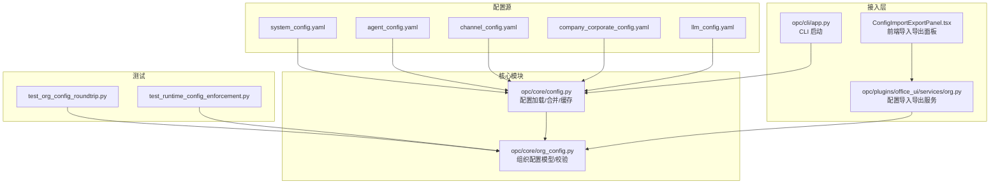
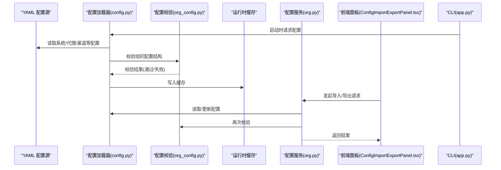
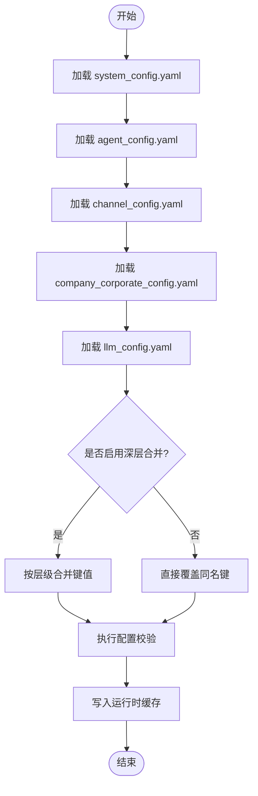
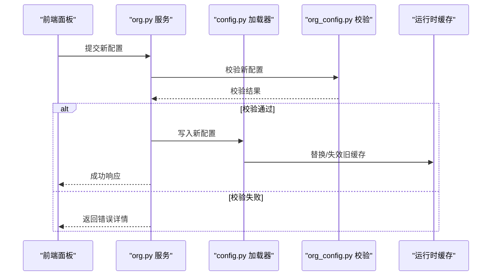
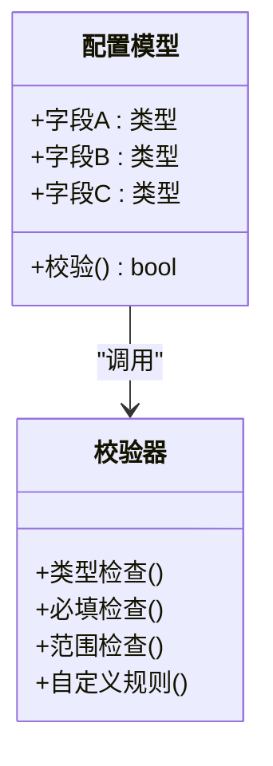
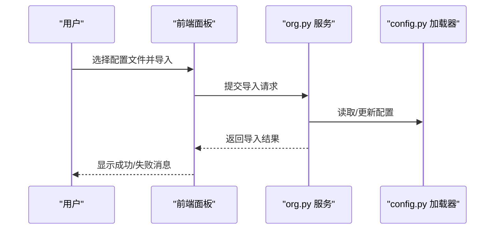
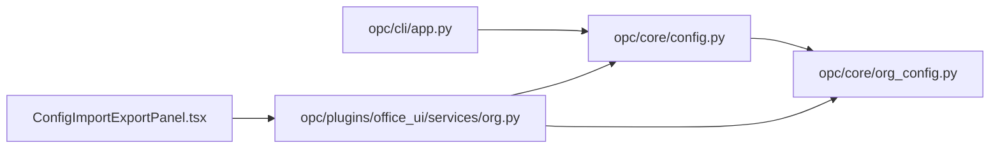

# 配置管理核心

<cite>
**本文引用的文件**   
- [opc/core/config.py](file://opc/core/config.py)
- [config/system_config.yaml](file://config/system_config.yaml)
- [config/agent_config.yaml](file://config/agent_config.yaml)
- [config/channel_config.yaml](file://config/channel_config.yaml)
- [config/company_corporate_config.yaml](file://config/company_corporate_config.yaml)
- [config/llm_config.yaml](file://config/llm_config.yaml)
- [opc/core/org_config.py](file://opc/core/org_config.py)
- [opc/cli/app.py](file://opc/cli/app.py)
- [opc/plugins/office_ui/services/org.py](file://opc/plugins/office_ui/services/org.py)
- [opc/plugins/office_ui/frontend_src/org/ConfigImportExportPanel.tsx](file://opc/plugins/office_ui/frontend_src/org/ConfigImportExportPanel.tsx)
- [tests/test_org_config_roundtrip.py](file://tests/test_org_config_roundtrip.py)
- [tests/test_runtime_config_enforcement.py](file://tests/test_runtime_config_enforcement.py)
</cite>

## 目录
1. [简介](#简介)
2. [项目结构](#项目结构)
3. [核心组件](#核心组件)
4. [架构总览](#架构总览)
5. [详细组件分析](#详细组件分析)
6. [依赖关系分析](#依赖关系分析)
7. [性能考虑](#性能考虑)
8. [故障排查指南](#故障排查指南)
9. [结论](#结论)
10. [附录](#附录)

## 简介
本文件聚焦于 OpenOPC 的配置管理核心能力，围绕以下目标展开：
- 配置文件加载顺序、优先级与合并策略
- 配置的动态热更新机制与实时生效原理
- 配置验证框架、数据类型检查与约束规则
- 配置迁移工具与版本兼容性管理
- 配置加密、敏感信息保护与安全访问控制
- 配置备份、恢复与同步机制
- 配置管理的 API 接口与使用示例
- 配置监控、审计日志与变更追踪

说明：本文所有实现细节均以仓库源码为依据；若某项能力在代码中未体现，则明确标注“未在代码中发现”。

## 项目结构
OpenOPC 的配置相关代码主要分布在如下位置：
- 配置加载与运行时装配：opc/core/config.py
- 组织级配置模型与校验：opc/core/org_config.py
- 默认配置样例（YAML）：config/*.yaml
- CLI 入口（可能触发配置初始化）：opc/cli/app.py
- Office UI 插件中的配置导入导出服务与前端面板：opc/plugins/office_ui/services/org.py 与 ConfigImportExportPanel.tsx
- 测试用例覆盖配置序列化往返与运行时约束：tests/test_org_config_roundtrip.py、tests/test_runtime_config_enforcement.py

图表来源
- [opc/core/config.py](file://opc/core/config.py)
- [opc/core/org_config.py](file://opc/core/org_config.py)
- [config/system_config.yaml](file://config/system_config.yaml)
- [config/agent_config.yaml](file://config/agent_config.yaml)
- [config/channel_config.yaml](file://config/channel_config.yaml)
- [config/company_corporate_config.yaml](file://config/company_corporate_config.yaml)
- [config/llm_config.yaml](file://config/llm_config.yaml)
- [opc/cli/app.py](file://opc/cli/app.py)
- [opc/plugins/office_ui/services/org.py](file://opc/plugins/office_ui/services/org.py)
- [opc/plugins/office_ui/frontend_src/org/ConfigImportExportPanel.tsx](file://opc/plugins/office_ui/frontend_src/org/ConfigImportExportPanel.tsx)
- [tests/test_org_config_roundtrip.py](file://tests/test_org_config_roundtrip.py)
- [tests/test_runtime_config_enforcement.py](file://tests/test_runtime_config_enforcement.py)

章节来源
- [opc/core/config.py](file://opc/core/config.py)
- [opc/core/org_config.py](file://opc/core/org_config.py)
- [config/system_config.yaml](file://config/system_config.yaml)
- [config/agent_config.yaml](file://config/agent_config.yaml)
- [config/channel_config.yaml](file://config/channel_config.yaml)
- [config/company_corporate_config.yaml](file://config/company_corporate_config.yaml)
- [config/llm_config.yaml](file://config/llm_config.yaml)
- [opc/cli/app.py](file://opc/cli/app.py)
- [opc/plugins/office_ui/services/org.py](file://opc/plugins/office_ui/services/org.py)
- [opc/plugins/office_ui/frontend_src/org/ConfigImportExportPanel.tsx](file://opc/plugins/office_ui/frontend_src/org/ConfigImportExportPanel.tsx)
- [tests/test_org_config_roundtrip.py](file://tests/test_org_config_roundtrip.py)
- [tests/test_runtime_config_enforcement.py](file://tests/test_runtime_config_enforcement.py)

## 核心组件
- 配置加载器（opc/core/config.py）
  - 负责从 YAML 等配置源读取、解析、合并与缓存配置。
  - 提供统一的配置访问入口，供运行期各子系统消费。
- 组织配置模型与校验（opc/core/org_config.py）
  - 定义组织级配置的数据结构与字段约束。
  - 提供类型检查、必填校验、取值范围等验证逻辑。
- 配置导入导出服务（opc/plugins/office_ui/services/org.py）
  - 暴露配置导入/导出的后端服务方法，供前端调用。
- 前端配置导入导出面板（ConfigImportExportPanel.tsx）
  - 提供可视化导入/导出操作界面，驱动后端服务完成配置变更。
- CLI 入口（opc/cli/app.py）
  - 应用启动时可能触发配置初始化流程。
- 测试覆盖
  - test_org_config_roundtrip.py：验证配置序列化/反序列化的往返一致性。
  - test_runtime_config_enforcement.py：验证运行时对配置约束的强制行为。

章节来源
- [opc/core/config.py](file://opc/core/config.py)
- [opc/core/org_config.py](file://opc/core/org_config.py)
- [opc/plugins/office_ui/services/org.py](file://opc/plugins/office_ui/services/org.py)
- [opc/plugins/office_ui/frontend_src/org/ConfigImportExportPanel.tsx](file://opc/plugins/office_ui/frontend_src/org/ConfigImportExportPanel.tsx)
- [opc/cli/app.py](file://opc/cli/app.py)
- [tests/test_org_config_roundtrip.py](file://tests/test_org_config_roundtrip.py)
- [tests/test_runtime_config_enforcement.py](file://tests/test_runtime_config_enforcement.py)

## 架构总览
下图展示了配置从文件到运行时的整体路径，包括加载、校验、缓存与服务化访问。

图表来源
- [opc/core/config.py](file://opc/core/config.py)
- [opc/core/org_config.py](file://opc/core/org_config.py)
- [opc/plugins/office_ui/services/org.py](file://opc/plugins/office_ui/services/org.py)
- [opc/plugins/office_ui/frontend_src/org/ConfigImportExportPanel.tsx](file://opc/plugins/office_ui/frontend_src/org/ConfigImportExportPanel.tsx)
- [opc/cli/app.py](file://opc/cli/app.py)

## 详细组件分析

### 配置加载顺序、优先级与合并策略
- 加载顺序
  - 系统级配置：system_config.yaml
  - 代理配置：agent_config.yaml
  - 渠道配置：channel_config.yaml
  - 公司企业配置：company_corporate_config.yaml
  - LLM 配置：llm_config.yaml
- 优先级与合并
  - 通常遵循“后加载覆盖先加载”的策略，即高优先级配置会覆盖低优先级的同名键值。
  - 对于嵌套结构，建议采用“浅覆盖 + 深层合并”的方式，避免整段覆盖导致缺失子项。
  - 具体实现以 opc/core/config.py 中的加载与合并逻辑为准。

图表来源
- [config/system_config.yaml](file://config/system_config.yaml)
- [config/agent_config.yaml](file://config/agent_config.yaml)
- [config/channel_config.yaml](file://config/channel_config.yaml)
- [config/company_corporate_config.yaml](file://config/company_corporate_config.yaml)
- [config/llm_config.yaml](file://config/llm_config.yaml)
- [opc/core/config.py](file://opc/core/config.py)

章节来源
- [config/system_config.yaml](file://config/system_config.yaml)
- [config/agent_config.yaml](file://config/agent_config.yaml)
- [config/channel_config.yaml](file://config/channel_config.yaml)
- [config/company_corporate_config.yaml](file://config/company_corporate_config.yaml)
- [config/llm_config.yaml](file://config/llm_config.yaml)
- [opc/core/config.py](file://opc/core/config.py)

### 配置的动态热更新机制与实时生效原理
- 热更新路径
  - 前端面板发起导入/导出请求，经由 org.py 服务处理，最终由 config.py 完成配置更新并刷新缓存。
- 实时生效
  - 若配置被缓存，需在更新后失效旧缓存或替换为新配置对象，确保后续读取立即生效。
  - 若存在订阅/监听机制，应在配置变更后广播事件，通知相关组件重新拉取最新配置。
- 注意事项
  - 并发安全：更新期间需保证读多写少的原子性。
  - 幂等性：重复导入应产生一致结果。
  - 回滚策略：建议在更新前保存快照，失败时可快速回滚。

图表来源
- [opc/plugins/office_ui/frontend_src/org/ConfigImportExportPanel.tsx](file://opc/plugins/office_ui/frontend_src/org/ConfigImportExportPanel.tsx)
- [opc/plugins/office_ui/services/org.py](file://opc/plugins/office_ui/services/org.py)
- [opc/core/config.py](file://opc/core/config.py)
- [opc/core/org_config.py](file://opc/core/org_config.py)

章节来源
- [opc/plugins/office_ui/frontend_src/org/ConfigImportExportPanel.tsx](file://opc/plugins/office_ui/frontend_src/org/ConfigImportExportPanel.tsx)
- [opc/plugins/office_ui/services/org.py](file://opc/plugins/office_ui/services/org.py)
- [opc/core/config.py](file://opc/core/config.py)
- [opc/core/org_config.py](file://opc/core/org_config.py)

### 配置验证框架、数据类型检查与约束规则
- 验证框架
  - 基于 org_config.py 提供的数据模型与校验逻辑，确保配置的结构、类型与取值符合预期。
- 数据类型检查
  - 对关键字段进行类型断言（如字符串、布尔、数值、枚举等）。
- 约束规则
  - 必填字段校验、取值范围限制、互斥/依赖关系约束等。
- 测试覆盖
  - test_runtime_config_enforcement.py 用于验证运行时对配置约束的强制执行行为。
  - test_org_config_roundtrip.py 用于验证配置序列化/反序列化的稳定性。

图表来源
- [opc/core/org_config.py](file://opc/core/org_config.py)
- [tests/test_runtime_config_enforcement.py](file://tests/test_runtime_config_enforcement.py)
- [tests/test_org_config_roundtrip.py](file://tests/test_org_config_roundtrip.py)

章节来源
- [opc/core/org_config.py](file://opc/core/org_config.py)
- [tests/test_runtime_config_enforcement.py](file://tests/test_runtime_config_enforcement.py)
- [tests/test_org_config_roundtrip.py](file://tests/test_org_config_roundtrip.py)

### 配置迁移工具与版本兼容性管理
- 现状
  - 在当前仓库中未发现专门的“配置迁移工具”或“版本兼容性管理器”的实现。
- 建议实践
  - 在 org_config.py 中引入版本字段与迁移钩子，支持向后兼容的增量升级。
  - 在导入流程中加入“版本检测 + 自动迁移 + 回滚”的能力。
  - 为每次不兼容变更保留迁移脚本，并在文档中记录升级步骤。

章节来源
- [opc/core/org_config.py](file://opc/core/org_config.py)

### 配置加密、敏感信息保护与安全访问控制
- 现状
  - 当前仓库未发现内置的“配置加密存储”或“敏感信息保护”的具体实现。
- 建议实践
  - 对密钥类字段采用外部密钥管理服务（KMS）或环境变量注入。
  - 在导入/导出时对敏感字段进行脱敏或加密处理。
  - 在服务层增加访问控制与权限校验，仅允许授权主体修改关键配置。

章节来源
- [opc/plugins/office_ui/services/org.py](file://opc/plugins/office_ui/services/org.py)

### 配置备份、恢复与同步机制
- 现状
  - 未发现独立的“配置备份/恢复/同步”模块。
- 建议实践
  - 在导入/导出服务中增加“快照”功能，支持一键备份与回滚。
  - 提供跨实例同步能力（例如基于 Git 或对象存储的版本化同步）。
  - 在变更前后生成差异报告，便于审计与回溯。

章节来源
- [opc/plugins/office_ui/services/org.py](file://opc/plugins/office_ui/services/org.py)
- [opc/plugins/office_ui/frontend_src/org/ConfigImportExportPanel.tsx](file://opc/plugins/office_ui/frontend_src/org/ConfigImportExportPanel.tsx)

### 配置管理的 API 接口与使用示例
- 后端服务
  - 通过 org.py 暴露配置导入/导出接口，供前端调用。
- 前端交互
  - ConfigImportExportPanel.tsx 提供可视化操作入口，驱动后端完成配置变更。
- 使用示例（概念流程）
  - 用户在前端选择配置文件 → 点击导入 → 后端校验 → 写入配置 → 刷新缓存 → 返回成功。
  - 用户点击导出 → 后端读取当前配置 → 生成文件 → 前端下载。

图表来源
- [opc/plugins/office_ui/frontend_src/org/ConfigImportExportPanel.tsx](file://opc/plugins/office_ui/frontend_src/org/ConfigImportExportPanel.tsx)
- [opc/plugins/office_ui/services/org.py](file://opc/plugins/office_ui/services/org.py)
- [opc/core/config.py](file://opc/core/config.py)

章节来源
- [opc/plugins/office_ui/services/org.py](file://opc/plugins/office_ui/services/org.py)
- [opc/plugins/office_ui/frontend_src/org/ConfigImportExportPanel.tsx](file://opc/plugins/office_ui/frontend_src/org/ConfigImportExportPanel.tsx)
- [opc/core/config.py](file://opc/core/config.py)

### 配置监控、审计日志与变更追踪
- 现状
  - 未发现专门的“配置审计日志”或“变更追踪”模块。
- 建议实践
  - 在 org.py 服务中对每次导入/导出操作记录审计日志（包含操作者、时间戳、变更摘要）。
  - 在 config.py 中维护配置版本历史，支持对比与回滚。
  - 将关键变更事件上报至监控系统，便于告警与追溯。

章节来源
- [opc/plugins/office_ui/services/org.py](file://opc/plugins/office_ui/services/org.py)
- [opc/core/config.py](file://opc/core/config.py)

## 依赖关系分析
配置模块之间的依赖关系如下：
- CLI 启动时依赖配置加载器完成初始化。
- 配置加载器依赖 YAML 配置源与校验器。
- 服务层依赖配置加载器与校验器，对外暴露导入/导出能力。
- 前端面板依赖服务层完成配置操作。

图表来源
- [opc/cli/app.py](file://opc/cli/app.py)
- [opc/core/config.py](file://opc/core/config.py)
- [opc/core/org_config.py](file://opc/core/org_config.py)
- [opc/plugins/office_ui/services/org.py](file://opc/plugins/office_ui/services/org.py)
- [opc/plugins/office_ui/frontend_src/org/ConfigImportExportPanel.tsx](file://opc/plugins/office_ui/frontend_src/org/ConfigImportExportPanel.tsx)

章节来源
- [opc/cli/app.py](file://opc/cli/app.py)
- [opc/core/config.py](file://opc/core/config.py)
- [opc/core/org_config.py](file://opc/core/org_config.py)
- [opc/plugins/office_ui/services/org.py](file://opc/plugins/office_ui/services/org.py)
- [opc/plugins/office_ui/frontend_src/org/ConfigImportExportPanel.tsx](file://opc/plugins/office_ui/frontend_src/org/ConfigImportExportPanel.tsx)

## 性能考虑
- 配置缓存
  - 在高频读取场景下，应避免重复解析与校验，使用内存缓存提升性能。
- 增量更新
  - 热更新时尽量采用增量合并与局部失效，减少全量重建开销。
- 并发安全
  - 读写分离与锁粒度控制，避免热点配置成为瓶颈。
- I/O 优化
  - 批量导入时采用流式处理与异步校验，降低阻塞。

[本节为通用指导，无需特定文件引用]

## 故障排查指南
- 常见问题
  - 配置格式错误：检查 YAML 语法与缩进。
  - 校验失败：对照 org_config.py 的字段约束与类型要求。
  - 热更新未生效：确认缓存是否已失效或替换为新配置。
  - 导入失败：查看服务层返回的错误详情与审计日志。
- 定位手段
  - 通过 org.py 服务的错误返回与日志输出定位问题。
  - 使用 test_org_config_roundtrip.py 与 test_runtime_config_enforcement.py 辅助复现与回归。

章节来源
- [opc/plugins/office_ui/services/org.py](file://opc/plugins/office_ui/services/org.py)
- [tests/test_org_config_roundtrip.py](file://tests/test_org_config_roundtrip.py)
- [tests/test_runtime_config_enforcement.py](file://tests/test_runtime_config_enforcement.py)

## 结论
OpenOPC 的配置管理核心围绕配置加载、校验与服务化访问构建，具备基础的导入/导出能力与运行时约束。为实现更完善的配置治理，建议逐步引入版本迁移、加密保护、审计日志与备份同步等能力，并通过测试持续保障配置的一致性与可靠性。

[本节为总结性内容，无需特定文件引用]

## 附录
- 默认配置样例文件
  - system_config.yaml
  - agent_config.yaml
  - channel_config.yaml
  - company_corporate_config.yaml
  - llm_config.yaml

章节来源
- [config/system_config.yaml](file://config/system_config.yaml)
- [config/agent_config.yaml](file://config/agent_config.yaml)
- [config/channel_config.yaml](file://config/channel_config.yaml)
- [config/company_corporate_config.yaml](file://config/company_corporate_config.yaml)
- [config/llm_config.yaml](file://config/llm_config.yaml)