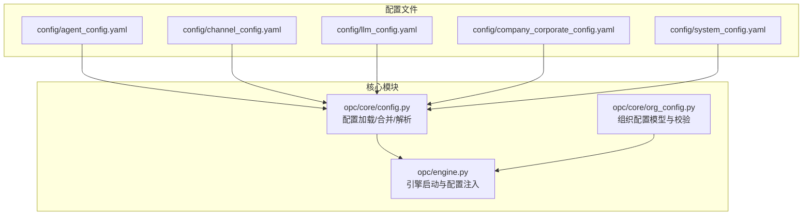
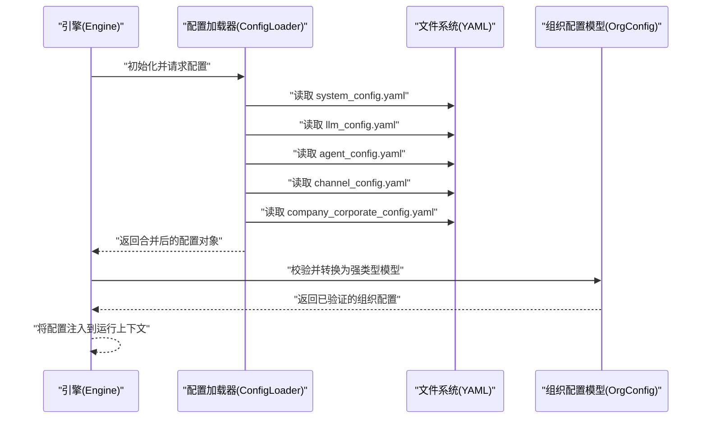
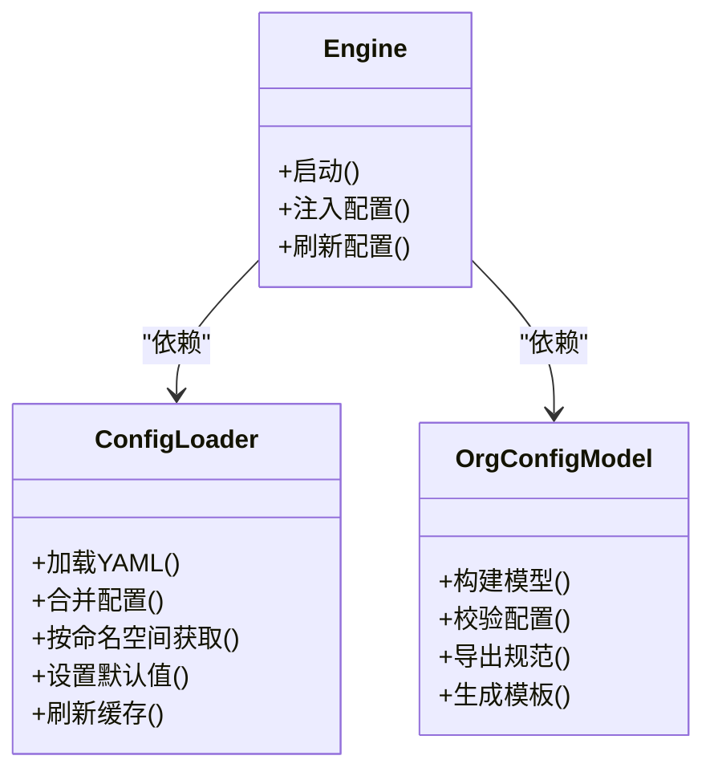

# 配置系统

<cite>
**本文引用的文件**   
- [config.py](file://opc/core/config.py)
- [agent_config.yaml](file://config/agent_config.yaml)
- [channel_config.yaml](file://config/channel_config.yaml)
- [company_corporate_config.yaml](file://config/company_corporate_config.yaml)
- [llm_config.yaml](file://config/llm_config.yaml)
- [system_config.yaml](file://config/system_config.yaml)
- [org_config.py](file://opc/core/org_config.py)
- [engine.py](file://opc/engine.py)
</cite>

## 目录
1. [简介](#简介)
2. [项目结构](#项目结构)
3. [核心组件](#核心组件)
4. [架构总览](#架构总览)
5. [详细组件分析](#详细组件分析)
6. [依赖关系分析](#依赖关系分析)
7. [性能考虑](#性能考虑)
8. [故障排除指南](#故障排除指南)
9. [结论](#结论)
10. [附录](#附录)

## 简介
本文件面向OpenOPC的配置系统，系统化说明配置文件的层次结构与优先级规则、各配置项含义与默认值、动态加载与热更新机制、环境变量集成方式、配置验证与错误处理、调试工具使用，以及常见场景示例与排障建议。目标是帮助用户正确理解并高效配置系统的各个方面。

## 项目结构
OpenOPC将配置分为“应用级配置”和“组织级配置”两类：
- 应用级配置：位于 config/ 目录下的 YAML 文件，涵盖代理、通道、LLM、公司企业模式与系统运行参数等。
- 组织级配置：由 opc/core/org_config.py 提供模型与校验能力，用于描述组织运行时所需的结构化配置（如角色、权限、策略等）。

图表来源
- [config.py:1-200](file://opc/core/config.py#L1-L200)
- [org_config.py:1-200](file://opc/core/org_config.py#L1-L200)
- [engine.py:1-200](file://opc/engine.py#L1-L200)

章节来源
- [config.py:1-200](file://opc/core/config.py#L1-L200)
- [org_config.py:1-200](file://opc/core/org_config.py#L1-L200)
- [engine.py:1-200](file://opc/engine.py#L1-L200)

## 核心组件
- 配置加载器（opc/core/config.py）
  - 负责读取YAML配置、合并多源配置、解析为内部数据结构、暴露统一访问接口。
  - 支持按环境或命名空间选择不同配置片段，并提供默认值回退。
- 组织配置模型（opc/core/org_config.py）
  - 定义组织运行时所需的数据模型、字段约束与校验逻辑。
  - 提供从原始配置到强类型模型的转换与验证入口。
- 引擎集成（opc/engine.py）
  - 在启动阶段加载应用级配置与组织配置，完成初始化与注入。
  - 对外暴露配置查询API，供上层模块按需获取。

章节来源
- [config.py:1-200](file://opc/core/config.py#L1-L200)
- [org_config.py:1-200](file://opc/core/org_config.py#L1-L200)
- [engine.py:1-200](file://opc/engine.py#L1-L200)

## 架构总览
下图展示了配置从文件到运行时的整体流程：引擎启动时调用配置加载器，依次读取多个YAML文件并按优先级合并；随后通过组织配置模型进行校验与转换；最终将有效配置注入到引擎上下文，供各子系统消费。

图表来源
- [engine.py:1-200](file://opc/engine.py#L1-L200)
- [config.py:1-200](file://opc/core/config.py#L1-L200)
- [org_config.py:1-200](file://opc/core/org_config.py#L1-L200)

## 详细组件分析

### 配置加载器（opc/core/config.py）
- 职责
  - 读取并解析YAML配置，支持多文件合并与覆盖。
  - 提供按命名空间/环境选择配置的接口。
  - 维护默认值字典，确保缺失键有合理回退。
- 关键行为
  - 加载顺序：通常先加载基础配置，再加载特定环境或特性配置，后者覆盖前者。
  - 合并策略：深合并（Deep Merge），对嵌套字典递归合并，列表以追加或替换策略为准（具体以实现为准）。
  - 变量插值：支持从环境变量注入占位符，便于敏感信息与环境差异化管理。
- 典型接口
  - 加载单个文件、批量加载、按命名空间获取、设置默认值、刷新缓存等。

章节来源
- [config.py:1-200](file://opc/core/config.py#L1-L200)

### 组织配置模型（opc/core/org_config.py）
- 职责
  - 定义组织运行时所需的配置模型（如角色、权限、策略、工作项生命周期等）。
  - 提供字段约束、必填校验、枚举校验与自定义校验钩子。
- 关键行为
  - 从原始配置映射到强类型模型，失败时给出明确的错误定位。
  - 支持增量更新与版本兼容检查。
- 典型接口
  - 构建模型实例、校验配置、导出规范、生成模板等。

章节来源
- [org_config.py:1-200](file://opc/core/org_config.py#L1-L200)

### 引擎集成（opc/engine.py）
- 职责
  - 在启动阶段协调配置加载与组织配置校验。
  - 将配置注入到全局上下文，供通道、代理、LLM等子系统消费。
- 关键行为
  - 启动前预检：检查必要配置是否存在且合法。
  - 运行时可刷新：支持在安全边界内重新加载部分配置（见“动态加载与热更新”）。

章节来源
- [engine.py:1-200](file://opc/engine.py#L1-L200)

### 配置文件清单与用途
- system_config.yaml
  - 系统级运行参数（日志级别、端口、超时、并发度等）。
- llm_config.yaml
  - LLM提供商、模型、密钥、重试与速率限制等。
- agent_config.yaml
  - 代理适配器、工具集、会话策略等。
- channel_config.yaml
  - 消息通道（钉钉、飞书、Slack等）连接与路由策略。
- company_corporate_config.yaml
  - 公司企业模式相关策略（审批、协作、数据访问等）。

章节来源
- [system_config.yaml](file://config/system_config.yaml)
- [llm_config.yaml](file://config/llm_config.yaml)
- [agent_config.yaml](file://config/agent_config.yaml)
- [channel_config.yaml](file://config/channel_config.yaml)
- [company_corporate_config.yaml](file://config/company_corporate_config.yaml)

## 依赖关系分析
配置系统与引擎及组织配置模型之间的依赖如下：

图表来源
- [config.py:1-200](file://opc/core/config.py#L1-L200)
- [org_config.py:1-200](file://opc/core/org_config.py#L1-L200)
- [engine.py:1-200](file://opc/engine.py#L1-L200)

章节来源
- [config.py:1-200](file://opc/core/config.py#L1-L200)
- [org_config.py:1-200](file://opc/core/org_config.py#L1-L200)
- [engine.py:1-200](file://opc/engine.py#L1-L200)

## 性能考虑
- 配置缓存：避免重复I/O与解析开销，建议在进程内缓存配置结果。
- 增量合并：仅对变更的命名空间或文件执行合并，减少CPU消耗。
- 懒加载：对大型配置块采用按需加载，降低启动时间。
- 校验批量化：将多次校验合并为一次，减少异常抛出与回溯成本。

[本节为通用指导，不直接分析具体文件]

## 故障排除指南
- 常见问题
  - 缺少必需配置项：检查对应YAML是否包含必填字段，确认默认值未覆盖预期。
  - 类型不匹配：确认字段类型与模型定义一致（字符串、整数、布尔、枚举等）。
  - 环境变量未生效：检查占位符语法与变量名大小写，确认进程环境中存在该变量。
  - 合并冲突：确认后加载的配置是否意外覆盖了重要默认值。
- 定位方法
  - 启用更详细的日志输出，查看配置加载与合并过程。
  - 使用组织配置模型的校验报告，快速定位错误字段与原因。
  - 对比模板与当前配置差异，逐步缩小问题范围。

章节来源
- [org_config.py:1-200](file://opc/core/org_config.py#L1-L200)
- [config.py:1-200](file://opc/core/config.py#L1-L200)

## 结论
OpenOPC的配置系统通过分层YAML文件与强类型组织配置模型相结合，提供了清晰、可扩展且可验证的配置能力。配合环境变量与合理的合并策略，既能满足多环境部署需求，也能保障运行时的一致性与稳定性。遵循本文的最佳实践与排障建议，可显著提升配置效率与可靠性。

[本节为总结性内容，不直接分析具体文件]

## 附录

### 配置层次结构与优先级规则
- 层次结构
  - 系统级：system_config.yaml
  - 领域级：llm_config.yaml、agent_config.yaml、channel_config.yaml
  - 企业级：company_corporate_config.yaml
- 优先级规则
  - 后加载覆盖先加载：通常顺序为系统级→领域级→企业级。
  - 命名空间优先：同一层级中，特定命名空间的配置优先于通用配置。
  - 环境变量最高：通过占位符注入的环境变量可覆盖所有文件配置。

章节来源
- [config.py:1-200](file://opc/core/config.py#L1-L200)

### 配置选项含义、默认值与使用场景
- 系统级（system_config.yaml）
  - 日志级别：控制输出详细程度，开发环境建议更详细。
  - 网络端口：服务监听端口，需避免与已有服务冲突。
  - 超时与并发：根据资源与SLA调整，避免过载或响应过慢。
- LLM级（llm_config.yaml）
  - 提供商与模型：选择目标大模型与版本。
  - 密钥与端点：通过环境变量注入，避免硬编码。
  - 重试与限流：提高鲁棒性，防止突发流量导致失败。
- 代理级（agent_config.yaml）
  - 适配器与工具：按需启用，减少攻击面与资源占用。
  - 会话策略：控制上下文窗口与压缩策略。
- 通道级（channel_config.yaml）
  - 连接参数：认证、地址、队列等。
  - 路由策略：按用户、标签或内容进行分发。
- 企业级（company_corporate_config.yaml）
  - 审批与协作：定义跨部门协作流程与权限。
  - 数据访问策略：控制敏感数据的可见性与审计。

章节来源
- [system_config.yaml](file://config/system_config.yaml)
- [llm_config.yaml](file://config/llm_config.yaml)
- [agent_config.yaml](file://config/agent_config.yaml)
- [channel_config.yaml](file://config/channel_config.yaml)
- [company_corporate_config.yaml](file://config/company_corporate_config.yaml)

### 动态加载与热更新机制
- 设计要点
  - 配置缓存：进程内缓存配置快照，避免频繁I/O。
  - 增量刷新：仅对变更的文件或命名空间执行合并与校验。
  - 原子切换：新配置校验通过后，原子替换旧配置，保证一致性。
- 触发方式
  - 外部信号：通过管理接口或CLI命令触发刷新。
  - 文件监控：监听配置文件变更事件，自动触发刷新。
- 安全边界
  - 只允许刷新受控的配置域，避免影响正在运行的关键状态。
  - 保留回滚能力，当新配置导致异常时可快速恢复。

章节来源
- [config.py:1-200](file://opc/core/config.py#L1-L200)
- [engine.py:1-200](file://opc/engine.py#L1-L200)

### 环境变量与配置文件集成
- 占位符语法：在YAML中使用占位符引用环境变量。
- 注入时机：在配置加载阶段解析占位符，若变量不存在则报错或回退默认值。
- 最佳实践：敏感信息一律通过环境变量注入，避免写入仓库。

章节来源
- [config.py:1-200](file://opc/core/config.py#L1-L200)

### 配置验证、错误处理与调试工具
- 验证
  - 使用组织配置模型进行强类型校验，捕获类型、必填与枚举错误。
  - 提供校验报告，包含错误位置与建议修复。
- 错误处理
  - 明确区分致命错误与非致命警告，决定是否阻断启动。
  - 记录详细上下文，便于定位问题。
- 调试工具
  - 打印合并后的最终配置快照。
  - 显示占位符解析结果与来源。
  - 提供配置差异对比功能。

章节来源
- [org_config.py:1-200](file://opc/core/org_config.py#L1-L200)
- [config.py:1-200](file://opc/core/config.py#L1-L200)

### 配置文件模板与最佳实践
- 模板
  - 基于组织配置模型生成最小可用模板，标注必填字段与可选字段。
  - 提供各层级的示例文件，便于快速上手。
- 最佳实践
  - 分文件拆分关注点，保持单一职责。
  - 使用命名空间隔离不同环境或租户的配置。
  - 通过环境变量管理敏感信息与差异化参数。
  - 在CI中引入配置校验步骤，提前发现错误。

章节来源
- [org_config.py:1-200](file://opc/core/org_config.py#L1-L200)
- [config.py:1-200](file://opc/core/config.py#L1-L200)

### 常见配置场景示例
- 多环境部署
  - 使用命名空间区分dev/staging/prod，后加载覆盖前加载。
- 多通道接入
  - 在通道配置中声明多个通道实例，按路由策略分发。
- 多LLM提供商
  - 在LLM配置中定义多个提供商，按任务类型选择。
- 企业协作策略
  - 在企业配置中定义审批链与数据访问白名单。

章节来源
- [channel_config.yaml](file://config/channel_config.yaml)
- [llm_config.yaml](file://config/llm_config.yaml)
- [company_corporate_config.yaml](file://config/company_corporate_config.yaml)

### 故障排除指导
- 启动失败
  - 检查系统级配置中的端口占用与网络可达性。
  - 核对LLM密钥与端点是否正确注入。
- 通道不可用
  - 验证通道连接参数与认证信息。
  - 检查防火墙与代理设置。
- 代理无响应
  - 确认代理适配器与工具集已正确启用。
  - 查看会话策略是否限制了上下文长度。

章节来源
- [system_config.yaml](file://config/system_config.yaml)
- [llm_config.yaml](file://config/llm_config.yaml)
- [channel_config.yaml](file://config/channel_config.yaml)
- [agent_config.yaml](file://config/agent_config.yaml)