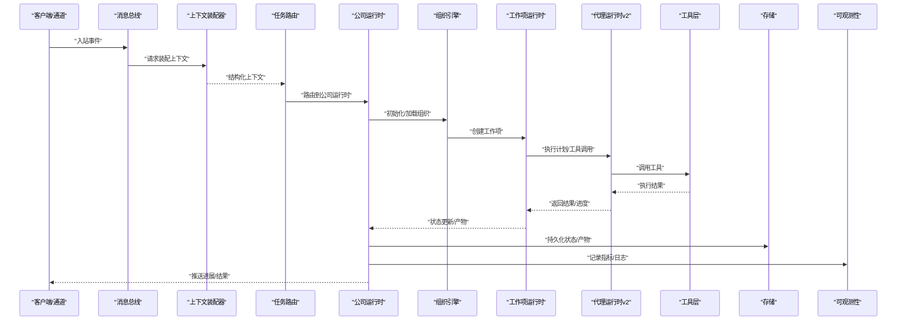
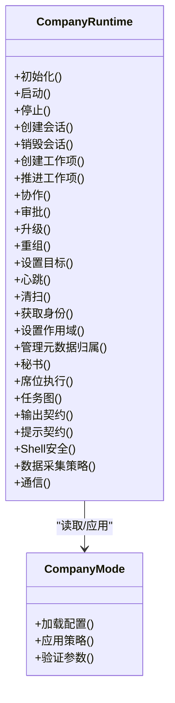
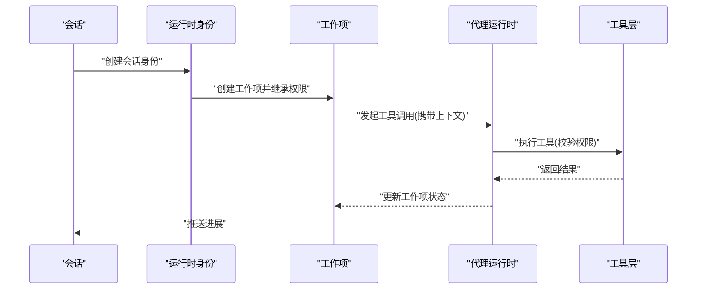
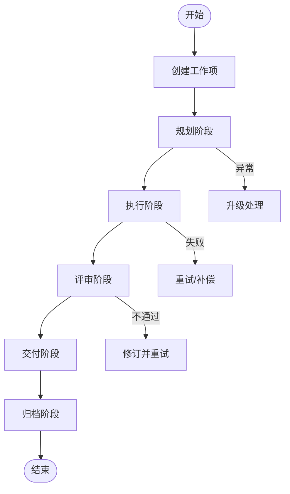
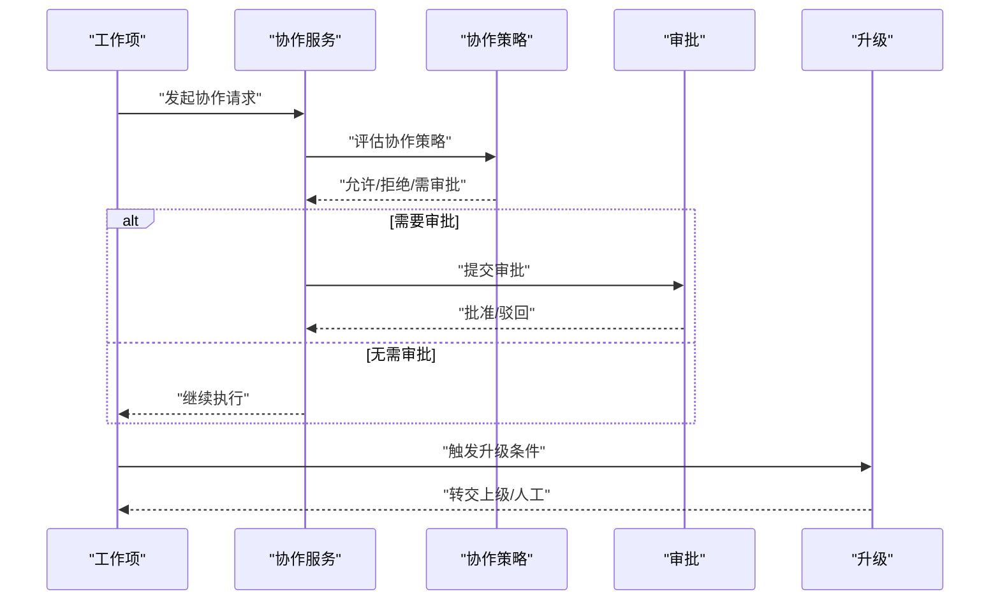
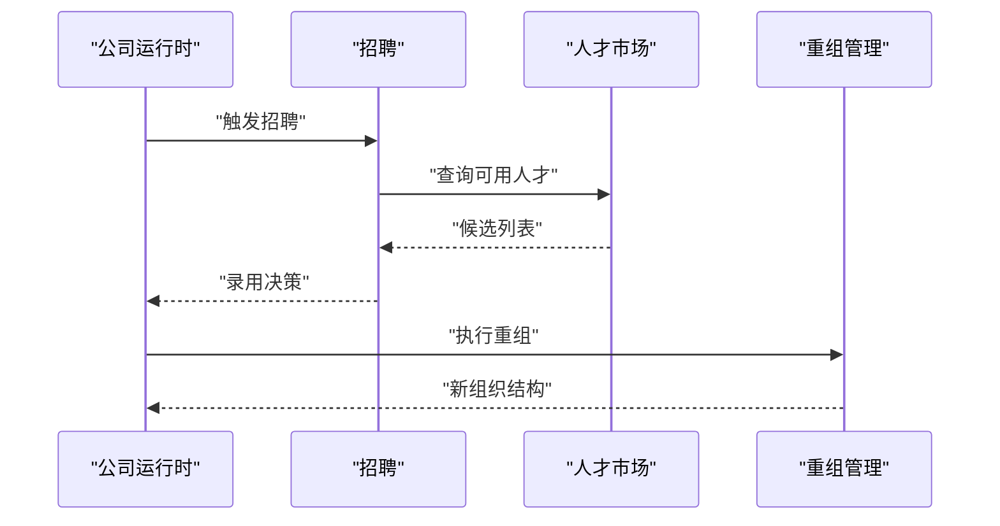
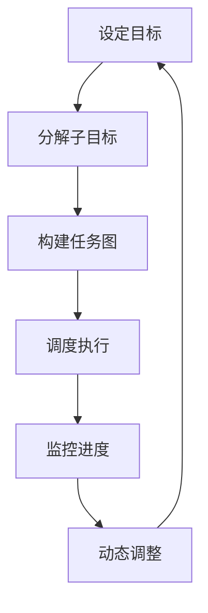
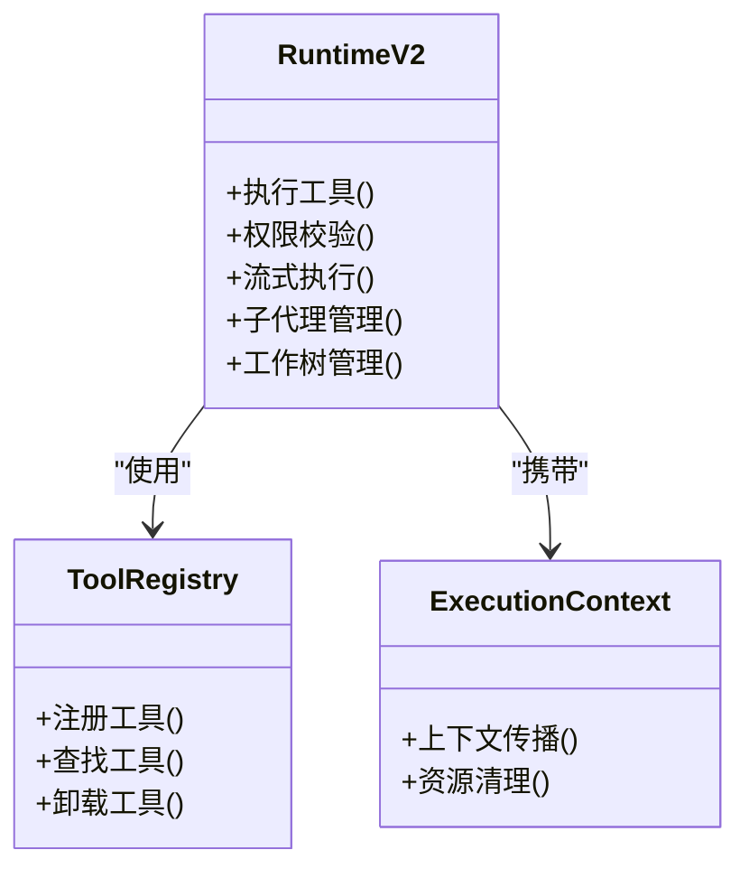
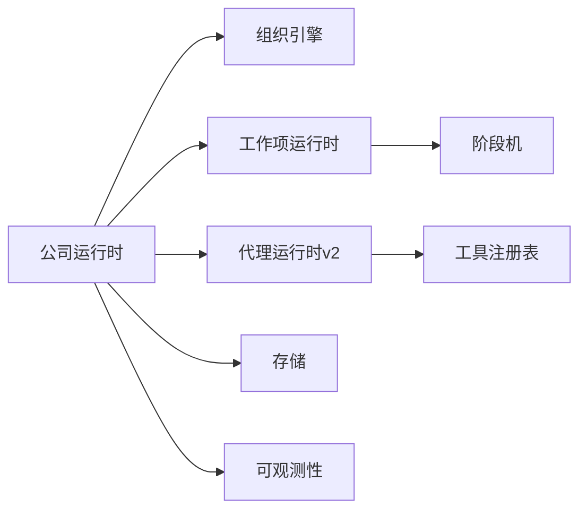

# 公司运行时

<cite>
**本文引用的文件**   
- [engine.py](file://opc/engine.py)
- [company_runtime.py](file://opc/layer2_organization/company_runtime.py)
- [company_runtime_identity.py](file://opc/layer2_organization/company_runtime_identity.py)
- [company_mode.py](file://opc/layer2_organization/company_mode.py)
- [org_engine.py](file://opc/layer2_organization/org_engine.py)
- [work_item_runtime.py](file://opc/layer2_organization/work_item_runtime.py)
- [work_item_transition.py](file://opc/layer2_organization/work_item_transition.py)
- [phase.py](file://opc/layer2_organization/phase.py)
- [phase_hooks.py](file://opc/layer2_organization/phase_hooks.py)
- [collaboration_service.py](file://opc/layer2_organization/collaboration_service.py)
- [collaboration_policy.py](file://opc/layer2_organization/collaboration_policy.py)
- [approval.py](file://opc/layer2_organization/approval.py)
- [escalation.py](file://opc/layer2_organization/escalation.py)
- [recruiter.py](file://opc/layer2_organization/recruiter.py)
- [talent_market.py](file://opc/layer2_organization/talent_market.py)
- [reorg_manager.py](file://opc/layer2_organization/reorg_manager.py)
- [goal_manager.py](file://opc/layer2_organization/goal_manager.py)
- [heartbeat.py](file://opc/layer2_organization/heartbeat.py)
- [reactivation_sweeper.py](file://opc/layer2_organization/reactivation_sweeper.py)
- [session_scoping.py](file://opc/layer2_organization/session_scoping.py)
- [metadata_ownership.py](file://opc/layer2_organization/metadata_ownership.py)
- [secretary.py](file://opc/layer2_organization/secretary.py)
- [seat_executor.py](file://opc/layer2_organization/seat_executor.py)
- [task_graph.py](file://opc/layer2_organization/task_graph.py)
- [output_contract.py](file://opc/layer2_organization/output_contract.py)
- [prompt_contract.py](file://opc/layer2_organization/prompt_contract.py)
- [shell_safety.py](file://opc/layer2_organization/shell_safety.py)
- [data_acquisition_policy.py](file://opc/layer2_organization/data_acquisition_policy.py)
- [comms.py](file://opc/layer2_organization/comms.py)
- [communication.py](file://opc/layer2_organization/communication.py)
- [context_assembler.py](file://opc/layer1_perception/context_assembler.py)
- [context_loader.py](file://opc/layer1_perception/context_loader.py)
- [task_router.py](file://opc/layer1_perception/task_router.py)
- [message_bus.py](file://opc/layer0_interaction/message_bus.py)
- [agent_runtime.py](file://opc/layer4_tools/agent_runtime.py)
- [execution_context.py](file://opc/layer4_tools/execution_context.py)
- [registry.py](file://opc/layer4_tools/registry.py)
- [runtime.py](file://opc/layer3_agent/runtime_v2/runtime.py)
- [permissions.py](file://opc/layer3_agent/runtime_v2/permissions.py)
- [tool_hooks.py](file://opc/layer3_agent/runtime_v2/tool_hooks.py)
- [streaming_tool_executor.py](file://opc/layer3_agent/runtime_v2/streaming_tool_executor.py)
- [subagents.py](file://opc/layer3_agent/runtime_v2/subagents.py)
- [worktree.py](file://opc/layer3_agent/runtime_v2/worktree.py)
- [company_runtime_contract.py](file://opc/layer3_agent/company_runtime_contract.py)
- [external_session_identity.py](file://opc/layer3_agent/external_session_identity.py)
- [native_agent.py](file://opc/layer3_agent/native_agent.py)
- [preflight.py](file://opc/layer3_agent/preflight.py)
- [skill_installer.py](file://opc/layer3_agent/skill_installer.py)
- [config.py](file://opc/core/config.py)
- [org_config.py](file://opc/core/org_config.py)
- [employee_registry.py](file://opc/core/employee_registry.py)
- [active_task_runs.py](file://opc/core/active_task_runs.py)
- [attachment_store.py](file://opc/core/attachment_store.py)
- [transcript_visibility.py](file://opc/core/transcript_visibility.py)
- [windows_ssl.py](file://opc/core/windows_ssl.py)
- [worker_envelope.py](file://opc/core/worker_envelope.py)
- [store.py](file://opc/database/store.py)
- [cost_tracker.py](file://opc/layer6_observability/cost_tracker.py)
- [opc_logger.py](file://opc/layer6_observability/opc_logger.py)
- [provider.py](file://opc/llm/provider.py)
- [retry.py](file://opc/llm/retry.py)
- [channel_config.yaml](file://config/channel_config.yaml)
- [company_corporate_config.yaml](file://config/company_corporate_config.yaml)
- [system_config.yaml](file://config/system_config.yaml)
- [agent_config.yaml](file://config/agent_config.yaml)
- [llm_config.yaml](file://config/llm_config.yaml)
</cite>

## 目录
1. [简介](#简介)
2. [项目结构](#项目结构)
3. [核心组件](#核心组件)
4. [架构总览](#架构总览)
5. [详细组件分析](#详细组件分析)
6. [依赖关系分析](#依赖关系分析)
7. [性能考虑](#性能考虑)
8. [故障排查指南](#故障排查指南)
9. [结论](#结论)
10. [附录](#附录)

## 简介
本技术文档面向“公司运行时”子系统，聚焦于公司模式下的运行时初始化、生命周期管理、状态同步机制、身份与权限模型、配置体系、扩展点与插件集成、可观测性与错误恢复策略，以及与代理层、工具层的交互接口和数据流转。文档旨在帮助开发者快速理解系统架构与关键流程，并为二次开发与运维提供权威参考。

## 项目结构
公司运行时位于分层架构的中间组织层（layer2_organization），向上对接感知层（layer1_perception）与交互层（layer0_interaction），向下通过工具层（layer4_tools）和记忆层（layer5_memory）完成执行与持久化，同时受可观测性层（layer6_observability）监控。

```mermaid
graph TB
subgraph "交互层"
MB["消息总线<br/>message_bus.py"]
end
subgraph "感知层"
CA["上下文装配器<br/>context_assembler.py"]
CL["上下文加载器<br/>context_loader.py"]
TR["任务路由<br/>task_router.py"]
end
subgraph "组织层公司运行时"
CR["公司运行时<br/>company_runtime.py"]
CRI["运行时身份<br/>company_runtime_identity.py"]
CM["公司模式<br/>company_mode.py"]
OE["组织引擎<br/>org_engine.py"]
WIR["工作项运行时<br/>work_item_runtime.py"]
WT["工作项转换<br/>work_item_transition.py"]
PH["阶段机<br/>phase.py"]
PHH["阶段钩子<br/>phase_hooks.py"]
CS["协作服务<br/>collaboration_service.py"]
CP["协作策略<br/>collaboration_policy.py"]
APP["审批<br/>approval.py"]
ESC["升级<br/>escalation.py"]
REC["招聘<br/>recruiter.py"]
TM["人才市场<br/>talent_market.py"]
REORG["重组管理<br/>reorg_manager.py"]
GOAL["目标管理<br/>goal_manager.py"]
HB["心跳<br/>heartbeat.py"]
RSW["唤醒清扫<br/>reactivation_sweeper.py"]
SS["会话作用域<br/>session_scoping.py"]
MO["元数据归属<br/>metadata_ownership.py"]
SEC["秘书<br/>secretary.py"]
SEAT["席位执行器<br/>seat_executor.py"]
TG["任务图<br/>task_graph.py"]
OC["输出契约<br/>output_contract.py"]
PC["提示契约<br/>prompt_contract.py"]
SH["Shell安全<br/>shell_safety.py"]
DAP["数据采集策略<br/>data_acquisition_policy.py"]
COMMS["通信<br/>comms.py / communication.py"]
end
subgraph "代理层"
AR["代理运行时v2<br/>runtime.py"]
PERM["权限<br/>permissions.py"]
TH["工具钩子<br/>tool_hooks.py"]
STE["流式工具执行器<br/>streaming_tool_executor.py"]
SUB["子代理<br/>subagents.py"]
WTREE["工作树<br/>worktree.py"]
CRC["公司运行时契约<br/>company_runtime_contract.py"]
ESI["外部会话身份<br/>external_session_identity.py"]
NA["原生代理<br/>native_agent.py"]
PF["预检<br/>preflight.py"]
SI["技能安装器<br/>skill_installer.py"]
end
subgraph "工具层"
ART["代理运行时工具<br/>agent_runtime.py"]
ECX["执行上下文<br/>execution_context.py"]
REG["工具注册表<br/>registry.py"]
end
subgraph "存储与可观测性"
DB["数据库存储<br/>store.py"]
CT["成本追踪<br/>cost_tracker.py"]
LOG["日志<br/>opc_logger.py"]
end
MB --> CA
CA --> TR
TR --> CR
CR --> OE
OE --> WIR
WIR --> WT
WT --> PH
PH --> PHH
CR --> CS
CS --> CP
CS --> APP
CS --> ESC
CR --> REC
REC --> TM
CR --> REORG
CR --> GOAL
CR --> HB
CR --> RSW
CR --> SS
CR --> MO
CR --> SEC
CR --> SEAT
CR --> TG
CR --> OC
CR --> PC
CR --> SH
CR --> DAP
CR --> COMMS
CR --> AR
AR --> PERM
AR --> TH
AR --> STE
AR --> SUB
AR --> WTREE
CR --> CRC
CR --> ESI
CR --> NA
CR --> PF
CR --> SI
AR --> ART
ART --> ECX
ART --> REG
CR --> DB
CR --> CT
CR --> LOG
```

图表来源
- [message_bus.py](file://opc/layer0_interaction/message_bus.py)
- [context_assembler.py](file://opc/layer1_perception/context_assembler.py)
- [context_loader.py](file://opc/layer1_perception/context_loader.py)
- [task_router.py](file://opc/layer1_perception/task_router.py)
- [company_runtime.py](file://opc/layer2_organization/company_runtime.py)
- [company_runtime_identity.py](file://opc/layer2_organization/company_runtime_identity.py)
- [company_mode.py](file://opc/layer2_organization/company_mode.py)
- [org_engine.py](file://opc/layer2_organization/org_engine.py)
- [work_item_runtime.py](file://opc/layer2_organization/work_item_runtime.py)
- [work_item_transition.py](file://opc/layer2_organization/work_item_transition.py)
- [phase.py](file://opc/layer2_organization/phase.py)
- [phase_hooks.py](file://opc/layer2_organization/phase_hooks.py)
- [collaboration_service.py](file://opc/layer2_organization/collaboration_service.py)
- [collaboration_policy.py](file://opc/layer2_organization/collaboration_policy.py)
- [approval.py](file://opc/layer2_organization/approval.py)
- [escalation.py](file://opc/layer2_organization/escalation.py)
- [recruiter.py](file://opc/layer2_organization/recruiter.py)
- [talent_market.py](file://opc/layer2_organization/talent_market.py)
- [reorg_manager.py](file://opc/layer2_organization/reorg_manager.py)
- [goal_manager.py](file://opc/layer2_organization/goal_manager.py)
- [heartbeat.py](file://opc/layer2_organization/heartbeat.py)
- [reactivation_sweeper.py](file://opc/layer2_organization/reactivation_sweeper.py)
- [session_scoping.py](file://opc/layer2_organization/session_scoping.py)
- [metadata_ownership.py](file://opc/layer2_organization/metadata_ownership.py)
- [secretary.py](file://opc/layer2_organization/secretary.py)
- [seat_executor.py](file://opc/layer2_organization/seat_executor.py)
- [task_graph.py](file://opc/layer2_organization/task_graph.py)
- [output_contract.py](file://opc/layer2_organization/output_contract.py)
- [prompt_contract.py](file://opc/layer2_organization/prompt_contract.py)
- [shell_safety.py](file://opc/layer2_organization/shell_safety.py)
- [data_acquisition_policy.py](file://opc/layer2_organization/data_acquisition_policy.py)
- [comms.py](file://opc/layer2_organization/comms.py)
- [communication.py](file://opc/layer2_organization/communication.py)
- [runtime.py](file://opc/layer3_agent/runtime_v2/runtime.py)
- [permissions.py](file://opc/layer3_agent/runtime_v2/permissions.py)
- [tool_hooks.py](file://opc/layer3_agent/runtime_v2/tool_hooks.py)
- [streaming_tool_executor.py](file://opc/layer3_agent/runtime_v2/streaming_tool_executor.py)
- [subagents.py](file://opc/layer3_agent/runtime_v2/subagents.py)
- [worktree.py](file://opc/layer3_agent/runtime_v2/worktree.py)
- [company_runtime_contract.py](file://opc/layer3_agent/company_runtime_contract.py)
- [external_session_identity.py](file://opc/layer3_agent/external_session_identity.py)
- [native_agent.py](file://opc/layer3_agent/native_agent.py)
- [preflight.py](file://opc/layer3_agent/preflight.py)
- [skill_installer.py](file://opc/layer3_agent/skill_installer.py)
- [agent_runtime.py](file://opc/layer4_tools/agent_runtime.py)
- [execution_context.py](file://opc/layer4_tools/execution_context.py)
- [registry.py](file://opc/layer4_tools/registry.py)
- [store.py](file://opc/database/store.py)
- [cost_tracker.py](file://opc/layer6_observability/cost_tracker.py)
- [opc_logger.py](file://opc/layer6_observability/opc_logger.py)

章节来源
- [engine.py](file://opc/engine.py)
- [company_runtime.py](file://opc/layer2_organization/company_runtime.py)
- [org_engine.py](file://opc/layer2_organization/org_engine.py)
- [message_bus.py](file://opc/layer0_interaction/message_bus.py)
- [context_assembler.py](file://opc/layer1_perception/context_assembler.py)
- [task_router.py](file://opc/layer1_perception/task_router.py)
- [runtime.py](file://opc/layer3_agent/runtime_v2/runtime.py)
- [agent_runtime.py](file://opc/layer4_tools/agent_runtime.py)
- [store.py](file://opc/database/store.py)
- [opc_logger.py](file://opc/layer6_observability/opc_logger.py)
- [cost_tracker.py](file://opc/layer6_observability/cost_tracker.py)

## 核心组件
- 公司运行时：负责启动、编排、协调组织内各子系统，维护会话与作用域、工作项生命周期、协作与审批、升级与重组等。
- 运行时身份：为会话与工作项建立身份标识，支撑权限继承与上下文传递。
- 公司模式：定义公司模式的配置选项与行为控制参数，驱动组织结构与运行策略。
- 组织引擎与工作项运行时：将业务目标拆解为工作项，管理其状态机与转换。
- 阶段机与阶段钩子：抽象通用阶段（如规划、执行、评审、交付），并提供可扩展钩子。
- 协作与审批：跨角色协作、变更审批、升级处理。
- 招聘与人才市场：按需招募与替换员工，动态调整组织结构。
- 重组与目标管理：支持组织结构调整与目标对齐。
- 心跳与唤醒清扫：保障长时运行的健康检查与资源回收。
- 会话作用域与元数据归属：隔离会话上下文并明确数据所有权。
- 秘书与席位执行器：统一对外交互与席位级执行控制。
- 任务图：可视化与调度复杂任务依赖。
- 输出与提示契约：约束产出格式与提示组装规范。
- Shell安全与数据采集策略：限制危险操作与采集范围。
- 通信模块：内部事件与消息分发。
- 代理运行时v2：承载工具执行、权限校验、流式执行、子代理与工作树管理。
- 工具层：统一的工具注册与执行上下文。
- 可观测性：日志、成本追踪与指标上报。

章节来源
- [company_runtime.py](file://opc/layer2_organization/company_runtime.py)
- [company_runtime_identity.py](file://opc/layer2_organization/company_runtime_identity.py)
- [company_mode.py](file://opc/layer2_organization/company_mode.py)
- [org_engine.py](file://opc/layer2_organization/org_engine.py)
- [work_item_runtime.py](file://opc/layer2_organization/work_item_runtime.py)
- [work_item_transition.py](file://opc/layer2_organization/work_item_transition.py)
- [phase.py](file://opc/layer2_organization/phase.py)
- [phase_hooks.py](file://opc/layer2_organization/phase_hooks.py)
- [collaboration_service.py](file://opc/layer2_organization/collaboration_service.py)
- [collaboration_policy.py](file://opc/layer2_organization/collaboration_policy.py)
- [approval.py](file://opc/layer2_organization/approval.py)
- [escalation.py](file://opc/layer2_organization/escalation.py)
- [recruiter.py](file://opc/layer2_organization/recruiter.py)
- [talent_market.py](file://opc/layer2_organization/talent_market.py)
- [reorg_manager.py](file://opc/layer2_organization/reorg_manager.py)
- [goal_manager.py](file://opc/layer2_organization/goal_manager.py)
- [heartbeat.py](file://opc/layer2_organization/heartbeat.py)
- [reactivation_sweeper.py](file://opc/layer2_organization/reactivation_sweeper.py)
- [session_scoping.py](file://opc/layer2_organization/session_scoping.py)
- [metadata_ownership.py](file://opc/layer2_organization/metadata_ownership.py)
- [secretary.py](file://opc/layer2_organization/secretary.py)
- [seat_executor.py](file://opc/layer2_organization/seat_executor.py)
- [task_graph.py](file://opc/layer2_organization/task_graph.py)
- [output_contract.py](file://opc/layer2_organization/output_contract.py)
- [prompt_contract.py](file://opc/layer2_organization/prompt_contract.py)
- [shell_safety.py](file://opc/layer2_organization/shell_safety.py)
- [data_acquisition_policy.py](file://opc/layer2_organization/data_acquisition_policy.py)
- [comms.py](file://opc/layer2_organization/comms.py)
- [communication.py](file://opc/layer2_organization/communication.py)
- [runtime.py](file://opc/layer3_agent/runtime_v2/runtime.py)
- [permissions.py](file://opc/layer3_agent/runtime_v2/permissions.py)
- [tool_hooks.py](file://opc/layer3_agent/runtime_v2/tool_hooks.py)
- [streaming_tool_executor.py](file://opc/layer3_agent/runtime_v2/streaming_tool_executor.py)
- [subagents.py](file://opc/layer3_agent/runtime_v2/subagents.py)
- [worktree.py](file://opc/layer3_agent/runtime_v2/worktree.py)
- [agent_runtime.py](file://opc/layer4_tools/agent_runtime.py)
- [execution_context.py](file://opc/layer4_tools/execution_context.py)
- [registry.py](file://opc/layer4_tools/registry.py)
- [opc_logger.py](file://opc/layer6_observability/opc_logger.py)
- [cost_tracker.py](file://opc/layer6_observability/cost_tracker.py)

## 架构总览
公司运行时作为中枢，接收来自交互层的事件，经感知层进行上下文装配与任务路由后进入组织层。组织层基于公司模式配置构建组织、创建与调度工作项，并通过代理运行时调用工具层能力，最终将结果回写至存储与可观测性层。

图表来源
- [message_bus.py](file://opc/layer0_interaction/message_bus.py)
- [context_assembler.py](file://opc/layer1_perception/context_assembler.py)
- [task_router.py](file://opc/layer1_perception/task_router.py)
- [company_runtime.py](file://opc/layer2_organization/company_runtime.py)
- [org_engine.py](file://opc/layer2_organization/org_engine.py)
- [work_item_runtime.py](file://opc/layer2_organization/work_item_runtime.py)
- [runtime.py](file://opc/layer3_agent/runtime_v2/runtime.py)
- [agent_runtime.py](file://opc/layer4_tools/agent_runtime.py)
- [store.py](file://opc/database/store.py)
- [opc_logger.py](file://opc/layer6_observability/opc_logger.py)

## 详细组件分析

### 公司运行时与公司模式
- 职责边界
  - 公司运行时：负责会话生命周期、组织编排、工作项调度、协作与升级、重组与目标对齐、心跳与清扫、身份与会话作用域、元数据归属、秘书与席位执行、任务图、输出与提示契约、Shell安全与数据采集策略、通信。
  - 公司模式：定义公司模式的配置项与行为开关，驱动组织结构与运行策略。
- 关键流程
  - 启动与初始化：加载配置、初始化身份与会话作用域、准备组织引擎与工作项运行时、注册阶段钩子。
  - 工作项生命周期：创建→规划→执行→评审→交付→归档，配合阶段机与转换规则。
  - 协作与审批：跨角色协作、变更审批、升级路径。
  - 重组与目标：根据目标达成情况与外部环境变化触发重组。
  - 心跳与清扫：周期性健康检查与资源回收。
- 配置与行为控制
  - 公司模式配置文件决定组织规模、角色模板、协作策略、审批阈值、升级条件、数据采集范围等。
  - 运行时可通过API或配置热更新部分行为参数（如最大并发、重试次数、超时）。

图表来源
- [company_runtime.py](file://opc/layer2_organization/company_runtime.py)
- [company_mode.py](file://opc/layer2_organization/company_mode.py)

章节来源
- [company_runtime.py](file://opc/layer2_organization/company_runtime.py)
- [company_mode.py](file://opc/layer2_organization/company_mode.py)
- [company_corporate_config.yaml](file://config/company_corporate_config.yaml)

### 运行时身份管理与上下文传递
- 身份模型
  - 会话身份：绑定用户/渠道会话，隔离上下文与权限。
  - 工作项身份：绑定具体任务，继承会话权限并可受限提升。
- 权限继承与上下文传递
  - 从会话身份向工作项身份继承基础权限；在工具调用链中携带上下文（如租户、项目、作用域）。
  - 外部会话身份适配：兼容外部代理的身份映射。
- 作用域与元数据归属
  - 会话作用域确保不同会话间的数据隔离。
  - 元数据归属明确产物的所有者与可见性。

图表来源
- [company_runtime_identity.py](file://opc/layer2_organization/company_runtime_identity.py)
- [external_session_identity.py](file://opc/layer3_agent/external_session_identity.py)
- [session_scoping.py](file://opc/layer2_organization/session_scoping.py)
- [metadata_ownership.py](file://opc/layer2_organization/metadata_ownership.py)
- [runtime.py](file://opc/layer3_agent/runtime_v2/runtime.py)
- [agent_runtime.py](file://opc/layer4_tools/agent_runtime.py)

章节来源
- [company_runtime_identity.py](file://opc/layer2_organization/company_runtime_identity.py)
- [external_session_identity.py](file://opc/layer3_agent/external_session_identity.py)
- [session_scoping.py](file://opc/layer2_organization/session_scoping.py)
- [metadata_ownership.py](file://opc/layer2_organization/metadata_ownership.py)

### 工作项生命周期与状态同步
- 状态机
  - 阶段机定义标准阶段与转换规则，阶段钩子在关键节点执行自定义逻辑。
  - 工作项转换保证状态一致性，避免非法跃迁。
- 状态同步
  - 工作项运行时维护本地状态，并与存储层做持久化与一致性校验。
  - 心跳与唤醒清扫保障长时间运行的健壮性。

图表来源
- [phase.py](file://opc/layer2_organization/phase.py)
- [phase_hooks.py](file://opc/layer2_organization/phase_hooks.py)
- [work_item_runtime.py](file://opc/layer2_organization/work_item_runtime.py)
- [work_item_transition.py](file://opc/layer2_organization/work_item_transition.py)
- [heartbeat.py](file://opc/layer2_organization/heartbeat.py)
- [reactivation_sweeper.py](file://opc/layer2_organization/reactivation_sweeper.py)

章节来源
- [phase.py](file://opc/layer2_organization/phase.py)
- [phase_hooks.py](file://opc/layer2_organization/phase_hooks.py)
- [work_item_runtime.py](file://opc/layer2_organization/work_item_runtime.py)
- [work_item_transition.py](file://opc/layer2_organization/work_item_transition.py)
- [heartbeat.py](file://opc/layer2_organization/heartbeat.py)
- [reactivation_sweeper.py](file://opc/layer2_organization/reactivation_sweeper.py)

### 协作、审批与升级
- 协作服务：提供跨角色协作能力，包括共享上下文、并行执行与合并策略。
- 审批策略：对高风险操作进行审批拦截，支持多级审批与条件分支。
- 升级机制：当遇到不可恢复错误或超出授权范围时，自动升级至更高层级或人工介入。

图表来源
- [collaboration_service.py](file://opc/layer2_organization/collaboration_service.py)
- [collaboration_policy.py](file://opc/layer2_organization/collaboration_policy.py)
- [approval.py](file://opc/layer2_organization/approval.py)
- [escalation.py](file://opc/layer2_organization/escalation.py)

章节来源
- [collaboration_service.py](file://opc/layer2_organization/collaboration_service.py)
- [collaboration_policy.py](file://opc/layer2_organization/collaboration_policy.py)
- [approval.py](file://opc/layer2_organization/approval.py)
- [escalation.py](file://opc/layer2_organization/escalation.py)

### 招聘、人才市场与重组
- 招聘：根据工作负载与技能需求自动招募合适员工。
- 人才市场：维护可用人才池与匹配算法，支持替换与优化。
- 重组：在目标变化或环境波动时调整组织结构与职责分配。

图表来源
- [recruiter.py](file://opc/layer2_organization/recruiter.py)
- [talent_market.py](file://opc/layer2_organization/talent_market.py)
- [reorg_manager.py](file://opc/layer2_organization/reorg_manager.py)

章节来源
- [recruiter.py](file://opc/layer2_organization/recruiter.py)
- [talent_market.py](file://opc/layer2_organization/talent_market.py)
- [reorg_manager.py](file://opc/layer2_organization/reorg_manager.py)

### 目标管理与任务图
- 目标管理：将业务目标分解为可度量的子目标，跟踪达成进度。
- 任务图：以有向无环图表示任务依赖，支持可视化与调度。

图表来源
- [goal_manager.py](file://opc/layer2_organization/goal_manager.py)
- [task_graph.py](file://opc/layer2_organization/task_graph.py)

章节来源
- [goal_manager.py](file://opc/layer2_organization/goal_manager.py)
- [task_graph.py](file://opc/layer2_organization/task_graph.py)

### 秘书与席位执行器
- 秘书：统一对外交互入口，负责消息聚合、过滤与转发。
- 席位执行器：按席位维度隔离执行环境，防止资源竞争与越权访问。

章节来源
- [secretary.py](file://opc/layer2_organization/secretary.py)
- [seat_executor.py](file://opc/layer2_organization/seat_executor.py)

### 输出契约与提示契约
- 输出契约：约束工作项产出的数据结构与质量要求。
- 提示契约：规范提示词组装与注入，确保一致性与可追溯性。

章节来源
- [output_contract.py](file://opc/layer2_organization/output_contract.py)
- [prompt_contract.py](file://opc/layer2_organization/prompt_contract.py)

### Shell安全与数据采集策略
- Shell安全：限制危险命令与敏感操作，提供白名单与审计。
- 数据采集策略：限定采集范围与频率，避免过度抓取与泄露风险。

章节来源
- [shell_safety.py](file://opc/layer2_organization/shell_safety.py)
- [data_acquisition_policy.py](file://opc/layer2_organization/data_acquisition_policy.py)

### 通信与事件分发
- 内部通信：基于事件的消息总线，解耦各子系统。
- 外部通信：与通道层对接，实现多端消息收发。

章节来源
- [comms.py](file://opc/layer2_organization/comms.py)
- [communication.py](file://opc/layer2_organization/communication.py)
- [message_bus.py](file://opc/layer0_interaction/message_bus.py)

### 代理运行时v2与工具层
- 代理运行时v2：承载工具执行、权限校验、流式执行、子代理与工作树管理。
- 工具层：统一的工具注册与执行上下文，支持异步与流式输出。

图表来源
- [runtime.py](file://opc/layer3_agent/runtime_v2/runtime.py)
- [permissions.py](file://opc/layer3_agent/runtime_v2/permissions.py)
- [tool_hooks.py](file://opc/layer3_agent/runtime_v2/tool_hooks.py)
- [streaming_tool_executor.py](file://opc/layer3_agent/runtime_v2/streaming_tool_executor.py)
- [subagents.py](file://opc/layer3_agent/runtime_v2/subagents.py)
- [worktree.py](file://opc/layer3_agent/runtime_v2/worktree.py)
- [agent_runtime.py](file://opc/layer4_tools/agent_runtime.py)
- [registry.py](file://opc/layer4_tools/registry.py)
- [execution_context.py](file://opc/layer4_tools/execution_context.py)

章节来源
- [runtime.py](file://opc/layer3_agent/runtime_v2/runtime.py)
- [permissions.py](file://opc/layer3_agent/runtime_v2/permissions.py)
- [tool_hooks.py](file://opc/layer3_agent/runtime_v2/tool_hooks.py)
- [streaming_tool_executor.py](file://opc/layer3_agent/runtime_v2/streaming_tool_executor.py)
- [subagents.py](file://opc/layer3_agent/runtime_v2/subagents.py)
- [worktree.py](file://opc/layer3_agent/runtime_v2/worktree.py)
- [agent_runtime.py](file://opc/layer4_tools/agent_runtime.py)
- [registry.py](file://opc/layer4_tools/registry.py)
- [execution_context.py](file://opc/layer4_tools/execution_context.py)

### 公司运行时契约与外部会话身份
- 公司运行时契约：定义对外暴露的接口与行为约定，便于上层集成。
- 外部会话身份：适配外部代理的身份映射与权限桥接。

章节来源
- [company_runtime_contract.py](file://opc/layer3_agent/company_runtime_contract.py)
- [external_session_identity.py](file://opc/layer3_agent/external_session_identity.py)

### 原生代理、预检与技能安装器
- 原生代理：封装底层代理能力，提供统一调用入口。
- 预检：启动前检查环境与依赖，确保运行条件满足。
- 技能安装器：动态安装与管理技能包，扩展运行时能力。

章节来源
- [native_agent.py](file://opc/layer3_agent/native_agent.py)
- [preflight.py](file://opc/layer3_agent/preflight.py)
- [skill_installer.py](file://opc/layer3_agent/skill_installer.py)

## 依赖关系分析
- 组件耦合
  - 公司运行时高度依赖组织引擎与工作项运行时，间接依赖阶段机与转换规则。
  - 代理运行时v2依赖工具注册表与执行上下文，受权限模块约束。
- 外部依赖
  - 存储层用于持久化状态与产物。
  - LLM提供者与重试机制影响执行稳定性与成本。
- 潜在循环依赖
  - 通过事件总线与契约接口解耦，降低直接耦合。

图表来源
- [company_runtime.py](file://opc/layer2_organization/company_runtime.py)
- [org_engine.py](file://opc/layer2_organization/org_engine.py)
- [work_item_runtime.py](file://opc/layer2_organization/work_item_runtime.py)
- [phase.py](file://opc/layer2_organization/phase.py)
- [runtime.py](file://opc/layer3_agent/runtime_v2/runtime.py)
- [registry.py](file://opc/layer4_tools/registry.py)
- [store.py](file://opc/database/store.py)
- [opc_logger.py](file://opc/layer6_observability/opc_logger.py)

章节来源
- [company_runtime.py](file://opc/layer2_organization/company_runtime.py)
- [org_engine.py](file://opc/layer2_organization/org_engine.py)
- [work_item_runtime.py](file://opc/layer2_organization/work_item_runtime.py)
- [phase.py](file://opc/layer2_organization/phase.py)
- [runtime.py](file://opc/layer3_agent/runtime_v2/runtime.py)
- [registry.py](file://opc/layer4_tools/registry.py)
- [store.py](file://opc/database/store.py)
- [opc_logger.py](file://opc/layer6_observability/opc_logger.py)

## 性能考虑
- 并发与隔离
  - 利用席位执行器与会话作用域实现并发隔离，避免资源争用。
- 流式执行
  - 通过流式工具执行器减少内存峰值与延迟。
- 缓存与压缩
  - 上下文装配器可对历史与附件进行压缩与去重，降低传输与存储开销。
- 重试与退避
  - LLM提供者与网络调用采用重试与退避策略，提高鲁棒性。
- 监控与限流
  - 成本追踪与日志记录辅助容量规划与限流策略制定。

[本节为通用指导，不涉及具体文件分析]

## 故障排查指南
- 常见问题定位
  - 启动失败：检查预检与环境依赖，确认配置项有效。
  - 工作项卡住：查看阶段机状态与转换日志，确认是否存在死锁或资源不足。
  - 权限错误：核对身份继承与权限策略，确认上下文是否完整传递。
  - 工具执行异常：检查工具注册表与执行上下文，关注流式输出与回调。
- 恢复策略
  - 心跳与唤醒清扫：定期检测并重启异常进程。
  - 审批与升级：对阻塞性问题自动升级至人工或更高权限。
  - 重试与补偿：对瞬时失败进行重试，必要时执行补偿动作。

章节来源
- [preflight.py](file://opc/layer3_agent/preflight.py)
- [phase.py](file://opc/layer2_organization/phase.py)
- [work_item_transition.py](file://opc/layer2_organization/work_item_transition.py)
- [company_runtime_identity.py](file://opc/layer2_organization/company_runtime_identity.py)
- [runtime.py](file://opc/layer3_agent/runtime_v2/runtime.py)
- [heartbeat.py](file://opc/layer2_organization/heartbeat.py)
- [reactivation_sweeper.py](file://opc/layer2_organization/reactivation_sweeper.py)
- [approval.py](file://opc/layer2_organization/approval.py)
- [escalation.py](file://opc/layer2_organization/escalation.py)

## 结论
公司运行时通过清晰的分层与模块化设计，实现了高内聚、低耦合的组织编排能力。身份与权限模型、会话隔离、状态同步与协作审批机制共同保障了系统的可靠性与可扩展性。结合代理运行时v2与工具层，系统能够灵活集成多种执行能力，并通过可观测性层实现全面的监控与诊断。建议在生产环境中合理配置公司模式参数，启用心跳与清扫，完善审批与升级策略，持续优化性能与稳定性。

[本节为总结性内容，不涉及具体文件分析]

## 附录

### 配置文件说明
- 公司企业配置：定义公司模式的核心参数，如组织规模、角色模板、协作策略、审批阈值、升级条件等。
- 通道配置：配置各通道（如钉钉、飞书、Slack等）的连接与行为。
- 系统配置：全局系统参数，如日志级别、存储路径、SSL设置等。
- 代理配置：代理相关参数，如并发、超时、重试策略等。
- LLM配置：大模型提供商、密钥、上下文窗口、重试与退避等。

章节来源
- [company_corporate_config.yaml](file://config/company_corporate_config.yaml)
- [channel_config.yaml](file://config/channel_config.yaml)
- [system_config.yaml](file://config/system_config.yaml)
- [agent_config.yaml](file://config/agent_config.yaml)
- [llm_config.yaml](file://config/llm_config.yaml)

### 运行时扩展点与插件集成
- 阶段钩子：在阶段转换前后插入自定义逻辑。
- 工具钩子：在工具执行前后进行鉴权、审计与日志记录。
- 技能安装器：动态加载技能包，扩展运行时能力。
- 外部会话身份：适配外部代理的身份映射与权限桥接。

章节来源
- [phase_hooks.py](file://opc/layer2_organization/phase_hooks.py)
- [tool_hooks.py](file://opc/layer3_agent/runtime_v2/tool_hooks.py)
- [skill_installer.py](file://opc/layer3_agent/skill_installer.py)
- [external_session_identity.py](file://opc/layer3_agent/external_session_identity.py)

### 与代理层、工具层的交互接口与数据流转
- 交互接口
  - 公司运行时契约：定义对外接口与行为约定。
  - 代理运行时v2：提供工具执行、权限校验、流式执行、子代理与工作树管理。
- 数据流转
  - 上下文装配与任务路由将入站事件转化为结构化上下文。
  - 工作项运行时驱动代理运行时执行工具，并将结果回写至存储与可观测性层。

章节来源
- [company_runtime_contract.py](file://opc/layer3_agent/company_runtime_contract.py)
- [runtime.py](file://opc/layer3_agent/runtime_v2/runtime.py)
- [context_assembler.py](file://opc/layer1_perception/context_assembler.py)
- [task_router.py](file://opc/layer1_perception/task_router.py)
- [work_item_runtime.py](file://opc/layer2_organization/work_item_runtime.py)
- [store.py](file://opc/database/store.py)
- [opc_logger.py](file://opc/layer6_observability/opc_logger.py)