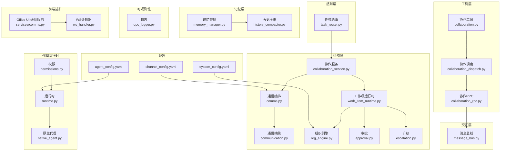
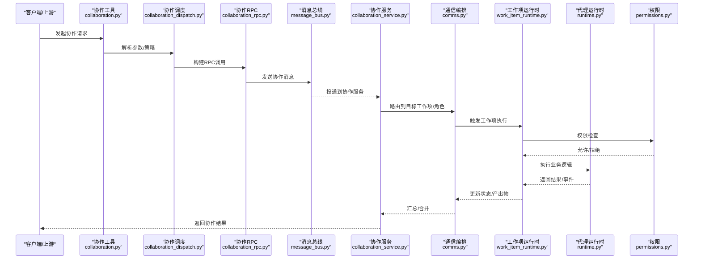
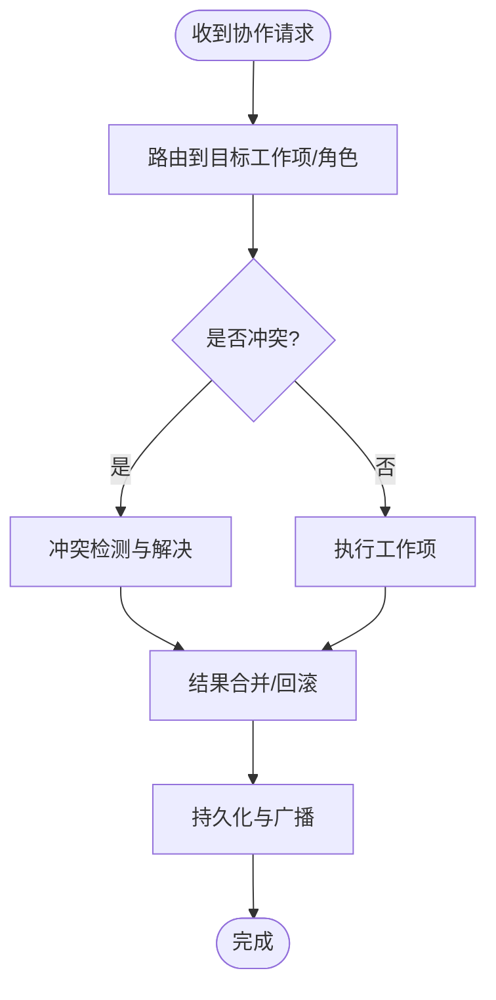
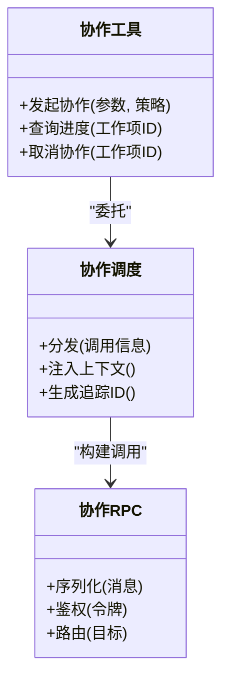
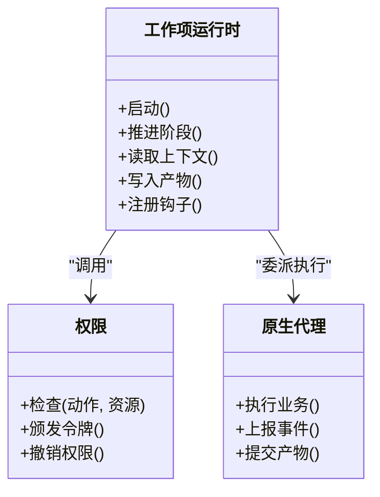
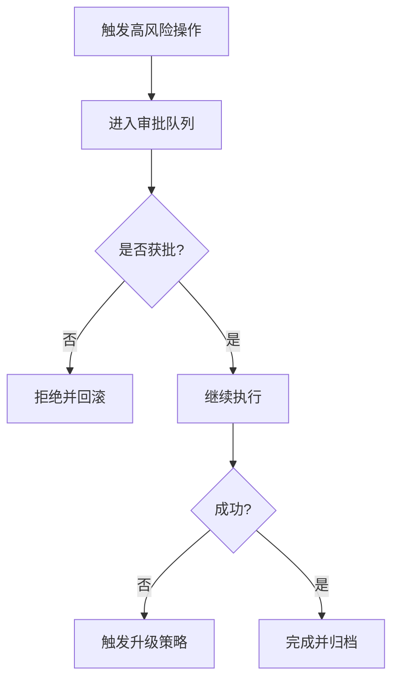
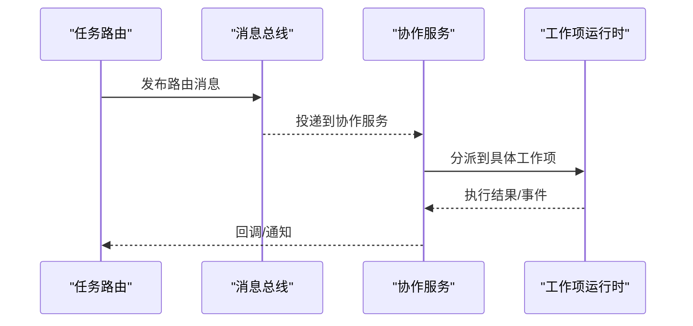
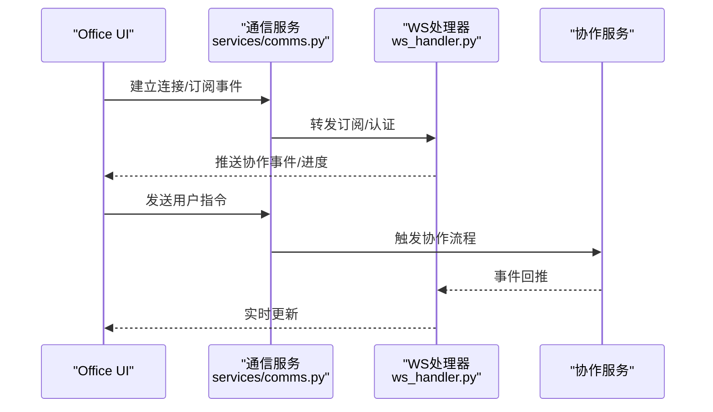
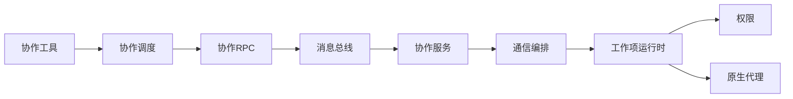

# 协作框架

<cite>
**本文引用的文件**   
- [layer2_organization/collaboration_service.py](file://opc/layer2_organization/collaboration_service.py)
- [layer2_organization/comms.py](file://opc/layer2_organization/comms.py)
- [layer2_organization/communication.py](file://opc/layer2_organization/communication.py)
- [layer4_tools/collaboration.py](file://opc/layer4_tools/collaboration.py)
- [layer4_tools/collaboration_dispatch.py](file://opc/layer4_tools/collaboration_dispatch.py)
- [layer4_tools/collaboration_rpc.py](file://opc/layer4_tools/collaboration_rpc.py)
- [layer1_perception/task_router.py](file://opc/layer1_perception/task_router.py)
- [layer0_interaction/message_bus.py](file://opc/layer0_interaction/message_bus.py)
- [core/config.py](file://opc/core/config.py)
- [core/models.py](file://opc/core/models.py)
- [layer2_organization/org_engine.py](file://opc/layer2_organization/org_engine.py)
- [layer2_organization/work_item_runtime.py](file://opc/layer2_organization/work_item_runtime.py)
- [layer2_organization/approval.py](file://opc/layer2_organization/approval.py)
- [layer2_organization/escalation.py](file://opc/layer2_organization/escalation.py)
- [layer6_observability/opc_logger.py](file://opc/layer6_observability/opc_logger.py)
- [layer3_agent/runtime_v2/permissions.py](file://opc/layer3_agent/runtime_v2/permissions.py)
- [layer3_agent/runtime_v2/runtime.py](file://opc/layer3_agent/runtime_v2/runtime.py)
- [layer3_agent/native_agent.py](file://opc/layer3_agent/native_agent.py)
- [layer5_memory/memory_manager.py](file://opc/layer5_memory/memory_manager.py)
- [layer5_memory/history_compactor.py](file://opc/layer5_memory/history_compactor.py)
- [plugins/office_ui/services/comms.py](file://plugins/office_ui/services/comms.py)
- [plugins/office_ui/ws_handler.py](file://plugins/office_ui/ws_handler.py)
- [config/system_config.yaml](file://config/system_config.yaml)
- [config/channel_config.yaml](file://config/channel_config.yaml)
- [config/agent_config.yaml](file://config/agent_config.yaml)
</cite>

## 目录
1. [简介](#简介)
2. [项目结构](#项目结构)
3. [核心组件](#核心组件)
4. [架构总览](#架构总览)
5. [详细组件分析](#详细组件分析)
6. [依赖关系分析](#依赖关系分析)
7. [性能考量](#性能考量)
8. [故障排查指南](#故障排查指南)
9. [结论](#结论)
10. [附录](#附录)

## 简介
本技术文档面向OpenOPC协作框架，聚焦多代理协作的通信机制与消息传递协议、协作策略配置与行为控制、通信服务架构与消息路由、冲突检测与解决策略、团队协作配置与最佳实践、协作过程监控与审计、安全与权限控制，以及扩展开发与自定义协议支持。文档以代码级事实为依据，辅以架构图与时序图，帮助读者快速理解并高效使用协作能力。

## 项目结构
协作相关能力主要分布在以下层次：
- 组织层（layer2_organization）：协作服务、通信编排、工作项运行时、审批与升级等
- 工具层（layer4_tools）：协作工具、调度器、RPC封装
- 感知层（layer1_perception）：任务路由
- 交互层（layer0_interaction）：消息总线
- 代理运行时（layer3_agent）：权限、原生代理、子代理
- 记忆层（layer5_memory）：历史压缩、偏好与技能库
- 可观测性（layer6_observability）：日志与成本追踪
- 前端插件（plugins/office_ui）：WebSocket处理与服务端通信桥接
- 配置（config）：系统、通道、代理配置

图表来源
- [layer2_organization/collaboration_service.py](file://opc/layer2_organization/collaboration_service.py)
- [layer2_organization/comms.py](file://opc/layer2_organization/comms.py)
- [layer2_organization/communication.py](file://opc/layer2_organization/communication.py)
- [layer2_organization/work_item_runtime.py](file://opc/layer2_organization/work_item_runtime.py)
- [layer2_organization/org_engine.py](file://opc/layer2_organization/org_engine.py)
- [layer2_organization/approval.py](file://opc/layer2_organization/approval.py)
- [layer2_organization/escalation.py](file://opc/layer2_organization/escalation.py)
- [layer4_tools/collaboration.py](file://opc/layer4_tools/collaboration.py)
- [layer4_tools/collaboration_dispatch.py](file://opc/layer4_tools/collaboration_dispatch.py)
- [layer4_tools/collaboration_rpc.py](file://opc/layer4_tools/collaboration_rpc.py)
- [layer1_perception/task_router.py](file://opc/layer1_perception/task_router.py)
- [layer0_interaction/message_bus.py](file://opc/layer0_interaction/message_bus.py)
- [layer3_agent/runtime_v2/permissions.py](file://opc/layer3_agent/runtime_v2/permissions.py)
- [layer3_agent/runtime_v2/runtime.py](file://opc/layer3_agent/runtime_v2/runtime.py)
- [layer3_agent/native_agent.py](file://opc/layer3_agent/native_agent.py)
- [layer5_memory/memory_manager.py](file://opc/layer5_memory/memory_manager.py)
- [layer5_memory/history_compactor.py](file://opc/layer5_memory/history_compactor.py)
- [plugins/office_ui/services/comms.py](file://plugins/office_ui/services/comms.py)
- [plugins/office_ui/ws_handler.py](file://plugins/office_ui/ws_handler.py)
- [config/system_config.yaml](file://config/system_config.yaml)
- [config/channel_config.yaml](file://config/channel_config.yaml)
- [config/agent_config.yaml](file://config/agent_config.yaml)

章节来源
- [layer2_organization/collaboration_service.py](file://opc/layer2_organization/collaboration_service.py)
- [layer2_organization/comms.py](file://opc/layer2_organization/comms.py)
- [layer2_organization/communication.py](file://opc/layer2_organization/communication.py)
- [layer4_tools/collaboration.py](file://opc/layer4_tools/collaboration.py)
- [layer4_tools/collaboration_dispatch.py](file://opc/layer4_tools/collaboration_dispatch.py)
- [layer4_tools/collaboration_rpc.py](file://opc/layer4_tools/collaboration_rpc.py)
- [layer1_perception/task_router.py](file://opc/layer1_perception/task_router.py)
- [layer0_interaction/message_bus.py](file://opc/layer0_interaction/message_bus.py)
- [layer3_agent/runtime_v2/permissions.py](file://opc/layer3_agent/runtime_v2/permissions.py)
- [layer3_agent/runtime_v2/runtime.py](file://opc/layer3_agent/runtime_v2/runtime.py)
- [layer3_agent/native_agent.py](file://opc/layer3_agent/native_agent.py)
- [layer5_memory/memory_manager.py](file://opc/layer5_memory/memory_manager.py)
- [layer5_memory/history_compactor.py](file://opc/layer5_memory/history_compactor.py)
- [plugins/office_ui/services/comms.py](file://plugins/office_ui/services/comms.py)
- [plugins/office_ui/ws_handler.py](file://plugins/office_ui/ws_handler.py)
- [config/system_config.yaml](file://config/system_config.yaml)
- [config/channel_config.yaml](file://config/channel_config.yaml)
- [config/agent_config.yaml](file://config/agent_config.yaml)

## 核心组件
- 协作服务：提供跨代理协作的统一入口，协调任务拆分、资源协调、冲突检测与仲裁、结果合并与回写。
- 通信编排：负责消息在组织内部不同角色与工作项之间的路由、转发、重试与幂等保障。
- 协作工具与调度：为上层业务暴露协作API，将调用委托给底层RPC与消息总线。
- 工作项运行时：承载单个工作项的生命周期、状态机、上下文视图与钩子。
- 审批与升级：对高风险操作进行审批拦截，失败或超时自动升级。
- 权限与运行时：基于角色的访问控制、工具执行沙箱与隔离。
- 可观测性与记忆：记录协作事件、审计轨迹，并对长会话进行历史压缩与摘要。

章节来源
- [layer2_organization/collaboration_service.py](file://opc/layer2_organization/collaboration_service.py)
- [layer2_organization/comms.py](file://opc/layer2_organization/comms.py)
- [layer4_tools/collaboration.py](file://opc/layer4_tools/collaboration.py)
- [layer4_tools/collaboration_dispatch.py](file://opc/layer4_tools/collaboration_dispatch.py)
- [layer4_tools/collaboration_rpc.py](file://opc/layer4_tools/collaboration_rpc.py)
- [layer2_organization/work_item_runtime.py](file://opc/layer2_organization/work_item_runtime.py)
- [layer2_organization/approval.py](file://opc/layer2_organization/approval.py)
- [layer2_organization/escalation.py](file://opc/layer2_organization/escalation.py)
- [layer3_agent/runtime_v2/permissions.py](file://opc/layer3_agent/runtime_v2/permissions.py)
- [layer3_agent/runtime_v2/runtime.py](file://opc/layer3_agent/runtime_v2/runtime.py)
- [layer6_observability/opc_logger.py](file://opc/layer6_observability/opc_logger.py)
- [layer5_memory/memory_manager.py](file://opc/layer5_memory/memory_manager.py)
- [layer5_memory/history_compactor.py](file://opc/layer5_memory/history_compactor.py)

## 架构总览
协作框架采用分层解耦设计：
- 感知层根据意图与上下文选择目标工作项与执行者
- 组织层通过协作服务编排跨代理协作流程，维护工作项状态与生命周期
- 工具层提供统一的协作API与RPC封装，屏蔽底层细节
- 交互层通过消息总线实现异步可靠的消息投递
- 代理运行时负责权限校验、工具执行与隔离
- 可观测性与记忆层贯穿全链路，提供审计与压缩

图表来源
- [layer4_tools/collaboration.py](file://opc/layer4_tools/collaboration.py)
- [layer4_tools/collaboration_dispatch.py](file://opc/layer4_tools/collaboration_dispatch.py)
- [layer4_tools/collaboration_rpc.py](file://opc/layer4_tools/collaboration_rpc.py)
- [layer0_interaction/message_bus.py](file://opc/layer0_interaction/message_bus.py)
- [layer2_organization/collaboration_service.py](file://opc/layer2_organization/collaboration_service.py)
- [layer2_organization/comms.py](file://opc/layer2_organization/comms.py)
- [layer2_organization/work_item_runtime.py](file://opc/layer2_organization/work_item_runtime.py)
- [layer3_agent/runtime_v2/runtime.py](file://opc/layer3_agent/runtime_v2/runtime.py)
- [layer3_agent/runtime_v2/permissions.py](file://opc/layer3_agent/runtime_v2/permissions.py)

## 详细组件分析

### 协作服务与通信编排
- 职责边界
  - 协作服务：定义协作流程、冲突检测与仲裁、结果合并、对外一致性保证
  - 通信编排：负责消息路由、去重、重试、顺序与幂等；对接通道与订阅者
- 关键流程
  - 接收协作请求后，按策略选择目标工作项/角色
  - 若检测到资源/数据冲突，进入冲突解决分支（协商、抢占、回滚）
  - 完成后聚合结果，持久化并通知订阅方
- 错误与恢复
  - 消息投递失败时进行指数退避重试
  - 工作项异常触发升级或回滚策略

图表来源
- [layer2_organization/collaboration_service.py](file://opc/layer2_organization/collaboration_service.py)
- [layer2_organization/comms.py](file://opc/layer2_organization/comms.py)

章节来源
- [layer2_organization/collaboration_service.py](file://opc/layer2_organization/collaboration_service.py)
- [layer2_organization/comms.py](file://opc/layer2_organization/comms.py)

### 协作工具、调度与RPC
- 协作工具：暴露高层API，封装参数校验、策略加载与结果映射
- 协作调度：将工具调用转换为RPC调用，注入上下文与追踪ID
- 协作RPC：序列化消息、签名与鉴权、路由到消息总线或直连服务

图表来源
- [layer4_tools/collaboration.py](file://opc/layer4_tools/collaboration.py)
- [layer4_tools/collaboration_dispatch.py](file://opc/layer4_tools/collaboration_dispatch.py)
- [layer4_tools/collaboration_rpc.py](file://opc/layer4_tools/collaboration_rpc.py)

章节来源
- [layer4_tools/collaboration.py](file://opc/layer4_tools/collaboration.py)
- [layer4_tools/collaboration_dispatch.py](file://opc/layer4_tools/collaboration_dispatch.py)
- [layer4_tools/collaboration_rpc.py](file://opc/layer4_tools/collaboration_rpc.py)

### 工作项运行时与权限
- 工作项运行时：维护工作项状态机、上下文视图、阶段钩子与产物契约
- 权限：在执行前进行细粒度授权检查，限制敏感工具与资源访问
- 原生代理：作为具体执行主体，遵循运行时约束与审计要求

图表来源
- [layer2_organization/work_item_runtime.py](file://opc/layer2_organization/work_item_runtime.py)
- [layer3_agent/runtime_v2/permissions.py](file://opc/layer3_agent/runtime_v2/permissions.py)
- [layer3_agent/native_agent.py](file://opc/layer3_agent/native_agent.py)

章节来源
- [layer2_organization/work_item_runtime.py](file://opc/layer2_organization/work_item_runtime.py)
- [layer3_agent/runtime_v2/permissions.py](file://opc/layer3_agent/runtime_v2/permissions.py)
- [layer3_agent/native_agent.py](file://opc/layer3_agent/native_agent.py)

### 审批与升级
- 审批：对高风险操作进行前置拦截，等待人工或策略批准
- 升级：当执行失败、超时或达到阈值时，自动升级至更高级别或备用执行者

图表来源
- [layer2_organization/approval.py](file://opc/layer2_organization/approval.py)
- [layer2_organization/escalation.py](file://opc/layer2_organization/escalation.py)

章节来源
- [layer2_organization/approval.py](file://opc/layer2_organization/approval.py)
- [layer2_organization/escalation.py](file://opc/layer2_organization/escalation.py)

### 任务路由与消息总线
- 任务路由：依据意图、上下文与负载特征，选择合适的工作项与执行者
- 消息总线：提供可靠投递、去重、顺序与重试，支撑跨进程/跨节点通信

图表来源
- [layer1_perception/task_router.py](file://opc/layer1_perception/task_router.py)
- [layer0_interaction/message_bus.py](file://opc/layer0_interaction/message_bus.py)
- [layer2_organization/collaboration_service.py](file://opc/layer2_organization/collaboration_service.py)
- [layer2_organization/work_item_runtime.py](file://opc/layer2_organization/work_item_runtime.py)

章节来源
- [layer1_perception/task_router.py](file://opc/layer1_perception/task_router.py)
- [layer0_interaction/message_bus.py](file://opc/layer0_interaction/message_bus.py)

### 前端协作与WebSocket
- Office UI通信服务：封装与后端服务的HTTP/WebSocket交互
- WebSocket处理器：处理实时事件推送、用户输入与协作进度同步

图表来源
- [plugins/office_ui/services/comms.py](file://plugins/office_ui/services/comms.py)
- [plugins/office_ui/ws_handler.py](file://plugins/office_ui/ws_handler.py)
- [layer2_organization/collaboration_service.py](file://opc/layer2_organization/collaboration_service.py)

章节来源
- [plugins/office_ui/services/comms.py](file://plugins/office_ui/services/comms.py)
- [plugins/office_ui/ws_handler.py](file://plugins/office_ui/ws_handler.py)

## 依赖关系分析
- 低耦合高内聚：工具层仅依赖调度与RPC，不直接触碰消息总线
- 明确边界：组织层负责流程编排，运行时负责执行与权限
- 外部依赖：通道配置、代理配置与系统配置驱动运行时行为

图表来源
- [layer4_tools/collaboration.py](file://opc/layer4_tools/collaboration.py)
- [layer4_tools/collaboration_dispatch.py](file://opc/layer4_tools/collaboration_dispatch.py)
- [layer4_tools/collaboration_rpc.py](file://opc/layer4_tools/collaboration_rpc.py)
- [layer0_interaction/message_bus.py](file://opc/layer0_interaction/message_bus.py)
- [layer2_organization/collaboration_service.py](file://opc/layer2_organization/collaboration_service.py)
- [layer2_organization/comms.py](file://opc/layer2_organization/comms.py)
- [layer2_organization/work_item_runtime.py](file://opc/layer2_organization/work_item_runtime.py)
- [layer3_agent/runtime_v2/permissions.py](file://opc/layer3_agent/runtime_v2/permissions.py)
- [layer3_agent/native_agent.py](file://opc/layer3_agent/native_agent.py)

章节来源
- [layer4_tools/collaboration.py](file://opc/layer4_tools/collaboration.py)
- [layer4_tools/collaboration_dispatch.py](file://opc/layer4_tools/collaboration_dispatch.py)
- [layer4_tools/collaboration_rpc.py](file://opc/layer4_tools/collaboration_rpc.py)
- [layer0_interaction/message_bus.py](file://opc/layer0_interaction/message_bus.py)
- [layer2_organization/collaboration_service.py](file://opc/layer2_organization/collaboration_service.py)
- [layer2_organization/comms.py](file://opc/layer2_organization/comms.py)
- [layer2_organization/work_item_runtime.py](file://opc/layer2_organization/work_item_runtime.py)
- [layer3_agent/runtime_v2/permissions.py](file://opc/layer3_agent/runtime_v2/permissions.py)
- [layer3_agent/native_agent.py](file://opc/layer3_agent/native_agent.py)

## 性能考量
- 消息批处理与背压：在高吞吐场景下，建议启用批量投递与限流，避免下游过载
- 幂等与去重：确保消息键唯一，避免重复执行导致的状态不一致
- 并行与串行混合：对无副作用的读操作可并行，写操作需串行化或加锁
- 历史压缩：长会话定期压缩，降低上下文窗口压力与存储开销
- 缓存热点：对频繁读取的配置与元数据加入本地缓存，减少远程调用

[本节为通用指导，无需特定文件引用]

## 故障排查指南
- 常见问题定位
  - 协作请求未到达：检查消息总线连通性与路由规则
  - 工作项卡住：查看工作项状态机与阶段钩子日志
  - 权限拒绝：确认权限策略与令牌有效性
  - 冲突频发：评估并发度与资源竞争点，调整仲裁策略
- 审计与追踪
  - 使用统一日志记录协作事件、权限决策与升级路径
  - 结合追踪ID串联端到端调用链，便于问题复现

章节来源
- [layer6_observability/opc_logger.py](file://opc/layer6_observability/opc_logger.py)
- [layer2_organization/work_item_runtime.py](file://opc/layer2_organization/work_item_runtime.py)
- [layer3_agent/runtime_v2/permissions.py](file://opc/layer3_agent/runtime_v2/permissions.py)

## 结论
OpenOPC协作框架通过分层解耦、明确职责与强一致性的消息机制，实现了可扩展的多代理协作能力。借助审批与升级、权限控制与可观测性，系统在复杂企业场景中具备高可用与可控性。配合合理的配置与最佳实践，可在保证安全的前提下提升团队效率。

[本节为总结性内容，无需特定文件引用]

## 附录

### 协作策略配置与行为控制
- 系统配置：全局开关、并发度、重试策略、审计级别
- 通道配置：各渠道接入参数、路由规则与优先级
- 代理配置：角色定义、工具白名单、上下文模板与输出契约

章节来源
- [config/system_config.yaml](file://config/system_config.yaml)
- [config/channel_config.yaml](file://config/channel_config.yaml)
- [config/agent_config.yaml](file://config/agent_config.yaml)

### 团队协作配置示例与最佳实践
- 示例要点
  - 明确角色与职责边界，最小权限原则
  - 设置合理的超时与升级阈值
  - 对关键路径开启审批与审计
- 最佳实践
  - 使用幂等键与唯一工作项ID
  - 对高频操作启用缓存与批处理
  - 定期审查权限与策略，清理闲置角色

章节来源
- [layer2_organization/approval.py](file://opc/layer2_organization/approval.py)
- [layer2_organization/escalation.py](file://opc/layer2_organization/escalation.py)
- [layer3_agent/runtime_v2/permissions.py](file://opc/layer3_agent/runtime_v2/permissions.py)

### 监控与审计
- 指标采集：协作成功率、平均耗时、冲突率、升级率
- 审计日志：权限决策、审批结果、升级原因与回滚轨迹
- 可视化：通过前端面板展示协作进度与事件时间线

章节来源
- [plugins/office_ui/services/comms.py](file://plugins/office_ui/services/comms.py)
- [plugins/office_ui/ws_handler.py](file://plugins/office_ui/ws_handler.py)
- [layer6_observability/opc_logger.py](file://opc/layer6_observability/opc_logger.py)

### 安全机制与权限控制
- 细粒度权限：基于角色与资源的访问控制
- 令牌与签名：RPC调用前的身份验证与完整性校验
- 沙箱执行：限制危险操作，隔离执行环境

章节来源
- [layer3_agent/runtime_v2/permissions.py](file://opc/layer3_agent/runtime_v2/permissions.py)
- [layer3_agent/runtime_v2/runtime.py](file://opc/layer3_agent/runtime_v2/runtime.py)
- [layer4_tools/collaboration_rpc.py](file://opc/layer4_tools/collaboration_rpc.py)

### 扩展开发与自定义协议支持
- 扩展点
  - 新增通道适配器：实现通信抽象接口
  - 自定义工作项阶段：注册钩子与产物契约
  - 扩展权限策略：实现新的授权规则
- 协议兼容
  - 在RPC层适配新协议格式
  - 在消息总线层注册新的消息类型与路由规则

章节来源
- [layer2_organization/communication.py](file://opc/layer2_organization/communication.py)
- [layer2_organization/work_item_runtime.py](file://opc/layer2_organization/work_item_runtime.py)
- [layer4_tools/collaboration_rpc.py](file://opc/layer4_tools/collaboration_rpc.py)
- [layer0_interaction/message_bus.py](file://opc/layer0_interaction/message_bus.py)