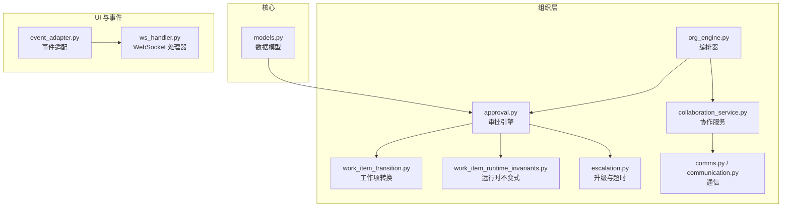
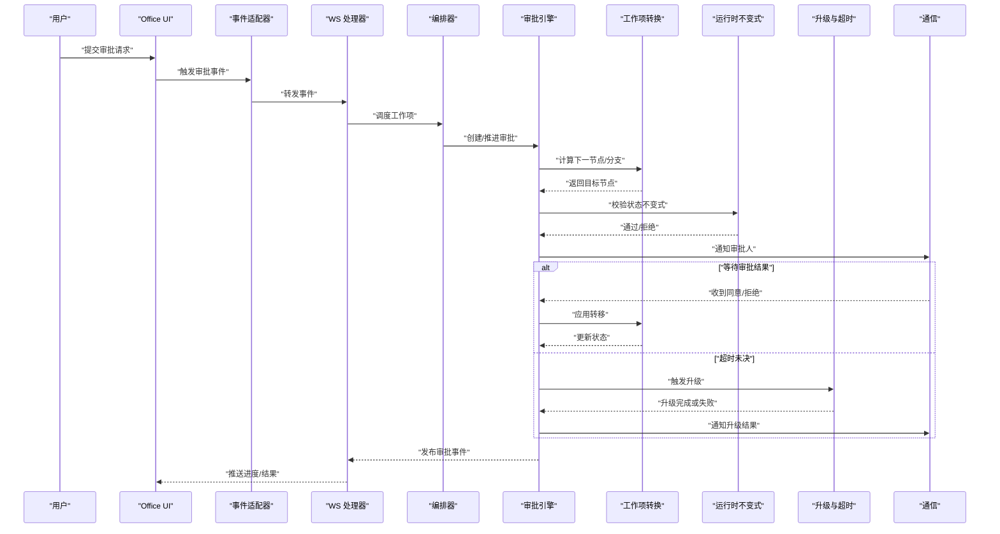
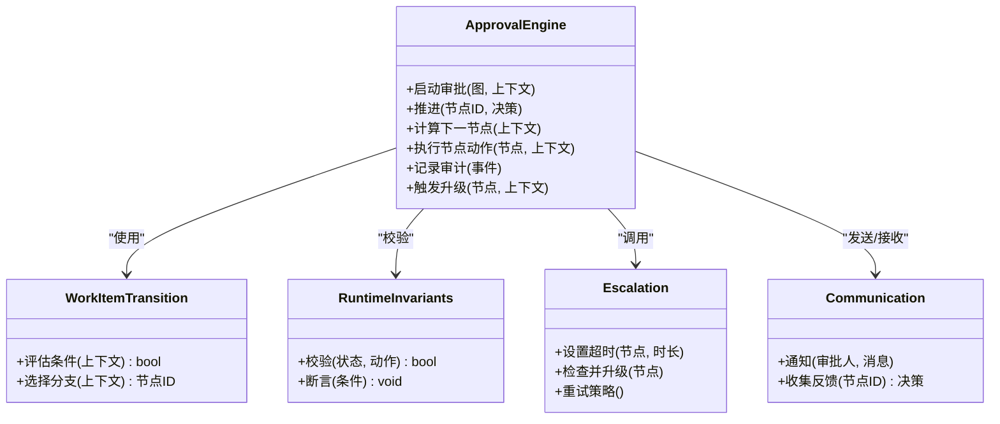
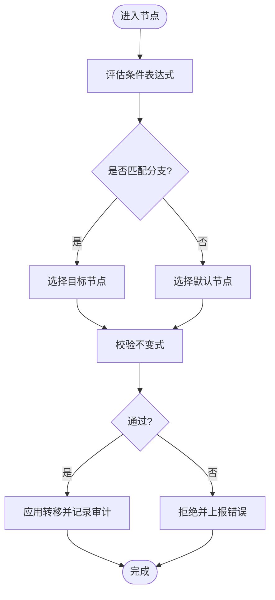
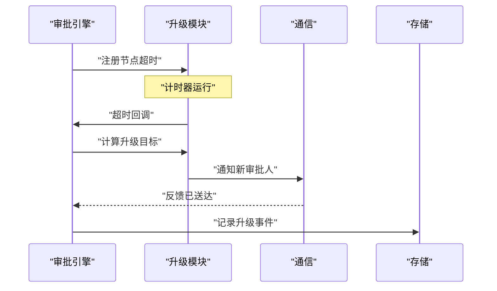
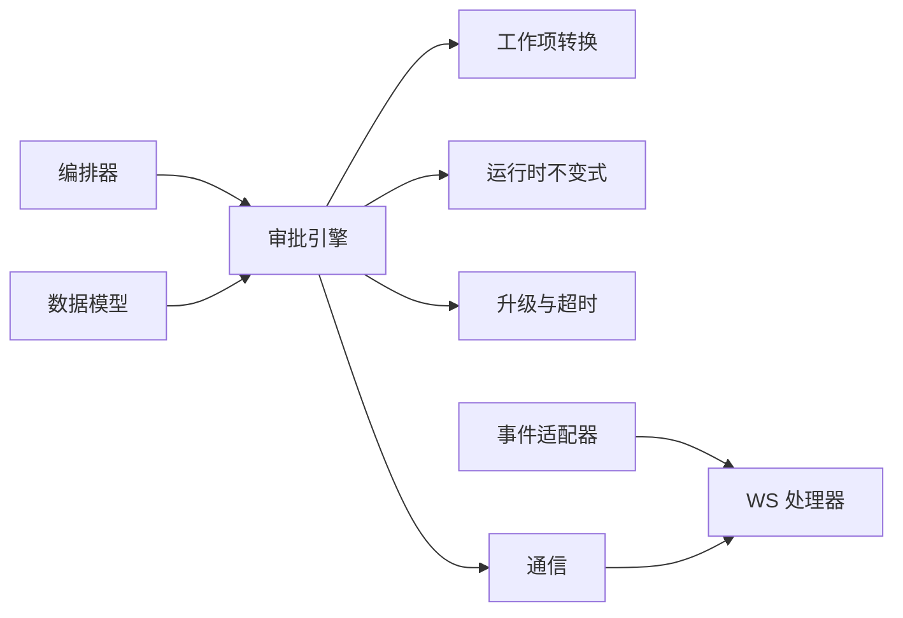

# 审批流程

<cite>
**本文引用的文件**   
- [approval.py](file://opc/layer2_organization/approval.py)
- [escalation.py](file://opc/layer2_organization/escalation.py)
- [work_item_transition.py](file://opc/layer2_organization/work_item_transition.py)
- [work_item_runtime_invariants.py](file://opc/layer2_organization/work_item_runtime_invariants.py)
- [org_engine.py](file://opc/layer2_organization/org_engine.py)
- [collaboration_service.py](file://opc/layer2_organization/collaboration_service.py)
- [comms.py](file://opc/layer2_organization/comms.py)
- [communication.py](file://opc/layer2_organization/communication.py)
- [models.py](file://opc/core/models.py)
- [event_adapter.py](file://opc/plugins/office_ui/event_adapter.py)
- [ws_handler.py](file://opc/plugins/office_ui/ws_handler.py)
- [test_approval_engine.py](file://tests/test_approval_engine.py)
- [test_ws_handler_escalations.py](file://tests/test_ws_handler_escalations.py)
</cite>

## 目录
1. [简介](#简介)
2. [项目结构](#项目结构)
3. [核心组件](#核心组件)
4. [架构总览](#架构总览)
5. [详细组件分析](#详细组件分析)
6. [依赖分析](#依赖分析)
7. [性能考虑](#性能考虑)
8. [故障排除指南](#故障排除指南)
9. [结论](#结论)
10. [附录](#附录)

## 简介
本技术文档围绕“多级审批流程”的设计与实现，系统性阐述以下主题：
- 多级审批流程的设计模式与状态机机制
- 审批节点配置方法（审批人指定、条件判断、分支逻辑）
- 审批状态流转规则与回滚机制
- 审批升级（Escalation）处理流程与超时策略
- 可视化配置界面使用方法（Office UI 插件）
- 审批历史与审计追踪
- 与外部系统的集成方式
- 性能调优与故障排除指导

## 项目结构
审批相关能力主要分布在组织层（layer2_organization）、核心模型（core）、前端交互（plugins/office_ui）以及测试用例中。关键路径如下：
- 审批引擎与状态机：approval.py、work_item_transition.py、work_item_runtime_invariants.py
- 升级与超时：escalation.py
- 编排与协作：org_engine.py、collaboration_service.py、comms.py、communication.py
- 数据模型：models.py
- 事件适配与 WebSocket：event_adapter.py、ws_handler.py
- 测试：test_approval_engine.py、test_ws_handler_escalations.py

图表来源
- [approval.py](file://opc/layer2_organization/approval.py)
- [work_item_transition.py](file://opc/layer2_organization/work_item_transition.py)
- [work_item_runtime_invariants.py](file://opc/layer2_organization/work_item_runtime_invariants.py)
- [escalation.py](file://opc/layer2_organization/escalation.py)
- [org_engine.py](file://opc/layer2_organization/org_engine.py)
- [collaboration_service.py](file://opc/layer2_organization/collaboration_service.py)
- [comms.py](file://opc/layer2_organization/comms.py)
- [communication.py](file://opc/layer2_organization/communication.py)
- [models.py](file://opc/core/models.py)
- [event_adapter.py](file://opc/plugins/office_ui/event_adapter.py)
- [ws_handler.py](file://opc/plugins/office_ui/ws_handler.py)

章节来源
- [approval.py](file://opc/layer2_organization/approval.py)
- [work_item_transition.py](file://opc/layer2_organization/work_item_transition.py)
- [work_item_runtime_invariants.py](file://opc/layer2_organization/work_item_runtime_invariants.py)
- [escalation.py](file://opc/layer2_organization/escalation.py)
- [org_engine.py](file://opc/layer2_organization/org_engine.py)
- [collaboration_service.py](file://opc/layer2_organization/collaboration_service.py)
- [comms.py](file://opc/layer2_organization/comms.py)
- [communication.py](file://opc/layer2_organization/communication.py)
- [models.py](file://opc/core/models.py)
- [event_adapter.py](file://opc/plugins/office_ui/event_adapter.py)
- [ws_handler.py](file://opc/plugins/office_ui/ws_handler.py)

## 核心组件
- 审批引擎（Approval Engine）
  - 负责解析审批图、计算下一节点、校验准入条件、执行节点动作与状态迁移。
  - 维护审批上下文、节点实例、决策记录与审计日志。
- 工作项转换（Work Item Transition）
  - 定义工作项在审批图中的边与转移规则，包括条件表达式与分支选择。
- 运行时不变式（Runtime Invariants）
  - 保证审批状态机的合法性，如不允许非法跳转、必须满足前置条件等。
- 升级与超时（Escalation）
  - 支持超时自动升级、人工干预升级、升级目标与重试策略。
- 编排与协作（Org Engine & Collaboration Service）
  - 将审批作为工作项生命周期的一部分进行编排，协调多角色与外部系统。
- 通信（Comms/Communication）
  - 向审批人发送通知、收集反馈、广播进度与结果。
- 数据模型（Models）
  - 定义审批任务、节点、决策、审计事件等数据结构。
- 事件适配与 WebSocket（Event Adapter & WS Handler）
  - 将后端事件转换为 UI 可消费的消息，并通过 WebSocket 推送给前端。

章节来源
- [approval.py](file://opc/layer2_organization/approval.py)
- [work_item_transition.py](file://opc/layer2_organization/work_item_transition.py)
- [work_item_runtime_invariants.py](file://opc/layer2_organization/work_item_runtime_invariants.py)
- [escalation.py](file://opc/layer2_organization/escalation.py)
- [org_engine.py](file://opc/layer2_organization/org_engine.py)
- [collaboration_service.py](file://opc/layer2_organization/collaboration_service.py)
- [comms.py](file://opc/layer2_organization/comms.py)
- [communication.py](file://opc/layer2_organization/communication.py)
- [models.py](file://opc/core/models.py)
- [event_adapter.py](file://opc/plugins/office_ui/event_adapter.py)
- [ws_handler.py](file://opc/plugins/office_ui/ws_handler.py)

## 架构总览
下图展示了从用户操作到审批执行的端到端流程，涵盖 UI、事件适配、审批引擎、升级与通信子系统。

图表来源
- [event_adapter.py](file://opc/plugins/office_ui/event_adapter.py)
- [ws_handler.py](file://opc/plugins/office_ui/ws_handler.py)
- [org_engine.py](file://opc/layer2_organization/org_engine.py)
- [approval.py](file://opc/layer2_organization/approval.py)
- [work_item_transition.py](file://opc/layer2_organization/work_item_transition.py)
- [work_item_runtime_invariants.py](file://opc/layer2_organization/work_item_runtime_invariants.py)
- [escalation.py](file://opc/layer2_organization/escalation.py)
- [comms.py](file://opc/layer2_organization/comms.py)
- [communication.py](file://opc/layer2_organization/communication.py)

## 详细组件分析

### 审批引擎（Approval Engine）
职责与要点：
- 解析审批图与节点配置，生成并维护审批上下文。
- 根据当前节点与输入参数计算下一节点与分支。
- 执行节点动作（如发起评审、收集意见、合并决策）。
- 持久化审计事件与决策记录，供查询与回放。
- 与升级模块协作，处理超时与人工升级。

图表来源
- [approval.py](file://opc/layer2_organization/approval.py)
- [work_item_transition.py](file://opc/layer2_organization/work_item_transition.py)
- [work_item_runtime_invariants.py](file://opc/layer2_organization/work_item_runtime_invariants.py)
- [escalation.py](file://opc/layer2_organization/escalation.py)
- [communication.py](file://opc/layer2_organization/communication.py)

章节来源
- [approval.py](file://opc/layer2_organization/approval.py)
- [work_item_transition.py](file://opc/layer2_organization/work_item_transition.py)
- [work_item_runtime_invariants.py](file://opc/layer2_organization/work_item_runtime_invariants.py)
- [escalation.py](file://opc/layer2_organization/escalation.py)
- [communication.py](file://opc/layer2_organization/communication.py)

### 工作项转换与分支逻辑
- 条件判断：基于上下文变量（如金额、风险等级、部门）评估布尔条件。
- 分支选择：按优先级匹配条件，确定目标节点；若无匹配则走默认分支。
- 转移约束：受运行时不变式保护，确保不可达状态被拦截。

图表来源
- [work_item_transition.py](file://opc/layer2_organization/work_item_transition.py)
- [work_item_runtime_invariants.py](file://opc/layer2_organization/work_item_runtime_invariants.py)

章节来源
- [work_item_transition.py](file://opc/layer2_organization/work_item_transition.py)
- [work_item_runtime_invariants.py](file://opc/layer2_organization/work_item_runtime_invariants.py)

### 升级与超时（Escalation）
- 超时策略：为每个审批节点配置最大等待时间；到期后自动升级至上级或备用审批人。
- 升级目标：支持固定人员、角色或动态计算（如按部门层级）。
- 重试与退避：对升级失败提供重试与退避策略，避免雪崩。
- 人工干预：允许管理员手动触发升级或撤销升级。

图表来源
- [escalation.py](file://opc/layer2_organization/escalation.py)
- [approval.py](file://opc/layer2_organization/approval.py)
- [comms.py](file://opc/layer2_organization/comms.py)

章节来源
- [escalation.py](file://opc/layer2_organization/escalation.py)
- [approval.py](file://opc/layer2_organization/approval.py)
- [comms.py](file://opc/layer2_organization/comms.py)

### 可视化配置界面（Office UI）
- 功能概览：
  - 可视化绘制审批图（节点、连线、条件、分支）
  - 配置审批人（个人/角色/动态）
  - 设置超时与升级策略
  - 预览与验证流程图
  - 发布与版本管理
- 使用方法：
  - 打开 Office UI 的“组织/流程”面板
  - 新建流程模板，拖拽节点并连线
  - 在节点属性中配置审批人与条件
  - 保存并发布，观察实时预览
  - 通过“审计日志”查看历史与决策

章节来源
- [event_adapter.py](file://opc/plugins/office_ui/event_adapter.py)
- [ws_handler.py](file://opc/plugins/office_ui/ws_handler.py)

### 审批历史与审计追踪
- 审计事件：包含创建、推进、决策、升级、回滚等关键动作。
- 决策记录：保留每次审批的输入、输出与依据。
- 查询与回放：支持按工作项、节点、时间范围检索；可回放完整链路。
- 合规性：审计数据不可篡改，具备签名与校验。

章节来源
- [approval.py](file://opc/layer2_organization/approval.py)
- [models.py](file://opc/core/models.py)

### 与外部系统集成
- 事件桥接：通过事件适配器将审批事件暴露为统一格式，供外部订阅。
- Webhook/回调：在关键节点完成后回调外部系统（如 ERP、OA）。
- 身份与权限：对接企业身份源，按角色与组织关系决定审批人。
- 数据同步：将审批结果同步至下游系统，保持业务一致性。

章节来源
- [event_adapter.py](file://opc/plugins/office_ui/event_adapter.py)
- [ws_handler.py](file://opc/plugins/office_ui/ws_handler.py)
- [collaboration_service.py](file://opc/layer2_organization/collaboration_service.py)
- [communication.py](file://opc/layer2_organization/communication.py)

## 依赖分析
- 内部依赖：
  - 审批引擎依赖工作项转换与运行时不变式，确保状态机正确性。
  - 升级模块由审批引擎驱动，并与通信模块协同。
  - 编排器将审批嵌入工作项生命周期，协调多角色与工具。
- 外部依赖：
  - 事件适配与 WebSocket 用于与前端及外部系统交互。
  - 数据模型贯穿各层，保证一致的数据契约。

图表来源
- [approval.py](file://opc/layer2_organization/approval.py)
- [work_item_transition.py](file://opc/layer2_organization/work_item_transition.py)
- [work_item_runtime_invariants.py](file://opc/layer2_organization/work_item_runtime_invariants.py)
- [escalation.py](file://opc/layer2_organization/escalation.py)
- [org_engine.py](file://opc/layer2_organization/org_engine.py)
- [comms.py](file://opc/layer2_organization/comms.py)
- [communication.py](file://opc/layer2_organization/communication.py)
- [event_adapter.py](file://opc/plugins/office_ui/event_adapter.py)
- [ws_handler.py](file://opc/plugins/office_ui/ws_handler.py)
- [models.py](file://opc/core/models.py)

章节来源
- [approval.py](file://opc/layer2_organization/approval.py)
- [work_item_transition.py](file://opc/layer2_organization/work_item_transition.py)
- [work_item_runtime_invariants.py](file://opc/layer2_organization/work_item_runtime_invariants.py)
- [escalation.py](file://opc/layer2_organization/escalation.py)
- [org_engine.py](file://opc/layer2_organization/org_engine.py)
- [comms.py](file://opc/layer2_organization/comms.py)
- [communication.py](file://opc/layer2_organization/communication.py)
- [event_adapter.py](file://opc/plugins/office_ui/event_adapter.py)
- [ws_handler.py](file://opc/plugins/office_ui/ws_handler.py)
- [models.py](file://opc/core/models.py)

## 性能考虑
- 条件评估优化：缓存高频变量的计算结果，减少重复求值。
- 批量推进：对同一工作项的多步推进采用批处理，降低锁竞争。
- 异步升级：升级与通知采用异步队列，避免阻塞主流程。
- 审计写入：采用追加写与压缩策略，降低 IO 压力。
- 连接复用：与外部系统通信时复用连接与令牌，减少握手开销。

[本节为通用性能建议，不直接分析具体文件]

## 故障排除指南
- 常见问题定位：
  - 审批卡住：检查工作项转换条件与不变式断言是否失败。
  - 升级未生效：确认超时配置与升级目标是否正确，查看升级日志。
  - 通知未送达：检查通信通道与外部系统回调状态。
  - 前端未更新：确认事件适配与 WebSocket 推送是否正常。
- 诊断步骤：
  - 查看审计事件与工作项状态变更轨迹。
  - 复现问题并开启调试日志，关注异常堆栈与断言失败点。
  - 隔离外部依赖，验证是否为网络或认证问题。
- 参考测试用例：
  - 审批引擎行为与边界条件
  - WebSocket 升级事件处理

章节来源
- [test_approval_engine.py](file://tests/test_approval_engine.py)
- [test_ws_handler_escalations.py](file://tests/test_ws_handler_escalations.py)

## 结论
本审批流程系统以状态机为核心，结合条件分支、升级与审计追踪，提供了可扩展、可观测、可配置的多级审批能力。通过可视化配置界面与事件桥接，能够高效融入现有企业系统与前端体验。建议在部署时关注性能优化与监控告警，确保高可用与合规性。

[本节为总结性内容，不直接分析具体文件]

## 附录
- 术语表：
  - 工作项：业务流程中的最小执行单元，承载审批上下文。
  - 节点：审批图中的一个步骤，包含审批人、条件与动作。
  - 升级：因超时或人工干预将审批责任转移至更高层级或备用人员。
  - 审计：记录所有关键操作的不可变日志，用于追溯与合规。
- 最佳实践：
  - 明确条件表达式与默认分支，避免歧义。
  - 合理设置超时与升级目标，提升整体效率。
  - 定期审查审计日志，发现流程瓶颈与风险点。

[本节为概念性内容，不直接分析具体文件]