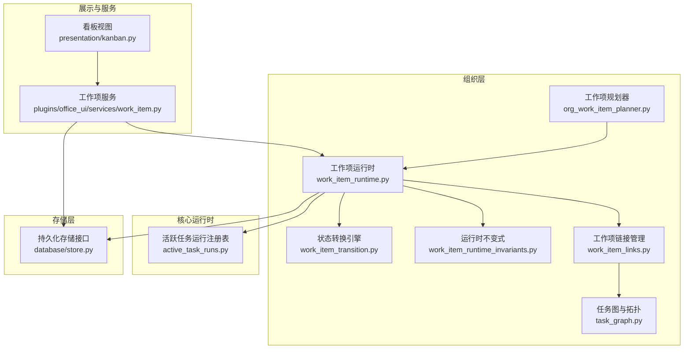
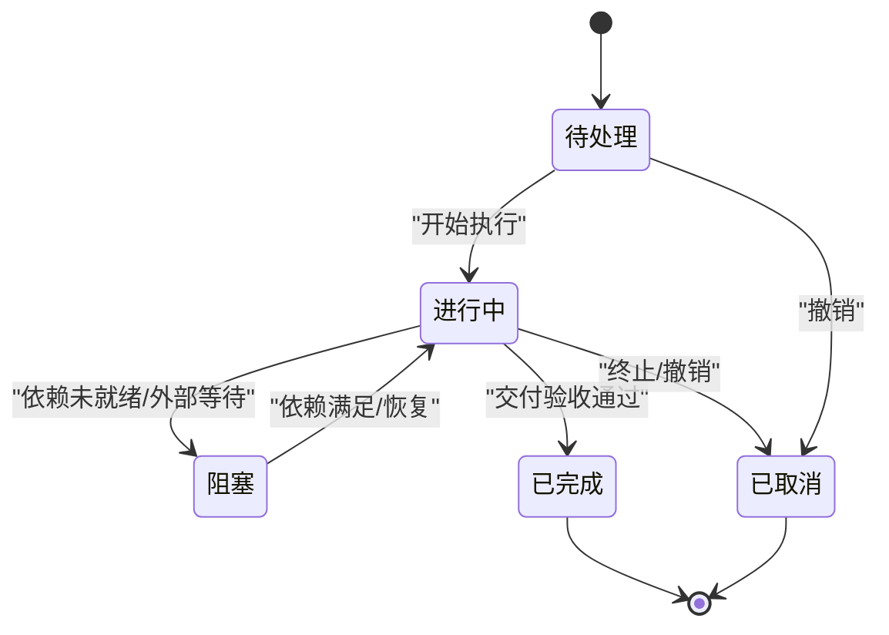
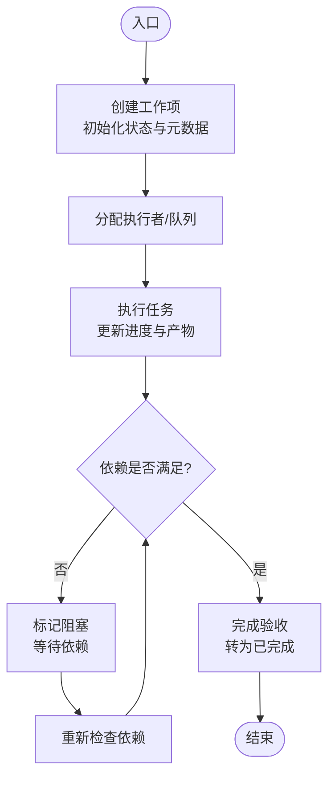
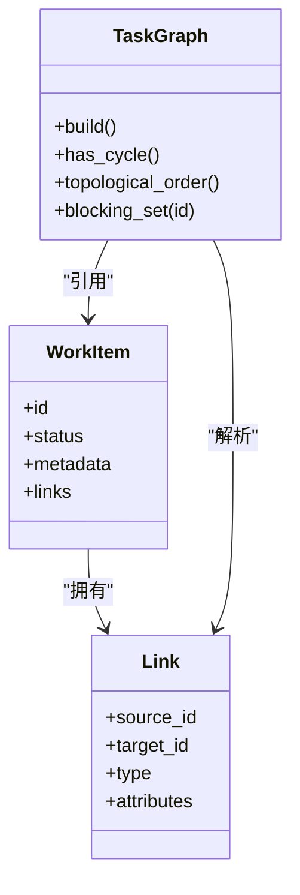
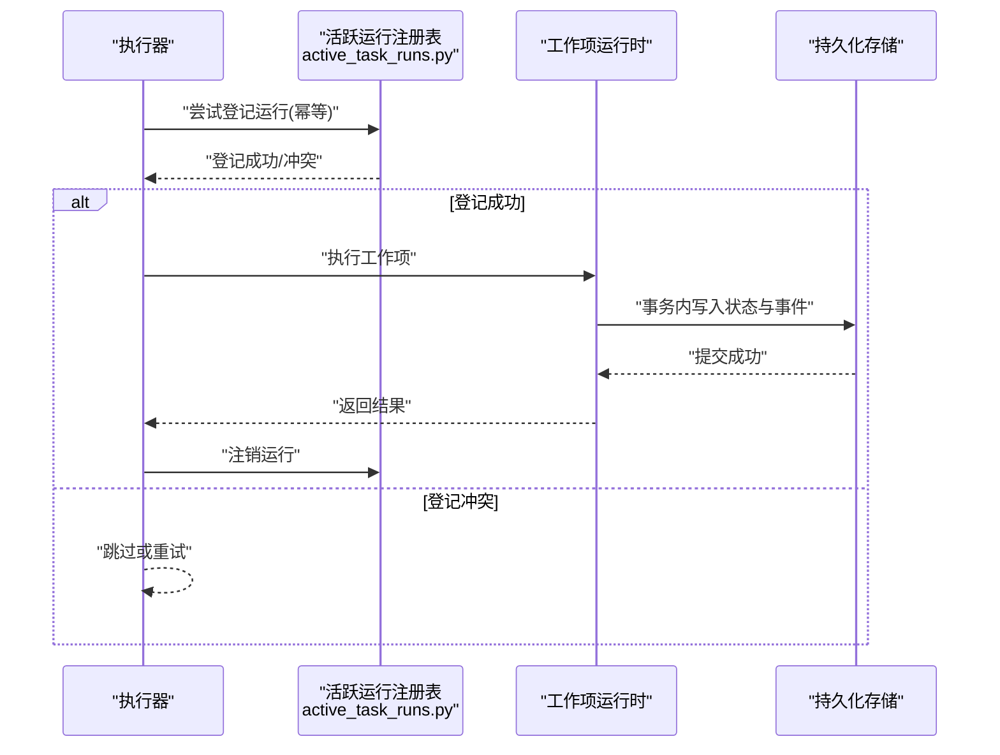
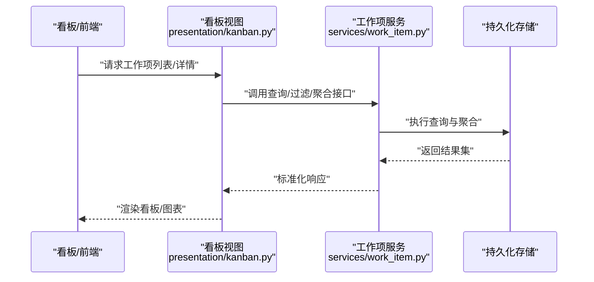
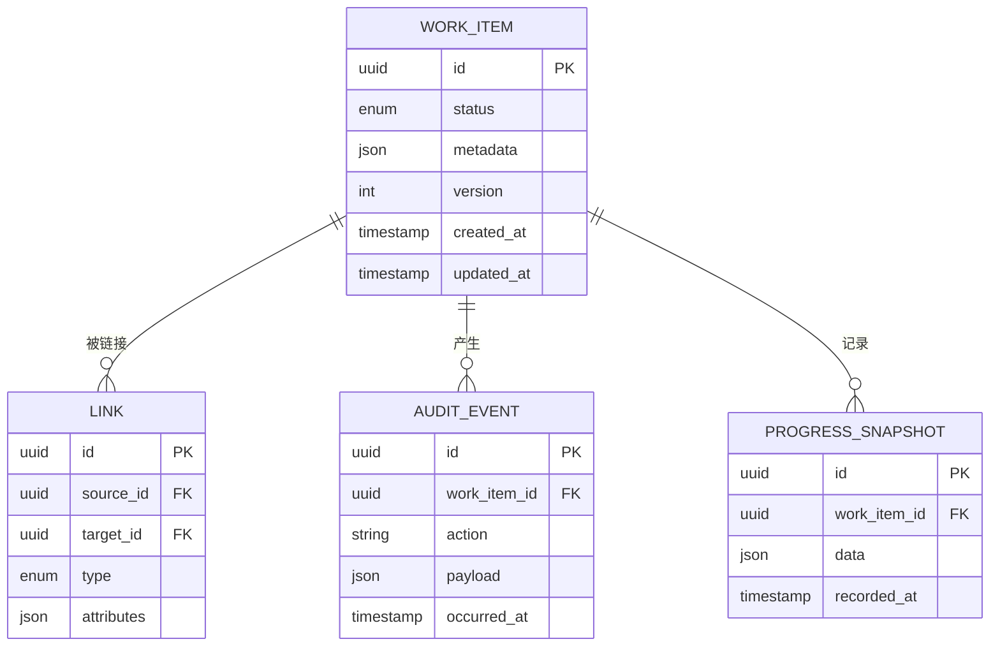
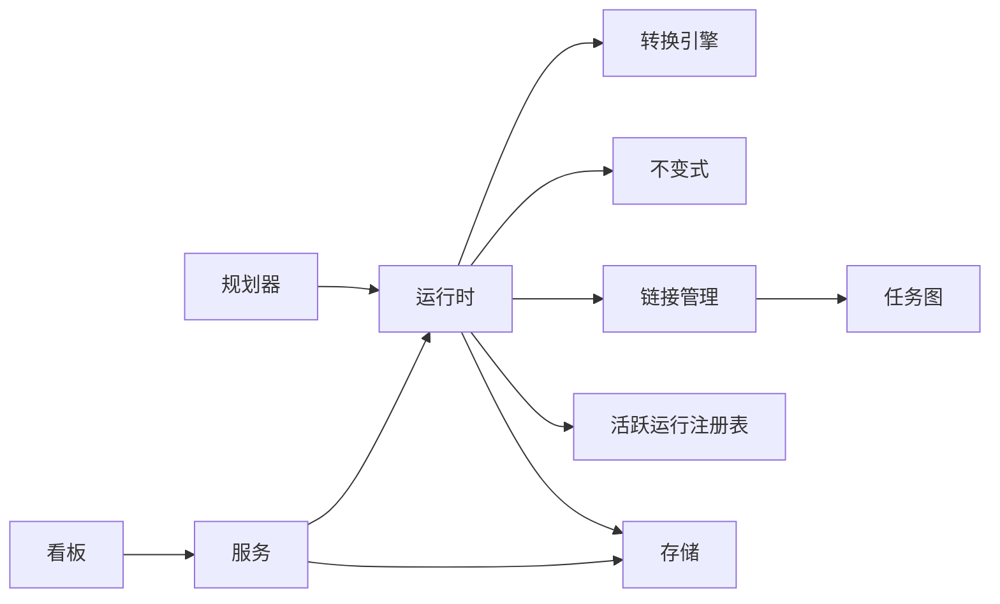

# 工作项管理

<cite>
**本文引用的文件**   
- [org_work_item_planner.py](file://opc/layer2_organization/org_work_item_planner.py)
- [work_item_runtime.py](file://opc/layer2_organization/work_item_runtime.py)
- [work_item_transition.py](file://opc/layer2_organization/work_item_transition.py)
- [work_item_runtime_invariants.py](file://opc/layer2_organization/work_item_runtime_invariants.py)
- [work_item_links.py](file://opc/layer2_organization/work_item_links.py)
- [task_graph.py](file://opc/layer2_organization/task_graph.py)
- [active_task_runs.py](file://opc/core/active_task_runs.py)
- [store.py](file://opc/database/store.py)
- [kanban.py](file://opc/presentation/kanban.py)
- [services/work_item.py](file://opc/plugins/office_ui/services/work_item.py)
- [test_work_item_transition.py](file://tests/test_work_item_transition.py)
- [test_work_item_runtime_invariants.py](file://tests/test_work_item_runtime_invariants.py)
- [test_work_item_runtime_links.py](file://tests/test_work_item_runtime_links.py)
</cite>

## 目录
1. [简介](#简介)
2. [项目结构](#项目结构)
3. [核心组件](#核心组件)
4. [架构总览](#架构总览)
5. [详细组件分析](#详细组件分析)
6. [依赖关系分析](#依赖关系分析)
7. [性能考虑](#性能考虑)
8. [故障排查指南](#故障排查指南)
9. [结论](#结论)
10. [附录](#附录)

## 简介
本技术文档围绕工作项管理系统，系统性阐述其生命周期状态机设计、创建/分配/执行/完成流程、依赖与链接管理、并发控制与事务保证、查询过滤与聚合API、持久化与一致性保障、监控指标与日志记录，以及最佳实践与性能优化建议。文档面向具备不同技术背景的读者，既提供高层概览，也深入到代码级实现细节与图示说明。

## 项目结构
工作项相关能力主要分布在组织层（layer2_organization）、核心运行时（core）、数据库存储（database）、展示层（presentation）与插件服务（plugins/office_ui/services）。测试覆盖关键行为与不变式。



**图表来源**
- [org_work_item_planner.py](file://opc/layer2_organization/org_work_item_planner.py)
- [work_item_runtime.py](file://opc/layer2_organization/work_item_runtime.py)
- [work_item_transition.py](file://opc/layer2_organization/work_item_transition.py)
- [work_item_runtime_invariants.py](file://opc/layer2_organization/work_item_runtime_invariants.py)
- [work_item_links.py](file://opc/layer2_organization/work_item_links.py)
- [task_graph.py](file://opc/layer2_organization/task_graph.py)
- [active_task_runs.py](file://opc/core/active_task_runs.py)
- [store.py](file://opc/database/store.py)
- [kanban.py](file://opc/presentation/kanban.py)
- [services/work_item.py](file://opc/plugins/office_ui/services/work_item.py)

**章节来源**
- [org_work_item_planner.py](file://opc/layer2_organization/org_work_item_planner.py)
- [work_item_runtime.py](file://opc/layer2_organization/work_item_runtime.py)
- [work_item_transition.py](file://opc/layer2_organization/work_item_transition.py)
- [work_item_runtime_invariants.py](file://opc/layer2_organization/work_item_runtime_invariants.py)
- [work_item_links.py](file://opc/layer2_organization/work_item_links.py)
- [task_graph.py](file://opc/layer2_organization/task_graph.py)
- [active_task_runs.py](file://opc/core/active_task_runs.py)
- [store.py](file://opc/database/store.py)
- [kanban.py](file://opc/presentation/kanban.py)
- [services/work_item.py](file://opc/plugins/office_ui/services/work_item.py)

## 核心组件
- 工作项规划器：负责将业务目标分解为可执行的工作项，生成初始状态与依赖关系。
- 工作项运行时：承载工作项的完整生命周期，协调状态转换、资源分配、执行编排与结果回写。
- 状态转换引擎：定义状态集合、合法转换规则与前置条件校验，确保状态迁移的可预测性与安全性。
- 运行时不变式：在每次操作前后断言系统一致性，防止非法状态出现。
- 工作项链接管理：维护工作项间的依赖、关联与派生关系，支撑拓扑分析与影响面评估。
- 任务图：基于链接关系构建有向无环图，用于调度顺序、并行度控制与阻塞检测。
- 活跃任务运行注册表：跟踪当前正在运行的工作项实例，避免重复执行与资源冲突。
- 持久化存储：提供工作项及其元数据、链接、进度与审计事件的持久化能力。
- 展示与服务：对外暴露查询、过滤、聚合等API，并驱动看板等可视化界面。

**章节来源**
- [org_work_item_planner.py](file://opc/layer2_organization/org_work_item_planner.py)
- [work_item_runtime.py](file://opc/layer2_organization/work_item_runtime.py)
- [work_item_transition.py](file://opc/layer2_organization/work_item_transition.py)
- [work_item_runtime_invariants.py](file://opc/layer2_organization/work_item_runtime_invariants.py)
- [work_item_links.py](file://opc/layer2_organization/work_item_links.py)
- [task_graph.py](file://opc/layer2_organization/task_graph.py)
- [active_task_runs.py](file://opc/core/active_task_runs.py)
- [store.py](file://opc/database/store.py)
- [services/work_item.py](file://opc/plugins/office_ui/services/work_item.py)

## 架构总览
下图展示了从上层服务到运行时、状态机、链接与存储的整体交互路径。

```mermaid
sequenceDiagram
participant Client as "调用方"
participant Service as "工作项服务<br/>services/work_item.py"
participant Runtime as "工作项运行时<br/>work_item_runtime.py"
participant Transition as "状态转换引擎<br/>work_item_transition.py"
participant Invariants as "运行时不变式<br/>work_item_runtime_invariants.py"
participant Links as "链接管理<br/>work_item_links.py"
participant Store as "持久化存储<br/>database/store.py"
Client->>Service : "创建工作项/提交变更"
Service->>Runtime : "委托创建或更新"
Runtime->>Transition : "校验并申请状态转换"
Transition-->>Runtime : "返回转换结果/约束错误"
Runtime->>Invariants : "断言不变式"
Invariants-->>Runtime : "通过/失败"
Runtime->>Links : "更新依赖/关联"
Links-->>Runtime : "成功/冲突"
Runtime->>Store : "持久化工作项与事件"
Store-->>Runtime : "确认写入"
Runtime-->>Service : "返回最终状态"
Service-->>Client : "响应结果"
```

**图表来源**
- [services/work_item.py](file://opc/plugins/office_ui/services/work_item.py)
- [work_item_runtime.py](file://opc/layer2_organization/work_item_runtime.py)
- [work_item_transition.py](file://opc/layer2_organization/work_item_transition.py)
- [work_item_runtime_invariants.py](file://opc/layer2_organization/work_item_runtime_invariants.py)
- [work_item_links.py](file://opc/layer2_organization/work_item_links.py)
- [store.py](file://opc/database/store.py)

## 详细组件分析

### 状态机设计与转换规则
- 状态定义：工作项包含一组离散状态，涵盖“待处理”“进行中”“阻塞”“已完成”“已取消”等典型阶段。
- 转换规则：每个转换由源状态、目标状态、触发事件与前置条件组成；仅当所有条件满足时允许迁移。
- 约束条件：包括依赖就绪、权限校验、资源可用性与不变式断言。
- 幂等性：同一转换请求多次提交应产生一致结果，避免重复副作用。



**图表来源**
- [work_item_transition.py](file://opc/layer2_organization/work_item_transition.py)
- [work_item_runtime_invariants.py](file://opc/layer2_organization/work_item_runtime_invariants.py)

**章节来源**
- [work_item_transition.py](file://opc/layer2_organization/work_item_transition.py)
- [work_item_runtime_invariants.py](file://opc/layer2_organization/work_item_runtime_invariants.py)
- [test_work_item_transition.py](file://tests/test_work_item_transition.py)

### 创建、分配、执行与完成流程
- 创建：规划器根据目标生成工作项，设置初始状态与元数据，建立必要链接。
- 分配：运行时依据策略选择执行者或队列，绑定上下文与资源。
- 执行：进入“进行中”，按依赖拓扑推进，记录进度与中间产物。
- 完成：达到验收条件后转换为“已完成”，释放资源并归档审计事件。



**图表来源**
- [org_work_item_planner.py](file://opc/layer2_organization/org_work_item_planner.py)
- [work_item_runtime.py](file://opc/layer2_organization/work_item_runtime.py)
- [task_graph.py](file://opc/layer2_organization/task_graph.py)

**章节来源**
- [org_work_item_planner.py](file://opc/layer2_organization/org_work_item_planner.py)
- [work_item_runtime.py](file://opc/layer2_organization/work_item_runtime.py)
- [task_graph.py](file://opc/layer2_organization/task_graph.py)

### 依赖关系与链接管理
- 链接类型：支持“依赖”“关联”“派生”“阻塞”等语义化关系。
- 拓扑分析：基于有向无环图进行可达性、环路检测与关键路径计算。
- 变更传播：新增或移除链接时，自动刷新受影响工作项的状态与优先级。
- 一致性：链接变更与工作项状态变更在同一事务中提交，保证原子性。



**图表来源**
- [work_item_links.py](file://opc/layer2_organization/work_item_links.py)
- [task_graph.py](file://opc/layer2_organization/task_graph.py)

**章节来源**
- [work_item_links.py](file://opc/layer2_organization/work_item_links.py)
- [task_graph.py](file://opc/layer2_organization/task_graph.py)
- [test_work_item_runtime_links.py](file://tests/test_work_item_runtime_links.py)

### 并发控制与事务保证
- 活跃运行注册表：记录当前执行中的工作项实例，防止重复启动与竞态。
- 锁粒度：以工作项ID为锁键，细粒度并发访问，减少热点冲突。
- 事务边界：状态转换、链接更新与持久化写入置于同一事务，失败回滚。
- 幂等与重试：对网络与I/O异常采用指数退避重试，保证最终一致性。



**图表来源**
- [active_task_runs.py](file://opc/core/active_task_runs.py)
- [work_item_runtime.py](file://opc/layer2_organization/work_item_runtime.py)
- [store.py](file://opc/database/store.py)

**章节来源**
- [active_task_runs.py](file://opc/core/active_task_runs.py)
- [work_item_runtime.py](file://opc/layer2_organization/work_item_runtime.py)
- [store.py](file://opc/database/store.py)

### 查询、过滤与聚合API
- 查询：支持按ID、状态、标签、时间范围、所有者等维度检索。
- 过滤：组合条件表达式，支持模糊匹配与布尔逻辑。
- 聚合：统计各状态数量、阻塞原因分布、平均耗时、完成率等指标。
- 分页与排序：提供分页参数与多字段排序，适配大规模数据集。



**图表来源**
- [kanban.py](file://opc/presentation/kanban.py)
- [services/work_item.py](file://opc/plugins/office_ui/services/work_item.py)
- [store.py](file://opc/database/store.py)

**章节来源**
- [kanban.py](file://opc/presentation/kanban.py)
- [services/work_item.py](file://opc/plugins/office_ui/services/work_item.py)
- [store.py](file://opc/database/store.py)

### 持久化存储方案与数据一致性
- 存储模型：工作项实体、链接表、审计事件表与进度快照表。
- 一致性：使用事务包裹状态转换与链接更新，结合唯一约束与外键约束保证完整性。
- 版本化：工作项元数据支持版本字段，便于回溯与合并。
- 索引策略：针对常用查询字段建立复合索引，提升扫描效率。



**图表来源**
- [store.py](file://opc/database/store.py)

**章节来源**
- [store.py](file://opc/database/store.py)

### 监控指标与日志记录机制
- 指标：状态转换次数、阻塞时长、执行耗时、成功率、重试次数、吞吐与延迟分位。
- 日志：结构化日志记录关键事件（创建、转换、链接变更、错误），附带追踪ID与上下文。
- 告警：对长时间阻塞、高失败率与资源耗尽进行阈值告警。
- 可观测性：集成分布式追踪，串联跨组件调用链。

[本节为通用指导，不直接分析具体文件]

## 依赖关系分析
- 组件耦合：运行时强依赖状态转换与不变式模块；链接管理与任务图解耦良好，便于扩展新关系类型。
- 外部依赖：持久化存储抽象屏蔽底层实现差异，便于替换数据库或缓存层。
- 循环依赖：通过分层与接口隔离避免循环导入，保持模块内聚。



**图表来源**
- [org_work_item_planner.py](file://opc/layer2_organization/org_work_item_planner.py)
- [work_item_runtime.py](file://opc/layer2_organization/work_item_runtime.py)
- [work_item_transition.py](file://opc/layer2_organization/work_item_transition.py)
- [work_item_runtime_invariants.py](file://opc/layer2_organization/work_item_runtime_invariants.py)
- [work_item_links.py](file://opc/layer2_organization/work_item_links.py)
- [task_graph.py](file://opc/layer2_organization/task_graph.py)
- [active_task_runs.py](file://opc/core/active_task_runs.py)
- [store.py](file://opc/database/store.py)
- [kanban.py](file://opc/presentation/kanban.py)
- [services/work_item.py](file://opc/plugins/office_ui/services/work_item.py)

**章节来源**
- [org_work_item_planner.py](file://opc/layer2_organization/org_work_item_planner.py)
- [work_item_runtime.py](file://opc/layer2_organization/work_item_runtime.py)
- [work_item_transition.py](file://opc/layer2_organization/work_item_transition.py)
- [work_item_runtime_invariants.py](file://opc/layer2_organization/work_item_runtime_invariants.py)
- [work_item_links.py](file://opc/layer2_organization/work_item_links.py)
- [task_graph.py](file://opc/layer2_organization/task_graph.py)
- [active_task_runs.py](file://opc/core/active_task_runs.py)
- [store.py](file://opc/database/store.py)
- [kanban.py](file://opc/presentation/kanban.py)
- [services/work_item.py](file://opc/plugins/office_ui/services/work_item.py)

## 性能考虑
- 批量操作：合并小粒度更新为批量事务，降低锁竞争与IO开销。
- 索引优化：为高频查询字段建立合适索引，避免全表扫描。
- 懒加载：按需加载大对象与历史事件，减少内存占用。
- 缓存策略：对只读聚合结果进行短期缓存，提高看板刷新性能。
- 背压与限流：在高负载场景下限制并发与速率，保护后端稳定。

[本节为通用指导，不直接分析具体文件]

## 故障排查指南
- 常见错误：状态转换失败（前置条件不满足）、链接冲突（循环依赖）、持久化写入失败（锁超时）。
- 定位方法：查看审计事件与结构化日志，结合追踪ID定位调用链；检查活跃运行注册表是否存在重复登记。
- 恢复策略：清理僵尸运行、修复链接拓扑、重放失败事务；必要时降级至只读模式进行诊断。

**章节来源**
- [work_item_transition.py](file://opc/layer2_organization/work_item_transition.py)
- [work_item_runtime_invariants.py](file://opc/layer2_organization/work_item_runtime_invariants.py)
- [active_task_runs.py](file://opc/core/active_task_runs.py)
- [store.py](file://opc/database/store.py)

## 结论
工作项管理系统通过清晰的状态机、严格的不变式、完善的链接与任务图、可靠的并发控制与事务保证，提供了健壮且可扩展的工作项管理能力。配合丰富的查询与聚合API、完善的监控与日志体系，能够满足复杂协作场景下的需求。建议在部署与运维中遵循本文的最佳实践与性能优化建议，以获得更稳定的体验。

[本节为总结性内容，不直接分析具体文件]

## 附录
- 术语表：工作项、状态机、链接、任务图、活跃运行、审计事件、进度快照。
- 参考测试：状态转换不变式、链接一致性、运行时行为验证。

**章节来源**
- [test_work_item_transition.py](file://tests/test_work_item_transition.py)
- [test_work_item_runtime_invariants.py](file://tests/test_work_item_runtime_invariants.py)
- [test_work_item_runtime_links.py](file://tests/test_work_item_runtime_links.py)