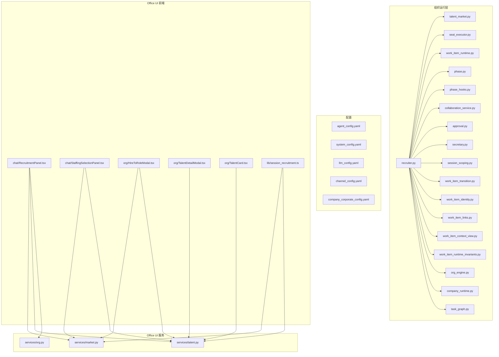
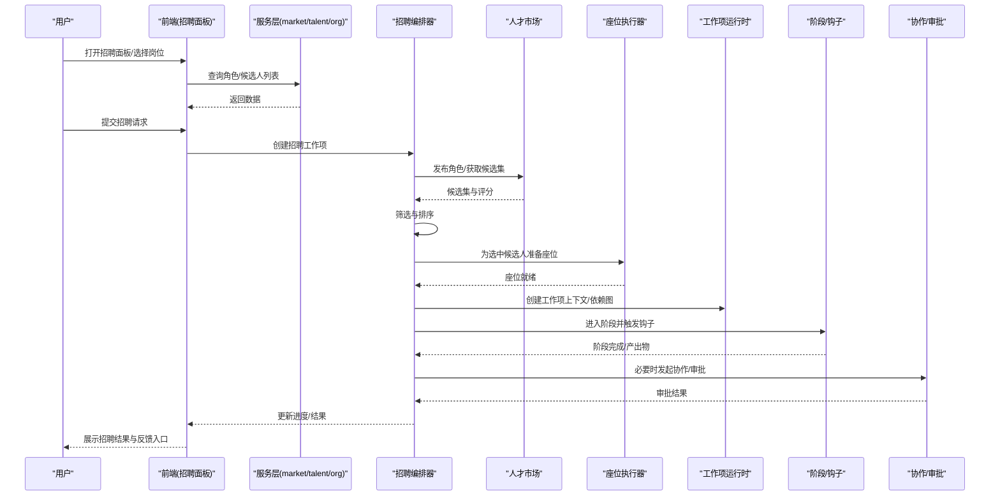
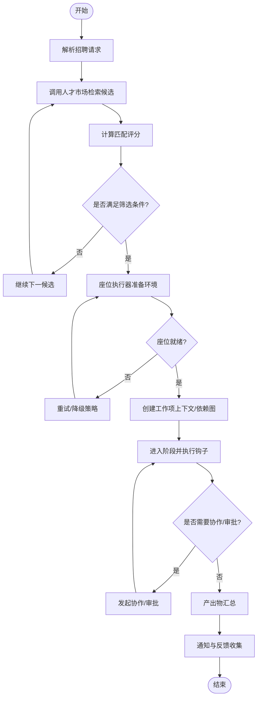
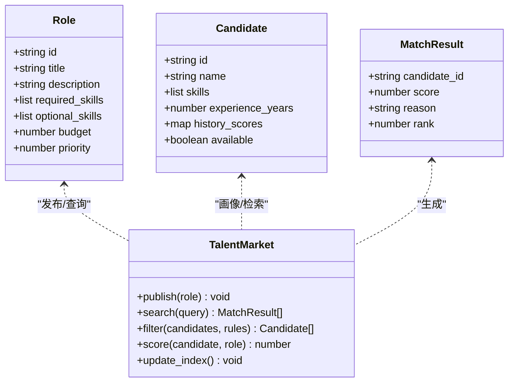
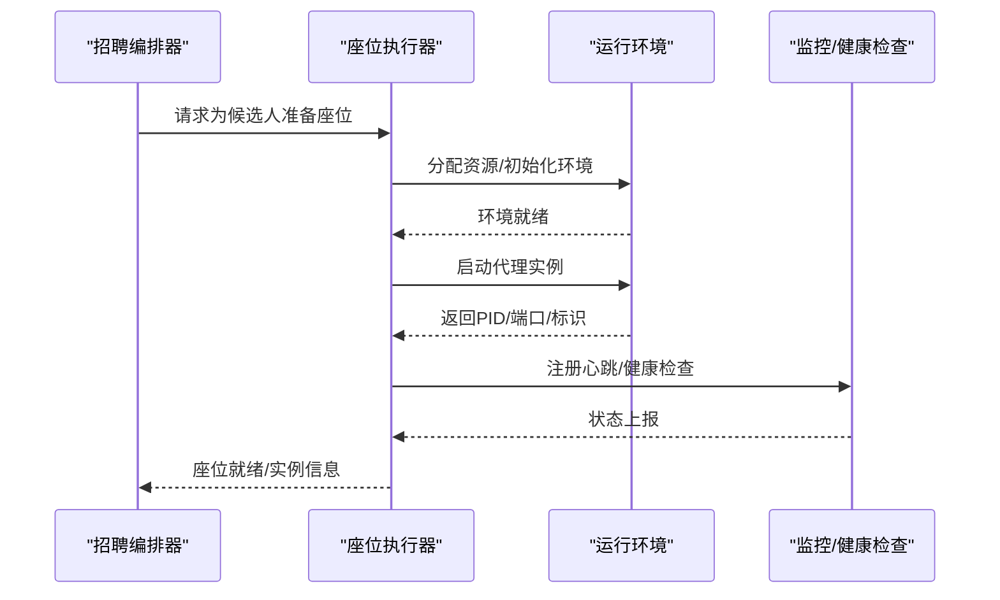
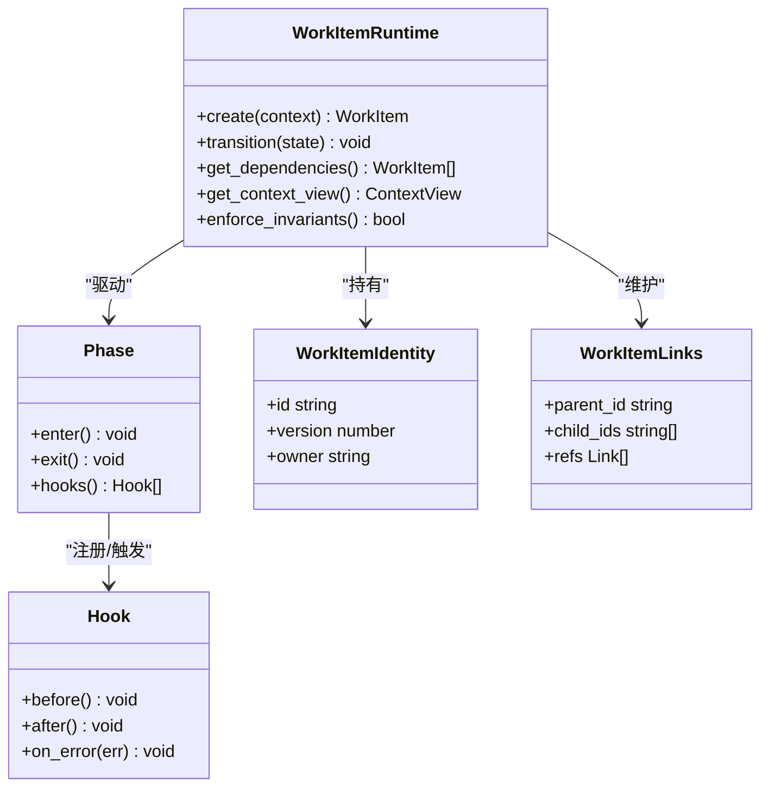
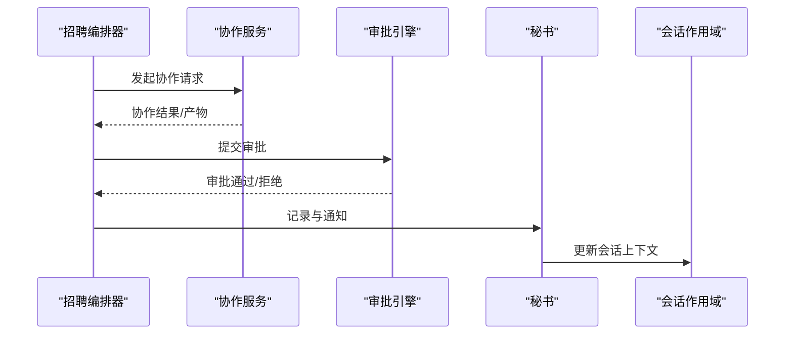
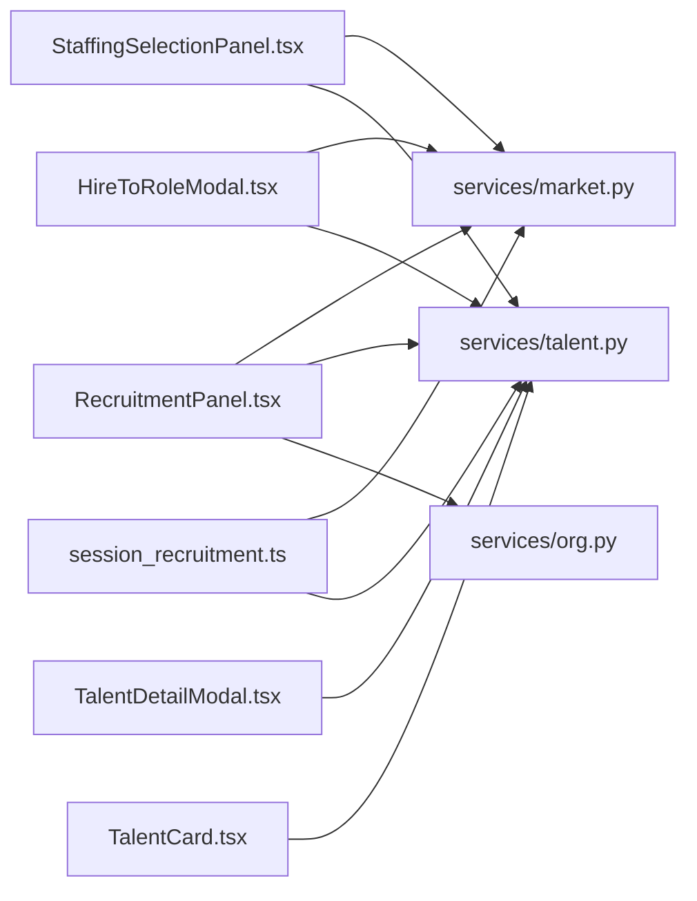
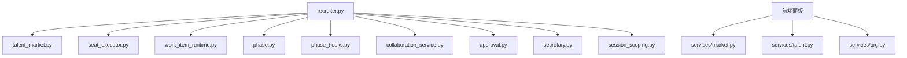

# 招聘系统

<cite>
**本文引用的文件**   
- [recruiter.py](file://opc/layer2_organization/recruiter.py)
- [talent_market.py](file://opc/layer2_organization/talent_market.py)
- [seat_executor.py](file://opc/layer2_organization/seat_executor.py)
- [org_engine.py](file://opc/layer2_organization/org_engine.py)
- [company_runtime.py](file://opc/layer2_organization/company_runtime.py)
- [work_item_runtime.py](file://opc/layer2_organization/work_item_runtime.py)
- [task_graph.py](file://opc/layer2_organization/task_graph.py)
- [phase.py](file://opc/layer2_organization/phase.py)
- [phase_hooks.py](file://opc/layer2_organization/phase_hooks.py)
- [collaboration_service.py](file://opc/layer2_organization/collaboration_service.py)
- [approval.py](file://opc/layer2_organization/approval.py)
- [secretary.py](file://opc/layer2_organization/secretary.py)
- [session_scoping.py](file://opc/layer2_organization/session_scoping.py)
- [work_item_transition.py](file://opc/layer2_organization/work_item_transition.py)
- [work_item_identity.py](file://opc/layer2_organization/work_item_identity.py)
- [work_item_links.py](file://opc/layer2_organization/work_item_links.py)
- [work_item_context_view.py](file://opc/layer2_organization/work_item_context_view.py)
- [work_item_runtime_invariants.py](file://opc/layer2_organization/work_item_runtime_invariants.py)
- [agent_config.yaml](file://config/agent_config.yaml)
- [system_config.yaml](file://config/system_config.yaml)
- [llm_config.yaml](file://config/llm_config.yaml)
- [channel_config.yaml](file://config/channel_config.yaml)
- [company_corporate_config.yaml](file://config/company_corporate_config.yaml)
- [RecruitmentPanel.tsx](file://opc/plugins/office_ui/frontend_src/chat/RecruitmentPanel.tsx)
- [StaffingSelectionPanel.tsx](file://opc/plugins/office_ui/frontend_src/chat/StaffingSelectionPanel.tsx)
- [HireToRoleModal.tsx](file://opc/plugins/office_ui/frontend_src/org/HireToRoleModal.tsx)
- [TalentDetailModal.tsx](file://opc/plugins/office_ui/frontend_src/org/TalentDetailModal.tsx)
- [TalentCard.tsx](file://opc/plugins/office_ui/frontend_src/org/TalentCard.tsx)
- [market.py](file://opc/plugins/office_ui/services/market.py)
- [talent.py](file://opc/plugins/office_ui/services/talent.py)
- [org.py](file://opc/plugins/office_ui/services/org.py)
- [session_recruitment.ts](file://opc/plugins/office_ui/frontend_src/lib/session_recruitment.ts)
- [test_company_recruiter.py](file://tests/test_company_recruiter.py)
- [test_talent_hire_handler.py](file://tests/test_talent_hire_handler.py)
</cite>

## 目录
1. [简介](#简介)
2. [项目结构](#项目结构)
3. [核心组件](#核心组件)
4. [架构总览](#架构总览)
5. [详细组件分析](#详细组件分析)
6. [依赖关系分析](#依赖关系分析)
7. [性能考虑](#性能考虑)
8. [故障排查指南](#故障排查指南)
9. [结论](#结论)
10. [附录](#附录)

## 简介
本技术文档面向招聘系统的后端与前端实现，系统性阐述AI代理角色的招聘机制、人才市场匹配算法、座位执行器的工作流、策略配置方法、监控与管理界面使用方式、结果评估与反馈机制、组织结构集成与权限控制，以及扩展开发与第三方集成指南。文档以代码级事实为依据，辅以架构图与时序图，帮助读者快速理解并高效使用该系统。

## 项目结构
招聘系统位于组织运行层（layer2_organization）与市场服务（plugins/office_ui/services）之间，通过工作项运行时（work_item_runtime）和阶段管理（phase/phase_hooks）驱动端到端流程；前端提供招聘面板、人才市场与雇佣操作界面，并通过服务层与后端交互。

图表来源
- [recruiter.py](file://opc/layer2_organization/recruiter.py)
- [talent_market.py](file://opc/layer2_organization/talent_market.py)
- [seat_executor.py](file://opc/layer2_organization/seat_executor.py)
- [org_engine.py](file://opc/layer2_organization/org_engine.py)
- [company_runtime.py](file://opc/layer2_organization/company_runtime.py)
- [work_item_runtime.py](file://opc/layer2_organization/work_item_runtime.py)
- [task_graph.py](file://opc/layer2_organization/task_graph.py)
- [phase.py](file://opc/layer2_organization/phase.py)
- [phase_hooks.py](file://opc/layer2_organization/phase_hooks.py)
- [collaboration_service.py](file://opc/layer2_organization/collaboration_service.py)
- [approval.py](file://opc/layer2_organization/approval.py)
- [secretary.py](file://opc/layer2_organization/secretary.py)
- [session_scoping.py](file://opc/layer2_organization/session_scoping.py)
- [work_item_transition.py](file://opc/layer2_organization/work_item_transition.py)
- [work_item_identity.py](file://opc/layer2_organization/work_item_identity.py)
- [work_item_links.py](file://opc/layer2_organization/work_item_links.py)
- [work_item_context_view.py](file://opc/layer2_organization/work_item_context_view.py)
- [work_item_runtime_invariants.py](file://opc/layer2_organization/work_item_runtime_invariants.py)
- [RecruitmentPanel.tsx](file://opc/plugins/office_ui/frontend_src/chat/RecruitmentPanel.tsx)
- [StaffingSelectionPanel.tsx](file://opc/plugins/office_ui/frontend_src/chat/StaffingSelectionPanel.tsx)
- [HireToRoleModal.tsx](file://opc/plugins/office_ui/frontend_src/org/HireToRoleModal.tsx)
- [TalentDetailModal.tsx](file://opc/plugins/office_ui/frontend_src/org/TalentDetailModal.tsx)
- [TalentCard.tsx](file://opc/plugins/office_ui/frontend_src/org/TalentCard.tsx)
- [market.py](file://opc/plugins/office_ui/services/market.py)
- [talent.py](file://opc/plugins/office_ui/services/talent.py)
- [org.py](file://opc/plugins/office_ui/services/org.py)
- [session_recruitment.ts](file://opc/plugins/office_ui/frontend_src/lib/session_recruitment.ts)

章节来源
- [recruiter.py](file://opc/layer2_organization/recruiter.py)
- [talent_market.py](file://opc/layer2_organization/talent_market.py)
- [seat_executor.py](file://opc/layer2_organization/seat_executor.py)
- [org_engine.py](file://opc/layer2_organization/org_engine.py)
- [company_runtime.py](file://opc/layer2_organization/company_runtime.py)
- [work_item_runtime.py](file://opc/layer2_organization/work_item_runtime.py)
- [task_graph.py](file://opc/layer2_organization/task_graph.py)
- [phase.py](file://opc/layer2_organization/phase.py)
- [phase_hooks.py](file://opc/layer2_organization/phase_hooks.py)
- [collaboration_service.py](file://opc/layer2_organization/collaboration_service.py)
- [approval.py](file://opc/layer2_organization/approval.py)
- [secretary.py](file://opc/layer2_organization/secretary.py)
- [session_scoping.py](file://opc/layer2_organization/session_scoping.py)
- [work_item_transition.py](file://opc/layer2_organization/work_item_transition.py)
- [work_item_identity.py](file://opc/layer2_organization/work_item_identity.py)
- [work_item_links.py](file://opc/layer2_organization/work_item_links.py)
- [work_item_context_view.py](file://opc/layer2_organization/work_item_context_view.py)
- [work_item_runtime_invariants.py](file://opc/layer2_organization/work_item_runtime_invariants.py)
- [RecruitmentPanel.tsx](file://opc/plugins/office_ui/frontend_src/chat/RecruitmentPanel.tsx)
- [StaffingSelectionPanel.tsx](file://opc/plugins/office_ui/frontend_src/chat/StaffingSelectionPanel.tsx)
- [HireToRoleModal.tsx](file://opc/plugins/office_ui/frontend_src/org/HireToRoleModal.tsx)
- [TalentDetailModal.tsx](file://opc/plugins/office_ui/frontend_src/org/TalentDetailModal.tsx)
- [TalentCard.tsx](file://opc/plugins/office_ui/frontend_src/org/TalentCard.tsx)
- [market.py](file://opc/plugins/office_ui/services/market.py)
- [talent.py](file://opc/plugins/office_ui/services/talent.py)
- [org.py](file://opc/plugins/office_ui/services/org.py)
- [session_recruitment.ts](file://opc/plugins/office_ui/frontend_src/lib/session_recruitment.ts)

## 核心组件
- 招聘编排器：负责发起招聘任务、协调人才市场与座位执行器、维护阶段状态与工作项生命周期。
- 人才市场：维护角色发布、候选人画像、技能标签与匹配评分，支持筛选与推荐。
- 座位执行器：负责资源分配、环境准备、启动管理与运行期隔离。
- 工作项运行时：承载任务上下文、依赖图、阶段钩子、权限与可见性控制。
- 协作与审批：跨代理协作、升级与审批策略。
- 秘书与会话作用域：统一入口、会话边界与上下文裁剪。
- Office UI 服务与前端：提供招聘面板、人才市场浏览、雇佣到角色、人才详情查看等能力。

章节来源
- [recruiter.py](file://opc/layer2_organization/recruiter.py)
- [talent_market.py](file://opc/layer2_organization/talent_market.py)
- [seat_executor.py](file://opc/layer2_organization/seat_executor.py)
- [work_item_runtime.py](file://opc/layer2_organization/work_item_runtime.py)
- [collaboration_service.py](file://opc/layer2_organization/collaboration_service.py)
- [approval.py](file://opc/layer2_organization/approval.py)
- [secretary.py](file://opc/layer2_organization/secretary.py)
- [session_scoping.py](file://opc/layer2_organization/session_scoping.py)
- [RecruitmentPanel.tsx](file://opc/plugins/office_ui/frontend_src/chat/RecruitmentPanel.tsx)
- [staffing_selection_panel.tsx](file://opc/plugins/office_ui/frontend_src/chat/StaffingSelectionPanel.tsx)
- [hire_to_role_modal.tsx](file://opc/plugins/office_ui/frontend_src/org/HireToRoleModal.tsx)
- [talent_detail_modal.tsx](file://opc/plugins/office_ui/frontend_src/org/TalentDetailModal.tsx)
- [talent_card.tsx](file://opc/plugins/office_ui/frontend_src/org/TalentCard.tsx)
- [market.py](file://opc/plugins/office_ui/services/market.py)
- [talent.py](file://opc/plugins/office_ui/services/talent.py)

## 架构总览
招聘系统采用“编排器+市场+执行器”的分层架构。编排器基于工作项运行时与阶段模型驱动流程；人才市场提供角色与候选人的结构化数据与匹配能力；座位执行器负责将选定的候选人实例化到可运行的环境中。前端通过服务层调用后端能力，形成可视化的招聘与雇佣体验。

图表来源
- [recruiter.py](file://opc/layer2_organization/recruiter.py)
- [talent_market.py](file://opc/layer2_organization/talent_market.py)
- [seat_executor.py](file://opc/layer2_organization/seat_executor.py)
- [work_item_runtime.py](file://opc/layer2_organization/work_item_runtime.py)
- [phase.py](file://opc/layer2_organization/phase.py)
- [phase_hooks.py](file://opc/layer2_organization/phase_hooks.py)
- [collaboration_service.py](file://opc/layer2_organization/collaboration_service.py)
- [approval.py](file://opc/layer2_organization/approval.py)
- [RecruitmentPanel.tsx](file://opc/plugins/office_ui/frontend_src/chat/RecruitmentPanel.tsx)
- [market.py](file://opc/plugins/office_ui/services/market.py)
- [talent.py](file://opc/plugins/office_ui/services/talent.py)

## 详细组件分析

### 招聘编排器（recruiter）
- 职责：接收招聘请求，创建并管理工作项，协调人才市场与座位执行器，驱动阶段流转，处理协作与审批，输出结果与反馈。
- 关键流程：
  - 解析输入（岗位描述、约束、预算、优先级）。
  - 调用人才市场进行候选检索与评分。
  - 根据策略进行筛选与排序。
  - 调度座位执行器准备环境与启动。
  - 在工作项运行时中建立上下文、依赖图与阶段钩子。
  - 在需要时发起协作或审批。
  - 收集产出物并回写结果，触发通知与反馈收集。
- 错误与恢复：对失败环节进行重试、降级与回滚，确保工作项一致性。

图表来源
- [recruiter.py](file://opc/layer2_organization/recruiter.py)
- [talent_market.py](file://opc/layer2_organization/talent_market.py)
- [seat_executor.py](file://opc/layer2_organization/seat_executor.py)
- [work_item_runtime.py](file://opc/layer2_organization/work_item_runtime.py)
- [task_graph.py](file://opc/layer2_organization/task_graph.py)
- [phase.py](file://opc/layer2_organization/phase.py)
- [phase_hooks.py](file://opc/layer2_organization/phase_hooks.py)
- [collaboration_service.py](file://opc/layer2_organization/collaboration_service.py)
- [approval.py](file://opc/layer2_organization/approval.py)

章节来源
- [recruiter.py](file://opc/layer2_organization/recruiter.py)
- [work_item_runtime.py](file://opc/layer2_organization/work_item_runtime.py)
- [task_graph.py](file://opc/layer2_organization/task_graph.py)
- [phase.py](file://opc/layer2_organization/phase.py)
- [phase_hooks.py](file://opc/layer2_organization/phase_hooks.py)
- [collaboration_service.py](file://opc/layer2_organization/collaboration_service.py)
- [approval.py](file://opc/layer2_organization/approval.py)

### 人才市场（talent_market）
- 职责：维护角色发布与候选人档案，提供技能标签、经验、偏好等元数据；实现匹配算法与筛选规则；支持批量检索与分页。
- 匹配算法要点：
  - 基于技能标签的相似度计算（如余弦相似度或加权打分）。
  - 结合经验年限、历史绩效、可用性等多维权重。
  - 支持自定义规则注入（例如硬性门槛、加分项、黑名单）。
- 数据结构：
  - 角色定义：标题、描述、必需技能、可选技能、预算、优先级。
  - 候选人画像：ID、姓名、技能集合、经验、历史评价、可用状态。
  - 匹配结果：候选ID、得分、理由、排名。
- 性能优化：
  - 索引与缓存：对常用查询字段建立索引，热点候选缓存。
  - 增量更新：变更事件驱动的数据同步。
  - 并行检索：多源候选聚合与去重。

图表来源
- [talent_market.py](file://opc/layer2_organization/talent_market.py)

章节来源
- [talent_market.py](file://opc/layer2_organization/talent_market.py)

### 座位执行器（seat_executor）
- 职责：为被选中的候选人分配资源、准备运行环境、启动代理实例、管理生命周期与隔离。
- 工作流程：
  - 资源检查与分配（CPU/内存/网络/存储配额）。
  - 环境初始化（依赖安装、密钥注入、沙箱配置）。
  - 启动代理进程或服务，注册心跳与健康检查。
  - 监控运行状态，异常时自动重启或回收。
- 错误处理：
  - 资源不足时的排队与退避。
  - 启动失败的诊断日志与告警。
  - 优雅关闭与清理临时文件。

图表来源
- [seat_executor.py](file://opc/layer2_organization/seat_executor.py)

章节来源
- [seat_executor.py](file://opc/layer2_organization/seat_executor.py)

### 工作项运行时与阶段管理
- 工作项运行时：承载任务上下文、依赖图、版本与快照、权限与可见性、链接与关联。
- 阶段与钩子：定义阶段状态机与钩子点，用于前置校验、后置清理、审计记录。
- 身份与链接：工作项唯一标识、父子关系、上下游依赖、跨会话引用。
- 不变式与视图：保证运行时不变式，提供上下文视图供UI与工具消费。

图表来源
- [work_item_runtime.py](file://opc/layer2_organization/work_item_runtime.py)
- [phase.py](file://opc/layer2_organization/phase.py)
- [phase_hooks.py](file://opc/layer2_organization/phase_hooks.py)
- [work_item_identity.py](file://opc/layer2_organization/work_item_identity.py)
- [work_item_links.py](file://opc/layer2_organization/work_item_links.py)
- [work_item_context_view.py](file://opc/layer2_organization/work_item_context_view.py)
- [work_item_runtime_invariants.py](file://opc/layer2_organization/work_item_runtime_invariants.py)

章节来源
- [work_item_runtime.py](file://opc/layer2_organization/work_item_runtime.py)
- [phase.py](file://opc/layer2_organization/phase.py)
- [phase_hooks.py](file://opc/layer2_organization/phase_hooks.py)
- [work_item_identity.py](file://opc/layer2_organization/work_item_identity.py)
- [work_item_links.py](file://opc/layer2_organization/work_item_links.py)
- [work_item_context_view.py](file://opc/layer2_organization/work_item_context_view.py)
- [work_item_runtime_invariants.py](file://opc/layer2_organization/work_item_runtime_invariants.py)

### 协作与审批
- 协作服务：跨代理通信、消息路由、冲突解决与合并。
- 审批引擎：基于策略的审批链、条件分支、超时与回退。
- 秘书与会话作用域：统一入口、会话边界、上下文裁剪与隐私保护。

图表来源
- [collaboration_service.py](file://opc/layer2_organization/collaboration_service.py)
- [approval.py](file://opc/layer2_organization/approval.py)
- [secretary.py](file://opc/layer2_organization/secretary.py)
- [session_scoping.py](file://opc/layer2_organization/session_scoping.py)

章节来源
- [collaboration_service.py](file://opc/layer2_organization/collaboration_service.py)
- [approval.py](file://opc/layer2_organization/approval.py)
- [secretary.py](file://opc/layer2_organization/secretary.py)
- [session_scoping.py](file://opc/layer2_organization/session_scoping.py)

### Office UI 服务与前端
- 服务层：
  - market.py：角色与候选人的查询、发布、匹配结果获取。
  - talent.py：候选人详情、画像编辑、评价与反馈。
  - org.py：组织架构、团队与权限相关接口。
- 前端：
  - RecruitmentPanel.tsx：招聘面板，展示任务进度、结果与反馈入口。
  - StaffingSelectionPanel.tsx：人员选择面板，辅助决策与批量操作。
  - HireToRoleModal.tsx：将候选人雇佣到指定角色。
  - TalentDetailModal.tsx：候选人详情与历史表现。
  - TalentCard.tsx：人才卡片，快速预览与跳转。
  - session_recruitment.ts：会话内招聘状态与事件桥接。

图表来源
- [RecruitmentPanel.tsx](file://opc/plugins/office_ui/frontend_src/chat/RecruitmentPanel.tsx)
- [StaffingSelectionPanel.tsx](file://opc/plugins/office_ui/frontend_src/chat/StaffingSelectionPanel.tsx)
- [HireToRoleModal.tsx](file://opc/plugins/office_ui/frontend_src/org/HireToRoleModal.tsx)
- [TalentDetailModal.tsx](file://opc/plugins/office_ui/frontend_src/org/TalentDetailModal.tsx)
- [TalentCard.tsx](file://opc/plugins/office_ui/frontend_src/org/TalentCard.tsx)
- [market.py](file://opc/plugins/office_ui/services/market.py)
- [talent.py](file://opc/plugins/office_ui/services/talent.py)
- [org.py](file://opc/plugins/office_ui/services/org.py)
- [session_recruitment.ts](file://opc/plugins/office_ui/frontend_src/lib/session_recruitment.ts)

章节来源
- [RecruitmentPanel.tsx](file://opc/plugins/office_ui/frontend_src/chat/RecruitmentPanel.tsx)
- [StaffingSelectionPanel.tsx](file://opc/plugins/office_ui/frontend_src/chat/StaffingSelectionPanel.tsx)
- [HireToRoleModal.tsx](file://opc/plugins/office_ui/frontend_src/org/HireToRoleModal.tsx)
- [TalentDetailModal.tsx](file://opc/plugins/office_ui/frontend_src/org/TalentDetailModal.tsx)
- [TalentCard.tsx](file://opc/plugins/office_ui/frontend_src/org/TalentCard.tsx)
- [market.py](file://opc/plugins/office_ui/services/market.py)
- [talent.py](file://opc/plugins/office_ui/services/talent.py)
- [org.py](file://opc/plugins/office_ui/services/org.py)
- [session_recruitment.ts](file://opc/plugins/office_ui/frontend_src/lib/session_recruitment.ts)

## 依赖关系分析
- 编排器依赖人才市场与座位执行器，同时与工作项运行时、阶段与钩子紧密耦合。
- 前端通过服务层间接依赖后端编排器与运行时，保持前后端解耦。
- 配置集中管理，影响编排策略、LLM行为、通道与组织模式。

图表来源
- [recruiter.py](file://opc/layer2_organization/recruiter.py)
- [talent_market.py](file://opc/layer2_organization/talent_market.py)
- [seat_executor.py](file://opc/layer2_organization/seat_executor.py)
- [work_item_runtime.py](file://opc/layer2_organization/work_item_runtime.py)
- [phase.py](file://opc/layer2_organization/phase.py)
- [phase_hooks.py](file://opc/layer2_organization/phase_hooks.py)
- [collaboration_service.py](file://opc/layer2_organization/collaboration_service.py)
- [approval.py](file://opc/layer2_organization/approval.py)
- [secretary.py](file://opc/layer2_organization/secretary.py)
- [session_scoping.py](file://opc/layer2_organization/session_scoping.py)
- [RecruitmentPanel.tsx](file://opc/plugins/office_ui/frontend_src/chat/RecruitmentPanel.tsx)
- [market.py](file://opc/plugins/office_ui/services/market.py)
- [talent.py](file://opc/plugins/office_ui/services/talent.py)
- [org.py](file://opc/plugins/office_ui/services/org.py)

章节来源
- [recruiter.py](file://opc/layer2_organization/recruiter.py)
- [talent_market.py](file://opc/layer2_organization/talent_market.py)
- [seat_executor.py](file://opc/layer2_organization/seat_executor.py)
- [work_item_runtime.py](file://opc/layer2_organization/work_item_runtime.py)
- [phase.py](file://opc/layer2_organization/phase.py)
- [phase_hooks.py](file://opc/layer2_organization/phase_hooks.py)
- [collaboration_service.py](file://opc/layer2_organization/collaboration_service.py)
- [approval.py](file://opc/layer2_organization/approval.py)
- [secretary.py](file://opc/layer2_organization/secretary.py)
- [session_scoping.py](file://opc/layer2_organization/session_scoping.py)
- [RecruitmentPanel.tsx](file://opc/plugins/office_ui/frontend_src/chat/RecruitmentPanel.tsx)
- [market.py](file://opc/plugins/office_ui/services/market.py)
- [talent.py](file://opc/plugins/office_ui/services/talent.py)
- [org.py](file://opc/plugins/office_ui/services/org.py)

## 性能考虑
- 人才市场检索：
  - 使用索引与缓存减少重复计算。
  - 对大规模候选集采用分页与惰性加载。
  - 并行聚合多源数据，避免串行瓶颈。
- 座位执行器：
  - 资源池化与复用，降低启动开销。
  - 健康检查与自动重启提升稳定性。
  - 限流与退避防止雪崩。
- 工作项运行时：
  - 依赖图拓扑排序与并行执行。
  - 阶段钩子的幂等设计，便于重试与恢复。
- 前端渲染：
  - 虚拟列表与增量更新，避免大列表卡顿。
  - 事件驱动的局部刷新，减少全量重绘。

[本节为通用性能建议，不直接分析具体文件]

## 故障排查指南
- 常见问题定位：
  - 招聘流程中断：检查工作项状态与阶段钩子日志，确认是否存在未满足的不变式。
  - 匹配结果为空：验证人才市场索引与候选画像完整性，检查筛选规则是否过于严格。
  - 座位启动失败：查看执行器资源配额与环境初始化日志，确认依赖与密钥是否正确注入。
  - 审批阻塞：检查审批策略与超时设置，确认上游协作产物是否齐全。
- 调试手段：
  - 启用更详细的阶段钩子日志与上下文快照。
  - 使用测试用例复现问题路径（参考测试文件）。
  - 通过前端面板观察实时进度与错误提示。

章节来源
- [test_company_recruiter.py](file://tests/test_company_recruiter.py)
- [test_talent_hire_handler.py](file://tests/test_talent_hire_handler.py)

## 结论
招聘系统以编排器为核心，结合人才市场的匹配能力与座位执行器的运行保障，构建了从角色发布、候选筛选、环境准备到运行与反馈的完整闭环。通过工作项运行时与阶段钩子，系统具备良好的可扩展性与可观测性。前端提供了直观的招聘与人才管理界面，配合服务层实现了前后端解耦与灵活定制。

[本节为总结性内容，不直接分析具体文件]

## 附录

### 招聘策略配置与自定义规则
- 配置文件位置与用途：
  - agent_config.yaml：代理行为与能力开关。
  - system_config.yaml：系统级参数（并发、超时、重试）。
  - llm_config.yaml：大模型提供商与上下文窗口设置。
  - channel_config.yaml：通道接入与路由策略。
  - company_corporate_config.yaml：公司模式与组织策略。
- 自定义规则建议：
  - 在人才市场中注入硬门槛与加分项。
  - 在阶段钩子中增加合规校验与审计记录。
  - 在座位执行器中定义资源配额与隔离策略。

章节来源
- [agent_config.yaml](file://config/agent_config.yaml)
- [system_config.yaml](file://config/system_config.yaml)
- [llm_config.yaml](file://config/llm_config.yaml)
- [channel_config.yaml](file://config/channel_config.yaml)
- [company_corporate_config.yaml](file://config/company_corporate_config.yaml)

### 监控与管理界面使用方法
- 招聘面板：
  - 查看任务列表、进度条与阶段状态。
  - 点击候选卡片查看详情与历史表现。
  - 使用雇佣按钮将候选人分配到角色。
- 人才市场：
  - 浏览角色与候选清单，应用筛选与排序。
  - 查看匹配理由与评分依据。
- 反馈与评估：
  - 在交付反馈面板中填写质量评分与建议。
  - 查看历史反馈趋势与改进建议。

章节来源
- [RecruitmentPanel.tsx](file://opc/plugins/office_ui/frontend_src/chat/RecruitmentPanel.tsx)
- [StaffingSelectionPanel.tsx](file://opc/plugins/office_ui/frontend_src/chat/StaffingSelectionPanel.tsx)
- [HireToRoleModal.tsx](file://opc/plugins/office_ui/frontend_src/org/HireToRoleModal.tsx)
- [TalentDetailModal.tsx](file://opc/plugins/office_ui/frontend_src/org/TalentDetailModal.tsx)
- [TalentCard.tsx](file://opc/plugins/office_ui/frontend_src/org/TalentCard.tsx)
- [market.py](file://opc/plugins/office_ui/services/market.py)
- [talent.py](file://opc/plugins/office_ui/services/talent.py)

### 组织结构集成与权限控制
- 组织运行时：
  - 通过公司运行时与组织引擎加载组织结构与策略。
  - 工作项身份与所有权管理确保访问控制。
- 权限模型：
  - 基于角色与团队的细粒度授权。
  - 会话作用域限制上下文可见性。
  - 审批链与升级策略保障关键操作安全。

章节来源
- [org_engine.py](file://opc/layer2_organization/org_engine.py)
- [company_runtime.py](file://opc/layer2_organization/company_runtime.py)
- [work_item_identity.py](file://opc/layer2_organization/work_item_identity.py)
- [session_scoping.py](file://opc/layer2_organization/session_scoping.py)
- [approval.py](file://opc/layer2_organization/approval.py)

### 扩展开发与第三方集成指南
- 扩展点：
  - 在人才市场中注册新的匹配策略与评分函数。
  - 在阶段钩子中插入自定义校验与审计逻辑。
  - 在座位执行器中适配新的运行环境与资源管理器。
- 第三方集成：
  - 通过服务层暴露REST/WebSocket接口供外部系统调用。
  - 使用通道配置接入企业IM与邮件系统。
  - 利用LLM配置对接不同的大模型提供商。

章节来源
- [talent_market.py](file://opc/layer2_organization/talent_market.py)
- [phase_hooks.py](file://opc/layer2_organization/phase_hooks.py)
- [seat_executor.py](file://opc/layer2_organization/seat_executor.py)
- [channel_config.yaml](file://config/channel_config.yaml)
- [llm_config.yaml](file://config/llm_config.yaml)