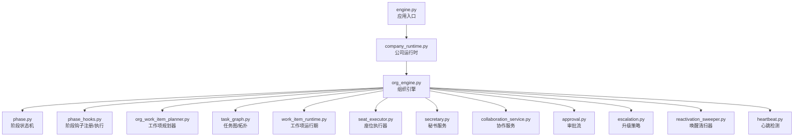
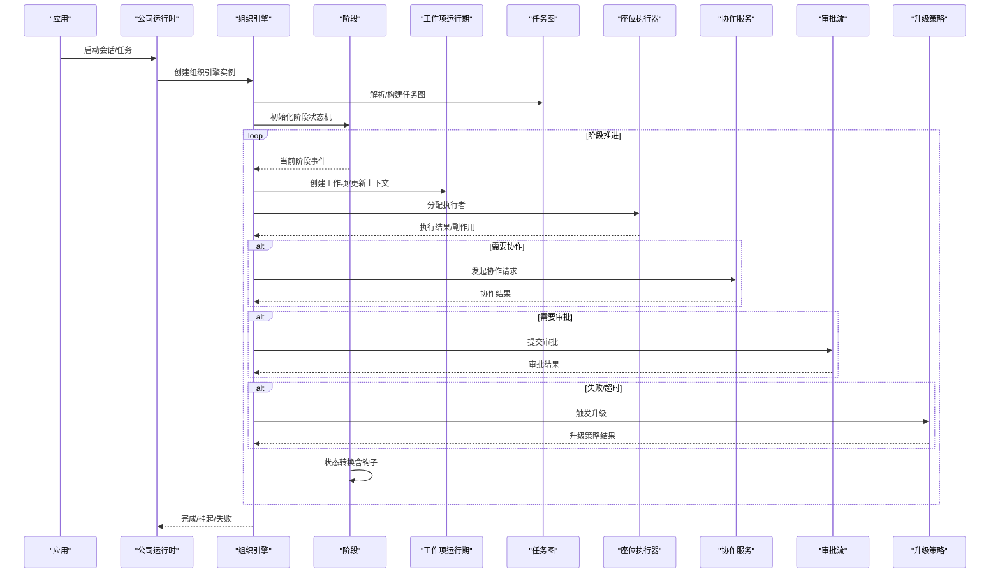
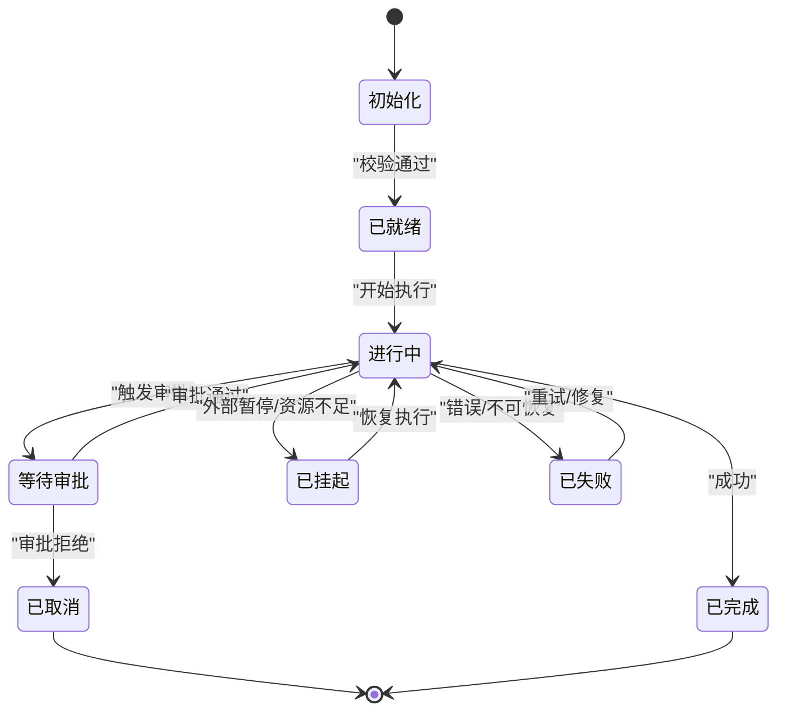
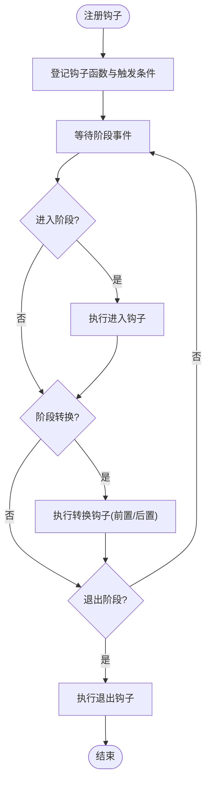
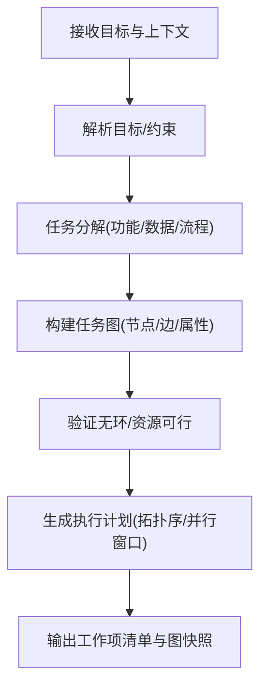
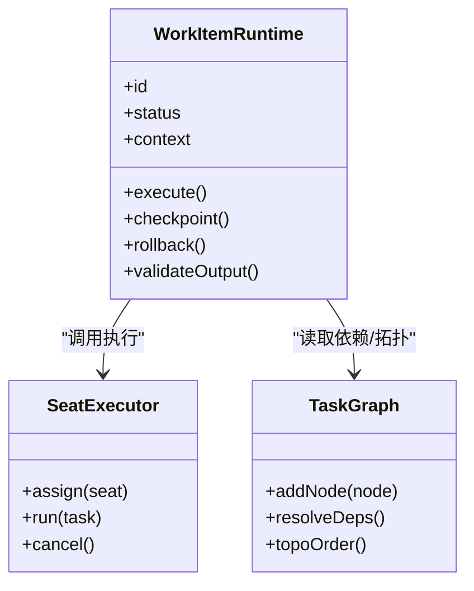
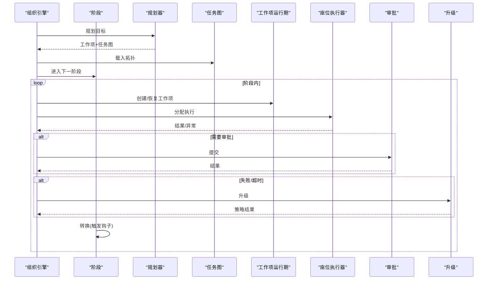
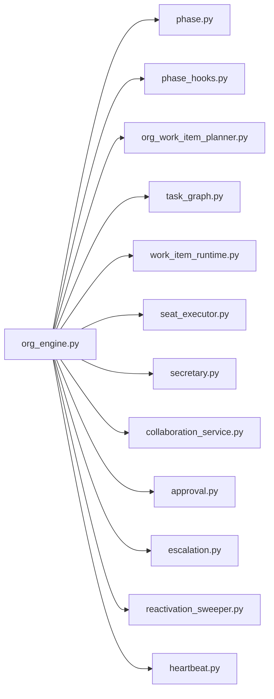

# 组织引擎

<cite>
**本文引用的文件**   
- [org_engine.py](file://opc/layer2_organization/org_engine.py)
- [phase.py](file://opc/layer2_organization/phase.py)
- [phase_hooks.py](file://opc/layer2_organization/phase_hooks.py)
- [org_work_item_planner.py](file://opc/layer2_organization/org_work_item_planner.py)
- [work_item_runtime.py](file://opc/layer2_organization/work_item_runtime.py)
- [task_graph.py](file://opc/layer2_organization/task_graph.py)
- [company_runtime.py](file://opc/layer2_organization/company_runtime.py)
- [seat_executor.py](file://opc/layer2_organization/seat_executor.py)
- [secretary.py](file://opc/layer2_organization/secretary.py)
- [collaboration_service.py](file://opc/layer2_organization/collaboration_service.py)
- [approval.py](file://opc/layer2_organization/approval.py)
- [escalation.py](file://opc/layer2_organization/escalation.py)
- [reactivation_sweeper.py](file://opc/layer2_organization/reactivation_sweeper.py)
- [heartbeat.py](file://opc/layer2_organization/heartbeat.py)
- [org_config.py](file://opc/core/org_config.py)
- [config.py](file://opc/core/config.py)
- [cost_tracker.py](file://opc/layer6_observability/cost_tracker.py)
- [opc_logger.py](file://opc/layer6_observability/opc_logger.py)
- [engine.py](file://opc/engine.py)
- [test_org_concurrency.py](file://tests/test_org_concurrency.py)
- [test_phase_transition_hooks.py](file://tests/test_phase_transition_hooks.py)
- [test_company_reorg.py](file://tests/test_company_reorg.py)
</cite>

## 目录
1. [简介](#简介)
2. [项目结构](#项目结构)
3. [核心组件](#核心组件)
4. [架构总览](#架构总览)
5. [详细组件分析](#详细组件分析)
6. [依赖关系分析](#依赖关系分析)
7. [性能与并发](#性能与并发)
8. [监控与可观测性](#监控与可观测性)
9. [故障诊断与调试](#故障诊断与调试)
10. [结论](#结论)
11. [附录：配置模板与自定义](#附录配置模板与自定义)

## 简介
本技术文档聚焦于“组织引擎”（Organization Engine），围绕其调度机制、工作编排、阶段（Phase）生命周期、阶段钩子（Phase Hooks）、工作项规划器算法、并发控制与资源管理、监控指标与性能分析，以及调试与故障诊断方法进行系统化说明。目标是帮助读者从高层到代码级全面理解组织引擎如何驱动多角色协作、任务分解与执行闭环。

## 项目结构
组织引擎位于 layer2_organization 模块中，围绕“公司运行时”、“阶段状态机”、“工作项运行期”、“任务图”等关键抽象构建。核心入口由 engine.py 启动，组织引擎在会话/任务上下文中被实例化并协调各子系统。

图表来源
- [engine.py](file://opc/engine.py)
- [company_runtime.py](file://opc/layer2_organization/company_runtime.py)
- [org_engine.py](file://opc/layer2_organization/org_engine.py)
- [phase.py](file://opc/layer2_organization/phase.py)
- [phase_hooks.py](file://opc/layer2_organization/phase_hooks.py)
- [org_work_item_planner.py](file://opc/layer2_organization/org_work_item_planner.py)
- [task_graph.py](file://opc/layer2_organization/task_graph.py)
- [work_item_runtime.py](file://opc/layer2_organization/work_item_runtime.py)
- [seat_executor.py](file://opc/layer2_organization/seat_executor.py)
- [secretary.py](file://opc/layer2_organization/secretary.py)
- [collaboration_service.py](file://opc/layer2_organization/collaboration_service.py)
- [approval.py](file://opc/layer2_organization/approval.py)
- [escalation.py](file://opc/layer2_organization/escalation.py)
- [reactivation_sweeper.py](file://opc/layer2_organization/reactivation_sweeper.py)
- [heartbeat.py](file://opc/layer2_organization/heartbeat.py)

章节来源
- [engine.py](file://opc/engine.py)
- [company_runtime.py](file://opc/layer2_organization/company_runtime.py)
- [org_engine.py](file://opc/layer2_organization/org_engine.py)

## 核心组件
- 组织引擎（org_engine.py）：负责整体调度、阶段推进、工作项生命周期管理与跨组件协调。
- 阶段（phase.py）：定义阶段状态机、转换规则与不变式。
- 阶段钩子（phase_hooks.py）：提供阶段进入/退出/转换的钩子注册与执行框架。
- 工作项规划器（org_work_item_planner.py）：将目标拆解为工作项，生成任务图与依赖关系。
- 工作项运行期（work_item_runtime.py）：承载单个工作项的执行上下文、状态与持久化。
- 任务图（task_graph.py）：维护任务拓扑、依赖解析与执行顺序。
- 座位执行器（seat_executor.py）：按角色/座位分配执行单元，隔离并发边界。
- 秘书服务（secretary.py）：编排跨阶段/跨角色的协作流程。
- 协作服务（collaboration_service.py）：对外暴露协作能力（如评审、同步）。
- 审批流（approval.py）与升级（escalation.py）：处理阻塞型决策与异常升级路径。
- 唤醒清扫器（reactivation_sweeper.py）与心跳（heartbeat.py）：保障长时任务的存活与自愈。

章节来源
- [org_engine.py](file://opc/layer2_organization/org_engine.py)
- [phase.py](file://opc/layer2_organization/phase.py)
- [phase_hooks.py](file://opc/layer2_organization/phase_hooks.py)
- [org_work_item_planner.py](file://opc/layer2_organization/org_work_item_planner.py)
- [work_item_runtime.py](file://opc/layer2_organization/work_item_runtime.py)
- [task_graph.py](file://opc/layer2_organization/task_graph.py)
- [seat_executor.py](file://opc/layer2_organization/seat_executor.py)
- [secretary.py](file://opc/layer2_organization/secretary.py)
- [collaboration_service.py](file://opc/layer2_organization/collaboration_service.py)
- [approval.py](file://opc/layer2_organization/approval.py)
- [escalation.py](file://opc/layer2_organization/escalation.py)
- [reactivation_sweeper.py](file://opc/layer2_organization/reactivation_sweeper.py)
- [heartbeat.py](file://opc/layer2_organization/heartbeat.py)

## 架构总览
组织引擎以“阶段驱动 + 工作项编排”为核心范式。公司运行时初始化后，组织引擎根据输入目标进行规划，产出任务图与工作项；随后通过阶段状态机推进执行，并在关键节点触发钩子与审批/升级策略。

图表来源
- [company_runtime.py](file://opc/layer2_organization/company_runtime.py)
- [org_engine.py](file://opc/layer2_organization/org_engine.py)
- [phase.py](file://opc/layer2_organization/phase.py)
- [work_item_runtime.py](file://opc/layer2_organization/work_item_runtime.py)
- [task_graph.py](file://opc/layer2_organization/task_graph.py)
- [seat_executor.py](file://opc/layer2_organization/seat_executor.py)
- [collaboration_service.py](file://opc/layer2_organization/collaboration_service.py)
- [approval.py](file://opc/layer2_organization/approval.py)
- [escalation.py](file://opc/layer2_organization/escalation.py)

## 详细组件分析

### 阶段（Phase）与生命周期
阶段是组织引擎的最小推进单元，具备明确的状态集合与转换规则。阶段的生命周期包括：初始化、进入、运行、退出、完成/失败。阶段转换需满足不变式约束，并通过钩子扩展行为。

图表来源
- [phase.py](file://opc/layer2_organization/phase.py)

章节来源
- [phase.py](file://opc/layer2_organization/phase.py)

### 阶段钩子（Phase Hooks）注册与执行
阶段钩子用于在阶段进入、退出、转换前后注入逻辑，例如日志记录、指标上报、权限检查、副作用清理等。钩子采用注册表模式，支持按阶段/事件类型过滤与优先级排序。

图表来源
- [phase_hooks.py](file://opc/layer2_organization/phase_hooks.py)
- [phase.py](file://opc/layer2_organization/phase.py)

章节来源
- [phase_hooks.py](file://opc/layer2_organization/phase_hooks.py)
- [test_phase_transition_hooks.py](file://tests/test_phase_transition_hooks.py)

### 工作项规划器（Work Item Planner）
工作项规划器负责将高层目标分解为可执行的工作项，并构建任务图。其设计要点包括：
- 目标解析与约束建模：识别输入、输出、依赖、资源需求与质量门槛。
- 任务分解策略：自上而下拆分（功能/数据/流程维度），自下而上合并（复用与并行度优化）。
- 依赖分析与拓扑排序：基于任务图计算执行序，避免循环依赖。
- 动态重规划：在执行过程中根据反馈调整计划（新增/删除/替换工作项）。

图表来源
- [org_work_item_planner.py](file://opc/layer2_organization/org_work_item_planner.py)
- [task_graph.py](file://opc/layer2_organization/task_graph.py)

章节来源
- [org_work_item_planner.py](file://opc/layer2_organization/org_work_item_planner.py)
- [task_graph.py](file://opc/layer2_organization/task_graph.py)

### 工作项运行期（Work Item Runtime）
工作项运行期承载单个工作项的执行上下文、状态机、副作用与持久化。关键职责包括：
- 上下文装配：加载输入、工具集、权限与环境。
- 执行调度：调用座位执行器或外部代理。
- 结果收敛：聚合输出、校验契约、写入存储。
- 容错与重试：捕获异常、退避重试、回滚副作用。

图表来源
- [work_item_runtime.py](file://opc/layer2_organization/work_item_runtime.py)
- [seat_executor.py](file://opc/layer2_organization/seat_executor.py)
- [task_graph.py](file://opc/layer2_organization/task_graph.py)

章节来源
- [work_item_runtime.py](file://opc/layer2_organization/work_item_runtime.py)
- [seat_executor.py](file://opc/layer2_organization/seat_executor.py)
- [task_graph.py](file://opc/layer2_organization/task_graph.py)

### 组织引擎（Org Engine）调度与编排
组织引擎作为中枢，串联阶段推进、工作项编排、审批/升级、协作与资源管理。典型流程：
- 初始化：加载配置、构建任务图、准备阶段与钩子。
- 规划：调用规划器生成工作项与拓扑。
- 推进：按阶段推进，分发工作项至座位执行器。
- 治理：在关键节点触发审批/升级与协作。
- 收尾：汇总结果、持久化、释放资源。

图表来源
- [org_engine.py](file://opc/layer2_organization/org_engine.py)
- [org_work_item_planner.py](file://opc/layer2_organization/org_work_item_planner.py)
- [task_graph.py](file://opc/layer2_organization/task_graph.py)
- [work_item_runtime.py](file://opc/layer2_organization/work_item_runtime.py)
- [seat_executor.py](file://opc/layer2_organization/seat_executor.py)
- [approval.py](file://opc/layer2_organization/approval.py)
- [escalation.py](file://opc/layer2_organization/escalation.py)

章节来源
- [org_engine.py](file://opc/layer2_organization/org_engine.py)
- [org_work_item_planner.py](file://opc/layer2_organization/org_work_item_planner.py)
- [task_graph.py](file://opc/layer2_organization/task_graph.py)
- [work_item_runtime.py](file://opc/layer2_organization/work_item_runtime.py)
- [seat_executor.py](file://opc/layer2_organization/seat_executor.py)
- [approval.py](file://opc/layer2_organization/approval.py)
- [escalation.py](file://opc/layer2_organization/escalation.py)

### 秘书服务与协作服务
- 秘书服务（secretary.py）：负责跨阶段/跨角色的编排与消息路由，确保信息一致性与时序正确性。
- 协作服务（collaboration_service.py）：提供评审、同步、冲突解决等协作原语，供组织引擎在关键路径调用。

章节来源
- [secretary.py](file://opc/layer2_organization/secretary.py)
- [collaboration_service.py](file://opc/layer2_organization/collaboration_service.py)

### 审批与升级
- 审批（approval.py）：对高风险操作进行前置审批，支持多级审批与条件分支。
- 升级（escalation.py）：当执行失败、超时或违反策略时，自动升级至更高级别或人工介入。

章节来源
- [approval.py](file://opc/layer2_organization/approval.py)
- [escalation.py](file://opc/layer2_organization/escalation.py)

### 唤醒清扫器与心跳
- 唤醒清扫器（reactivation_sweeper.py）：周期性扫描挂起/休眠任务，尝试恢复或清理僵尸任务。
- 心跳（heartbeat.py）：维持活跃信号，辅助健康检查与故障检测。

章节来源
- [reactivation_sweeper.py](file://opc/layer2_organization/reactivation_sweeper.py)
- [heartbeat.py](file://opc/layer2_organization/heartbeat.py)

## 依赖关系分析
组织引擎与各组件之间的耦合关系如下：

图表来源
- [org_engine.py](file://opc/layer2_organization/org_engine.py)
- [phase.py](file://opc/layer2_organization/phase.py)
- [phase_hooks.py](file://opc/layer2_organization/phase_hooks.py)
- [org_work_item_planner.py](file://opc/layer2_organization/org_work_item_planner.py)
- [task_graph.py](file://opc/layer2_organization/task_graph.py)
- [work_item_runtime.py](file://opc/layer2_organization/work_item_runtime.py)
- [seat_executor.py](file://opc/layer2_organization/seat_executor.py)
- [secretary.py](file://opc/layer2_organization/secretary.py)
- [collaboration_service.py](file://opc/layer2_organization/collaboration_service.py)
- [approval.py](file://opc/layer2_organization/approval.py)
- [escalation.py](file://opc/layer2_organization/escalation.py)
- [reactivation_sweeper.py](file://opc/layer2_organization/reactivation_sweeper.py)
- [heartbeat.py](file://opc/layer2_organization/heartbeat.py)

章节来源
- [org_engine.py](file://opc/layer2_organization/org_engine.py)

## 性能与并发
- 并发模型：组织引擎通过“阶段 + 工作项 + 座位执行器”实现细粒度并发控制。同一阶段内的独立工作项可并行执行，阶段间保持有序推进。
- 资源管理：座位执行器负责资源隔离与配额限制，避免热点竞争；任务图提供拓扑约束，减少不必要的等待。
- 吞吐与延迟：通过并行窗口与批处理策略提升吞吐；借助心跳与唤醒清扫器降低长尾延迟。
- 稳定性：审批与升级机制在关键路径引入安全阀，防止错误扩散；工作项运行期支持断点续跑与幂等执行。

章节来源
- [test_org_concurrency.py](file://tests/test_org_concurrency.py)
- [seat_executor.py](file://opc/layer2_organization/seat_executor.py)
- [task_graph.py](file://opc/layer2_organization/task_graph.py)
- [work_item_runtime.py](file://opc/layer2_organization/work_item_runtime.py)
- [heartbeat.py](file://opc/layer2_organization/heartbeat.py)
- [reactivation_sweeper.py](file://opc/layer2_organization/reactivation_sweeper.py)

## 监控与可观测性
- 成本追踪：通过 cost_tracker.py 统计资源消耗与成本，便于预算控制与优化。
- 日志与结构化输出：opc_logger.py 提供统一日志接口，便于检索与审计。
- 指标采集：建议在阶段/工作项/座位执行器等关键路径埋点，收集耗时、成功率、重试次数、队列长度等指标。
- 可视化：结合前端 UI 与服务端指标，形成端到端可观测面板。

章节来源
- [cost_tracker.py](file://opc/layer6_observability/cost_tracker.py)
- [opc_logger.py](file://opc/layer6_observability/opc_logger.py)

## 故障诊断与调试
- 常见问题定位：
  - 阶段卡死：检查阶段钩子是否抛出异常、是否存在未处理的锁或外部依赖超时。
  - 工作项失败：查看工作项运行期的上下文与副作用日志，确认幂等性与重试策略。
  - 并发冲突：审查座位执行器的资源配额与任务图拓扑，避免过度并行导致争用。
  - 审批/升级风暴：评估审批阈值与升级策略，避免误判导致的频繁升级。
- 调试建议：
  - 启用详细日志与结构化追踪，关联阶段/工作项 ID。
  - 使用测试用例复现问题，如阶段转换钩子测试、并发测试与公司重组测试。
  - 利用心跳与唤醒清扫器观察任务健康状态，必要时手动干预恢复。

章节来源
- [test_phase_transition_hooks.py](file://tests/test_phase_transition_hooks.py)
- [test_org_concurrency.py](file://tests/test_org_concurrency.py)
- [test_company_reorg.py](file://tests/test_company_reorg.py)

## 结论
组织引擎以阶段驱动与工作项编排为核心，结合任务图、座位执行器、审批与升级机制，实现了高内聚、低耦合的可扩展调度体系。通过完善的钩子、监控与调试手段，能够在复杂协作场景中保证正确性、稳定性与可观测性。

## 附录：配置模板与自定义
- 组织配置入口：
  - org_config.py：提供组织层面的配置结构与默认值。
  - config.py：系统级配置加载与合并策略。
- 自定义方法：
  - 扩展阶段钩子：在 phase_hooks.py 中注册新的钩子函数，绑定到特定阶段/事件。
  - 自定义工作项规划器：实现新的规划策略，返回工作项与任务图。
  - 自定义座位执行器：实现 seat_executor.py 的接口，适配不同执行环境。
  - 集成审批/升级策略：在 approval.py 与 escalation.py 中扩展策略与规则。
- 配置模板建议：
  - 基础参数：并发度、重试次数、超时时间、资源配额。
  - 阶段策略：进入/退出钩子列表、审批阈值、升级条件。
  - 监控指标：采集点、采样频率、告警阈值。

章节来源
- [org_config.py](file://opc/core/org_config.py)
- [config.py](file://opc/core/config.py)
- [phase_hooks.py](file://opc/layer2_organization/phase_hooks.py)
- [org_work_item_planner.py](file://opc/layer2_organization/org_work_item_planner.py)
- [seat_executor.py](file://opc/layer2_organization/seat_executor.py)
- [approval.py](file://opc/layer2_organization/approval.py)
- [escalation.py](file://opc/layer2_organization/escalation.py)