# 组织管理

<cite>
**本文引用的文件**   
- [company_runtime.py](file://opc/layer2_organization/company_runtime.py)
- [org_engine.py](file://opc/layer2_organization/org_engine.py)
- [work_item_runtime.py](file://opc/layer2_organization/work_item_runtime.py)
- [work_item_transition.py](file://opc/layer2_organization/work_item_transition.py)
- [approval.py](file://opc/layer2_organization/approval.py)
- [recruiter.py](file://opc/layer2_organization/recruiter.py)
- [talent_market.py](file://opc/layer2_organization/talent_market.py)
- [collaboration_service.py](file://opc/layer2_organization/collaboration_service.py)
- [collaboration_policy.py](file://opc/layer2_organization/collaboration_policy.py)
- [task_graph.py](file://opc/layer2_organization/task_graph.py)
- [phase.py](file://opc/layer2_organization/phase.py)
- [phase_hooks.py](file://opc/layer2_organization/phase_hooks.py)
- [seat_executor.py](file://opc/layer2_organization/seat_executor.py)
- [secretary.py](file://opc/layer2_organization/secretary.py)
- [session_scoping.py](file://opc/layer2_organization/session_scoping.py)
- [metadata_ownership.py](file://opc/layer2_organization/metadata_ownership.py)
- [output_contract.py](file://opl/layer2_organization/output_contract.py)
- [prompt_contract.py](file://opc/layer2_organization/prompt_contract.py)
- [active_task_runs.py](file://opc/core/active_task_runs.py)
- [store.py](file://opc/database/store.py)
- [engine.py](file://opc/engine.py)
- [server.py](file://opc/plugins/office_ui/server.py)
- [ws_handler.py](file://opc/plugins/office_ui/ws_handler.py)
- [test_approval_engine.py](file://tests/test_approval_engine.py)
- [test_work_item_transition.py](file://tests/test_work_item_transition.py)
- [test_company_recruiter.py](file://tests/test_company_recruiter.py)
- [test_org_concurrency.py](file://tests/test_org_concurrency.py)
</cite>

## 目录
1. [简介](#简介)
2. [项目结构](#项目结构)
3. [核心组件](#核心组件)
4. [架构总览](#架构总览)
5. [详细组件分析](#详细组件分析)
6. [依赖关系分析](#依赖关系分析)
7. [性能考虑](#性能考虑)
8. [故障诊断指南](#故障诊断指南)
9. [结论](#结论)
10. [附录](#附录)

## 简介
本文件面向OpenOPC“公司模式”下的组织管理系统，聚焦于角色与权限、工作项生命周期、审批流程、招聘与AI代理动态分配、团队协作机制、状态机设计、并发控制与事务管理，以及与现有系统的集成方式。文档以代码级事实为依据，辅以可视化图示，帮助读者从高层到细节全面理解系统行为与扩展点。

## 项目结构
组织管理相关能力集中在 layer2_organization 层，围绕公司运行时（Company Runtime）编排角色、会话与工作项；通过 approval 模块实现多级审批与回滚；通过 recruiter 与 talent_market 完成岗位与人才的匹配与雇佣；协作服务与策略提供跨角色通信与可见性控制；任务图与阶段模型驱动工作项流转；UI插件与服务端桥接对外暴露操作与事件。

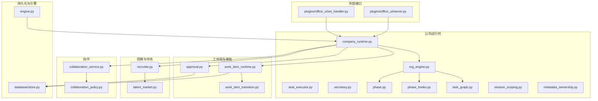

图表来源
- [company_runtime.py](file://opc/layer2_organization/company_runtime.py)
- [org_engine.py](file://opc/layer2_organization/org_engine.py)
- [work_item_runtime.py](file://opc/layer2_organization/work_item_runtime.py)
- [work_item_transition.py](file://opc/layer2_organization/work_item_transition.py)
- [approval.py](file://opc/layer2_organization/approval.py)
- [recruiter.py](file://opc/layer2_organization/recruiter.py)
- [talent_market.py](file://opc/layer2_organization/talent_market.py)
- [collaboration_service.py](file://opc/layer2_organization/collaboration_service.py)
- [collaboration_policy.py](file://opc/layer2_organization/collaboration_policy.py)
- [task_graph.py](file://opc/layer2_organization/task_graph.py)
- [phase.py](file://opc/layer2_organization/phase.py)
- [phase_hooks.py](file://opc/layer2_organization/phase_hooks.py)
- [seat_executor.py](file://opc/layer2_organization/seat_executor.py)
- [secretary.py](file://opc/layer2_organization/secretary.py)
- [session_scoping.py](file://opc/layer2_organization/session_scoping.py)
- [metadata_ownership.py](file://opc/layer2_organization/metadata_ownership.py)
- [store.py](file://opc/database/store.py)
- [engine.py](file://opc/engine.py)
- [server.py](file://opc/plugins/office_ui/server.py)
- [ws_handler.py](file://opc/plugins/office_ui/ws_handler.py)

章节来源
- [company_runtime.py](file://opc/layer2_organization/company_runtime.py)
- [org_engine.py](file://opc/layer2_organization/org_engine.py)
- [work_item_runtime.py](file://opc/layer2_organization/work_item_runtime.py)
- [approval.py](file://opc/layer2_organization/approval.py)
- [recruiter.py](file://opc/layer2_organization/recruiter.py)
- [talent_market.py](file://opc/layer2_organization/talent_market.py)
- [collaboration_service.py](file://opc/layer2_organization/collaboration_service.py)
- [collaboration_policy.py](file://opc/layer2_organization/collaboration_policy.py)
- [task_graph.py](file://opc/layer2_organization/task_graph.py)
- [phase.py](file://opc/layer2_organization/phase.py)
- [phase_hooks.py](file://opc/layer2_organization/phase_hooks.py)
- [seat_executor.py](file://opc/layer2_organization/seat_executor.py)
- [secretary.py](file://opc/layer2_organization/secretary.py)
- [session_scoping.py](file://opc/layer2_organization/session_scoping.py)
- [metadata_ownership.py](file://opc/layer2_organization/metadata_ownership.py)
- [store.py](file://opc/database/store.py)
- [engine.py](file://opc/engine.py)
- [server.py](file://opc/plugins/office_ui/server.py)
- [ws_handler.py](file://opc/plugins/office_ui/ws_handler.py)

## 核心组件
- 公司运行时：统一入口，负责加载组织配置、初始化阶段与任务图、协调工作项与审批、调度座位执行器与秘书代理。
- 工作项运行时：维护工作项状态、上下文视图、链接关系与不变式，驱动状态迁移。
- 审批引擎：支持多级审批、条件分支与回滚，确保关键变更可审计与可撤销。
- 招聘与市场：根据岗位需求在人才市场中匹配并雇佣AI代理，形成临时或长期团队。
- 协作服务与策略：定义跨角色通信协议、可见性与权限策略，支撑会议、评审与协同编辑。
- 阶段与钩子：将工作项生命周期划分为阶段，并通过钩子在进入/退出时执行检查与副作用。
- 任务图：描述工作项间的依赖与拓扑，用于并行度控制与资源调度。
- 座位执行器与秘书：具体执行单元与编排者，负责工具调用、上下文装配与结果收敛。
- 会话范围与元数据所有权：限定作用域与数据归属，避免越权访问与冲突。

章节来源
- [company_runtime.py](file://opc/layer2_organization/company_runtime.py)
- [work_item_runtime.py](file://opc/layer2_organization/work_item_runtime.py)
- [work_item_transition.py](file://opc/layer2_organization/work_item_transition.py)
- [approval.py](file://opc/layer2_organization/approval.py)
- [recruiter.py](file://opc/layer2_organization/recruiter.py)
- [talent_market.py](file://opc/layer2_organization/talent_market.py)
- [collaboration_service.py](file://opc/layer2_organization/collaboration_service.py)
- [collaboration_policy.py](file://opc/layer2_organization/collaboration_policy.py)
- [task_graph.py](file://opc/layer2_organization/task_graph.py)
- [phase.py](file://opc/layer2_organization/phase.py)
- [phase_hooks.py](file://opc/layer2_organization/phase_hooks.py)
- [seat_executor.py](file://opc/layer2_organization/seat_executor.py)
- [secretary.py](file://opc/layer2_organization/secretary.py)
- [session_scoping.py](file://opc/layer2_organization/session_scoping.py)
- [metadata_ownership.py](file://opc/layer2_organization/metadata_ownership.py)

## 架构总览
公司运行时作为中枢，聚合工作项、审批、招聘与协作等子系统，借助阶段与任务图进行编排，并通过UI与服务端对外暴露操作与事件。

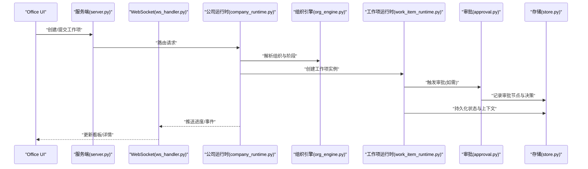

图表来源
- [server.py](file://opc/plugins/office_ui/server.py)
- [ws_handler.py](file://opc/plugins/office_ui/ws_handler.py)
- [company_runtime.py](file://opc/layer2_organization/company_runtime.py)
- [org_engine.py](file://opc/layer2_organization/org_engine.py)
- [work_item_runtime.py](file://opc/layer2_organization/work_item_runtime.py)
- [approval.py](file://opc/layer2_organization/approval.py)
- [store.py](file://opc/database/store.py)

## 详细组件分析

### 工作项生命周期与状态机
工作项从创建、规划、执行、评审到完成/回滚，遵循严格的阶段与迁移规则。迁移由迁移管理器校验不变式并触发钩子，确保一致性。

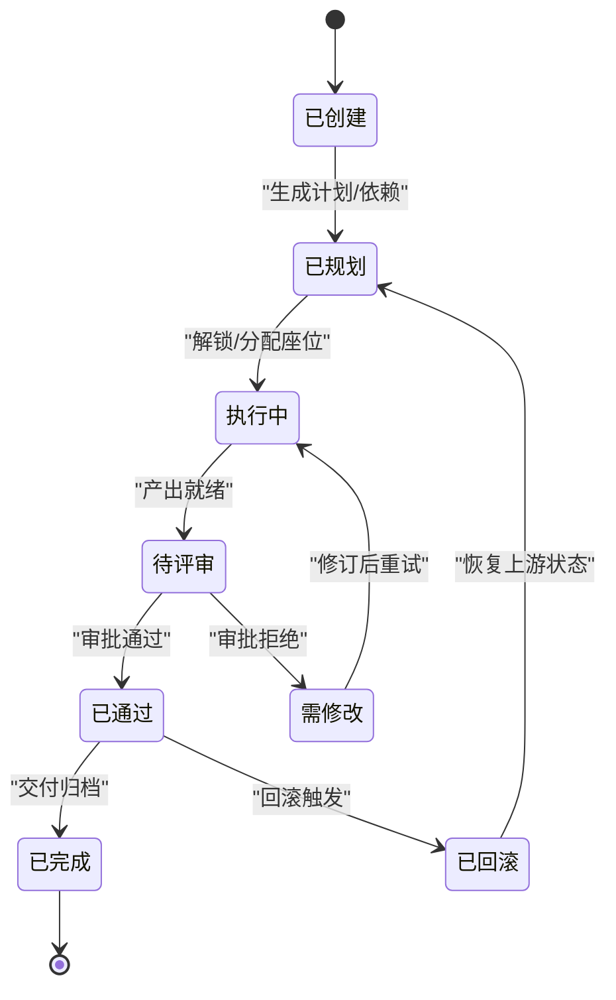

图表来源
- [work_item_runtime.py](file://opc/layer2_organization/work_item_runtime.py)
- [work_item_transition.py](file://opc/layer2_organization/work_item_transition.py)
- [phase.py](file://opc/layer2_organization/phase.py)
- [phase_hooks.py](file://opc/layer2_organization/phase_hooks.py)

章节来源
- [work_item_runtime.py](file://opc/layer2_organization/work_item_runtime.py)
- [work_item_transition.py](file://opc/layer2_organization/work_item_transition.py)
- [phase.py](file://opc/layer2_organization/phase.py)
- [phase_hooks.py](file://opc/layer2_organization/phase_hooks.py)
- [test_work_item_transition.py](file://tests/test_work_item_transition.py)

### 审批流程（多级、条件分支与回滚）
审批引擎在工作项关键路径上插入审批节点，支持多级签核、条件分支与回滚。审批决策写入持久化，并与工作项状态联动。

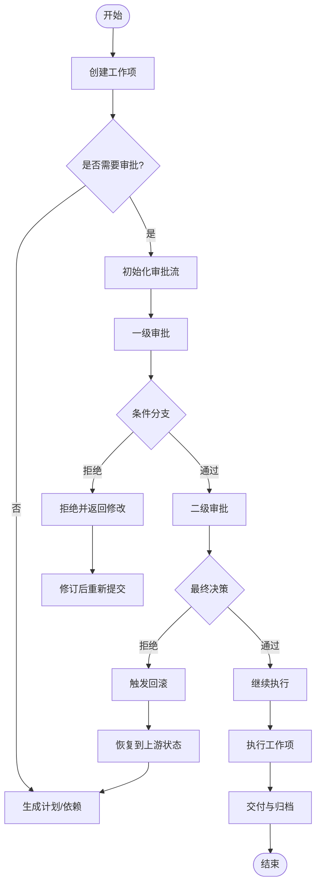

图表来源
- [approval.py](file://opc/layer2_organization/approval.py)
- [work_item_runtime.py](file://opc/layer2_organization/work_item_runtime.py)
- [store.py](file://opc/database/store.py)

章节来源
- [approval.py](file://opc/layer2_organization/approval.py)
- [test_approval_engine.py](file://tests/test_approval_engine.py)
- [work_item_runtime.py](file://opc/layer2_organization/work_item_runtime.py)
- [store.py](file://opc/database/store.py)

### 招聘系统与AI代理动态分配
招聘模块根据岗位画像与技能需求，在人才市场中检索候选代理，结合可用性、负载与历史表现进行匹配与雇佣，形成临时团队或长期席位。

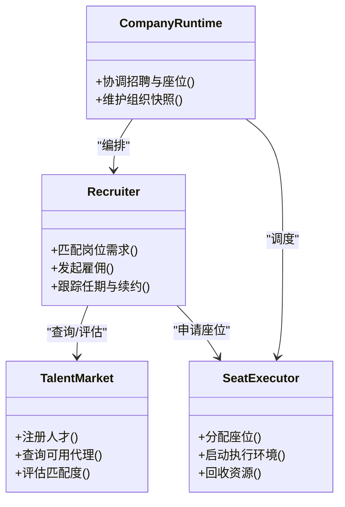

图表来源
- [recruiter.py](file://opc/layer2_organization/recruiter.py)
- [talent_market.py](file://opc/layer2_organization/talent_market.py)
- [seat_executor.py](file://opc/layer2_organization/seat_executor.py)
- [company_runtime.py](file://opc/layer2_organization/company_runtime.py)

章节来源
- [recruiter.py](file://opc/layer2_organization/recruiter.py)
- [talent_market.py](file://opc/layer2_organization/talent_market.py)
- [seat_executor.py](file://opc/layer2_organization/seat_executor.py)
- [test_company_recruiter.py](file://tests/test_company_recruiter.py)

### 团队协作机制（通信、可见性与策略）
协作服务提供跨角色的消息通道、会议与评审能力；协作策略定义可见性、权限与数据隔离，确保最小权限原则与审计追踪。

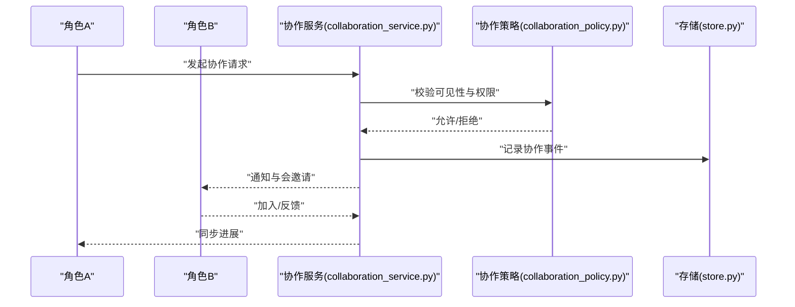

图表来源
- [collaboration_service.py](file://opc/layer2_organization/collaboration_service.py)
- [collaboration_policy.py](file://opc/layer2_organization/collaboration_policy.py)
- [store.py](file://opc/database/store.py)

章节来源
- [collaboration_service.py](file://opc/layer2_organization/collaboration_service.py)
- [collaboration_policy.py](file://opc/layer2_organization/collaboration_policy.py)

### 阶段模型与钩子
阶段将工作项生命周期切分为可管理的片段，钩子在阶段进入/退出时执行前置检查、后置清理与副作用，保证一致性与可观测性。

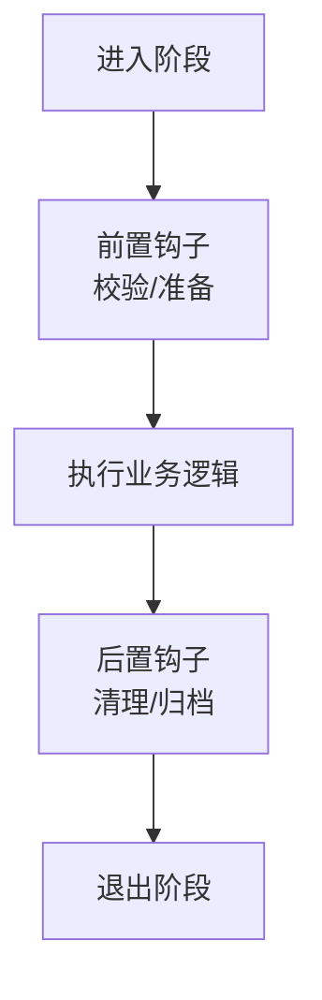

图表来源
- [phase.py](file://opc/layer2_organization/phase.py)
- [phase_hooks.py](file://opc/layer2_organization/phase_hooks.py)

章节来源
- [phase.py](file://opc/layer2_organization/phase.py)
- [phase_hooks.py](file://opc/layer2_organization/phase_hooks.py)

### 任务图与并行度控制
任务图描述工作项之间的依赖关系，用于计算可并行执行的集合、资源占用与瓶颈路径，配合座位执行器进行并发调度。

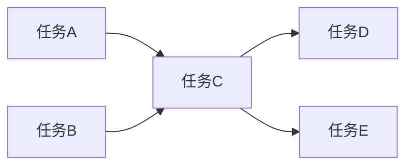

图表来源
- [task_graph.py](file://opc/layer2_organization/task_graph.py)
- [seat_executor.py](file://opc/layer2_organization/seat_executor.py)

章节来源
- [task_graph.py](file://opc/layer2_organization/task_graph.py)
- [seat_executor.py](file://opc/layer2_organization/seat_executor.py)

### 秘书与上下文装配
秘书代理负责上下文装配、提示构建与输出契约校验，确保各阶段的输入输出符合规范，降低错误传播。

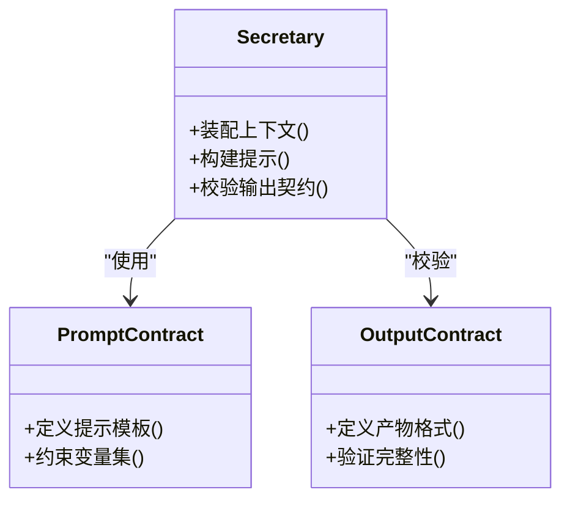

图表来源
- [secretary.py](file://opc/layer2_organization/secretary.py)
- [prompt_contract.py](file://opc/layer2_organization/prompt_contract.py)
- [output_contract.py](file://opc/layer2_organization/output_contract.py)

章节来源
- [secretary.py](file://opc/layer2_organization/secretary.py)
- [prompt_contract.py](file://opc/layer2_organization/prompt_contract.py)
- [output_contract.py](file://opc/layer2_organization/output_contract.py)

### 会话范围与元数据所有权
会话范围限制上下文与作用域，元数据所有权明确数据归属与变更权限，防止越权与冲突。

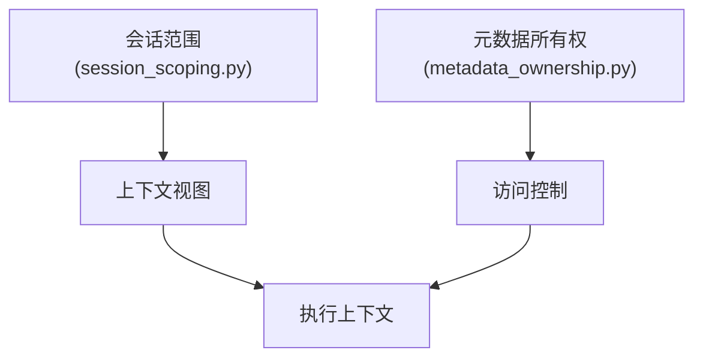

图表来源
- [session_scoping.py](file://opc/layer2_organization/session_scoping.py)
- [metadata_ownership.py](file://opc/layer2_organization/metadata_ownership.py)

章节来源
- [session_scoping.py](file://opc/layer2_organization/session_scoping.py)
- [metadata_ownership.py](file://opc/layer2_organization/metadata_ownership.py)

## 依赖关系分析
- 内聚与耦合：公司运行时高内聚地编排各子系统；工作项运行时与审批、阶段、任务图紧密耦合但职责清晰。
- 直接依赖：工作项运行时依赖迁移管理器与存储；审批引擎依赖存储与事件；招聘模块依赖人才市场与座位执行器。
- 间接依赖：UI与服务端通过公司运行时间接影响工作项与审批；协作服务通过策略影响可见性与权限。
- 外部集成：通过服务端与WebSocket向外部系统推送事件与接收指令。

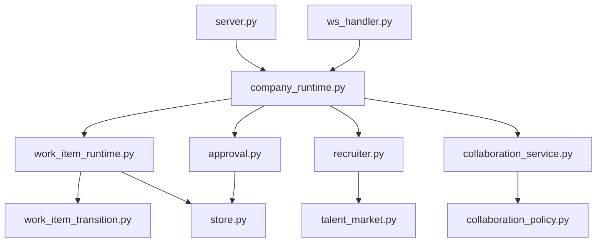

图表来源
- [company_runtime.py](file://opc/layer2_organization/company_runtime.py)
- [work_item_runtime.py](file://opc/layer2_organization/work_item_runtime.py)
- [work_item_transition.py](file://opc/layer2_organization/work_item_transition.py)
- [approval.py](file://opc/layer2_organization/approval.py)
- [recruiter.py](file://opc/layer2_organization/recruiter.py)
- [talent_market.py](file://opc/layer2_organization/talent_market.py)
- [collaboration_service.py](file://opc/layer2_organization/collaboration_service.py)
- [collaboration_policy.py](file://opc/layer2_organization/collaboration_policy.py)
- [store.py](file://opc/database/store.py)
- [server.py](file://opc/plugins/office_ui/server.py)
- [ws_handler.py](file://opc/plugins/office_ui/ws_handler.py)

章节来源
- [company_runtime.py](file://opc/layer2_organization/company_runtime.py)
- [work_item_runtime.py](file://opc/layer2_organization/work_item_runtime.py)
- [approval.py](file://opc/layer2_organization/approval.py)
- [recruiter.py](file://opc/layer2_organization/recruiter.py)
- [collaboration_service.py](file://opc/layer2_organization/collaboration_service.py)
- [store.py](file://opc/database/store.py)
- [server.py](file://opc/plugins/office_ui/server.py)
- [ws_handler.py](file://opc/plugins/office_ui/ws_handler.py)

## 性能考虑
- 并发控制：利用任务图计算最大并行度，结合座位执行器的资源池与限流，避免热点任务阻塞。
- 批处理与压缩：对日志与上下文进行压缩与合并，减少I/O与内存占用。
- 缓存与只读路径：对频繁读取的组织配置与人才画像采用缓存策略，降低重复计算。
- 异步与背压：通过WebSocket与队列解耦UI与服务端，避免突发流量导致雪崩。
- 监控与指标：关注审批耗时、工作项吞吐、座位利用率与错误率，定位瓶颈。

[本节为通用指导，不直接分析具体文件]

## 故障诊断指南
- 常见症状
  - 工作项卡滞：检查阶段钩子是否抛出异常、迁移不变式是否失败。
  - 审批死锁：确认审批链路与条件分支是否正确闭合，是否存在循环依赖。
  - 招聘失败：核对人才市场匹配度阈值与座位可用性。
  - 协作不可见：审查协作策略的可见性与权限配置。
- 定位步骤
  - 查看工作项状态与迁移日志，确认当前阶段与最近一次迁移。
  - 检查审批节点与决策记录，确认是否满足所有条件。
  - 观察座位执行器资源占用与错误堆栈，定位工具调用失败。
  - 通过WebSocket事件回溯UI与服务端交互时序。
- 恢复建议
  - 对卡滞工作项尝试安全回滚至上一稳定阶段。
  - 调整审批条件或升级审批人，解除阻塞。
  - 扩容座位或降级非关键任务，缓解资源压力。

章节来源
- [work_item_transition.py](file://opc/layer2_organization/work_item_transition.py)
- [approval.py](file://opc/layer2_organization/approval.py)
- [recruiter.py](file://opc/layer2_organization/recruiter.py)
- [collaboration_policy.py](file://opc/layer2_organization/collaboration_policy.py)
- [ws_handler.py](file://opc/plugins/office_ui/ws_handler.py)

## 结论
OpenOPC组织管理系统以公司运行为核心，围绕工作项生命周期、审批流程、招聘与协作构建了可扩展的企业级编排平台。通过阶段与钩子、任务图与座位执行器，系统在并发控制与事务一致性方面具备良好基础。结合UI与服务端桥接，可实现端到端的可视化与实时协作。建议在复杂场景中强化监控与回滚策略，持续优化性能与稳定性。

[本节为总结，不直接分析具体文件]

## 附录
- 术语
  - 工作项：代表一项可独立规划与执行的任务单元。
  - 座位：执行环境的抽象，承载具体代理与工具调用。
  - 审批流：包含多级签核与条件分支的决策链路。
  - 人才市场：管理与评估AI代理能力的目录与索引。
- 参考测试
  - 审批引擎行为与边界用例
  - 工作项迁移不变式与回滚场景
  - 招聘流程与座位分配
  - 并发与隔离性

章节来源
- [test_approval_engine.py](file://tests/test_approval_engine.py)
- [test_work_item_transition.py](file://tests/test_work_item_transition.py)
- [test_company_recruiter.py](file://tests/test_company_recruiter.py)
- [test_org_concurrency.py](file://tests/test_org_concurrency.py)