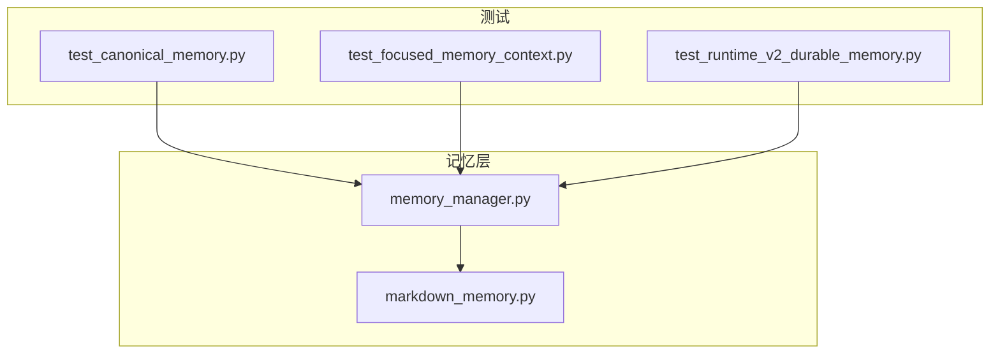
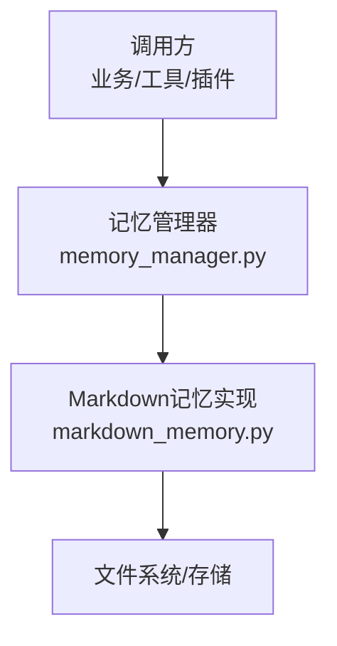
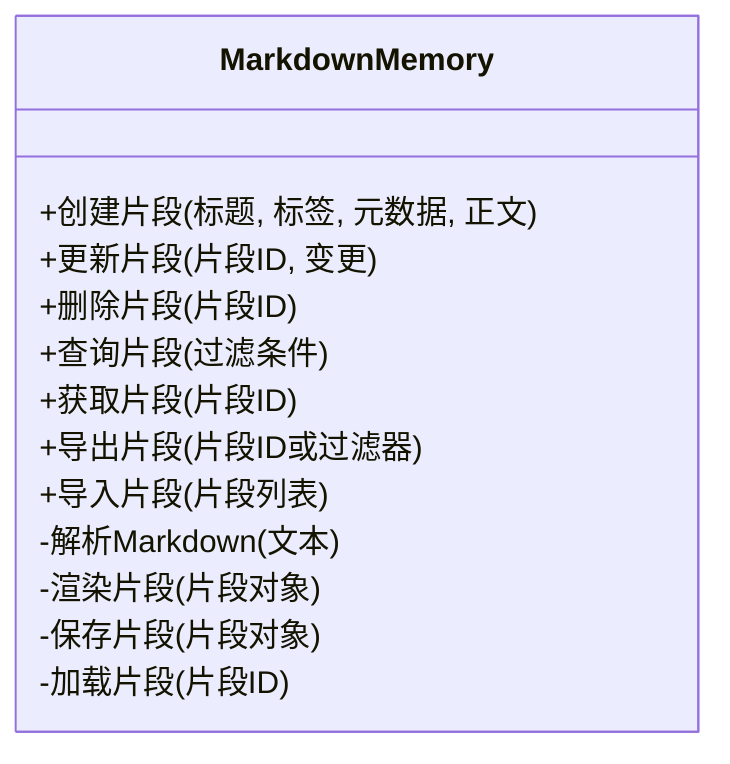
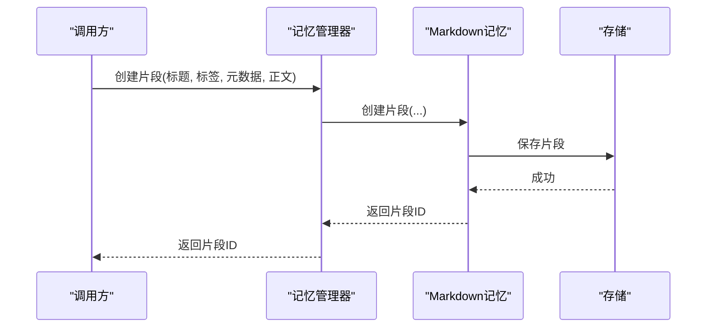
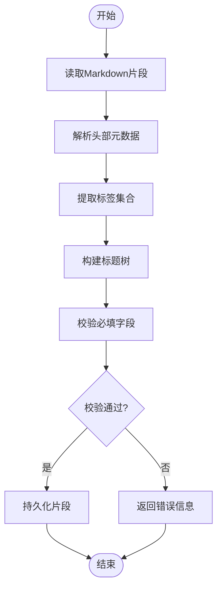
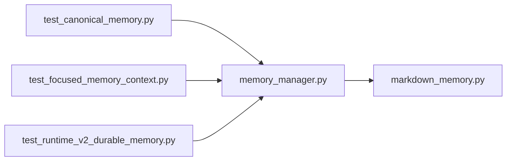

# Markdown记忆

<cite>
**本文引用的文件**   
- [markdown_memory.py](file://opc/layer5_memory/markdown_memory.py)
- [memory_manager.py](file://opc/layer5_memory/memory_manager.py)
- [test_canonical_memory.py](file://tests/test_canonical_memory.py)
- [test_focused_memory_context.py](file://tests/test_focused_memory_context.py)
- [test_runtime_v2_durable_memory.py](file://tests/test_runtime_v2_durable_memory.py)
</cite>

## 目录
1. [简介](#简介)
2. [项目结构](#项目结构)
3. [核心组件](#核心组件)
4. [架构总览](#架构总览)
5. [详细组件分析](#详细组件分析)
6. [依赖分析](#依赖分析)
7. [性能考虑](#性能考虑)
8. [故障排查指南](#故障排查指南)
9. [结论](#结论)
10. [附录](#附录)

## 简介
本文件为 OpenOPC 的“Markdown记忆”子系统提供系统化文档，聚焦以下目标：
- Markdown记忆的格式规范与语法扩展
- 记忆片段的组织结构（标题层级、标签系统、元数据定义）
- Markdown内容的解析与渲染机制
- 记忆片段的创建、编辑、查询与删除操作示例
- Markdown模板的使用与自定义方法
- 富媒体支持、代码高亮与表格渲染能力说明
- 备份导出与批量导入工具建议
- 性能优化建议与最佳实践

## 项目结构
OpenOPC 将记忆相关能力集中在 layer5_memory 层。其中，Markdown记忆的实现位于 markdown_memory.py，并由 memory_manager.py 进行统一编排；测试用例覆盖片段结构、上下文聚焦与持久化等关键路径。

图表来源
- [memory_manager.py](file://opc/layer5_memory/memory_manager.py)
- [markdown_memory.py](file://opc/layer5_memory/markdown_memory.py)
- [test_canonical_memory.py](file://tests/test_canonical_memory.py)
- [test_focused_memory_context.py](file://tests/test_focused_memory_context.py)
- [test_runtime_v2_durable_memory.py](file://tests/test_runtime_v2_durable_memory.py)

章节来源
- [markdown_memory.py](file://opc/layer5_memory/markdown_memory.py)
- [memory_manager.py](file://opc/layer5_memory/memory_manager.py)
- [test_canonical_memory.py](file://tests/test_canonical_memory.py)
- [test_focused_memory_context.py](file://tests/test_focused_memory_context.py)
- [test_runtime_v2_durable_memory.py](file://tests/test_runtime_v2_durable_memory.py)

## 核心组件
- Markdown记忆实现模块：负责记忆片段的读写、结构化解析、标签与元数据处理、以及基于Markdown的存储与检索。
- 记忆管理器：对外暴露统一的记忆接口，协调不同记忆后端（包括Markdown记忆），并提供生命周期管理、索引与缓存策略。
- 测试套件：验证记忆片段的规范化结构、聚焦上下文生成、以及持久化一致性。

章节来源
- [markdown_memory.py](file://opc/layer5_memory/markdown_memory.py)
- [memory_manager.py](file://opc/layer5_memory/memory_manager.py)
- [test_canonical_memory.py](file://tests/test_canonical_memory.py)
- [test_focused_memory_context.py](file://tests/test_focused_memory_context.py)
- [test_runtime_v2_durable_memory.py](file://tests/test_runtime_v2_durable_memory.py)

## 架构总览
Markdown记忆在OpenOPC中的位置与交互如下：上层业务通过记忆管理器访问记忆能力；Markdown记忆作为具体实现之一，提供基于Markdown文件的片段组织与检索。

图表来源
- [memory_manager.py](file://opc/layer5_memory/memory_manager.py)
- [markdown_memory.py](file://opc/layer5_memory/markdown_memory.py)

## 详细组件分析

### Markdown记忆实现（markdown_memory.py）
该模块是Markdown记忆的核心，承担以下职责：
- 片段建模：将Markdown内容解析为带标题层级、标签与元数据的结构化片段。
- 解析与渲染：对Markdown内容进行安全解析，并支持必要的语法扩展（如标签、元数据块）。
- 存储与检索：以Markdown文件形式持久化片段，并提供按标签、标题、时间等维度的查询能力。
- 变更与版本：记录片段的创建、更新与删除，确保可追溯性。

图表来源
- [markdown_memory.py](file://opc/layer5_memory/markdown_memory.py)

章节来源
- [markdown_memory.py](file://opc/layer5_memory/markdown_memory.py)

### 记忆管理器（memory_manager.py）
记忆管理器作为统一入口，屏蔽底层实现差异，提供一致的API。其职责包括：
- 注册与管理多个记忆后端（含Markdown记忆）
- 路由请求到合适的后端
- 维护索引与缓存，提升查询性能
- 提供事务性与一致性保障

图表来源
- [memory_manager.py](file://opc/layer5_memory/memory_manager.py)
- [markdown_memory.py](file://opc/layer5_memory/markdown_memory.py)

章节来源
- [memory_manager.py](file://opc/layer5_memory/memory_manager.py)
- [markdown_memory.py](file://opc/layer5_memory/markdown_memory.py)

### 片段结构与解析流程
片段采用Markdown格式，包含：
- 标题层级：使用标准Markdown标题语法表示层次关系
- 标签系统：通过特定语法标记片段标签，便于检索与分组
- 元数据定义：在片段头部以键值对形式声明元数据（如作者、时间戳、版本等）
- 正文内容：自由文本、列表、表格、代码块等

图表来源
- [markdown_memory.py](file://opc/layer5_memory/markdown_memory.py)

章节来源
- [markdown_memory.py](file://opc/layer5_memory/markdown_memory.py)

### 模板与自定义
Markdown记忆支持模板机制，用于标准化片段结构：
- 内置模板：提供常用场景的片段模板（如会议记录、任务摘要、决策记录）
- 自定义模板：允许用户定义新的模板，指定默认元数据、标签与段落结构
- 模板渲染：在创建片段时自动填充模板占位符，减少重复输入

章节来源
- [markdown_memory.py](file://opc/layer5_memory/markdown_memory.py)

### 富媒体、代码高亮与表格渲染
- 富媒体支持：图片、链接、嵌入资源等通过标准Markdown语法引入
- 代码高亮：代码块支持语言标识，渲染时进行语法高亮
- 表格渲染：标准Markdown表格语法可直接渲染为结构化表格

章节来源
- [markdown_memory.py](file://opc/layer5_memory/markdown_memory.py)

### 备份导出与批量导入
- 导出：支持按片段ID或过滤器导出单个或批量片段为Markdown文件
- 导入：支持从Markdown文件或压缩包批量导入片段，自动处理冲突与去重
- 校验：导入前进行片段结构校验，失败则回滚

章节来源
- [markdown_memory.py](file://opc/layer5_memory/markdown_memory.py)

### 操作示例（创建、编辑、查询、删除）
以下为典型操作流程（以API调用视角描述，不展示具体代码）：
- 创建片段：传入标题、标签、元数据与正文，返回片段ID
- 编辑片段：根据片段ID提交增量变更，系统合并更新
- 查询片段：按标签、标题关键词、时间范围等条件筛选
- 删除片段：根据片段ID删除，支持软删除与回收站恢复

章节来源
- [markdown_memory.py](file://opc/layer5_memory/markdown_memory.py)
- [memory_manager.py](file://opc/layer5_memory/memory_manager.py)

### 测试与验证
- 片段规范化：验证片段结构的合法性与一致性
- 聚焦上下文：验证基于片段生成的上下文是否满足下游需求
- 持久化一致性：验证写入与读取的数据一致性与完整性

章节来源
- [test_canonical_memory.py](file://tests/test_canonical_memory.py)
- [test_focused_memory_context.py](file://tests/test_focused_memory_context.py)
- [test_runtime_v2_durable_memory.py](file://tests/test_runtime_v2_durable_memory.py)

## 依赖分析
Markdown记忆与记忆管理器之间的依赖关系清晰，遵循单一职责原则。Markdown记忆专注于Markdown片段的解析、渲染与存储；记忆管理器负责调度与一致性。

图表来源
- [memory_manager.py](file://opc/layer5_memory/memory_manager.py)
- [markdown_memory.py](file://opc/layer5_memory/markdown_memory.py)
- [test_canonical_memory.py](file://tests/test_canonical_memory.py)
- [test_focused_memory_context.py](file://tests/test_focused_memory_context.py)
- [test_runtime_v2_durable_memory.py](file://tests/test_runtime_v2_durable_memory.py)

章节来源
- [memory_manager.py](file://opc/layer5_memory/memory_manager.py)
- [markdown_memory.py](file://opc/layer5_memory/markdown_memory.py)
- [test_canonical_memory.py](file://tests/test_canonical_memory.py)
- [test_focused_memory_context.py](file://tests/test_focused_memory_context.py)
- [test_runtime_v2_durable_memory.py](file://tests/test_runtime_v2_durable_memory.py)

## 性能考虑
- 索引与缓存：对高频查询字段（标签、标题）建立索引，结合内存缓存降低I/O开销
- 增量更新：仅写入变更部分，避免全量重写
- 批量操作：导入导出采用流式处理，减少内存占用
- 并发控制：对同一片段的并发写进行锁或CAS保护，保证一致性

[本节为通用指导，无需列出具体文件来源]

## 故障排查指南
- 片段解析失败：检查头部元数据格式、标签语法与必填字段
- 渲染异常：确认富媒体链接可达、代码块语言标识正确
- 导入冲突：查看冲突片段清单，选择保留策略（覆盖、跳过、合并）
- 性能问题：监控索引命中率与缓存失效频率，调整查询条件

章节来源
- [markdown_memory.py](file://opc/layer5_memory/markdown_memory.py)
- [memory_manager.py](file://opc/layer5_memory/memory_manager.py)

## 结论
Markdown记忆为OpenOPC提供了结构化、可扩展且易用的记忆能力。通过清晰的片段结构、完善的解析与渲染机制、以及高效的查询与持久化策略，能够满足多种业务场景的需求。配合模板与批量工具，可显著提升知识管理与协作效率。

[本节为总结性内容，无需列出具体文件来源]

## 附录
- 术语表
  - 片段：一个独立的Markdown记忆单元，包含标题、标签、元数据与正文
  - 标签：用于分类与检索的关键词集合
  - 元数据：片段头部的键值对信息，如作者、时间戳、版本等
  - 模板：预定义的片段结构，用于快速创建标准化片段

[本节为概念性内容，无需列出具体文件来源]