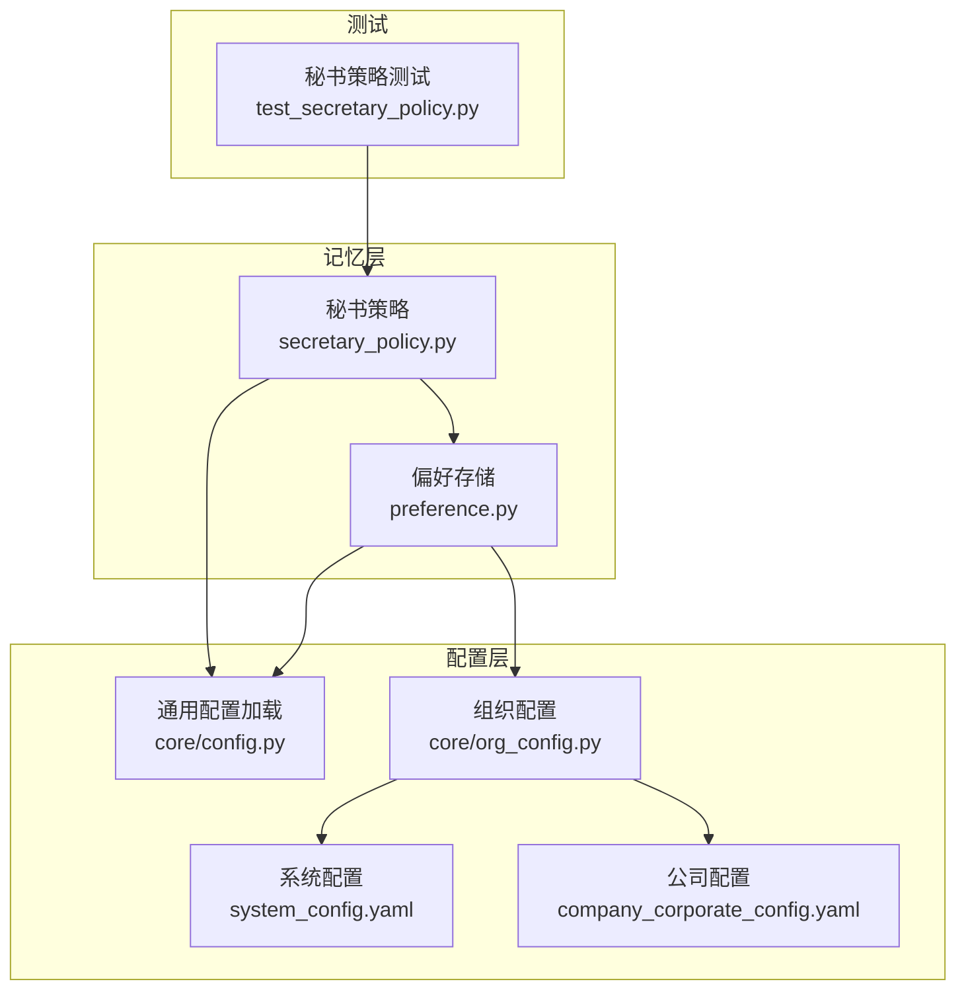
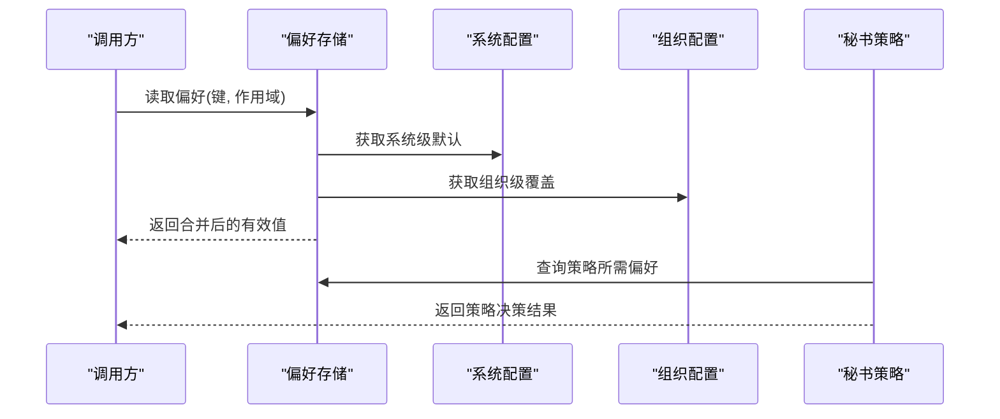
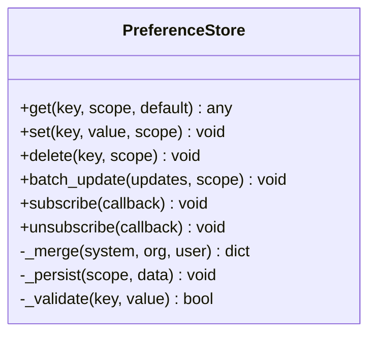
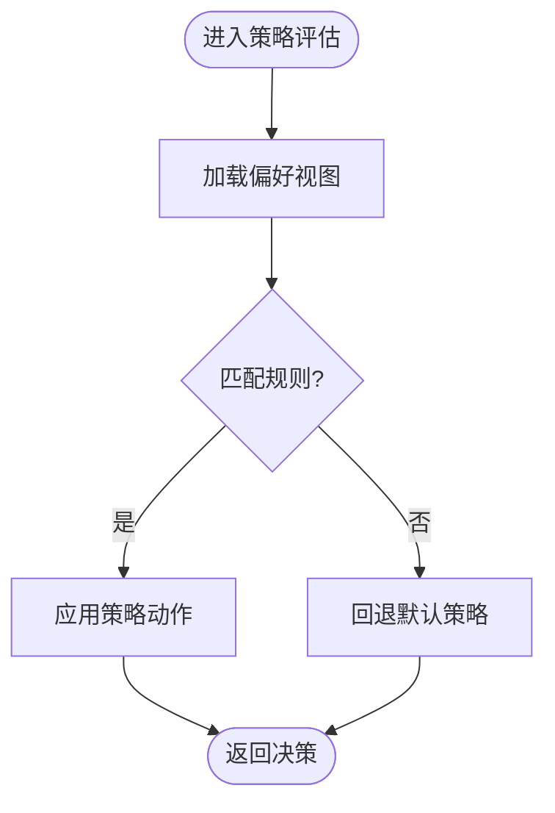
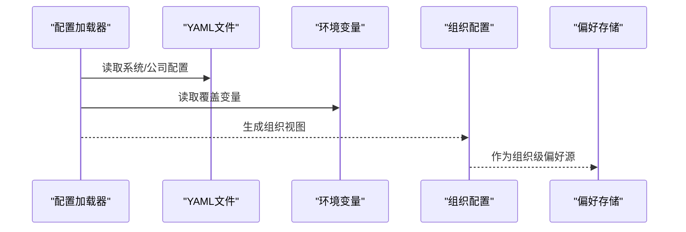
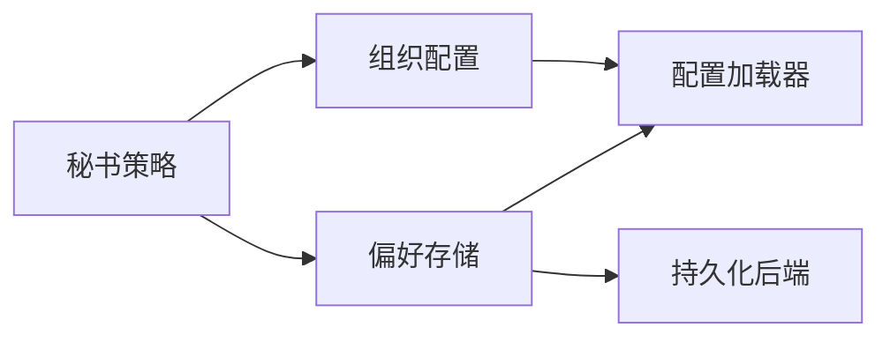

# 偏好设置系统

<cite>
**本文引用的文件**   
- [opc/m5_memory/preference.py](file://opc/layer5_memory/preference.py)
- [opc/layer5_memory/secretary_policy.py](file://opc/layer5_memory/secretary_policy.py)
- [opc/core/config.py](file://opc/core/config.py)
- [opc/core/org_config.py](file://opc/core/org_config.py)
- [config/system_config.yaml](file://config/system_config.yaml)
- [config/company_corporate_config.yaml](file://config/company_corporate_config.yaml)
- [tests/test_secretary_policy.py](file://tests/test_secretary_policy.py)
</cite>

## 目录
1. [简介](#简介)
2. [项目结构](#项目结构)
3. [核心组件](#核心组件)
4. [架构总览](#架构总览)
5. [详细组件分析](#详细组件分析)
6. [依赖关系分析](#依赖关系分析)
7. [性能考虑](#性能考虑)
8. [故障排查指南](#故障排查指南)
9. [结论](#结论)
10. [附录](#附录)

## 简介
本文件面向OpenOPC的“偏好设置系统”，聚焦以下目标：
- 解释偏好设置的层次结构与继承机制（用户、组织、系统）
- 明确优先级规则与合并策略
- 描述秘书策略的配置选项与行为模式
- 提供偏好读写API与使用示例路径
- 说明偏好数据的持久化与同步机制
- 给出验证规则与默认值处理策略
- 提供迁移方案与兼容性处理建议
- 包含个性化推荐与智能配置的实践案例

## 项目结构
偏好设置相关代码主要位于记忆层与配置层，关键文件如下：
- 偏好存储与访问：opc/layer5_memory/preference.py
- 秘书策略：opc/layer5_memory/secretary_policy.py
- 通用配置加载：opc/core/config.py
- 组织配置：opc/core/org_config.py
- 系统级配置样例：config/system_config.yaml、config/company_corporate_config.yaml
- 测试用例：tests/test_secretary_policy.py

图表来源
- [opc/layer5_memory/preference.py](file://opc/layer5_memory/preference.py)
- [opc/layer5_memory/secretary_policy.py](file://opc/layer5_memory/secretary_policy.py)
- [opc/core/config.py](file://opc/core/config.py)
- [opc/core/org_config.py](file://opc/core/org_config.py)
- [config/system_config.yaml](file://config/system_config.yaml)
- [config/company_corporate_config.yaml](file://config/company_corporate_config.yaml)
- [tests/test_secretary_policy.py](file://tests/test_secretary_policy.py)

章节来源
- [opc/layer5_memory/preference.py](file://opc/layer5_memory/preference.py)
- [opc/layer5_memory/secretary_policy.py](file://opc/layer5_memory/secretary_policy.py)
- [opc/core/config.py](file://opc/core/config.py)
- [opc/core/org_config.py](file://opc/core/org_config.py)
- [config/system_config.yaml](file://config/system_config.yaml)
- [config/company_corporate_config.yaml](file://config/company_corporate_config.yaml)
- [tests/test_secretary_policy.py](file://tests/test_secretary_policy.py)

## 核心组件
- 偏好存储模块：负责偏好键空间管理、层级读取、合并与持久化。
- 秘书策略模块：基于偏好进行决策（如任务路由、工具启用、输出风格等）。
- 配置加载器：统一从YAML/环境变量/运行时注入中加载配置。
- 组织配置：将系统与公司维度配置装配为可用视图。

章节来源
- [opc/layer5_memory/preference.py](file://opc/layer5_memory/preference.py)
- [opc/layer5_memory/secretary_policy.py](file://opc/layer5_memory/secretary_policy.py)
- [opc/core/config.py](file://opc/core/config.py)
- [opc/core/org_config.py](file://opc/core/org_config.py)

## 架构总览
偏好系统采用“三层叠加”的层次模型：系统 → 组织 → 用户。读取时按优先级从高到低覆盖，最终形成当前上下文的有效偏好视图。秘书策略消费该视图以驱动行为。

图表来源
- [opc/layer5_memory/preference.py](file://opc/layer5_memory/preference.py)
- [opc/core/config.py](file://opc/core/config.py)
- [opc/core/org_config.py](file://opc/core/org_config.py)
- [opc/layer5_memory/secretary_policy.py](file://opc/layer5_memory/secretary_policy.py)

## 详细组件分析

### 偏好存储（preference.py）
- 职责
  - 维护偏好键空间与作用域（系统、组织、用户）
  - 实现层级读取与合并策略
  - 提供读写接口与批量操作
  - 对接持久化存储（文件/数据库/内存缓存）
- 关键设计点
  - 读取顺序：用户 > 组织 > 系统
  - 合并策略：浅合并或深合并取决于字段类型
  - 默认值：未命中时回退到系统默认
  - 校验：写入前对值进行类型与范围校验
  - 事件：变更触发通知以便上层刷新
- 典型API
  - get(key, scope=None, default=None)
  - set(key, value, scope=None)
  - delete(key, scope=None)
  - batch_update(updates, scope=None)
  - subscribe(callback) / unsubscribe(callback)
- 持久化与同步
  - 写路径：内存缓存 → 异步落盘（防抖/批处理）
  - 读路径：优先内存缓存，缺失则回源加载
  - 冲突解决：最后写入者胜；支持版本戳或时间戳
  - 多实例：通过消息总线或文件锁保证一致性

图表来源
- [opc/layer5_memory/preference.py](file://opc/layer5_memory/preference.py)

章节来源
- [opc/layer5_memory/preference.py](file://opc/layer5_memory/preference.py)

### 秘书策略（secretary_policy.py）
- 职责
  - 基于偏好决定工作项执行策略（如是否自动重试、是否开启协作、输出格式等）
  - 暴露策略查询接口供上层调度器/编排器使用
- 关键设计点
  - 偏好驱动：所有分支逻辑均来源于偏好视图
  - 可插拔：策略规则可按领域扩展
  - 幂等：相同输入产生相同决策
- 典型API
  - query(context, preferences) -> decision
  - evaluate(feature_flag, preferences) -> bool
  - list_available() -> list[str]
- 与偏好系统的交互
  - 读取偏好：在策略评估前拉取必要键
  - 反馈更新：根据运行结果动态调整偏好（可选）

图表来源
- [opc/layer5_memory/secretary_policy.py](file://opc/layer5_memory/secretary_policy.py)
- [opc/layer5_memory/preference.py](file://opc/layer5_memory/preference.py)

章节来源
- [opc/layer5_memory/secretary_policy.py](file://opc/layer5_memory/secretary_policy.py)
- [tests/test_secretary_policy.py](file://tests/test_secretary_policy.py)

### 配置加载与组织配置（core/config.py, core/org_config.py）
- 配置加载器
  - 统一入口：从YAML、环境变量、运行时参数加载
  - 类型转换：字符串→布尔/数字/枚举
  - 校验：必填字段检查、取值范围约束
- 组织配置
  - 将系统与公司维度配置组装为组织视图
  - 提供只读接口供偏好系统作为“组织级”数据源

图表来源
- [opc/core/config.py](file://opc/core/config.py)
- [opc/core/org_config.py](file://opc/core/org_config.py)
- [config/system_config.yaml](file://config/system_config.yaml)
- [config/company_corporate_config.yaml](file://config/company_corporate_config.yaml)

章节来源
- [opc/core/config.py](file://opc/core/config.py)
- [opc/core/org_config.py](file://opc/core/org_config.py)
- [config/system_config.yaml](file://config/system_config.yaml)
- [config/company_corporate_config.yaml](file://config/company_corporate_config.yaml)

## 依赖关系分析
- 低耦合：偏好存储仅依赖配置加载器与持久化后端抽象
- 高内聚：秘书策略内部聚合偏好查询与规则引擎
- 外部依赖：文件系统、消息总线（可选）、配置中心（可选）

图表来源
- [opc/layer5_memory/preference.py](file://opc/layer5_memory/preference.py)
- [opc/layer5_memory/secretary_policy.py](file://opc/layer5_memory/secretary_policy.py)
- [opc/core/config.py](file://opc/core/config.py)
- [opc/core/org_config.py](file://opc/core/org_config.py)

章节来源
- [opc/layer5_memory/preference.py](file://opc/layer5_memory/preference.py)
- [opc/layer5_memory/secretary_policy.py](file://opc/layer5_memory/secretary_policy.py)
- [opc/core/config.py](file://opc/core/config.py)
- [opc/core/org_config.py](file://opc/core/org_config.py)

## 性能考虑
- 缓存策略：偏好视图常驻内存，避免频繁I/O
- 合并优化：增量合并而非全量重建
- 写入批处理：高频更新合并为批次落盘
- 懒加载：按需加载大对象偏好
- 并发安全：读写锁或无锁数据结构保障吞吐

[本节为通用指导，不直接分析具体文件]

## 故障排查指南
- 常见问题
  - 偏好未生效：检查作用域与优先级是否正确
  - 写入失败：确认持久化后端权限与磁盘空间
  - 策略异常：核对偏好键是否存在且类型正确
- 定位步骤
  - 打印偏好视图快照
  - 查看写入日志与错误码
  - 回放最近一次合并过程
- 恢复手段
  - 重置某作用域偏好
  - 回滚到上一版本快照
  - 禁用问题策略并降级

章节来源
- [tests/test_secretary_policy.py](file://tests/test_secretary_policy.py)

## 结论
偏好设置系统通过清晰的层次结构与严格的优先级规则，为秘书策略提供了稳定、可预测的配置基础。配合统一的配置加载与组织装配，系统在可扩展性、一致性与性能之间取得良好平衡。

[本节为总结性内容，不直接分析具体文件]

## 附录

### 层次结构与继承机制
- 层次：系统 → 组织 → 用户
- 继承：下层覆盖上层同名键；未定义键向上查找
- 合并：按字段类型选择浅/深合并

章节来源
- [opc/layer5_memory/preference.py](file://opc/layer5_memory/preference.py)
- [opc/core/org_config.py](file://opc/core/org_config.py)

### 优先级规则
- 读取顺序：用户 > 组织 > 系统
- 冲突解决：后者优先；支持版本戳/时间戳
- 默认值：系统层提供兜底默认

章节来源
- [opc/layer5_memory/preference.py](file://opc/layer5_memory/preference.py)

### 秘书策略配置选项与行为模式
- 常见选项
  - 自动重试次数、超时阈值
  - 协作开关、审批门槛
  - 输出格式、语言偏好
- 行为模式
  - 条件分支由偏好驱动
  - 可观测：记录策略决策原因
  - 可回滚：支持热切换策略

章节来源
- [opc/layer5_memory/secretary_policy.py](file://opc/layer5_memory/secretary_policy.py)
- [tests/test_secretary_policy.py](file://tests/test_secretary_policy.py)

### 偏好读写API与使用示例
- 读取
  - 单键读取：get(key, scope, default)
  - 批量读取：按作用域拉取子树
- 写入
  - 单键写入：set(key, value, scope)
  - 批量更新：batch_update(updates, scope)
- 订阅
  - 监听偏好变更事件，刷新UI或缓存
- 示例路径
  - 参考测试用例中的用法模式

章节来源
- [opc/layer5_memory/preference.py](file://opc/layer5_memory/preference.py)
- [tests/test_secretary_policy.py](file://tests/test_secretary_policy.py)

### 持久化与同步机制
- 存储后端
  - 文件：JSON/YAML快照
  - 数据库：结构化表+索引
  - 内存：进程内缓存
- 同步策略
  - 本地优先，异步落盘
  - 冲突检测与合并
  - 可选的消息总线广播

章节来源
- [opc/layer5_memory/preference.py](file://opc/layer5_memory/preference.py)

### 验证规则与默认值处理
- 验证
  - 类型校验、范围校验、必填校验
  - 自定义校验钩子
- 默认值
  - 系统层集中定义
  - 分层覆盖，保持最小侵入

章节来源
- [opc/layer5_memory/preference.py](file://opc/layer5_memory/preference.py)
- [opc/core/config.py](file://opc/core/config.py)

### 迁移方案与兼容性处理
- 版本化
  - 偏好键命名带版本前缀
  - 迁移脚本在启动时执行
- 兼容
  - 旧键到新键映射
  - 灰度期双写双读
- 回滚
  - 保留历史快照
  - 一键回滚到指定版本

章节来源
- [opc/layer5_memory/preference.py](file://opc/layer5_memory/preference.py)
- [config/system_config.yaml](file://config/system_config.yaml)

### 个性化推荐与智能配置实践
- 场景
  - 基于用户历史偏好推荐默认值
  - 结合组织规范自动生成策略
- 方法
  - 统计常用键值分布
  - 规则引擎+机器学习辅助
- 落地
  - 在偏好初始化阶段注入推荐
  - 提供人工确认与一键采纳

章节来源
- [opc/layer5_memory/preference.py](file://opc/layer5_memory/preference.py)
- [opc/layer5_memory/secretary_policy.py](file://opc/layer5_memory/secretary_policy.py)