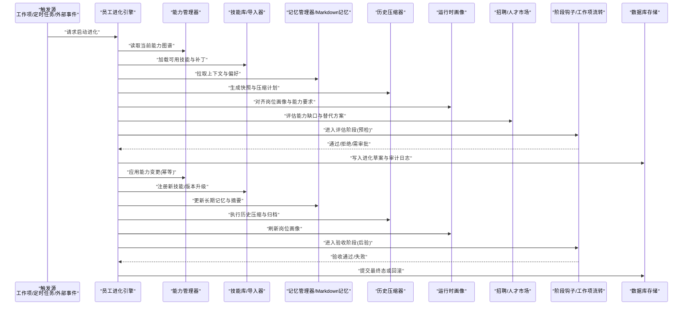
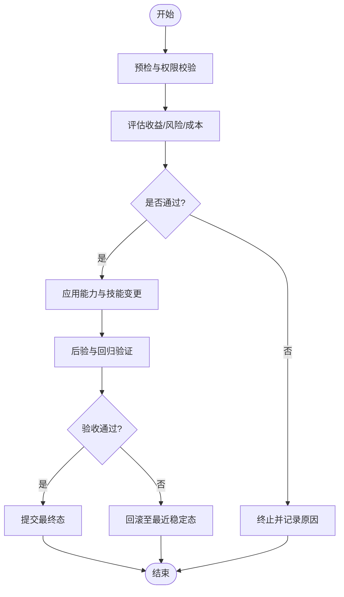
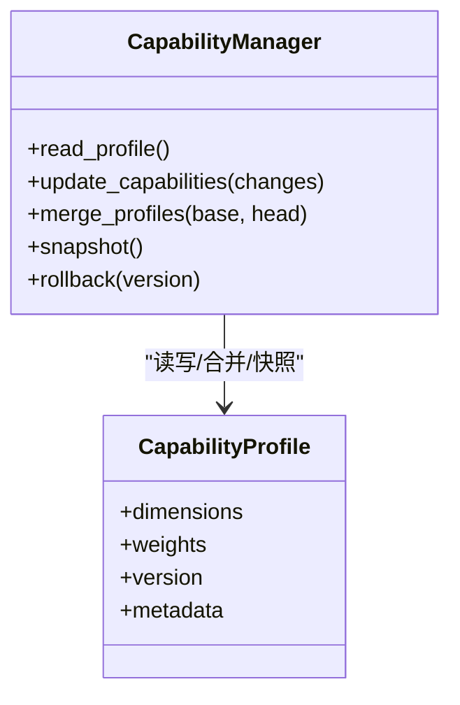
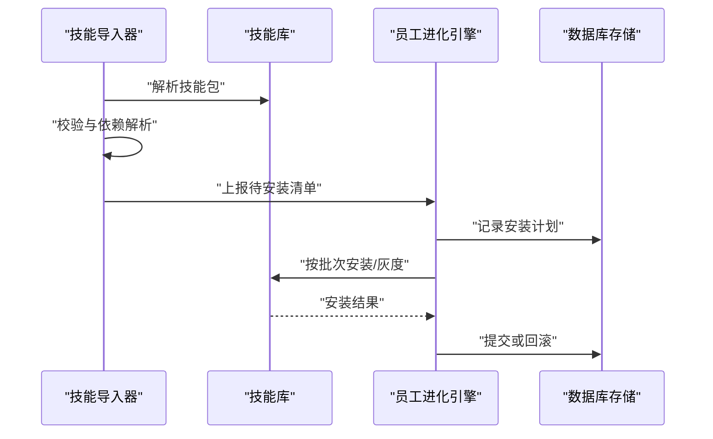
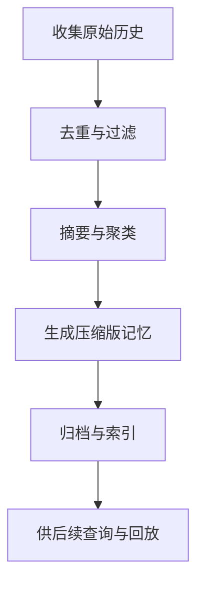
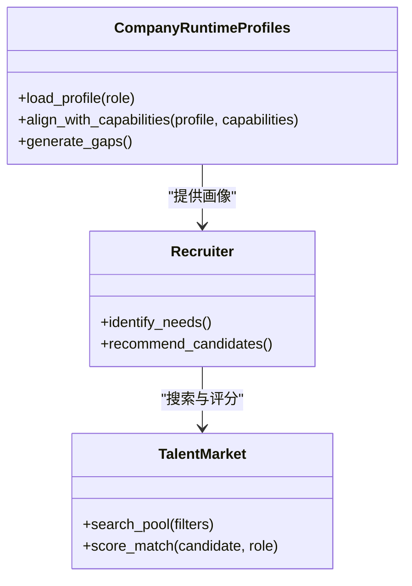
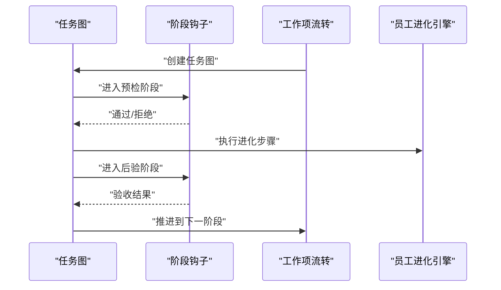
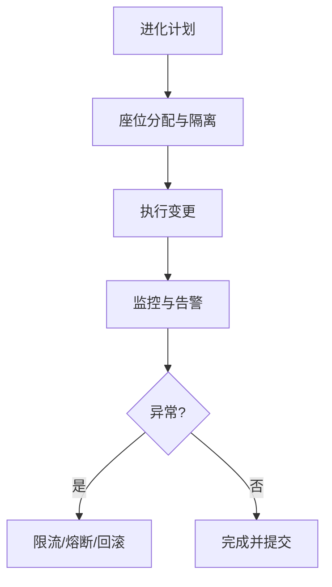
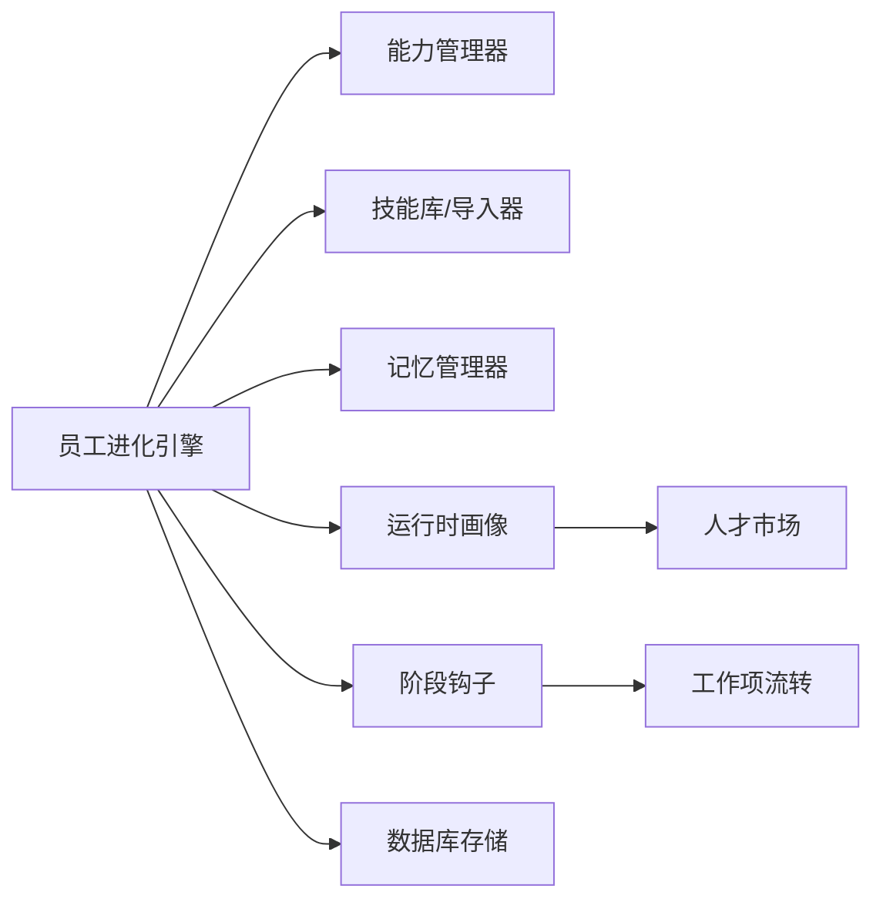

# 员工进化

<cite>
**本文引用的文件**   
- [employee_evolution.py](file://opc/layer5_memory/employee_evolution.py)
- [capability_manager.py](file://opc/layer5_memory/capability_manager.py)
- [skill_library.py](file://opc/layer5_memory/skill_library.py)
- [skill_importer.py](file://opc/layer5_memory/skill_importer.py)
- [memory_manager.py](file://opc/layer5_memory/memory_manager.py)
- [history_compactor.py](file://opc/layer5_memory/history_compactor.py)
- [company_runtime_profiles.py](file://opc/layer2_organization/company_runtime_profiles.py)
- [recruiter.py](file://opc/layer2_organization/recruiter.py)
- [talent_market.py](file://opc/layer2_organization/talent_market.py)
- [org_engine.py](file://opc/layer2_organization/org_engine.py)
- [work_item_transition.py](file://opc/layer2_organization/work_item_transition.py)
- [phase_hooks.py](file://opc/layer2_organization/phase_hooks.py)
- [task_graph.py](file://opc/layer2_organization/task_graph.py)
- [seat_executor.py](file://opc/layer2_organization/seat_executor.py)
- [reorg_manager.py](file://opc/layer2_organization/reorg_manager.py)
- [approval.py](file://opc/layer2_organization/approval.py)
- [collaboration_policy.py](file://opc/layer2_organization/collaboration_policy.py)
- [output_contract.py](file://opl/layer2_organization/output_contract.py)
- [prompt_contract.py](file://opl/layer2_organization/prompt_contract.py)
- [store.py](file://opc/database/store.py)
- [markdown_memory.py](file://opc/layer5_memory/markdown_memory.py)
- [preference.py](file://opc/layer5_memory/preference.py)
- [agent_config.yaml](file://config/agent_config.yaml)
- [system_config.yaml](file://config/system_config.yaml)
- [llm_config.yaml](file://config/llm_config.yaml)
</cite>

## 目录
1. [简介](#简介)
2. [项目结构](#项目结构)
3. [核心组件](#核心组件)
4. [架构总览](#架构总览)
5. [详细组件分析](#详细组件分析)
6. [依赖关系分析](#依赖关系分析)
7. [性能考虑](#性能考虑)
8. [故障排查指南](#故障排查指南)
9. [结论](#结论)
10. [附录](#附录)

## 简介
本章节面向OpenOPC“员工进化”能力，系统性阐述：
- 员工进化的概念与触发条件
- 进化算法的实现原理与参数配置
- 员工能力图谱的构建与更新机制
- 进化策略的配置项与行为定制方法
- 进化过程中的数据迁移与状态保持
- 进化结果的评估指标与回滚机制
- 进化日志记录与可视化分析工具
- 大规模部署时的性能优化与并发控制策略

## 项目结构
围绕“员工进化”，代码主要分布在以下层次：
- 记忆层（layer5_memory）：负责能力管理、技能库、历史压缩、偏好等
- 组织运行层（layer2_organization）：负责岗位编排、招聘、人才市场、阶段钩子、工作项流转等
- 数据库层（database）：持久化存储
- 配置层（config）：系统、LLM、Agent相关配置

```mermaid
graph TB
subgraph "记忆层"
EM["employee_evolution.py"]
CM["capability_manager.py"]
SL["skill_library.py"]
SI["skill_importer.py"]
MM["memory_manager.py"]
HC["history_compactor.py"]
MD["markdown_memory.py"]
PR["preference.py"]
end
subgraph "组织运行层"
CRP["company_runtime_profiles.py"]
REC["recruiter.py"]
TM["talent_market.py"]
OE["org_engine.py"]
WT["work_item_transition.py"]
PH["phase_hooks.py"]
TG["task_graph.py"]
SE["seat_executor.py"]
REORG["reorg_manager.py"]
APPR["approval.py"]
COLPOL["collaboration_policy.py"]
OC["output_contract.py"]
PC["prompt_contract.py"]
end
subgraph "数据库层"
ST["store.py"]
end
subgraph "配置层"
AC["agent_config.yaml"]
SC["system_config.yaml"]
LC["llm_config.yaml"]
end
EM --> CM
EM --> SL
EM --> SI
EM --> MM
EM --> HC
EM --> MD
EM --> PR
EM --> ST
EM --> CRP
EM --> REC
EM --> TM
EM --> OE
EM --> WT
EM --> PH
EM --> TG
EM --> SE
EM --> REORG
EM --> APPR
EM --> COLPOL
EM --> OC
EM --> PC
EM --> AC
EM --> SC
EM --> LC
```

图表来源
- [employee_evolution.py](file://opc/layer5_memory/employee_evolution.py)
- [capability_manager.py](file://opc/layer5_memory/capability_manager.py)
- [skill_library.py](file://opc/layer5_memory/skill_library.py)
- [skill_importer.py](file://opc/layer5_memory/skill_importer.py)
- [memory_manager.py](file://opc/layer5_memory/memory_manager.py)
- [history_compactor.py](file://opc/layer5_memory/history_compactor.py)
- [markdown_memory.py](file://opc/layer5_memory/markdown_memory.py)
- [preference.py](file://opc/layer5_memory/preference.py)
- [company_runtime_profiles.py](file://opc/layer2_organization/company_runtime_profiles.py)
- [recruiter.py](file://opc/layer2_organization/recruiter.py)
- [talent_market.py](file://opc/layer2_organization/talent_market.py)
- [org_engine.py](file://opc/layer2_organization/org_engine.py)
- [work_item_transition.py](file://opc/layer2_organization/work_item_transition.py)
- [phase_hooks.py](file://opc/layer2_organization/phase_hooks.py)
- [task_graph.py](file://opc/layer2_organization/task_graph.py)
- [seat_executor.py](file://opc/layer2_organization/seat_executor.py)
- [reorg_manager.py](file://opc/layer2_organization/reorg_manager.py)
- [approval.py](file://opc/layer2_organization/approval.py)
- [collaboration_policy.py](file://opc/layer2_organization/collaboration_policy.py)
- [output_contract.py](file://opl/layer2_organization/output_contract.py)
- [prompt_contract.py](file://opl/layer2_organization/prompt_contract.py)
- [store.py](file://opc/database/store.py)
- [agent_config.yaml](file://config/agent_config.yaml)
- [system_config.yaml](file://config/system_config.yaml)
- [llm_config.yaml](file://config/llm_config.yaml)

章节来源
- [employee_evolution.py](file://opc/layer5_memory/employee_evolution.py)
- [capability_manager.py](file://opc/layer5_memory/capability_manager.py)
- [skill_library.py](file://opc/layer5_memory/skill_library.py)
- [skill_importer.py](file://opc/layer5_memory/skill_importer.py)
- [memory_manager.py](file://opc/layer5_memory/memory_manager.py)
- [history_compactor.py](file://opc/layer5_memory/history_compactor.py)
- [markdown_memory.py](file://opc/layer5_memory/markdown_memory.py)
- [preference.py](file://opc/layer5_memory/preference.py)
- [company_runtime_profiles.py](file://opc/layer2_organization/company_runtime_profiles.py)
- [recruiter.py](file://opc/layer2_organization/recruiter.py)
- [talent_market.py](file://opc/layer2_organization/talent_market.py)
- [org_engine.py](file://opc/layer2_organization/org_engine.py)
- [work_item_transition.py](file://opc/layer2_organization/work_item_transition.py)
- [phase_hooks.py](file://opc/layer2_organization/phase_hooks.py)
- [task_graph.py](file://opc/layer2_organization/task_graph.py)
- [seat_executor.py](file://opc/layer2_organization/seat_executor.py)
- [reorg_manager.py](file://opc/layer2_organization/reorg_manager.py)
- [approval.py](file://opc/layer2_organization/approval.py)
- [collaboration_policy.py](file://opc/layer2_organization/collaboration_policy.py)
- [output_contract.py](file://opl/layer2_organization/output_contract.py)
- [prompt_contract.py](file://opl/layer2_organization/prompt_contract.py)
- [store.py](file://opc/database/store.py)
- [agent_config.yaml](file://config/agent_config.yaml)
- [system_config.yaml](file://config/system_config.yaml)
- [llm_config.yaml](file://config/llm_config.yaml)

## 核心组件
- 员工进化引擎：协调能力图谱、技能库、历史压缩、偏好与配置，驱动进化流程
- 能力管理器：维护员工能力向量、维度、权重与演化规则
- 技能库与导入器：提供可组合的技能单元，支持增量导入与版本管理
- 记忆管理器与Markdown记忆：承载上下文、会话摘要与长期记忆
- 历史压缩器：在进化前后对历史进行压缩与归档，降低上下文开销
- 组织运行时画像：将进化结果映射到岗位画像与角色能力要求
- 招聘与人才市场：基于能力缺口与需求匹配，辅助进化决策
- 工作项流转与阶段钩子：在关键阶段注入进化检查点与审计
- 任务图与座位执行器：将进化动作编排为可执行任务并落盘
- 重组管理与审批策略：保障重大变更的可控性与可回滚
- 输出契约与提示契约：约束进化产物格式与提示词模板
- 数据库存储：保证进化过程的状态持久化与一致性

章节来源
- [employee_evolution.py](file://opc/layer5_memory/employee_evolution.py)
- [capability_manager.py](file://opc/layer5_memory/capability_manager.py)
- [skill_library.py](file://opc/layer5_memory/skill_library.py)
- [skill_importer.py](file://opc/layer5_memory/skill_importer.py)
- [memory_manager.py](file://opc/layer5_memory/memory_manager.py)
- [history_compactor.py](file://opc/layer5_memory/history_compactor.py)
- [markdown_memory.py](file://opc/layer5_memory/markdown_memory.py)
- [preference.py](file://opc/layer5_memory/preference.py)
- [company_runtime_profiles.py](file://opc/layer2_organization/company_runtime_profiles.py)
- [recruiter.py](file://opc/layer2_organization/recruiter.py)
- [talent_market.py](file://opc/layer2_organization/talent_market.py)
- [org_engine.py](file://opc/layer2_organization/org_engine.py)
- [work_item_transition.py](file://opc/layer2_organization/work_item_transition.py)
- [phase_hooks.py](file://opc/layer2_organization/phase_hooks.py)
- [task_graph.py](file://opc/layer2_organization/task_graph.py)
- [seat_executor.py](file://opc/layer2_organization/seat_executor.py)
- [reorg_manager.py](file://opc/layer2_organization/reorg_manager.py)
- [approval.py](file://opc/layer2_organization/approval.py)
- [collaboration_policy.py](file://opc/layer2_organization/collaboration_policy.py)
- [output_contract.py](file://opl/layer2_organization/output_contract.py)
- [prompt_contract.py](file://opl/layer2_organization/prompt_contract.py)
- [store.py](file://opc/database/store.py)

## 架构总览
下图展示了“员工进化”从触发到落盘的端到端流程，以及关键子系统交互。

图表来源
- [employee_evolution.py](file://opc/layer5_memory/employee_evolution.py)
- [capability_manager.py](file://opc/layer5_memory/capability_manager.py)
- [skill_library.py](file://opc/layer5_memory/skill_library.py)
- [skill_importer.py](file://opc/layer5_memory/skill_importer.py)
- [memory_manager.py](file://opc/layer5_memory/memory_manager.py)
- [history_compactor.py](file://opc/layer5_memory/history_compactor.py)
- [company_runtime_profiles.py](file://opc/layer2_organization/company_runtime_profiles.py)
- [recruiter.py](file://opc/layer2_organization/recruiter.py)
- [talent_market.py](file://opc/layer2_organization/talent_market.py)
- [work_item_transition.py](file://opc/layer2_organization/work_item_transition.py)
- [phase_hooks.py](file://opc/layer2_organization/phase_hooks.py)
- [store.py](file://opc/database/store.py)

## 详细组件分析

### 员工进化引擎
- 职责：编排能力图谱更新、技能装配、记忆更新、历史压缩、画像刷新、审批与回滚
- 触发条件：
  - 工作项阶段转换时由阶段钩子触发
  - 定时任务周期性扫描
  - 外部事件（如技能发布、画像变更）
- 关键流程：
  - 预检：校验输入、权限、资源配额
  - 评估：结合画像与市场供需，计算收益与风险
  - 执行：幂等地应用能力与技能变更
  - 后验：度量指标、回归测试、审计留痕
  - 提交/回滚：根据验收结果决定最终态或恢复

图表来源
- [employee_evolution.py](file://opc/layer5_memory/employee_evolution.py)
- [work_item_transition.py](file://opc/layer2_organization/work_item_transition.py)
- [phase_hooks.py](file://opc/layer2_organization/phase_hooks.py)
- [approval.py](file://opc/layer2_organization/approval.py)

章节来源
- [employee_evolution.py](file://opc/layer5_memory/employee_evolution.py)
- [work_item_transition.py](file://opc/layer2_organization/work_item_transition.py)
- [phase_hooks.py](file://opc/layer2_organization/phase_hooks.py)
- [approval.py](file://opc/layer2_organization/approval.py)

### 能力管理器与能力图谱
- 能力图谱模型：
  - 维度集合：技术栈、业务域、协作风格、质量意识等
  - 权重与阈值：用于衡量达标程度与演进方向
  - 版本与快照：支持回溯与对比
- 更新机制：
  - 增量更新：基于任务产出、反馈信号、复盘总结
  - 合并策略：冲突检测与优先级规则
  - 幂等性：同一变更多次应用不产生副作用
- 复杂度与性能：
  - 维度规模线性增长，合并操作近似O(n)
  - 建议对热点维度使用索引与缓存

图表来源
- [capability_manager.py](file://opc/layer5_memory/capability_manager.py)

章节来源
- [capability_manager.py](file://opc/layer5_memory/capability_manager.py)

### 技能库与导入器
- 技能单元：
  - 元数据：名称、版本、依赖、兼容性矩阵
  - 内容：提示片段、工具调用、输出契约
- 导入流程：
  - 解析与校验
  - 依赖解析与冲突检测
  - 灰度发布与回滚
- 与能力图谱联动：
  - 技能解锁对应能力维度提升
  - 技能废弃触发能力降级与补偿

图表来源
- [skill_importer.py](file://opc/layer5_memory/skill_importer.py)
- [skill_library.py](file://opc/layer5_memory/skill_library.py)
- [employee_evolution.py](file://opc/layer5_memory/employee_evolution.py)
- [store.py](file://opc/database/store.py)

章节来源
- [skill_importer.py](file://opc/layer5_memory/skill_importer.py)
- [skill_library.py](file://opc/layer5_memory/skill_library.py)
- [employee_evolution.py](file://opc/layer5_memory/employee_evolution.py)
- [store.py](file://opc/database/store.py)

### 记忆管理与历史压缩
- 记忆管理器：
  - 会话级与长期记忆分离
  - 上下文窗口裁剪与摘要生成
- Markdown记忆：
  - 结构化存储经验、教训、最佳实践
- 历史压缩器：
  - 在进化前后生成快照
  - 压缩冗余信息，保留关键轨迹
  - 支持按时间/主题检索

图表来源
- [memory_manager.py](file://opc/layer5_memory/memory_manager.py)
- [markdown_memory.py](file://opc/layer5_memory/markdown_memory.py)
- [history_compactor.py](file://opc/layer5_memory/history_compactor.py)

章节来源
- [memory_manager.py](file://opc/layer5_memory/memory_manager.py)
- [markdown_memory.py](file://opc/layer5_memory/markdown_memory.py)
- [history_compactor.py](file://opc/layer5_memory/history_compactor.py)

### 运行时画像、招聘与人才市场
- 运行时画像：
  - 将能力图谱映射到岗位画像与角色要求
  - 支持多版本画像并行与切换
- 招聘与人才市场：
  - 基于能力缺口推荐内部培养或外部引入
  - 提供候选集与匹配评分

图表来源
- [company_runtime_profiles.py](file://opc/layer2_organization/company_runtime_profiles.py)
- [recruiter.py](file://opc/layer2_organization/recruiter.py)
- [talent_market.py](file://opc/layer2_organization/talent_market.py)

章节来源
- [company_runtime_profiles.py](file://opc/layer2_organization/company_runtime_profiles.py)
- [recruiter.py](file://opc/layer2_organization/recruiter.py)
- [talent_market.py](file://opc/layer2_organization/talent_market.py)

### 阶段钩子与工作项流转
- 阶段钩子在关键节点注入：
  - 预检：权限、配额、依赖
  - 评估：收益/风险/成本
  - 后验：指标验收、回归测试
- 工作项流转：
  - 将进化动作拆解为任务图
  - 支持重试、超时、取消

图表来源
- [phase_hooks.py](file://opc/layer2_organization/phase_hooks.py)
- [work_item_transition.py](file://opc/layer2_organization/work_item_transition.py)
- [task_graph.py](file://opc/layer2_organization/task_graph.py)
- [employee_evolution.py](file://opc/layer5_memory/employee_evolution.py)

章节来源
- [phase_hooks.py](file://opc/layer2_organization/phase_hooks.py)
- [work_item_transition.py](file://opc/layer2_organization/work_item_transition.py)
- [task_graph.py](file://opc/layer2_organization/task_graph.py)
- [employee_evolution.py](file://opc/layer5_memory/employee_evolution.py)

### 座位执行器与重组管理
- 座位执行器：
  - 将进化动作映射到具体执行位（进程/沙箱）
  - 隔离与资源限制
- 重组管理：
  - 处理组织架构调整带来的影响面
  - 确保变更有序、可观测、可回滚

图表来源
- [seat_executor.py](file://opc/layer2_organization/seat_executor.py)
- [reorg_manager.py](file://opc/layer2_organization/reorg_manager.py)

章节来源
- [seat_executor.py](file://opc/layer2_organization/seat_executor.py)
- [reorg_manager.py](file://opc/layer2_organization/reorg_manager.py)

### 审批策略与协作政策
- 审批策略：
  - 高风险变更需要多级审批
  - 支持白名单与豁免策略
- 协作政策：
  - 定义跨团队协同边界与数据可见性
  - 约束进化产物的共享范围

章节来源
- [approval.py](file://opc/layer2_organization/approval.py)
- [collaboration_policy.py](file://opc/layer2_organization/collaboration_policy.py)

### 输出契约与提示契约
- 输出契约：
  - 规范进化产物结构与字段
  - 便于下游消费与自动化集成
- 提示契约：
  - 统一提示词模板与变量注入
  - 保证不同环境下的稳定性

章节来源
- [output_contract.py](file://opl/layer2_organization/output_contract.py)
- [prompt_contract.py](file://opl/layer2_organization/prompt_contract.py)

## 依赖关系分析
- 内聚与耦合：
  - 员工进化引擎高内聚于记忆层与组织运行层
  - 通过接口契约与阶段钩子降低直接耦合
- 外部依赖：
  - 数据库存储用于状态持久化与审计
  - 配置中心提供动态参数与开关
- 潜在循环依赖：
  - 通过分层与事件解耦避免环

图表来源
- [employee_evolution.py](file://opc/layer5_memory/employee_evolution.py)
- [capability_manager.py](file://opc/layer5_memory/capability_manager.py)
- [skill_library.py](file://opc/layer5_memory/skill_library.py)
- [skill_importer.py](file://opc/layer5_memory/skill_importer.py)
- [memory_manager.py](file://opc/layer5_memory/memory_manager.py)
- [company_runtime_profiles.py](file://opc/layer2_organization/company_runtime_profiles.py)
- [talent_market.py](file://opc/layer2_organization/talent_market.py)
- [phase_hooks.py](file://opc/layer2_organization/phase_hooks.py)
- [work_item_transition.py](file://opc/layer2_organization/work_item_transition.py)
- [store.py](file://opc/database/store.py)

章节来源
- [employee_evolution.py](file://opc/layer5_memory/employee_evolution.py)
- [capability_manager.py](file://opc/layer5_memory/capability_manager.py)
- [skill_library.py](file://opc/layer5_memory/skill_library.py)
- [skill_importer.py](file://opc/layer5_memory/skill_importer.py)
- [memory_manager.py](file://opc/layer5_memory/memory_manager.py)
- [company_runtime_profiles.py](file://opc/layer2_organization/company_runtime_profiles.py)
- [talent_market.py](file://opc/layer2_organization/talent_market.py)
- [phase_hooks.py](file://opc/layer2_organization/phase_hooks.py)
- [work_item_transition.py](file://opc/layer2_organization/work_item_transition.py)
- [store.py](file://opc/database/store.py)

## 性能考虑
- 并发控制：
  - 使用任务图串行化关键路径，避免竞态
  - 对读多写少场景启用只读副本与缓存
- 批处理与分页：
  - 大对象批量更新，减少往返次数
  - 历史压缩分片处理，避免长事务
- 资源隔离：
  - 座位执行器限制CPU/内存/IO配额
  - 失败快速返回与熔断保护
- 可观测性：
  - 关键指标埋点：耗时、吞吐、错误率、回滚率
  - 分布式追踪串联各阶段

[本节为通用指导，无需特定文件引用]

## 故障排查指南
- 常见问题定位：
  - 预检失败：检查权限、配额、依赖版本
  - 评估不通过：查看收益/风险/成本报告
  - 执行异常：查看座位执行器日志与资源占用
  - 后验失败：核对输出契约与回归用例
- 回滚策略：
  - 基于快照的版本回退
  - 原子提交与事务回滚
- 日志与审计：
  - 全链路日志采集
  - 审计表记录关键变更与责任人

章节来源
- [employee_evolution.py](file://opc/layer5_memory/employee_evolution.py)
- [approval.py](file://opc/layer2_organization/approval.py)
- [store.py](file://opc/database/store.py)

## 结论
员工进化体系以能力图谱为核心，结合技能库、记忆管理与组织运行时画像，形成闭环的持续改进机制。通过阶段钩子与工作项流转实现可控、可观测、可回滚的变更流程，并在大规模部署下具备并发控制与性能优化能力。

[本节为总结性内容，无需特定文件引用]

## 附录

### 参数配置与行为定制
- 系统配置（system_config.yaml）：
  - 全局开关、并发度、超时、重试策略
- Agent配置（agent_config.yaml）：
  - 提示词模板、工具白名单、输出格式
- LLM配置（llm_config.yaml）：
  - 模型选择、温度、最大长度、重试上限
- 偏好设置（preference.py）：
  - 用户/团队偏好影响评估权重与展示

章节来源
- [system_config.yaml](file://config/system_config.yaml)
- [agent_config.yaml](file://config/agent_config.yaml)
- [llm_config.yaml](file://config/llm_config.yaml)
- [preference.py](file://opc/layer5_memory/preference.py)

### 评估指标与可视化
- 评估指标：
  - 能力维度提升幅度、技能覆盖率、任务成功率、缺陷密度、平均修复时长
- 可视化建议：
  - 能力雷达图、趋势折线图、变更审计时间线
  - 与看板系统集成，展示阶段进度与阻塞原因

[本节为通用指导，无需特定文件引用]

### 数据迁移与状态保持
- 迁移策略：
  - 向后兼容的Schema演进
  - 双写过渡与校验比对
- 状态保持：
  - 原子提交与快照
  - 断点续跑与幂等重试

章节来源
- [store.py](file://opc/database/store.py)
- [employee_evolution.py](file://opc/layer5_memory/employee_evolution.py)