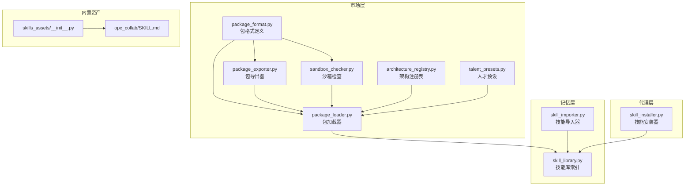
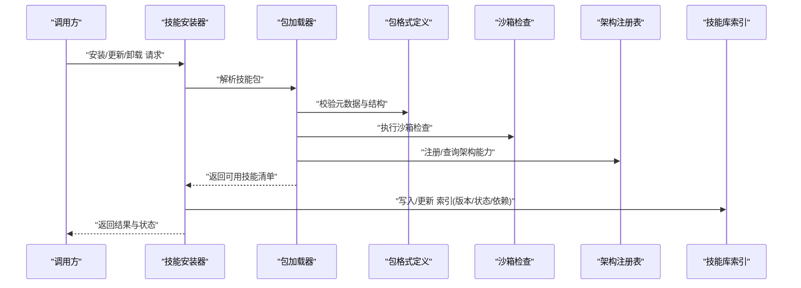
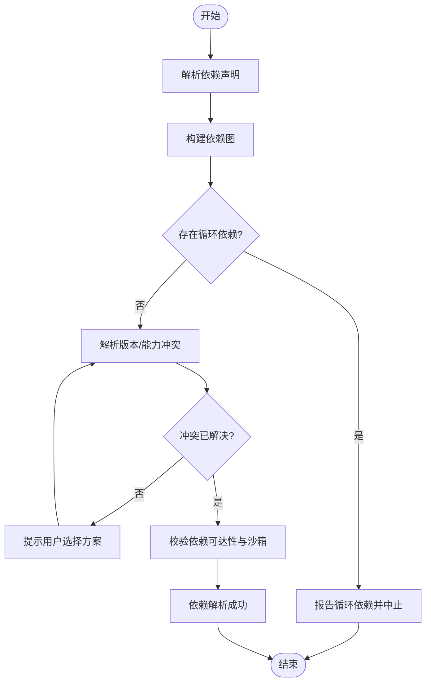

# 技能库管理

<cite>
**本文引用的文件**   
- [skill_library.py](file://opc/layer5_memory/skill_library.py)
- [skill_importer.py](file://opc/layer5_memory/skill_importer.py)
- [package_format.py](file://opc/market/package_format.py)
- [package_loader.py](file://opc/market/package_loader.py)
- [package_exporter.py](file://opc/market/package_exporter.py)
- [sandbox_checker.py](file://opc/market/sandbox_checker.py)
- [architecture_registry.py](file://opc/market/architecture_registry.py)
- [talent_presets.py](file://opc/market/talent_presets.py)
- [skill_installer.py](file://opc/layer3_agent/skill_installer.py)
- [market/__init__.py](file://opc/market/__init__.py)
- [skills_assets/__init__.py](file://opc/skills_assets/__init__.py)
- [SKILL.md](file://opc/skills_assets/opc_collab/SKILL.md)
</cite>

## 目录
1. [简介](#简介)
2. [项目结构](#项目结构)
3. [核心组件](#核心组件)
4. [架构总览](#架构总览)
5. [详细组件分析](#详细组件分析)
6. [依赖关系分析](#依赖关系分析)
7. [性能考虑](#性能考虑)
8. [故障排查指南](#故障排查指南)
9. [结论](#结论)
10. [附录](#附录)

## 简介
本文件面向OpenOPC“技能库管理系统”，系统化阐述技能的整体架构、定义规范、导入机制（含格式校验、依赖解析与版本控制）、生命周期管理（安装、更新、卸载、状态监控）、元数据与配置项说明、依赖冲突解决策略、打包发布流程与第三方集成指南，以及搜索、过滤与推荐的实现方法。文档以仓库中市场与技能相关模块为依据，提供从高层到代码级的可追溯说明。

## 项目结构
与技能库管理直接相关的代码主要分布在以下位置：
- 市场层（Market）：负责包格式、加载、导出、沙箱检查、架构注册与预设能力
- 记忆层（Memory）：负责技能库索引、技能导入器
- 代理层（Agent）：负责技能安装器
- 内置技能资产：提供示例技能描述与资源

图表来源
- [package_format.py](file://opc/market/package_format.py)
- [package_loader.py](file://opc/market/package_loader.py)
- [package_exporter.py](file://opc/market/package_exporter.py)
- [sandbox_checker.py](file://opc/market/sandbox_checker.py)
- [architecture_registry.py](file://opc/market/architecture_registry.py)
- [talent_presets.py](file://opc/market/talent_presets.py)
- [skill_library.py](file://opc/layer5_memory/skill_library.py)
- [skill_importer.py](file://opc/layer5_memory/skill_importer.py)
- [skill_installer.py](file://opc/layer3_agent/skill_installer.py)
- [skills_assets/__init__.py](file://opc/skills_assets/__init__.py)
- [SKILL.md](file://opc/skills_assets/opc_collab/SKILL.md)

章节来源
- [market/__init__.py](file://opc/market/__init__.py)
- [skills_assets/__init__.py](file://opc/skills_assets/__init__.py)

## 核心组件
- 包格式定义：统一技能包的元数据、结构与约束，作为所有导入/导出/校验的契约
- 包加载器：读取并解析技能包，构建运行时可用的技能清单与上下文
- 包导出器：将已安装或本地技能打包为可分发格式
- 沙箱检查：对技能执行环境进行安全边界与权限校验
- 架构注册表：维护技能与系统架构能力的映射关系
- 人才预设：提供常用技能组合与推荐模板
- 技能库索引：持久化存储技能元数据、版本、状态与依赖图
- 技能导入器：封装从不同来源导入技能的流程（本地、远程、压缩包等）
- 技能安装器：协调安装、更新、卸载与状态同步的生命周期操作

章节来源
- [package_format.py](file://opc/market/package_format.py)
- [package_loader.py](file://opc/market/package_loader.py)
- [package_exporter.py](file://opc/market/package_exporter.py)
- [sandbox_checker.py](file://opc/market/sandbox_checker.py)
- [architecture_registry.py](file://opc/market/architecture_registry.py)
- [talent_presets.py](file://opc/market/talent_presets.py)
- [skill_library.py](file://opc/layer5_memory/skill_library.py)
- [skill_importer.py](file://opc/layer5_memory/skill_importer.py)
- [skill_installer.py](file://opc/layer3_agent/skill_installer.py)

## 架构总览
技能库管理采用分层设计：上层通过安装器与导入器发起操作；中层由包格式、加载器、导出器与沙箱检查提供统一的包处理能力；底层由技能库索引持久化状态，并与架构注册表和人才预设协同完成能力匹配与推荐。

图表来源
- [skill_installer.py](file://opc/layer3_agent/skill_installer.py)
- [package_loader.py](file://opc/market/package_loader.py)
- [package_format.py](file://opc/market/package_format.py)
- [sandbox_checker.py](file://opc/market/sandbox_checker.py)
- [architecture_registry.py](file://opc/market/architecture_registry.py)
- [skill_library.py](file://opc/layer5_memory/skill_library.py)

## 详细组件分析

### 包格式定义（package_format.py）
- 职责：定义技能包的元数据结构、字段约束、版本语义与兼容性规则
- 关键点：
  - 元数据字段：名称、版本、描述、作者、许可证、入口点、依赖声明、平台要求等
  - 版本控制：支持主/次/补丁版本与预发布标识，提供比较与兼容判定
  - 依赖声明：声明对其他技能或外部能力的依赖，包含最小版本范围
  - 安全标签：标记是否允许网络访问、文件系统读写、进程执行等
- 复杂度：元数据解析通常为O(n)，n为字段数量；版本比较为常数时间

章节来源
- [package_format.py](file://opc/market/package_format.py)

### 包加载器（package_loader.py）
- 职责：读取技能包（本地路径或压缩包），按包格式解析并构建运行时对象
- 关键点：
  - 输入源：本地目录、ZIP/TAR归档、远程URL（由上层决定）
  - 解析流程：校验包签名/完整性→解析元数据→收集资源→构建依赖图
  - 错误处理：缺失必填字段、版本不满足、依赖循环、资源不可用等
- 性能：大体积包解压与扫描可能成为瓶颈，建议增量加载与缓存

章节来源
- [package_loader.py](file://opc/market/package_loader.py)

### 包导出器（package_exporter.py）
- 职责：将已安装或内存中的技能打包为标准格式，便于分发与迁移
- 关键点：
  - 输出内容：元数据、资源文件、依赖清单、版本信息、签名摘要
  - 一致性：确保导出版本与安装时一致，避免漂移
  - 压缩与校验：可选压缩与哈希校验，提升传输可靠性

章节来源
- [package_exporter.py](file://opc/market/package_exporter.py)

### 沙箱检查（sandbox_checker.py）
- 职责：在加载阶段对技能执行环境进行安全检查，防止越权行为
- 关键点：
  - 权限模型：基于能力白名单（如网络、IO、子进程）
  - 风险评分：根据能力使用强度给出风险等级
  - 阻断策略：高风险能力默认拒绝，需显式授权

章节来源
- [sandbox_checker.py](file://opc/market/sandbox_checker.py)

### 架构注册表（architecture_registry.py）
- 职责：维护系统与技能之间的能力映射，支撑依赖解析与兼容性判断
- 关键点：
  - 能力条目：名称、版本、提供者、接口契约
  - 匹配算法：按能力名与版本范围匹配可用实现
  - 扩展点：支持插件式注册新能力

章节来源
- [architecture_registry.py](file://opc/market/architecture_registry.py)

### 人才预设（talent_presets.py）
- 职责：提供常用技能组合与推荐模板，辅助快速装配工作流
- 关键点：
  - 预设模板：按场景（如编码、部署、协作）组织
  - 推荐逻辑：基于用户画像与历史选择生成候选集
  - 可定制：允许用户覆盖默认预设

章节来源
- [talent_presets.py](file://opc/market/talent_presets.py)

### 技能库索引（skill_library.py）
- 职责：持久化存储技能元数据、版本、状态、依赖图与安装路径
- 关键点：
  - 索引结构：唯一键（名称+版本）、状态机（未安装/已安装/更新中/异常）、依赖图
  - 并发安全：读写锁保护，避免竞态条件
  - 查询接口：按名称、版本、标签、能力筛选

章节来源
- [skill_library.py](file://opc/layer5_memory/skill_library.py)

### 技能导入器（skill_importer.py）
- 职责：封装从多来源导入技能的流程，包括格式验证、依赖解析与冲突检测
- 关键点：
  - 输入类型：本地目录、压缩包、远程仓库
  - 验证步骤：包格式校验→元数据完整性→依赖可达性→沙箱检查
  - 冲突处理：版本冲突、能力冲突、路径冲突的策略与回滚

章节来源
- [skill_importer.py](file://opc/layer5_memory/skill_importer.py)

### 技能安装器（skill_installer.py）
- 职责：协调安装、更新、卸载与状态监控的全生命周期
- 关键点：
  - 安装：下载/复制→校验→解析→沙箱检查→注册→写索引
  - 更新：差异计算→备份→替换→验证→回滚策略
  - 卸载：解除依赖→清理资源→更新索引
  - 状态监控：事件上报、健康检查、失败重试

章节来源
- [skill_installer.py](file://opc/layer3_agent/skill_installer.py)

### 内置技能资产（skills_assets）
- 职责：提供官方示例技能与资源，用于演示与测试
- 关键点：
  - 示例技能：包含SKILL.md描述与必要资源
  - 用途：快速上手、回归测试、集成验证

章节来源
- [skills_assets/__init__.py](file://opc/skills_assets/__init__.py)
- [SKILL.md](file://opc/skills_assets/opc_collab/SKILL.md)

## 依赖关系分析
技能间的依赖关系通过依赖图表达，支持版本范围与能力级依赖。冲突解决策略包括：
- 版本冲突：优先满足最高兼容版本，必要时降级或提示用户选择
- 能力冲突：同一能力被多个技能提供时，依据优先级与注册表策略选择
- 循环依赖：检测环并提示拆分或引入抽象层

图表来源
- [package_format.py](file://opc/market/package_format.py)
- [package_loader.py](file://opc/market/package_loader.py)
- [architecture_registry.py](file://opc/market/architecture_registry.py)
- [sandbox_checker.py](file://opc/market/sandbox_checker.py)

章节来源
- [package_format.py](file://opc/market/package_format.py)
- [package_loader.py](file://opc/market/package_loader.py)
- [architecture_registry.py](file://opc/market/architecture_registry.py)
- [sandbox_checker.py](file://opc/market/sandbox_checker.py)

## 性能考虑
- 包加载优化：对大体积包采用懒加载与增量扫描，减少首启延迟
- 索引查询优化：建立名称、版本、标签与能力索引，加速筛选
- 缓存策略：缓存已解析的依赖图与沙箱检查结果，避免重复计算
- 并发控制：安装/更新操作串行化，避免状态不一致

[本节为通用指导，无需具体文件引用]

## 故障排查指南
- 常见错误
  - 包格式无效：检查必填字段与类型约束
  - 依赖不满足：核对版本范围与能力可用性
  - 沙箱拒绝：确认权限白名单与安全策略
  - 循环依赖：重构依赖或引入抽象层
- 诊断步骤
  - 查看导入日志与错误堆栈
  - 导出当前索引与依赖图进行离线分析
  - 使用沙箱检查工具复现权限问题
- 恢复策略
  - 回滚到上一稳定版本
  - 隔离冲突技能并逐步替换

章节来源
- [skill_importer.py](file://opc/layer5_memory/skill_importer.py)
- [sandbox_checker.py](file://opc/market/sandbox_checker.py)
- [skill_library.py](file://opc/layer5_memory/skill_library.py)

## 结论
OpenOPC技能库管理系统通过清晰的包格式、严格的导入校验、完善的依赖解析与冲突解决、全生命周期的安装管理与安全的沙箱检查，提供了可扩展、可维护且可靠的技能生态基础。结合架构注册表与人才预设，可实现智能推荐与快速装配，满足多样化业务场景需求。

[本节为总结，无需具体文件引用]

## 附录

### 技能元数据与配置选项
- 元数据字段
  - 基本信息：名称、版本、描述、作者、许可证
  - 入口点：主函数或脚本路径
  - 依赖：技能依赖与能力依赖，含版本范围
  - 平台要求：操作系统、Python版本、外部服务
  - 安全标签：网络、文件系统、子进程等权限
- 配置选项
  - 全局开关：启用/禁用特定能力
  - 环境变量：敏感信息与运行时参数
  - 策略配置：沙箱策略、冲突解决偏好

章节来源
- [package_format.py](file://opc/market/package_format.py)

### 打包发布流程
- 准备：完善元数据与资源，运行沙箱检查
- 构建：使用导出器生成标准包，附带签名与校验和
- 分发：上传至仓库或制品库，记录版本与变更日志
- 验证：在目标环境执行安装与冒烟测试

章节来源
- [package_exporter.py](file://opc/market/package_exporter.py)
- [sandbox_checker.py](file://opc/market/sandbox_checker.py)

### 第三方技能集成指南
- 遵循包格式定义，确保元数据完整与版本语义正确
- 声明清晰的能力依赖，避免隐式耦合
- 提供最小可运行示例与测试用例
- 配合架构注册表注册新能力，便于系统发现与匹配

章节来源
- [package_format.py](file://opc/market/package_format.py)
- [architecture_registry.py](file://opc/market/architecture_registry.py)

### 搜索、过滤与推荐实现
- 搜索：基于名称、描述、标签与能力关键词检索
- 过滤：按版本范围、平台要求、安全等级筛选
- 推荐：结合人才预设与用户画像，生成候选列表与排序

章节来源
- [talent_presets.py](file://opc/market/talent_presets.py)
- [skill_library.py](file://opc/layer5_memory/skill_library.py)