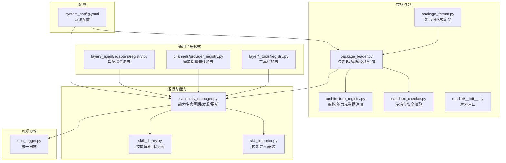
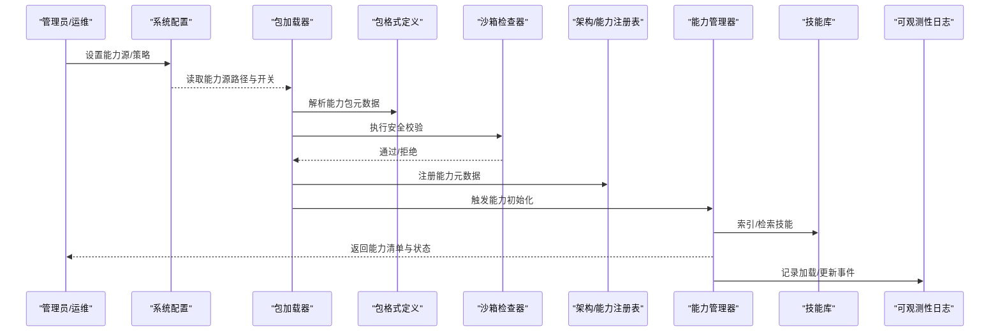
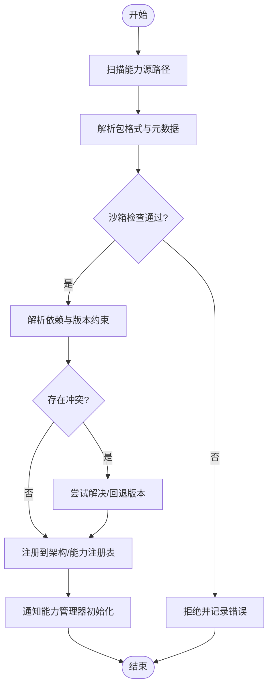
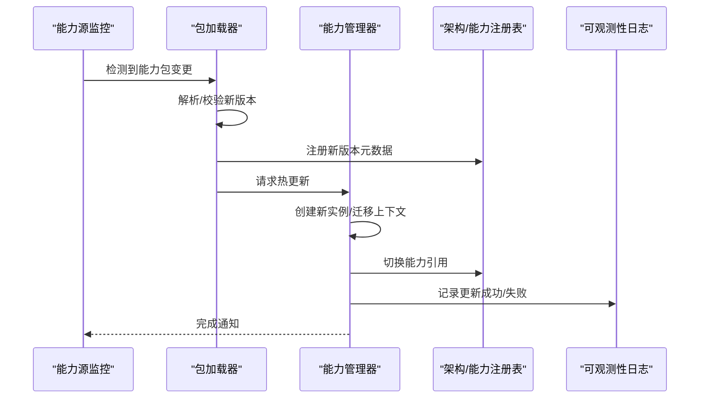
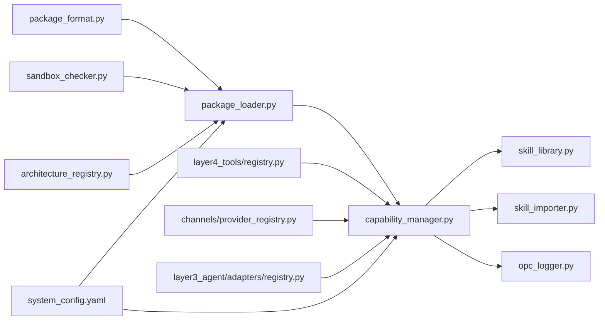

# 能力管理

<cite>
**本文引用的文件**   
- [opc/market/package_loader.py](file://opc/market/package_loader.py)
- [opc/market/package_format.py](file://opc/market/package_format.py)
- [opc/market/architecture_registry.py](file://opc/market/architecture_registry.py)
- [opc/market/sandbox_checker.py](file://opc/market/sandbox_checker.py)
- [opc/market/__init__.py](file://opc/market/__init__.py)
- [opc/layer5_memory/capability_manager.py](file://opc/layer5_memory/capability_manager.py)
- [opc/layer5_memory/skill_library.py](file://opc/layer5_memory/skill_library.py)
- [opc/layer5_memory/skill_importer.py](file://opc/layer5_memory/skill_importer.py)
- [opc/layer4_tools/registry.py](file://opc/layer4_tools/registry.py)
- [opc/channels/provider_registry.py](file://opc/channels/provider_registry.py)
- [opc/layer3_agent/adapters/registry.py](file://opc/layer3_agent/adapters/registry.py)
- [opc/layer6_observability/opc_logger.py](file://opc/layer6_observability/opc_logger.py)
- [config/system_config.yaml](file://config/system_config.yaml)
- [tests/test_market.py](file://tests/test_market.py)
</cite>

## 目录
1. [简介](#简介)
2. [项目结构](#项目结构)
3. [核心组件](#核心组件)
4. [架构总览](#架构总览)
5. [详细组件分析](#详细组件分析)
6. [依赖分析](#依赖分析)
7. [性能考虑](#性能考虑)
8. [故障排查指南](#故障排查指南)
9. [结论](#结论)
10. [附录](#附录)

## 简介
本文件面向OpenOPC“能力管理”子系统，系统化阐述能力的定义规范、注册机制、发现与加载流程、动态更新策略、权限控制与访问策略、声明式配置与编程式注册示例、依赖管理与冲突检测、版本兼容性与向后兼容处理、测试框架与调试工具使用方法，以及能力市场集成与第三方扩展指南。文档以仓库现有实现为依据，提供从高层到代码级的可追溯说明，帮助开发者快速理解并安全扩展系统能力。

## 项目结构
能力管理相关代码主要分布在以下模块：
- 市场与包层：负责能力包的格式定义、加载、校验与注册
- 运行时能力管理：负责能力生命周期、发现、缓存与动态更新
- 工具与通道注册：体现通用注册模式（工具、通道、适配器）
- 可观测性：记录能力加载与运行日志
- 配置：系统级开关与路径配置
- 测试：覆盖市场与能力加载的关键用例

图表来源
- [opc/market/package_format.py](file://opc/market/package_format.py)
- [opc/market/package_loader.py](file://opc/market/package_loader.py)
- [opc/market/architecture_registry.py](file://opc/market/architecture_registry.py)
- [opc/market/sandbox_checker.py](file://opc/market/sandbox_checker.py)
- [opc/market/__init__.py](file://opc/market/__init__.py)
- [opc/layer5_memory/capability_manager.py](file://opc/layer5_memory/capability_manager.py)
- [opc/layer5_memory/skill_library.py](file://opc/layer5_memory/skill_library.py)
- [opc/layer5_memory/skill_importer.py](file://opc/layer5_memory/skill_importer.py)
- [opc/layer4_tools/registry.py](file://opc/layer4_tools/registry.py)
- [opc/channels/provider_registry.py](file://opc/channels/provider_registry.py)
- [opc/layer3_agent/adapters/registry.py](file://opc/layer3_agent/adapters/registry.py)
- [opc/layer6_observability/opc_logger.py](file://opc/layer6_observability/opc_logger.py)
- [config/system_config.yaml](file://config/system_config.yaml)

章节来源
- [opc/market/package_loader.py](file://opc/market/package_loader.py)
- [opc/market/package_format.py](file://opc/market/package_format.py)
- [opc/market/architecture_registry.py](file://opc/market/architecture_registry.py)
- [opc/market/sandbox_checker.py](file://opc/market/sandbox_checker.py)
- [opc/market/__init__.py](file://opc/market/__init__.py)
- [opc/layer5_memory/capability_manager.py](file://opc/layer5_memory/capability_manager.py)
- [opc/layer5_memory/skill_library.py](file://opc/layer5_memory/skill_library.py)
- [opc/layer5_memory/skill_importer.py](file://opc/layer5_memory/skill_importer.py)
- [opc/layer4_tools/registry.py](file://opc/layer4_tools/registry.py)
- [opc/channels/provider_registry.py](file://opc/channels/provider_registry.py)
- [opc/layer3_agent/adapters/registry.py](file://opc/layer3_agent/adapters/registry.py)
- [opc/layer6_observability/opc_logger.py](file://opc/layer6_observability/opc_logger.py)
- [config/system_config.yaml](file://config/system_config.yaml)

## 核心组件
- 能力包格式定义：规定能力包的元数据、资源清单、依赖声明、版本约束等结构，确保不同来源的能力具备一致的可描述性。
- 包加载器：扫描能力源、解析包结构、执行安全与兼容性检查、将能力注册到运行时注册表。
- 架构/能力注册表：集中维护能力元数据、版本、依赖关系与可用状态。
- 沙箱检查器：对能力包进行静态安全检查，限制潜在风险操作。
- 能力管理器：协调能力的发现、加载、热更新、卸载与查询；维护能力实例与上下文。
- 技能库与导入器：提供技能的索引、检索与安装流程，作为能力的一种形态。
- 通用注册表（工具/通道/适配器）：体现统一的注册模式，便于扩展新类型能力。
- 可观测性：为能力生命周期事件提供统一日志输出。
- 系统配置：提供能力源路径、启用/禁用开关、沙箱策略等配置项。

章节来源
- [opc/market/package_format.py](file://opc/market/package_format.py)
- [opc/market/package_loader.py](file://opc/market/package_loader.py)
- [opc/market/architecture_registry.py](file://opc/market/architecture_registry.py)
- [opc/market/sandbox_checker.py](file://opc/market/sandbox_checker.py)
- [opc/layer5_memory/capability_manager.py](file://opc/layer5_memory/capability_manager.py)
- [opc/layer5_memory/skill_library.py](file://opc/layer5_memory/skill_library.py)
- [opc/layer5_memory/skill_importer.py](file://opc/layer5_memory/skill_importer.py)
- [opc/layer4_tools/registry.py](file://opc/layer4_tools/registry.py)
- [opc/channels/provider_registry.py](file://opc/channels/provider_registry.py)
- [opc/layer3_agent/adapters/registry.py](file://opc/layer3_agent/adapters/registry.py)
- [opc/layer6_observability/opc_logger.py](file://opc/layer6_observability/opc_logger.py)
- [config/system_config.yaml](file://config/system_config.yaml)

## 架构总览
能力管理的整体流程包括：声明式配置驱动的能力源发现、包格式解析、安全与兼容性校验、注册表写入、运行时能力实例化与调用、动态更新与回滚、权限控制与审计日志。

图表来源
- [opc/market/package_loader.py](file://opc/market/package_loader.py)
- [opc/market/package_format.py](file://opc/market/package_format.py)
- [opc/market/sandbox_checker.py](file://opc/market/sandbox_checker.py)
- [opc/market/architecture_registry.py](file://opc/market/architecture_registry.py)
- [opc/layer5_memory/capability_manager.py](file://opc/layer5_memory/capability_manager.py)
- [opc/layer5_memory/skill_library.py](file://opc/layer5_memory/skill_library.py)
- [config/system_config.yaml](file://config/system_config.yaml)
- [opc/layer6_observability/opc_logger.py](file://opc/layer6_observability/opc_logger.py)

## 详细组件分析

### 能力包格式与元数据
- 目的：标准化能力包的描述信息，包括名称、版本、依赖、权限、资源清单等。
- 关键点：
  - 版本字段用于兼容性与升级策略判断
  - 依赖字段用于构建依赖图与冲突检测
  - 权限字段用于访问控制策略匹配
  - 资源清单用于定位脚本、模型、配置文件等

章节来源
- [opc/market/package_format.py](file://opc/market/package_format.py)

### 包加载器与注册流程
- 功能：
  - 扫描配置中的能力源路径
  - 解析能力包结构并校验完整性
  - 执行沙箱检查与兼容性评估
  - 将能力注册到架构/能力注册表
  - 通知能力管理器进行实例化或热更新
- 关键步骤：
  - 发现：遍历能力源目录，识别有效包
  - 解析：读取包格式定义的元数据
  - 校验：沙箱检查、依赖解析、版本约束验证
  - 注册：写入注册表，建立索引
  - 初始化：创建能力实例，准备上下文

图表来源
- [opc/market/package_loader.py](file://opc/market/package_loader.py)
- [opc/market/package_format.py](file://opc/market/package_format.py)
- [opc/market/sandbox_checker.py](file://opc/market/sandbox_checker.py)
- [opc/market/architecture_registry.py](file://opc/market/architecture_registry.py)
- [opc/layer5_memory/capability_manager.py](file://opc/layer5_memory/capability_manager.py)

章节来源
- [opc/market/package_loader.py](file://opc/market/package_loader.py)
- [opc/market/package_format.py](file://opc/market/package_format.py)
- [opc/market/sandbox_checker.py](file://opc/market/sandbox_checker.py)
- [opc/market/architecture_registry.py](file://opc/market/architecture_registry.py)
- [opc/layer5_memory/capability_manager.py](file://opc/layer5_memory/capability_manager.py)

### 能力管理器与动态更新
- 职责：
  - 维护能力实例的生命周期（创建、启动、停止、销毁）
  - 提供能力发现接口（按标签、版本、依赖过滤）
  - 支持热更新：在不重启进程的情况下替换能力实现
  - 管理能力上下文与资源隔离
- 动态更新流程要点：
  - 监听能力源变更或收到更新信号
  - 增量解析与校验新版本
  - 原子切换：先注册新版本，再切换引用，最后清理旧版本
  - 失败回滚：若新版本不可用，回退至上一稳定版本

图表来源
- [opc/layer5_memory/capability_manager.py](file://opc/layer5_memory/capability_manager.py)
- [opc/market/package_loader.py](file://opc/market/package_loader.py)
- [opc/market/architecture_registry.py](file://opc/market/architecture_registry.py)
- [opc/layer6_observability/opc_logger.py](file://opc/layer6_observability/opc_logger.py)

章节来源
- [opc/layer5_memory/capability_manager.py](file://opc/layer5_memory/capability_manager.py)
- [opc/market/package_loader.py](file://opc/market/package_loader.py)
- [opc/market/architecture_registry.py](file://opc/market/architecture_registry.py)
- [opc/layer6_observability/opc_logger.py](file://opc/layer6_observability/opc_logger.py)

### 权限控制与访问策略
- 设计思路：
  - 在能力元数据中声明所需权限（如文件系统、网络、外部API）
  - 在调用前根据调用者身份与策略进行权限判定
  - 未授权时拒绝调用并记录审计日志
- 实施要点：
  - 权限模型与策略引擎解耦，便于扩展
  - 支持细粒度权限（方法级、资源级）
  - 与可观测性集成，输出完整的访问审计链

章节来源
- [opc/market/package_format.py](file://opc/market/package_format.py)
- [opc/layer6_observability/opc_logger.py](file://opc/layer6_observability/opc_logger.py)

### 声明式配置与编程式注册示例
- 声明式配置：
  - 通过系统配置文件指定能力源路径、启用/禁用开关、沙箱策略等
  - 适用于批量部署与环境差异化管理
- 编程式注册：
  - 使用通用注册表接口（工具/通道/适配器）进行能力注册
  - 适用于插件化扩展与运行时动态装配
- 参考路径：
  - 系统配置：[config/system_config.yaml](file://config/system_config.yaml)
  - 工具注册表：[opc/layer4_tools/registry.py](file://opc/layer4_tools/registry.py)
  - 通道提供者注册表：[opc/channels/provider_registry.py](file://opc/channels/provider_registry.py)
  - 适配器注册表：[opc/layer3_agent/adapters/registry.py](file://opc/layer3_agent/adapters/registry.py)

章节来源
- [config/system_config.yaml](file://config/system_config.yaml)
- [opc/layer4_tools/registry.py](file://opc/layer4_tools/registry.py)
- [opc/channels/provider_registry.py](file://opc/channels/provider_registry.py)
- [opc/layer3_agent/adapters/registry.py](file://opc/layer3_agent/adapters/registry.py)

### 依赖管理与冲突检测
- 依赖管理：
  - 基于能力元数据中的依赖声明构建依赖图
  - 支持版本范围约束与可选依赖
- 冲突检测：
  - 当同一能力存在多个版本或相互不兼容的依赖时，触发冲突检测
  - 提供自动解决策略（优先高版本、降级、排除）或人工干预提示
- 实现位置：
  - 依赖解析与冲突检测通常在包加载器与架构/能力注册表中协同完成

章节来源
- [opc/market/package_loader.py](file://opc/market/package_loader.py)
- [opc/market/architecture_registry.py](file://opc/market/architecture_registry.py)

### 版本兼容性与向后兼容处理
- 版本语义：
  - 采用语义化版本约定，区分主版本（破坏性变更）、次版本（新增功能）、修订版本（缺陷修复）
- 兼容性策略：
  - 默认保持向后兼容，避免破坏已有调用方
  - 对破坏性变更提供迁移期与弃用警告
  - 支持多版本并存与按需选择
- 实施要点：
  - 在包格式中明确版本字段与兼容性矩阵
  - 在加载阶段进行版本约束校验
  - 在能力管理器中维护版本路由与切换逻辑

章节来源
- [opc/market/package_format.py](file://opc/market/package_format.py)
- [opc/layer5_memory/capability_manager.py](file://opc/layer5_memory/capability_manager.py)

### 测试框架与调试工具
- 测试覆盖：
  - 针对市场与能力加载流程提供单元测试与集成测试
  - 模拟能力包、依赖冲突、权限拒绝等场景
- 调试建议：
  - 开启详细日志，关注能力加载、注册、更新事件
  - 使用最小复现用例验证问题根因
  - 结合系统配置调整能力源与沙箱策略进行对比测试
- 参考路径：
  - 市场测试用例：[tests/test_market.py](file://tests/test_market.py)
  - 可观测性日志：[opc/layer6_observability/opc_logger.py](file://opc/layer6_observability/opc_logger.py)

章节来源
- [tests/test_market.py](file://tests/test_market.py)
- [opc/layer6_observability/opc_logger.py](file://opc/layer6_observability/opc_logger.py)

### 能力市场集成与第三方扩展指南
- 能力市场：
  - 通过市场入口模块暴露能力发现与安装接口
  - 支持内置预设与外部仓库
- 第三方扩展：
  - 遵循能力包格式定义，提交标准元数据与资源清单
  - 通过包加载器接入系统，完成注册与热更新
- 参考路径：
  - 市场入口：[opc/market/__init__.py](file://opc/market/__init__.py)
  - 包加载器：[opc/market/package_loader.py](file://opc/market/package_loader.py)
  - 包格式定义：[opc/market/package_format.py](file://opc/market/package_format.py)

章节来源
- [opc/market/__init__.py](file://opc/market/__init__.py)
- [opc/market/package_loader.py](file://opc/market/package_loader.py)
- [opc/market/package_format.py](file://opc/market/package_format.py)

## 依赖分析
能力管理各组件之间的依赖关系如下：

图表来源
- [opc/market/package_format.py](file://opc/market/package_format.py)
- [opc/market/package_loader.py](file://opc/market/package_loader.py)
- [opc/market/sandbox_checker.py](file://opc/market/sandbox_checker.py)
- [opc/market/architecture_registry.py](file://opc/market/architecture_registry.py)
- [opc/layer5_memory/capability_manager.py](file://opc/layer5_memory/capability_manager.py)
- [opc/layer5_memory/skill_library.py](file://opc/layer5_memory/skill_library.py)
- [opc/layer5_memory/skill_importer.py](file://opc/layer5_memory/skill_importer.py)
- [opc/layer4_tools/registry.py](file://opc/layer4_tools/registry.py)
- [opc/channels/provider_registry.py](file://opc/channels/provider_registry.py)
- [opc/layer3_agent/adapters/registry.py](file://opc/layer3_agent/adapters/registry.py)
- [opc/layer6_observability/opc_logger.py](file://opc/layer6_observability/opc_logger.py)
- [config/system_config.yaml](file://config/system_config.yaml)

章节来源
- [opc/market/package_loader.py](file://opc/market/package_loader.py)
- [opc/market/package_format.py](file://opc/market/package_format.py)
- [opc/market/architecture_registry.py](file://opc/market/architecture_registry.py)
- [opc/market/sandbox_checker.py](file://opc/market/sandbox_checker.py)
- [opc/layer5_memory/capability_manager.py](file://opc/layer5_memory/capability_manager.py)
- [opc/layer5_memory/skill_library.py](file://opc/layer5_memory/skill_library.py)
- [opc/layer5_memory/skill_importer.py](file://opc/layer5_memory/skill_importer.py)
- [opc/layer4_tools/registry.py](file://opc/layer4_tools/registry.py)
- [opc/channels/provider_registry.py](file://opc/channels/provider_registry.py)
- [opc/layer3_agent/adapters/registry.py](file://opc/layer3_agent/adapters/registry.py)
- [opc/layer6_observability/opc_logger.py](file://opc/layer6_observability/opc_logger.py)
- [config/system_config.yaml](file://config/system_config.yaml)

## 性能考虑
- 增量加载：仅解析与校验变更的能力包，减少全量扫描开销
- 缓存策略：对已解析的元数据与能力实例进行缓存，避免重复计算
- 并发控制：对能力注册与更新操作加锁，保证一致性
- 资源隔离：为能力实例分配独立上下文，防止资源争用
- 日志级别：在生产环境降低日志级别，避免I/O瓶颈

## 故障排查指南
- 常见问题：
  - 能力包解析失败：检查包格式是否符合定义，确认元数据完整性
  - 沙箱检查拒绝：审查能力包行为，移除高风险操作或调整策略
  - 依赖冲突：查看冲突报告，选择兼容版本或调整依赖声明
  - 权限拒绝：核对调用者身份与能力权限声明，修正策略配置
- 排查步骤：
  - 启用详细日志，定位错误堆栈与上下文
  - 使用最小复现用例验证问题
  - 逐步关闭能力源或降级版本，缩小影响范围
- 参考路径：
  - 可观测性日志：[opc/layer6_observability/opc_logger.py](file://opc/layer6_observability/opc_logger.py)
  - 市场测试用例：[tests/test_market.py](file://tests/test_market.py)

章节来源
- [opc/layer6_observability/opc_logger.py](file://opc/layer6_observability/opc_logger.py)
- [tests/test_market.py](file://tests/test_market.py)

## 结论
OpenOPC能力管理子系统通过标准化的包格式、严格的沙箱检查、完善的依赖与版本管理、灵活的注册与热更新机制，构建了可扩展、可观测、可治理的能力生态。配合声明式配置与编程式注册，既能满足大规模部署需求，也便于第三方扩展与市场集成。建议在引入新能力时严格遵循格式与权限规范，充分利用测试与日志工具进行质量保障。

## 附录
- 术语说明：
  - 能力：可被系统发现、注册与调用的功能单元
  - 能力包：包含能力元数据与资源的打包产物
  - 注册表：集中管理能力元数据与实例的存储
  - 热更新：在不重启进程的情况下替换能力实现
- 最佳实践：
  - 明确版本语义，保持向后兼容
  - 精细化权限声明，最小权限原则
  - 完善测试覆盖，持续集成验证
  - 强化日志与审计，提升可观测性