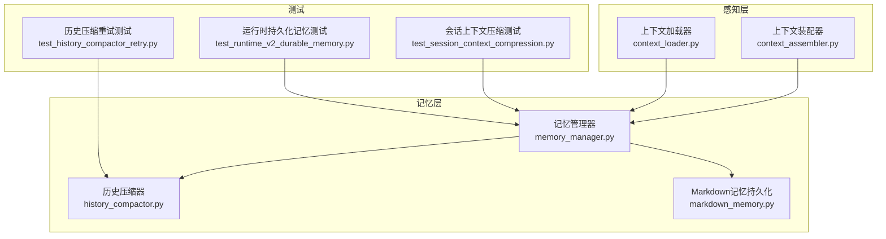
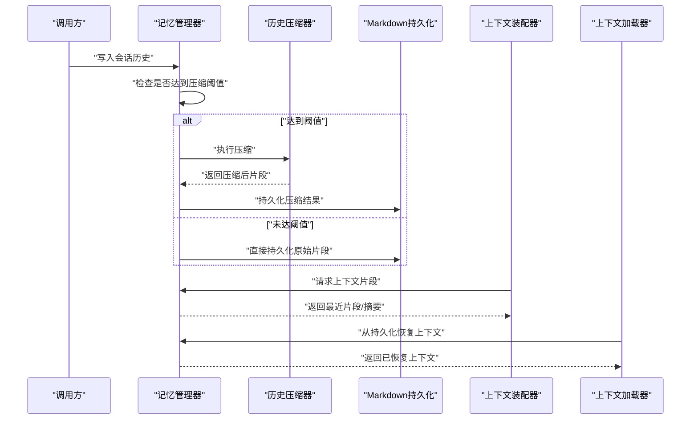
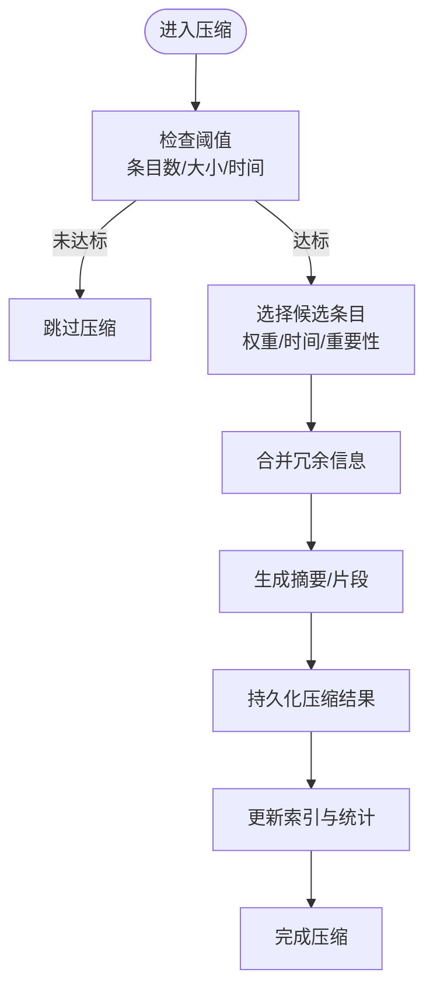
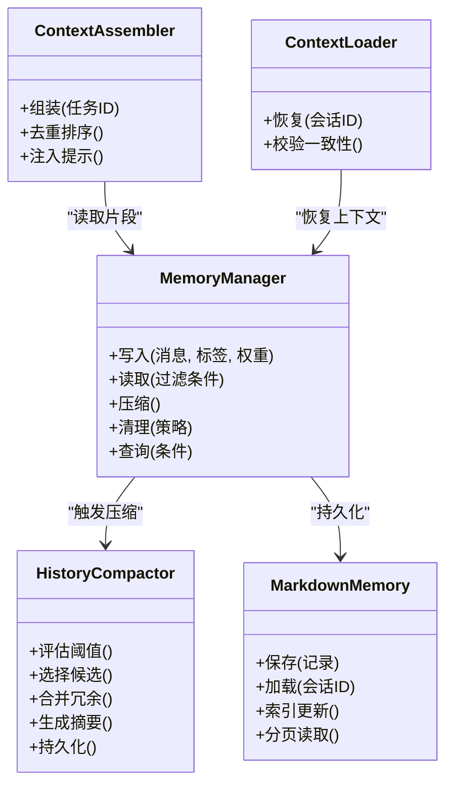

# 记忆管理器

<cite>
**本文引用的文件**   
- [memory_manager.py](file://opc/layer5_memory/memory_manager.py)
- [history_compactor.py](file://opc/layer5_memory/history_compactor.py)
- [markdown_memory.py](file://opc/layer5_memory/markdown_memory.py)
- [context_assembler.py](file://opc/layer1_perception/context_assembler.py)
- [context_loader.py](file://opc/layer1_perception/context_loader.py)
- [test_session_context_compression.py](file://tests/test_session_context_compression.py)
- [test_history_compactor_retry.py](file://tests/test_history_compactor_retry.py)
- [test_runtime_v2_durable_memory.py](file://tests/test_runtime_v2_durable_memory.py)
</cite>

## 目录
1. [简介](#简介)
2. [项目结构](#项目结构)
3. [核心组件](#核心组件)
4. [架构总览](#架构总览)
5. [详细组件分析](#详细组件分析)
6. [依赖关系分析](#依赖关系分析)
7. [性能考虑](#性能考虑)
8. [故障排查指南](#故障排查指南)
9. [结论](#结论)
10. [附录](#附录)

## 简介
本文件面向OpenOPC的记忆子系统，聚焦“记忆管理器”的架构与生命周期管理、会话历史存储策略（上下文压缩算法、检索优化机制、存储格式）、历史压缩器工作原理（阈值、保留策略、性能优化）、CRUD接口与使用示例、查询API参数与返回格式、清理策略与存储空间管理、性能调优建议，以及常见问题排查与故障恢复方案。文档以代码仓库中的实际实现为依据，提供可追溯的来源定位与图示说明，帮助读者快速理解并正确使用记忆系统。

## 项目结构
记忆相关能力主要位于以下模块：
- 记忆管理层：memory_manager.py、history_compactor.py、markdown_memory.py
- 感知层上下文装配与加载：context_assembler.py、context_loader.py
- 测试用例：test_session_context_compression.py、test_history_compactor_retry.py、test_runtime_v2_durable_memory.py

图表来源
- [memory_manager.py](file://opc/layer5_memory/memory_manager.py)
- [history_compactor.py](file://opc/layer5_memory/history_compactor.py)
- [markdown_memory.py](file://opc/layer5_memory/markdown_memory.py)
- [context_assembler.py](file://opc/layer1_perception/context_assembler.py)
- [context_loader.py](file://opc/layer1_perception/context_loader.py)
- [test_session_context_compression.py](file://tests/test_session_context_compression.py)
- [test_history_compactor_retry.py](file://tests/test_history_compactor_retry.py)
- [test_runtime_v2_durable_memory.py](file://tests/test_runtime_v2_durable_memory.py)

章节来源
- [memory_manager.py](file://opc/layer5_memory/memory_manager.py)
- [history_compactor.py](file://opc/layer5_memory/history_compactor.py)
- [markdown_memory.py](file://opc/layer5_memory/markdown_memory.py)
- [context_assembler.py](file://opc/layer1_perception/context_assembler.py)
- [context_loader.py](file://opc/layer1_perception/context_loader.py)
- [test_session_context_compression.py](file://tests/test_session_context_compression.py)
- [test_history_compactor_retry.py](file://tests/test_history_compactor_retry.py)
- [test_runtime_v2_durable_memory.py](file://tests/test_runtime_v2_durable_memory.py)

## 核心组件
- 记忆管理器：负责会话记忆的创建、追加、读取、压缩触发、清理与查询；协调上下文装配器与加载器完成上下文构建与还原。
- 历史压缩器：对长会话历史进行压缩，依据阈值与保留策略生成紧凑的摘要或片段，降低后续上下文窗口压力。
- Markdown记忆持久化：将记忆数据序列化为可读的Markdown格式，便于人类审阅与调试。
- 上下文装配器/加载器：在请求前组装当前任务所需的上下文片段，或在恢复时从持久化状态重建上下文。

章节来源
- [memory_manager.py](file://opc/layer5_memory/memory_manager.py)
- [history_compactor.py](file://opc/layer5_memory/history_compactor.py)
- [markdown_memory.py](file://opc/layer5_memory/markdown_memory.py)
- [context_assembler.py](file://opc/layer1_perception/context_assembler.py)
- [context_loader.py](file://opc/layer1_perception/context_loader.py)

## 架构总览
记忆管理器的整体流程如下：上层调用记忆管理器进行写入与读取；当历史增长超过阈值时，触发历史压缩器进行压缩；压缩后的结果由Markdown记忆持久化落盘；上下文装配器在需要时向记忆管理器请求最新上下文片段，或由上下文加载器从持久化状态恢复。

图表来源
- [memory_manager.py](file://opc/layer5_memory/memory_manager.py)
- [history_compactor.py](file://opc/layer5_memory/history_compactor.py)
- [markdown_memory.py](file://opc/layer5_memory/markdown_memory.py)
- [context_assembler.py](file://opc/layer1_perception/context_assembler.py)
- [context_loader.py](file://opc/layer1_perception/context_loader.py)

## 详细组件分析

### 记忆管理器（MemoryManager）
职责与生命周期
- 初始化：绑定会话标识、配置压缩阈值、选择持久化后端（Markdown）。
- 写入：追加消息或事件到会话历史；维护时间戳与元数据。
- 压缩触发：当历史长度或大小超过阈值时，调用历史压缩器进行压缩。
- 读取：按时间范围、关键词或重要性筛选返回片段；支持分页与排序。
- 清理：基于保留策略删除过期或低价值条目，释放空间。
- 查询：提供结构化查询接口，支持过滤条件与聚合统计。

关键接口（概念性描述）
- 写入接口：接受消息体、标签、权重等参数，返回写入确认。
- 读取接口：支持按会话ID、时间窗、关键词、类型过滤，返回片段列表。
- 压缩接口：手动触发或自动触发压缩，返回压缩报告。
- 清理接口：按策略批量删除，返回清理计数与剩余大小。
- 查询接口：支持复杂条件组合，返回匹配项及统计信息。

错误处理
- 写入失败：记录日志并重试有限次数，必要时降级为只读模式。
- 压缩失败：回滚到上一快照，记录异常并告警。
- 清理失败：幂等重试，确保不破坏一致性。

章节来源
- [memory_manager.py](file://opc/layer5_memory/memory_manager.py)
- [test_session_context_compression.py](file://tests/test_session_context_compression.py)
- [test_runtime_v2_durable_memory.py](file://tests/test_runtime_v2_durable_memory.py)

### 历史压缩器（HistoryCompactor）
工作原理
- 压缩阈值：基于历史条目数量、字节大小或时间跨度判断是否需要压缩。
- 保留策略：优先保留高权重、近期、关键路径上的条目；对重复或冗余信息进行合并。
- 压缩算法：采用上下文压缩策略，生成摘要或代表性片段，保持语义完整性。
- 性能优化：增量压缩、批处理、懒加载与缓存命中减少IO开销。

流程图（概念映射至实现）

图表来源
- [history_compactor.py](file://opc/layer5_memory/history_compactor.py)
- [test_history_compactor_retry.py](file://tests/test_history_compactor_retry.py)

章节来源
- [history_compactor.py](file://opc/layer5_memory/history_compactor.py)
- [test_history_compactor_retry.py](file://tests/test_history_compactor_retry.py)

### Markdown记忆持久化（MarkdownMemory）
存储格式
- 每条记录包含：时间戳、会话ID、类型、内容、标签、权重、压缩标记等字段。
- 组织方式：按会话分文件或以分区形式存放，便于检索与清理。
- 可读性：Markdown格式便于人工审阅与调试，同时支持机器解析。

检索优化
- 索引：维护轻量级索引（如时间范围、标签、关键字），加速过滤。
- 分页：支持按页读取，避免一次性加载大量数据。
- 缓存：热点片段缓存，提高读取性能。

章节来源
- [markdown_memory.py](file://opc/layer5_memory/markdown_memory.py)

### 上下文装配器与加载器（ContextAssembler / ContextLoader）
装配流程
- 收集当前任务所需片段：来自记忆管理器、外部工具输出、用户输入等。
- 去重与排序：按时间、权重与相关性排序，控制上下文窗口大小。
- 注入提示：将上下文片段嵌入提示模板，供模型消费。

加载流程
- 从持久化状态恢复：读取最近快照与增量日志，重建会话上下文。
- 校验一致性：确保时间顺序与完整性，必要时触发修复。

章节来源
- [context_assembler.py](file://opc/layer1_perception/context_assembler.py)
- [context_loader.py](file://opc/layer1_perception/context_loader.py)

## 依赖关系分析
记忆管理器依赖历史压缩器与Markdown持久化；上下文装配器与加载器通过记忆管理器获取上下文；测试用例覆盖压缩、重试与持久化场景。

图表来源
- [memory_manager.py](file://opc/layer5_memory/memory_manager.py)
- [history_compactor.py](file://opc/layer5_memory/history_compactor.py)
- [markdown_memory.py](file://opc/layer5_memory/markdown_memory.py)
- [context_assembler.py](file://opc/layer1_perception/context_assembler.py)
- [context_loader.py](file://opc/layer1_perception/context_loader.py)

章节来源
- [memory_manager.py](file://opc/layer5_memory/memory_manager.py)
- [history_compactor.py](file://opc/layer5_memory/history_compactor.py)
- [markdown_memory.py](file://opc/layer5_memory/markdown_memory.py)
- [context_assembler.py](file://opc/layer1_perception/context_assembler.py)
- [context_loader.py](file://opc/layer1_perception/context_loader.py)

## 性能考虑
- 压缩阈值调优：根据会话长度与模型上下文窗口动态调整，避免频繁压缩导致延迟。
- 增量压缩：仅对新增条目进行压缩，减少全量扫描成本。
- 索引与缓存：为高频查询建立索引与缓存，提升读取性能。
- 批处理与异步：批量写入与异步压缩，降低主线程阻塞。
- 存储布局：按会话分区与时间切片，提高局部性与清理效率。

[本节为通用指导，无需具体文件来源]

## 故障排查指南
常见问题与定位方法
- 压缩失败：检查压缩器日志与重试机制，确认阈值与保留策略配置是否正确。
- 持久化异常：验证Markdown文件的读写权限与磁盘空间，查看索引是否损坏。
- 上下文缺失：确认上下文装配器是否成功拉取最新片段，检查加载器的一致性校验。
- 查询缓慢：检查索引是否更新，是否存在未分页的大查询。

恢复方案
- 回滚到上一快照：在压缩失败时自动回滚，必要时手动触发恢复。
- 重建索引：对损坏索引进行重建，确保查询正确性。
- 清理与修复：执行清理策略，移除无效条目，修复不一致状态。

章节来源
- [test_history_compactor_retry.py](file://tests/test_history_compactor_retry.py)
- [test_runtime_v2_durable_memory.py](file://tests/test_runtime_v2_durable_memory.py)

## 结论
记忆管理器通过清晰的职责划分与模块化设计，实现了高效的会话历史管理与上下文供给。历史压缩器在保证语义完整性的前提下显著降低上下文压力，Markdown持久化兼顾可读性与机器解析。配合上下文装配器与加载器，系统在性能、可靠性与可维护性方面取得良好平衡。建议在生产环境中结合业务负载持续调优阈值与策略，并完善监控与告警机制。

[本节为总结性内容，无需具体文件来源]

## 附录
- 使用示例（概念性步骤）
  - 初始化记忆管理器并设置阈值。
  - 写入多条会话消息，观察自动压缩触发。
  - 读取最近片段用于上下文装配。
  - 执行清理策略，释放存储空间。
  - 使用查询接口进行统计分析。

- 参考测试用例
  - 会话上下文压缩测试：验证压缩逻辑与阈值行为。
  - 历史压缩重试测试：验证失败重试与恢复路径。
  - 运行时持久化记忆测试：验证持久化一致性与恢复流程。

章节来源
- [test_session_context_compression.py](file://tests/test_session_context_compression.py)
- [test_history_compactor_retry.py](file://tests/test_history_compactor_retry.py)
- [test_runtime_v2_durable_memory.py](file://tests/test_runtime_v2_durable_memory.py)