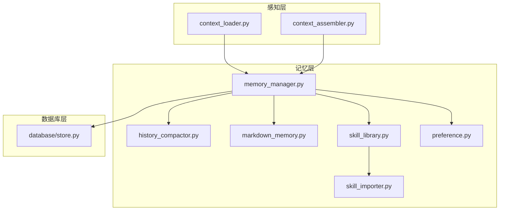
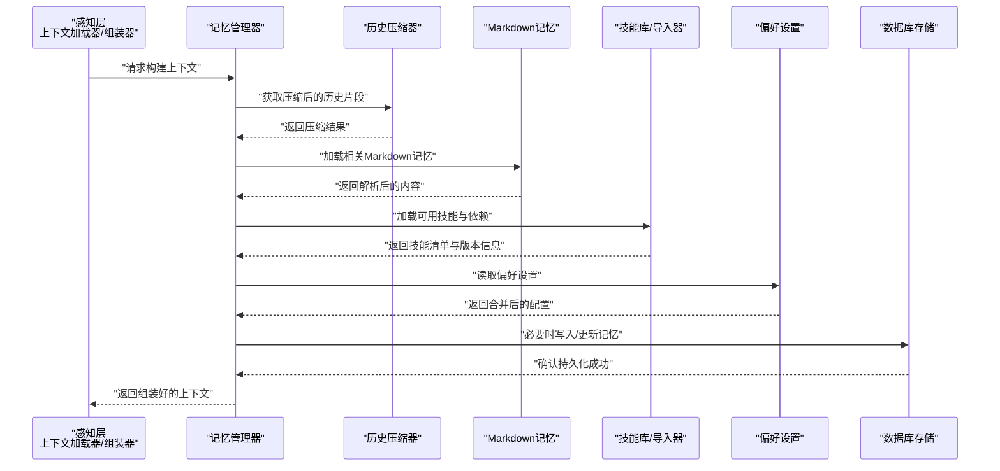
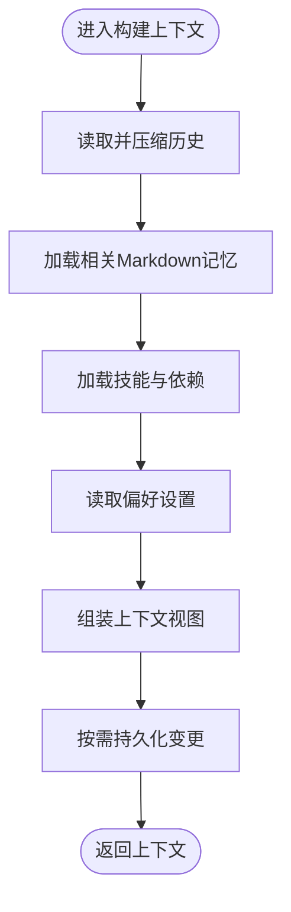
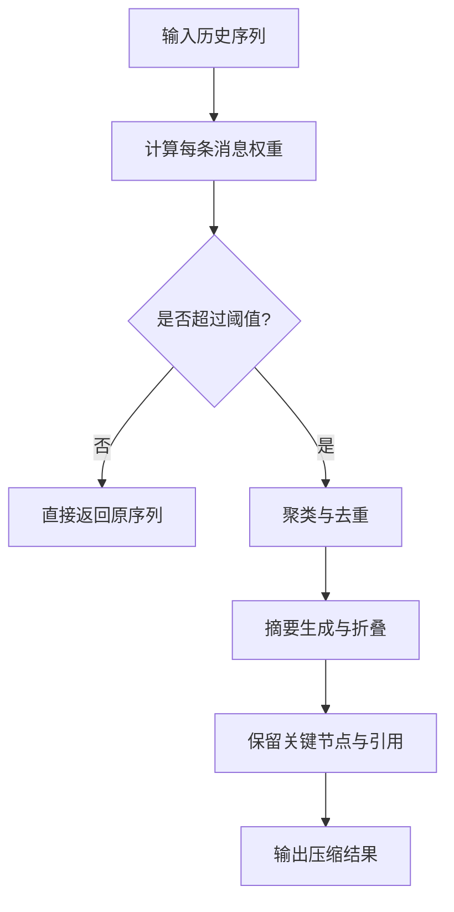
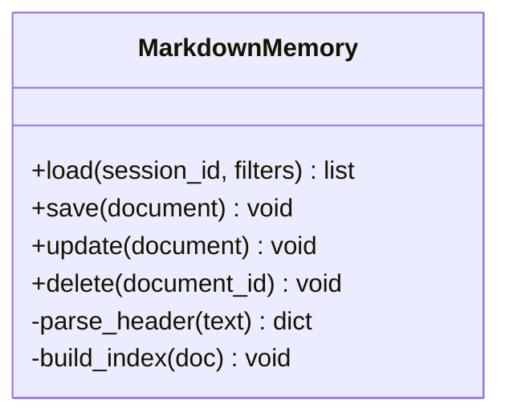
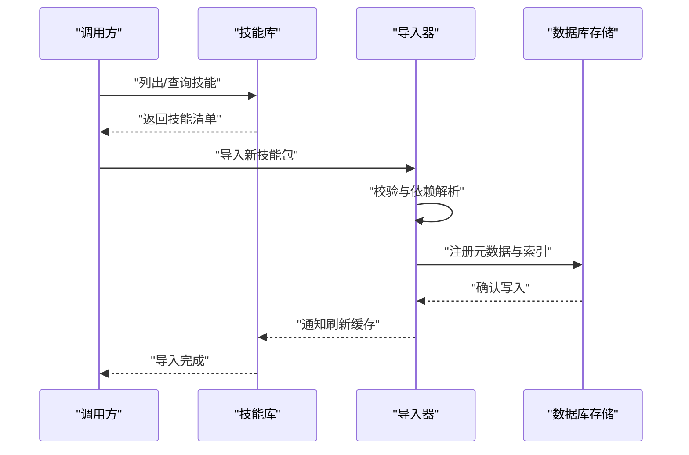
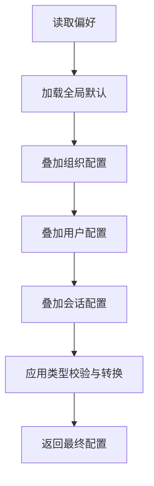
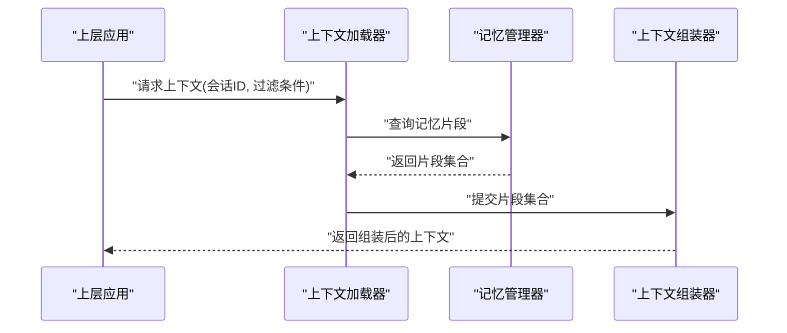
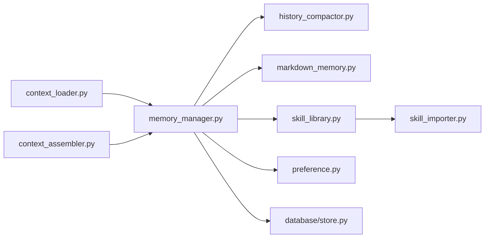

# 记忆系统

<cite>
**本文引用的文件**   
- [memory_manager.py](file://opc/layer5_memory/memory_manager.py)
- [history_compactor.py](file://opc/layer5_memory/history_compactor.py)
- [markdown_memory.py](file://opc/layer5_memory/markdown_memory.py)
- [skill_library.py](file://opc/layer5_memory/skill_library.py)
- [skill_importer.py](file://opc/layer5_memory/skill_importer.py)
- [preference.py](file://opc/layer5_memory/preference.py)
- [context_loader.py](file://opc/layer1_perception/context_loader.py)
- [context_assembler.py](file://opc/layer1_perception/context_assembler.py)
- [store.py](file://opc/database/store.py)
</cite>

## 目录
1. [简介](#简介)
2. [项目结构](#项目结构)
3. [核心组件](#核心组件)
4. [架构总览](#架构总览)
5. [详细组件分析](#详细组件分析)
6. [依赖关系分析](#依赖关系分析)
7. [性能考虑](#性能考虑)
8. [故障排查指南](#故障排查指南)
9. [结论](#结论)
10. [附录](#附录)

## 简介
本文件面向OpenOPC的记忆系统，聚焦以下目标：
- 解释记忆管理的整体架构与数据持久化策略
- 说明会话历史管理（上下文压缩、检索优化、存储策略）
- 描述技能库管理机制（定义、版本控制、依赖管理）
- 阐述偏好设置系统的个性化配置能力
- 规范Markdown记忆的格式与解析规则
- 提供备份恢复与迁移方案
- 给出清理策略与存储空间优化建议
- 提供记忆查询API使用示例与性能调优建议

## 项目结构
记忆系统主要位于 layer5_memory 层，并与 perception 层的上下文加载器、组装器协作，底层通过 database.store 进行持久化。

图表来源
- [context_loader.py](file://opc/layer1_perception/context_loader.py)
- [context_assembler.py](file://opc/layer1_perception/context_assembler.py)
- [memory_manager.py](file://opc/layer5_memory/memory_manager.py)
- [history_compactor.py](file://opc/layer5_memory/history_compactor.py)
- [markdown_memory.py](file://opc/layer5_memory/markdown_memory.py)
- [skill_library.py](file://opc/layer5_memory/skill_library.py)
- [skill_importer.py](file://opc/layer5_memory/skill_importer.py)
- [preference.py](file://opc/layer5_memory/preference.py)
- [store.py](file://opc/database/store.py)

章节来源
- [memory_manager.py](file://opc/layer5_memory/memory_manager.py)
- [context_loader.py](file://opc/layer1_perception/context_loader.py)
- [context_assembler.py](file://opc/layer1_perception/context_assembler.py)
- [store.py](file://opc/database/store.py)

## 核心组件
- 记忆管理器：统一编排会话记忆、历史压缩、Markdown记忆、技能库与偏好设置的读写与生命周期。
- 历史压缩器：对长会话历史进行摘要、折叠与裁剪，以控制上下文窗口大小并提升检索效率。
- Markdown记忆：将结构化或半结构化信息以Markdown形式持久化，并提供解析与重建能力。
- 技能库：维护技能清单、元数据、版本与依赖，支持导入与校验。
- 偏好设置：用户/会话级个性化配置，支持默认值、覆盖与合并策略。
- 上下文加载器/组装器：从记忆层读取必要片段，组装为模型可用的上下文视图。
- 数据库存储：统一的持久化接口，负责落盘、事务与一致性保障。

章节来源
- [memory_manager.py](file://opc/layer5_memory/memory_manager.py)
- [history_compactor.py](file://opc/layer5_memory/history_compactor.py)
- [markdown_memory.py](file://opc/layer5_memory/markdown_memory.py)
- [skill_library.py](file://opc/layer5_memory/skill_library.py)
- [skill_importer.py](file://opc/layer5_memory/skill_importer.py)
- [preference.py](file://opc/layer5_memory/preference.py)
- [context_loader.py](file://opc/layer1_perception/context_loader.py)
- [context_assembler.py](file://opc/layer1_perception/context_assembler.py)
- [store.py](file://opc/database/store.py)

## 架构总览
记忆系统采用分层设计：上层由感知层消费记忆；中层由记忆管理器协调各子模块；下层通过数据库存储实现持久化。

图表来源
- [context_loader.py](file://opc/layer1_perception/context_loader.py)
- [context_assembler.py](file://opc/layer1_perception/context_assembler.py)
- [memory_manager.py](file://opc/layer5_memory/memory_manager.py)
- [history_compactor.py](file://opc/layer5_memory/history_compactor.py)
- [markdown_memory.py](file://opc/layer5_memory/markdown_memory.py)
- [skill_library.py](file://opc/layer5_memory/skill_library.py)
- [skill_importer.py](file://opc/layer5_memory/skill_importer.py)
- [preference.py](file://opc/layer5_memory/preference.py)
- [store.py](file://opc/database/store.py)

## 详细组件分析

### 记忆管理器（MemoryManager）
职责
- 统一入口：对外暴露会话记忆、历史压缩、Markdown记忆、技能与偏好的访问方法
- 生命周期：初始化时加载基础配置与索引，关闭时执行必要的刷新与检查点
- 一致性：在写入路径上保证原子性与幂等性，避免并发冲突

关键流程
- 上下文构建：按优先级拉取最近历史、相关Markdown片段、技能与偏好，交由组装器生成最终上下文
- 写入路径：先写内存缓存，再批量落盘，失败回滚
- 压缩触发：当历史长度超过阈值或达到时间间隔时触发压缩

图表来源
- [memory_manager.py](file://opc/layer5_memory/memory_manager.py)
- [history_compactor.py](file://opc/layer5_memory/history_compactor.py)
- [markdown_memory.py](file://opc/layer5_memory/markdown_memory.py)
- [skill_library.py](file://opc/layer5_memory/skill_library.py)
- [preference.py](file://opc/layer5_memory/preference.py)
- [store.py](file://opc/database/store.py)

章节来源
- [memory_manager.py](file://opc/layer5_memory/memory_manager.py)

### 历史压缩器（HistoryCompactor）
功能要点
- 压缩策略：基于重要性评分、时间衰减与主题聚类进行摘要与折叠
- 保留语义：确保关键决策、错误与修复记录不被丢失
- 可逆性：保留足够元数据以便后续回溯与重建

复杂度与优化
- 时间复杂度：近似O(n log n)，n为消息数量
- 空间复杂度：压缩后显著降低，便于快速检索
- 批处理：批量压缩减少IO次数

图表来源
- [history_compactor.py](file://opc/layer5_memory/history_compactor.py)

章节来源
- [history_compactor.py](file://opc/layer5_memory/history_compactor.py)

### Markdown记忆（MarkdownMemory）
格式规范
- 头部元数据：包含标题、标签、创建/更新时间、关联会话ID、版本等
- 正文结构：使用标准Markdown语法，支持列表、表格、代码块与链接
- 分区标记：通过特定分隔符划分不同逻辑段落，便于选择性加载

解析规则
- 增量解析：仅解析变更部分，提高性能
- 容错机制：对不完整或损坏的文档进行降级处理
- 索引构建：建立轻量索引以加速检索

图表来源
- [markdown_memory.py](file://opc/layer5_memory/markdown_memory.py)

章节来源
- [markdown_memory.py](file://opc/layer5_memory/markdown_memory.py)

### 技能库（SkillLibrary）与导入器（SkillImporter）
管理能力
- 定义：每个技能包含名称、版本、描述、入口脚本、工具集与依赖声明
- 版本控制：支持多版本并存与切换，记录变更日志
- 依赖管理：解析依赖树，检测冲突与缺失，自动安装或提示

导入流程
- 校验：签名验证、沙箱检查、权限评估
- 注册：写入技能清单与元数据索引
- 激活：加载运行时所需资源，建立钩子

图表来源
- [skill_library.py](file://opc/layer5_memory/skill_library.py)
- [skill_importer.py](file://opc/layer5_memory/skill_importer.py)
- [store.py](file://opc/database/store.py)

章节来源
- [skill_library.py](file://opc/layer5_memory/skill_library.py)
- [skill_importer.py](file://opc/layer5_memory/skill_importer.py)

### 偏好设置（Preference）
特性
- 作用域：全局、组织、会话、用户四级覆盖
- 合并策略：自底向上合并，显式覆盖优于默认值
- 热更新：运行时生效，无需重启服务

数据结构
- 键值对为主，支持嵌套结构与类型约束
- 变更记录：记录修改者与时间戳，便于审计

图表来源
- [preference.py](file://opc/layer5_memory/preference.py)

章节来源
- [preference.py](file://opc/layer5_memory/preference.py)

### 上下文加载器与组装器（ContextLoader / ContextAssembler）
职责
- 加载器：根据当前任务与用户意图，定位需要加载的记忆片段
- 组装器：将历史、Markdown、技能与偏好整合为模型可读的结构化上下文

交互模式
- 按需加载：只拉取必要片段，减少上下文体积
- 优先级排序：重要信息优先展示，无关信息后置或折叠

图表来源
- [context_loader.py](file://opc/layer1_perception/context_loader.py)
- [context_assembler.py](file://opc/layer1_perception/context_assembler.py)
- [memory_manager.py](file://opc/layer5_memory/memory_manager.py)

章节来源
- [context_loader.py](file://opc/layer1_perception/context_loader.py)
- [context_assembler.py](file://opc/layer1_perception/context_assembler.py)

## 依赖关系分析
记忆子系统内部耦合度低、内聚度高，通过明确接口与事件驱动解耦。

图表来源
- [memory_manager.py](file://opc/layer5_memory/memory_manager.py)
- [history_compactor.py](file://opc/layer5_memory/history_compactor.py)
- [markdown_memory.py](file://opc/layer5_memory/markdown_memory.py)
- [skill_library.py](file://opc/layer5_memory/skill_library.py)
- [skill_importer.py](file://opc/layer5_memory/skill_importer.py)
- [preference.py](file://opc/layer5_memory/preference.py)
- [context_loader.py](file://opc/layer1_perception/context_loader.py)
- [context_assembler.py](file://opc/layer1_perception/context_assembler.py)
- [store.py](file://opc/database/store.py)

章节来源
- [memory_manager.py](file://opc/layer5_memory/memory_manager.py)
- [store.py](file://opc/database/store.py)

## 性能考虑
- 压缩与索引
  - 历史压缩降低上下文体积，配合Markdown索引提升检索速度
  - 建议开启增量解析与懒加载，避免一次性全量读取
- 批处理与缓存
  - 批量写入与批量查询减少IO开销
  - 热点数据（常用技能、近期历史）加入内存缓存
- 异步与并发
  - 压缩与导入操作异步执行，避免阻塞主流程
  - 并发安全：读写锁保护共享状态，避免竞态
- 存储优化
  - 分片存储：按会话或主题分片，缩小单文件大小
  - 压缩归档：冷数据归档至压缩格式，节省磁盘空间

[本节为通用指导，不直接分析具体文件]

## 故障排查指南
常见问题与定位
- 上下文过大导致超时
  - 检查历史压缩阈值与策略是否合理
  - 查看Markdown索引是否完整
- 技能导入失败
  - 核对依赖解析与签名校验日志
  - 确认沙箱权限与网络可达性
- 偏好未生效
  - 检查作用域覆盖顺序与类型校验
  - 确认热更新是否触发
- 持久化异常
  - 检查数据库连接与事务状态
  - 查看回滚与重试日志

章节来源
- [history_compactor.py](file://opc/layer5_memory/history_compactor.py)
- [skill_importer.py](file://opc/layer5_memory/skill_importer.py)
- [preference.py](file://opc/layer5_memory/preference.py)
- [store.py](file://opc/database/store.py)

## 结论
OpenOPC记忆系统通过清晰的分层与模块化设计，实现了高效的会话历史管理、灵活的Markdown记忆、完善的技能库与偏好体系。借助压缩、索引与批处理等优化手段，系统在可扩展性与性能之间取得良好平衡。建议在生产环境结合业务特征调整压缩阈值、索引粒度与缓存策略，以获得最佳体验。

[本节为总结性内容，不直接分析具体文件]

## 附录

### 记忆清理策略与存储空间优化
- 清理策略
  - 基于时间的过期清理：移除长时间未访问的历史与Markdown文档
  - 基于大小的上限：当存储接近阈值时触发压缩与归档
  - 基于重要性的淘汰：低权重片段优先清理
- 存储优化
  - 冷热分层：热数据常驻内存与SSD，冷数据归档至低成本介质
  - 去重与压缩：对重复内容与旧版本进行去重与压缩

[本节为通用指导，不直接分析具体文件]

### 备份恢复与迁移方案
- 备份
  - 定期快照：对数据库与Markdown存储进行一致性快照
  - 增量备份：记录变更日志，缩短恢复时间
- 恢复
  - 全量恢复：从最新快照还原
  - 时间点恢复：基于增量日志恢复到指定时刻
- 迁移
  - 版本兼容：确保新旧schema兼容，提供迁移脚本
  - 灰度发布：分批迁移，观察指标后再全量切换

[本节为通用指导，不直接分析具体文件]

### 记忆查询API使用示例与性能调优建议
- 使用示例
  - 查询会话历史：传入会话ID与时间范围，返回压缩后的历史片段
  - 检索Markdown记忆：按标签、标题或关键词检索，支持分页
  - 列出技能：按版本或依赖筛选，返回元数据与状态
  - 读取偏好：按作用域读取合并后的配置
- 性能调优
  - 索引优化：为高频字段建立索引，减少扫描范围
  - 查询改写：将复杂条件拆分为多次简单查询，利用缓存
  - 连接池：复用数据库连接，降低握手开销
  - 监控与告警：关注慢查询与错误率，及时调整参数

[本节为通用指导，不直接分析具体文件]