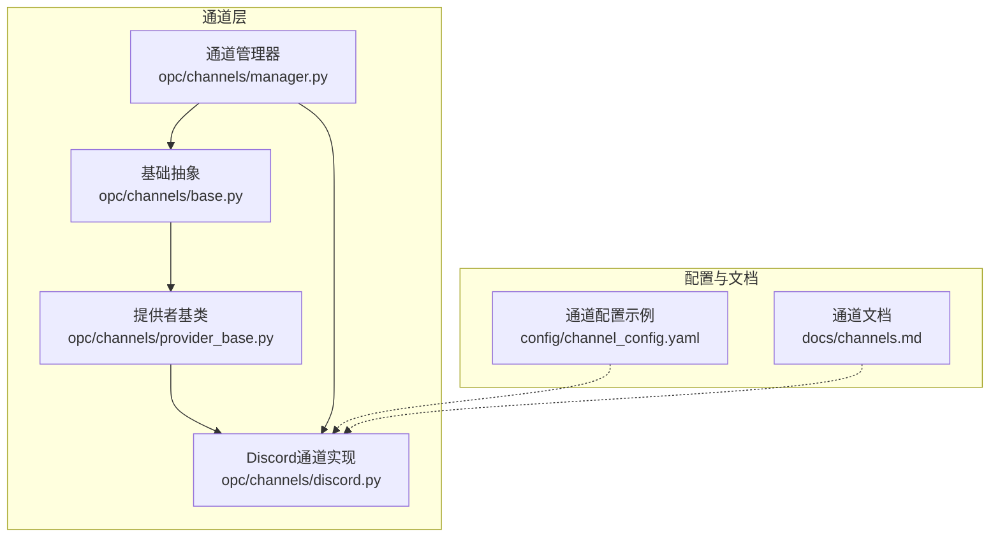
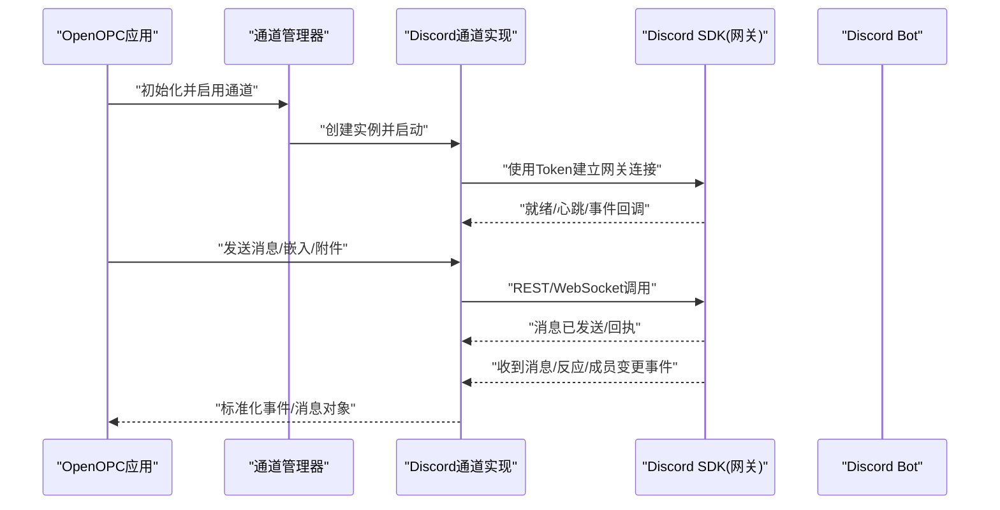
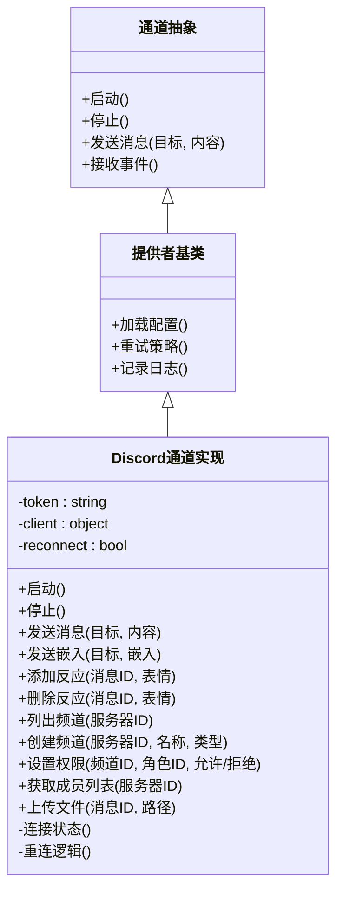
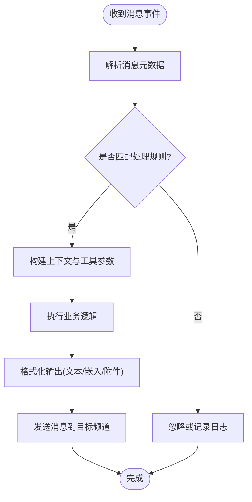
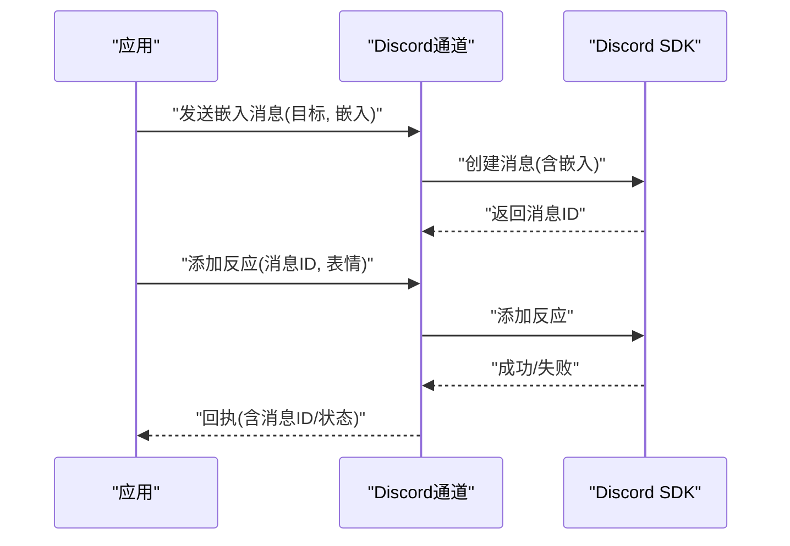
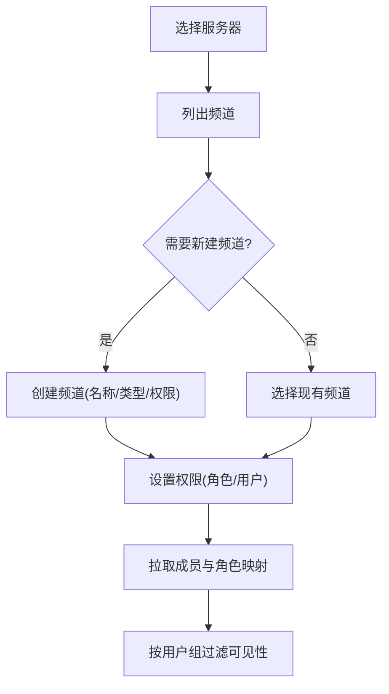
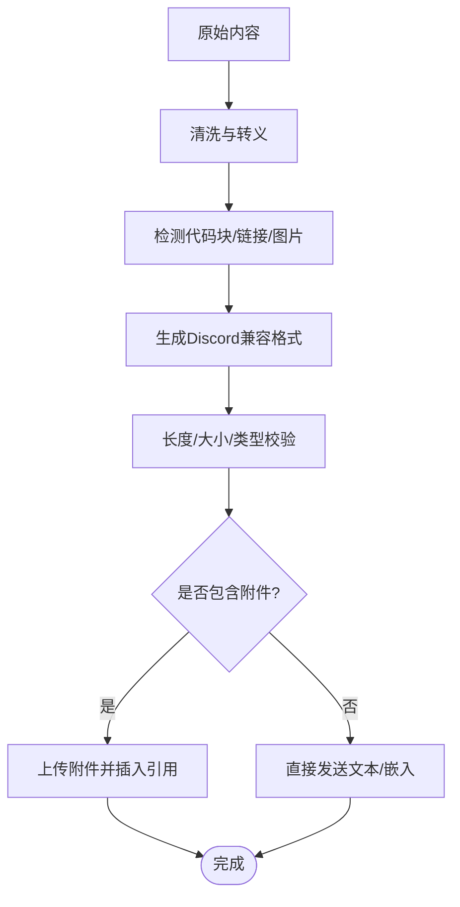
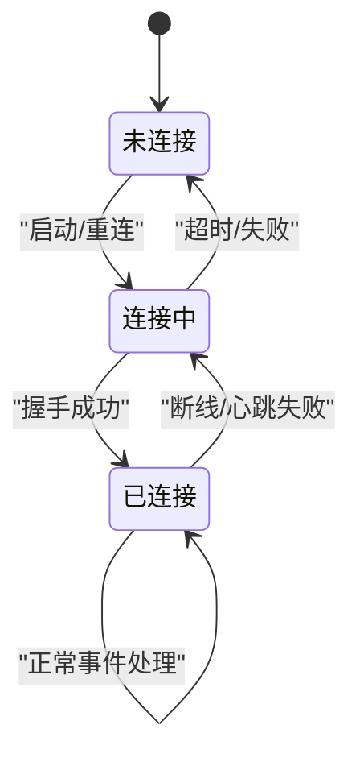
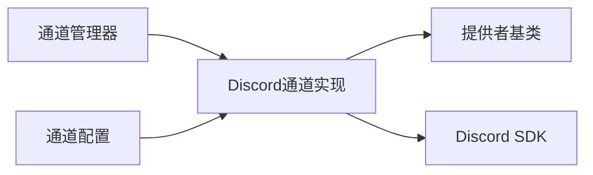

# Discord通道

<cite>
**本文引用的文件**   
- [discord.py](file://opc/channels/discord.py)
- [base.py](file://opc/channels/base.py)
- [provider_base.py](file://opc/channels/provider_base.py)
- [manager.py](file://opc/channels/manager.py)
- [channel_config.yaml](file://config/channel_config.yaml)
- [channels.md](file://docs/channels.md)
</cite>

## 目录
1. [简介](#简介)
2. [项目结构](#项目结构)
3. [核心组件](#核心组件)
4. [架构总览](#架构总览)
5. [详细组件分析](#详细组件分析)
6. [依赖关系分析](#依赖关系分析)
7. [性能与可靠性](#性能与可靠性)
8. [故障排查指南](#故障排查指南)
9. [结论](#结论)
10. [附录：应用配置与接入清单](#附录应用配置与接入清单)

## 简介
本章节面向需要在OpenOPC中集成Discord通道的开发者，提供从Bot注册、Token获取、权限配置到消息处理、嵌入消息、反应系统、服务器管理、频道操作、用户组能力、消息格式化（含代码块）、文件上传、连接状态监控、自动重连与错误处理的完整实现文档。目标是帮助开发者顺利完成Discord渠道的集成与上线。

## 项目结构
OpenOPC将各外部平台以“通道”的形式统一接入，Discord通道位于通道模块下，遵循统一的接口契约并通过管理器进行生命周期与路由管理。

图表来源
- [discord.py](file://opc/channels/discord.py)
- [base.py](file://opc/channels/base.py)
- [provider_base.py](file://opc/channels/provider_base.py)
- [manager.py](file://opc/channels/manager.py)
- [channel_config.yaml](file://config/channel_config.yaml)
- [channels.md](file://docs/channels.md)

章节来源
- [discord.py](file://opc/channels/discord.py)
- [base.py](file://opc/channels/base.py)
- [provider_base.py](file://opc/channels/provider_base.py)
- [manager.py](file://opc/channels/manager.py)
- [channel_config.yaml](file://config/channel_config.yaml)
- [channels.md](file://docs/channels.md)

## 核心组件
- 通道抽象与契约：定义所有通道必须实现的通用接口，包括启动、停止、发送消息、接收事件等。
- 提供者基类：封装跨平台的通用能力（如重试、日志、配置加载），供具体通道复用。
- Discord通道实现：基于Discord官方SDK完成网关连接、事件监听、消息收发、嵌入消息、反应、服务器与频道管理等。
- 通道管理器：负责通道的注册、发现、生命周期管理与路由分发。

章节来源
- [base.py](file://opc/channels/base.py)
- [provider_base.py](file://opc/channels/provider_base.py)
- [discord.py](file://opc/channels/discord.py)
- [manager.py](file://opc/channels/manager.py)

## 架构总览
下图展示了OpenOPC与Discord之间的交互流程：上层通过管理器调用通道，通道内部使用Discord SDK建立长连接并处理事件；同时支持嵌入消息、反应、附件上传等高级特性。

图表来源
- [discord.py](file://opc/channels/discord.py)
- [manager.py](file://opc/channels/manager.py)

## 详细组件分析

### Discord通道实现
- 功能范围
  - 网关连接与会话管理：基于Token建立连接，维护会话状态，支持断线重连。
  - 事件监听：订阅消息、反应、成员加入/离开、频道更新等事件。
  - 消息处理：文本、嵌入消息、命令解析、上下文组装。
  - 反应系统：添加/删除反应，按规则聚合或触发后续动作。
  - 服务器与频道管理：列出/创建/更新频道，读取/设置权限，拉取成员列表。
  - 用户组能力：基于角色/标签对用户分组，用于权限与可见性控制。
  - 消息格式化：Markdown渲染、代码块高亮、链接预览。
  - 文件上传：图片、文档等多类型附件上传与大小限制校验。
  - 状态监控：连接状态、延迟、错误计数、指标上报。
- 关键设计点
  - 与通道抽象保持一致的接口，便于替换与扩展。
  - 错误分类与可恢复策略：网络异常、限流、权限不足等差异化处理。
  - 并发安全：事件处理与消息发送的队列化与去重。
  - 配置驱动：从配置中心加载Bot Token、白名单、默认权限等。

章节来源
- [discord.py](file://opc/channels/discord.py)

#### 类图（Discord通道）

图表来源
- [base.py](file://opc/channels/base.py)
- [provider_base.py](file://opc/channels/provider_base.py)
- [discord.py](file://opc/channels/discord.py)

### 消息处理流程
- 入口：Discord网关推送消息事件至通道实现。
- 解析：提取作者、频道、时间戳、内容、附件、提及等元数据。
- 路由：根据频道/角色/命令前缀决定由哪个业务处理器响应。
- 执行：调用上层服务生成回复，必要时携带嵌入或附件。
- 回写：通过REST/WebSocket将结果写回目标频道。

图表来源
- [discord.py](file://opc/channels/discord.py)

章节来源
- [discord.py](file://opc/channels/discord.py)

### 嵌入消息与反应系统
- 嵌入消息：支持标题、描述、字段、图片、页脚等结构化展示，适合任务进度、统计卡片、富信息摘要。
- 反应系统：为消息添加/移除表情，可用于投票、确认、快速反馈；通道实现需保证幂等与去重。

图表来源
- [discord.py](file://opc/channels/discord.py)

章节来源
- [discord.py](file://opc/channels/discord.py)

### 服务器管理、频道操作与用户组
- 服务器管理：列举服务器、获取服务器详情、同步成员与角色。
- 频道操作：创建/更新/删除频道，设置可见性与权限，按类型区分文本/语音/公告等。
- 用户组：基于角色或自定义标签对用户分组，配合权限策略控制消息可见性与操作范围。

图表来源
- [discord.py](file://opc/channels/discord.py)

章节来源
- [discord.py](file://opc/channels/discord.py)

### 消息格式化、代码块显示与文件上传
- 格式化：支持Markdown语法，自动转义敏感字符，避免XSS风险。
- 代码块：按语言标识进行高亮，限制长度与嵌套层级，防止超限被Discord拒绝。
- 文件上传：支持常见媒体与文档格式，校验大小与类型，分片上传与失败重试。

图表来源
- [discord.py](file://opc/channels/discord.py)

章节来源
- [discord.py](file://opc/channels/discord.py)

### 连接状态监控、自动重连与错误处理
- 连接监控：维护连接状态、延迟、错误计数，暴露健康检查接口。
- 自动重连：指数退避、最大重试次数、抖动随机化，避免雪崩。
- 错误处理：区分网络错误、限流、权限不足、无效Token等，记录上下文并告警。

图表来源
- [discord.py](file://opc/channels/discord.py)

章节来源
- [discord.py](file://opc/channels/discord.py)

## 依赖关系分析
- 内部依赖
  - Discord通道实现继承自提供者基类，复用通用能力。
  - 通道管理器负责实例化与调度Discord通道。
- 外部依赖
  - Discord官方SDK：负责网关连接、REST API调用、事件回调。
  - 配置中心：提供Bot Token、白名单、默认权限等。

图表来源
- [manager.py](file://opc/channels/manager.py)
- [discord.py](file://opc/channels/discord.py)
- [provider_base.py](file://opc/channels/provider_base.py)
- [channel_config.yaml](file://config/channel_config.yaml)

章节来源
- [manager.py](file://opc/channels/manager.py)
- [discord.py](file://opc/channels/discord.py)
- [provider_base.py](file://opc/channels/provider_base.py)
- [channel_config.yaml](file://config/channel_config.yaml)

## 性能与可靠性
- 事件处理
  - 采用队列化与批处理降低频繁I/O开销。
  - 对高频事件（如大量反应）进行合并与节流。
- 消息发送
  - 批量发送时进行速率限制与重试。
  - 大附件分片上传，失败自动重试。
- 资源占用
  - 合理设置连接池与缓存，避免内存泄漏。
  - 定期清理过期消息与反应缓存。
- 可观测性
  - 暴露连接状态、延迟、错误率、QPS等指标。
  - 结构化日志，便于定位问题。

[本节为通用指导，不直接分析具体文件]

## 故障排查指南
- 无法连接
  - 检查Token是否正确、是否过期。
  - 确认网络可达与防火墙策略。
  - 查看重连日志与错误码。
- 权限不足
  - 核对Bot在服务器中的权限（发送消息、嵌入、反应、管理频道等）。
  - 确认频道可见性与角色覆盖。
- 消息发送失败
  - 检查内容长度、附件大小与类型。
  - 关注限流提示，适当退避重试。
- 事件丢失
  - 确认事件订阅是否完整。
  - 检查消费者处理是否阻塞或抛出异常。

章节来源
- [discord.py](file://opc/channels/discord.py)

## 结论
通过统一的通道抽象与Discord通道实现，OpenOPC能够稳定地对接Discord生态，提供丰富的消息与互动能力。结合完善的配置、权限、监控与错误处理机制，开发者可以快速集成并上线高质量的Discord渠道。

[本节为总结，不直接分析具体文件]

## 附录：应用配置与接入清单
- 应用注册与Token获取
  - 在Discord开发者门户创建应用，启用Bot功能，生成并保存Token。
  - 将Token写入OpenOPC通道配置项，确保仅部署环境可读。
- 权限设置
  - 为Bot授予必要权限：发送消息、嵌入链接、添加/删除反应、管理频道、读取成员等。
  - 在服务器中邀请Bot并分配合适角色。
- 事件监听与网关连接
  - 配置意图开关（如消息内容、成员列表等），按需开启以减少权限需求。
  - 验证连接状态与健康检查接口。
- 服务器与频道管理
  - 预置常用频道模板与权限策略。
  - 自动化创建/归档频道的策略与触发条件。
- 用户组与可见性
  - 基于角色或标签划分用户组，控制消息可见性与操作权限。
- 消息格式化与附件
  - 规范Markdown使用，避免超长内容。
  - 设定附件大小上限与允许类型，做好校验与降级。
- 监控与告警
  - 接入指标采集与日志收集，设置阈值告警。
  - 定期演练重连与故障恢复流程。

章节来源
- [channel_config.yaml](file://config/channel_config.yaml)
- [channels.md](file://docs/channels.md)