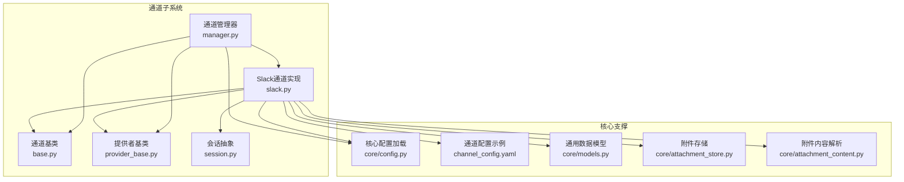
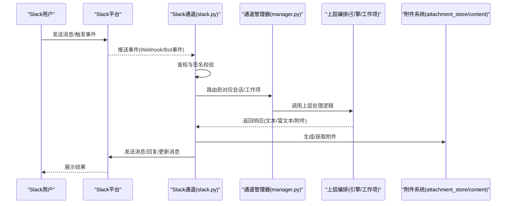
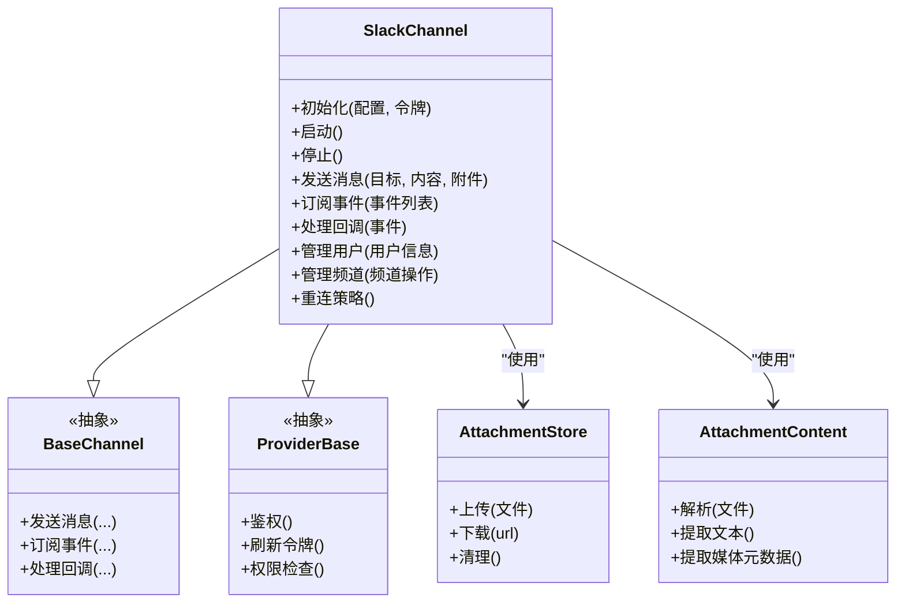
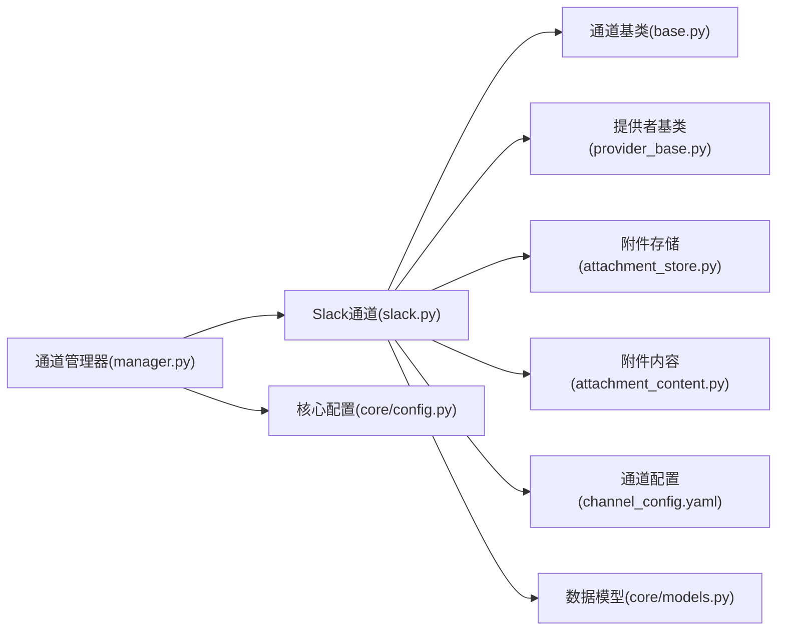

# Slack通道

<cite>
**本文引用的文件**   
- [opc/channels/slack.py](file://opc/channels/slack.py)
- [opc/channels/base.py](file://opc/channels/base.py)
- [opc/channels/provider_base.py](file://opc/channels/provider_base.py)
- [opc/channels/manager.py](file://opc/channels/manager.py)
- [config/channel_config.yaml](file://config/channel_config.yaml)
- [opc/core/config.py](file://opc/core/config.py)
- [opc/core/models.py](file://opc/core/models.py)
- [opc/core/attachment_store.py](file://opc/core/attachment_store.py)
- [opc/core/attachment_content.py](file://opc/core/attachment_content.py)
- [opc/channels/session.py](file://opc/channels/session.py)
- [opc/channels/__init__.py](file://opc/channels/__init__.py)
</cite>

## 目录
1. [简介](#简介)
2. [项目结构](#项目结构)
3. [核心组件](#核心组件)
4. [架构总览](#架构总览)
5. [详细组件分析](#详细组件分析)
6. [依赖关系分析](#依赖关系分析)
7. [性能考虑](#性能考虑)
8. [故障排查指南](#故障排查指南)
9. [结论](#结论)
10. [附录](#附录)

## 简介
本文件面向开发者，提供OpenOPC中Slack通道的完整实现文档。内容覆盖：
- Slack Bot API集成、OAuth应用安装与授权流程
- 消息发送、频道管理与用户交互能力
- 应用配置步骤（Bot Token、事件订阅、权限范围）
- 消息格式转换、Block Kit支持与附件处理
- 用户身份验证、角色映射与访问控制
- WebSocket连接管理、重连机制与错误恢复策略
目标是帮助开发者正确集成并稳定运行Slack渠道。

## 项目结构
OpenOPC的通道子系统采用“提供者基类 + 具体通道实现 + 通道管理器”的分层设计。Slack通道位于通道模块下，遵循统一的接口契约，并通过配置加载与注册机制接入运行时。

图表来源
- [opc/channels/slack.py](file://opc/channels/slack.py)
- [opc/channels/base.py](file://opc/channels/base.py)
- [opc/channels/provider_base.py](file://opc/channels/provider_base.py)
- [opc/channels/manager.py](file://opc/channels/manager.py)
- [opc/channels/session.py](file://opc/channels/session.py)
- [opc/core/config.py](file://opc/core/config.py)
- [config/channel_config.yaml](file://config/channel_config.yaml)
- [opc/core/models.py](file://opc/core/models.py)
- [opc/core/attachment_store.py](file://opc/core/attachment_store.py)
- [opc/core/attachment_content.py](file://opc/core/attachment_content.py)

章节来源
- [opc/channels/slack.py](file://opc/channels/slack.py)
- [opc/channels/base.py](file://opc/channels/base.py)
- [opc/channels/provider_base.py](file://opc/channels/provider_base.py)
- [opc/channels/manager.py](file://opc/channels/manager.py)
- [opc/channels/session.py](file://opc/channels/session.py)
- [opc/core/config.py](file://opc/core/config.py)
- [config/channel_config.yaml](file://config/channel_config.yaml)
- [opc/core/models.py](file://opc/core/models.py)
- [opc/core/attachment_store.py](file://opc/core/attachment_store.py)
- [opc/core/attachment_content.py](file://opc/core/attachment_content.py)

## 核心组件
- 通道基类与提供者基类：定义统一的消息收发、会话生命周期、认证与事件回调等接口，确保各通道行为一致。
- Slack通道实现：基于Slack Web API与WebSocket（Bolt/RTM）完成消息收发、事件订阅、用户与频道查询、附件上传下载等。
- 通道管理器：负责通道发现、初始化、配置注入与生命周期管理。
- 会话抽象：封装跨通道的会话上下文、路由键与状态。
- 核心配置与模型：集中读取环境变量与配置文件，提供统一的数据结构与校验。
- 附件系统：提供附件存储、类型识别与内容提取，支持多模态输入输出。

章节来源
- [opc/channels/base.py](file://opc/channels/base.py)
- [opc/channels/provider_base.py](file://opc/channels/provider_base.py)
- [opc/channels/slack.py](file://opc/channels/slack.py)
- [opc/channels/manager.py](file://opc/channels/manager.py)
- [opc/channels/session.py](file://opc/channels/session.py)
- [opc/core/config.py](file://opc/core/config.py)
- [opc/core/models.py](file://opc/core/models.py)
- [opc/core/attachment_store.py](file://opc/core/attachment_store.py)
- [opc/core/attachment_content.py](file://opc/core/attachment_content.py)

## 架构总览
下图展示Slack通道在OpenOPC中的整体位置与关键交互路径：外部Slack事件通过Slack通道进入，经会话与模型适配后交由上层编排；响应消息经格式化与附件处理后回写至Slack。

图表来源
- [opc/channels/slack.py](file://opc/channels/slack.py)
- [opc/channels/manager.py](file://opc/channels/manager.py)
- [opc/core/attachment_store.py](file://opc/core/attachment_store.py)
- [opc/core/attachment_content.py](file://opc/core/attachment_content.py)

## 详细组件分析

### Slack通道实现（Slack通道）
- 职责
  - 建立与Slack的连接（Webhook或WebSocket），订阅所需事件
  - 将Slack事件转换为内部消息模型，并路由到会话与工作项
  - 将内部响应渲染为Slack消息（支持Block Kit富文本与附件）
  - 管理用户身份、角色映射与访问控制
  - 维护连接健康度，实现重连与错误恢复
- 关键能力
  - OAuth应用安装与授权：引导用户完成应用安装与权限授予，持久化Token
  - 事件订阅：消息、反应、成员变更、频道管理等事件
  - 消息发送：单条/批量、线程回复、消息更新
  - 频道管理：创建/加入/列出/归档等
  - 用户交互：按钮、选择器、对话框等交互回调
  - 附件处理：上传/下载、预览、大小限制与类型白名单
  - 身份与权限：用户ID映射、角色绑定、最小权限原则
  - 连接管理：心跳、断线重连、指数退避、幂等处理
- 典型流程
  - 应用安装：生成安装链接 -> 用户授权 -> 回调保存Token -> 启动事件监听
  - 消息处理：接收事件 -> 鉴权 -> 解析用户/频道 -> 路由到工作项 -> 渲染响应 -> 发送
  - 附件流程：本地/远程附件 -> 上传至Slack -> 消息引用附件URL -> 下载与内容解析

图表来源
- [opc/channels/slack.py](file://opc/channels/slack.py)
- [opc/channels/base.py](file://opc/channels/base.py)
- [opc/channels/provider_base.py](file://opc/channels/provider_base.py)
- [opc/core/attachment_store.py](file://opc/core/attachment_store.py)
- [opc/core/attachment_content.py](file://opc/core/attachment_content.py)

章节来源
- [opc/channels/slack.py](file://opc/channels/slack.py)
- [opc/channels/base.py](file://opc/channels/base.py)
- [opc/channels/provider_base.py](file://opc/channels/provider_base.py)
- [opc/core/attachment_store.py](file://opc/core/attachment_store.py)
- [opc/core/attachment_content.py](file://opc/core/attachment_content.py)

### 通道管理器（Manager）
- 职责
  - 扫描已实现的通道并提供实例化入口
  - 从配置加载通道参数与环境变量
  - 协调通道启动、停止与监控
- 关键点
  - 通道注册表：避免循环导入，延迟加载
  - 配置合并：默认值、环境覆盖、敏感信息隔离
  - 健康检查：周期性探测与告警

章节来源
- [opc/channels/manager.py](file://opc/channels/manager.py)
- [opc/channels/__init__.py](file://opc/channels/__init__.py)

### 会话抽象（Session）
- 职责
  - 统一会话标识（如Slack channel_id/thread_ts组合）
  - 维护会话上下文（用户、角色、工作项关联）
  - 提供跨通道的会话路由键
- 关键点
  - 幂等与会话复用：同一对话上下文内去重与续传
  - 生命周期：创建、活跃、休眠、销毁

章节来源
- [opc/channels/session.py](file://opc/channels/session.py)

### 配置与模型（Core Config & Models）
- 职责
  - 集中读取环境变量与YAML配置
  - 提供通道相关的数据模型与校验
- 关键点
  - 安全：Token与密钥不落地明文日志
  - 可扩展：新增通道仅需扩展配置结构

章节来源
- [opc/core/config.py](file://opc/core/config.py)
- [config/channel_config.yaml](file://config/channel_config.yaml)
- [opc/core/models.py](file://opc/core/models.py)

## 依赖关系分析
- 松耦合：Slack通道仅依赖基类与提供者抽象，便于替换与测试
- 明确边界：附件系统与消息渲染解耦，便于扩展新格式
- 配置驱动：通过配置与模型约束，降低硬编码风险

图表来源
- [opc/channels/slack.py](file://opc/channels/slack.py)
- [opc/channels/base.py](file://opc/channels/base.py)
- [opc/channels/provider_base.py](file://opc/channels/provider_base.py)
- [opc/channels/manager.py](file://opc/channels/manager.py)
- [opc/core/config.py](file://opc/core/config.py)
- [config/channel_config.yaml](file://config/channel_config.yaml)
- [opc/core/models.py](file://opc/core/models.py)
- [opc/core/attachment_store.py](file://opc/core/attachment_store.py)
- [opc/core/attachment_content.py](file://opc/core/attachment_content.py)

章节来源
- [opc/channels/slack.py](file://opc/channels/slack.py)
- [opc/channels/manager.py](file://opc/channels/manager.py)
- [opc/core/config.py](file://opc/core/config.py)
- [config/channel_config.yaml](file://config/channel_config.yaml)
- [opc/core/models.py](file://opc/core/models.py)
- [opc/core/attachment_store.py](file://opc/core/attachment_store.py)
- [opc/core/attachment_content.py](file://opc/core/attachment_content.py)

## 性能考虑
- 连接复用：长连接优先于短连接，减少握手开销
- 批量与分页：列表查询与历史消息拉取采用分页与批处理
- 异步处理：事件处理与消息发送走异步队列，避免阻塞主循环
- 缓存热点：用户/频道元数据短期缓存，降低API调用频率
- 限流与退避：遵循Slack速率限制，失败时指数退避重试
- 附件优化：大附件分块上传、压缩与类型过滤

[本节为通用指导，无需代码来源]

## 故障排查指南
- 常见错误
  - 鉴权失败：检查Bot Token、User Token与作用域是否匹配
  - 事件未收到：确认Webhook URL或Socket Mode已启用且事件订阅正确
  - 消息发送失败：检查目标频道可见性与权限
  - 附件异常：检查大小限制、类型白名单与网络可达性
- 诊断要点
  - 查看连接状态与最近错误码
  - 核对事件签名与时间戳窗口
  - 追踪会话路由键与工作项关联
  - 定位附件上传/下载链路
- 恢复策略
  - 自动重连与指数退避
  - 幂等重试与去重
  - 降级模式：富文本降级为纯文本，附件跳过

章节来源
- [opc/channels/slack.py](file://opc/channels/slack.py)
- [opc/channels/base.py](file://opc/channels/base.py)
- [opc/channels/provider_base.py](file://opc/channels/provider_base.py)
- [opc/core/attachment_store.py](file://opc/core/attachment_store.py)
- [opc/core/attachment_content.py](file://opc/core/attachment_content.py)

## 结论
通过统一的通道抽象与清晰的职责划分，Slack通道在OpenOPC中实现了高内聚、低耦合的集成方案。结合完善的配置、附件与连接管理机制，可保障在生产环境的稳定性与可维护性。建议严格遵循最小权限原则，完善监控与告警，持续优化性能与用户体验。

[本节为总结，无需代码来源]

## 附录

### 应用配置步骤（Slack）
- 创建Slack应用
  - 在Slack平台创建应用，启用Bot功能
  - 配置OAuth作用域：至少包含消息读写、频道列表、用户信息等必要范围
  - 启用事件订阅：消息、反应、成员变更等
  - 配置Socket Mode或Webhook回调地址
- 安装与授权
  - 生成安装链接，引导管理员授权
  - 保存Bot Token与User Token（如需用户身份）
- OpenOPC侧配置
  - 在通道配置文件中添加Slack通道条目，填入Token、回调地址、事件订阅列表
  - 设置环境变量以注入敏感信息（如Token）
  - 启动服务，观察通道管理器是否成功注册与启动
- 验证
  - 向机器人发送消息，确认能收到并回复
  - 尝试富文本与附件，确认渲染与传输正常
  - 检查事件回调是否被正确处理

章节来源
- [config/channel_config.yaml](file://config/channel_config.yaml)
- [opc/core/config.py](file://opc/core/config.py)
- [opc/channels/manager.py](file://opc/channels/manager.py)
- [opc/channels/slack.py](file://opc/channels/slack.py)

### 消息格式与Block Kit
- 文本消息：纯文本与Markdown兼容
- Block Kit：支持富文本、按钮、选择器等交互元素
- 附件：图片、文档、音视频等，注意大小与类型限制
- 渲染策略：根据目标环境与能力自动降级

章节来源
- [opc/channels/slack.py](file://opc/channels/slack.py)
- [opc/core/attachment_store.py](file://opc/core/attachment_store.py)
- [opc/core/attachment_content.py](file://opc/core/attachment_content.py)

### 用户身份、角色映射与访问控制
- 身份映射：将Slack用户ID映射到内部用户实体
- 角色绑定：依据组织策略分配角色与权限
- 访问控制：按频道/工作项粒度进行权限校验
- 审计：记录关键操作与权限变更

章节来源
- [opc/channels/slack.py](file://opc/channels/slack.py)
- [opc/core/models.py](file://opc/core/models.py)

### WebSocket连接管理与重连机制
- 连接建立：优先使用Socket Mode，保持长连接
- 心跳与保活：定期发送心跳，检测对端存活
- 断线重连：指数退避、最大重试次数与抖动
- 幂等与顺序：保证事件处理的幂等性与顺序一致性
- 错误恢复：捕获异常、记录日志、降级与告警

章节来源
- [opc/channels/slack.py](file://opc/channels/slack.py)
- [opc/channels/base.py](file://opc/channels/base.py)