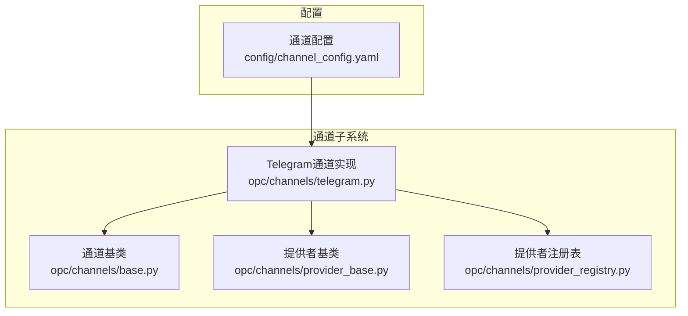
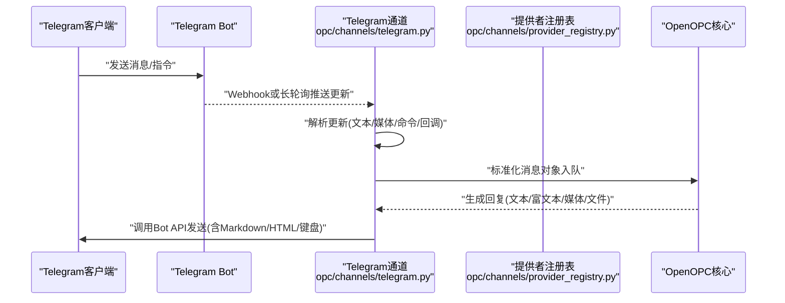
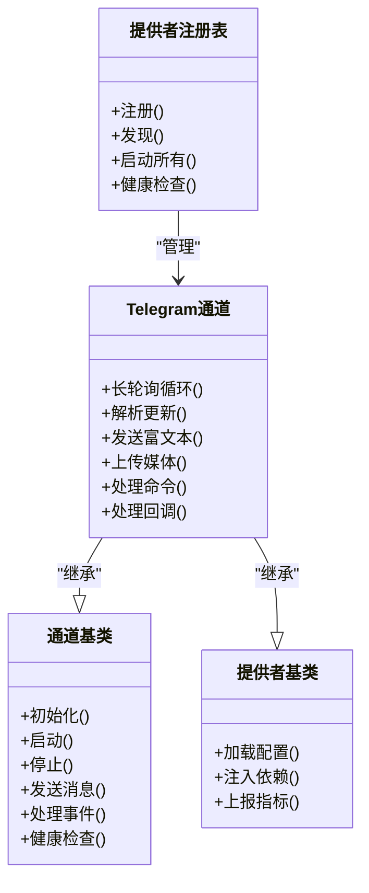

# Telegram通道

<cite>
**本文引用的文件**   
- [opc/channels/telegram.py](file://opc/channels/telegram.py)
- [opc/channels/base.py](file://opc/channels/base.py)
- [opc/channels/provider_base.py](file://opc/channels/provider_base.py)
- [opc/channels/provider_registry.py](file://opc/channels/provider_registry.py)
- [config/channel_config.yaml](file://config/channel_config.yaml)
- [README.md](file://README.md)
</cite>

## 目录
1. [简介](#简介)
2. [项目结构](#项目结构)
3. [核心组件](#核心组件)
4. [架构总览](#架构总览)
5. [详细组件分析](#详细组件分析)
6. [依赖关系分析](#依赖关系分析)
7. [性能考虑](#性能考虑)
8. [故障排查指南](#故障排查指南)
9. [结论](#结论)
10. [附录](#附录)

## 简介
本文件面向开发者，提供OpenOPC中Telegram通道的实现与集成文档。内容涵盖：
- Telegram Bot API集成要点、BotFather创建流程与API Token配置
- 消息类型支持、Markdown与HTML格式渲染策略
- 机器人配置步骤（权限、命令、群组管理）
- 用户隐私保护、群组权限与管理员功能
- 文件传输、多媒体消息与交互式键盘支持
- 长轮询连接管理、错误处理与性能优化建议

目标是帮助开发者正确集成并稳定运行Telegram渠道。

## 项目结构
OpenOPC的通道子系统采用“提供者基类 + 注册表 + 具体通道实现”的分层设计。Telegram通道位于通道模块下，遵循统一的接口契约并通过注册表进行发现与启动。

图表来源
- [opc/channels/base.py](file://opc/channels/base.py)
- [opc/channels/provider_base.py](file://opc/channels/provider_base.py)
- [opc/channels/provider_registry.py](file://opc/channels/provider_registry.py)
- [opc/channels/telegram.py](file://opc/channels/telegram.py)
- [config/channel_config.yaml](file://config/channel_config.yaml)

章节来源
- [opc/channels/telegram.py](file://opc/channels/telegram.py)
- [opc/channels/base.py](file://opc/channels/base.py)
- [opc/channels/provider_base.py](file://opc/channels/provider_base.py)
- [opc/channels/provider_registry.py](file://opc/channels/provider_registry.py)
- [config/channel_config.yaml](file://config/channel_config.yaml)

## 核心组件
- 通道基类：定义通用生命周期、会话、事件与发送能力等抽象接口，供各平台通道统一实现。
- 提供者基类：封装平台无关的初始化、配置加载、健康检查与日志等横切关注点。
- 提供者注册表：集中管理通道提供者的发现、实例化与生命周期调度。
- Telegram通道实现：基于Telegram Bot API，负责长轮询接收消息、解析消息体、格式化输出、上传媒体与文件、维护会话上下文以及响应命令与交互。

章节来源
- [opc/channels/base.py](file://opc/channels/base.py)
- [opc/channels/provider_base.py](file://opc/channels/provider_base.py)
- [opc/channels/provider_registry.py](file://opc/channels/provider_registry.py)
- [opc/channels/telegram.py](file://opc/channels/telegram.py)

## 架构总览
下图展示了从Telegram客户端到OpenOPC内部的消息流转路径，包括长轮询拉取、消息解析、路由与回复发送。

图表来源
- [opc/channels/telegram.py](file://opc/channels/telegram.py)
- [opc/channels/provider_registry.py](file://opc/channels/provider_registry.py)

## 详细组件分析

### Telegram通道实现
- 长轮询连接管理
  - 使用Telegram Bot API的长轮询机制持续获取更新，避免频繁HTTP请求带来的开销。
  - 心跳与重试：对网络异常、限流与临时错误进行指数退避重试；在长时间无更新时保持连接活跃。
  - 优雅关闭：在进程退出前停止轮询、释放资源并清理会话状态。
- 消息解析与类型支持
  - 文本消息：纯文本、Markdown、HTML格式。
  - 多媒体消息：图片、音频、视频、文档、贴纸、动画等。
  - 文件传输：支持上传与下载，限制大小与类型白名单。
  - 命令与回调：/start、/help等内置命令，以及内联键盘回调处理。
- 富文本与渲染
  - Markdown与HTML两种格式均受支持，根据目标场景选择更合适的渲染方式。
  - 链接、粗体、斜体、代码块、行内代码等常见标记均可安全渲染。
- 交互式键盘
  - 支持ReplyKeyboardMarkup与InlineKeyboardMarkup，用于快捷操作与二次确认。
- 会话与上下文
  - 按聊天ID维护会话状态，支持私聊与群组模式下的上下文隔离。
  - 群组模式下可识别@bot提及与直接回复，避免误触发。
- 权限与安全
  - 私聊：默认允许。
  - 群组：仅当被添加为成员且具备相应权限时响应；管理员可配置是否允许非管理员触发命令。
  - 敏感信息：不记录用户隐私数据，必要时脱敏日志。
- 错误处理
  - 网络错误：自动重试与降级策略。
  - 限流错误：遵守Telegram速率限制，实施队列与节流。
  - 非法参数：校验输入并返回友好提示。

章节来源
- [opc/channels/telegram.py](file://opc/channels/telegram.py)

### 通道基类与提供者基类
- 通道基类
  - 定义统一的接口：初始化、启动、停止、发送消息、处理事件、健康检查等。
  - 提供通用的会话管理与日志记录能力。
- 提供者基类
  - 封装配置读取、环境变量注入、依赖注入与监控埋点。
  - 提供跨通道的通用能力：重试、超时、指标上报。

章节来源
- [opc/channels/base.py](file://opc/channels/base.py)
- [opc/channels/provider_base.py](file://opc/channels/provider_base.py)

### 提供者注册表
- 作用
  - 集中注册与发现通道提供者，避免硬编码耦合。
  - 支持动态加载与多通道并行运行。
- 行为
  - 启动时扫描已注册的通道，按配置实例化并启动。
  - 提供健康检查与状态查询接口。

章节来源
- [opc/channels/provider_registry.py](file://opc/channels/provider_registry.py)

### 配置项说明（channel_config.yaml）
- 关键配置项（示例字段，实际以配置文件为准）
  - telegram.token：BotFather提供的API Token。
  - telegram.polling.enabled：是否启用长轮询。
  - telegram.webhook.url：如使用Webhook时的回调URL。
  - telegram.allowed_chat_ids：允许的聊天ID白名单（可选）。
  - telegram.default_format：默认富文本格式（markdown或html）。
  - telegram.max_file_size_mb：最大文件大小限制。
  - telegram.commands：自定义命令列表与描述。
  - telegram.group_mode：群组模式开关与权限策略。
- 配置优先级
  - 环境变量 > channel_config.yaml > 默认值。

章节来源
- [config/channel_config.yaml](file://config/channel_config.yaml)

## 依赖关系分析
- 内部依赖
  - Telegram通道依赖通道基类与提供者基类的通用能力。
  - 通过提供者注册表完成实例化与生命周期管理。
- 外部依赖
  - Telegram Bot API：长轮询、消息发送、媒体上传、键盘控制等。
  - 网络库：HTTP客户端、重试与超时控制。
  - 序列化与验证：消息体解析与格式校验。

图表来源
- [opc/channels/base.py](file://opc/channels/base.py)
- [opc/channels/provider_base.py](file://opc/channels/provider_base.py)
- [opc/channels/provider_registry.py](file://opc/channels/provider_registry.py)
- [opc/channels/telegram.py](file://opc/channels/telegram.py)

章节来源
- [opc/channels/telegram.py](file://opc/channels/telegram.py)
- [opc/channels/base.py](file://opc/channels/base.py)
- [opc/channels/provider_base.py](file://opc/channels/provider_base.py)
- [opc/channels/provider_registry.py](file://opc/channels/provider_registry.py)

## 性能考虑
- 长轮询优化
  - 合理设置超时时间，减少空转与CPU占用。
  - 批量处理更新，降低频繁IO开销。
- 限流与重试
  - 遵循Telegram API速率限制，实现令牌桶或滑动窗口限流。
  - 指数退避重试，避免雪崩效应。
- 并发与队列
  - 消息处理采用串行或有限并发队列，保证会话一致性。
  - 大文件上传异步化，避免阻塞主循环。
- 内存与日志
  - 及时释放媒体缓存与会话历史。
  - 控制日志级别与采样率，避免磁盘I/O瓶颈。

[本节为通用指导，无需特定文件来源]

## 故障排查指南
- 无法收到消息
  - 检查token是否正确、网络连通性与防火墙策略。
  - 确认长轮询是否启动成功，查看服务日志中的轮询循环状态。
- 消息未渲染或格式错误
  - 核对富文本格式（Markdown/HTML），避免不支持的标签。
  - 检查字符集与特殊符号转义。
- 媒体上传失败
  - 确认文件大小与类型是否在允许范围内。
  - 检查网络带宽与Telegram服务器状态。
- 群组权限问题
  - 确保Bot已被添加到群组并拥有必要权限。
  - 管理员可在群组中设置是否允许非管理员触发命令。
- 限流与错误码
  - 遇到限流错误时，观察重试间隔与退避策略是否生效。
  - 记录错误码与上下文，便于定位问题。

章节来源
- [opc/channels/telegram.py](file://opc/channels/telegram.py)

## 结论
OpenOPC的Telegram通道通过统一的通道基类与提供者基类实现了高内聚、低耦合的架构，结合提供者注册表完成灵活扩展。其长轮询连接管理、富文本渲染、媒体与文件传输、交互式键盘与权限控制等功能完备，能够满足企业级应用场景的需求。按照本文的配置与优化建议，开发者可以快速集成并稳定运行Telegram渠道。

[本节为总结性内容，无需特定文件来源]

## 附录

### 快速开始与配置步骤
- 创建Bot与获取Token
  - 在Telegram中使用BotFather创建新Bot，记录API Token。
- 配置通道
  - 在channel_config.yaml中填写telegram.token及其他必要选项。
  - 如需Webhook，配置telegram.webhook.url并确保公网可达。
- 启动服务
  - 启动OpenOPC后，提供者注册表将自动发现并启动Telegram通道。
- 验证连通性
  - 向Bot发送/start或/help，确认能收到回复。
- 群组管理
  - 将Bot加入群组，授予必要权限。
  - 管理员可配置群组模式与命令访问策略。

章节来源
- [config/channel_config.yaml](file://config/channel_config.yaml)
- [README.md](file://README.md)