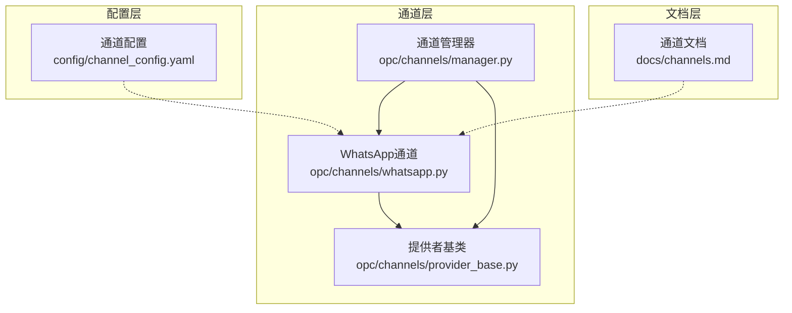
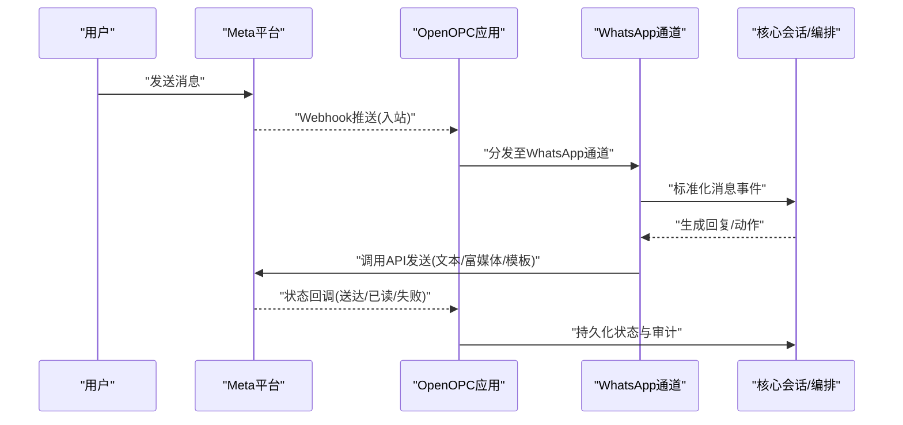
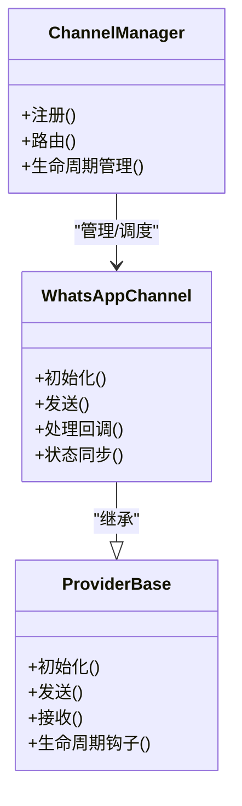
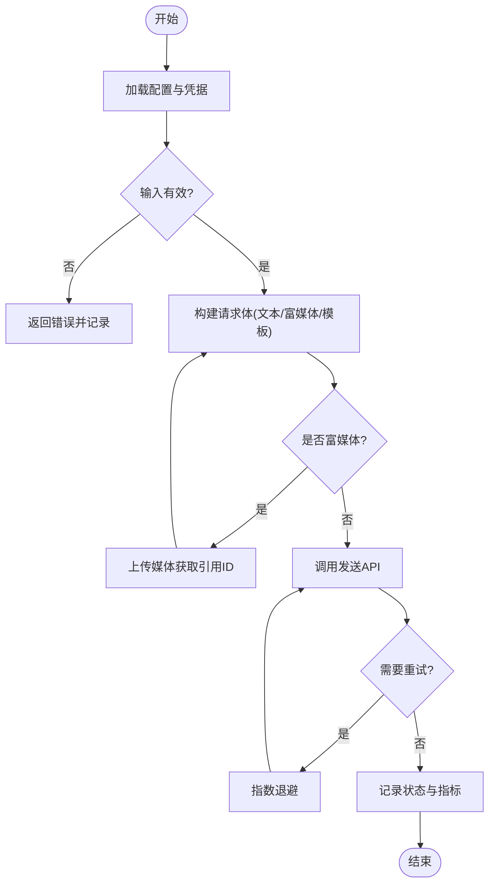
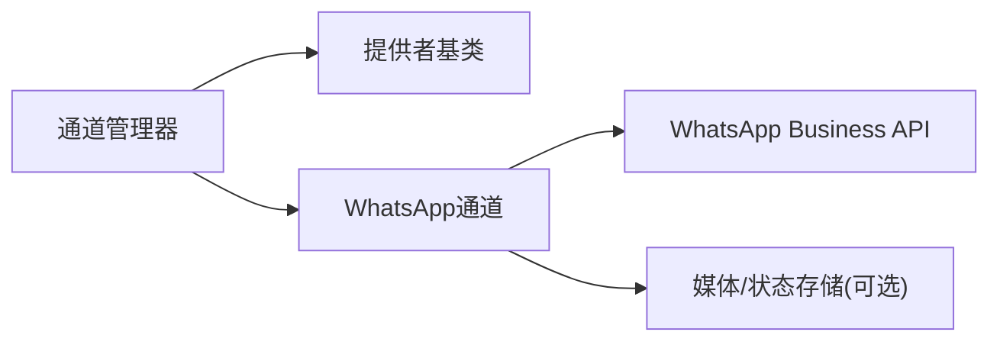

# WhatsApp通道

<cite>
**本文引用的文件**   
- [whatsapp.py](file://opc/channels/whatsapp.py)
- [provider_base.py](file://opc/channels/provider_base.py)
- [manager.py](file://opc/channels/manager.py)
- [channel_config.yaml](file://config/channel_config.yaml)
- [channels.md](file://docs/channels.md)
</cite>

## 目录
1. [简介](#简介)
2. [项目结构](#项目结构)
3. [核心组件](#核心组件)
4. [架构总览](#架构总览)
5. [详细组件分析](#详细组件分析)
6. [依赖分析](#依赖分析)
7. [性能考虑](#性能考虑)
8. [故障排查指南](#故障排查指南)
9. [结论](#结论)
10. [附录](#附录)

## 简介
本文件为OpenOPC的WhatsApp通道实现文档，聚焦于以下目标：
- 说明WhatsApp Business API集成与Meta开发者平台配置要点
- 描述消息模板、业务消息和用户发起消息的处理方式
- 提供完整的应用配置指南（电话号码绑定、Webhook设置、消息回调）
- 说明媒体上传、位置分享、联系卡等富媒体能力
- 覆盖消息状态跟踪、已读回执与送达确认
- 强调合规性、隐私保护与数据安全要求
- 帮助开发者正确集成并稳定运行WhatsApp渠道

## 项目结构
OpenOPC采用“通道+提供者”的分层设计。WhatsApp通道位于通道层，通过提供者基类抽象统一接口，并由通道管理器进行注册与调度。配置文件集中管理各通道的参数。

图表来源
- [whatsapp.py](file://opc/channels/whatsapp.py)
- [provider_base.py](file://opc/channels/provider_base.py)
- [manager.py](file://opc/channels/manager.py)
- [channel_config.yaml](file://config/channel_config.yaml)
- [channels.md](file://docs/channels.md)

章节来源
- [whatsapp.py](file://opc/channels/whatsapp.py)
- [provider_base.py](file://opc/channels/provider_base.py)
- [manager.py](file://opc/channels/manager.py)
- [channel_config.yaml](file://config/channel_config.yaml)
- [channels.md](file://docs/channels.md)

## 核心组件
- WhatsApp通道：封装与WhatsApp Business API的交互逻辑，包括发送文本、富媒体、模板消息、处理Webhook回调、上报状态等。
- 提供者基类：定义通道通用契约（初始化、发送、接收、生命周期钩子），确保不同通道行为一致。
- 通道管理器：负责通道发现、实例化、路由与生命周期管理。
- 通道配置：集中存放WhatsApp相关密钥、号码、Webhook等敏感信息。

章节来源
- [whatsapp.py](file://opc/channels/whatsapp.py)
- [provider_base.py](file://opc/channels/provider_base.py)
- [manager.py](file://opc/channels/manager.py)
- [channel_config.yaml](file://config/channel_config.yaml)

## 架构总览
下图展示从外部用户到OpenOPC内部处理的关键路径：用户消息经Meta平台到达应用Webhook，进入WhatsApp通道解析后交由上层会话与编排引擎；出站消息由通道调用API发送，并通过状态回调更新系统。

图表来源
- [whatsapp.py](file://opc/channels/whatsapp.py)
- [provider_base.py](file://opc/channels/provider_base.py)
- [manager.py](file://opc/channels/manager.py)

## 详细组件分析

### WhatsApp通道实现
- 职责边界
  - 入站：解析Meta Webhook中的消息、类型、附件、位置、联系人等字段，转换为OpenOPC标准事件。
  - 出站：根据消息类型选择API端点，支持文本、图片、音视频、文档、位置、联系人、模板消息等。
  - 状态：订阅送达、已读、失败等状态回调，映射到内部状态机。
  - 安全：校验签名、防重放、最小权限令牌、敏感配置加密存储。
- 关键流程
  - 初始化：加载配置、验证凭据、建立会话或连接池。
  - 发送：构建请求体、重试与退避、错误分类与上报。
  - 回调：验签、去重、幂等写入、触发下游处理。
- 错误处理
  - 网络/限流：指数退避、队列缓冲、降级策略。
  - 业务错误：模板未审批、号码无效、内容违规等，记录可观测指标并告警。
- 可观测性
  - 指标：发送成功率、延迟分布、错误码分布、回调延迟。
  - 日志：脱敏、结构化、关联ID贯穿。

章节来源
- [whatsapp.py](file://opc/channels/whatsapp.py)

#### 类关系图（代码级）

图表来源
- [provider_base.py](file://opc/channels/provider_base.py)
- [whatsapp.py](file://opc/channels/whatsapp.py)
- [manager.py](file://opc/channels/manager.py)

### 消息类型与处理
- 用户发起消息（User-initiated）
  - 场景：用户在24小时窗口内主动对话。
  - 处理：直接透传为标准文本/富媒体消息，无需模板。
- 业务消息（Business-initiated）
  - 场景：企业主动触达用户。
  - 处理：必须使用已审批的消息模板，包含占位符填充与语言代码。
- 富媒体
  - 图片/视频/音频/文档：先上传获取引用ID，再构造消息体发送。
  - 位置：经纬度、名称、地址等字段组装。
  - 联系人：vCard格式序列化与发送。
- 状态与回执
  - 送达/已读：按回调更新消息状态，供前端与审计展示。
  - 失败：记录错误码与原因，触发重试或人工介入。

章节来源
- [whatsapp.py](file://opc/channels/whatsapp.py)

#### 发送流程图（算法级）

图表来源
- [whatsapp.py](file://opc/channels/whatsapp.py)

### 配置与环境
- 必需配置项（示例键名，具体以实际配置为准）
  - 元数据：应用标识、环境、版本
  - 认证：访问令牌、应用ID、账号ID
  - 号码：业务电话号码ID、测试号码
  - Webhook：URL、验证令牌、回调字段
  - 安全：签名密钥、IP白名单
  - 行为：重试次数、超时、并发限制
- 配置来源
  - 集中式YAML配置
  - 环境变量注入（生产建议）
  - 密钥管理服务（推荐）
- 校验与默认值
  - 启动时校验必填项与格式
  - 提供开发/测试默认值与安全提示

章节来源
- [channel_config.yaml](file://config/channel_config.yaml)

### 与Meta开发者平台的对接
- 创建与应用
  - 在Meta开发者平台创建应用，启用WhatsApp产品
  - 绑定测试号码，获取访问令牌与账号ID
- 号码与企业验证
  - 完成企业账户验证以获得更高配额与功能
  - 申请业务号码与显示名称
- Webhook配置
  - 设置回调URL、验证令牌与字段
  - 实现验签与幂等处理
- 消息模板
  - 在平台提交模板并审批
  - 维护多语言版本与占位符
- 安全与合规
  - 仅授予必要权限
  - 开启审计日志与访问控制
  - 遵循数据保留与删除策略

章节来源
- [channels.md](file://docs/channels.md)

## 依赖分析
- 内部依赖
  - WhatsApp通道依赖提供者基类的统一接口
  - 通道管理器负责实例化与路由
- 外部依赖
  - Meta WhatsApp Business API（HTTP/REST）
  - 可选：对象存储用于媒体缓存、消息总线用于异步处理
- 耦合与内聚
  - 通道与API细节解耦，便于替换与扩展
  - 配置与运行时分离，便于多环境部署

图表来源
- [manager.py](file://opc/channels/manager.py)
- [provider_base.py](file://opc/channels/provider_base.py)
- [whatsapp.py](file://opc/channels/whatsapp.py)

章节来源
- [manager.py](file://opc/channels/manager.py)
- [provider_base.py](file://opc/channels/provider_base.py)
- [whatsapp.py](file://opc/channels/whatsapp.py)

## 性能考虑
- 连接与会话
  - 复用HTTP连接，合理设置连接池大小与超时
- 重试与退避
  - 对瞬态错误采用指数退避与抖动，避免雪崩
- 并发与限流
  - 基于配额与速率限制进行背压与排队
- 媒体处理
  - 分块上传、断点续传、压缩与转码
- 可观测性
  - 全链路追踪、指标采集、错误分级告警

[本节为通用指导，不直接分析具体文件]

## 故障排查指南
- 常见问题
  - 认证失败：检查令牌有效期、权限范围与应用绑定
  - 模板未审批：确认模板状态与语言代码匹配
  - 号码无效：核对业务号码ID与用户号码格式
  - Webhook验签失败：核对签名密钥与回调字段
  - 媒体上传失败：检查文件大小、类型与网络状况
- 定位步骤
  - 查看通道日志与指标，关注错误码与耗时
  - 复现最小用例，隔离网络与第三方因素
  - 使用测试号码与沙箱环境验证
- 恢复策略
  - 自动重试与降级
  - 快速回滚配置与版本
  - 人工介入工单与通知

章节来源
- [whatsapp.py](file://opc/channels/whatsapp.py)

## 结论
通过统一的提供者抽象与通道管理器，OpenOPC将WhatsApp通道与核心系统解耦，提供了稳定的入站/出站能力、完善的富媒体支持与状态跟踪。配合严格的配置管理与安全实践，可在合规前提下高效集成WhatsApp渠道。

[本节为总结性内容，不直接分析具体文件]

## 附录
- 术语
  - 用户发起消息：用户在24小时窗口内主动发起的对话
  - 业务消息：企业主动触达用户的消息，需使用模板
  - Webhook：平台向应用推送事件的HTTP回调
- 参考
  - 通道文档与最佳实践
  - Meta开发者平台官方文档

[本节为补充信息，不直接分析具体文件]