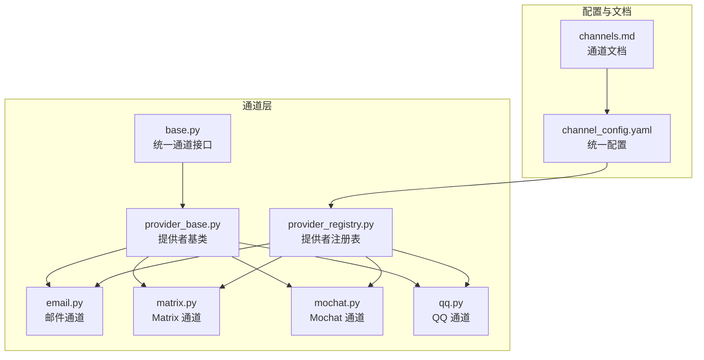
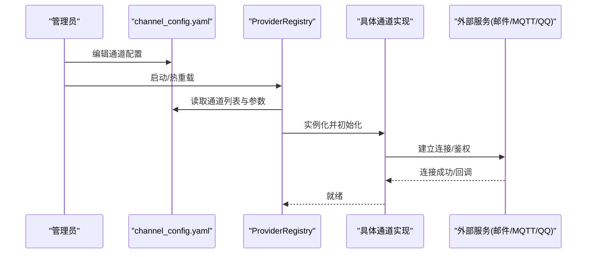
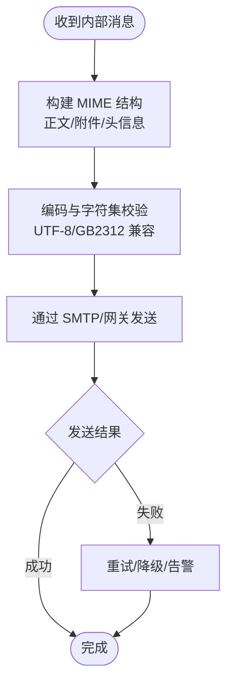
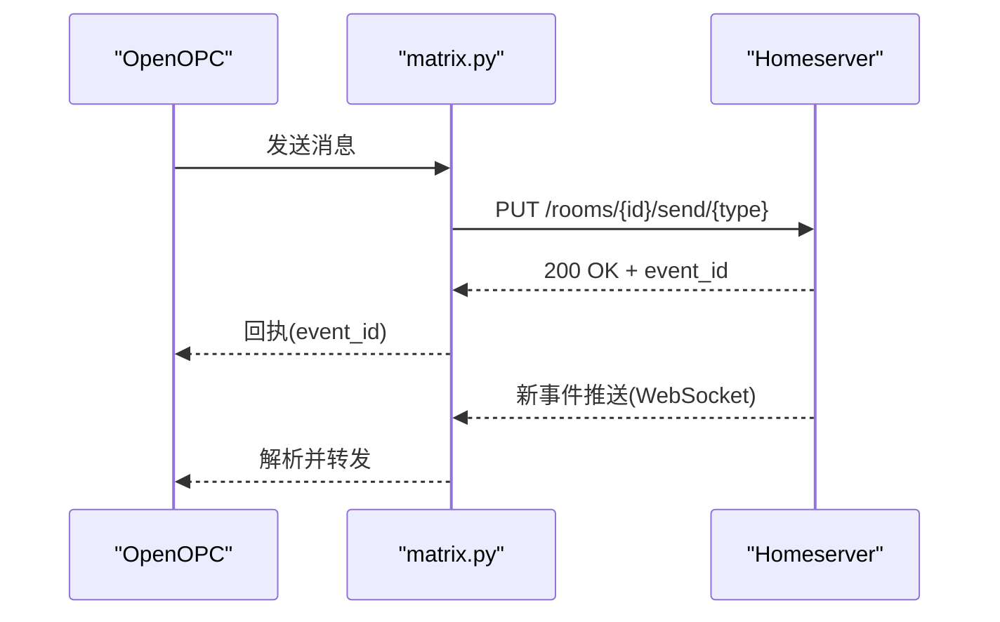
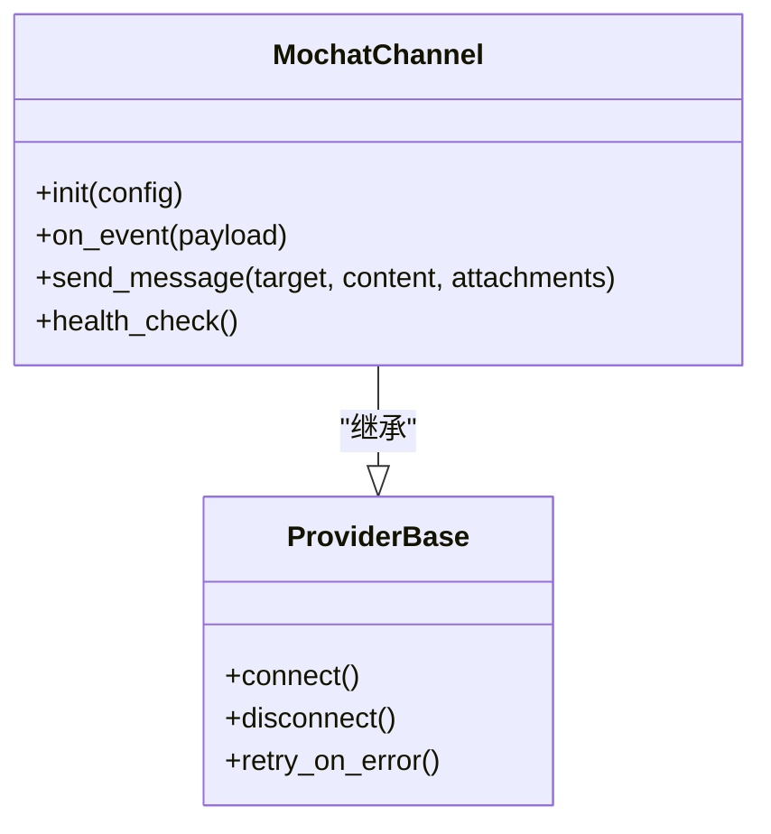
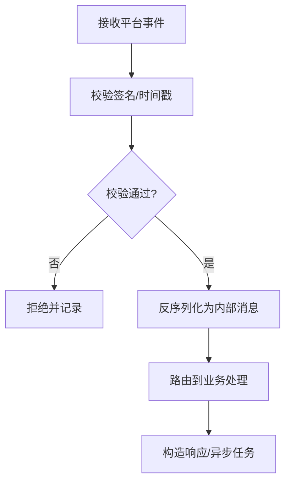
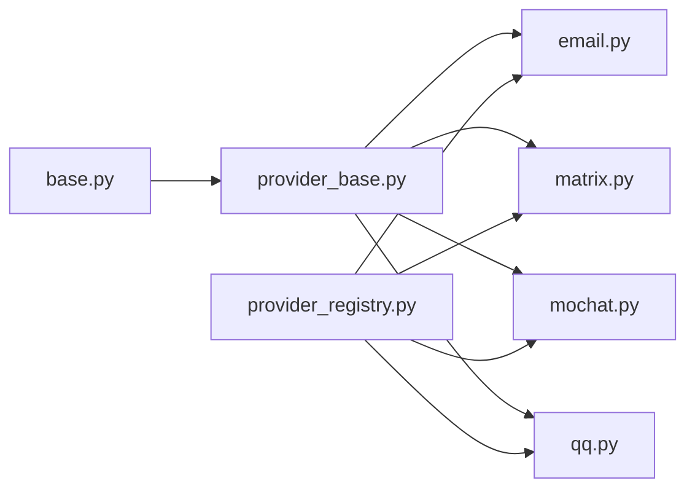

# 其他通道

<cite>
**本文引用的文件**   
- [opc/channels/email.py](file://opc/channels/email.py)
- [opc/channels/matrix.py](file://opc/channels/matrix.py)
- [opc/channels/mochat.py](file://opc/channels/mochat.py)
- [opc/channels/qq.py](file://opc/channels/qq.py)
- [opc/channels/base.py](file://opc/channels/base.py)
- [opc/channels/provider_base.py](file://opc/channels/provider_base.py)
- [opc/channels/provider_registry.py](file://opc/channels/provider_registry.py)
- [config/channel_config.yaml](file://config/channel_config.yaml)
- [docs/channels.md](file://docs/channels.md)
</cite>

## 目录
1. [简介](#简介)
2. [项目结构](#项目结构)
3. [核心组件](#核心组件)
4. [架构总览](#架构总览)
5. [详细组件分析](#详细组件分析)
6. [依赖关系分析](#依赖关系分析)
7. [性能考量](#性能考量)
8. [故障排查指南](#故障排查指南)
9. [结论](#结论)
10. [附录](#附录)

## 简介
本文件聚焦于 OpenOPC 的“其他通信通道”，包括邮件通道、Matrix 协议、Mochat 与 QQ 通道的集成方式。文档从统一配置格式、接入流程、消息格式转换、编码与字符集支持、认证与连接管理、错误处理策略，到性能对比与适用场景进行系统化说明，帮助开发者选择合适的通道并正确配置使用。

## 项目结构
OpenOPC 的通道实现位于 opc/channels 目录下，采用“基础抽象 + 提供者注册”的分层设计：
- 基础抽象层：定义统一的通道接口、会话模型与事件契约
- 提供者基类：封装通用能力（如重试、心跳、连接生命周期）
- 具体通道实现：邮件、Matrix、Mochat、QQ 等
- 提供者注册表：集中管理通道类型与实例化逻辑
- 配置与文档：channel_config.yaml 提供统一配置入口；channels.md 提供高层说明

图表来源
- [opc/channels/base.py](file://opc/channels/base.py)
- [opc/channels/provider_base.py](file://opc/channels/provider_base.py)
- [opc/channels/provider_registry.py](file://opc/channels/provider_registry.py)
- [opc/channels/email.py](file://opc/channels/email.py)
- [opc/channels/matrix.py](file://opc/channels/matrix.py)
- [opc/channels/mochat.py](file://opc/channels/mochat.py)
- [opc/channels/qq.py](file://opc/channels/qq.py)
- [config/channel_config.yaml](file://config/channel_config.yaml)
- [docs/channels.md](file://docs/channels.md)

章节来源
- [docs/channels.md](file://docs/channels.md)
- [config/channel_config.yaml](file://config/channel_config.yaml)

## 核心组件
- 统一通道接口（base.py）
  - 定义发送消息、接收消息、会话管理、状态查询等标准方法
  - 约定消息对象的结构与字段语义（如 sender、receiver、content、attachments、metadata）
- 提供者基类（provider_base.py）
  - 封装连接生命周期、重连策略、心跳保活、日志与指标上报
  - 提供通用的错误分类与重试机制
- 提供者注册表（provider_registry.py）
  - 维护通道类型到实现的映射
  - 负责按配置创建和初始化通道实例
- 具体通道实现
  - email.py：基于 SMTP/IMAP 或第三方邮件网关的收发
  - matrix.py：基于 Matrix 客户端 SDK 的端到端聊天
  - mochat.py：对接 Mochat 平台 API
  - qq.py：对接 QQ 开放平台或机器人 API

章节来源
- [opc/channels/base.py](file://opc/channels/base.py)
- [opc/channels/provider_base.py](file://opc/channels/provider_base.py)
- [opc/channels/provider_registry.py](file://opc/channels/provider_registry.py)
- [opc/channels/email.py](file://opc/channels/email.py)
- [opc/channels/matrix.py](file://opc/channels/matrix.py)
- [opc/channels/mochat.py](file://opc/channels/mochat.py)
- [opc/channels/qq.py](file://opc/channels/qq.py)

## 架构总览
下图展示了从配置加载到通道实例化的整体流程，以及各通道在运行时的职责边界。

图表来源
- [config/channel_config.yaml](file://config/channel_config.yaml)
- [opc/channels/provider_registry.py](file://opc/channels/provider_registry.py)
- [opc/channels/email.py](file://opc/channels/email.py)
- [opc/channels/matrix.py](file://opc/channels/matrix.py)
- [opc/channels/mochat.py](file://opc/channels/mochat.py)
- [opc/channels/qq.py](file://opc/channels/qq.py)

## 详细组件分析

### 邮件通道（email.py）
- 功能特性
  - 支持文本与附件收发
  - 可配置发件人、收件人、主题模板、抄送/密送
  - 支持多账户轮询或长连接（取决于后端实现）
- 配置要求（参考 channel_config.yaml）
  - 传输协议与服务器地址（SMTP/IMAP 或网关）
  - 认证凭据（用户名/密码或令牌）
  - 字符集与编码（建议 UTF-8）
  - 附件大小限制与 MIME 类型白名单
- 认证方式
  - 账号密码、OAuth2 或应用专用令牌
- 连接管理
  - 连接池与会话复用
  - 断线自动重连与退避策略
- 消息格式与编码
  - 内部消息对象转换为邮件 MIME 结构
  - 正文支持 HTML/纯文本双模
  - 附件以 base64 或分块上传
- API 限制
  - 单封邮件大小上限
  - 频率限制（每分钟/小时投递量）
- 错误处理
  - 网络异常、认证失败、配额超限的分类与重试
  - 死信队列与告警

图表来源
- [opc/channels/email.py](file://opc/channels/email.py)
- [config/channel_config.yaml](file://config/channel_config.yaml)

章节来源
- [opc/channels/email.py](file://opc/channels/email.py)
- [config/channel_config.yaml](file://config/channel_config.yaml)

### Matrix 通道（matrix.py）
- 功能特性
  - 基于 Matrix 协议的房间/私信对话
  - 支持富文本、图片、文件、线程回复
  - 可选端到端加密（E2EE）
- 配置要求
  - Homeserver 地址、用户 ID、访问令牌
  - 房间 ID 或别名映射
  - 代理与 TLS 设置
- 认证方式
  - 用户令牌或应用服务令牌
- 连接管理
  - 基于 WebSocket 的长连接
  - 心跳保活与自动重连
- 消息格式与编码
  - 将内部消息映射为 Matrix event（text/html/image/file）
  - 字符集由 homeserver 统一处理（通常 UTF-8）
- API 限制
  - 事件大小限制、速率限制、媒体上传配额
- 错误处理
  - 429/5xx 重试、令牌过期刷新、房间权限错误提示

图表来源
- [opc/channels/matrix.py](file://opc/channels/matrix.py)
- [config/channel_config.yaml](file://config/channel_config.yaml)

章节来源
- [opc/channels/matrix.py](file://opc/channels/matrix.py)
- [config/channel_config.yaml](file://config/channel_config.yaml)

### Mochat 通道（mochat.py）
- 功能特性
  - 对接 Mochat 平台的消息收发、群组、卡片消息
  - 支持回调式事件驱动
- 配置要求
  - 平台域名、应用 ID/密钥、回调 URL
  - 签名验证密钥
- 认证方式
  - HMAC 签名校验或 OAuth2
- 连接管理
  - HTTP 回调或长轮询
  - 幂等处理与去抖
- 消息格式与编码
  - 平台 JSON 结构与内部消息对象的互转
  - 字符集 UTF-8
- API 限制
  - 回调超时时间、消息体大小、并发度
- 错误处理
  - 签名不匹配、超时重试、业务码错误映射

图表来源
- [opc/channels/mochat.py](file://opc/channels/mochat.py)
- [opc/channels/provider_base.py](file://opc/channels/provider_base.py)

章节来源
- [opc/channels/mochat.py](file://opc/channels/mochat.py)
- [config/channel_config.yaml](file://config/channel_config.yaml)

### QQ 通道（qq.py）
- 功能特性
  - 对接 QQ 开放平台/机器人 API
  - 支持私聊、群聊、富媒体消息
- 配置要求
  - 应用 AppID/AppSecret、Bot Token
  - 回调地址、事件订阅配置
- 认证方式
  - 应用级鉴权与事件签名校验
- 连接管理
  - 长连接或回调模式
  - 心跳与重连
- 消息格式与编码
  - 平台消息体与内部消息对象转换
  - 字符集 UTF-8
- API 限制
  - 频率限制、消息大小、媒体上传限额
- 错误处理
  - 鉴权失败、限流、事件重复处理

图表来源
- [opc/channels/qq.py](file://opc/channels/qq.py)
- [config/channel_config.yaml](file://config/channel_config.yaml)

章节来源
- [opc/channels/qq.py](file://opc/channels/qq.py)
- [config/channel_config.yaml](file://config/channel_config.yaml)

## 依赖关系分析
- 耦合与内聚
  - 各通道均继承自 provider_base，保证连接与错误处理的内聚性
  - provider_registry 作为唯一装配点，降低上层对具体实现的耦合
- 外部依赖
  - 邮件：SMTP/IMAP 或第三方网关
  - Matrix：Matrix 客户端 SDK 与 homeserver
  - Mochat：HTTP 回调或长轮询
  - QQ：开放平台 REST/WebSocket
- 潜在循环依赖
  - 当前分层清晰，未见循环导入风险

图表来源
- [opc/channels/base.py](file://opc/channels/base.py)
- [opc/channels/provider_base.py](file://opc/channels/provider_base.py)
- [opc/channels/provider_registry.py](file://opc/channels/provider_registry.py)
- [opc/channels/email.py](file://opc/channels/email.py)
- [opc/channels/matrix.py](file://opc/channels/matrix.py)
- [opc/channels/mochat.py](file://opc/channels/mochat.py)
- [opc/channels/qq.py](file://opc/channels/qq.py)

章节来源
- [opc/channels/provider_registry.py](file://opc/channels/provider_registry.py)
- [opc/channels/provider_base.py](file://opc/channels/provider_base.py)

## 性能考量
- 吞吐量与延迟
  - Matrix：低延迟、高吞吐，适合实时协作
  - QQ/Mochat：中等延迟，受平台限流影响
  - 邮件：高延迟、批处理友好，适合异步通知
- 资源占用
  - 长连接通道需维护心跳与连接池
  - 邮件通道在大批量附件时注意内存与 I/O
- 扩展性
  - 通过注册表横向扩展通道数量
  - 结合队列与缓存提升稳定性

[本节为通用指导，无需特定文件引用]

## 故障排查指南
- 常见问题定位
  - 认证失败：检查凭据、令牌有效期、签名密钥
  - 连接中断：查看重连次数、退避策略、防火墙/代理
  - 消息丢失：确认幂等键、去重逻辑、回调超时
  - 编码乱码：统一 UTF-8，检查中间件转码
- 日志与指标
  - 关键路径打点：连接、发送、接收、重试、错误
  - 错误分类统计：网络、认证、配额、业务码
- 恢复策略
  - 死信队列与人工介入
  - 灰度切换通道与回滚

章节来源
- [opc/channels/provider_base.py](file://opc/channels/provider_base.py)
- [config/channel_config.yaml](file://config/channel_config.yaml)

## 结论
通过统一接口与提供者注册机制，OpenOPC 将邮件、Matrix、Mochat、QQ 等不同通道整合到一致的运行模型中。开发者应依据场景选择合适通道：实时协作优先 Matrix，跨系统通知优先邮件，企业生态优先 Mochat/QQ。配合统一配置与完善的错误处理，可实现稳定高效的跨通道消息流转。

[本节为总结性内容，无需特定文件引用]

## 附录
- 统一配置要点（channel_config.yaml）
  - 通道类型标识
  - 连接参数（地址、端口、TLS）
  - 认证信息（凭据、令牌、签名密钥）
  - 行为开关（重试、心跳、限流）
  - 字符集与编码（默认 UTF-8）
- 接入步骤
  - 在配置文件中添加通道条目
  - 确保凭据与环境可达
  - 启动后观察健康检查与日志
  - 发送测试消息验证端到端链路

章节来源
- [config/channel_config.yaml](file://config/channel_config.yaml)
- [docs/channels.md](file://docs/channels.md)