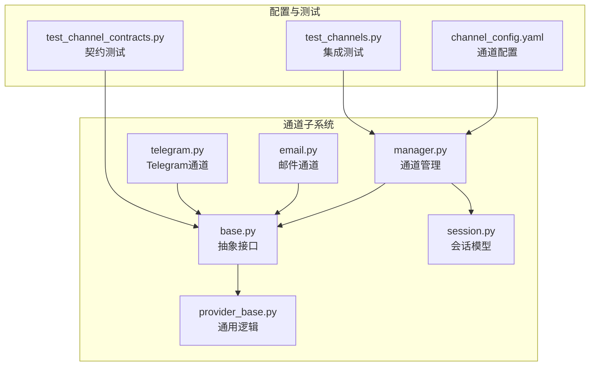
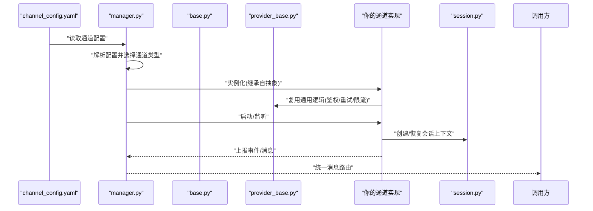
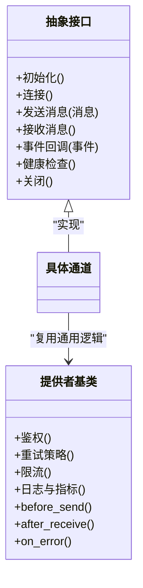
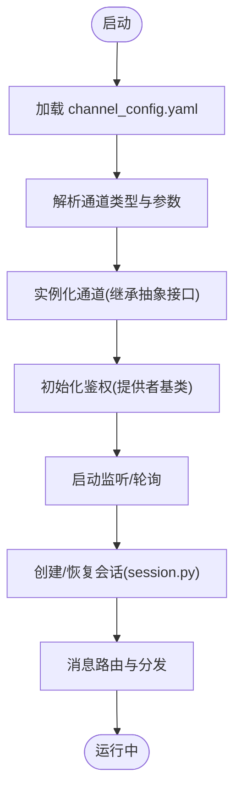
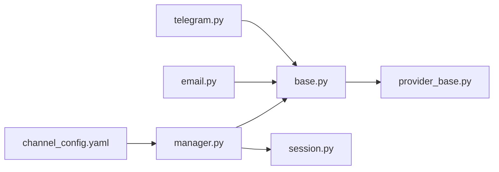

# 自定义通道开发

<cite>
**本文引用的文件**   
- [opc/channels/base.py](file://opc/channels/base.py)
- [opc/channels/provider_base.py](file://opc/channels/provider_base.py)
- [opc/channels/manager.py](file://opc/channels/manager.py)
- [opc/channels/session.py](file://opc/channels/session.py)
- [opc/channels/email.py](file://opc/channels/email.py)
- [opc/channels/telegram.py](file://opc/channels/telegram.py)
- [config/channel_config.yaml](file://config/channel_config.yaml)
- [tests/test_channel_contracts.py](file://tests/test_channel_contracts.py)
- [tests/test_channels.py](file://tests/test_channels.py)
</cite>

## 目录
1. [简介](#简介)
2. [项目结构](#项目结构)
3. [核心组件](#核心组件)
4. [架构总览](#架构总览)
5. [详细组件分析](#详细组件分析)
6. [依赖关系分析](#依赖关系分析)
7. [性能考虑](#性能考虑)
8. [故障排查指南](#故障排查指南)
9. [结论](#结论)
10. [附录](#附录)

## 简介
本指南面向需要在 OpenOPC 中扩展新的通信渠道（Channel）的开发者。你将基于基础抽象类与提供者基类，学习如何创建、注册并运行一个自定义通道，包括：
- 必须实现的接口方法
- 消息格式规范
- 事件处理机制
- 认证集成、消息路由与会话管理最佳实践
- 测试方法与调试技巧
- 性能优化建议
- 完整示例代码路径与配置模板

通过本指南，你可以快速、稳定地接入新的外部平台或协议，并将其无缝集成到 OpenOPC 的统一通道体系中。

## 项目结构
OpenOPC 的通道子系统位于 opc/channels 目录下，采用“抽象基类 + 具体实现 + 管理器 + 会话”的分层设计。关键目录与文件如下：
- 抽象与基类
  - base.py：定义通道抽象接口与通用能力
  - provider_base.py：提供跨通道的通用逻辑与工具
- 通道实现
  - email.py、telegram.py 等：各具体通道的实现
- 运行时管理
  - manager.py：通道实例化、生命周期与调度
  - session.py：会话模型与上下文
- 配置
  - config/channel_config.yaml：通道配置模板与示例
- 测试
  - tests/test_channel_contracts.py：契约测试，确保新通道符合接口约定
  - tests/test_channels.py：端到端与集成测试样例

图表来源
- [opc/channels/base.py](file://opc/channels/base.py)
- [opc/channels/provider_base.py](file://opc/channels/provider_base.py)
- [opc/channels/manager.py](file://opc/channels/manager.py)
- [opc/channels/session.py](file://opc/channels/session.py)
- [opc/channels/email.py](file://opc/channels/email.py)
- [opc/channels/telegram.py](file://opc/channels/telegram.py)
- [config/channel_config.yaml](file://config/channel_config.yaml)
- [tests/test_channel_contracts.py](file://tests/test_channel_contracts.py)
- [tests/test_channels.py](file://tests/test_channels.py)

章节来源
- [opc/channels/base.py](file://opc/channels/base.py)
- [opc/channels/provider_base.py](file://opc/channels/provider_base.py)
- [opc/channels/manager.py](file://opc/channels/manager.py)
- [opc/channels/session.py](file://opc/channels/session.py)
- [config/channel_config.yaml](file://config/channel_config.yaml)
- [tests/test_channel_contracts.py](file://tests/test_channel_contracts.py)
- [tests/test_channels.py](file://tests/test_channels.py)

## 核心组件
本节聚焦于构建自定义通道所需的核心组件与职责边界。

- 抽象接口（base.py）
  - 定义通道统一契约：初始化、连接、发送消息、接收消息、事件回调、健康检查、关闭等
  - 规定消息对象结构与字段约束
  - 定义错误类型与重试策略约定
- 提供者基类（provider_base.py）
  - 提供通用能力：日志、指标、重试、超时、限流、序列化/反序列化、鉴权封装等
  - 暴露可复用的钩子点，供具体通道覆盖
- 通道管理器（manager.py）
  - 负责从配置加载通道、实例化、启动/停止、路由与分发
  - 维护通道注册表与生命周期状态
- 会话模型（session.py）
  - 描述一次对话的上下文：用户标识、会话ID、历史摘要、权限范围等
  - 提供会话持久化与恢复接口

章节来源
- [opc/channels/base.py](file://opc/channels/base.py)
- [opc/channels/provider_base.py](file://opc/channels/provider_base.py)
- [opc/channels/manager.py](file://opc/channels/manager.py)
- [opc/channels/session.py](file://opc/channels/session.py)

## 架构总览
下图展示了自定义通道在系统中的位置与交互流程：配置驱动管理器加载通道，通道通过抽象接口与上层系统交互，并通过会话模型维持上下文。

图表来源
- [config/channel_config.yaml](file://config/channel_config.yaml)
- [opc/channels/manager.py](file://opc/channels/manager.py)
- [opc/channels/base.py](file://opc/channels/base.py)
- [opc/channels/provider_base.py](file://opc/channels/provider_base.py)
- [opc/channels/session.py](file://opc/channels/session.py)

## 详细组件分析

### 抽象接口与提供者基类
- 抽象接口（base.py）
  - 关键职责
    - 定义统一的通道方法签名：初始化、连接、发送、接收、事件回调、健康检查、关闭
    - 定义消息对象字段与校验规则
    - 定义错误码与异常层次
  - 设计要点
    - 所有具体通道必须实现抽象接口，保证上层无感知切换
    - 对异步/同步场景提供一致的方法语义
- 提供者基类（provider_base.py）
  - 关键职责
    - 封装鉴权流程、令牌刷新、重试与退避、超时控制、速率限制
    - 提供通用日志与指标埋点
    - 暴露可覆写的钩子：如 before_send、after_receive、on_error
  - 设计要点
    - 避免在基类中耦合特定协议细节
    - 将第三方 SDK 差异隔离在通道实现中

图表来源
- [opc/channels/base.py](file://opc/channels/base.py)
- [opc/channels/provider_base.py](file://opc/channels/provider_base.py)

章节来源
- [opc/channels/base.py](file://opc/channels/base.py)
- [opc/channels/provider_base.py](file://opc/channels/provider_base.py)

### 通道管理器与会话模型
- 通道管理器（manager.py）
  - 负责从配置加载通道、实例化、启动/停止、路由与分发
  - 维护通道注册表、生命周期状态与错误恢复
- 会话模型（session.py）
  - 描述会话上下文：用户标识、会话ID、历史摘要、权限范围
  - 提供会话持久化与恢复接口，支持跨重启连续性

图表来源
- [config/channel_config.yaml](file://config/channel_config.yaml)
- [opc/channels/manager.py](file://opc/channels/manager.py)
- [opc/channels/session.py](file://opc/channels/session.py)

章节来源
- [opc/channels/manager.py](file://opc/channels/manager.py)
- [opc/channels/session.py](file://opc/channels/session.py)

### 现有通道实现参考
- 邮件通道（email.py）
  - 展示 IMAP/SMTP 或 API 方式的收发流程
  - 体现附件处理、主题映射、发件人/收件人解析
- Telegram 通道（telegram.py）
  - 展示 Bot 模式的消息接收与回复
  - 体现群组/私聊区分、命令解析、富文本渲染

章节来源
- [opc/channels/email.py](file://opc/channels/email.py)
- [opc/channels/telegram.py](file://opc/channels/telegram.py)

### 消息格式规范
为保证多通道一致性，建议遵循以下消息结构（字段名以概念性说明为准）：
- 消息头
  - 通道类型：标识来源通道
  - 会话ID：关联会话上下文
  - 用户ID：消息发起者
  - 时间戳：消息产生时间
  - 优先级：用于路由与队列排序
- 消息体
  - 内容：文本/富文本/结构化数据
  - 附件：文件列表与元信息
  - 扩展字段：键值对，用于通道特有属性
- 事件
  - 事件类型：如消息到达、已读回执、错误上报
  - 事件载荷：与事件相关的上下文数据

章节来源
- [opc/channels/base.py](file://opc/channels/base.py)

### 事件处理机制
- 事件源
  - 通道内部：连接状态变化、心跳、错误
  - 上游系统：消息到达、用户动作、系统告警
- 事件流转
  - 通道捕获事件 -> 标准化为统一事件模型 -> 管理器路由 -> 订阅者处理
- 错误与重试
  - 使用提供者基类的重试策略与退避算法
  - 记录错误上下文与指标，便于追踪

章节来源
- [opc/channels/provider_base.py](file://opc/channels/provider_base.py)
- [opc/channels/manager.py](file://opc/channels/manager.py)

### 认证集成最佳实践
- 集中式鉴权
  - 通过提供者基类封装鉴权流程，避免在各通道重复实现
- 令牌管理
  - 支持自动刷新、缓存与失效回退
- 安全存储
  - 敏感信息（密钥、令牌）应从配置中心或密钥管理服务注入
- 最小权限原则
  - 仅申请必要的 API 权限与访问范围

章节来源
- [opc/channels/provider_base.py](file://opc/channels/provider_base.py)
- [config/channel_config.yaml](file://config/channel_config.yaml)

### 消息路由与会话管理最佳实践
- 路由策略
  - 基于通道类型、用户ID、会话ID进行路由
  - 支持按优先级与负载动态调整
- 会话管理
  - 会话创建：首次消息时建立，携带初始上下文
  - 会话恢复：进程重启后根据会话ID恢复上下文
  - 会话隔离：不同用户/群组的上下文严格隔离

章节来源
- [opc/channels/manager.py](file://opc/channels/manager.py)
- [opc/channels/session.py](file://opc/channels/session.py)

## 依赖关系分析
下图展示了通道子系统的关键依赖关系与耦合度。

图表来源
- [opc/channels/base.py](file://opc/channels/base.py)
- [opc/channels/provider_base.py](file://opc/channels/provider_base.py)
- [opc/channels/manager.py](file://opc/channels/manager.py)
- [opc/channels/session.py](file://opc/channels/session.py)
- [opc/channels/email.py](file://opc/channels/email.py)
- [opc/channels/telegram.py](file://opc/channels/telegram.py)
- [config/channel_config.yaml](file://config/channel_config.yaml)

章节来源
- [opc/channels/base.py](file://opc/channels/base.py)
- [opc/channels/provider_base.py](file://opc/channels/provider_base.py)
- [opc/channels/manager.py](file://opc/channels/manager.py)
- [opc/channels/session.py](file://opc/channels/session.py)
- [config/channel_config.yaml](file://config/channel_config.yaml)

## 性能考虑
- 连接池与复用
  - 复用底层连接，减少握手开销
- 批处理与合并
  - 批量发送与聚合响应，降低网络往返
- 异步与非阻塞
  - 使用异步 I/O 提升吞吐
- 限流与背压
  - 依据上游能力设置速率限制，防止雪崩
- 缓存与压缩
  - 缓存热点数据，压缩大附件传输
- 监控与指标
  - 采集延迟、吞吐、错误率等关键指标

[本节为通用指导，不直接分析具体文件]

## 故障排查指南
- 常见问题定位
  - 鉴权失败：检查令牌有效期与权限范围
  - 连接超时：确认网络可达性与代理配置
  - 消息丢失：核对路由键与会话ID一致性
  - 性能瓶颈：查看指标与日志，定位慢操作
- 调试技巧
  - 启用详细日志与链路追踪
  - 使用契约测试验证接口一致性
  - 构造最小复现用例进行回归验证
- 恢复策略
  - 自动重试与指数退避
  - 死信队列与人工介入

章节来源
- [tests/test_channel_contracts.py](file://tests/test_channel_contracts.py)
- [tests/test_channels.py](file://tests/test_channels.py)

## 结论
通过遵循抽象接口与提供者基类的设计，结合管理器与会话模型的支撑，你可以高效、稳定地扩展新的通信渠道。建议在实现过程中重视鉴权、路由与会话管理的最佳实践，并通过契约测试与集成测试保障质量。同时，关注性能与可观测性，确保在生产环境中的可靠性与可维护性。

[本节为总结性内容，不直接分析具体文件]

## 附录

### 开发步骤清单
- 准备阶段
  - 阅读抽象接口与提供者基类，明确必须实现的方法
  - 确定消息格式与事件模型
- 实现阶段
  - 新建通道模块，继承抽象接口
  - 复用提供者基类的鉴权、重试、限流等通用逻辑
  - 实现消息收发与事件回调
  - 集成会话模型，处理上下文持久化
- 配置阶段
  - 在 channel_config.yaml 中添加通道配置项
  - 注入敏感信息与环境变量
- 测试阶段
  - 编写契约测试，确保接口一致性
  - 编写集成测试，覆盖端到端流程
- 上线阶段
  - 部署与灰度发布
  - 监控与告警配置
  - 文档与培训

章节来源
- [config/channel_config.yaml](file://config/channel_config.yaml)
- [tests/test_channel_contracts.py](file://tests/test_channel_contracts.py)
- [tests/test_channels.py](file://tests/test_channels.py)

### 示例代码路径
- 抽象接口与提供者基类
  - [opc/channels/base.py](file://opc/channels/base.py)
  - [opc/channels/provider_base.py](file://opc/channels/provider_base.py)
- 现有通道实现参考
  - [opc/channels/email.py](file://opc/channels/email.py)
  - [opc/channels/telegram.py](file://opc/channels/telegram.py)
- 管理与会话
  - [opc/channels/manager.py](file://opc/channels/manager.py)
  - [opc/channels/session.py](file://opc/channels/session.py)

### 配置模板
- 通道配置模板与示例
  - [config/channel_config.yaml](file://config/channel_config.yaml)

### 测试方法
- 契约测试
  - [tests/test_channel_contracts.py](file://tests/test_channel_contracts.py)
- 集成测试
  - [tests/test_channels.py](file://tests/test_channels.py)