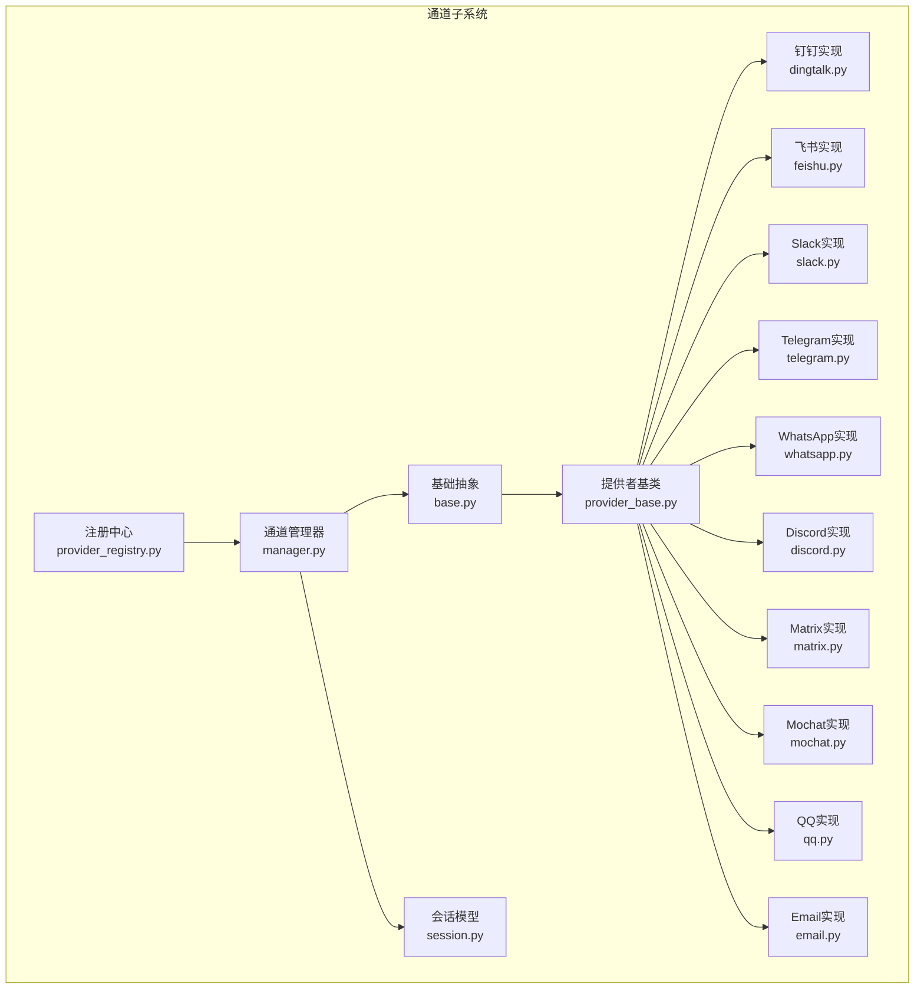
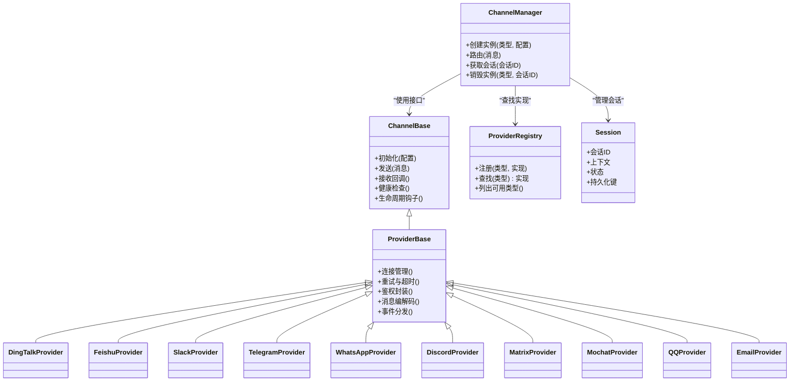
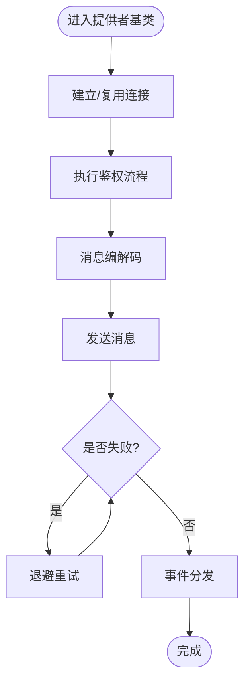
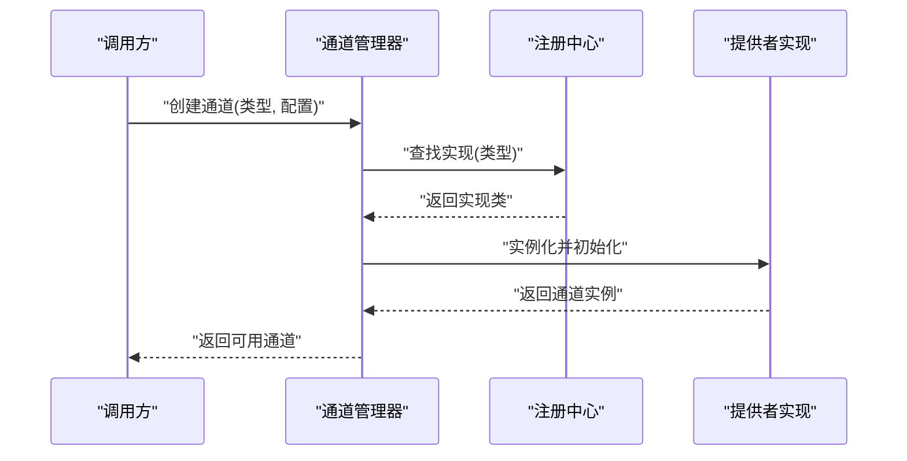
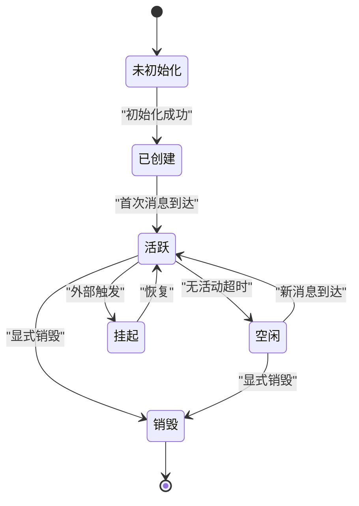
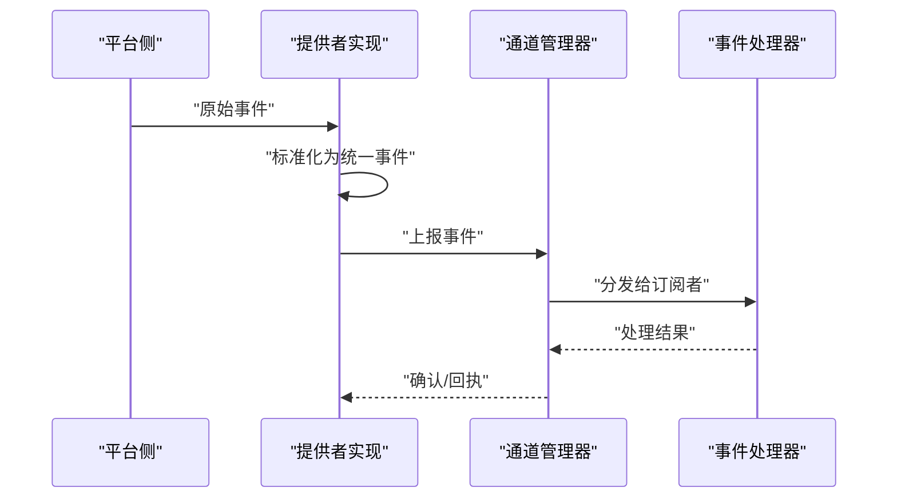
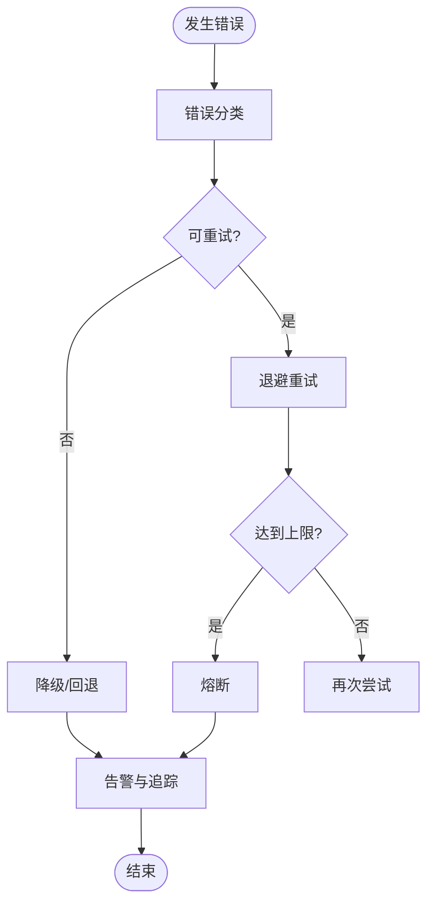
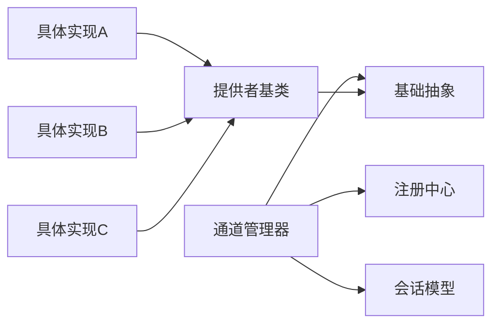

# 通道架构设计

<cite>
**本文引用的文件**   
- [opc/channels/base.py](file://opc/channels/base.py)
- [opc/channels/provider_base.py](file://opc/channels/provider_base.py)
- [opc/channels/provider_registry.py](file://opc/channels/provider_registry.py)
- [opc/channels/manager.py](file://opc/channels/manager.py)
- [opc/channels/session.py](file://opc/channels/session.py)
- [opc/channels/dingtalk.py](file://opc/channels/dingtalk.py)
- [opc/channels/discord.py](file://opc/channels/discord.py)
- [opc/channels/email.py](file://opc/channels/email.py)
- [opc/channels/feishu.py](file://opc/channels/feishu.py)
- [opc/channels/matrix.py](file://opc/channels/matrix.py)
- [opc/channels/mochat.py](file://opc/channels/mochat.py)
- [opc/channels/qq.py](file://opc/channels/qq.py)
- [opc/channels/slack.py](file://opc/channels/slack.py)
- [opc/channels/telegram.py](file://opc/channels/telegram.py)
- [opc/channels/whatsapp.py](file://opc/channels/whatsapp.py)
- [config/channel_config.yaml](file://config/channel_config.yaml)
- [tests/test_channel_contracts.py](file://tests/test_channel_contracts.py)
- [tests/test_channels.py](file://tests/test_channels.py)
</cite>

## 目录
1. [简介](#简介)
2. [项目结构](#项目结构)
3. [核心组件](#核心组件)
4. [架构总览](#架构总览)
5. [详细组件分析](#详细组件分析)
6. [依赖关系分析](#依赖关系分析)
7. [性能考虑](#性能考虑)
8. [故障排查指南](#故障排查指南)
9. [结论](#结论)
10. [附录](#附录)

## 简介
本技术文档围绕 OpenOPC 的“通道”子系统，系统化阐述其分层架构、消息传递协议、会话管理与生命周期控制、工厂模式与依赖注入、插件化注册机制、接口规范、事件处理与错误处理策略。文档同时提供架构图与数据流图，帮助开发者快速理解并扩展通道系统。

## 项目结构
通道子系统位于 opc/channels 目录下，采用“基础抽象 + 提供者实现 + 注册中心 + 管理器 + 会话模型”的分层组织方式：
- 基础抽象层：定义通道通用能力与契约（发送、接收、配置、生命周期等）
- 提供者基类：封装平台无关的通用逻辑，降低具体通道实现复杂度
- 注册机制：集中管理通道类型到实现的映射，支持动态发现与按需加载
- 管理器：对外暴露统一的通道访问入口，负责实例化、路由与编排
- 会话模型：统一会话标识、上下文与状态，贯穿消息收发全链路
- 具体通道实现：钉钉、飞书、Slack、Telegram、WhatsApp、Discord、Matrix、Mochat、QQ、Email 等

图表来源
- [opc/channels/base.py](file://opc/channels/base.py)
- [opc/channels/provider_base.py](file://opc/channels/provider_base.py)
- [opc/channels/provider_registry.py](file://opc/channels/provider_registry.py)
- [opc/channels/manager.py](file://opc/channels/manager.py)
- [opc/channels/session.py](file://opc/channels/session.py)
- [opc/channels/dingtalk.py](file://opc/channels/dingtalk.py)
- [opc/channels/feishu.py](file://opc/channels/feishu.py)
- [opc/channels/slack.py](file://opc/channels/slack.py)
- [opc/channels/telegram.py](file://opc/channels/telegram.py)
- [opc/channels/whatsapp.py](file://opc/channels/whatsapp.py)
- [opc/channels/discord.py](file://opc/channels/discord.py)
- [opc/channels/matrix.py](file://opc/channels/matrix.py)
- [opc/channels/mochat.py](file://opc/channels/mochat.py)
- [opc/channels/qq.py](file://opc/channels/qq.py)
- [opc/channels/email.py](file://opc/channels/email.py)

章节来源
- [opc/channels/base.py](file://opc/channels/base.py)
- [opc/channels/provider_base.py](file://opc/channels/provider_base.py)
- [opc/channels/provider_registry.py](file://opc/channels/provider_registry.py)
- [opc/channels/manager.py](file://opc/channels/manager.py)
- [opc/channels/session.py](file://opc/channels/session.py)

## 核心组件
- 基础抽象类：定义通道必须实现的接口，包括消息发送、接收回调、配置读取、健康检查、生命周期钩子等。所有具体通道均需遵循该契约。
- 提供者基类：在基础抽象之上提供通用能力，如连接池、重试、超时、鉴权封装、消息编解码、事件分发等，减少重复代码。
- 注册中心：维护“通道类型 -> 提供者实现”的映射，支持静态注册与动态发现，保证可扩展性与可插拔性。
- 通道管理器：对外统一入口，负责根据配置或请求选择合适通道、创建/复用实例、路由消息、协调会话与事件。
- 会话模型：承载会话标识、上下文、状态机与持久化键，确保跨消息的连续性与一致性。

章节来源
- [opc/channels/base.py](file://opc/channels/base.py)
- [opc/channels/provider_base.py](file://opc/channels/provider_base.py)
- [opc/channels/provider_registry.py](file://opc/channels/provider_registry.py)
- [opc/channels/manager.py](file://opc/channels/manager.py)
- [opc/channels/session.py](file://opc/channels/session.py)

## 架构总览
通道子系统采用分层与插件化结合的设计：上层通过管理器与注册中心获取通道实例；中间层由提供者基类提供通用能力；底层为各平台的具体实现。会话贯穿始终，作为消息与上下文的载体。

图表来源
- [opc/channels/base.py](file://opc/channels/base.py)
- [opc/channels/provider_base.py](file://opc/channels/provider_base.py)
- [opc/channels/provider_registry.py](file://opc/channels/provider_registry.py)
- [opc/channels/manager.py](file://opc/channels/manager.py)
- [opc/channels/session.py](file://opc/channels/session.py)
- [opc/channels/dingtalk.py](file://opc/channels/dingtalk.py)
- [opc/channels/feishu.py](file://opc/channels/feishu.py)
- [opc/channels/slack.py](file://opc/channels/slack.py)
- [opc/channels/telegram.py](file://opc/channels/telegram.py)
- [opc/channels/whatsapp.py](file://opc/channels/whatsapp.py)
- [opc/channels/discord.py](file://opc/channels/discord.py)
- [opc/channels/matrix.py](file://opc/channels/matrix.py)
- [opc/channels/mochat.py](file://opc/channels/mochat.py)
- [opc/channels/qq.py](file://opc/channels/qq.py)
- [opc/channels/email.py](file://opc/channels/email.py)

## 详细组件分析

### 基础抽象与提供者基类
- 基础抽象定义了通道契约，确保不同平台实现具备一致的行为边界与能力集合。
- 提供者基类在抽象之上提供通用能力，如连接管理、重试与超时、鉴权封装、消息编解码、事件分发等，显著降低具体实现复杂度。
- 典型扩展点：自定义编解码器、鉴权策略、重试策略、事件处理器。

图表来源
- [opc/channels/provider_base.py](file://opc/channels/provider_base.py)

章节来源
- [opc/channels/base.py](file://opc/channels/base.py)
- [opc/channels/provider_base.py](file://opc/channels/provider_base.py)

### 注册机制与通道工厂
- 注册中心维护类型到实现的映射，支持静态注册与动态发现。
- 通道管理器作为工厂入口，依据类型与配置创建实例，并在内部缓存以复用资源。
- 典型流程：管理器调用注册中心查找实现 -> 构造实例 -> 初始化连接 -> 返回可用通道。

图表来源
- [opc/channels/manager.py](file://opc/channels/manager.py)
- [opc/channels/provider_registry.py](file://opc/channels/provider_registry.py)

章节来源
- [opc/channels/provider_registry.py](file://opc/channels/provider_registry.py)
- [opc/channels/manager.py](file://opc/channels/manager.py)

### 会话管理与生命周期控制
- 会话模型承载会话标识、上下文与状态，贯穿消息收发全链路。
- 生命周期包括：创建、激活、空闲、挂起、恢复、销毁等阶段，由管理器与提供者协作控制。
- 典型流程：收到消息 -> 解析会话ID -> 获取或创建会话 -> 路由到对应通道 -> 更新会话状态。

图表来源
- [opc/channels/session.py](file://opc/channels/session.py)
- [opc/channels/manager.py](file://opc/channels/manager.py)

章节来源
- [opc/channels/session.py](file://opc/channels/session.py)
- [opc/channels/manager.py](file://opc/channels/manager.py)

### 消息传递协议与事件处理
- 消息协议包含：消息体、元数据（会话ID、时间戳、优先级）、附件与富文本标记。
- 事件处理机制：提供者将平台事件转换为统一事件模型，交由管理器分发至订阅者。
- 典型流程：平台事件 -> 提供者转换 -> 管理器分发 -> 业务处理器消费。

图表来源
- [opc/channels/provider_base.py](file://opc/channels/provider_base.py)
- [opc/channels/manager.py](file://opc/channels/manager.py)

章节来源
- [opc/channels/provider_base.py](file://opc/channels/provider_base.py)
- [opc/channels/manager.py](file://opc/channels/manager.py)

### 错误处理策略
- 错误分类：网络异常、鉴权失败、限流、格式错误、业务校验失败等。
- 处理策略：重试与退避、降级与回退、熔断与隔离、告警与追踪。
- 典型流程：捕获异常 -> 分类与记录 -> 决策重试/降级 -> 上报监控。

图表来源
- [opc/channels/provider_base.py](file://opc/channels/provider_base.py)

章节来源
- [opc/channels/provider_base.py](file://opc/channels/provider_base.py)

### 通道接口规范与扩展指南
- 接口规范：所有通道需实现基础抽象定义的发送、接收回调、健康检查、生命周期钩子等方法。
- 扩展步骤：
  - 新增通道类型：在提供者基类上继承，实现平台特定逻辑。
  - 注册通道：在注册中心登记类型到实现的映射。
  - 配置接入：在通道配置中声明类型、凭据与参数。
  - 测试验证：编写单元测试与集成测试，覆盖正常路径与异常路径。
- 最佳实践：
  - 保持幂等与去重，避免重复投递。
  - 合理设置超时与重试，防止雪崩。
  - 使用会话上下文进行状态隔离。
  - 对敏感信息进行脱敏与加密存储。

章节来源
- [opc/channels/base.py](file://opc/channels/base.py)
- [opc/channels/provider_base.py](file://opc/channels/provider_base.py)
- [opc/channels/provider_registry.py](file://opc/channels/provider_registry.py)
- [config/channel_config.yaml](file://config/channel_config.yaml)

### 具体通道实现概览
- 钉钉、飞书、Slack、Telegram、WhatsApp、Discord、Matrix、Mochat、QQ、Email 等通道均基于提供者基类实现，遵循统一契约。
- 差异点主要体现在鉴权方式、消息格式、事件模型与平台限制。

章节来源
- [opc/channels/dingtalk.py](file://opc/channels/dingtalk.py)
- [opc/channels/feishu.py](file://opc/channels/feishu.py)
- [opc/channels/slack.py](file://opc/channels/slack.py)
- [opc/channels/telegram.py](file://opc/channels/telegram.py)
- [opc/channels/whatsapp.py](file://opc/channels/whatsapp.py)
- [opc/channels/discord.py](file://opc/channels/discord.py)
- [opc/channels/matrix.py](file://opc/channels/matrix.py)
- [opc/channels/mochat.py](file://opc/channels/mochat.py)
- [opc/channels/qq.py](file://opc/channels/qq.py)
- [opc/channels/email.py](file://opc/channels/email.py)

## 依赖关系分析
通道子系统内部依赖清晰：管理器依赖注册中心与基础抽象；提供者基类依赖基础抽象；具体实现依赖提供者基类；会话模型被管理器与提供者共同使用。

图表来源
- [opc/channels/manager.py](file://opc/channels/manager.py)
- [opc/channels/provider_registry.py](file://opc/channels/provider_registry.py)
- [opc/channels/base.py](file://opc/channels/base.py)
- [opc/channels/provider_base.py](file://opc/channels/provider_base.py)
- [opc/channels/session.py](file://opc/channels/session.py)

章节来源
- [opc/channels/manager.py](file://opc/channels/manager.py)
- [opc/channels/provider_registry.py](file://opc/channels/provider_registry.py)
- [opc/channels/base.py](file://opc/channels/base.py)
- [opc/channels/provider_base.py](file://opc/channels/provider_base.py)
- [opc/channels/session.py](file://opc/channels/session.py)

## 性能考虑
- 连接复用：通过提供者基类的连接池减少握手开销。
- 批量发送：合并小消息以降低网络往返。
- 异步处理：非阻塞 I/O 提升吞吐。
- 限流与背压：按平台配额与系统负载动态调整速率。
- 缓存与会话压缩：减少上下文体积与重复计算。

[本节为通用指导，不直接分析具体文件]

## 故障排查指南
- 常见问题：
  - 通道无法创建：检查注册表是否存在类型映射、配置是否正确。
  - 消息发送失败：查看重试与退避日志、鉴权凭据是否过期。
  - 会话丢失：确认会话持久化键与状态迁移逻辑。
  - 事件未触发：核对事件订阅与分发链路。
- 定位方法：
  - 启用详细日志与追踪 ID。
  - 使用健康检查接口验证通道可用性。
  - 回放事件与消息，复现问题路径。

章节来源
- [tests/test_channel_contracts.py](file://tests/test_channel_contracts.py)
- [tests/test_channels.py](file://tests/test_channels.py)

## 结论
OpenOPC 通道子系统通过分层抽象、提供者基类、注册中心与通道管理器，实现了高内聚、低耦合、可扩展的通道架构。统一的会话模型与事件机制保障了消息的一致性与可观测性。遵循接口规范与最佳实践，开发者可以快速扩展新的通道实现，满足多平台集成需求。

[本节为总结，不直接分析具体文件]

## 附录
- 配置示例：通道类型、凭据、超时、重试策略等可在 channel_config.yaml 中声明。
- 测试用例：参考 test_channel_contracts.py 与 test_channels.py，了解契约与集成测试要点。

章节来源
- [config/channel_config.yaml](file://config/channel_config.yaml)
- [tests/test_channel_contracts.py](file://tests/test_channel_contracts.py)
- [tests/test_channels.py](file://tests/test_channels.py)