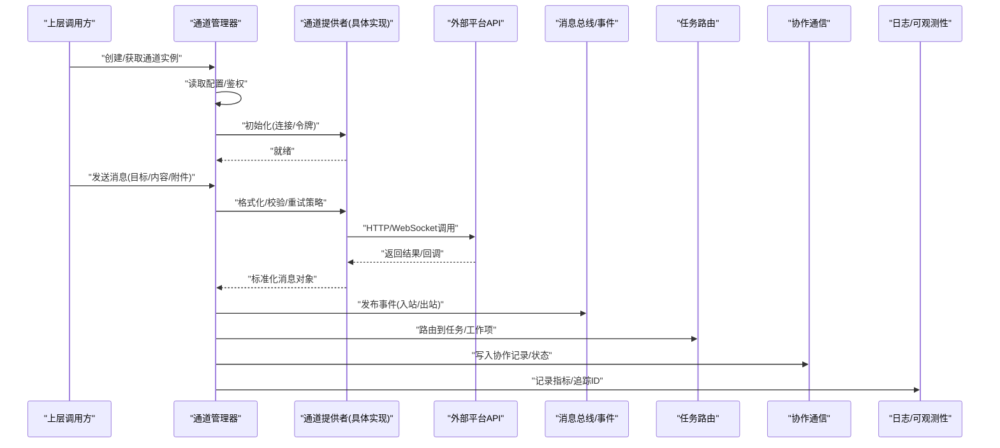
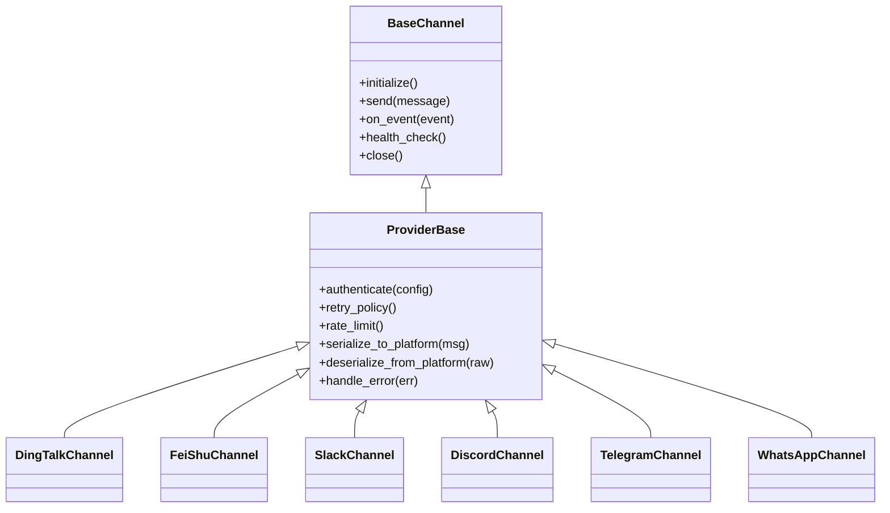
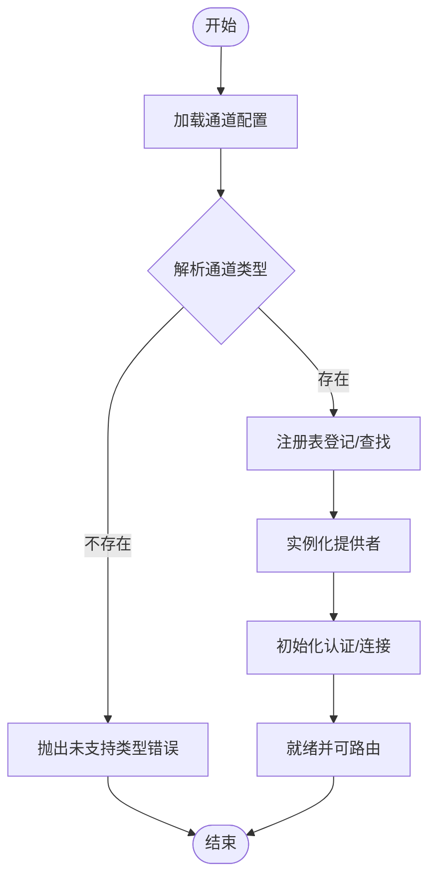
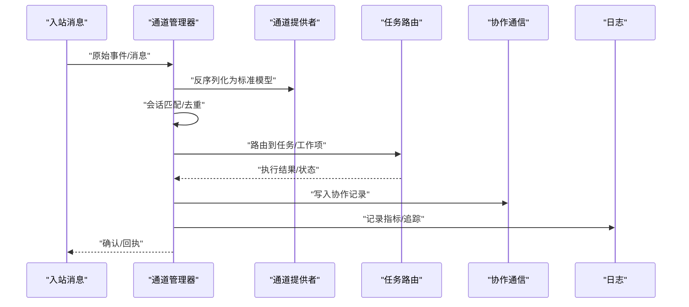
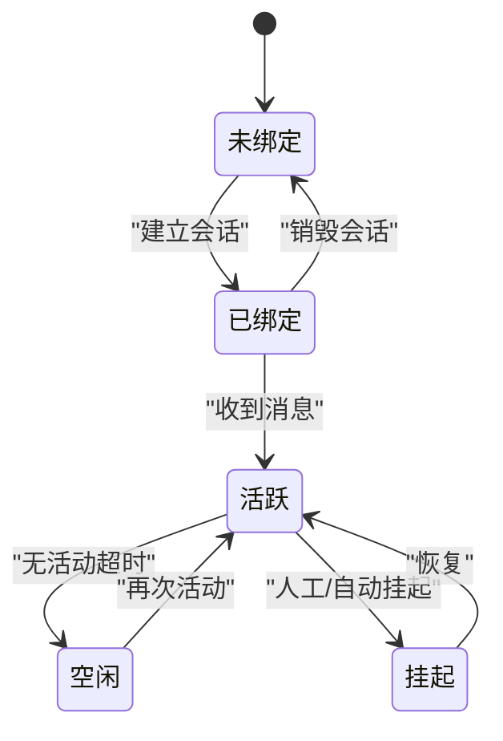
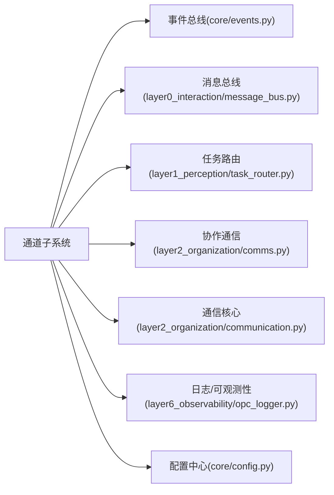

# 通道系统

<cite>
**本文引用的文件**   
- [opc/channels/base.py](file://opc/channels/base.py)
- [opc/channels/manager.py](file://opc/channels/manager.py)
- [opc/channels/provider_base.py](file://opc/channels/provider_base.py)
- [opc/channels/provider_registry.py](file://opc/channels/provider_registry.py)
- [opc/channels/session.py](file://opc/channels/session.py)
- [opc/channels/dingtalk.py](file://opc/channels/dingtalk.py)
- [opc/channels/feishu.py](file://opc/channels/feishu.py)
- [opc/channels/slack.py](file://opc/channels/slack.py)
- [opc/channels/discord.py](file://opc/channels/discord.py)
- [opc/channels/telegram.py](file://opc/channels/telegram.py)
- [opc/channels/whatsapp.py](file://opc/channels/whatsapp.py)
- [config/channel_config.yaml](file://config/channel_config.yaml)
- [opc/core/config.py](file://opc/core/config.py)
- [opc/core/events.py](file://opc/core/events.py)
- [opc/layer0_interaction/message_bus.py](file://opc/layer0_interaction/message_bus.py)
- [opc/layer1_perception/task_router.py](file://opc/layer1_perception/task_router.py)
- [opc/layer2_organization/comms.py](file://opc/layer2_organization/comms.py)
- [opc/layer2_organization/communication.py](file://opc/layer2_organization/communication.py)
- [opc/layer6_observability/opc_logger.py](file://opc/layer6_observability/opc_logger.py)
- [tests/test_channel_contracts.py](file://tests/test_channel_contracts.py)
- [tests/test_channels.py](file://tests/test_channels.py)
</cite>

## 目录
1. [简介](#简介)
2. [项目结构](#项目结构)
3. [核心组件](#核心组件)
4. [架构总览](#架构总览)
5. [详细组件分析](#详细组件分析)
6. [依赖关系分析](#依赖关系分析)
7. [性能考虑](#性能考虑)
8. [故障排查指南](#故障排查指南)
9. [结论](#结论)
10. [附录](#附录)

## 简介
本文件面向OpenOPC的“通道系统”，聚焦于多平台消息通道的统一抽象、注册与路由机制，以及内置通道（钉钉、飞书、Slack、Discord、Telegram、WhatsApp等）的实现要点。文档涵盖：
- 通道架构设计与消息传递机制
- 通道注册、消息路由与会话管理
- 自定义通道开发指南（接口规范、认证方式、消息格式转换）
- 配置示例与集成步骤
- 错误处理、重试机制与连接池管理
- 调试工具与性能监控方法

目标是帮助开发者快速理解并扩展新的通信渠道，确保在统一抽象之上实现高内聚、低耦合的可插拔通道生态。

## 项目结构
通道子系统位于 opc/channels 目录，围绕“基础抽象 + 提供者基类 + 注册表 + 管理器 + 会话”五层展开；同时通过配置中心加载各通道参数，并通过事件总线与上层编排模块交互。

```mermaid
graph TB
subgraph "通道子系统"
Base["基础抽象<br/>base.py"]
ProviderBase["提供者基类<br/>provider_base.py"]
Registry["提供者注册表<br/>provider_registry.py"]
Manager["通道管理器<br/>manager.py"]
Session["会话管理<br/>session.py"]
DingTalk["钉钉通道<br/>dingtalk.py"]
FeiShu["飞书通道<br/>feishu.py"]
Slack["Slack通道<br/>slack.py"]
Discord["Discord通道<br/>discord.py"]
Telegram["Telegram通道<br/>telegram.py"]
WhatsApp["WhatsApp通道<br/>whatsapp.py"]
end
subgraph "系统与配置"
Config["配置中心<br/>core/config.py"]
ChannelCfg["通道配置<br/>channel_config.yaml"]
Events["事件总线<br/>core/events.py"]
MsgBus["消息总线<br/>layer0_interaction/message_bus.py"]
TaskRouter["任务路由<br/>layer1_perception/task_router.py"]
Comms["协作通信<br/>layer2_organization/comms.py"]
CommCore["通信核心<br/>layer2_organization/communication.py"]
Logger["可观测性日志<br/>layer6_observability/opc_logger.py"]
end
Base --> ProviderBase
ProviderBase --> Registry
Manager --> ProviderBase
Manager --> Registry
Manager --> Session
DingTalk --> ProviderBase
FeiShu --> ProviderBase
Slack --> ProviderBase
Discord --> ProviderBase
Telegram --> ProviderBase
WhatsApp --> ProviderBase
Config --> ChannelCfg
Manager --> Config
Manager --> Events
Manager --> MsgBus
Manager --> TaskRouter
Manager --> Comms
Manager --> CommCore
Manager --> Logger
```

图表来源
- [opc/channels/base.py](file://opc/channels/base.py)
- [opc/channels/provider_base.py](file://opc/channels/provider_base.py)
- [opc/channels/provider_registry.py](file://opc/channels/provider_registry.py)
- [opc/channels/manager.py](file://opc/channels/manager.py)
- [opc/channels/session.py](file://opc/channels/session.py)
- [opc/channels/dingtalk.py](file://opc/channels/dingtalk.py)
- [opc/channels/feishu.py](file://opc/channels/feishu.py)
- [opc/channels/slack.py](file://opc/channels/slack.py)
- [opc/channels/discord.py](file://opc/channels/discord.py)
- [opc/channels/telegram.py](file://opc/channels/telegram.py)
- [opc/channels/whatsapp.py](file://opc/channels/whatsapp.py)
- [opc/core/config.py](file://opc/core/config.py)
- [config/channel_config.yaml](file://config/channel_config.yaml)
- [opc/core/events.py](file://opc/core/events.py)
- [opc/layer0_interaction/message_bus.py](file://opc/layer0_interaction/message_bus.py)
- [opc/layer1_perception/task_router.py](file://opc/layer1_perception/task_router.py)
- [opc/layer2_organization/comms.py](file://opc/layer2_organization/comms.py)
- [opc/layer2_organization/communication.py](file://opc/layer2_organization/communication.py)
- [opc/layer6_observability/opc_logger.py](file://opc/layer6_observability/opc_logger.py)

章节来源
- [opc/channels/base.py](file://opc/channels/base.py)
- [opc/channels/provider_base.py](file://opc/channels/provider_base.py)
- [opc/channels/provider_registry.py](file://opc/channels/provider_registry.py)
- [opc/channels/manager.py](file://opc/channels/manager.py)
- [opc/channels/session.py](file://opc/channels/session.py)
- [config/channel_config.yaml](file://config/channel_config.yaml)
- [opc/core/config.py](file://opc/core/config.py)
- [opc/core/events.py](file://opc/core/events.py)
- [opc/layer0_interaction/message_bus.py](file://opc/layer0_interaction/message_bus.py)
- [opc/layer1_perception/task_router.py](file://opc/layer1_perception/task_router.py)
- [opc/layer2_organization/comms.py](file://opc/layer2_organization/comms.py)
- [opc/layer2_organization/communication.py](file://opc/layer2_organization/communication.py)
- [opc/layer6_observability/opc_logger.py](file://opc/layer6_observability/opc_logger.py)

## 核心组件
- 基础抽象（Base）：定义通道通用能力边界，如初始化、发送消息、接收回调、健康检查、资源清理等。
- 提供者基类（ProviderBase）：封装跨平台差异的最小公共逻辑，提供统一的认证、限流、重试、序列化/反序列化的钩子点。
- 提供者注册表（ProviderRegistry）：集中管理通道类型到具体实现的映射，支持动态发现与热更新。
- 通道管理器（ChannelManager）：负责通道生命周期、实例化、路由分发、会话绑定、并发控制与错误恢复。
- 会话管理（Session）：维护通道侧会话上下文（用户、群组、话题、状态），保证消息有序与去重。
- 内置通道实现：钉钉、飞书、Slack、Discord、Telegram、WhatsApp等，各自继承提供者基类，适配平台API与消息模型。

章节来源
- [opc/channels/base.py](file://opc/channels/base.py)
- [opc/channels/provider_base.py](file://opc/channels/provider_base.py)
- [opc/channels/provider_registry.py](file://opc/channels/provider_registry.py)
- [opc/channels/manager.py](file://opc/channels/manager.py)
- [opc/channels/session.py](file://opc/channels/session.py)
- [opc/channels/dingtalk.py](file://opc/channels/dingtalk.py)
- [opc/channels/feishu.py](file://opc/channels/feishu.py)
- [opc/channels/slack.py](file://opc/channels/slack.py)
- [opc/channels/discord.py](file://opc/channels/discord.py)
- [opc/channels/telegram.py](file://opc/channels/telegram.py)
- [opc/channels/whatsapp.py](file://opc/channels/whatsapp.py)

## 架构总览
通道系统采用“抽象-提供者-注册-管理-会话”的分层设计，结合配置中心与事件总线，形成可扩展的消息接入层。

图表来源
- [opc/channels/manager.py](file://opc/channels/manager.py)
- [opc/channels/provider_base.py](file://opc/channels/provider_base.py)
- [opc/core/events.py](file://opc/core/events.py)
- [opc/layer0_interaction/message_bus.py](file://opc/layer0_interaction/message_bus.py)
- [opc/layer1_perception/task_router.py](file://opc/layer1_perception/task_router.py)
- [opc/layer2_organization/comms.py](file://opc/layer2_organization/comms.py)
- [opc/layer6_observability/opc_logger.py](file://opc/layer6_observability/opc_logger.py)

## 详细组件分析

### 基础抽象与提供者基类
- 基础抽象定义了通道必须实现的能力集，包括：
  - 初始化与销毁
  - 发送消息（文本、富文本、附件）
  - 接收回调（入站消息、事件）
  - 健康检查与心跳
  - 会话绑定与解绑
- 提供者基类在抽象之上提供：
  - 认证流程封装（令牌刷新、签名、OAuth）
  - 请求重试与退避策略
  - 速率限制与队列化
  - 消息模型标准化（平台差异转内部统一模型）
  - 错误分类与上报（网络、业务、权限）

图表来源
- [opc/channels/base.py](file://opc/channels/base.py)
- [opc/channels/provider_base.py](file://opc/channels/provider_base.py)
- [opc/channels/dingtalk.py](file://opc/channels/dingtalk.py)
- [opc/channels/feishu.py](file://opc/channels/feishu.py)
- [opc/channels/slack.py](file://opc/channels/slack.py)
- [opc/channels/discord.py](file://opc/channels/discord.py)
- [opc/channels/telegram.py](file://opc/channels/telegram.py)
- [opc/channels/whatsapp.py](file://opc/channels/whatsapp.py)

章节来源
- [opc/channels/base.py](file://opc/channels/base.py)
- [opc/channels/provider_base.py](file://opc/channels/provider_base.py)

### 通道注册与发现
- 注册表负责将“通道类型字符串”映射到具体提供者类，支持：
  - 静态注册（启动时加载）
  - 动态注册（插件或运行时发现）
  - 版本兼容与别名
- 管理器在创建通道实例前，从注册表解析类型并实例化，随后注入配置与会话上下文。

图表来源
- [opc/channels/provider_registry.py](file://opc/channels/provider_registry.py)
- [opc/channels/manager.py](file://opc/channels/manager.py)
- [config/channel_config.yaml](file://config/channel_config.yaml)

章节来源
- [opc/channels/provider_registry.py](file://opc/channels/provider_registry.py)
- [opc/channels/manager.py](file://opc/channels/manager.py)
- [config/channel_config.yaml](file://config/channel_config.yaml)

### 通道管理器与消息路由
- 管理器职责：
  - 通道生命周期管理（创建、预热、关闭）
  - 按目标标识选择通道实例（用户/群组/话题）
  - 消息入站/出站路由与去重
  - 会话绑定与上下文传播
  - 错误分类、重试与降级
- 路由策略：
  - 基于目标标识（用户ID、群组ID、频道ID）匹配通道
  - 基于事件类型（消息、反应、状态变更）分发
  - 与任务路由协作，将入站消息关联到工作项或会话

图表来源
- [opc/channels/manager.py](file://opc/channels/manager.py)
- [opc/layer1_perception/task_router.py](file://opc/layer1_perception/task_router.py)
- [opc/layer2_organization/comms.py](file://opc/layer2_organization/comms.py)
- [opc/layer6_observability/opc_logger.py](file://opc/layer6_observability/opc_logger.py)

章节来源
- [opc/channels/manager.py](file://opc/channels/manager.py)
- [opc/layer1_perception/task_router.py](file://opc/layer1_perception/task_router.py)
- [opc/layer2_organization/comms.py](file://opc/layer2_organization/comms.py)

### 会话管理
- 会话用于维持通道侧的用户/群组上下文，包括：
  - 会话键（用户ID、群组ID、话题ID）
  - 会话状态（活跃、空闲、挂起）
  - 消息顺序与幂等键
  - 超时与回收策略
- 管理器与会话协同，确保同一会话内的消息串行化处理，避免竞态条件。

图表来源
- [opc/channels/session.py](file://opc/channels/session.py)
- [opc/channels/manager.py](file://opc/channels/manager.py)

章节来源
- [opc/channels/session.py](file://opc/channels/session.py)
- [opc/channels/manager.py](file://opc/channels/manager.py)

### 内置通道实现要点
以下为各内置通道的关键特性与差异点（以实现文件为准）：
- 钉钉（DingTalk）
  - 认证：企业应用Token/机器人密钥
  - 消息：文本、卡片、富文本、附件
  - 回调：Webhook事件订阅
  - 限流：按API配额与并发控制
- 飞书（FeiShu）
  - 认证：App ID/Secret、临时授权码
  - 消息：IM消息、富媒体、卡片消息
  - 回调：事件订阅与长轮询
  - 限流：按租户与应用维度
- Slack
  - 认证：Bot Token、OAuth范围
  - 消息：Blocks、富文本、文件上传
  - 回调：Event Subscriptions
  - 限流：Slack API速率限制
- Discord
  - 认证：Bot Token、权限范围
  - 消息：Embeds、富文本、附件
  - 回调：Gateway事件
  - 限流：WebSocket与REST双限流
- Telegram
  - 认证：Bot Token
  - 消息：Markdown/HTML、富媒体
  - 回调：Webhook或长轮询
  - 限流：Telegram Bot API限制
- WhatsApp（Business API）
  - 认证：Access Token、Phone Number ID
  - 消息：模板消息、富媒体
  - 回调：Webhook事件
  - 限流：WhatsApp Business API配额

章节来源
- [opc/channels/dingtalk.py](file://opc/channels/dingtalk.py)
- [opc/channels/feishu.py](file://opc/channels/feishu.py)
- [opc/channels/slack.py](file://opc/channels/slack.py)
- [opc/channels/discord.py](file://opc/channels/discord.py)
- [opc/channels/telegram.py](file://opc/channels/telegram.py)
- [opc/channels/whatsapp.py](file://opc/channels/whatsapp.py)

### 配置与集成步骤
- 配置文件位置：config/channel_config.yaml
- 配置项建议包含：
  - 通道类型（如 dingtalk、feishu、slack、discord、telegram、whatsapp）
  - 认证凭据（Token、App ID/Secret、回调URL等）
  - 目标标识（用户/群组/频道ID）
  - 行为开关（是否启用、重试次数、超时时间）
  - 日志级别与追踪标签
- 集成步骤：
  1. 在 channel_config.yaml 中添加通道条目
  2. 确保对应通道类型已在注册表中可用
  3. 重启服务或触发热重载以加载新配置
  4. 验证健康检查与回调可达性
  5. 发送测试消息并观察日志与指标

章节来源
- [config/channel_config.yaml](file://config/channel_config.yaml)
- [opc/core/config.py](file://opc/core/config.py)
- [opc/channels/provider_registry.py](file://opc/channels/provider_registry.py)

### 自定义通道开发指南
- 接口规范：
  - 继承提供者基类，实现必要方法（初始化、发送、回调、健康检查、关闭）
  - 遵循标准消息模型（文本、富文本、附件、元数据）
  - 实现错误分类与重试策略
- 认证方式：
  - 支持Token、OAuth、签名等多种方式
  - 提供令牌刷新与失效处理
- 消息格式转换：
  - 将平台特定格式转换为内部标准模型
  - 将内部标准模型转换为平台格式
- 注册与发现：
  - 在注册表中登记通道类型与实现类
  - 支持动态加载与热更新
- 配置项：
  - 在通道配置中声明类型、凭据、目标标识、行为开关
- 测试与验收：
  - 使用单元测试覆盖认证、发送、回调、错误路径
  - 进行端到端集成测试，验证路由与会话一致性

章节来源
- [opc/channels/provider_base.py](file://opc/channels/provider_base.py)
- [opc/channels/provider_registry.py](file://opc/channels/provider_registry.py)
- [config/channel_config.yaml](file://config/channel_config.yaml)
- [tests/test_channel_contracts.py](file://tests/test_channel_contracts.py)
- [tests/test_channels.py](file://tests/test_channels.py)

### 错误处理、重试与连接池
- 错误分类：
  - 网络错误（超时、连接失败）
  - 业务错误（权限不足、目标不存在）
  - 平台限流（429、配额耗尽）
- 重试策略：
  - 指数退避与抖动
  - 最大重试次数与熔断
  - 针对可重试错误的差异化处理
- 连接池：
  - HTTP客户端连接复用
  - WebSocket连接管理与重连
  - 并发控制与背压

章节来源
- [opc/channels/provider_base.py](file://opc/channels/provider_base.py)
- [opc/channels/manager.py](file://opc/channels/manager.py)

### 调试工具与性能监控
- 日志与追踪：
  - 结构化日志输出（含追踪ID、通道类型、目标标识）
  - 关键路径埋点（认证、发送、回调、错误）
- 指标收集：
  - 成功率、延迟、重试次数、限流计数
  - 连接池大小、活跃会话数
- 诊断命令：
  - 健康检查接口
  - 通道状态查询
  - 会话列表与详情

章节来源
- [opc/layer6_observability/opc_logger.py](file://opc/layer6_observability/opc_logger.py)
- [opc/channels/manager.py](file://opc/channels/manager.py)

## 依赖关系分析
通道子系统与上层模块的依赖关系如下：

图表来源
- [opc/channels/manager.py](file://opc/channels/manager.py)
- [opc/core/events.py](file://opc/core/events.py)
- [opc/layer0_interaction/message_bus.py](file://opc/layer0_interaction/message_bus.py)
- [opc/layer1_perception/task_router.py](file://opc/layer1_perception/task_router.py)
- [opc/layer2_organization/comms.py](file://opc/layer2_organization/comms.py)
- [opc/layer2_organization/communication.py](file://opc/layer2_organization/communication.py)
- [opc/layer6_observability/opc_logger.py](file://opc/layer6_observability/opc_logger.py)
- [opc/core/config.py](file://opc/core/config.py)

章节来源
- [opc/channels/manager.py](file://opc/channels/manager.py)
- [opc/core/events.py](file://opc/core/events.py)
- [opc/layer0_interaction/message_bus.py](file://opc/layer0_interaction/message_bus.py)
- [opc/layer1_perception/task_router.py](file://opc/layer1_perception/task_router.py)
- [opc/layer2_organization/comms.py](file://opc/layer2_organization/comms.py)
- [opc/layer2_organization/communication.py](file://opc/layer2_organization/communication.py)
- [opc/layer6_observability/opc_logger.py](file://opc/layer6_observability/opc_logger.py)
- [opc/core/config.py](file://opc/core/config.py)

## 性能考虑
- 并发与串行化：
  - 会话级串行队列避免竞态
  - 通道级并发控制防止过载
- 缓存与复用：
  - 认证令牌缓存与刷新
  - HTTP连接池与WebSocket长连接
- 限流与退避：
  - 平台API限流感知与自适应退避
  - 批量发送与合并策略
- 资源回收：
  - 会话超时与惰性销毁
  - 异常路径下的资源释放

[本节为通用指导，不直接分析具体文件]

## 故障排查指南
- 常见问题定位：
  - 认证失败：检查凭据与权限范围
  - 回调不可达：验证回调URL与防火墙策略
  - 限流告警：调整重试策略与批量发送
  - 会话丢失：检查会话键一致性与持久化
- 诊断手段：
  - 查看结构化日志与追踪ID
  - 使用健康检查接口验证通道状态
  - 抓取入站/出站消息样本进行比对
- 恢复策略：
  - 自动重试与熔断
  - 手动重置会话与重新认证
  - 回滚配置与降级模式

章节来源
- [opc/channels/manager.py](file://opc/channels/manager.py)
- [opc/layer6_observability/opc_logger.py](file://opc/layer6_observability/opc_logger.py)

## 结论
通道系统通过清晰的抽象与分层设计，实现了多平台消息的统一接入与高效路由。借助注册表与管理器，新增通道只需遵循接口规范并完成配置即可快速集成。配合完善的错误处理、重试机制与可观测性工具，开发者可以稳定地扩展通信渠道，满足多样化业务场景需求。

[本节为总结性内容，不直接分析具体文件]

## 附录
- 配置示例参考：
  - 通道类型、凭据、目标标识、行为开关
- 测试用例参考：
  - 通道契约与集成测试
- 最佳实践：
  - 最小权限原则
  - 敏感信息加密存储
  - 灰度发布与回滚策略

章节来源
- [config/channel_config.yaml](file://config/channel_config.yaml)
- [tests/test_channel_contracts.py](file://tests/test_channel_contracts.py)
- [tests/test_channels.py](file://tests/test_channels.py)