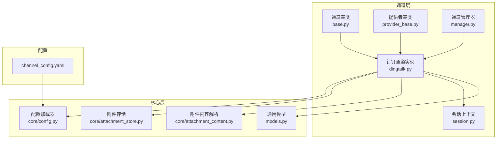
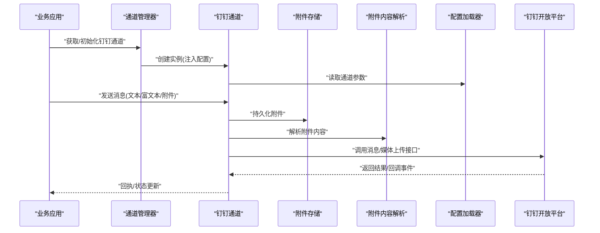
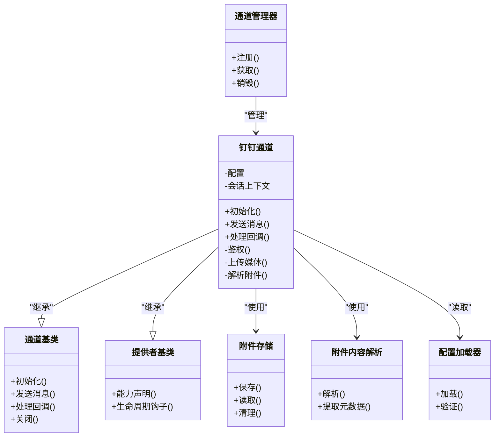
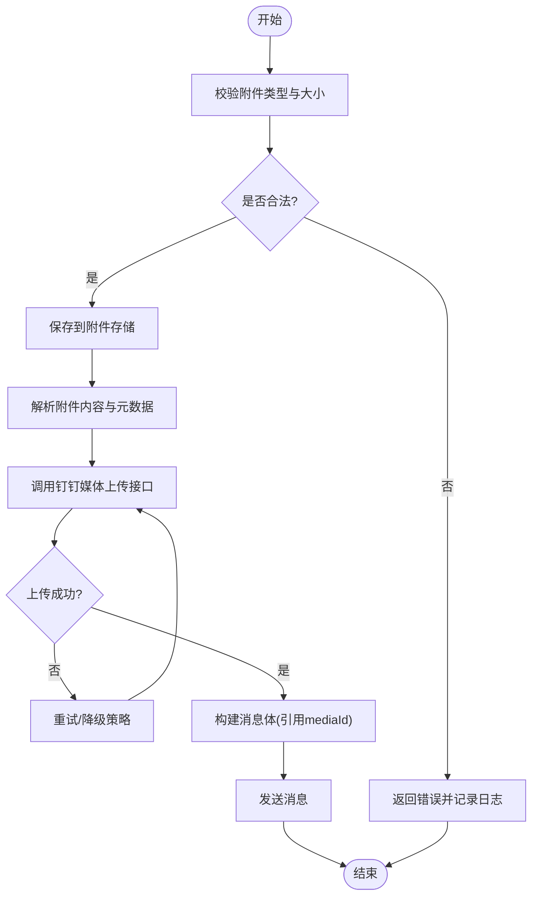
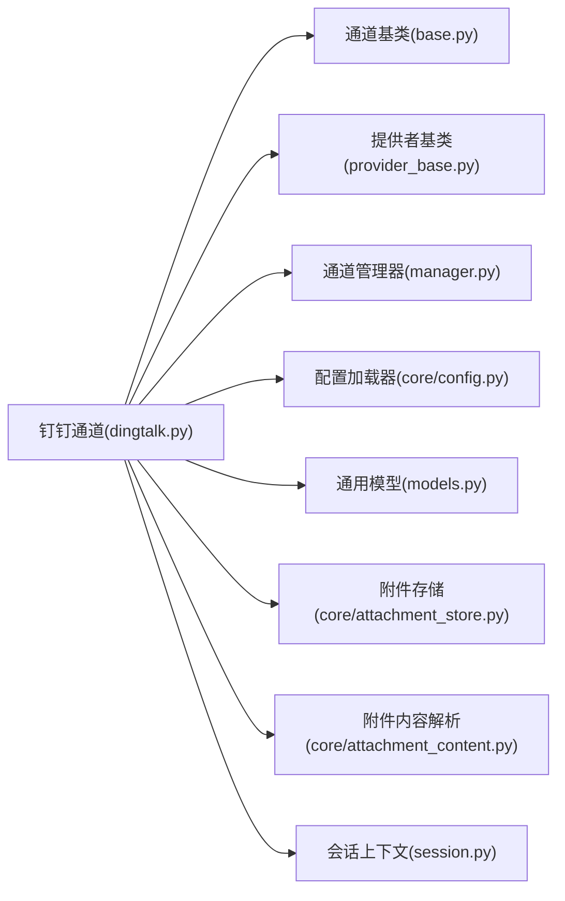

# 钉钉通道

<cite>
**本文引用的文件**   
- [opc/channels/dingtalk.py](file://opc/channels/dingtalk.py)
- [opc/channels/base.py](file://opc/channels/base.py)
- [opc/channels/provider_base.py](file://opc/channels/provider_base.py)
- [opc/channels/manager.py](file://opc/channels/manager.py)
- [config/channel_config.yaml](file://config/channel_config.yaml)
- [opc/core/config.py](file://opc/core/config.py)
- [opc/core/models.py](file://opc/core/models.py)
- [opc/core/attachment_store.py](file://opc/core/attachment_store.py)
- [opc/core/attachment_content.py](file://opc/core/attachment_content.py)
- [opc/channels/session.py](file://opc/channels/session.py)
- [opc/channels/__init__.py](file://opc/channels/__init__.py)
</cite>

## 目录
1. [简介](#简介)
2. [项目结构](#项目结构)
3. [核心组件](#核心组件)
4. [架构总览](#架构总览)
5. [详细组件分析](#详细组件分析)
6. [依赖分析](#依赖分析)
7. [性能考虑](#性能考虑)
8. [故障排查指南](#故障排查指南)
9. [结论](#结论)
10. [附录](#附录)

## 简介
本文件为 OpenOPC 的“钉钉通道”提供完整实现文档，覆盖以下方面：
- 钉钉 API 集成方式、认证流程与权限配置
- 消息格式转换、富文本支持与附件处理
- 完整的配置示例（企业应用设置、Webhook 配置、回调 URL）
- 用户身份映射、群组管理与消息路由规则
- 错误处理、重试机制与连接池配置
- 调试方法与常见问题解决方案

目标是帮助开发者正确集成和使用钉钉渠道，确保在真实生产环境中稳定运行。

## 项目结构
OpenOPC 将各外部通讯平台抽象为“通道”，通过统一的接口进行注册、发现与调用。钉钉通道位于 channels 子模块中，遵循基类契约并接入全局通道管理器。

图表来源
- [opc/channels/dingtalk.py](file://opc/channels/dingtalk.py)
- [opc/channels/base.py](file://opc/channels/base.py)
- [opc/channels/provider_base.py](file://opc/channels/provider_base.py)
- [opc/channels/manager.py](file://opc/channels/manager.py)
- [opc/channels/session.py](file://opc/channels/session.py)
- [opc/core/config.py](file://opc/core/config.py)
- [opc/core/models.py](file://opc/core/models.py)
- [opc/core/attachment_store.py](file://opc/core/attachment_store.py)
- [opc/core/attachment_content.py](file://opc/core/attachment_content.py)
- [config/channel_config.yaml](file://config/channel_config.yaml)

章节来源
- [opc/channels/dingtalk.py](file://opc/channels/dingtalk.py)
- [opc/channels/base.py](file://opc/channels/base.py)
- [opc/channels/provider_base.py](file://opc/channels/provider_base.py)
- [opc/channels/manager.py](file://opc/channels/manager.py)
- [opc/channels/session.py](file://opc/channels/session.py)
- [opc/core/config.py](file://opc/core/config.py)
- [opc/core/models.py](file://opc/core/models.py)
- [opc/core/attachment_store.py](file://opc/core/attachment_store.py)
- [opc/core/attachment_content.py](file://opc/core/attachment_content.py)
- [config/channel_config.yaml](file://config/channel_config.yaml)

## 核心组件
- 钉钉通道实现：封装与钉钉开放平台的交互，包括鉴权、消息发送、回调处理、附件上传等。
- 通道基类与提供者基类：定义统一的消息收发、会话管理、能力声明与生命周期钩子。
- 通道管理器：负责通道的注册、查找、实例化与生命周期管理。
- 配置系统：从 channel_config.yaml 读取通道参数，注入到运行时。
- 附件子系统：统一存储与解析附件，支持图片、文件等多类型内容。
- 会话上下文：维护通道级会话状态与上下文信息。

章节来源
- [opc/channels/dingtalk.py](file://opc/channels/dingtalk.py)
- [opc/channels/base.py](file://opc/channels/base.py)
- [opc/channels/provider_base.py](file://opc/channels/provider_base.py)
- [opc/channels/manager.py](file://opc/channels/manager.py)
- [opc/core/config.py](file://opc/core/config.py)
- [opc/core/attachment_store.py](file://opc/core/attachment_store.py)
- [opc/core/attachment_content.py](file://opc/core/attachment_content.py)
- [opc/channels/session.py](file://opc/channels/session.py)

## 架构总览
下图展示从上层业务到钉钉开放平台的整体数据流与控制流。

图表来源
- [opc/channels/manager.py](file://opc/channels/manager.py)
- [opc/channels/dingtalk.py](file://opc/channels/dingtalk.py)
- [opc/core/config.py](file://opc/core/config.py)
- [opc/core/attachment_store.py](file://opc/core/attachment_store.py)
- [opc/core/attachment_content.py](file://opc/core/attachment_content.py)

## 详细组件分析

### 钉钉通道实现
- 职责
  - 对接钉钉开放平台 API，完成鉴权、消息发送、回调接收、附件上传与下载。
  - 将内部消息模型转换为钉钉消息体，支持文本、富文本与多媒体。
  - 维护会话上下文，处理群聊与单聊的路由差异。
- 关键流程
  - 初始化：加载配置、建立必要连接或缓存令牌。
  - 发送消息：组装消息体，必要时先上传媒体资源，再发送消息。
  - 回调处理：校验签名、解析事件、转发至上层处理逻辑。
  - 错误处理：对网络异常、限流、鉴权失败等进行分类处理与重试。
- 设计要点
  - 与通道基类保持一致的接口契约，便于管理器统一调度。
  - 使用附件子系统统一处理多类型附件，避免重复实现。
  - 通过配置驱动，支持不同环境（开发/测试/生产）切换。

章节来源
- [opc/channels/dingtalk.py](file://opc/channels/dingtalk.py)
- [opc/channels/base.py](file://opc/channels/base.py)
- [opc/channels/provider_base.py](file://opc/channels/provider_base.py)
- [opc/channels/session.py](file://opc/channels/session.py)

#### 类关系图

图表来源
- [opc/channels/dingtalk.py](file://opc/channels/dingtalk.py)
- [opc/channels/base.py](file://opc/channels/base.py)
- [opc/channels/provider_base.py](file://opc/channels/provider_base.py)
- [opc/channels/manager.py](file://opc/channels/manager.py)
- [opc/core/attachment_store.py](file://opc/core/attachment_store.py)
- [opc/core/attachment_content.py](file://opc/core/attachment_content.py)
- [opc/core/config.py](file://opc/core/config.py)

### 消息格式转换与富文本支持
- 输入模型：内部消息模型包含文本、富文本片段、附件列表、目标标识（用户/群组）。
- 转换策略：
  - 纯文本：直接映射为钉钉文本消息。
  - 富文本：按块转换为钉钉富文本结构，保留标题、段落、链接等语义。
  - 附件：先上传媒体资源获取 mediaId，再在消息体中引用。
- 限制与兼容：
  - 注意钉钉富文本块数量与大小限制。
  - 超大附件需分片或压缩后再上传。

章节来源
- [opc/channels/dingtalk.py](file://opc/channels/dingtalk.py)
- [opc/core/models.py](file://opc/core/models.py)
- [opc/core/attachment_store.py](file://opc/core/attachment_store.py)
- [opc/core/attachment_content.py](file://opc/core/attachment_content.py)

### 附件处理流程

图表来源
- [opc/channels/dingtalk.py](file://opc/channels/dingtalk.py)
- [opc/core/attachment_store.py](file://opc/core/attachment_store.py)
- [opc/core/attachment_content.py](file://opc/core/attachment_content.py)

### 认证流程与权限配置
- 认证方式：基于企业应用的 AppKey/AppSecret 获取访问令牌，或在 Webhook 场景下使用安全签名。
- 权限范围：根据所需能力（发消息、上传媒体、读取用户信息等）申请对应权限。
- 安全建议：
  - 令牌缓存与自动刷新，避免频繁请求。
  - 敏感配置通过环境变量或密钥管理服务注入。
  - 回调地址启用签名校验与白名单。

章节来源
- [opc/channels/dingtalk.py](file://opc/channels/dingtalk.py)
- [config/channel_config.yaml](file://config/channel_config.yaml)
- [opc/core/config.py](file://opc/core/config.py)

### 配置示例与说明
以下为 channel_config.yaml 中钉钉通道的典型字段说明（以键名与用途为主，不包含具体值）：
- app_key：企业应用标识
- app_secret：企业应用密钥
- webhook_url：机器人 Webhook 地址（如适用）
- callback_url：回调接收端点（用于事件推送）
- media_upload_base_url：媒体上传基础地址
- message_send_base_url：消息发送基础地址
- token_cache_ttl：访问令牌缓存过期时间
- retry_max_attempts：最大重试次数
- retry_backoff_base：退避基数（秒）
- attachment_dir：附件本地存储目录
- allowed_file_types：允许的文件类型白名单
- max_attachment_size：最大附件大小（字节）
- group_routing_rules：群组路由规则（正则或前缀匹配）
- user_mapping：用户 ID 映射表（内部ID -> 钉钉ID）

章节来源
- [config/channel_config.yaml](file://config/channel_config.yaml)
- [opc/core/config.py](file://opc/core/config.py)

### 用户身份映射、群组管理与消息路由
- 用户身份映射：
  - 维护内部用户 ID 与钉钉用户 ID 的映射表，支持批量导入与增量同步。
  - 当消息来自外部时，依据映射表解析发送者身份。
- 群组管理：
  - 支持按群组前缀或正则表达式进行路由。
  - 可配置默认群组与管理员群组，区分普通成员与管理操作。
- 消息路由规则：
  - 基于目标标识（用户/群组）、消息关键字或命令前缀进行分发。
  - 支持优先级与短路规则，避免重复处理。

章节来源
- [opc/channels/dingtalk.py](file://opc/channels/dingtalk.py)
- [config/channel_config.yaml](file://config/channel_config.yaml)

### 错误处理、重试机制与连接池
- 错误分类：
  - 网络错误：超时、DNS 解析失败、SSL 握手失败。
  - 业务错误：鉴权失败、权限不足、频率限制、参数非法。
  - 系统错误：附件存储不可用、解析失败。
- 重试策略：
  - 指数退避 + 抖动，避免雪崩。
  - 针对幂等接口采用去重与补偿。
- 连接池：
  - HTTP 客户端复用连接，减少握手开销。
  - 合理设置最大连接数与空闲超时，防止资源泄漏。

章节来源
- [opc/channels/dingtalk.py](file://opc/channels/dingtalk.py)
- [opc/core/config.py](file://opc/core/config.py)

### 调试方法与常见问题
- 调试方法：
  - 开启详细日志，记录请求/响应摘要与错误堆栈。
  - 使用沙箱环境与企业应用测试账号进行联调。
  - 回放钉钉回调事件，验证签名校验与事件解析。
- 常见问题：
  - 回调签名校验失败：检查签名算法与密钥一致性。
  - 媒体上传失败：确认文件大小与类型在白名单内。
  - 限流导致失败：调整重试退避与并发度。
  - 用户映射缺失：补充映射表或触发同步任务。

章节来源
- [opc/channels/dingtalk.py](file://opc/channels/dingtalk.py)
- [config/channel_config.yaml](file://config/channel_config.yaml)

## 依赖分析
钉钉通道依赖的核心模块如下：

图表来源
- [opc/channels/dingtalk.py](file://opc/channels/dingtalk.py)
- [opc/channels/base.py](file://opc/channels/base.py)
- [opc/channels/provider_base.py](file://opc/channels/provider_base.py)
- [opc/channels/manager.py](file://opc/channels/manager.py)
- [opc/core/config.py](file://opc/core/config.py)
- [opc/core/models.py](file://opc/core/models.py)
- [opc/core/attachment_store.py](file://opc/core/attachment_store.py)
- [opc/core/attachment_content.py](file://opc/core/attachment_content.py)
- [opc/channels/session.py](file://opc/channels/session.py)

章节来源
- [opc/channels/dingtalk.py](file://opc/channels/dingtalk.py)
- [opc/channels/base.py](file://opc/channels/base.py)
- [opc/channels/provider_base.py](file://opc/channels/provider_base.py)
- [opc/channels/manager.py](file://opc/channels/manager.py)
- [opc/core/config.py](file://opc/core/config.py)
- [opc/core/models.py](file://opc/core/models.py)
- [opc/core/attachment_store.py](file://opc/core/attachment_store.py)
- [opc/core/attachment_content.py](file://opc/core/attachment_content.py)
- [opc/channels/session.py](file://opc/channels/session.py)

## 性能考虑
- 令牌缓存：合理设置 TTL，降低鉴权请求频率。
- 附件上传：优先复用已上传的媒体资源，避免重复上传。
- 并发控制：限制同时发送消息与上传媒体的并发度，避免触发限流。
- 连接池：根据 QPS 与延迟要求调整连接池大小与超时。
- 富文本优化：合并相邻文本块，减少富文本节点数量。

[本节为通用指导，不直接分析具体文件]

## 故障排查指南
- 快速定位：
  - 查看通道日志中的错误码与请求 ID。
  - 核对回调签名与密钥配置。
  - 检查附件存储路径与权限。
- 恢复步骤：
  - 重置令牌缓存并重新获取。
  - 清理损坏的附件记录并重试。
  - 调整重试退避参数后重启服务。
- 监控指标：
  - 发送成功率、平均耗时、重试率、限流次数。
  - 附件上传成功率与大小分布。

章节来源
- [opc/channels/dingtalk.py](file://opc/channels/dingtalk.py)
- [config/channel_config.yaml](file://config/channel_config.yaml)

## 结论
钉钉通道通过统一的通道抽象与完善的附件、配置、会话管理能力，实现了与钉钉开放平台的稳定集成。借助合理的错误处理、重试与连接池策略，可在高并发与复杂网络环境下保持良好可用性。配合完善的调试方法与监控指标，开发者可以快速定位问题并持续优化。

[本节为总结性内容，不直接分析具体文件]

## 附录
- 相关入口与注册：
  - 通道初始化与注册入口参考通道包初始化文件。
- 参考文件清单：
  - [opc/channels/__init__.py](file://opc/channels/__init__.py)

章节来源
- [opc/channels/__init__.py](file://opc/channels/__init__.py)