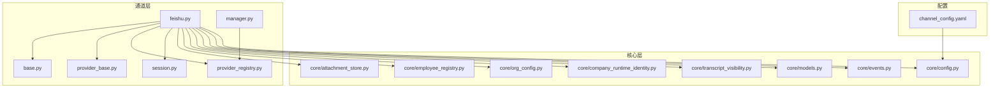
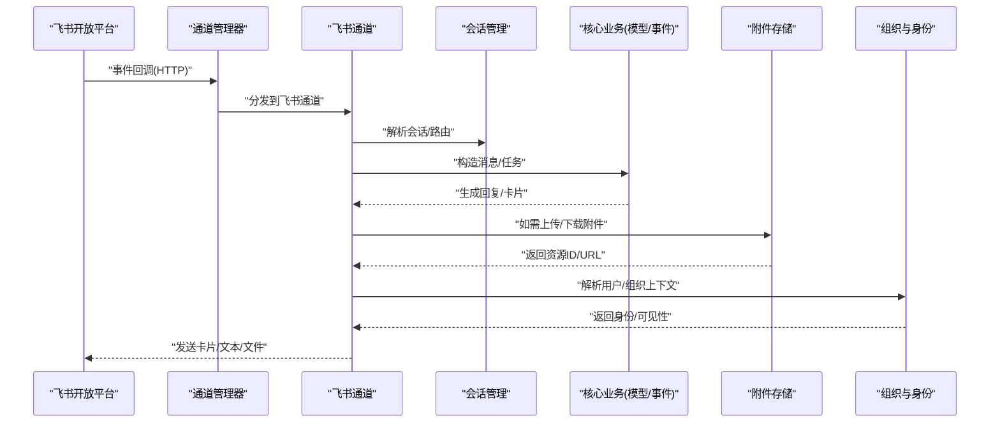
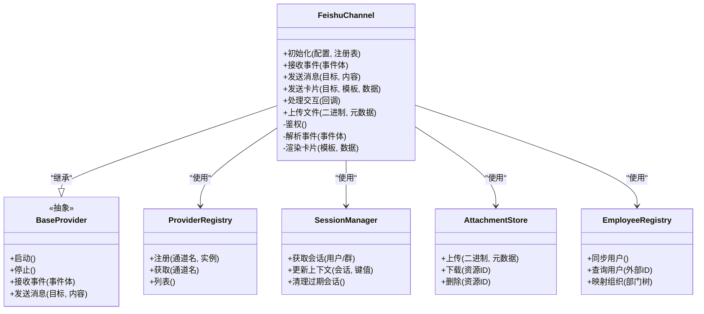
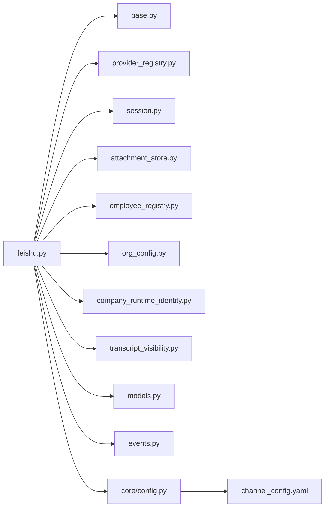
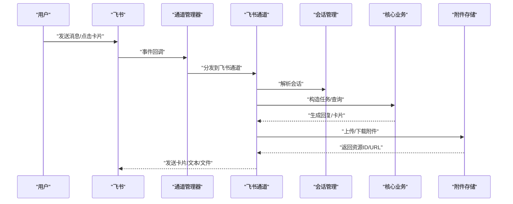

# 飞书通道

<cite>
**本文引用的文件**   
- [opc/channels/feishu.py](file://opc/channels/feishu.py)
- [opc/channels/base.py](file://opc/channels/base.py)
- [opc/channels/provider_base.py](file://opc/channels/provider_base.py)
- [opc/channels/provider_registry.py](file://opc/channels/provider_registry.py)
- [opc/channels/session.py](file://opc/channels/session.py)
- [config/channel_config.yaml](file://config/channel_config.yaml)
- [opc/core/config.py](file://opc/core/config.py)
- [opc/core/models.py](file://opc/core/models.py)
- [opc/core/attachment_store.py](file://opc/core/attachment_store.py)
- [opc/core/employee_registry.py](file://opc/core/employee_registry.py)
- [opc/core/org_config.py](file://opc/core/org_config.py)
- [opc/core/company_runtime_identity.py](file://opc/core/company_runtime_identity.py)
- [opc/core/transcript_visibility.py](file://opc/core/transcript_visibility.py)
- [opc/core/events.py](file://opc/core/events.py)
- [opc/channels/manager.py](file://opc/channels/manager.py)
- [tests/test_channels.py](file://tests/test_channels.py)
</cite>

## 目录
1. [简介](#简介)
2. [项目结构](#项目结构)
3. [核心组件](#核心组件)
4. [架构总览](#架构总览)
5. [详细组件分析](#详细组件分析)
6. [依赖关系分析](#依赖关系分析)
7. [性能考虑](#性能考虑)
8. [故障排查指南](#故障排查指南)
9. [结论](#结论)
10. [附录](#附录)

## 简介
本文件为 OpenOPC 的“飞书通道”实现文档，聚焦于将 OpenOPC 与飞书开放平台进行集成。内容涵盖：
- 飞书应用创建、权限申请与事件订阅配置
- 卡片消息、交互式消息与文件上传能力在 OpenOPC 中的适配
- 企业应用配置（事件回调、消息接收与处理）
- 用户信息同步、组织架构映射与多租户支持
- 消息格式适配、表情符号与富媒体支持
- 性能优化建议与常见问题排查方法

目标是帮助开发者快速完成飞书渠道的接入与稳定运行。

## 项目结构
OpenOPC 采用分层与插件化设计，通道层位于 opc/channels，飞书通道作为独立模块实现。核心相关路径如下：
- 通道基类与提供者注册：base.py、provider_base.py、provider_registry.py
- 会话管理：session.py
- 飞书通道实现：feishu.py
- 配置加载：core/config.py 与 channel_config.yaml
- 模型与事件：core/models.py、core/events.py
- 附件存储：core/attachment_store.py
- 组织与身份：core/employee_registry.py、core/org_config.py、core/company_runtime_identity.py、core/transcript_visibility.py
- 通道管理器：channels/manager.py
- 测试用例：tests/test_channels.py

图表来源
- [opc/channels/feishu.py](file://opc/channels/feishu.py)
- [opc/channels/base.py](file://opc/channels/base.py)
- [opc/channels/provider_base.py](file://opc/channels/provider_base.py)
- [opc/channels/provider_registry.py](file://opc/channels/provider_registry.py)
- [opc/channels/session.py](file://opc/channels/session.py)
- [opc/channels/manager.py](file://opc/channels/manager.py)
- [opc/core/config.py](file://opc/core/config.py)
- [config/channel_config.yaml](file://config/channel_config.yaml)
- [opc/core/models.py](file://opc/core/models.py)
- [opc/core/events.py](file://opc/core/events.py)
- [opc/core/attachment_store.py](file://opc/core/attachment_store.py)
- [opc/core/employee_registry.py](file://opc/core/employee_registry.py)
- [opc/core/org_config.py](file://opc/core/org_config.py)
- [opc/core/company_runtime_identity.py](file://opc/core/company_runtime_identity.py)
- [opc/core/transcript_visibility.py](file://opc/core/transcript_visibility.py)

章节来源
- [opc/channels/feishu.py](file://opc/channels/feishu.py)
- [opc/channels/base.py](file://opc/channels/base.py)
- [opc/channels/provider_base.py](file://opc/channels/provider_base.py)
- [opc/channels/provider_registry.py](file://opc/channels/provider_registry.py)
- [opc/channels/session.py](file://opc/channels/session.py)
- [opc/channels/manager.py](file://opc/channels/manager.py)
- [opc/core/config.py](file://opc/core/config.py)
- [config/channel_config.yaml](file://config/channel_config.yaml)
- [opc/core/models.py](file://opc/core/models.py)
- [opc/core/events.py](file://opc/core/events.py)
- [opc/core/attachment_store.py](file://opc/core/attachment_store.py)
- [opc/core/employee_registry.py](file://opc/core/employee_registry.py)
- [opc/core/org_config.py](file://opc/core/org_config.py)
- [opc/core/company_runtime_identity.py](file://opc/core/company_runtime_identity.py)
- [opc/core/transcript_visibility.py](file://opc/core/transcript_visibility.py)

## 核心组件
- 飞书通道实现：封装飞书 API 调用、消息收发、卡片渲染、交互回调与文件上传等能力，并遵循通道抽象接口。
- 通道基类与提供者注册：定义统一的通道契约、生命周期与注册机制，便于扩展新通道。
- 会话管理：维护跨请求的用户会话上下文、路由与状态。
- 配置系统：从 YAML 与运行时配置中加载通道参数、密钥与开关。
- 模型与事件：统一消息、附件与会话模型；提供内部事件总线用于解耦。
- 附件存储：统一管理上传/下载的文件对象与元数据。
- 组织与身份：负责员工信息同步、组织树映射、多租户隔离与可见性控制。

章节来源
- [opc/channels/feishu.py](file://opc/channels/feishu.py)
- [opc/channels/base.py](file://opc/channels/base.py)
- [opc/channels/provider_base.py](file://opc/channels/provider_base.py)
- [opc/channels/provider_registry.py](file://opc/channels/provider_registry.py)
- [opc/channels/session.py](file://opc/channels/session.py)
- [opc/core/config.py](file://opc/core/config.py)
- [config/channel_config.yaml](file://config/channel_config.yaml)
- [opc/core/models.py](file://opc/core/models.py)
- [opc/core/events.py](file://opc/core/events.py)
- [opc/core/attachment_store.py](file://opc/core/attachment_store.py)
- [opc/core/employee_registry.py](file://opc/core/employee_registry.py)
- [opc/core/org_config.py](file://opc/core/org_config.py)
- [opc/core/company_runtime_identity.py](file://opc/core/company_runtime_identity.py)
- [opc/core/transcript_visibility.py](file://opc/core/transcript_visibility.py)

## 架构总览
下图展示了 OpenOPC 与飞书开放平台的整体交互流程：飞书事件回调进入 OpenOPC 后，由通道管理器路由到飞书通道处理器，解析消息与交互事件，结合会话与组织上下文，调用上层业务逻辑，并通过飞书 API 返回卡片或文本消息。

图表来源
- [opc/channels/manager.py](file://opc/channels/manager.py)
- [opc/channels/feishu.py](file://opc/channels/feishu.py)
- [opc/channels/session.py](file://opc/channels/session.py)
- [opc/core/models.py](file://opc/core/models.py)
- [opc/core/events.py](file://opc/core/events.py)
- [opc/core/attachment_store.py](file://opc/core/attachment_store.py)
- [opc/core/employee_registry.py](file://opc/core/employee_registry.py)
- [opc/core/org_config.py](file://opc/core/org_config.py)
- [opc/core/company_runtime_identity.py](file://opc/core/company_runtime_identity.py)
- [opc/core/transcript_visibility.py](file://opc/core/transcript_visibility.py)

## 详细组件分析

### 飞书通道实现（feishu.py）
- 职责
  - 对接飞书开放平台 API：鉴权、消息发送、卡片渲染、交互回调、文件上传下载。
  - 将飞书消息转换为 OpenOPC 内部模型，并回写响应。
  - 处理卡片按钮点击、表单提交等交互事件。
  - 与附件存储、组织与身份服务协作，完成富媒体与权限控制。
- 关键流程
  - 事件入口：校验签名、解密事件体、识别事件类型（消息、卡片交互、文件等）。
  - 消息处理：提取用户、群聊、会话标识，构建上下文，调用上层业务。
  - 卡片与交互：根据模板渲染卡片 JSON，处理回调 payload，更新卡片或触发后续动作。
  - 文件上传：分片/流式上传，记录元数据，返回可分享链接。
- 错误处理
  - 网络重试、限流退避、签名校验失败、权限不足等异常分类处理与日志上报。
- 性能要点
  - 并发安全、批量发送、缓存令牌与模板、异步 IO。

章节来源
- [opc/channels/feishu.py](file://opc/channels/feishu.py)

#### 类图（代码级）

图表来源
- [opc/channels/feishu.py](file://opc/channels/feishu.py)
- [opc/channels/base.py](file://opc/channels/base.py)
- [opc/channels/provider_registry.py](file://opc/channels/provider_registry.py)
- [opc/channels/session.py](file://opc/channels/session.py)
- [opc/core/attachment_store.py](file://opc/core/attachment_store.py)
- [opc/core/employee_registry.py](file://opc/core/employee_registry.py)

### 通道基类与提供者注册
- 通道基类定义统一的生命周期与消息收发接口，确保不同通道具备一致的行为契约。
- 提供者注册表集中管理通道实例，支持动态发现与按需加载。

章节来源
- [opc/channels/base.py](file://opc/channels/base.py)
- [opc/channels/provider_base.py](file://opc/channels/provider_base.py)
- [opc/channels/provider_registry.py](file://opc/channels/provider_registry.py)

### 会话管理（session.py）
- 维护用户/群聊维度的会话上下文，包括历史、状态与路由信息。
- 支持会话持久化、过期清理与并发访问保护。

章节来源
- [opc/channels/session.py](file://opc/channels/session.py)

### 配置系统（core/config.py 与 channel_config.yaml）
- 从 YAML 与运行时配置加载通道参数（如 AppId、AppSecret、回调地址、功能开关）。
- 提供默认值、校验与热重载能力。

章节来源
- [opc/core/config.py](file://opc/core/config.py)
- [config/channel_config.yaml](file://config/channel_config.yaml)

### 模型与事件（core/models.py 与 core/events.py）
- 统一消息、附件、会话与事件模型，保证通道间数据一致性。
- 事件总线用于解耦各子系统之间的通信。

章节来源
- [opc/core/models.py](file://opc/core/models.py)
- [opc/core/events.py](file://opc/core/events.py)

### 附件存储（core/attachment_store.py）
- 提供上传、下载、删除与元数据管理能力，支持多种后端存储。
- 与飞书通道协作，完成图片、文档等多媒体资源的流转。

章节来源
- [opc/core/attachment_store.py](file://opc/core/attachment_store.py)

### 组织与身份（employee_registry.py、org_config.py、company_runtime_identity.py、transcript_visibility.py）
- 员工信息同步：拉取飞书用户与部门，建立本地索引。
- 组织映射：将飞书组织树映射到 OpenOPC 的多租户结构。
- 身份与可见性：基于角色与部门控制消息与记录的可见范围。

章节来源
- [opc/core/employee_registry.py](file://opc/core/employee_registry.py)
- [opc/core/org_config.py](file://opc/core/org_config.py)
- [opc/core/company_runtime_identity.py](file://opc/core/company_runtime_identity.py)
- [opc/core/transcript_visibility.py](file://opc/core/transcript_visibility.py)

### 通道管理器（channels/manager.py）
- 负责事件分发、通道选择与负载均衡。
- 与注册表协作，动态加载与销毁通道实例。

章节来源
- [opc/channels/manager.py](file://opc/channels/manager.py)

### 测试覆盖（tests/test_channels.py）
- 验证通道契约、消息路由、会话行为与错误恢复。
- 包含边界条件与并发场景的断言。

章节来源
- [tests/test_channels.py](file://tests/test_channels.py)

## 依赖关系分析
- 内聚与耦合
  - 飞书通道对基类与注册表低耦合，通过接口抽象降低替换成本。
  - 与附件存储、组织与身份服务通过明确接口交互，避免强依赖。
- 外部依赖
  - 飞书开放平台 API（鉴权、消息、卡片、文件）。
  - 配置系统与事件总线。
- 潜在循环依赖
  - 通过事件总线与模型解耦，避免直接循环引用。

图表来源
- [opc/channels/feishu.py](file://opc/channels/feishu.py)
- [opc/channels/base.py](file://opc/channels/base.py)
- [opc/channels/provider_registry.py](file://opc/channels/provider_registry.py)
- [opc/channels/session.py](file://opc/channels/session.py)
- [opc/core/attachment_store.py](file://opc/core/attachment_store.py)
- [opc/core/employee_registry.py](file://opc/core/employee_registry.py)
- [opc/core/org_config.py](file://opc/core/org_config.py)
- [opc/core/company_runtime_identity.py](file://opc/core/company_runtime_identity.py)
- [opc/core/transcript_visibility.py](file://opc/core/transcript_visibility.py)
- [opc/core/models.py](file://opc/core/models.py)
- [opc/core/events.py](file://opc/core/events.py)
- [opc/core/config.py](file://opc/core/config.py)
- [config/channel_config.yaml](file://config/channel_config.yaml)

## 性能考虑
- 令牌与模板缓存：缓存飞书访问令牌与卡片模板，减少重复计算与网络开销。
- 并发与批处理：对高并发事件进行队列化处理，批量发送消息与附件。
- 异步 IO：使用非阻塞 I/O 提升吞吐。
- 连接复用：HTTP 客户端连接池与超时策略调优。
- 内存与序列化：大消息与富媒体内容采用流式处理，避免一次性加载。
- 降级与熔断：当飞书 API 不可用时，启用降级策略与重试退避。

[本节为通用指导，不直接分析具体文件]

## 故障排查指南
- 常见错误
  - 签名校验失败：检查回调 URL 与密钥配置是否正确。
  - 权限不足：确认应用已申请所需权限并生效。
  - 令牌过期：实现自动刷新与重试逻辑。
  - 附件上传失败：检查文件大小、类型与存储空间配额。
- 定位步骤
  - 查看通道日志与事件追踪。
  - 复现最小用例，逐步缩小问题范围。
  - 核对配置项与飞书后台设置的一致性。
- 恢复策略
  - 重启通道实例、清理过期会话。
  - 重置令牌与重新订阅事件。
  - 切换备用存储或降级模式。

章节来源
- [opc/channels/feishu.py](file://opc/channels/feishu.py)
- [opc/channels/manager.py](file://opc/channels/manager.py)
- [tests/test_channels.py](file://tests/test_channels.py)

## 结论
OpenOPC 的飞书通道以清晰的抽象与模块化设计，实现了与飞书开放平台的深度集成。通过统一的通道契约、会话与组织上下文、以及完善的配置与事件体系，开发者可以快速扩展与定制飞书能力，满足卡片消息、交互回调与富媒体传输等企业场景需求。配合性能优化与故障排查策略，可在生产环境获得稳定高效的体验。

[本节为总结性内容，不直接分析具体文件]

## 附录

### 飞书应用创建与权限申请流程（操作指南）
- 在飞书开放平台创建企业内部应用，记录 AppId 与 AppSecret。
- 配置事件订阅与回调地址，指向 OpenOPC 的事件入口。
- 申请必要权限：消息读写、通讯录读取、文件上传下载等。
- 发布应用并授权给目标租户或部门。

[本节为概念性说明，不直接分析具体文件]

### 企业应用配置要点（事件订阅、消息接收与处理）
- 在 channel_config.yaml 中填写飞书通道参数（AppId、AppSecret、回调地址、功能开关）。
- 确保回调地址公网可达且能正确校验签名。
- 在 OpenOPC 侧启用飞书通道并注册到通道管理器。

章节来源
- [config/channel_config.yaml](file://config/channel_config.yaml)
- [opc/core/config.py](file://opc/core/config.py)
- [opc/channels/manager.py](file://opc/channels/manager.py)

### 卡片消息与交互式消息
- 卡片消息：使用模板渲染结构化内容，支持标题、段落、图片与按钮。
- 交互式消息：处理按钮点击、表单提交等回调，驱动后续业务流程。
- 注意：卡片 JSON 结构与字段需符合飞书规范，并在 OpenOPC 中进行校验与转换。

章节来源
- [opc/channels/feishu.py](file://opc/channels/feishu.py)

### 文件上传与富媒体支持
- 上传流程：前端/客户端上传至 OpenOPC，通道调用飞书 API 获取可分享链接。
- 富媒体：支持图片、文档、音视频等类型，注意大小限制与格式兼容。
- 存储策略：按租户与用户维度隔离，保留元数据以便审计与检索。

章节来源
- [opc/channels/feishu.py](file://opc/channels/feishu.py)
- [opc/core/attachment_store.py](file://opc/core/attachment_store.py)

### 用户信息同步与组织架构映射
- 定时或事件驱动同步飞书用户与部门，建立本地索引。
- 将飞书组织树映射到 OpenOPC 的多租户结构，支持按部门隔离。
- 身份解析：将飞书 user_id 映射到 OpenOPC 内部用户标识。

章节来源
- [opc/core/employee_registry.py](file://opc/core/employee_registry.py)
- [opc/core/org_config.py](file://opc/core/org_config.py)
- [opc/core/company_runtime_identity.py](file://opc/core/company_runtime_identity.py)

### 多租户支持与可见性控制
- 基于租户与部门维度隔离会话与消息。
- 使用可见性策略控制转录与附件的访问范围。
- 在通道层与核心层共同实现权限校验与过滤。

章节来源
- [opc/core/transcript_visibility.py](file://opc/core/transcript_visibility.py)
- [opc/core/company_runtime_identity.py](file://opc/core/company_runtime_identity.py)

### 消息格式适配、表情符号与富媒体
- 将飞书消息转换为 OpenOPC 内部模型，保持语义一致。
- 表情符号与富文本：进行转义与规范化，确保在不同终端一致显示。
- 富媒体：统一资源 ID 与 URL 表示，便于跨通道复用。

章节来源
- [opc/core/models.py](file://opc/core/models.py)
- [opc/channels/feishu.py](file://opc/channels/feishu.py)

### 端到端序列图（消息与交互）

图表来源
- [opc/channels/manager.py](file://opc/channels/manager.py)
- [opc/channels/feishu.py](file://opc/channels/feishu.py)
- [opc/channels/session.py](file://opc/channels/session.py)
- [opc/core/models.py](file://opc/core/models.py)
- [opc/core/attachment_store.py](file://opc/core/attachment_store.py)