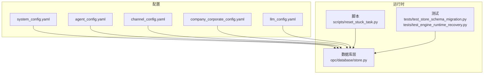
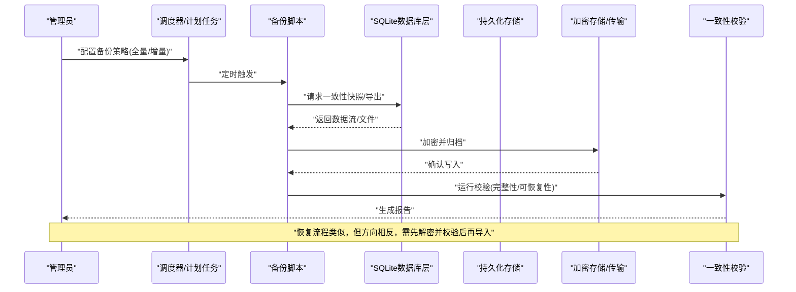
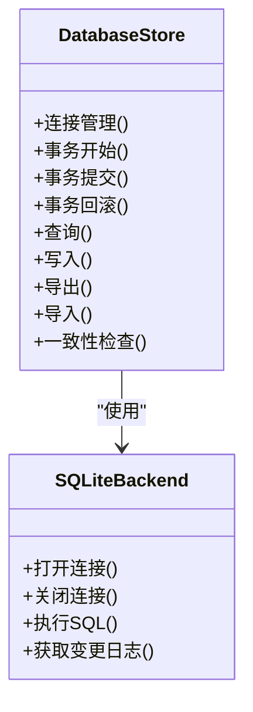
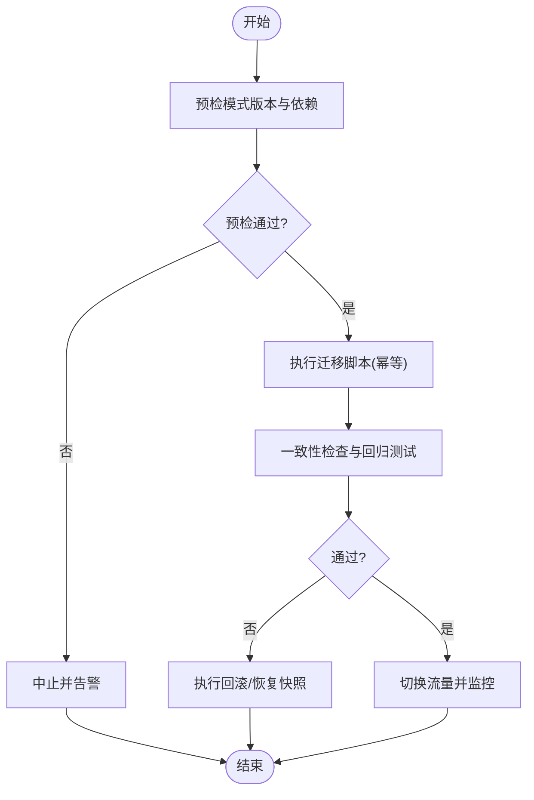
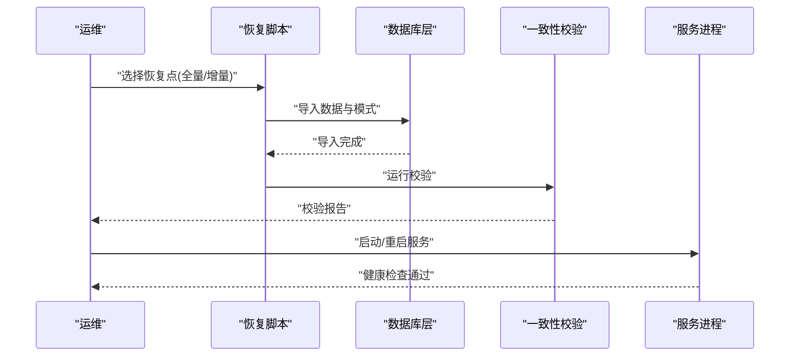
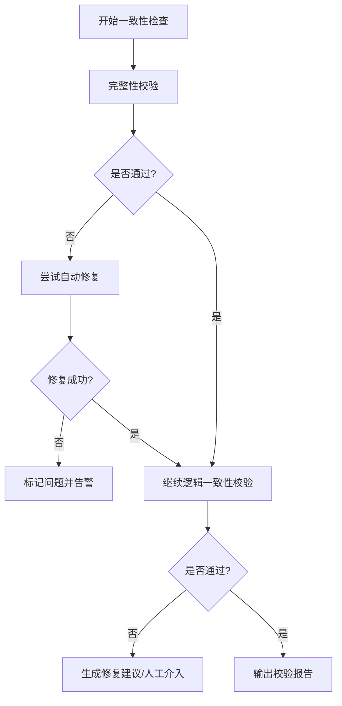
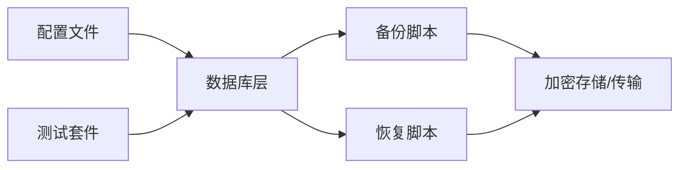

# 备份与恢复

<cite>
**本文引用的文件**   
- [opc/database/store.py](file://opc/database/store.py)
- [config/system_config.yaml](file://config/system_config.yaml)
- [config/agent_config.yaml](file://config/agent_config.yaml)
- [config/channel_config.yaml](file://config/channel_config.yaml)
- [config/company_corporate_config.yaml](file://config/company_corporate_config.yaml)
- [config/llm_config.yaml](file://config/llm_config.yaml)
- [scripts/reset_stuck_task.py](file://scripts/reset_stuck_task.py)
- [tests/test_store_schema_migration.py](file://tests/test_store_schema_migration.py)
- [tests/test_engine_runtime_recovery.py](file://tests/test_engine_runtime_recovery.py)
</cite>

## 目录
1. [简介](#简介)
2. [项目结构](#项目结构)
3. [核心组件](#核心组件)
4. [架构总览](#架构总览)
5. [详细组件分析](#详细组件分析)
6. [依赖关系分析](#依赖关系分析)
7. [性能考虑](#性能考虑)
8. [故障排查指南](#故障排查指南)
9. [结论](#结论)
10. [附录](#附录)

## 简介
本指南面向OpenOPC的运维与数据管理员，提供基于SQLite的数据备份、灾难恢复、配置版本管理、数据迁移与升级、一致性检查与修复、加密存储与传输、以及不同恢复场景的操作手册。目标是确保业务连续性与数据安全，覆盖单点故障恢复与完全重建等关键场景。

## 项目结构
OpenOPC将持久化数据通过数据库层进行统一访问，配置文件集中于config目录，脚本与测试用于辅助运维与验证。

图表来源
- [opc/database/store.py](file://opc/database/store.py)
- [config/system_config.yaml](file://config/system_config.yaml)
- [config/agent_config.yaml](file://config/agent_config.yaml)
- [config/channel_config.yaml](file://config/channel_config.yaml)
- [config/company_corporate_config.yaml](file://config/company_corporate_config.yaml)
- [config/llm_config.yaml](file://config/llm_config.yaml)
- [scripts/reset_stuck_task.py](file://scripts/reset_stuck_task.py)
- [tests/test_store_schema_migration.py](file://tests/test_store_schema_migration.py)
- [tests/test_engine_runtime_recovery.py](file://tests/test_engine_runtime_recovery.py)

章节来源
- [opc/database/store.py](file://opc/database/store.py)
- [config/system_config.yaml](file://config/system_config.yaml)
- [config/agent_config.yaml](file://config/agent_config.yaml)
- [config/channel_config.yaml](file://config/channel_config.yaml)
- [config/company_corporate_config.yaml](file://config/company_corporate_config.yaml)
- [config/llm_config.yaml](file://config/llm_config.yaml)
- [scripts/reset_stuck_task.py](file://scripts/reset_stuck_task.py)
- [tests/test_store_schema_migration.py](file://tests/test_store_schema_migration.py)
- [tests/test_engine_runtime_recovery.py](file://tests/test_engine_runtime_recovery.py)

## 核心组件
- 数据库层：负责SQLite连接、事务、模式与数据访问。备份与恢复应围绕该层的读写路径设计，确保在一致状态下执行快照或导出。
- 配置中心：集中存放系统、代理、通道、公司与LLM相关配置。建议纳入版本控制并配合变更审计。
- 运维脚本：提供任务重置等辅助能力，可用于恢复流程中的状态清理与再平衡。
- 测试套件：包含模式迁移与引擎恢复相关的用例，可作为恢复策略与兼容性验证的参考。

章节来源
- [opc/database/store.py](file://opc/database/store.py)
- [config/system_config.yaml](file://config/system_config.yaml)
- [config/agent_config.yaml](file://config/agent_config.yaml)
- [config/channel_config.yaml](file://config/channel_config.yaml)
- [config/company_corporate_config.yaml](file://config/company_corporate_config.yaml)
- [config/llm_config.yaml](file://config/llm_config.yaml)
- [scripts/reset_stuck_task.py](file://scripts/reset_stuck_task.py)
- [tests/test_store_schema_migration.py](file://tests/test_store_schema_migration.py)
- [tests/test_engine_runtime_recovery.py](file://tests/test_engine_runtime_recovery.py)

## 架构总览
下图展示备份与恢复的关键参与方与交互顺序：从触发备份到落盘、校验、归档，再到恢复时的导入与一致性验证。

图表来源
- [opc/database/store.py](file://opc/database/store.py)
- [tests/test_store_schema_migration.py](file://tests/test_store_schema_migration.py)
- [tests/test_engine_runtime_recovery.py](file://tests/test_engine_runtime_recovery.py)

## 详细组件分析

### 数据库层与备份接口
- 职责：封装SQLite连接、事务边界、模式管理与数据访问；为备份与恢复提供一致的读取入口。
- 备份要点：
  - 全量备份：在事务或一致性快照下导出完整数据库内容。
  - 增量备份：记录自上次备份以来的变更（如WAL日志或变更事件），结合时间戳实现差异归档。
- 恢复要点：
  - 冷恢复：停止服务后替换数据库文件，启动后执行模式迁移与一致性检查。
  - 热恢复：在低负载窗口内执行在线导入，确保事务隔离与锁竞争最小化。

图表来源
- [opc/database/store.py](file://opc/database/store.py)

章节来源
- [opc/database/store.py](file://opc/database/store.py)

### 配置文件的版本管理与备份方案
- 版本管理：
  - 将config目录下所有YAML纳入Git版本控制，启用分支策略与合并评审。
  - 对敏感字段采用外部密钥管理或环境变量注入，避免明文入库。
- 备份策略：
  - 全量备份：每日一次，保留N天滚动窗口。
  - 增量备份：按小时或事件驱动，仅归档变更文件与元数据。
- 恢复步骤：
  - 从版本库检出目标版本配置。
  - 校验配置语法与依赖项。
  - 应用至运行环境并重启相关服务。

章节来源
- [config/system_config.yaml](file://config/system_config.yaml)
- [config/agent_config.yaml](file://config/agent_config.yaml)
- [config/channel_config.yaml](file://config/channel_config.yaml)
- [config/company_corporate_config.yaml](file://config/company_corporate_config.yaml)
- [config/llm_config.yaml](file://config/llm_config.yaml)

### 数据迁移与升级流程
- 迁移原则：
  - 向后兼容：新模型与旧数据共存过渡期。
  - 幂等执行：迁移脚本可重复运行不产生副作用。
  - 回滚预案：提供反向迁移或快照回退。
- 流程：
  - 预检：检查当前模式版本与依赖。
  - 执行：按序运行迁移脚本，记录变更日志。
  - 验证：运行一致性检查与回归测试。
  - 发布：切换流量并监控异常。

图表来源
- [tests/test_store_schema_migration.py](file://tests/test_store_schema_migration.py)

章节来源
- [tests/test_store_schema_migration.py](file://tests/test_store_schema_migration.py)

### 灾难恢复步骤与验证方法
- 单点故障恢复：
  - 识别故障节点与受影响范围。
  - 从最近的全量/增量备份恢复数据库与配置。
  - 执行一致性检查与必要的数据修复。
  - 逐步恢复服务并观察指标。
- 完全重建：
  - 准备干净环境并安装依赖。
  - 恢复最新可用备份与配置。
  - 运行迁移与初始化任务。
  - 端到端验证与回归测试。

图表来源
- [tests/test_engine_runtime_recovery.py](file://tests/test_engine_runtime_recovery.py)

章节来源
- [tests/test_engine_runtime_recovery.py](file://tests/test_engine_runtime_recovery.py)

### 增量备份与全量备份的配置策略
- 全量备份：
  - 频率：每日一次，建议在低峰时段执行。
  - 保留策略：滚动保留N份，超过阈值自动清理。
- 增量备份：
  - 触发：基于时间或变更事件。
  - 内容：仅记录新增/修改数据与索引变更。
  - 合并：定期合并增量以优化恢复效率。
- 组合策略：
  - 每周一次全量+每日增量，满足RPO/RTO要求。
  - 关键业务可缩短周期或启用实时复制。

章节来源
- [opc/database/store.py](file://opc/database/store.py)

### 数据一致性检查与修复工具
- 检查项：
  - 完整性：主外键约束、唯一性、非空约束。
  - 逻辑一致性：跨表关联、计数校验、统计摘要。
  - 可恢复性：导入导出往返测试。
- 修复手段：
  - 自动修复：根据规则重建索引、修正孤立记录。
  - 人工干预：针对复杂冲突进行决策与补偿。
  - 回退：无法修复时回退至上一快照。

图表来源
- [opc/database/store.py](file://opc/database/store.py)

章节来源
- [opc/database/store.py](file://opc/database/store.py)

### 备份数据的加密存储与传输方案
- 静态加密：
  - 对备份文件使用强对称算法加密，密钥由外部密钥管理服务托管。
  - 文件级签名与完整性校验（哈希）防止篡改。
- 传输加密：
  - 使用TLS/HTTPS或SFTP进行远程传输。
  - 证书轮换与吊销列表维护。
- 密钥管理：
  - 最小权限原则与分权审批。
  - 定期轮换与审计追踪。

章节来源
- [opc/database/store.py](file://opc/database/store.py)

### 不同恢复场景操作手册
- 单点故障恢复：
  - 快速定位故障源，隔离影响面。
  - 从最近备份恢复数据库与配置。
  - 执行一致性检查与必要修复。
  - 逐步恢复服务并监控关键指标。
- 完全重建：
  - 准备环境与依赖，拉取最新代码与配置。
  - 恢复最新可用备份，执行迁移与初始化。
  - 运行端到端验证与回归测试。
  - 灰度上线并持续观测。

章节来源
- [scripts/reset_stuck_task.py](file://scripts/reset_stuck_task.py)
- [tests/test_engine_runtime_recovery.py](file://tests/test_engine_runtime_recovery.py)

## 依赖关系分析
- 组件耦合：
  - 数据库层与配置中心存在弱耦合，通过配置加载器注入参数。
  - 备份与恢复脚本依赖数据库层提供的导出/导入接口。
- 外部依赖：
  - SQLite作为底层存储，关注WAL模式与并发限制。
  - 加密与传输依赖操作系统与网络栈安全能力。
- 潜在风险：
  - 循环依赖应避免，保持单一职责。
  - 外部依赖升级需评估兼容性并进行回归测试。

图表来源
- [opc/database/store.py](file://opc/database/store.py)
- [config/system_config.yaml](file://config/system_config.yaml)
- [config/agent_config.yaml](file://config/agent_config.yaml)
- [config/channel_config.yaml](file://config/channel_config.yaml)
- [config/company_corporate_config.yaml](file://config/company_corporate_config.yaml)
- [config/llm_config.yaml](file://config/llm_config.yaml)
- [tests/test_store_schema_migration.py](file://tests/test_store_schema_migration.py)
- [tests/test_engine_runtime_recovery.py](file://tests/test_engine_runtime_recovery.py)

章节来源
- [opc/database/store.py](file://opc/database/store.py)
- [config/system_config.yaml](file://config/system_config.yaml)
- [config/agent_config.yaml](file://config/agent_config.yaml)
- [config/channel_config.yaml](file://config/channel_config.yaml)
- [config/company_corporate_config.yaml](file://config/company_corporate_config.yaml)
- [config/llm_config.yaml](file://config/llm_config.yaml)
- [tests/test_store_schema_migration.py](file://tests/test_store_schema_migration.py)
- [tests/test_engine_runtime_recovery.py](file://tests/test_engine_runtime_recovery.py)

## 性能考虑
- 备份窗口：
  - 选择低峰时段执行全量备份，减少锁竞争。
  - 增量备份尽量异步化，避免阻塞主流程。
- 存储I/O：
  - 使用独立磁盘或SSD提升吞吐。
  - 压缩与并行写入提高带宽利用率。
- 恢复速度：
  - 预分配空间与禁用索引加速导入。
  - 分批提交事务降低内存占用。
- 监控与告警：
  - 跟踪备份时长、失败率与恢复耗时。
  - 设置阈值告警与自动重试机制。

## 故障排查指南
- 常见问题：
  - 备份失败：检查磁盘空间、权限与加密密钥可用性。
  - 恢复失败：核对模式版本与迁移历史，确认一致性检查结果。
  - 数据不一致：定位冲突记录，使用修复工具或回退快照。
- 诊断步骤：
  - 查看备份与恢复日志，定位错误堆栈。
  - 运行一致性检查与回归测试，复现问题。
  - 必要时启用调试模式并收集上下文信息。

章节来源
- [scripts/reset_stuck_task.py](file://scripts/reset_stuck_task.py)
- [tests/test_engine_runtime_recovery.py](file://tests/test_engine_runtime_recovery.py)

## 结论
通过规范化的备份策略、严格的配置版本管理、完善的迁移与恢复流程、以及一致性与加密保障，OpenOPC可在多种故障场景下实现快速恢复与业务连续性。建议结合监控与演练持续提升可靠性与韧性。

## 附录
- 术语：
  - RPO：恢复点目标，允许丢失的数据时间窗口。
  - RTO：恢复时间目标，从故障到恢复服务的最大时长。
- 最佳实践：
  - 定期演练恢复流程，验证RPO/RTO达标。
  - 对关键数据进行多副本与异地容灾。
  - 建立变更审计与回滚预案。