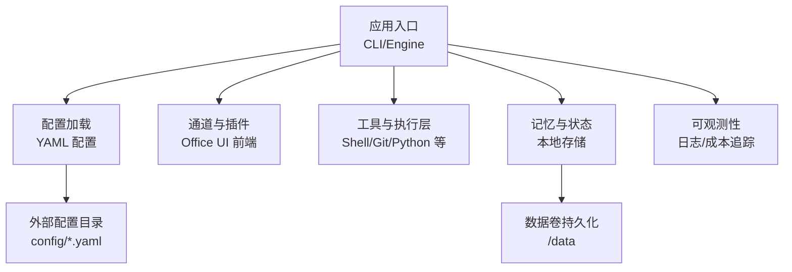
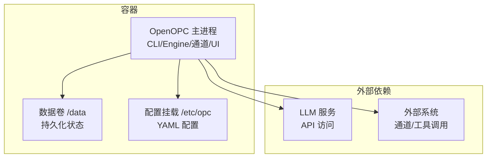
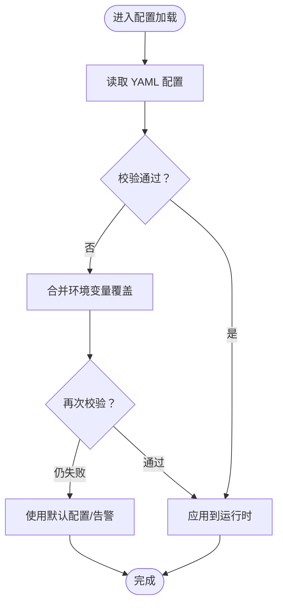
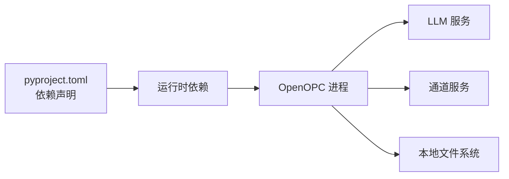

# Docker部署

<cite>
**本文引用的文件**   
- [README.md](file://README.md)
- [README.zh-CN.md](file://README.zh-CN.md)
- [pyproject.toml](file://pyproject.toml)
- [opc/cli/app.py](file://opc/cli/app.py)
- [opc/engine.py](file://opc/engine.py)
- [opc/core/config.py](file://opc/core/config.py)
- [config/agent_config.yaml](file://config/agent_config.yaml)
- [config/channel_config.yaml](file://config/channel_config.yaml)
- [config/company_corporate_config.yaml](file://config/company_corporate_config.yaml)
- [config/llm_config.yaml](file://config/llm_config.yaml)
- [config/system_config.yaml](file://config/system_config.yaml)
- [.github/workflows/external-agent-smoke.yml](file://.github/workflows/external-agent-smoke.yml)
</cite>

## 目录
1. [简介](#简介)
2. [项目结构](#项目结构)
3. [核心组件](#核心组件)
4. [架构总览](#架构总览)
5. [详细组件分析](#详细组件分析)
6. [依赖分析](#依赖分析)
7. [性能考虑](#性能考虑)
8. [故障排除指南](#故障排除指南)
9. [结论](#结论)
10. [附录](#附录)

## 简介
本指南面向希望在容器环境中部署 OpenOPC 的团队与个人，提供从镜像构建、编排到生产运维的完整实践。内容涵盖：
- Dockerfile 编写规范（多阶段构建、基础镜像选择、安全加固）
- Docker Compose 编排（服务依赖、环境变量、数据卷持久化、网络）
- 资源限制（CPU、内存）配置方法
- 生产最佳实践（镜像安全扫描、日志收集、监控集成）
- 常见问题排查与性能优化建议
- 可移植性与可重复性保障

OpenOPC 是一个基于 Python 的应用，包含 CLI 入口、引擎与多层运行时模块，并通过 YAML 配置文件进行行为控制。容器化时应以“只读镜像 + 外部配置/数据”的方式运行，确保环境一致与可重复。

## 项目结构
仓库采用按功能分层组织：
- 应用代码位于 opc/ 下，包含 CLI、引擎、通道、工具、记忆、可观测性等模块
- 配置集中在 config/ 下的多个 YAML 文件
- 前端静态资源位于 opc/plugins/office_ui/frontend_dist/
- 测试与脚本分别位于 tests/ 和 scripts/
- 工作流定义在 .github/workflows/

图表来源
- [opc/cli/app.py:1-200](file://opc/cli/app.py#L1-L200)
- [opc/engine.py:1-200](file://opc/engine.py#L1-L200)
- [opc/core/config.py:1-200](file://opc/core/config.py#L1-L200)
- [config/agent_config.yaml:1-200](file://config/agent_config.yaml#L1-L200)
- [config/channel_config.yaml:1-200](file://config/channel_config.yaml#L1-L200)
- [config/company_corporate_config.yaml:1-200](file://config/company_corporate_config.yaml#L1-L200)
- [config/llm_config.yaml:1-200](file://config/llm_config.yaml#L1-L200)
- [config/system_config.yaml:1-200](file://config/system_config.yaml#L1-L200)

章节来源
- [README.md:1-200](file://README.md#L1-L200)
- [README.zh-CN.md:1-200](file://README.zh-CN.md#L1-L200)
- [pyproject.toml:1-200](file://pyproject.toml#L1-L200)

## 核心组件
- 应用入口与启动流程
  - CLI 入口负责解析参数并启动应用；引擎负责初始化上下文、加载配置、注册通道与工具、启动运行时。
- 配置系统
  - 通过 YAML 文件集中管理代理、通道、公司模式、LLM 与系统级设置；容器内应挂载外部目录或注入环境变量覆盖敏感项。
- 通道与插件
  - 支持多种消息通道与 Office UI 前端；前端静态资源随镜像分发，运行时由后端服务提供。
- 工具与执行层
  - 提供 Shell、Git、Python 执行、浏览器、协作等能力；在生产中需严格限制权限与资源。
- 记忆与状态
  - 使用本地存储保存会话与工作项状态；容器化时需持久化到数据卷。
- 可观测性
  - 输出结构化日志与成本追踪指标，便于接入外部日志与监控系统。

章节来源
- [opc/cli/app.py:1-200](file://opc/cli/app.py#L1-L200)
- [opc/engine.py:1-200](file://opc/engine.py#L1-L200)
- [opc/core/config.py:1-200](file://opc/core/config.py#L1-L200)
- [config/agent_config.yaml:1-200](file://config/agent_config.yaml#L1-L200)
- [config/channel_config.yaml:1-200](file://config/channel_config.yaml#L1-L200)
- [config/company_corporate_config.yaml:1-200](file://config/company_corporate_config.yaml#L1-L200)
- [config/llm_config.yaml:1-200](file://config/llm_config.yaml#L1-L200)
- [config/system_config.yaml:1-200](file://config/system_config.yaml#L1-L200)

## 架构总览
下图展示容器化后的典型部署形态：一个 OpenOPC 主进程承载 CLI/Engine、通道与 Office UI，配合外部 LLM 服务与持久化存储。

图表来源
- [opc/cli/app.py:1-200](file://opc/cli/app.py#L1-L200)
- [opc/engine.py:1-200](file://opc/engine.py#L1-L200)
- [config/agent_config.yaml:1-200](file://config/agent_config.yaml#L1-L200)
- [config/llm_config.yaml:1-200](file://config/llm_config.yaml#L1-L200)

## 详细组件分析

### 容器镜像构建（Dockerfile 规范）
- 多阶段构建
  - 构建阶段：安装构建期依赖、编译前端资源（如有）、生成产物
  - 运行阶段：仅复制必要产物与最小运行时依赖，减小镜像体积
- 基础镜像选择
  - 优先选择官方精简镜像（如 python:slim），减少攻击面
  - 固定基础镜像版本标签，避免漂移
- 安全加固
  - 非 root 用户运行容器
  - 最小权限原则：仅开放必要端口与文件系统写入路径
  - 禁用不必要的系统包与工具
  - 定期更新基础镜像与依赖
- 可重复性
  - 锁定依赖版本（pyproject 与 pip 缓存策略）
  - 使用只读根文件系统，仅挂载必要目录为可写

章节来源
- [pyproject.toml:1-200](file://pyproject.toml#L1-L200)
- [opc/plugins/office_ui/frontend_dist/index.html:1-200](file://opc/plugins/office_ui/frontend_dist/index.html#L1-L200)

### 服务编排（Docker Compose）
- 服务依赖关系
  - OpenOPC 服务依赖外部 LLM API 与可选的外部系统（通道）
- 环境变量管理
  - 将敏感信息（密钥、令牌）通过环境变量注入，避免硬编码
  - 使用 .env 文件或外部密钥管理服务
- 数据卷持久化
  - 将 /data 映射到宿主机目录，保证会话与工作项状态不丢失
- 网络配置
  - 默认桥接网络即可满足大多数场景；如需隔离，可使用自定义网络
- 健康检查与重启策略
  - 配置健康检查探针与自动重启策略，提升可用性

章节来源
- [config/agent_config.yaml:1-200](file://config/agent_config.yaml#L1-L200)
- [config/channel_config.yaml:1-200](file://config/channel_config.yaml#L1-L200)
- [config/llm_config.yaml:1-200](file://config/llm_config.yaml#L1-L200)
- [config/system_config.yaml:1-200](file://config/system_config.yaml#L1-L200)

### 资源限制（CPU、内存）
- CPU 限制
  - 使用 --cpus 或 compose 的 cpus 字段限制可用 CPU 核数
- 内存限制
  - 使用 --memory 或 compose 的 mem_limit 字段限制最大内存
- 交换与 OOM
  - 生产环境建议关闭交换，启用 OOM Killer 保护宿主
- 动态扩缩容
  - 结合编排平台（Kubernetes/Docker Swarm）实现水平扩展

章节来源
- [opc/engine.py:1-200](file://opc/engine.py#L1-L200)

### 生产最佳实践
- 镜像安全扫描
  - 在 CI 中集成 Trivy/Grype 等扫描器，阻断高危漏洞镜像
- 日志收集
  - 统一输出 JSON 格式日志，接入 Loki/ELK
- 监控集成
  - 暴露指标端点或使用 SDK 上报至 Prometheus/Grafana
- 配置与密钥
  - 使用外部配置中心或密钥管理服务（Vault/KMS）
- 备份与恢复
  - 定期快照 /data 目录，制定恢复演练计划

章节来源
- [opc/layer6_observability/cost_tracker.py:1-200](file://opc/layer6_observability/cost_tracker.py#L1-L200)
- [opc/layer6_observability/opc_logger.py:1-200](file://opc/layer6_observability/opc_logger.py#L1-L200)

### 常见错误与修复流程（示例）
以下流程图展示了典型的“配置加载失败”处理路径，适用于容器化部署中的配置校验与回退逻辑。

图表来源
- [opc/core/config.py:1-200](file://opc/core/config.py#L1-200)
- [config/agent_config.yaml:1-200](file://config/agent_config.yaml#L1-200)
- [config/channel_config.yaml:1-200](file://config/channel_config.yaml#L1-200)
- [config/llm_config.yaml:1-200](file://config/llm_config.yaml#L1-200)
- [config/system_config.yaml:1-200](file://config/system_config.yaml#L1-L200)

章节来源
- [opc/core/config.py:1-200](file://opc/core/config.py#L1-200)

## 依赖分析
OpenOPC 的运行时依赖主要包括：
- Python 解释器与标准库
- 第三方库（由 pyproject 声明）
- 外部 LLM 服务与通道服务
- 本地文件系统（用于持久化）

图表来源
- [pyproject.toml:1-200](file://pyproject.toml#L1-L200)
- [opc/engine.py:1-200](file://opc/engine.py#L1-L200)

章节来源
- [pyproject.toml:1-200](file://pyproject.toml#L1-L200)
- [opc/engine.py:1-200](file://opc/engine.py#L1-L200)

## 性能考虑
- 镜像体积
  - 使用多阶段构建与 slim 基础镜像，减少镜像大小与拉取时间
- 启动速度
  - 预编译依赖、懒加载模块、按需初始化重型组件
- I/O 优化
  - 将频繁读写路径置于高性能存储（SSD/NVMe）
  - 合理设置日志轮转与压缩
- 并发与线程
  - 根据任务类型调整线程/进程池大小，避免阻塞
- 外部依赖
  - 对 LLM 调用增加重试与超时控制，降低抖动影响

[本节为通用指导，无需特定文件引用]

## 故障排除指南
- 启动失败
  - 检查端口占用与防火墙规则
  - 验证配置文件语法与必填字段
  - 查看容器日志定位异常堆栈
- 配置未生效
  - 确认环境变量覆盖优先级与挂载路径正确
  - 核对配置键名与默认值
- 数据丢失
  - 检查数据卷挂载是否成功
  - 确认容器退出时是否触发持久化
- 外部依赖不可用
  - 校验网络连通性与凭据
  - 检查 LLM 服务限流与配额

章节来源
- [opc/cli/app.py:1-200](file://opc/cli/app.py#L1-L200)
- [opc/engine.py:1-200](file://opc/engine.py#L1-L200)
- [config/system_config.yaml:1-200](file://config/system_config.yaml#L1-L200)

## 结论
通过规范的 Dockerfile 与 Compose 编排，结合资源限制、安全加固与可观测性建设，OpenOPC 可在生产环境中稳定运行。遵循“只读镜像 + 外部配置/数据”的原则，可显著提升可移植性与可重复性。建议在 CI/CD 中集成镜像扫描与健康检查，持续改进质量与可靠性。

[本节为总结性内容，无需特定文件引用]

## 附录
- 参考工作流
  - GitHub Actions 示例可用于自动化测试与发布流程，可作为容器化流水线的基础模板

章节来源
- [.github/workflows/external-agent-smoke.yml:1-200](file://.github/workflows/external-agent-smoke.yml#L1-L200)