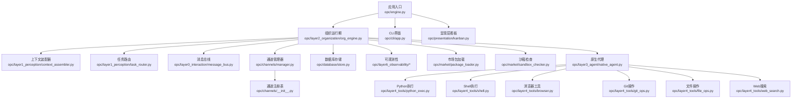
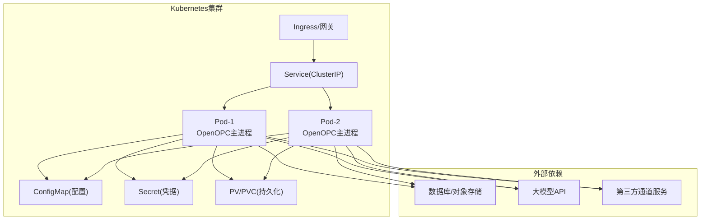
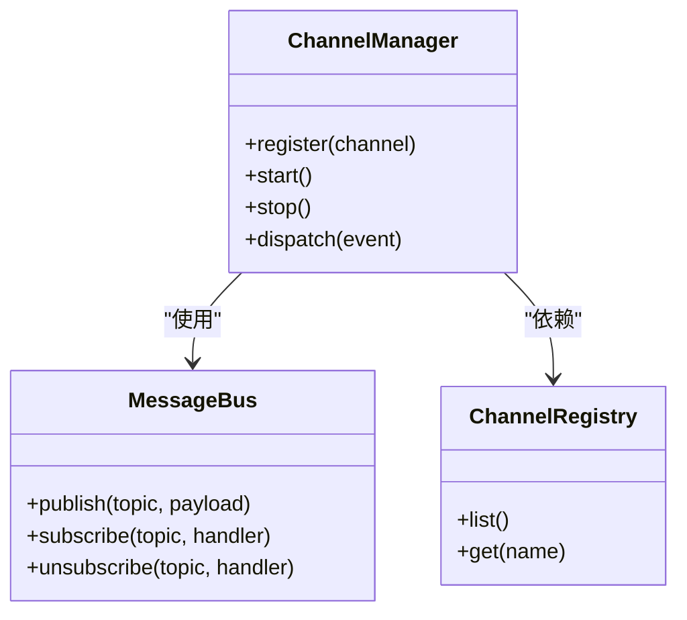
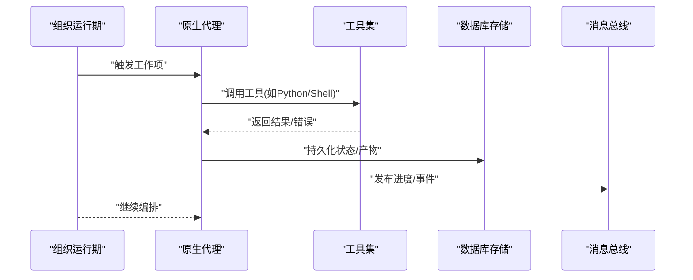
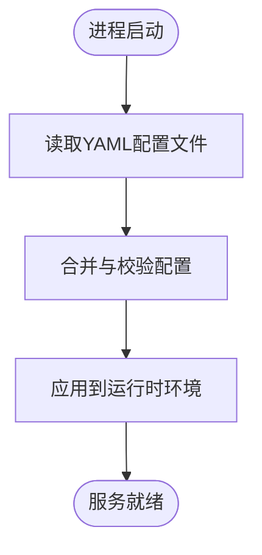
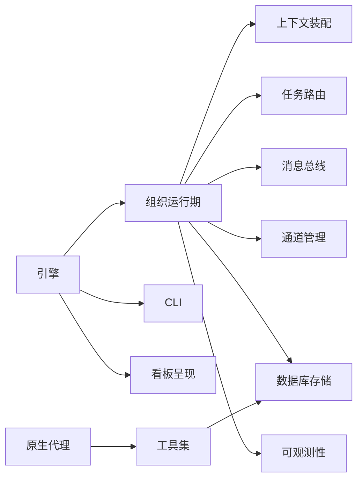

# Kubernetes部署

<cite>
**本文引用的文件**   
- [README.md](file://README.md)
- [README.zh-CN.md](file://README.zh-CN.md)
- [pyproject.toml](file://pyproject.toml)
- [opc/engine.py](file://opc/engine.py)
- [opc/cli/app.py](file://opc/cli/app.py)
- [opc/presentation/kanban.py](file://opc/presentation/kanban.py)
- [opc/channels/__init__.py](file://opc/channels/__init__.py)
- [opc/channels/manager.py](file://opc/channels/manager.py)
- [opc/core/config.py](file://opc/core/config.py)
- [config/system_config.yaml](file://config/system_config.yaml)
- [config/agent_config.yaml](file://config/agent_config.yaml)
- [config/channel_config.yaml](file://config/channel_config.yaml)
- [config/llm_config.yaml](file://config/llm_config.yaml)
- [config/company_corporate_config.yaml](file://config/company_corporate_config.yaml)
- [opc/database/store.py](file://opc/database/store.py)
- [opc/layer6_observability/opc_logger.py](file://opc/layer6_observability/opc_logger.py)
- [opc/layer6_observability/cost_tracker.py](file://opc/layer6_observability/cost_tracker.py)
- [opc/market/package_loader.py](file://opc/market/package_loader.py)
- [opc/market/sandbox_checker.py](file://opc/market/sandbox_checker.py)
- [opc/layer3_agent/native_agent.py](file://opc/layer3_agent/native_agent.py)
- [opc/layer4_tools/python_exec.py](file://opc/layer4_tools/python_exec.py)
- [opc/layer4_tools/shell.py](file://opc/layer4_tools/shell.py)
- [opc/layer4_tools/browser.py](file://opc/layer4_tools/browser.py)
- [opc/layer4_tools/git_ops.py](file://opc/layer4_tools/git_ops.py)
- [opc/layer4_tools/file_ops.py](file://opc/layer4_tools/file_ops.py)
- [opc/layer4_tools/web_search.py](file://opc/layer4_tools/web_search.py)
- [opc/layer2_organization/org_engine.py](file://opc/layer2_organization/org_engine.py)
- [opc/layer2_organization/gate_harness.py](file://opc/layer2_organization/gate_harness.py)
- [opc/layer2_organization/heartbeat.py](file://opc/layer2_organization/heartbeat.py)
- [opc/layer1_perception/context_assembler.py](file://opc/layer1_perception/context_assembler.py)
- [opc/layer1_perception/task_router.py](file://opc/layer1_perception/task_router.py)
- [opc/layer0_interaction/message_bus.py](file://opc/layer0_interaction/message_bus.py)
</cite>

## 目录
1. [简介](#简介)
2. [项目结构](#项目结构)
3. [核心组件](#核心组件)
4. [架构总览](#架构总览)
5. [详细组件分析](#详细组件分析)
6. [依赖分析](#依赖分析)
7. [性能考虑](#性能考虑)
8. [故障排查指南](#故障排查指南)
9. [结论](#结论)
10. [附录](#附录)

## 简介
本指南面向在Kubernetes上生产化部署OpenOPC的工程团队，提供从基础清单到Helm Chart、从水平扩展到高可用架构的完整落地方案。内容覆盖：
- K8s资源清单：Deployment、Service、ConfigMap、Secret、PersistentVolume等
- Helm Chart打包与模板、值文件管理
- 集群调度策略、水平扩展与服务发现
- 高可用设计：负载均衡、健康检查、自动扩缩容
- 滚动更新、版本管理与回滚
- 监控告警、日志收集与安全策略
- 多云平台适配要点

## 项目结构
OpenOPC采用分层架构与插件化通道机制，核心入口由引擎与CLI组成，配置通过YAML加载，运行时具备可观测性与工具执行能力。

图示来源
- [opc/engine.py](file://opc/engine.py)
- [opc/layer2_organization/org_engine.py](file://opc/layer2_organization/org_engine.py)
- [opc/layer1_perception/context_assembler.py](file://opc/layer1_perception/context_assembler.py)
- [opc/layer1_perception/task_router.py](file://opc/layer1_perception/task_router.py)
- [opc/layer0_interaction/message_bus.py](file://opc/layer0_interaction/message_bus.py)
- [opc/channels/manager.py](file://opc/channels/manager.py)
- [opc/channels/__init__.py](file://opc/channels/__init__.py)
- [opc/database/store.py](file://opc/database/store.py)
- [opc/layer6_observability/opc_logger.py](file://opc/layer6_observability/opc_logger.py)
- [opc/layer6_observability/cost_tracker.py](file://opc/layer6_observability/cost_tracker.py)
- [opc/market/package_loader.py](file://opc/market/package_loader.py)
- [opc/market/sandbox_checker.py](file://opc/market/sandbox_checker.py)
- [opc/layer3_agent/native_agent.py](file://opc/layer3_agent/native_agent.py)
- [opc/layer4_tools/python_exec.py](file://opc/layer4_tools/python_exec.py)
- [opc/layer4_tools/shell.py](file://opc/layer4_tools/shell.py)
- [opc/layer4_tools/browser.py](file://opc/layer4_tools/browser.py)
- [opc/layer4_tools/git_ops.py](file://opc/layer4_tools/git_ops.py)
- [opc/layer4_tools/file_ops.py](file://opc/layer4_tools/file_ops.py)
- [opc/layer4_tools/web_search.py](file://opc/layer4_tools/web_search.py)

章节来源
- [README.md](file://README.md)
- [README.zh-CN.md](file://README.zh-CN.md)
- [pyproject.toml](file://pyproject.toml)
- [opc/engine.py](file://opc/engine.py)
- [opc/cli/app.py](file://opc/cli/app.py)
- [opc/presentation/kanban.py](file://opc/presentation/kanban.py)
- [opc/channels/__init__.py](file://opc/channels/__init__.py)
- [opc/channels/manager.py](file://opc/channels/manager.py)
- [opc/core/config.py](file://opc/core/config.py)
- [config/system_config.yaml](file://config/system_config.yaml)
- [config/agent_config.yaml](file://config/agent_config.yaml)
- [config/channel_config.yaml](file://config/channel_config.yaml)
- [config/llm_config.yaml](file://config/llm_config.yaml)
- [config/company_corporate_config.yaml](file://config/company_corporate_config.yaml)

## 核心组件
- 应用入口与生命周期
  - 引擎负责初始化组织运行期、加载配置、启动通道与工具栈，并对外暴露必要的交互接口。
  - CLI用于本地调试与交互式看板展示。
- 配置系统
  - 通过YAML集中管理系统、代理、通道与大模型相关配置；运行时由配置模块统一读取与校验。
- 通道与消息总线
  - 通道管理器负责通道注册、生命周期与事件分发；底层通过消息总线进行解耦通信。
- 可观测性
  - 内置日志与成本追踪，便于接入外部监控系统。
- 数据持久化
  - 数据库存储抽象位于独立模块，便于替换后端或迁移。
- 安全与沙箱
  - 市场包加载前进行沙箱检查，限制潜在风险。

章节来源
- [opc/engine.py](file://opc/engine.py)
- [opc/cli/app.py](file://opc/cli/app.py)
- [opc/core/config.py](file://opc/core/config.py)
- [config/system_config.yaml](file://config/system_config.yaml)
- [config/agent_config.yaml](file://config/agent_config.yaml)
- [config/channel_config.yaml](file://config/channel_config.yaml)
- [config/llm_config.yaml](file://config/llm_config.yaml)
- [config/company_corporate_config.yaml](file://config/company_corporate_config.yaml)
- [opc/channels/manager.py](file://opc/channels/manager.py)
- [opc/channels/__init__.py](file://opc/channels/__init__.py)
- [opc/layer0_interaction/message_bus.py](file://opc/layer0_interaction/message_bus.py)
- [opc/database/store.py](file://opc/database/store.py)
- [opc/layer6_observability/opc_logger.py](file://opc/layer6_observability/opc_logger.py)
- [opc/layer6_observability/cost_tracker.py](file://opc/layer6_observability/cost_tracker.py)
- [opc/market/package_loader.py](file://opc/market/package_loader.py)
- [opc/market/sandbox_checker.py](file://opc/market/sandbox_checker.py)

## 架构总览
下图展示了OpenOPC在Kubernetes中的典型部署形态：Ingress/LoadBalancer作为入口，Service将流量分发至多个Pod副本，每个Pod包含OpenOPC主进程及可选侧车（如日志采集）。配置与密钥通过ConfigMap与Secret注入，持久卷挂载给需要落盘的工具或会话数据。

图示来源
- [opc/engine.py](file://opc/engine.py)
- [opc/channels/manager.py](file://opc/channels/manager.py)
- [opc/database/store.py](file://opc/database/store.py)
- [config/llm_config.yaml](file://config/llm_config.yaml)
- [config/channel_config.yaml](file://config/channel_config.yaml)

## 详细组件分析

### 组件A：通道与消息总线
通道管理器负责通道实例的创建、启停与事件路由；消息总线提供异步解耦的事件交换。该组件对可扩展性与可靠性至关重要。

图示来源
- [opc/channels/manager.py](file://opc/channels/manager.py)
- [opc/channels/__init__.py](file://opc/channels/__init__.py)
- [opc/layer0_interaction/message_bus.py](file://opc/layer0_interaction/message_bus.py)

章节来源
- [opc/channels/manager.py](file://opc/channels/manager.py)
- [opc/channels/__init__.py](file://opc/channels/__init__.py)
- [opc/layer0_interaction/message_bus.py](file://opc/layer0_interaction/message_bus.py)

### 组件B：原生代理与工具执行
原生代理协调上层业务逻辑与底层工具执行，包括Python执行、Shell命令、浏览器自动化、Git与文件系统操作、Web搜索等。这些工具在K8s中需严格权限控制与资源隔离。

图示来源
- [opc/layer3_agent/native_agent.py](file://opc/layer3_agent/native_agent.py)
- [opc/layer4_tools/python_exec.py](file://opc/layer4_tools/python_exec.py)
- [opc/layer4_tools/shell.py](file://opc/layer4_tools/shell.py)
- [opc/layer4_tools/browser.py](file://opc/layer4_tools/browser.py)
- [opc/layer4_tools/git_ops.py](file://opc/layer4_tools/git_ops.py)
- [opc/layer4_tools/file_ops.py](file://opc/layer4_tools/file_ops.py)
- [opc/layer4_tools/web_search.py](file://opc/layer4_tools/web_search.py)
- [opc/database/store.py](file://opc/database/store.py)
- [opc/layer0_interaction/message_bus.py](file://opc/layer0_interaction/message_bus.py)

章节来源
- [opc/layer3_agent/native_agent.py](file://opc/layer3_agent/native_agent.py)
- [opc/layer4_tools/python_exec.py](file://opc/layer4_tools/python_exec.py)
- [opc/layer4_tools/shell.py](file://opc/layer4_tools/shell.py)
- [opc/layer4_tools/browser.py](file://opc/layer4_tools/browser.py)
- [opc/layer4_tools/git_ops.py](file://opc/layer4_tools/git_ops.py)
- [opc/layer4_tools/file_ops.py](file://opc/layer4_tools/file_ops.py)
- [opc/layer4_tools/web_search.py](file://opc/layer4_tools/web_search.py)
- [opc/database/store.py](file://opc/database/store.py)
- [opc/layer0_interaction/message_bus.py](file://opc/layer0_interaction/message_bus.py)

### 组件C：配置加载流程
配置加载涉及系统、代理、通道与大模型等多类YAML文件，运行时由配置模块统一解析与合并。

图示来源
- [opc/core/config.py](file://opc/core/config.py)
- [config/system_config.yaml](file://config/system_config.yaml)
- [config/agent_config.yaml](file://config/agent_config.yaml)
- [config/channel_config.yaml](file://config/channel_config.yaml)
- [config/llm_config.yaml](file://config/llm_config.yaml)
- [config/company_corporate_config.yaml](file://config/company_corporate_config.yaml)

章节来源
- [opc/core/config.py](file://opc/core/config.py)
- [config/system_config.yaml](file://config/system_config.yaml)
- [config/agent_config.yaml](file://config/agent_config.yaml)
- [config/channel_config.yaml](file://config/channel_config.yaml)
- [config/llm_config.yaml](file://config/llm_config.yaml)
- [config/company_corporate_config.yaml](file://config/company_corporate_config.yaml)

## 依赖分析
OpenOPC的依赖关系体现为“入口-组织-感知-交互-通道-工具-存储-可观测性”的分层耦合。关键依赖如下：
- 入口依赖组织运行期与CLI/呈现层
- 组织运行期依赖上下文装配、任务路由、消息总线与通道管理
- 原生代理依赖各类工具与数据库存储
- 可观测性贯穿各层，提供日志与成本追踪
- 市场包加载与沙箱检查保障安全性

图示来源
- [opc/engine.py](file://opc/engine.py)
- [opc/layer2_organization/org_engine.py](file://opc/layer2_organization/org_engine.py)
- [opc/layer1_perception/context_assembler.py](file://opc/layer1_perception/context_assembler.py)
- [opc/layer1_perception/task_router.py](file://opc/layer1_perception/task_router.py)
- [opc/layer0_interaction/message_bus.py](file://opc/layer0_interaction/message_bus.py)
- [opc/channels/manager.py](file://opc/channels/manager.py)
- [opc/database/store.py](file://opc/database/store.py)
- [opc/layer6_observability/opc_logger.py](file://opc/layer6_observability/opc_logger.py)
- [opc/layer6_observability/cost_tracker.py](file://opc/layer6_observability/cost_tracker.py)
- [opc/layer3_agent/native_agent.py](file://opc/layer3_agent/native_agent.py)

章节来源
- [opc/engine.py](file://opc/engine.py)
- [opc/layer2_organization/org_engine.py](file://opc/layer2_organization/org_engine.py)
- [opc/layer1_perception/context_assembler.py](file://opc/layer1_perception/context_assembler.py)
- [opc/layer1_perception/task_router.py](file://opc/layer1_perception/task_router.py)
- [opc/layer0_interaction/message_bus.py](file://opc/layer0_interaction/message_bus.py)
- [opc/channels/manager.py](file://opc/channels/manager.py)
- [opc/database/store.py](file://opc/database/store.py)
- [opc/layer6_observability/opc_logger.py](file://opc/layer6_observability/opc_logger.py)
- [opc/layer6_observability/cost_tracker.py](file://opc/layer6_observability/cost_tracker.py)
- [opc/layer3_agent/native_agent.py](file://opc/layer3_agent/native_agent.py)

## 性能考虑
- 水平扩展
  - 基于CPU/内存或自定义指标（如队列长度、任务延迟）进行HPA扩容。
  - 针对长耗时任务，建议引入队列与Worker模式，避免单Pod阻塞。
- 资源配额与限制
  - 为容器设置requests与limits，确保节点资源公平分配。
  - 对工具执行（Python/Shell/浏览器）设置更严格的CPU/内存上限与超时。
- 缓存与连接复用
  - 对LLM与外部通道建立连接池，减少握手开销。
- 持久化I/O
  - 使用高性能存储类（SSD），合理划分PVC大小与IOPS。
- 背压与限流
  - 在消息总线与通道层实现速率限制与重试退避。

[本节为通用指导，不直接分析具体文件]

## 故障排查指南
- 启动失败
  - 检查配置是否缺失或格式错误；确认Secret与ConfigMap已正确挂载。
  - 查看容器日志与K8s事件定位原因。
- 通道连接异常
  - 验证通道凭据与网络可达性；关注通道管理器日志与心跳状态。
- 工具执行失败
  - 检查权限、环境变量与资源限制；确认沙箱检查未误拦截。
- 数据不一致
  - 核对数据库连接与事务；检查持久卷挂载路径与写入权限。
- 性能退化
  - 观察HPA行为与资源利用率；分析慢查询与外部依赖延迟。

章节来源
- [opc/layer6_observability/opc_logger.py](file://opc/layer6_observability/opc_logger.py)
- [opc/layer6_observability/cost_tracker.py](file://opc/layer6_observability/cost_tracker.py)
- [opc/channels/manager.py](file://opc/channels/manager.py)
- [opc/market/sandbox_checker.py](file://opc/market/sandbox_checker.py)
- [opc/database/store.py](file://opc/database/store.py)

## 结论
通过在Kubernetes中采用合理的资源编排、水平扩展与健康检查策略，结合完善的配置管理、安全沙箱与可观测性体系，OpenOPC可在生产环境中稳定运行并具备良好的弹性与可维护性。建议在灰度与回滚流程中强化版本治理与变更审计，持续优化性能与成本。

[本节为总结性内容，不直接分析具体文件]

## 附录

### A. K8s清单编写要点
- Deployment
  - 定义容器镜像、副本数、资源请求与限制、探针（存活/就绪）、环境变量与卷挂载。
  - 使用滚动更新策略与最大不可用/最大激增参数保证可用性。
- Service
  - 选择ClusterIP类型，按标签选择器匹配Pod；如需外部访问，配合Ingress或LoadBalancer。
- ConfigMap
  - 将YAML配置以键值形式注入，支持热更新场景（需应用支持）。
- Secret
  - 存放敏感信息（如通道凭据、数据库密码），以环境变量或文件形式挂载。
- PersistentVolume/PersistentVolumeClaim
  - 为需要持久化的数据（如会话、产物）提供存储；选择合适的StorageClass与容量。

[本节为通用指导，不直接分析具体文件]

### B. Helm Chart打包结构与模板
- 目录结构
  - Chart.yaml：元数据与版本
  - values.yaml：默认值与环境差异值
  - templates/：K8s资源模板（Deployment、Service、ConfigMap、Secret、HPA、Ingress等）
  - charts/：子Chart（可选）
- 模板编写
  - 使用Go模板语法，结合values.yaml动态生成资源。
  - 条件渲染与循环迭代适用于多通道或多环境配置。
- 值文件管理
  - 拆分dev/staging/prod值文件，继承默认值并覆盖差异项。
  - 使用helm diff与dry-run验证变更影响。

[本节为通用指导，不直接分析具体文件]

### C. 集群资源调度策略
- 亲和性与反亲和性
  - 将不同副本分散到不同节点或可用区，提升容错性。
- 污点与容忍
  - 为特殊节点打污点，仅允许特定Pod调度。
- 拓扑分布约束
  - 使用topologySpreadConstraints均衡负载。
- 资源预留与抢占
  - 为关键任务预留资源，必要时启用抢占。

[本节为通用指导，不直接分析具体文件]

### D. 水平扩展配置与服务发现
- HPA
  - 基于CPU/内存或自定义指标（如队列长度、任务延迟）自动扩缩容。
- 服务发现
  - 通过Service与DNS在集群内发现后端；外部访问通过Ingress或Gateway。
- 会话粘性与无状态设计
  - 尽量保持应用无状态，会话与状态外置到数据库或缓存。

[本节为通用指导，不直接分析具体文件]

### E. 高可用架构设计
- 多副本与多可用区
  - 跨AZ部署，避免单点故障。
- 负载均衡
  - 使用Ingress/Gateway进行七层负载均衡与健康检查。
- 健康检查
  - 配置存活探针与就绪探针，确保流量只进入健康Pod。
- 自动扩缩容
  - 结合HPA与垂直扩缩容（VPA）优化资源利用。

[本节为通用指导，不直接分析具体文件]

### F. 滚动更新、版本管理与回滚
- 滚动更新
  - 设置maxUnavailable与maxSurge，逐步替换旧Pod。
- 版本管理
  - 使用镜像标签与Chart版本号，记录变更说明。
- 回滚方案
  - 使用kubectl rollout undo或helm rollback快速恢复。

[本节为通用指导，不直接分析具体文件]

### G. 监控告警与日志收集
- 监控
  - 采集容器指标与应用指标（如任务成功率、延迟、成本）。
- 告警
  - 基于Prometheus+Alertmanager或云厂商监控平台配置阈值与通知。
- 日志
  - 使用Sidecar或DaemonSet收集标准输出与文件日志，集中到ELK/Loki。

[本节为通用指导，不直接分析具体文件]

### H. 安全策略
- 最小权限
  - 使用RBAC限制访问；容器以非root用户运行。
- 网络策略
  - 限制Pod间与外部访问，仅开放必要端口。
- 镜像安全
  - 扫描镜像漏洞，签名与白名单校验。
- 沙箱与隔离
  - 对工具执行进行沙箱检查与资源隔离，防止越权。

[本节为通用指导，不直接分析具体文件]

### I. 多云平台适配指南
- 存储
  - 根据云厂商提供StorageClass与快照功能调整PVC配置。
- 网络
  - 使用云厂商Ingress/Gateway控制器，配置域名与证书。
- 监控与日志
  - 对接云监控与日志服务，简化运维。
- 认证与密钥
  - 使用云厂商密钥管理服务（如AWS Secrets Manager、Azure Key Vault）。

[本节为通用指导，不直接分析具体文件]