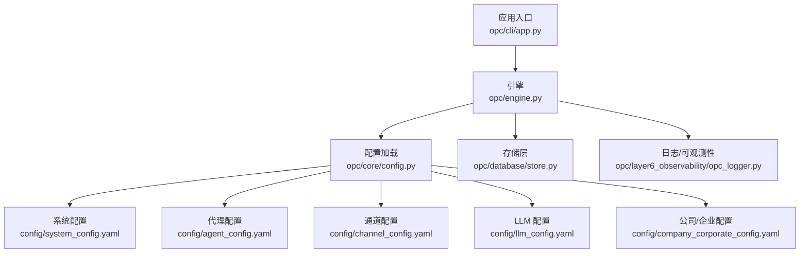
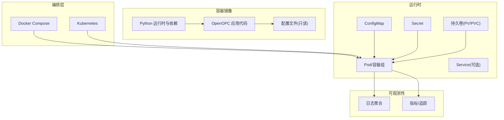
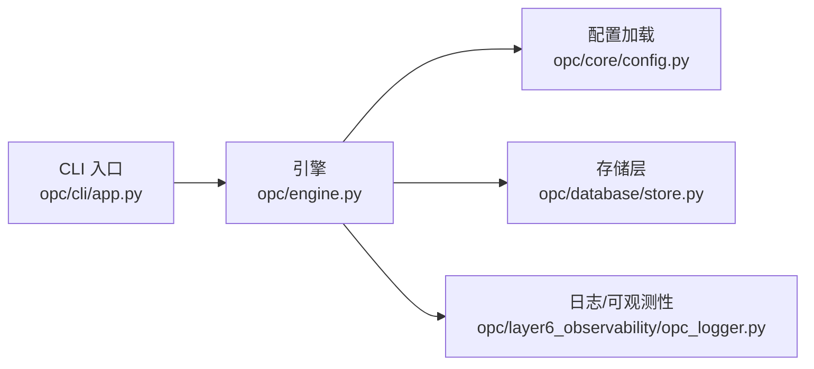

# 容器化部署

<cite>
**本文引用的文件**   
- [README.md](file://README.md)
- [pyproject.toml](file://pyproject.toml)
- [opc/engine.py](file://opc/engine.py)
- [opc/cli/app.py](file://opc/cli/app.py)
- [opc/core/config.py](file://opc/core/config.py)
- [opc/database/store.py](file://opc/database/store.py)
- [opc/layer6_observability/opc_logger.py](file://opc/layer6_observability/opc_logger.py)
- [config/system_config.yaml](file://config/system_config.yaml)
- [config/agent_config.yaml](file://config/agent_config.yaml)
- [config/channel_config.yaml](file://config/channel_config.yaml)
- [config/llm_config.yaml](file://config/llm_config.yaml)
- [config/company_corporate_config.yaml](file://config/company_corporate_config.yaml)
</cite>

## 目录
1. [简介](#简介)
2. [项目结构](#项目结构)
3. [核心组件](#核心组件)
4. [架构总览](#架构总览)
5. [详细组件分析](#详细组件分析)
6. [依赖分析](#依赖分析)
7. [性能考虑](#性能考虑)
8. [故障排查指南](#故障排查指南)
9. [结论](#结论)
10. [附录](#附录)

## 简介
本指南面向将 OpenOPC 应用容器化的工程团队，提供从镜像构建、编排到可观测性与发布运维的全链路实践。内容覆盖：
- Docker 多阶段构建与镜像优化、安全扫描
- Docker Compose 服务编排（依赖、网络、数据持久化）
- Kubernetes Deployment、Service、ConfigMap、Secret 清单编写
- Helm Chart 打包与发布流程
- 资源限制与调度策略
- 监控与日志收集方案
- 滚动更新与回滚策略
- 可扩展性与可维护性设计

## 项目结构
OpenOPC 为 Python 应用，入口位于 opc 包内，配置集中于 config 目录，运行时通过 CLI 或引擎启动。关键路径：
- 应用入口与引擎：opc/engine.py、opc/cli/app.py
- 配置加载：opc/core/config.py
- 数据存储：opc/database/store.py
- 日志与可观测性：opc/layer6_observability/opc_logger.py
- 外部配置：config/*.yaml

图表来源
- [opc/cli/app.py](file://opc/cli/app.py)
- [opc/engine.py](file://opc/engine.py)
- [opc/core/config.py](file://opc/core/config.py)
- [opc/database/store.py](file://opc/database/store.py)
- [opc/layer6_observability/opc_logger.py](file://opc/layer6_observability/opc_logger.py)
- [config/system_config.yaml](file://config/system_config.yaml)
- [config/agent_config.yaml](file://config/agent_config.yaml)
- [config/channel_config.yaml](file://config/channel_config.yaml)
- [config/llm_config.yaml](file://config/llm_config.yaml)
- [config/company_corporate_config.yaml](file://config/company_corporate_config.yaml)

章节来源
- [README.md](file://README.md)
- [pyproject.toml](file://pyproject.toml)
- [opc/engine.py](file://opc/engine.py)
- [opc/cli/app.py](file://opc/cli/app.py)
- [opc/core/config.py](file://opc/core/config.py)
- [opc/database/store.py](file://opc/database/store.py)
- [opc/layer6_observability/opc_logger.py](file://opc/layer6_observability/opc_logger.py)
- [config/system_config.yaml](file://config/system_config.yaml)
- [config/agent_config.yaml](file://config/agent_config.yaml)
- [config/channel_config.yaml](file://config/channel_config.yaml)
- [config/llm_config.yaml](file://config/llm_config.yaml)
- [config/company_corporate_config.yaml](file://config/company_corporate_config.yaml)

## 核心组件
- 应用入口与 CLI：负责解析参数、初始化运行环境并调用引擎。
- 引擎：协调配置、任务执行、通道与工具等子系统。
- 配置中心：集中读取 YAML 配置，注入运行时。
- 存储层：持久化会话、工作项、历史等数据。
- 可观测性：结构化日志输出，便于采集与检索。

章节来源
- [opc/cli/app.py](file://opc/cli/app.py)
- [opc/engine.py](file://opc/engine.py)
- [opc/core/config.py](file://opc/core/config.py)
- [opc/database/store.py](file://opc/database/store.py)
- [opc/layer6_observability/opc_logger.py](file://opc/layer6_observability/opc_logger.py)

## 架构总览
下图展示容器化后 OpenOPC 在本地与集群中的典型部署形态：镜像由多阶段构建产出，Compose/Kubernetes 管理生命周期，配置与密钥通过 ConfigMap/Secret 注入，日志与指标汇聚至外部系统。

[此图为概念性架构图，不直接映射具体源码文件]

## 详细组件分析

### 镜像构建与优化（Docker）
- 多阶段构建
  - 构建阶段：安装编译型依赖、下载缓存、预构建前端产物（如有）。
  - 运行阶段：仅包含最小运行时与必要系统库，使用非 root 用户运行。
- 镜像优化
  - 分层利用：将依赖安装与应用代码分离，提升缓存命中率。
  - 清理无用文件：移除构建缓存、文档、测试与调试符号。
  - 选择轻量基础镜像：优先使用官方精简版 Python 镜像。
- 安全扫描
  - 集成 Trivy/Grype 等扫描器，阻断高危漏洞镜像进入制品库。
  - 定期拉取基础镜像更新，重建并验证。
- 示例参考
  - 构建脚本与依赖声明位置：[pyproject.toml](file://pyproject.toml)

章节来源
- [pyproject.toml](file://pyproject.toml)

### Docker Compose 编排
- 服务定义
  - 主服务：OpenOPC 进程，暴露必要端口（如 Web UI/WS）。
  - 依赖服务：数据库、消息总线、对象存储等（按需）。
- 网络配置
  - 自定义桥接网络隔离业务与基础设施。
  - 使用服务名进行内部 DNS 解析。
- 数据持久化
  - 使用命名卷挂载数据库与附件目录，确保重启不丢数据。
- 环境变量与配置
  - 通过 .env 或 compose env_file 注入敏感信息。
  - 将只读配置以卷方式挂载，避免修改镜像。
- 健康检查与重启策略
  - 对关键服务添加 healthcheck，配合 restart: unless-stopped。

章节来源
- [opc/engine.py](file://opc/engine.py)
- [opc/cli/app.py](file://opc/cli/app.py)
- [config/system_config.yaml](file://config/system_config.yaml)
- [config/agent_config.yaml](file://config/agent_config.yaml)
- [config/channel_config.yaml](file://config/channel_config.yaml)
- [config/llm_config.yaml](file://config/llm_config.yaml)
- [config/company_corporate_config.yaml](file://config/company_corporate_config.yaml)

### Kubernetes 部署清单
- Deployment
  - replicas：按负载水平设置副本数。
  - resources：明确 requests/limits，保障调度与稳定性。
  - liveness/readiness：基于 HTTP/TCP 探针实现自愈与流量控制。
  - strategy：采用 RollingUpdate，设置 maxUnavailable/maxSurge。
- Service
  - ClusterIP/NodePort/LoadBalancer 根据访问面选择。
  - 端口映射与协议（TCP/UDP）与容器端口一致。
- ConfigMap
  - 将只读配置（system_config.yaml、agent_config.yaml、channel_config.yaml、llm_config.yaml、company_corporate_config.yaml）挂载为卷或环境变量。
- Secret
  - 敏感信息（API Key、数据库密码、证书）以 Secret 形式注入。
- 持久化
  - 使用 PVC 挂载数据库与附件目录，保证状态持久。
- 调度与亲和性
  - nodeSelector/tolerations 用于节点选择。
  - affinity/anti-affinity 控制副本分布与可用性。
- 扩缩容
  - HPA 基于 CPU/内存或自定义指标自动扩缩容。

章节来源
- [opc/core/config.py](file://opc/core/config.py)
- [config/system_config.yaml](file://config/system_config.yaml)
- [config/agent_config.yaml](file://config/agent_config.yaml)
- [config/channel_config.yaml](file://config/channel_config.yaml)
- [config/llm_config.yaml](file://config/llm_config.yaml)
- [config/company_corporate_config.yaml](file://config/company_corporate_config.yaml)

### Helm Chart 打包与发布
- Chart 结构
  - values.yaml：默认值与环境差异。
  - templates/*：Kubernetes 模板（Deployment、Service、ConfigMap、Secret、PVC 等）。
  - Chart.yaml：版本与元数据。
- 变量与模板
  - 使用 values 驱动配置，区分 dev/staging/prod。
  - 将敏感字段放入 Secret，配置放入 ConfigMap。
- 打包与发布
  - helm package 生成归档，helm push 推送至仓库（OCI/Helm Hub/私有仓库）。
  - 使用 helm upgrade --install 进行升级与回滚。
- 最佳实践
  - 版本语义化；变更日志；Chart 签名与校验。

章节来源
- [config/system_config.yaml](file://config/system_config.yaml)
- [config/agent_config.yaml](file://config/agent_config.yaml)
- [config/channel_config.yaml](file://config/channel_config.yaml)
- [config/llm_config.yaml](file://config/llm_config.yaml)
- [config/company_corporate_config.yaml](file://config/company_corporate_config.yaml)

### 资源限制与调度策略
- 资源限制
  - requests：保证调度的最低资源。
  - limits：防止资源争用与 OOM。
- 调度策略
  - 节点亲和/反亲和：跨可用区/机架分散。
  - 污点与容忍：专用节点承载高负载实例。
- 弹性伸缩
  - HPA 基于 CPU/内存或业务指标（队列长度、延迟）自动扩缩容。
  - VPA 辅助调整 requests/limits。

章节来源
- [opc/engine.py](file://opc/engine.py)

### 监控与日志收集
- 日志
  - 应用输出结构化 JSON 日志，统一 stdout/stderr。
  - 侧车或 DaemonSet 采集（Fluent Bit/Filebeat），转发至 ELK/Loki。
- 指标与追踪
  - 暴露 Prometheus 指标端点（如适用）。
  - 接入分布式追踪（OpenTelemetry/Jaeger）。
- 告警
  - 基于指标阈值与错误率配置 Alertmanager 规则。

章节来源
- [opc/layer6_observability/opc_logger.py](file://opc/layer6_observability/opc_logger.py)

### 滚动更新与回滚策略
- 滚动更新
  - 使用 RollingUpdate 策略，逐步替换旧 Pod。
  - 就绪探针确保新实例稳定后再切流。
- 回滚
  - 失败时快速回滚到上一稳定版本。
  - 灰度发布结合 Ingress/网关权重切换。
- 配置热更新
  - 通过 ConfigMap 卷挂载，监听变更并触发优雅重启或热重载（若应用支持）。

章节来源
- [opc/engine.py](file://opc/engine.py)

## 依赖分析
OpenOPC 的运行时依赖关系如下：CLI 调用引擎，引擎加载配置并与存储和可观测性模块交互。

图表来源
- [opc/cli/app.py](file://opc/cli/app.py)
- [opc/engine.py](file://opc/engine.py)
- [opc/core/config.py](file://opc/core/config.py)
- [opc/database/store.py](file://opc/database/store.py)
- [opc/layer6_observability/opc_logger.py](file://opc/layer6_observability/opc_logger.py)

章节来源
- [opc/cli/app.py](file://opc/cli/app.py)
- [opc/engine.py](file://opc/engine.py)
- [opc/core/config.py](file://opc/core/config.py)
- [opc/database/store.py](file://opc/database/store.py)
- [opc/layer6_observability/opc_logger.py](file://opc/layer6_observability/opc_logger.py)

## 性能考虑
- 镜像体积与启动时间
  - 多阶段构建、精简基础镜像、禁用非必要依赖。
- 资源配额
  - 合理设置 requests/limits，避免过度预留或不足。
- 连接池与并发
  - 针对数据库/外部 API 的连接池大小与超时进行调优。
- 存储 I/O
  - 使用高性能卷类型，避免频繁小文件写入。
- 水平扩展
  - 无状态化设计，结合 HPA 实现弹性扩容。

[本节为通用指导，不直接分析具体文件]

## 故障排查指南
- 启动失败
  - 检查环境变量与 Secret 是否注入正确。
  - 查看容器日志定位异常堆栈。
- 配置问题
  - 确认 ConfigMap 已挂载且格式正确。
  - 核对必填字段与取值范围。
- 存储问题
  - 检查 PVC 绑定状态与权限。
  - 验证数据库连通性与认证。
- 健康检查失败
  - 调整探针超时与间隔。
  - 关注依赖服务可用性。
- 性能退化
  - 观察 CPU/内存使用与 GC 行为。
  - 检查外部依赖延迟与错误率。

章节来源
- [opc/core/config.py](file://opc/core/config.py)
- [opc/database/store.py](file://opc/database/store.py)
- [opc/layer6_observability/opc_logger.py](file://opc/layer6_observability/opc_logger.py)

## 结论
通过多阶段构建与安全扫描，结合 Compose/Kubernetes 的标准化编排，OpenOPC 可在本地与生产环境中获得一致的部署体验。借助 ConfigMap/Secret、持久卷与探针机制，可实现安全、稳定、可观测与可演进的容器化部署。Helm 进一步提升了版本管理与发布效率，配合 HPA/VPA 与滚动更新/回滚策略，满足高可用与持续交付要求。

## 附录
- 配置清单建议
  - system_config.yaml：系统级开关、日志级别、端口等。
  - agent_config.yaml：代理能力、工具集、沙箱策略。
  - channel_config.yaml：各通道接入参数。
  - llm_config.yaml：模型提供商、鉴权与限流。
  - company_corporate_config.yaml：组织与企业模式相关配置。
- 安全基线
  - 非 root 运行、最小权限、镜像签名与校验、定期漏洞扫描。
- 可观测性基线
  - 结构化日志、标准指标、分布式追踪、统一告警。

章节来源
- [config/system_config.yaml](file://config/system_config.yaml)
- [config/agent_config.yaml](file://config/agent_config.yaml)
- [config/channel_config.yaml](file://config/channel_config.yaml)
- [config/llm_config.yaml](file://config/llm_config.yaml)
- [config/company_corporate_config.yaml](file://config/company_corporate_config.yaml)