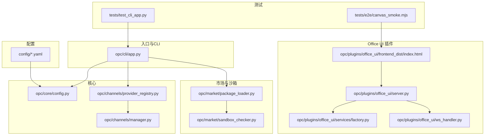
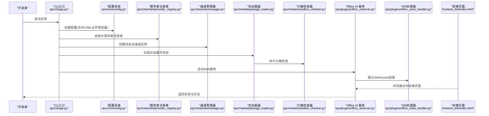
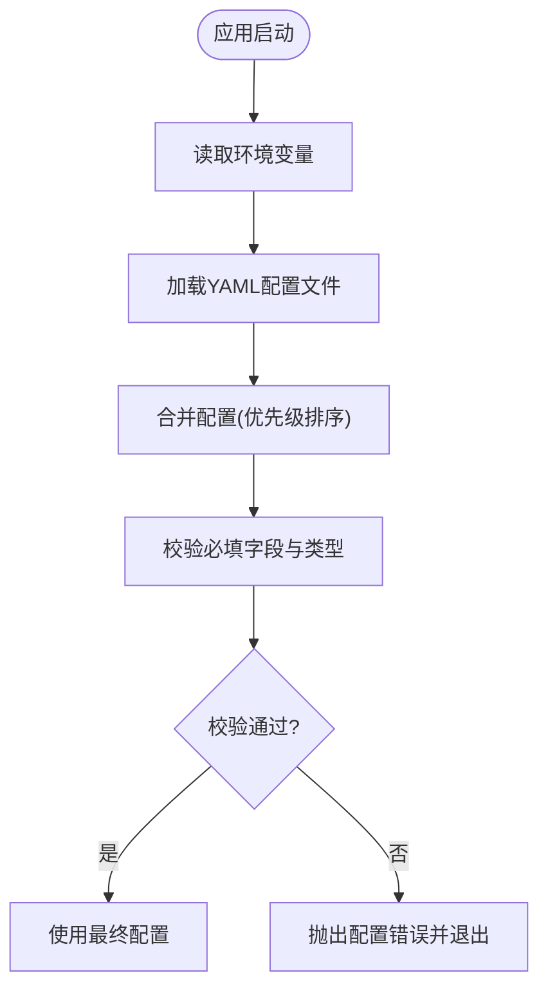
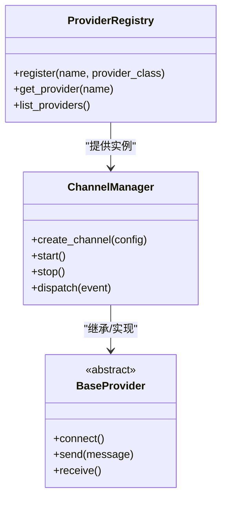
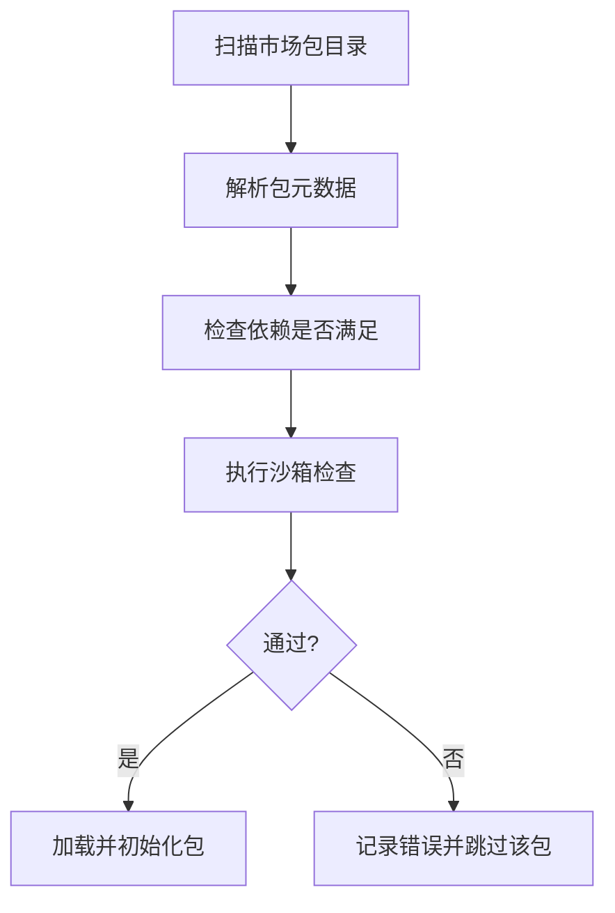
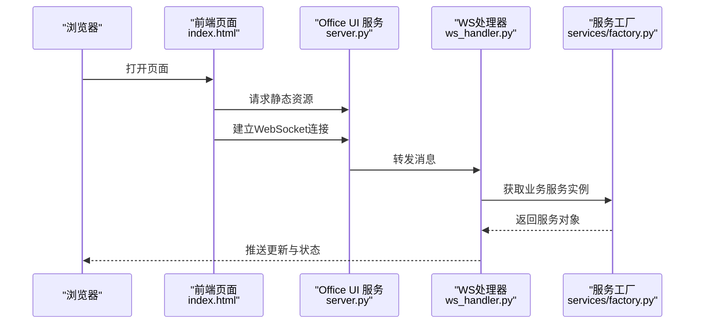
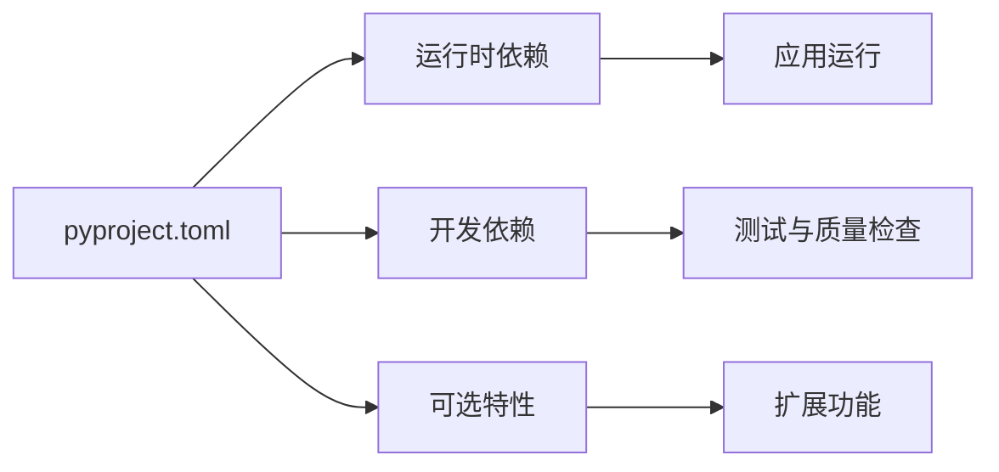

# 开发环境搭建

<cite>
**本文引用的文件**   
- [pyproject.toml](file://pyproject.toml)
- [README.md](file://README.md)
- [README.zh-CN.md](file://README.zh-CN.md)
- [config/agent_config.yaml](file://config/agent_config.yaml)
- [config/channel_config.yaml](file://config/channel_config.yaml)
- [config/company_corporate_config.yaml](file://config/company_corporate_config.yaml)
- [config/llm_config.yaml](file://config/llm_config.yaml)
- [config/system_config.yaml](file://config/system_config.yaml)
- [opc/cli/app.py](file://opc/cli/app.py)
- [opc/core/config.py](file://opc/core/config.py)
- [opc/channels/provider_registry.py](file://opc/channels/provider_registry.py)
- [opc/channels/manager.py](file://opc/channels/manager.py)
- [opc/market/package_loader.py](file://opc/market/package_loader.py)
- [opc/market/sandbox_checker.py](file://opc/market/sandbox_checker.py)
- [opc/plugins/office_ui/server.py](file://opc/plugins/office_ui/server.py)
- [opc/plugins/office_ui/services/factory.py](file://opc/plugins/office_ui/services/factory.py)
- [opc/plugins/office_ui/ws_handler.py](file://opc/plugins/office_ui/ws_handler.py)
- [opc/plugins/office_ui/frontend_dist/index.html](file://opc/plugins/office_ui/frontend_dist/index.html)
- [tests/test_cli_app.py](file://tests/test_cli_app.py)
- [tests/e2e/canvas_smoke.mjs](file://tests/e2e/canvas_smoke.mjs)
</cite>

## 目录
1. [简介](#简介)
2. [项目结构](#项目结构)
3. [核心组件](#核心组件)
4. [架构总览](#架构总览)
5. [详细组件分析](#详细组件分析)
6. [依赖分析](#依赖分析)
7. [性能考虑](#性能考虑)
8. [故障排查指南](#故障排查指南)
9. [结论](#结论)
10. [附录](#附录)

## 简介
本指南面向希望在本地快速搭建 OpenOPC 开发环境的开发者，覆盖 Python 版本与依赖管理工具（pip、poetry、conda）配置、项目克隆与虚拟环境创建、依赖安装、IDE 与调试器推荐设置、代码格式化规则、环境变量与配置文件模板、测试套件与代码质量检查执行方式，以及常见环境问题排查。目标是让开发者在最短时间获得可运行的开发环境并高效开展二次开发与集成工作。

## 项目结构
OpenOPC 采用分层模块化组织：
- 入口与 CLI：命令行应用位于 opc/cli/app.py，负责解析参数与启动服务或子命令。
- 核心配置：opc/core/config.py 提供配置加载与校验逻辑；运行时通过 provider_registry.py 和 manager.py 动态注册与调度通道提供者。
- 市场与沙箱：opc/market 下包含包加载与沙箱检查等能力，用于扩展与隔离。
- Office UI 插件：opc/plugins/office_ui 提供 Web 前端资源与后端服务，包括 WebSocket 处理与服务工厂。
- 配置目录：config 下提供多份 YAML 示例配置，便于按场景启用不同功能。
- 测试：tests 下包含单元测试与 e2e 脚本，支持 CLI 行为与前端交互验证。

图表来源
- [opc/cli/app.py](file://opc/cli/app.py)
- [opc/core/config.py](file://opc/core/config.py)
- [opc/channels/provider_registry.py](file://opc/channels/provider_registry.py)
- [opc/channels/manager.py](file://opc/channels/manager.py)
- [opc/market/package_loader.py](file://opc/market/package_loader.py)
- [opc/market/sandbox_checker.py](file://opc/market/sandbox_checker.py)
- [opc/plugins/office_ui/server.py](file://opc/plugins/office_ui/server.py)
- [opc/plugins/office_ui/ws_handler.py](file://opc/plugins/office_ui/ws_handler.py)
- [opc/plugins/office_ui/frontend_dist/index.html](file://opc/plugins/office_ui/frontend_dist/index.html)
- [config/agent_config.yaml](file://config/agent_config.yaml)
- [config/channel_config.yaml](file://config/channel_config.yaml)
- [config/company_corporate_config.yaml](file://config/company_corporate_config.yaml)
- [config/llm_config.yaml](file://config/llm_config.yaml)
- [config/system_config.yaml](file://config/system_config.yaml)
- [tests/test_cli_app.py](file://tests/test_cli_app.py)
- [tests/e2e/canvas_smoke.mjs](file://tests/e2e/canvas_smoke.mjs)

章节来源
- [pyproject.toml](file://pyproject.toml)
- [README.md](file://README.md)
- [README.zh-CN.md](file://README.zh-CN.md)

## 核心组件
- 配置系统：核心配置由 opc/core/config.py 统一加载与校验，配合 config 目录下的 YAML 文件进行组合式配置。
- 通道提供者注册：opc/channels/provider_registry.py 维护提供者注册表，opc/channels/manager.py 负责实例化与生命周期管理。
- 市场与沙箱：opc/market/package_loader.py 负责外部包发现与加载，opc/market/sandbox_checker.py 对运行环境进行安全与兼容性检查。
- Office UI 插件：server.py 提供 HTTP/WebSocket 服务，ws_handler.py 处理消息路由，services/factory.py 构造业务服务实例，frontend_dist/index.html 为前端入口。
- CLI 入口：opc/cli/app.py 作为命令行入口，解析参数并调用上层模块。

章节来源
- [opc/core/config.py](file://opc/core/config.py)
- [opc/channels/provider_registry.py](file://opc/channels/provider_registry.py)
- [opc/channels/manager.py](file://opc/channels/manager.py)
- [opc/market/package_loader.py](file://opc/market/package_loader.py)
- [opc/market/sandbox_checker.py](file://opc/market/sandbox_checker.py)
- [opc/plugins/office_ui/server.py](file://opc/plugins/office_ui/server.py)
- [opc/plugins/office_ui/ws_handler.py](file://opc/plugins/office_ui/ws_handler.py)
- [opc/plugins/office_ui/services/factory.py](file://opc/plugins/office_ui/services/factory.py)
- [opc/plugins/office_ui/frontend_dist/index.html](file://opc/plugins/office_ui/frontend_dist/index.html)
- [opc/cli/app.py](file://opc/cli/app.py)

## 架构总览
下图展示了从 CLI 到核心配置、通道注册、市场加载与 Office UI 服务的整体交互关系。

图表来源
- [opc/cli/app.py](file://opc/cli/app.py)
- [opc/core/config.py](file://opc/core/config.py)
- [opc/channels/provider_registry.py](file://opc/channels/provider_registry.py)
- [opc/channels/manager.py](file://opc/channels/manager.py)
- [opc/market/package_loader.py](file://opc/market/package_loader.py)
- [opc/market/sandbox_checker.py](file://opc/market/sandbox_checker.py)
- [opc/plugins/office_ui/server.py](file://opc/plugins/office_ui/server.py)
- [opc/plugins/office_ui/ws_handler.py](file://opc/plugins/office_ui/ws_handler.py)
- [opc/plugins/office_ui/frontend_dist/index.html](file://opc/plugins/office_ui/frontend_dist/index.html)

## 详细组件分析

### 配置系统与环境变量
- 配置加载流程：CLI 启动后读取 core/config.py 中的配置加载逻辑，结合 config 目录下的 YAML 文件与环境变量完成最终配置对象构建。
- 关键要点：
  - 优先顺序通常为：默认值 < 配置文件 < 环境变量 < 运行时参数。
  - 敏感信息（如密钥、令牌）建议通过环境变量注入，避免写入仓库。
  - 各 YAML 文件职责清晰：agent_config.yaml、channel_config.yaml、company_corporate_config.yaml、llm_config.yaml、system_config.yaml。

图表来源
- [opc/core/config.py](file://opc/core/config.py)
- [config/agent_config.yaml](file://config/agent_config.yaml)
- [config/channel_config.yaml](file://config/channel_config.yaml)
- [config/company_corporate_config.yaml](file://config/company_corporate_config.yaml)
- [config/llm_config.yaml](file://config/llm_config.yaml)
- [config/system_config.yaml](file://config/system_config.yaml)

章节来源
- [opc/core/config.py](file://opc/core/config.py)
- [config/agent_config.yaml](file://config/agent_config.yaml)
- [config/channel_config.yaml](file://config/channel_config.yaml)
- [config/company_corporate_config.yaml](file://config/company_corporate_config.yaml)
- [config/llm_config.yaml](file://config/llm_config.yaml)
- [config/system_config.yaml](file://config/system_config.yaml)

### 通道提供者注册与管理
- 提供者注册表：provider_registry.py 维护通道提供者的命名空间与实例缓存。
- 通道管理器：manager.py 根据配置选择具体实现，负责创建、启停与事件分发。
- 典型流程：
  - 启动时扫描已注册的提供者。
  - 依据 channel_config.yaml 选择启用的通道。
  - 按需创建会话与连接，处理消息路由。

图表来源
- [opc/channels/provider_registry.py](file://opc/channels/provider_registry.py)
- [opc/channels/manager.py](file://opc/channels/manager.py)

章节来源
- [opc/channels/provider_registry.py](file://opc/channels/provider_registry.py)
- [opc/channels/manager.py](file://opc/channels/manager.py)

### 市场包加载与沙箱检查
- 包加载器：package_loader.py 负责发现、导入与初始化市场包。
- 沙箱检查器：sandbox_checker.py 在执行前检查运行环境与权限，确保安全性与兼容性。
- 流程要点：
  - 扫描指定目录或路径。
  - 校验包元数据与依赖。
  - 执行沙箱策略（如只读文件系统、网络限制）。

图表来源
- [opc/market/package_loader.py](file://opc/market/package_loader.py)
- [opc/market/sandbox_checker.py](file://opc/market/sandbox_checker.py)

章节来源
- [opc/market/package_loader.py](file://opc/market/package_loader.py)
- [opc/market/sandbox_checker.py](file://opc/market/sandbox_checker.py)

### Office UI 插件（Web 服务与前端）
- 服务层：server.py 提供 HTTP 与 WebSocket 接口，ws_handler.py 处理实时消息。
- 前端：frontend_dist/index.html 为静态资源入口，浏览器直接访问即可。
- 服务工厂：services/factory.py 负责构造业务服务实例，解耦依赖。

图表来源
- [opc/plugins/office_ui/server.py](file://opc/plugins/office_ui/server.py)
- [opc/plugins/office_ui/ws_handler.py](file://opc/plugins/office_ui/ws_handler.py)
- [opc/plugins/office_ui/services/factory.py](file://opc/plugins/office_ui/services/factory.py)
- [opc/plugins/office_ui/frontend_dist/index.html](file://opc/plugins/office_ui/frontend_dist/index.html)

章节来源
- [opc/plugins/office_ui/server.py](file://opc/plugins/office_ui/server.py)
- [opc/plugins/office_ui/ws_handler.py](file://opc/plugins/office_ui/ws_handler.py)
- [opc/plugins/office_ui/services/factory.py](file://opc/plugins/office_ui/services/factory.py)
- [opc/plugins/office_ui/frontend_dist/index.html](file://opc/plugins/office_ui/frontend_dist/index.html)

## 依赖分析
- 依赖声明：项目的依赖与工具链定义集中在 pyproject.toml，涵盖运行时依赖、开发依赖与可选特性。
- 版本约束：请遵循 pyproject.toml 中指定的 Python 最低版本与第三方库版本范围，以避免兼容性问题。
- 工具链：推荐使用 pip 或 poetry 进行依赖管理；若团队偏好 conda，可在 conda 环境中安装相同版本的依赖。

图表来源
- [pyproject.toml](file://pyproject.toml)

章节来源
- [pyproject.toml](file://pyproject.toml)

## 性能考虑
- 配置加载：尽量将大体积配置拆分为多个小文件并按需加载，减少启动开销。
- 通道连接：复用连接池与会话，避免频繁创建销毁带来的延迟。
- 包加载：对大型市场包进行懒加载与增量更新，降低内存占用。
- UI 服务：合理设置并发模型与线程池大小，避免阻塞 I/O 操作。

[本节为通用指导，不直接分析具体文件]

## 故障排查指南
- 配置错误：
  - 现象：启动时报错提示缺少必填字段或类型不匹配。
  - 排查：检查 config 目录下对应 YAML 文件是否完整，确认环境变量是否覆盖正确。
  - 参考：配置加载与校验逻辑位于 opc/core/config.py。
- 通道无法连接：
  - 现象：特定通道启动失败或消息未到达。
  - 排查：核对 channel_config.yaml 的通道配置，确认凭据与网络可达性；查看 provider_registry.py 与 manager.py 的日志输出。
- 市场包加载失败：
  - 现象：包未被识别或加载中断。
  - 排查：检查 package_loader.py 的扫描路径与 sandbox_checker.py 的安全策略；确认依赖是否满足。
- Office UI 无法访问：
  - 现象：浏览器无法打开页面或 WebSocket 连接失败。
  - 排查：确认 server.py 端口未被占用，ws_handler.py 是否正常监听；检查 frontend_dist/index.html 是否被正确提供。
- 测试失败：
  - 现象：CLI 或 UI 相关测试用例报错。
  - 排查：运行 tests/test_cli_app.py 定位 CLI 问题；使用 tests/e2e/canvas_smoke.mjs 验证前端交互链路。

章节来源
- [opc/core/config.py](file://opc/core/config.py)
- [opc/channels/provider_registry.py](file://opc/channels/provider_registry.py)
- [opc/channels/manager.py](file://opc/channels/manager.py)
- [opc/market/package_loader.py](file://opc/market/package_loader.py)
- [opc/market/sandbox_checker.py](file://opc/market/sandbox_checker.py)
- [opc/plugins/office_ui/server.py](file://opc/plugins/office_ui/server.py)
- [opc/plugins/office_ui/ws_handler.py](file://opc/plugins/office_ui/ws_handler.py)
- [opc/plugins/office_ui/frontend_dist/index.html](file://opc/plugins/office_ui/frontend_dist/index.html)
- [tests/test_cli_app.py](file://tests/test_cli_app.py)
- [tests/e2e/canvas_smoke.mjs](file://tests/e2e/canvas_smoke.mjs)

## 结论
通过本指南，开发者可以快速完成 OpenOPC 的开发环境搭建，理解核心组件的职责与交互，掌握配置与环境变量的使用方法，并能有效运行测试与排查常见问题。建议在团队内统一依赖管理与 IDE 配置，以提升协作效率与代码质量。

[本节为总结性内容，不直接分析具体文件]

## 附录

### Python 版本与依赖管理工具
- Python 版本要求：以 pyproject.toml 中声明为准，建议使用与其兼容的最新稳定版。
- 依赖管理工具：
  - pip：适用于简单场景，可直接安装项目依赖。
  - poetry：适合需要锁定依赖与构建发布的项目，支持虚拟环境管理。
  - conda：适合数据科学或跨平台环境，可在 conda 环境中安装相同依赖。

章节来源
- [pyproject.toml](file://pyproject.toml)

### 项目克隆与虚拟环境创建
- 克隆仓库：使用 Git 将项目克隆至本地。
- 创建虚拟环境：
  - pip：使用 venv 或 virtualenv 创建独立环境。
  - poetry：使用 poetry env 创建并激活环境。
  - conda：使用 conda create 创建新环境并激活。
- 安装依赖：
  - pip：在项目根目录执行依赖安装命令。
  - poetry：使用 poetry install 安装所有依赖。
  - conda：在环境中安装 pyproject.toml 声明的依赖。

章节来源
- [pyproject.toml](file://pyproject.toml)

### 环境变量与配置文件模板
- 环境变量：
  - 建议将敏感信息（如 API Key、数据库连接串）放入环境变量。
  - 常用变量名参考：LLM_API_KEY、CHANNEL_TOKEN、SYSTEM_PORT 等（请以实际配置项为准）。
- 配置文件模板：
  - agent_config.yaml：Agent 行为与策略配置。
  - channel_config.yaml：通道提供者与连接参数。
  - company_corporate_config.yaml：企业模式相关配置。
  - llm_config.yaml：大模型提供商与上下文窗口设置。
  - system_config.yaml：系统级参数（端口、日志级别等）。

章节来源
- [config/agent_config.yaml](file://config/agent_config.yaml)
- [config/channel_config.yaml](file://config/channel_config.yaml)
- [config/company_corporate_config.yaml](file://config/company_corporate_config.yaml)
- [config/llm_config.yaml](file://config/llm_config.yaml)
- [config/system_config.yaml](file://config/system_config.yaml)

### IDE 与调试器推荐配置
- VS Code：
  - 安装 Python 扩展与 Pylance。
  - 配置断点与调试器（Python Debugger），设置工作目录为项目根目录。
  - 开启自动格式化与 linting（基于 pyproject.toml 的工具链）。
- PyCharm：
  - 配置解释器指向虚拟环境。
  - 设置 Run/Debug Configuration，传入必要的命令行参数与环境变量。
  - 启用代码风格检查与自动重构。

[本节为通用指导，不直接分析具体文件]

### 代码格式化与质量检查
- 格式化：遵循 pyproject.toml 中定义的格式化工具（如 black、ruff 等）进行统一风格。
- 质量检查：
  - 静态分析：使用 flake8、mypy 等工具进行类型与风格检查。
  - 单元测试：运行 tests 目录下的测试用例，确保核心功能正常。
  - E2E 测试：使用 tests/e2e/canvas_smoke.mjs 验证前端交互。

章节来源
- [pyproject.toml](file://pyproject.toml)
- [tests/test_cli_app.py](file://tests/test_cli_app.py)
- [tests/e2e/canvas_smoke.mjs](file://tests/e2e/canvas_smoke.mjs)

### 运行测试套件与代码质量检查
- 单元测试：
  - 使用 pytest 或 unittest 运行 tests 目录下的测试文件。
  - 针对 CLI 行为，重点运行 tests/test_cli_app.py。
- E2E 测试：
  - 使用 Node.js 运行 tests/e2e/canvas_smoke.mjs，验证前端页面与 WebSocket 通信。
- 质量检查：
  - 执行 pyproject.toml 中定义的质量检查命令，确保代码符合规范。

章节来源
- [tests/test_cli_app.py](file://tests/test_cli_app.py)
- [tests/e2e/canvas_smoke.mjs](file://tests/e2e/canvas_smoke.mjs)
- [pyproject.toml](file://pyproject.toml)

### 常见环境问题与解决方案
- 端口冲突：
  - 现象：Office UI 服务启动失败。
  - 解决：修改 system_config.yaml 中的端口或释放占用进程。
- 证书与 SSL：
  - 现象：Windows 环境下 HTTPS 请求失败。
  - 解决：检查系统证书存储与代理设置，必要时调整 Windows SSL 配置。
- 依赖缺失：
  - 现象：导入错误或运行时异常。
  - 解决：重新安装依赖，确保 Python 版本与 pyproject.toml 一致。
- 前端资源未加载：
  - 现象：浏览器控制台报 404。
  - 解决：确认 frontend_dist/index.html 与静态资源路径正确，重启服务。

章节来源
- [config/system_config.yaml](file://config/system_config.yaml)
- [opc/plugins/office_ui/server.py](file://opc/plugins/office_ui/server.py)
- [opc/plugins/office_ui/frontend_dist/index.html](file://opc/plugins/office_ui/frontend_dist/index.html)

### 参考文档与说明
- README.md：项目概述与使用说明。
- README.zh-CN.md：中文说明与快速上手指引。

章节来源
- [README.md](file://README.md)
- [README.zh-CN.md](file://README.zh-CN.md)