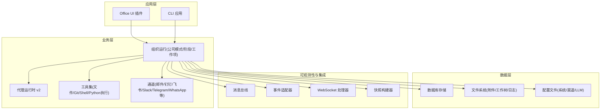
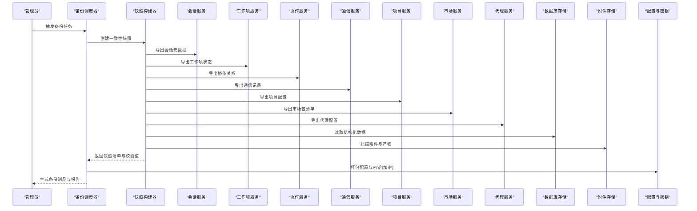
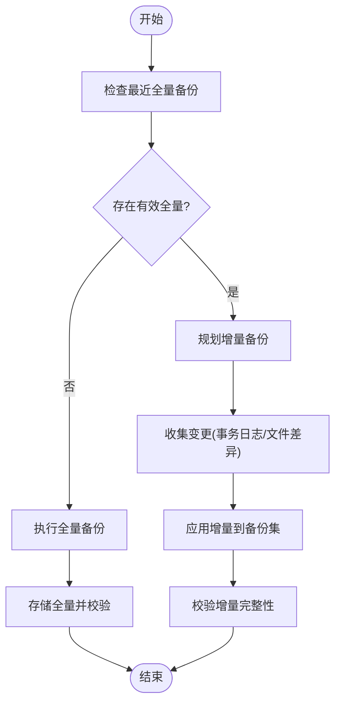
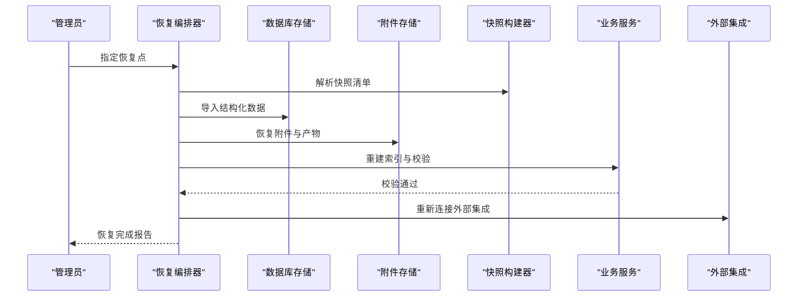
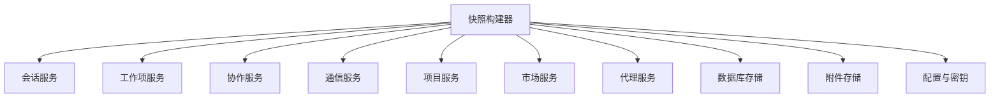

# 备份恢复策略

<cite>
**本文引用的文件**   
- [README.md](file://README.md)
- [pyproject.toml](file://pyproject.toml)
- [opc/database/store.py](file://opc/database/store.py)
- [opc/core/models.py](file://opc/core/models.py)
- [opc/core/attachment_store.py](file://opc/core/attachment_store.py)
- [opc/plugins/office_ui/server.py](file://opc/plugins/office_ui/server.py)
- [opc/plugins/office_ui/snapshot_builder.py](file://opc/plugins/office_ui/snapshot_builder.py)
- [opc/plugins/office_ui/services/runtime.py](file://opc/plugins/office_ui/services/runtime.py)
- [opc/plugins/office_ui/services/org.py](file://opc/plugins/office_ui/services/org.py)
- [opc/plugins/office_ui/services/session.py](file://opc/plugins/office_ui/services/session.py)
- [opc/plugins/office_ui/services/work_item.py](file://opc/plugins/office_ui/services/work_item.py)
- [opc/plugins/office_ui/services/collaboration.py](file://opc/plugins/office_ui/services/collaboration.py)
- [opc/plugins/office_ui/services/comms.py](file://opc/plugins/office_ui/services/comms.py)
- [opc/plugins/office_ui/services/project.py](file://opc/plugins/office_ui/services/project.py)
- [opc/plugins/office_ui/services/market.py](file://opc/plugins/office_ui/services/market.py)
- [opc/plugins/office_ui/services/agent.py](file://opc/plugins/office_ui/services/agent.py)
- [opc/plugins/office_ui/services/factory.py](file://opc/plugins/office_ui/services/factory.py)
- [opc/plugins/office_ui/services/models.py](file://opc/plugins/office_ui/services/models.py)
- [opc/plugins/office_ui/event_adapter.py](file://opc/plugins/office_ui/event_adapter.py)
- [opc/plugins/office_ui/ws_handler.py](file://opc/plugins/office_ui/ws_handler.py)
- [opc/plugins/office_ui/chat_store.py](file://opc/plugins/office_ui/chat_store.py)
- [opc/plugins/office_ui/agent_store.py](file://opc/plugins/office_ui/agent_store.py)
- [opc/plugins/office_ui/dispatcher.py](file://opc/plugins/office_ui/dispatcher.py)
- [opc/plugins/office_ui/terminal.py](file://opc/plugins/office_ui/terminal.py)
- [opc/plugins/office_ui/__init__.py](file://opc/plugins/office_ui/__init__.py)
- [opc/channels/base.py](file://opc/channels/base.py)
- [opc/channels/manager.py](file://opc/channels/manager.py)
- [opc/channels/provider_registry.py](file://opc/channels/provider_registry.py)
- [opc/channels/email.py](file://opc/channels/email.py)
- [opc/channels/dingtalk.py](file://opc/channels/dingtalk.py)
- [opc/channels/discord.py](file://opc/channels/discord.py)
- [opc/channels/feishu.py](file://opc/channels/feishu.py)
- [opc/channels/matrix.py](file://opc/channels/matrix.py)
- [opc/channels/mochat.py](file://opc/channels/mochat.py)
- [opc/channels/qq.py](file://opc/channels/qq.py)
- [opc/channels/slack.py](file://opc/channels/slack.py)
- [opc/channels/telegram.py](file://opc/channels/telegram.py)
- [opc/channels/whatsapp.py](file://opc/channels/whatsapp.py)
- [opc/channels/session.py](file://opc/channels/session.py)
- [opc/channels/provider_base.py](file://opc/channels/provider_base.py)
- [opc/channels/__init__.py](file://opc/channels/__init__.py)
- [opc/core/config.py](file://opc/core/config.py)
- [opc/core/company_tools.py](file://opc/core/company_tools.py)
- [opc/core/events.py](file://opc/core/events.py)
- [opc/core/employee_registry.py](file://opc/core/employee_registry.py)
- [opc/core/org_config.py](file://opc/core/org_config.py)
- [opc/core/transcript_visibility.py](file://opc/core/transcript_visibility.py)
- [opc/core/windows_ssl.py](file://opc/core/windows_ssl.py)
- [opc/core/worker_envelope.py](file://opc/core/worker_envelope.py)
- [opc/layer0_interaction/message_bus.py](file://opc/layer0_interaction/message_bus.py)
- [opc/layer1_perception/context_assembler.py](file://opc/layer1_perception/context_assembler.py)
- [opc/layer1_perception/context_loader.py](file://opc/layer1_perception/context_loader.py)
- [opc/layer1_perception/task_router.py](file://opc/layer1_perception/task_router.py)
- [opc/layer2_organization/approval.py](file://opc/layer2_organization/approval.py)
- [opc/layer2_organization/collaboration_policy.py](file://opc/layer2_organization/collaboration_policy.py)
- [opc/layer2_organization/collaboration_service.py](file://opc/layer2_organization/collaboration_service.py)
- [opc/layer2_organization/comms.py](file://opc/layer2_organization/comms.py)
- [opc/layer2_organization/communication.py](file://opc/layer2_organization/communication.py)
- [opc/layer2_organization/company_mode.py](file://opc/layer2_organization/company_mode.py)
- [opc/layer2_organization/company_runtime.py](file://opc/layer2_organization/company_runtime.py)
- [opc/layer2_organization/company_runtime_identity.py](file://opc/layer2_organization/company_runtime_identity.py)
- [opc/layer2_organization/company_runtime_profiles.py](file://opc/layer2_organization/company_runtime_profiles.py)
- [opc/layer2_organization/custom_runtime.py](file://opc/layer2_organization/custom_runtime.py)
- [opc/layer2_organization/data_acquisition_policy.py](file://opc/layer2_organization/data_acquisition_policy.py)
- [opc/layer2_organization/escalation.py](file://opc/layer2_organization/escalation.py)
- [opc/layer2_organization/gate_harness.py](file://opc/layer2_organization/gate_harness.py)
- [opc/layer2_organization/goal_manager.py](file://opc/layer2_organization/goal_manager.py)
- [opc/layer2_organization/heartbeat.py](file://opc/layer2_organization/heartbeat.py)
- [opc/layer2_organization/metadata_ownership.py](file://opc/layer2_organization/metadata_ownership.py)
- [opc/layer2_organization/org_engine.py](file://opc/layer2_organization/org_engine.py)
- [opc/layer2_organization/org_work_item_planner.py](file://opc/layer2_organization/org_work_item_planner.py)
- [opc/layer2_organization/output_contract.py](file://opc/layer2_organization/output_contract.py)
- [opc/layer2_organization/phase.py](file://opc/layer2_organization/phase.py)
- [opc/layer2_organization/phase_hooks.py](file://opc/layer2_organization/phase_hooks.py)
- [opc/layer2_organization/prompt_contract.py](file://opc/layer2_organization/prompt_contract.py)
- [opc/layer2_organization/reactivation_sweeper.py](file://opc/layer2_organization/reactivation_sweeper.py)
- [opc/layer2_organization/recruiter.py](file://opc/layer2_organization/recruiter.py)
- [opc/layer2_organization/reorg_manager.py](file://opc/layer2_organization/reorg_manager.py)
- [opc/layer2_organization/seat_executor.py](file://opc/layer2_organization/seat_executor.py)
- [opc/layer2_organization/secretary.py](file://opc/layer2_organization/secretary.py)
- [opc/layer2_organization/session_scoping.py](file://opc/layer2_organization/session_scoping.py)
- [opc/layer2_organization/shell_safety.py](file://层2_organization/shell_safety.py)
- [opc/layer2_organization/talent_market.py](file://opc/layer2_organization/talent_market.py)
- [opc/layer2_organization/task_graph.py](file://opc/layer2_organization/task_graph.py)
- [opc/layer2_organization/turn_mode.py](file://opc/layer2_organization/turn_mode.py)
- [opc/layer2_organization/work_item_context_view.py](file://opc/layer2_organization/work_item_context_view.py)
- [opc/layer2_organization/work_item_identity.py](file://opc/layer2_organization/work_item_identity.py)
- [opc/layer2_organization/work_item_links.py](file://opc/layer2_organization/work_item_links.py)
- [opc/layer2_organization/work_item_runtime.py](file://opc/layer2_organization/work_item_runtime.py)
- [opc/layer2_organization/work_item_runtime_invariants.py](file://opc/layer2_organization/work_item_runtime_invariants.py)
- [opc/layer2_organization/work_item_transition.py](file://opc/layer2_organization/work_item_transition.py)
- [opc/layer3_agent/adapters/base.py](file://opc/layer3_agent/adapters/base.py)
- [opc/layer3_agent/adapters/claude_code.py](file://opc/layer3_agent/adapters/claude_code.py)
- [opc/layer3_agent/adapters/codex_adapter.py](file://opc/layer3_agent/adapters/codex_adapter.py)
- [opc/layer3_agent/adapters/cursor_adapter.py](file://opc/layer3_agent/adapters/cursor_adapter.py)
- [opc/layer3_agent/adapters/opencode_adapter.py](file://opc/layer3_agent/adapters/opencode_adapter.py)
- [opc/layer3_agent/adapters/registry.py](file://opc/layer3_agent/adapters/registry.py)
- [opc/layer3_agent/prompt_harness/__init__.py](file://opc/layer3_agent/prompt_harness/__init__.py)
- [opc/layer3_agent/prompt_harness/artifacts.py](file://opc/layer3_agent/prompt_harness/artifacts.py)
- [opc/layer3_agent/prompt_harness/builder.py](file://opc/layer3_agent/prompt_harness/builder.py)
- [opc/layer3_agent/prompt_harness/deltas.py](file://opc/layer3_agent/prompt_harness/deltas.py)
- [opc/layer3_agent/prompt_harness/sections.py](file://opc/layer3_agent/prompt_harness/sections.py)
- [opc/layer3_agent/prompt_harness/tool_strategy.py](file://opc/layer3_agent/prompt_harness/tool_strategy.py)
- [opc/layer3_agent/prompt_harness/types.py](file://opc/layer3_agent/prompt_harness/types.py)
- [opc/layer3_agent/runtime_v2/__init__.py](file://opc/layer3_agent/runtime_v2/__init__.py)
- [opc/layer3_agent/runtime_v2/permissions.py](file://opc/layer3_agent/runtime_v2/permissions.py)
- [opc/layer3_agent/runtime_v2/runtime.py](file://opc/layer3_agent/runtime_v2/runtime.py)
- [opc/layer3_agent/runtime_v2/streaming_tool_executor.py](file://opc/layer3_agent/runtime_v2/streaming_tool_executor.py)
- [opc/layer3_agent/runtime_v2/subagents.py](file://opc/layer3_agent/runtime_v2/subagents.py)
- [opc/layer3_agent/runtime_v2/tool_hooks.py](file://层3_agent/runtime_v2/tool_hooks.py)
- [opc/layer3_agent/runtime_v2/tool_planner.py](file://opc/layer3_agent/runtime_v2/tool_planner.py)
- [opc/layer3_agent/runtime_v2/worktree.py](file://opc/layer3_agent/runtime_v2/worktree.py)
- [opc/layer3_agent/company_runtime_contract.py](file://opc/layer3_agent/company_runtime_contract.py)
- [opc/layer3_agent/external_broker.py](file://opc/layer3_agent/external_broker.py)
- [opc/layer3_agent/external_session_identity.py](file://opc/layer3_agent/external_session_identity.py)
- [opc/layer3_agent/native_agent.py](file://opc/layer3_agent/native_agent.py)
- [opc/layer3_agent/preflight.py](file://opc/layer3_agent/preflight.py)
- [opc/layer3_agent/skill_installer.py](file://opc/layer3_agent/skill_installer.py)
- [opc/layer4_tools/agent_runtime.py](file://opc/layer4_tools/agent_runtime.py)
- [opc/layer4_tools/browser.py](file://opc/layer4_tools/browser.py)
- [opc/layer4_tools/collaboration.py](file://opc/layer4_tools/collaboration.py)
- [opc/layer4_tools/collaboration_dispatch.py](file://opc/layer4_tools/collaboration_dispatch.py)
- [opc/layer4_tools/collaboration_rpc.py](file://opc/layer4_tools/collaboration_rpc.py)
- [opc/layer4_tools/execution_context.py](file://opc/layer4_tools/execution_context.py)
- [opc/layer4_tools/file_ops.py](file://opc/layer4_tools/file_ops.py)
- [opc/layer4_tools/git_ops.py](file://opc/layer4_tools/git_ops.py)
- [opc/layer4_tools/output_budget.py](file://opc/layer4_tools/output_budget.py)
- [opc/layer4_tools/python_exec.py](file://opc/layer4_tools/python_exec.py)
- [opc/layer4_tools/registry.py](file://opc/layer4_tools/registry.py)
- [opc/layer4_tools/shell.py](file://opc/layer4_tools/shell.py)
- [opc/layer4_tools/todo.py](file://opc/layer4_tools/todo.py)
- [opc/layer4_tools/user_input.py](file://opc/layer4_tools/user_input.py)
- [opc/layer4_tools/web_search.py](file://opc/layer4_tools/web_search.py)
- [opc/layer5_memory/approval_allowlist.py](file://opc/layer5_memory/approval_allowlist.py)
- [opc/layer5_memory/capability_manager.py](file://opc/layer5_memory/capability_manager.py)
- [opc/layer5_memory/history_compactor.py](file://opc/layer5_memory/history_compactor.py)
- [opc/layer5_memory/markdown_memory.py](file://opc/layer5_memory/markdown_memory.py)
- [opc/layer5_memory/memory_manager.py](file://opc/layer5_memory/memory_manager.py)
- [opc/layer5_memory/preference.py](file://opc/layer5_memory/preference.py)
- [opc/layer5_memory/secretary_policy.py](file://opc/layer5_memory/secretary_policy.py)
- [opc/layer5_memory/skill_importer.py](file://opc/layer5_memory/skill_importer.py)
- [opc/layer5_memory/skill_library.py](file://opc/layer5_memory/skill_library.py)
- [opc/layer6_observability/cost_tracker.py](file://opc/layer6_observability/cost_tracker.py)
- [opc/layer6_observability/opc_logger.py](file://opc/layer6_observability/opc_logger.py)
- [opc/llm/provider.py](file://opc/llm/provider.py)
- [opc/llm/retry.py](file://opc/llm/retry.py)
- [opc/market/__init__.py](file://opc/market/__init__.py)
- [opc/market/architecture_registry.py](file://opc/market/architecture_registry.py)
- [opc/market/package_exporter.py](file://opc/market/package_exporter.py)
- [opc/market/package_format.py](file://opc/market/package_format.py)
- [opc/market/package_loader.py](file://opc/market/package_loader.py)
- [opc/market/sandbox_checker.py](file://opc/market/sandbox_checker.py)
- [opc/market/talent_presets.py](file://opc/market/talent_presets.py)
- [opc/cli/app.py](file://opc/cli/app.py)
- [opc/engine.py](file://opc/engine.py)
- [opc/mcp_client.py](file://opc/mcp_client.py)
- [scripts/reset_stuck_task.py](file://scripts/reset_stuck_task.py)
</cite>

## 目录
1. [简介](#简介)
2. [项目结构](#项目结构)
3. [核心组件](#核心组件)
4. [架构总览](#架构总览)
5. [详细组件分析](#详细组件分析)
6. [依赖分析](#依赖分析)
7. [性能考虑](#性能考虑)
8. [故障排查指南](#故障排查指南)
9. [结论](#结论)
10. [附录](#附录)

## 简介
本文件为 OpenOPC 生产环境的数据备份与灾难恢复策略文档。目标包括：
- 明确数据库、文件系统与配置数据的备份范围与频率
- 设计全量+增量组合的自动化备份方案
- 提供数据归档、异地容灾与多副本同步策略
- 定义数据恢复流程与验证方法
- 制定加密与传输安全措施
- 设定 RTO/RPO 目标并给出演练流程

## 项目结构
OpenOPC 采用分层架构，包含通道接入、组织运行、代理运行时、工具层、记忆层、可观测性、市场与插件等模块。关键与备份相关的位置如下：
- 持久化存储：数据库与附件存储
- 会话与协作状态：服务层对会话、工作项、协作、通信等的读写
- 快照构建：用于导出一致性快照
- 配置与密钥：系统配置、渠道配置、LLM 配置等
- 外部集成：消息总线、事件适配器、WebSocket 处理器等

图表来源
- [opc/plugins/office_ui/server.py](file://opc/plugins/office_ui/server.py)
- [opc/plugins/office_ui/snapshot_builder.py](file://opc/plugins/office_ui/snapshot_builder.py)
- [opc/plugins/office_ui/services/runtime.py](file://opc/plugins/office_ui/services/runtime.py)
- [opc/plugins/office_ui/services/org.py](file://opc/plugins/office_ui/services/org.py)
- [opc/plugins/office_ui/services/session.py](file://opc/plugins/office_ui/services/session.py)
- [opc/plugins/office_ui/services/work_item.py](file://opc/plugins/office_ui/services/work_item.py)
- [opc/plugins/office_ui/services/collaboration.py](file://opc/plugins/office_ui/services/collaboration.py)
- [opc/plugins/office_ui/services/comms.py](file://opc/plugins/office_ui/services/comms.py)
- [opc/plugins/office_ui/services/project.py](file://opc/plugins/office_ui/services/project.py)
- [opc/plugins/office_ui/services/market.py](file://opc/plugins/office_ui/services/market.py)
- [opc/plugins/office_ui/services/agent.py](file://opc/plugins/office_ui/services/agent.py)
- [opc/plugins/office_ui/services/factory.py](file://opc/plugins/office_ui/services/factory.py)
- [opc/plugins/office_ui/services/models.py](file://opc/plugins/office_ui/services/models.py)
- [opc/plugins/office_ui/event_adapter.py](file://opc/plugins/office_ui/event_adapter.py)
- [opc/plugins/office_ui/ws_handler.py](file://opc/plugins/office_ui/ws_handler.py)
- [opc/plugins/office_ui/chat_store.py](file://opc/plugins/office_ui/chat_store.py)
- [opc/plugins/office_ui/agent_store.py](file://opc/plugins/office_ui/agent_store.py)
- [opc/plugins/office_ui/dispatcher.py](file://opc/plugins/office_ui/dispatcher.py)
- [opc/plugins/office_ui/terminal.py](file://opc/plugins/office_ui/terminal.py)
- [opc/plugins/office_ui/__init__.py](file://opc/plugins/office_ui/__init__.py)
- [opc/channels/base.py](file://opc/channels/base.py)
- [opc/channels/manager.py](file://opc/channels/manager.py)
- [opc/channels/provider_registry.py](file://opc/channels/provider_registry.py)
- [opc/channels/email.py](file://opc/channels/email.py)
- [opc/channels/dingtalk.py](file://opc/channels/dingtalk.py)
- [opc/channels/discord.py](file://opc/channels/discord.py)
- [opc/channels/feishu.py](file://opc/channels/feishu.py)
- [opc/channels/matrix.py](file://opc/channels/matrix.py)
- [opc/channels/mochat.py](file://opc/channels/mochat.py)
- [opc/channels/qq.py](file://opc/channels/qq.py)
- [opc/channels/slack.py](file://opc/channels/slack.py)
- [opc/channels/telegram.py](file://opc/channels/telegram.py)
- [opc/channels/whatsapp.py](file://opc/channels/whatsapp.py)
- [opc/channels/session.py](file://opc/channels/session.py)
- [opc/channels/provider_base.py](file://opc/channels/provider_base.py)
- [opc/channels/__init__.py](file://opc/channels/__init__.py)
- [opc/core/config.py](file://opc/core/config.py)
- [opc/core/company_tools.py](file://opc/core/company_tools.py)
- [opc/core/events.py](file://opc/core/events.py)
- [opc/core/employee_registry.py](file://opc/core/employee_registry.py)
- [opc/core/org_config.py](file://opc/core/org_config.py)
- [opc/core/transcript_visibility.py](file://opc/core/transcript_visibility.py)
- [opc/core/windows_ssl.py](file://opc/core/windows_ssl.py)
- [opc/core/worker_envelope.py](file://opc/core/worker_envelope.py)
- [opc/layer0_interaction/message_bus.py](file://opc/layer0_interaction/message_bus.py)
- [opc/layer1_perception/context_assembler.py](file://opc/layer1_perception/context_assembler.py)
- [opc/layer1_perception/context_loader.py](file://opc/layer1_perception/context_loader.py)
- [opc/layer1_perception/task_router.py](file://opc/layer1_perception/task_router.py)
- [opc/layer2_organization/approval.py](file://opc/layer2_organization/approval.py)
- [opc/layer2_organization/collaboration_policy.py](file://opc/layer2_organization/collaboration_policy.py)
- [opc/layer2_organization/collaboration_service.py](file://opc/layer2_organization/collaboration_service.py)
- [opc/layer2_organization/comms.py](file://opc/layer2_organization/comms.py)
- [opc/layer2_organization/communication.py](file://opc/layer2_organization/communication.py)
- [opc/layer2_organization/company_mode.py](file://opc/layer2_organization/company_mode.py)
- [opc/layer2_organization/company_runtime.py](file://opc/layer2_organization/company_runtime.py)
- [opc/layer2_organization/company_runtime_identity.py](file://opc/layer2_organization/company_runtime_identity.py)
- [opc/layer2_organization/company_runtime_profiles.py](file://opc/layer2_organization/company_runtime_profiles.py)
- [opc/layer2_organization/custom_runtime.py](file://opc/layer2_organization/custom_runtime.py)
- [opc/layer2_organization/data_acquisition_policy.py](file://opc/layer2_organization/data_acquisition_policy.py)
- [opc/layer2_organization/escalation.py](file://opc/layer2_organization/escalation.py)
- [opc/layer2_organization/gate_harness.py](file://opc/layer2_organization/gate_harness.py)
- [opc/layer2_organization/goal_manager.py](file://opc/layer2_organization/goal_manager.py)
- [opc/layer2_organization/heartbeat.py](file://opc/layer2_organization/heartbeat.py)
- [opc/layer2_organization/metadata_ownership.py](file://opc/layer2_organization/metadata_ownership.py)
- [opc/layer2_organization/org_engine.py](file://opc/layer2_organization/org_engine.py)
- [opc/layer2_organization/org_work_item_planner.py](file://opc/layer2_organization/org_work_item_planner.py)
- [opc/layer2_organization/output_contract.py](file://opc/layer2_organization/output_contract.py)
- [opc/layer2_organization/phase.py](file://opc/layer2_organization/phase.py)
- [opc/layer2_organization/phase_hooks.py](file://opc/layer2_organization/phase_hooks.py)
- [opc/layer2_organization/prompt_contract.py](file://opc/layer2_organization/prompt_contract.py)
- [opc/layer2_organization/reactivation_sweeper.py](file://opc/layer2_organization/reactivation_sweeper.py)
- [opc/layer2_organization/recruiter.py](file://opc/layer2_organization/recruiter.py)
- [opc/layer2_organization/reorg_manager.py](file://opc/layer2_organization/reorg_manager.py)
- [opc/layer2_organization/seat_executor.py](file://opc/layer2_organization/seat_executor.py)
- [opc/layer2_organization/secretary.py](file://opc/layer2_organization/secretary.py)
- [opc/layer2_organization/session_scoping.py](file://opc/layer2_organization/session_scoping.py)
- [opc/layer2_organization/shell_safety.py](file://opc/layer2_organization/shell_safety.py)
- [opc/layer2_organization/talent_market.py](file://opc/layer2_organization/talent_market.py)
- [opc/layer2_organization/task_graph.py](file://opc/layer2_organization/task_graph.py)
- [opc/layer2_organization/turn_mode.py](file://opc/layer2_organization/turn_mode.py)
- [opc/layer2_organization/work_item_context_view.py](file://opc/layer2_organization/work_item_context_view.py)
- [opc/layer2_organization/work_item_identity.py](file://opc/layer2_organization/work_item_identity.py)
- [opc/layer2_organization/work_item_links.py](file://opc/layer2_organization/work_item_links.py)
- [opc/layer2_organization/work_item_runtime.py](file://opc/layer2_organization/work_item_runtime.py)
- [opc/layer2_organization/work_item_runtime_invariants.py](file://opc/layer2_organization/work_item_runtime_invariants.py)
- [opc/layer2_organization/work_item_transition.py](file://opc/layer2_organization/work_item_transition.py)
- [opc/layer3_agent/adapters/base.py](file://opc/layer3_agent/adapters/base.py)
- [opc/layer3_agent/adapters/claude_code.py](file://opc/layer3_agent/adapters/claude_code.py)
- [opc/layer3_agent/adapters/codex_adapter.py](file://opc/layer3_agent/adapters/codex_adapter.py)
- [opc/layer3_agent/adapters/cursor_adapter.py](file://opc/layer3_agent/adapters/cursor_adapter.py)
- [opc/layer3_agent/adapters/opencode_adapter.py](file://opc/layer3_agent/adapters/opencode_adapter.py)
- [opc/layer3_agent/adapters/registry.py](file://opc/layer3_agent/adapters/registry.py)
- [opc/layer3_agent/prompt_harness/__init__.py](file://opc/layer3_agent/prompt_harness/__init__.py)
- [opc/layer3_agent/prompt_harness/artifacts.py](file://opc/layer3_agent/prompt_harness/artifacts.py)
- [opc/layer3_agent/prompt_harness/builder.py](file://opc/layer3_agent/prompt_harness/builder.py)
- [opc/layer3_agent/prompt_harness/deltas.py](file://opc/layer3_agent/prompt_harness/deltas.py)
- [opc/layer3_agent/prompt_harness/sections.py](file://opc/layer3_agent/prompt_harness/sections.py)
- [opc/layer3_agent/prompt_harness/tool_strategy.py](file://opc/layer3_agent/prompt_harness/tool_strategy.py)
- [opc/layer3_agent/prompt_harness/types.py](file://opc/layer3_agent/prompt_harness/types.py)
- [opc/layer3_agent/runtime_v2/__init__.py](file://opc/layer3_agent/runtime_v2/__init__.py)
- [opc/layer3_agent/runtime_v2/permissions.py](file://opc/layer3_agent/runtime_v2/permissions.py)
- [opc/layer3_agent/runtime_v2/runtime.py](file://opc/layer3_agent/runtime_v2/runtime.py)
- [opc/layer3_agent/runtime_v2/streaming_tool_executor.py](file://opc/layer3_agent/runtime_v2/streaming_tool_executor.py)
- [opc/layer3_agent/runtime_v2/subagents.py](file://opc/layer3_agent/runtime_v2/subagents.py)
- [opc/layer3_agent/runtime_v2/tool_hooks.py](file://opc/layer3_agent/runtime_v2/tool_hooks.py)
- [opc/layer3_agent/runtime_v2/tool_planner.py](file://opc/layer3_agent/runtime_v2/tool_planner.py)
- [opc/layer3_agent/runtime_v2/worktree.py](file://opc/layer3_agent/runtime_v2/worktree.py)
- [opc/layer3_agent/company_runtime_contract.py](file://opc/layer3_agent/company_runtime_contract.py)
- [opc/layer3_agent/external_broker.py](file://opc/layer3_agent/external_broker.py)
- [opc/layer3_agent/external_session_identity.py](file://opc/layer3_agent/external_session_identity.py)
- [opc/layer3_agent/native_agent.py](file://opc/layer3_agent/native_agent.py)
- [opc/layer3_agent/preflight.py](file://opc/layer3_agent/preflight.py)
- [opc/layer3_agent/skill_installer.py](file://opc/layer3_agent/skill_installer.py)
- [opc/layer4_tools/agent_runtime.py](file://opc/layer4_tools/agent_runtime.py)
- [opc/layer4_tools/browser.py](file://opc/layer4_tools/browser.py)
- [opc/layer4_tools/collaboration.py](file://opc/layer4_tools/collaboration.py)
- [opc/layer4_tools/collaboration_dispatch.py](file://opc/layer4_tools/collaboration_dispatch.py)
- [opc/layer4_tools/collaboration_rpc.py](file://opc/layer4_tools/collaboration_rpc.py)
- [opc/layer4_tools/execution_context.py](file://opc/layer4_tools/execution_context.py)
- [opc/layer4_tools/file_ops.py](file://opc/layer4_tools/file_ops.py)
- [opc/layer4_tools/git_ops.py](file://opc/layer4_tools/git_ops.py)
- [opc/layer4_tools/output_budget.py](file://opc/layer4_tools/output_budget.py)
- [opc/layer4_tools/python_exec.py](file://opc/layer4_tools/python_exec.py)
- [opc/layer4_tools/registry.py](file://opc/layer4_tools/registry.py)
- [opc/layer4_tools/shell.py](file://opc/layer4_tools/shell.py)
- [opc/layer4_tools/todo.py](file://opc/layer4_tools/todo.py)
- [opc/layer4_tools/user_input.py](file://opc/layer4_tools/user_input.py)
- [opc/layer4_tools/web_search.py](file://opc/layer4_tools/web_search.py)
- [opc/layer5_memory/approval_allowlist.py](file://opc/layer5_memory/approval_allowlist.py)
- [opc/layer5_memory/capability_manager.py](file://opc/layer5_memory/capability_manager.py)
- [opc/layer5_memory/history_compactor.py](file://opc/layer5_memory/history_compactor.py)
- [opc/layer5_memory/markdown_memory.py](file://opc/layer5_memory/markdown_memory.py)
- [opc/layer5_memory/memory_manager.py](file://opc/layer5_memory/memory_manager.py)
- [opc/layer5_memory/preference.py](file://opc/layer5_memory/preference.py)
- [opc/layer5_memory/secretary_policy.py](file://opc/layer5_memory/secretary_policy.py)
- [opc/layer5_memory/skill_importer.py](file://opc/layer5_memory/skill_importer.py)
- [opc/layer5_memory/skill_library.py](file://opc/layer5_memory/skill_library.py)
- [opc/layer6_observability/cost_tracker.py](file://opc/layer6_observability/cost_tracker.py)
- [opc/layer6_observability/opc_logger.py](file://opc/layer6_observability/opc_logger.py)
- [opc/llm/provider.py](file://opc/llm/provider.py)
- [opc/llm/retry.py](file://opc/llm/retry.py)
- [opc/market/__init__.py](file://opc/market/__init__.py)
- [opc/market/architecture_registry.py](file://opc/market/architecture_registry.py)
- [opc/market/package_exporter.py](file://opc/market/package_exporter.py)
- [opc/market/package_format.py](file://opc/market/package_format.py)
- [opc/market/package_loader.py](file://opc/market/package_loader.py)
- [opc/market/sandbox_checker.py](file://opc/market/sandbox_checker.py)
- [opc/market/talent_presets.py](file://opc/market/talent_presets.py)
- [opc/cli/app.py](file://opc/cli/app.py)
- [opc/engine.py](file://opc/engine.py)
- [opc/mcp_client.py](file://opc/mcp_client.py)
- [scripts/reset_stuck_task.py](file://scripts/reset_stuck_task.py)

章节来源
- [README.md](file://README.md)
- [pyproject.toml](file://pyproject.toml)

## 核心组件
- 数据库存储：负责结构化数据的持久化，是备份恢复的核心对象
- 附件存储：承载非结构化数据（如上传文件、产物）
- 会话与工作项：记录对话历史、任务上下文、流转状态
- 快照构建器：在一致时间点导出应用级快照
- 配置与密钥：系统、渠道、LLM 等配置及敏感信息
- 外部集成：消息总线、事件适配器、WebSocket 处理器等运行时状态

章节来源
- [opc/database/store.py](file://opc/database/store.py)
- [opc/core/attachment_store.py](file://opc/core/attachment_store.py)
- [opc/plugins/office_ui/snapshot_builder.py](file://opc/plugins/office_ui/snapshot_builder.py)
- [opc/plugins/office_ui/services/session.py](file://opc/plugins/office_ui/services/session.py)
- [opc/plugins/office_ui/services/work_item.py](file://opc/plugins/office_ui/services/work_item.py)
- [opc/plugins/office_ui/services/collaboration.py](file://opc/plugins/office_ui/services/collaboration.py)
- [opc/plugins/office_ui/services/comms.py](file://opc/plugins/office_ui/services/comms.py)
- [opc/plugins/office_ui/services/project.py](file://opc/plugins/office_ui/services/project.py)
- [opc/plugins/office_ui/services/market.py](file://opc/plugins/office_ui/services/market.py)
- [opc/plugins/office_ui/services/agent.py](file://opc/plugins/office_ui/services/agent.py)
- [opc/plugins/office_ui/services/factory.py](file://opc/plugins/office_ui/services/factory.py)
- [opc/plugins/office_ui/services/models.py](file://opc/plugins/office_ui/services/models.py)
- [opc/plugins/office_ui/event_adapter.py](file://opc/plugins/office_ui/event_adapter.py)
- [opc/plugins/office_ui/ws_handler.py](file://opc/plugins/office_ui/ws_handler.py)
- [opc/plugins/office_ui/chat_store.py](file://opc/plugins/office_ui/chat_store.py)
- [opc/plugins/office_ui/agent_store.py](file://opc/plugins/office_ui/agent_store.py)
- [opc/plugins/office_ui/dispatcher.py](file://opc/plugins/office_ui/dispatcher.py)
- [opc/plugins/office_ui/terminal.py](file://opc/plugins/office_ui/terminal.py)
- [opc/plugins/office_ui/__init__.py](file://opc/plugins/office_ui/__init__.py)
- [opc/channels/base.py](file://opc/channels/base.py)
- [opc/channels/manager.py](file://opc/channels/manager.py)
- [opc/channels/provider_registry.py](file://opc/channels/provider_registry.py)
- [opc/channels/email.py](file://opc/channels/email.py)
- [opc/channels/dingtalk.py](file://opc/channels/dingtalk.py)
- [opc/channels/discord.py](file://opc/channels/discord.py)
- [opc/channels/feishu.py](file://opc/channels/feishu.py)
- [opc/channels/matrix.py](file://opc/channels/matrix.py)
- [opc/channels/mochat.py](file://opc/channels/mochat.py)
- [opc/channels/qq.py](file://opc/channels/qq.py)
- [opc/channels/slack.py](file://opc/channels/slack.py)
- [opc/channels/telegram.py](file://opc/channels/telegram.py)
- [opc/channels/whatsapp.py](file://opc/channels/whatsapp.py)
- [opc/channels/session.py](file://opc/channels/session.py)
- [opc/channels/provider_base.py](file://opc/channels/provider_base.py)
- [opc/channels/__init__.py](file://opc/channels/__init__.py)
- [opc/core/config.py](file://opc/core/config.py)
- [opc/core/company_tools.py](file://opc/core/company_tools.py)
- [opc/core/events.py](file://opc/core/events.py)
- [opc/core/employee_registry.py](file://opc/core/employee_registry.py)
- [opc/core/org_config.py](file://opc/core/org_config.py)
- [opc/core/transcript_visibility.py](file://opc/core/transcript_visibility.py)
- [opc/core/windows_ssl.py](file://opc/core/windows_ssl.py)
- [opc/core/worker_envelope.py](file://opc/core/worker_envelope.py)
- [opc/layer0_interaction/message_bus.py](file://opc/layer0_interaction/message_bus.py)
- [opc/layer1_perception/context_assembler.py](file://opc/layer1_perception/context_assembler.py)
- [opc/layer1_perception/context_loader.py](file://opc/layer1_perception/context_loader.py)
- [opc/layer1_perception/task_router.py](file://opc/layer1_perception/task_router.py)
- [opc/layer2_organization/approval.py](file://opc/layer2_organization/approval.py)
- [opc/layer2_organization/collaboration_policy.py](file://opc/layer2_organization/collaboration_policy.py)
- [opc/layer2_organization/collaboration_service.py](file://opc/layer2_organization/collaboration_service.py)
- [opc/layer2_organization/comms.py](file://opc/layer2_organization/comms.py)
- [opc/layer2_organization/communication.py](file://opc/layer2_organization/communication.py)
- [opc/layer2_organization/company_mode.py](file://opc/layer2_organization/company_mode.py)
- [opc/layer2_organization/company_runtime.py](file://opc/layer2_organization/company_runtime.py)
- [opc/layer2_organization/company_runtime_identity.py](file://opc/layer2_organization/company_runtime_identity.py)
- [opc/layer2_organization/company_runtime_profiles.py](file://opc/layer2_organization/company_runtime_profiles.py)
- [opc/layer2_organization/custom_runtime.py](file://opc/layer2_organization/custom_runtime.py)
- [opc/layer2_organization/data_acquisition_policy.py](file://opc/layer2_organization/data_acquisition_policy.py)
- [opc/layer2_organization/escalation.py](file://opc/layer2_organization/escalation.py)
- [opc/layer2_organization/gate_harness.py](file://opc/layer2_organization/gate_harness.py)
- [opc/layer2_organization/goal_manager.py](file://opc/layer2_organization/goal_manager.py)
- [opc/layer2_organization/heartbeat.py](file://opc/layer2_organization/heartbeat.py)
- [opc/layer2_organization/metadata_ownership.py](file://opc/layer2_organization/metadata_ownership.py)
- [opc/layer2_organization/org_engine.py](file://opc/layer2_organization/org_engine.py)
- [opc/layer2_organization/org_work_item_planner.py](file://opc/layer2_organization/org_work_item_planner.py)
- [opc/layer2_organization/output_contract.py](file://opc/layer2_organization/output_contract.py)
- [opc/layer2_organization/phase.py](file://opc/layer2_organization/phase.py)
- [opc/layer2_organization/phase_hooks.py](file://opc/layer2_organization/phase_hooks.py)
- [opc/layer2_organization/prompt_contract.py](file://opc/layer2_organization/prompt_contract.py)
- [opc/layer2_organization/reactivation_sweeper.py](file://opc/layer2_organization/reactivation_sweeper.py)
- [opc/layer2_organization/recruiter.py](file://opc/layer2_organization/recruiter.py)
- [opc/layer2_organization/reorg_manager.py](file://opc/layer2_organization/reorg_manager.py)
- [opc/layer2_organization/seat_executor.py](file://opc/layer2_organization/seat_executor.py)
- [opc/layer2_organization/secretary.py](file://opc/layer2_organization/secretary.py)
- [opc/layer2_organization/session_scoping.py](file://opc/layer2_organization/session_scoping.py)
- [opc/layer2_organization/shell_safety.py](file://opc/layer2_organization/shell_safety.py)
- [opc/layer2_organization/talent_market.py](file://opc/layer2_organization/talent_market.py)
- [opc/layer2_organization/task_graph.py](file://opc/layer2_organization/task_graph.py)
- [opc/layer2_organization/turn_mode.py](file://opc/layer2_organization/turn_mode.py)
- [opc/layer2_organization/work_item_context_view.py](file://opc/layer2_organization/work_item_context_view.py)
- [opc/layer2_organization/work_item_identity.py](file://opc/layer2_organization/work_item_identity.py)
- [opc/layer2_organization/work_item_links.py](file://opc/layer2_organization/work_item_links.py)
- [opc/layer2_organization/work_item_runtime.py](file://opc/layer2_organization/work_item_runtime.py)
- [opc/layer2_organization/work_item_runtime_invariants.py](file://opc/layer2_organization/work_item_runtime_invariants.py)
- [opc/layer2_organization/work_item_transition.py](file://opc/layer2_organization/work_item_transition.py)
- [opc/layer3_agent/adapters/base.py](file://opc/layer3_agent/adapters/base.py)
- [opc/layer3_agent/adapters/claude_code.py](file://opc/layer3_agent/adapters/claude_code.py)
- [opc/layer3_agent/adapters/codex_adapter.py](file://opc/layer3_agent/adapters/codex_adapter.py)
- [opc/layer3_agent/adapters/cursor_adapter.py](file://opc/layer3_agent/adapters/cursor_adapter.py)
- [opc/layer3_agent/adapters/opencode_adapter.py](file://opc/layer3_agent/adapters/opencode_adapter.py)
- [opc/layer3_agent/adapters/registry.py](file://opc/layer3_agent/adapters/registry.py)
- [opc/layer3_agent/prompt_harness/__init__.py](file://opc/layer3_agent/prompt_harness/__init__.py)
- [opc/layer3_agent/prompt_harness/artifacts.py](file://opc/layer3_agent/prompt_harness/artifacts.py)
- [opc/layer3_agent/prompt_harness/builder.py](file://opc/layer3_agent/prompt_harness/builder.py)
- [opc/layer3_agent/prompt_harness/deltas.py](file://opc/layer3_agent/prompt_harness/deltas.py)
- [opc/layer3_agent/prompt_harness/sections.py](file://opc/layer3_agent/prompt_harness/sections.py)
- [opc/layer3_agent/prompt_harness/tool_strategy.py](file://opc/layer3_agent/prompt_harness/tool_strategy.py)
- [opc/layer3_agent/prompt_harness/types.py](file://opc/layer3_agent/prompt_harness/types.py)
- [opc/layer3_agent/runtime_v2/__init__.py](file://opc/layer3_agent/runtime_v2/__init__.py)
- [opc/layer3_agent/runtime_v2/permissions.py](file://opc/layer3_agent/runtime_v2/permissions.py)
- [opc/layer3_agent/runtime_v2/runtime.py](file://opc/layer3_agent/runtime_v2/runtime.py)
- [opc/layer3_agent/runtime_v2/streaming_tool_executor.py](file://opc/layer3_agent/runtime_v2/streaming_tool_executor.py)
- [opc/layer3_agent/runtime_v2/subagents.py](file://opc/layer3_agent/runtime_v2/subagents.py)
- [opc/layer3_agent/runtime_v2/tool_hooks.py](file://opc/layer3_agent/runtime_v2/tool_hooks.py)
- [opc/layer3_agent/runtime_v2/tool_planner.py](file://opc/layer3_agent/runtime_v2/tool_planner.py)
- [opc/layer3_agent/runtime_v2/worktree.py](file://opc/layer3_agent/runtime_v2/worktree.py)
- [opc/layer3_agent/company_runtime_contract.py](file://opc/layer3_agent/company_runtime_contract.py)
- [opc/layer3_agent/external_broker.py](file://opc/layer3_agent/external_broker.py)
- [opc/layer3_agent/external_session_identity.py](file://opc/layer3_agent/external_session_identity.py)
- [opc/layer3_agent/native_agent.py](file://opc/layer3_agent/native_agent.py)
- [opc/layer3_agent/preflight.py](file://opc/layer3_agent/preflight.py)
- [opc/layer3_agent/skill_installer.py](file://opc/layer3_agent/skill_installer.py)
- [opc/layer4_tools/agent_runtime.py](file://opc/layer4_tools/agent_runtime.py)
- [opc/layer4_tools/browser.py](file://opc/layer4_tools/browser.py)
- [opc/layer4_tools/collaboration.py](file://opc/layer4_tools/collaboration.py)
- [opc/layer4_tools/collaboration_dispatch.py](file://opc/layer4_tools/collaboration_dispatch.py)
- [opc/layer4_tools/collaboration_rpc.py](file://opc/layer4_tools/collaboration_rpc.py)
- [opc/layer4_tools/execution_context.py](file://opc/layer4_tools/execution_context.py)
- [opc/layer4_tools/file_ops.py](file://opc/layer4_tools/file_ops.py)
- [opc/layer4_tools/git_ops.py](file://opc/layer4_tools/git_ops.py)
- [opc/layer4_tools/output_budget.py](file://opc/layer4_tools/output_budget.py)
- [opc/layer4_tools/python_exec.py](file://opc/layer4_tools/python_exec.py)
- [opc/layer4_tools/registry.py](file://opc/layer4_tools/registry.py)
- [opc/layer4_tools/shell.py](file://opc/layer4_tools/shell.py)
- [opc/layer4_tools/todo.py](file://opc/layer4_tools/todo.py)
- [opc/layer4_tools/user_input.py](file://opc/layer4_tools/user_input.py)
- [opc/layer4_tools/web_search.py](file://opc/layer4_tools/web_search.py)
- [opc/layer5_memory/approval_allowlist.py](file://opc/layer5_memory/approval_allowlist.py)
- [opc/layer5_memory/capability_manager.py](file://opc/layer5_memory/capability_manager.py)
- [opc/layer5_memory/history_compactor.py](file://opc/layer5_memory/history_compactor.py)
- [opc/layer5_memory/markdown_memory.py](file://opc/layer5_memory/markdown_memory.py)
- [opc/layer5_memory/memory_manager.py](file://opc/layer5_memory/memory_manager.py)
- [opc/layer5_memory/preference.py](file://opc/layer5_memory/preference.py)
- [opc/layer5_memory/secretary_policy.py](file://opc/layer5_memory/secretary_policy.py)
- [opc/layer5_memory/skill_importer.py](file://opc/layer5_memory/skill_importer.py)
- [opc/layer5_memory/skill_library.py](file://opc/layer5_memory/skill_library.py)
- [opc/layer6_observability/cost_tracker.py](file://opc/layer6_observability/cost_tracker.py)
- [opc/layer6_observability/opc_logger.py](file://opc/layer6_observability/opc_logger.py)
- [opc/llm/provider.py](file://opc/llm/provider.py)
- [opc/llm/retry.py](file://opc/llm/retry.py)
- [opc/market/__init__.py](file://opc/market/__init__.py)
- [opc/market/architecture_registry.py](file://opc/market/architecture_registry.py)
- [opc/market/package_exporter.py](file://opc/market/package_exporter.py)
- [opc/market/package_format.py](file://opc/market/package_format.py)
- [opc/market/package_loader.py](file://opc/market/package_loader.py)
- [opc/market/sandbox_checker.py](file://opc/market/sandbox_checker.py)
- [opc/market/talent_presets.py](file://opc/market/talent_presets.py)
- [opc/cli/app.py](file://opc/cli/app.py)
- [opc/engine.py](file://opc/engine.py)
- [opc/mcp_client.py](file://opc/mcp_client.py)
- [scripts/reset_stuck_task.py](file://scripts/reset_stuck_task.py)

## 架构总览
下图展示了备份恢复相关的组件交互：快照构建器协调各服务导出一致视图；数据库与附件存储作为主要备份对象；配置与密钥独立管理；外部集成在恢复后重新连接。

图表来源
- [opc/plugins/office_ui/snapshot_builder.py](file://opc/plugins/office_ui/snapshot_builder.py)
- [opc/plugins/office_ui/services/session.py](file://opc/plugins/office_ui/services/session.py)
- [opc/plugins/office_ui/services/work_item.py](file://opc/plugins/office_ui/services/work_item.py)
- [opc/plugins/office_ui/services/collaboration.py](file://opc/plugins/office_ui/services/collaboration.py)
- [opc/plugins/office_ui/services/comms.py](file://opc/plugins/office_ui/services/comms.py)
- [opc/plugins/office_ui/services/project.py](file://opc/plugins/office_ui/services/project.py)
- [opc/plugins/office_ui/services/market.py](file://opc/plugins/office_ui/services/market.py)
- [opc/plugins/office_ui/services/agent.py](file://opc/plugins/office_ui/services/agent.py)
- [opc/database/store.py](file://opc/database/store.py)
- [opc/core/attachment_store.py](file://opc/core/attachment_store.py)
- [opc/core/config.py](file://opc/core/config.py)

## 详细组件分析

### 数据库备份策略
- 备份范围
  - 结构化数据：会话、工作项、协作、通信、项目、市场、代理等实体
  - 索引与约束：确保恢复后可重建一致性
- 备份类型
  - 全量备份：每日一次，保证完整基线
  - 增量备份：每小时一次，基于事务日志或变更捕获
- 一致性保障
  - 使用快照构建器在一致时间点导出数据
  - 暂停写入窗口或使用只读副本进行冷备
- 生命周期管理
  - 保留策略：近端保留7天，远端保留30天，合规要求更长则按策略扩展
  - 清理策略：自动删除过期备份并校验完整性

章节来源
- [opc/database/store.py](file://opc/database/store.py)
- [opc/plugins/office_ui/snapshot_builder.py](file://opc/plugins/office_ui/snapshot_builder.py)

### 文件系统备份与归档
- 备份范围
  - 附件与产物：用户上传文件、模型输出、工作树产物
  - 日志与审计：运行日志、访问日志、操作审计
- 归档最佳实践
  - 冷热分层：热数据本地快速访问，冷数据归档至低成本存储
  - 压缩与去重：减少空间占用，提升传输效率
  - 命名规范：包含时间戳、版本、校验值，便于检索与追溯

章节来源
- [opc/core/attachment_store.py](file://opc/core/attachment_store.py)
- [opc/layer4_tools/file_ops.py](file://opc/layer4_tools/file_ops.py)
- [opc/layer4_tools/git_ops.py](file://opc/layer4_tools/git_ops.py)

### 增量与全量组合方案
- 组合策略
  - 全量每周一次，增量每日多次
  - 基于快照的时间点标记，支持按时间点恢复
- 合并与校验
  - 合并增量到最近全量，生成新的全量基线
  - 计算并存储校验值（哈希），定期自检

图表来源
- [opc/plugins/office_ui/snapshot_builder.py](file://opc/plugins/office_ui/snapshot_builder.py)
- [opc/database/store.py](file://opc/database/store.py)
- [opc/core/attachment_store.py](file://opc/core/attachment_store.py)

### 数据恢复流程与验证
- 恢复步骤
  - 选择恢复点：根据 RPO 目标选择最近的全量+增量组合
  - 停止写入：进入维护模式，避免并发写入导致不一致
  - 导入结构化数据：先恢复数据库，再恢复附件与产物
  - 重建索引与校验：重建索引，运行一致性校验
  - 启动服务：逐步恢复外部集成连接
- 验证方法
  - 功能验证：登录、会话加载、工作项状态、协作关系
  - 数据抽样：随机抽取会话与工作项核对
  - 性能回归：基准测试对比恢复前后性能

图表来源
- [opc/plugins/office_ui/snapshot_builder.py](file://opc/plugins/office_ui/snapshot_builder.py)
- [opc/database/store.py](file://opc/database/store.py)
- [opc/core/attachment_store.py](file://opc/core/attachment_store.py)
- [opc/plugins/office_ui/services/session.py](file://opc/plugins/office_ui/services/session.py)
- [opc/plugins/office_ui/services/work_item.py](file://opc/plugins/office_ui/services/work_item.py)
- [opc/plugins/office_ui/services/collaboration.py](file://opc/plugins/office_ui/services/collaboration.py)
- [opc/plugins/office_ui/services/comms.py](file://opc/plugins/office_ui/services/comms.py)
- [opc/plugins/office_ui/services/project.py](file://opc/plugins/office_ui/services/project.py)
- [opc/plugins/office_ui/services/market.py](file://opc/plugins/office_ui/services/market.py)
- [opc/plugins/office_ui/services/agent.py](file://opc/plugins/office_ui/services/agent.py)

### 异地容灾与多副本同步
- 多副本策略
  - 本地副本：近端快速恢复
  - 区域副本：跨可用区复制，降低单点故障风险
  - 异地副本：跨地域复制，满足灾难恢复需求
- 同步机制
  - 异步复制：低延迟，允许短暂不一致
  - 一致性复制：强一致，适合关键数据
- 监控与告警
  - 复制延迟监控
  - 失败重试与人工介入流程

章节来源
- [opc/plugins/office_ui/snapshot_builder.py](file://opc/plugins/office_ui/snapshot_builder.py)
- [opc/database/store.py](file://opc/database/store.py)
- [opc/core/attachment_store.py](file://opc/core/attachment_store.py)

### 备份数据加密与传输安全
- 静态加密
  - 备份文件使用强加密算法（如 AES-256）
  - 密钥管理与轮换策略
- 传输安全
  - 使用 TLS 加密传输通道
  - 身份认证与访问控制
- 完整性校验
  - 计算并存储校验值（哈希）
  - 定期自检与修复

章节来源
- [opc/core/config.py](file://opc/core/config.py)
- [opc/core/windows_ssl.py](file://opc/core/windows_ssl.py)

### RTO/RPO 目标与演练流程
- RTO（恢复时间目标）
  - 定义从故障发生到服务恢复的时间上限
  - 通过预置环境与并行恢复缩短 RTO
- RPO（恢复点目标）
  - 定义可接受的最大数据丢失时间
  - 通过高频增量备份降低 RPO
- 演练流程
  - 定期演练：季度/半年度
  - 场景覆盖：单节点故障、区域故障、数据损坏
  - 复盘改进：记录问题与优化措施

章节来源
- [opc/plugins/office_ui/snapshot_builder.py](file://opc/plugins/office_ui/snapshot_builder.py)
- [opc/database/store.py](file://opc/database/store.py)

## 依赖分析
备份恢复涉及的主要依赖关系如下：

图表来源
- [opc/plugins/office_ui/snapshot_builder.py](file://opc/plugins/office_ui/snapshot_builder.py)
- [opc/plugins/office_ui/services/session.py](file://opc/plugins/office_ui/services/session.py)
- [opc/plugins/office_ui/services/work_item.py](file://opc/plugins/office_ui/services/work_item.py)
- [opc/plugins/office_ui/services/collaboration.py](file://opc/plugins/office_ui/services/collaboration.py)
- [opc/plugins/office_ui/services/comms.py](file://opc/plugins/office_ui/services/comms.py)
- [opc/plugins/office_ui/services/project.py](file://opc/plugins/office_ui/services/project.py)
- [opc/plugins/office_ui/services/market.py](file://opc/plugins/office_ui/services/market.py)
- [opc/plugins/office_ui/services/agent.py](file://opc/plugins/office_ui/services/agent.py)
- [opc/database/store.py](file://opc/database/store.py)
- [opc/core/attachment_store.py](file://opc/core/attachment_store.py)
- [opc/core/config.py](file://opc/core/config.py)

章节来源
- [opc/plugins/office_ui/snapshot_builder.py](file://opc/plugins/office_ui/snapshot_builder.py)
- [opc/database/store.py](file://opc/database/store.py)
- [opc/core/attachment_store.py](file://opc/core/attachment_store.py)

## 性能考虑
- 备份窗口规划：避开业务高峰，利用低负载时段
- 并行处理：多组件并行导出，缩短备份时间
- 流式传输：大文件分块传输，降低内存占用
- 缓存与索引：恢复时重建索引，提高查询性能

[本节为通用指导，不直接分析具体文件]

## 故障排查指南
- 常见问题
  - 备份失败：检查权限、网络、存储空间
  - 恢复不一致：确认快照一致性，检查依赖服务状态
  - 传输中断：重试机制与断点续传
- 诊断工具
  - 日志分析：定位错误堆栈与上下文
  - 健康检查：服务可用性、依赖连通性
  - 指标监控：备份时长、成功率、RTO/RPO 达成情况

章节来源
- [opc/layer6_observability/opc_logger.py](file://opc/layer6_observability/opc_logger.py)
- [opc/layer6_observability/cost_tracker.py](file://opc/layer6_observability/cost_tracker.py)

## 结论
通过全量+增量组合、一致性快照、加密与传输安全、异地容灾与多副本同步，以及严格的 RTO/RPO 目标与演练流程，OpenOPC 可在生产环境中实现高可靠的数据备份与灾难恢复。建议持续优化备份策略与监控体系，确保业务连续性与数据安全。

[本节为总结，不直接分析具体文件]

## 附录
- 术语表
  - RTO：恢复时间目标
  - RPO：恢复点目标
  - 快照：一致时间点的数据视图
  - 增量备份：仅备份自上次备份以来的变更
  - 全量备份：备份全部数据
- 参考文件
  - 数据库存储：[opc/database/store.py](file://opc/database/store.py)
  - 附件存储：[opc/core/attachment_store.py](file://opc/core/attachment_store.py)
  - 快照构建器：[opc/plugins/office_ui/snapshot_builder.py](file://opc/plugins/office_ui/snapshot_builder.py)
  - 配置管理：[opc/core/config.py](file://opc/core/config.py)